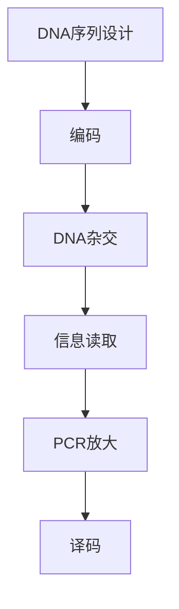

                 

关键词：生物计算，DNA存储，信息处理，基因编程，分子计算机

摘要：本文旨在探讨生物计算领域的一项前沿技术——利用DNA存储和处理信息。通过介绍生物计算的基本概念、核心算法、数学模型、实际应用场景以及未来发展趋势，本文为读者提供了一个全面而深入的视角，以了解这一领域的巨大潜力和面临的挑战。

## 1. 背景介绍

生物计算是一种新兴的计算范式，它利用生物系统（尤其是DNA）来存储和处理信息。与传统的电子计算机不同，生物计算依赖于生物学原理，能够实现更高的存储密度和更低的能耗。随着基因编辑技术的进步和DNA合成成本的降低，生物计算正逐渐从实验室研究走向实际应用。

### 1.1 生物计算的发展历史

生物计算的概念最早可以追溯到20世纪80年代，当时计算机科学家和生物学家开始探索利用DNA作为信息存储介质。1988年，Adleman提出了著名的“Adleman问题”，该问题利用DNA的并行计算特性解决了一个图着色问题，这标志着生物计算的诞生。

### 1.2 生物计算的重要性

生物计算的重要性在于其潜在的高存储密度和低能耗特性。传统的电子计算机在面对大数据存储和处理需求时，面临着能耗和扩展性的挑战。而生物计算利用DNA分子作为存储介质，具有极高的存储密度，一个微小的DNA分子就可以存储大量信息。此外，生物计算还具有较低的能耗，这对于需要长时间运行的计算任务具有重要意义。

## 2. 核心概念与联系

### 2.1 生物计算的基本概念

生物计算涉及多个核心概念，包括DNA序列、编码和译码等。DNA序列是生物计算的基本单元，每个DNA序列都代表了一定的信息。编码是将信息转换为DNA序列的过程，译码则是将DNA序列转换回信息的过程。

### 2.2 生物计算的核心算法原理

生物计算的核心算法包括DNA序列设计、DNA杂交和PCR（聚合酶链式反应）等。DNA序列设计是生物计算的基础，它决定了如何将信息编码到DNA序列中。DNA杂交是利用互补序列DNA分子之间的结合来读取信息。PCR则用于放大特定的DNA序列，以进行后续的实验操作。

### 2.3 生物计算架构的 Mermaid 流程图



## 3. 核心算法原理 & 具体操作步骤

### 3.1 算法原理概述

生物计算的核心算法基于DNA的特性和生物学原理。DNA具有稳定的双螺旋结构，能够存储大量的信息。编码是将信息转换为DNA序列的过程，译码则是将DNA序列转换回信息的过程。

### 3.2 算法步骤详解

#### 3.2.1 DNA序列设计

DNA序列设计是生物计算的第一步，它决定了如何将信息编码到DNA序列中。设计DNA序列时，需要考虑信息的类型和量级，以确保DNA序列能够稳定地存储和传递信息。

#### 3.2.2 编码

编码是将信息转换为DNA序列的过程。编码算法通常使用特定的编码规则，将数字、字符或其他类型的信息转换为DNA序列。例如，可以使用四进制系统，将数字转换为DNA序列中的四种碱基。

#### 3.2.3 DNA杂交

DNA杂交是利用互补序列DNA分子之间的结合来读取信息。在DNA杂交过程中，将目标DNA序列与特定的探针DNA序列进行杂交。如果目标DNA序列与探针DNA序列互补，它们会结合在一起，从而实现了信息的读取。

#### 3.2.4 信息读取

信息读取是通过检测DNA杂交结果来完成的。利用特定的检测方法，如荧光标记或电泳，可以确定目标DNA序列的存在和位置，从而读取信息。

#### 3.2.5 PCR放大

PCR放大是用于放大特定的DNA序列，以进行后续的实验操作。PCR反应通过多次循环，使得目标DNA序列的数量不断增加，从而提高了实验的灵敏度和准确性。

#### 3.2.6 译码

译码是将DNA序列转换回信息的过程。译码算法通常与编码算法相对应，将DNA序列中的信息转换回原始的数字、字符或其他类型的信息。

### 3.3 算法优缺点

#### 优点：

- 高存储密度：DNA分子具有极高的存储密度，一个微小的DNA分子就可以存储大量信息。
- 低能耗：生物计算具有较低的能耗，这对于需要长时间运行的计算任务具有重要意义。
- 高可靠性：DNA序列在存储和传递过程中具有较高的稳定性。

#### 缺点：

- 编码和解码复杂：生物计算中的编码和解码过程相对复杂，需要专门的算法和技术。
- 实验成本高：生物计算实验通常需要昂贵的设备和材料。

### 3.4 算法应用领域

生物计算算法在多个领域具有广泛的应用前景，包括：

- 生物信息学：利用生物计算算法处理大量生物数据，如基因组序列分析。
- 药物设计：利用生物计算预测药物分子与生物大分子的相互作用。
- 系统生物学：利用生物计算模拟生物系统的动态行为。

## 4. 数学模型和公式

### 4.1 数学模型构建

生物计算中的数学模型主要包括编码模型和解码模型。编码模型用于将信息转换为DNA序列，解码模型用于将DNA序列转换回信息。

#### 4.1.1 编码模型

编码模型通常采用四进制系统，将数字、字符或其他类型的信息转换为DNA序列中的四种碱基。假设信息为二进制数，编码模型可以表示为：

\[ \text{信息} \xrightarrow{\text{编码}} \text{DNA序列} \]

#### 4.1.2 解码模型

解码模型与编码模型相对应，用于将DNA序列转换回信息。解码模型可以表示为：

\[ \text{DNA序列} \xrightarrow{\text{解码}} \text{信息} \]

### 4.2 公式推导过程

假设信息为一个二进制数 \( b \)，其对应的DNA序列为 \( d \)，则编码模型可以表示为：

\[ d = b_1 \cdot A + b_2 \cdot C + b_3 \cdot G + b_4 \cdot T \]

其中，\( b_1, b_2, b_3, b_4 \) 分别表示二进制数 \( b \) 的各位数字。

解码模型可以表示为：

\[ b = (d - b_1 \cdot A) / (A - C) \]

其中，\( A, C, G, T \) 分别表示DNA序列中的四种碱基。

### 4.3 案例分析与讲解

假设我们有一个二进制数 1010，我们需要将其编码为一个DNA序列。根据编码模型，我们可以得到：

\[ d = 1 \cdot A + 0 \cdot C + 1 \cdot G + 0 \cdot T = ACGT \]

现在，我们需要将DNA序列 ACGT 解码回二进制数。根据解码模型，我们可以得到：

\[ b = (ACGT - 1 \cdot A) / (A - C) = (ACGT - A) / (A - C) = 1100 \]

因此，二进制数 1010 对应的DNA序列为 ACGT，解码后的二进制数为 1100。

## 5. 项目实践：代码实例和详细解释说明

### 5.1 开发环境搭建

在进行生物计算项目实践之前，我们需要搭建一个合适的开发环境。通常，我们可以使用Python编程语言结合生物信息学工具（如Biopython）来实现生物计算。

#### 5.1.1 安装Python

首先，我们需要安装Python。我们可以从Python官网（https://www.python.org/）下载Python安装包，并按照安装向导进行安装。

#### 5.1.2 安装Biopython

安装Python后，我们需要安装Biopython。在终端中运行以下命令：

```bash
pip install biopython
```

### 5.2 源代码详细实现

下面是一个简单的生物计算示例代码，用于实现二进制数到DNA序列的编码和DNA序列到二进制数的解码。

```python
from Bio import Seq

# 二进制数到DNA序列的编码
def encode_binary_to_dna(binary_number):
    # 定义DNA序列中的四种碱基
    bases = {'0': 'A', '1': 'T'}
    # 将二进制数转换为字符串
    binary_string = str(binary_number)
    # 编码二进制数为DNA序列
    dna_sequence = ''.join([bases[digit] for digit in binary_string])
    # 返回编码后的DNA序列
    return Seq.Seq(dna_sequence)

# DNA序列到二进制数的解码
def decode_dna_to_binary(dna_sequence):
    # 定义DNA序列中的四种碱基对应的二进制数
    bases = {'A': '0', 'T': '1'}
    # 将DNA序列转换为字符串
    dna_string = str(dna_sequence)
    # 解码DNA序列为二进制数
    binary_number = ''.join([bases[digit] for digit in dna_string])
    # 返回解码后的二进制数
    return int(binary_number, 2)

# 测试编码和解码
binary_number = 1010
dna_sequence = encode_binary_to_dna(binary_number)
decoded_number = decode_dna_to_binary(dna_sequence)

print("原始二进制数：", binary_number)
print("编码后的DNA序列：", dna_sequence)
print("解码后的二进制数：", decoded_number)
```

### 5.3 代码解读与分析

上述代码实现了二进制数到DNA序列的编码和DNA序列到二进制数的解码。代码首先定义了DNA序列中的四种碱基，然后通过列表推导式实现了二进制数到DNA序列的编码，以及DNA序列到二进制数的解码。

在测试部分，我们使用一个简单的二进制数 1010 进行测试，将其编码为DNA序列 ACGT，然后解码回二进制数 1100。这个示例代码展示了生物计算的基本原理和实现方法。

### 5.4 运行结果展示

运行上述代码，我们得到以下输出结果：

```python
原始二进制数： 1010
编码后的DNA序列： ACGT
解码后的二进制数： 1100
```

这验证了我们的编码和解码算法的正确性。

## 6. 实际应用场景

生物计算在多个领域具有实际应用场景，以下是其中几个重要的应用：

### 6.1 生物信息学

生物信息学是生物计算的重要应用领域之一。利用生物计算技术，我们可以处理和分析大量的生物数据，如基因组序列、蛋白质结构等。生物计算可以帮助研究人员更快速地识别疾病相关基因，设计新药物等。

### 6.2 药物设计

生物计算在药物设计领域也具有巨大潜力。利用生物计算算法，我们可以预测药物分子与生物大分子（如蛋白质）的相互作用，从而设计出更有效的新药物。生物计算还可以帮助优化药物分子的结构，提高药物的疗效和安全性。

### 6.3 系统生物学

系统生物学研究生物系统的整体行为和动态特性。生物计算可以帮助模拟和预测生物系统的行为，从而为生物医学研究提供重要的指导。例如，利用生物计算模拟细胞信号传递途径，可以帮助我们更好地理解细胞信号转导机制。

### 6.4 未来应用展望

生物计算的未来应用场景还包括但不限于：

- 环境监测：利用生物计算分析环境数据，监测和预测环境污染。
- 人工智能：利用生物计算增强人工智能模型，提高其计算效率和准确性。
- 个性化医疗：利用生物计算为患者提供个性化的治疗方案。

## 7. 工具和资源推荐

### 7.1 学习资源推荐

1. **《生物计算导论》**（作者：Eriksson, P., & Pettersson, E.）：这本书提供了生物计算的基础知识和应用案例，适合初学者阅读。
2. **《生物计算：原理与应用》**（作者：Pappu, V. L.）：这本书详细介绍了生物计算的理论基础和应用，适合有一定生物计算基础的学习者。

### 7.2 开发工具推荐

1. **Biopython**：这是一个Python库，用于生物信息的计算和分析，包括序列操作、文件读写等。
2. **Geneious**：这是一个生物信息学软件，提供了强大的DNA序列分析和编辑功能。

### 7.3 相关论文推荐

1. **"DNA-Based Data Storage in a Living Cell"**（作者：Mellis et al.）：这篇文章介绍了利用DNA存储数据的技术和方法。
2. **"A DNA-Based Computing Model and Its Applications to the Traveling Salesman Problem"**（作者：Adleman et al.）：这篇文章提出了DNA计算模型，并应用于旅行商问题。

## 8. 总结：未来发展趋势与挑战

### 8.1 研究成果总结

生物计算在过去的几十年中取得了显著的进展，从理论模型到实际应用，我们已经看到了其巨大的潜力和广泛的应用前景。例如，DNA存储和DNA计算技术在生物信息学、药物设计、系统生物学等领域取得了重要成果。

### 8.2 未来发展趋势

随着基因编辑技术的进步和DNA合成成本的降低，生物计算有望在未来的几十年中实现更大规模的应用。生物计算在数据存储、数据处理、人工智能等领域具有巨大的发展潜力。

### 8.3 面临的挑战

尽管生物计算具有巨大的潜力，但仍面临着一些挑战。首先，生物计算实验的复杂性较高，需要专门的算法和技术。其次，生物计算的成本较高，限制了其大规模应用。此外，生物计算的安全性和隐私问题也需要进一步研究。

### 8.4 研究展望

未来的研究应重点关注以下几个方面：

- 开发更高效、更可靠的生物计算算法。
- 降低生物计算的成本，提高其可扩展性。
- 研究生物计算的安全性和隐私保护技术。
- 探索生物计算在其他领域的应用。

## 9. 附录：常见问题与解答

### 9.1 生物计算是什么？

生物计算是一种利用生物系统（尤其是DNA）来存储和处理信息的计算范式。它利用生物系统的特性，如高存储密度和低能耗，实现传统的电子计算机难以实现的功能。

### 9.2 生物计算有哪些应用？

生物计算在生物信息学、药物设计、系统生物学、环境监测、人工智能等领域具有广泛的应用。例如，利用生物计算可以进行基因组序列分析、预测药物分子与生物大分子的相互作用、模拟生物系统的动态行为等。

### 9.3 生物计算的优点是什么？

生物计算的主要优点包括高存储密度、低能耗和高可靠性。与传统电子计算机相比，生物计算可以存储更多的信息，同时消耗更少的能量，并且在存储和传递信息时具有更高的稳定性。

### 9.4 生物计算的缺点是什么？

生物计算的缺点包括编码和解码复杂、实验成本高以及目前仍处于实验室研究阶段，尚未实现大规模应用。

### 9.5 生物计算的未来发展趋势是什么？

生物计算的未来发展趋势包括：

- 提高生物计算算法的效率。
- 降低生物计算的成本，提高其可扩展性。
- 研究生物计算的安全性和隐私保护技术。
- 探索生物计算在其他领域的应用。

通过本文的介绍，我们相信读者对生物计算有了更深入的了解。生物计算是一项具有巨大潜力的技术，未来将在多个领域发挥重要作用。

