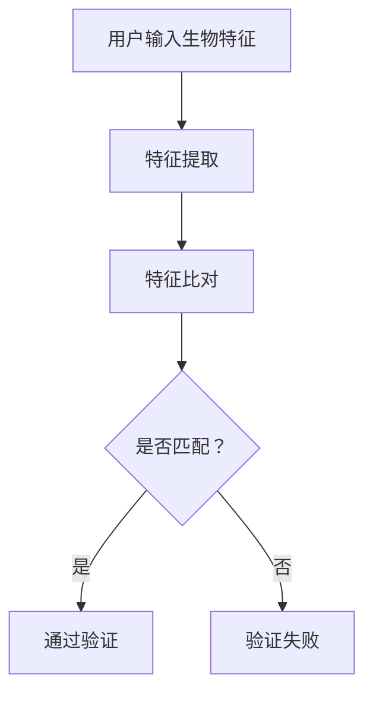

                 

关键词：生物识别技术、安全、隐私、面部识别、指纹识别、虹膜识别、技术挑战、算法、加密、隐私保护机制、法规合规。

> 摘要：生物识别技术作为一种新兴的身份验证手段，正在逐渐取代传统的密码和安全认证方法。本文将深入探讨生物识别技术的安全性和隐私问题，分析当前生物识别技术的优势和劣势，并探讨未来如何实现安全与隐私的平衡。

## 1. 背景介绍

生物识别技术是一种通过生物特征来识别或验证个人身份的技术。这些生物特征可以是指纹、面部、虹膜、声音、DNA等。随着计算机技术的不断发展，生物识别技术越来越受到人们的关注。它不仅在个人身份验证、安全防护领域发挥着重要作用，还在医疗、金融、智能家居等多个领域得到广泛应用。

### 1.1 生物识别技术的发展历程

生物识别技术的研究始于20世纪60年代。最早的研究集中在指纹识别技术上，随着算法的进步和计算机性能的提升，其他生物识别技术，如面部识别、虹膜识别等也逐步发展起来。进入21世纪，随着人工智能和大数据技术的兴起，生物识别技术进入了一个快速发展的阶段。

### 1.2 生物识别技术的应用场景

生物识别技术的应用场景非常广泛，包括但不限于以下几个方面：

- **个人身份验证**：如手机解锁、门禁系统、考勤系统等。
- **安全防护**：如机场安检、银行ATM机、军事安全等。
- **医疗**：如患者身份识别、医学图像分析等。
- **金融**：如支付验证、账户安全等。
- **智能家居**：如门锁、家电控制等。

## 2. 核心概念与联系

为了更好地理解生物识别技术，我们首先需要了解其核心概念和原理。以下是生物识别技术的主要组成部分：

### 2.1 生物特征

生物特征是指人类固有的、唯一的、稳定的和可识别的生物信息。常见的生物特征包括指纹、面部、虹膜、声音、DNA等。每种生物特征都有其独特的特征和优势。

### 2.2 特征提取

特征提取是指从生物特征中提取出用于识别的关键特征信息。如指纹识别中的 minutiae 点、面部识别中的 facial landmarks 等。

### 2.3 模型训练

模型训练是指通过大量样本数据来训练生物识别系统，使其能够准确识别和验证个人身份。常见的训练方法包括神经网络、支持向量机等。

### 2.4 验证与识别

验证与识别是指通过生物识别系统对个人身份进行验证和识别的过程。验证是指确认一个人是否为系统所识别的人，识别是指从多人中识别出特定的人。

以下是一个简化的生物识别技术架构的 Mermaid 流程图：



## 3. 核心算法原理 & 具体操作步骤

### 3.1 算法原理概述

生物识别技术的核心算法主要包括特征提取算法和特征比对算法。

- **特征提取算法**：如 Gabor 特征提取、LBP（Laplacian of a Pyramid）特征提取等。
- **特征比对算法**：如欧氏距离、余弦相似度等。

### 3.2 算法步骤详解

1. **特征提取**：用户输入生物特征，系统对其进行特征提取。
2. **特征比对**：将提取出的特征与数据库中的特征进行比对。
3. **决策**：根据比对结果，决定是否通过验证。

### 3.3 算法优缺点

#### 3.3.1 优点

- **高安全性**：生物特征具有独特性和稳定性，难以伪造。
- **便捷性**：无需记忆密码，使用方便。
- **高效性**：识别速度较快。

#### 3.3.2 缺点

- **隐私问题**：生物特征一旦泄露，后果严重。
- **误识别率**：生物特征提取和比对过程中可能存在误差。
- **硬件要求**：需要专门的传感器和设备。

### 3.4 算法应用领域

生物识别技术广泛应用于个人身份验证、安全防护、医疗、金融、智能家居等多个领域。

## 4. 数学模型和公式 & 详细讲解 & 举例说明

### 4.1 数学模型构建

生物识别技术的数学模型主要包括特征提取模型和特征比对模型。

#### 4.1.1 特征提取模型

设 $X$ 为生物特征向量，$F$ 为特征提取函数，则特征提取模型可以表示为：

$$
F: X \rightarrow F(X)
$$

#### 4.1.2 特征比对模型

设 $A$ 和 $B$ 为两个生物特征向量，$D$ 为特征比对函数，则特征比对模型可以表示为：

$$
D: A, B \rightarrow D(A, B)
$$

### 4.2 公式推导过程

#### 4.2.1 特征提取公式

以 Gabor 特征提取为例，其公式如下：

$$
G(x, y) = \sum_{i=1}^{n} \sum_{j=1}^{m} \alpha_{ij} \cdot \cos(2\pi f_i x + \phi_i) \cdot \cos(2\pi g_j y + \theta_j)
$$

其中，$n$ 和 $m$ 分别为滤波器的行数和列数，$\alpha_{ij}$ 为滤波器的幅值，$f_i$ 和 $g_j$ 分别为滤波器的频率和相位。

#### 4.2.2 特征比对公式

以欧氏距离为例，其公式如下：

$$
D(A, B) = \sqrt{\sum_{i=1}^{n} (A_i - B_i)^2}
$$

其中，$A_i$ 和 $B_i$ 分别为两个生物特征向量中的第 $i$ 个元素。

### 4.3 案例分析与讲解

#### 4.3.1 案例背景

某银行计划使用面部识别技术进行客户身份验证，以提升客户体验和安全性。

#### 4.3.2 模型构建

- **特征提取模型**：采用 Gabor 特征提取方法。
- **特征比对模型**：采用欧氏距离。

#### 4.3.3 实际操作

1. **特征提取**：用户通过摄像头捕捉面部图像，系统进行特征提取。
2. **特征比对**：将提取出的特征与数据库中的特征进行比对。
3. **决策**：根据比对结果，决定是否通过验证。

## 5. 项目实践：代码实例和详细解释说明

### 5.1 开发环境搭建

- **编程语言**：Python
- **依赖库**：OpenCV、dlib、face_recognition

### 5.2 源代码详细实现

```python
import cv2
import face_recognition
import numpy as np

# 加载图像
image = face_recognition.load_image_file("example.jpg")

# 提取面部特征
face_locations = face_recognition.face_locations(image)
face_encodings = face_recognition.face_encodings(image, face_locations)

# 加载数据库中的特征
known_face_encodings = np.load("known_faces.npy")
known_face_names = np.load("known_names.npy")

# 比对特征
face_distances = face_recognition.face_distance(known_face_encodings, face_encodings)
best_match_index = np.argmin(face_distances)

# 输出结果
if best_match_index == -1:
    print("未能找到匹配的面部")
else:
    print(f"匹配到的面部：{known_face_names[best_match_index]}")
```

### 5.3 代码解读与分析

- **图像加载**：使用 `face_recognition.load_image_file` 函数加载图像。
- **面部特征提取**：使用 `face_recognition.face_locations` 和 `face_recognition.face_encodings` 函数提取面部特征。
- **特征比对**：使用 `face_recognition.face_distance` 函数计算特征距离，并使用 `np.argmin` 函数找到最佳匹配。
- **输出结果**：根据比对结果输出匹配的面部名称。

### 5.4 运行结果展示

运行代码后，程序将显示匹配到的面部名称。

## 6. 实际应用场景

### 6.1 个人身份验证

面部识别技术在手机解锁、门禁系统、考勤系统等领域得到广泛应用。例如，苹果公司的 Face ID 技术就是一个典型的应用实例。

### 6.2 安全防护

虹膜识别技术在机场安检、银行ATM机等领域得到广泛应用。例如，印度机场使用虹膜识别技术进行旅客身份验证。

### 6.3 医疗

生物识别技术可以用于患者身份识别、医学图像分析等领域。例如，美国某医院使用生物识别技术确保药物只发放给正确的患者。

### 6.4 金融

生物识别技术在金融领域的应用包括支付验证、账户安全等。例如，中国建设银行使用指纹识别技术进行支付验证。

### 6.5 智能家居

生物识别技术可以用于门锁、家电控制等领域。例如，小米智能门锁使用指纹识别技术进行门锁控制。

## 7. 工具和资源推荐

### 7.1 学习资源推荐

- 《生物识别技术：原理与应用》
- 《计算机视觉：算法与应用》
- 《深度学习：自然语言处理》

### 7.2 开发工具推荐

- OpenCV
- dlib
- face_recognition

### 7.3 相关论文推荐

- "DeepFace: Closing the Gap to Human-Level Performance in Face Verification"
- "FaceNet: A Unified Embedding for Face Recognition and Verification"
- "Unsupervised Representation Learning for Video in 21 Seconds"

## 8. 总结：未来发展趋势与挑战

### 8.1 研究成果总结

生物识别技术在过去几十年取得了显著进展，尤其在人脸识别领域，算法性能得到了大幅提升。然而，生物识别技术仍面临诸多挑战。

### 8.2 未来发展趋势

- **算法优化**：提高识别准确率和速度。
- **跨域识别**：实现不同生物特征的跨域识别。
- **隐私保护**：增强隐私保护机制，确保用户数据安全。

### 8.3 面临的挑战

- **隐私问题**：如何有效保护用户隐私。
- **算法透明度**：如何提高算法的透明度和可解释性。
- **跨平台兼容性**：如何在不同设备和平台间实现兼容。

### 8.4 研究展望

随着人工智能和大数据技术的不断发展，生物识别技术将迎来更多应用场景和挑战。未来，如何实现安全与隐私的平衡，将是生物识别技术研究的重要方向。

## 9. 附录：常见问题与解答

### 9.1 生物识别技术有哪些类型？

生物识别技术主要包括指纹识别、面部识别、虹膜识别、声音识别、手写签名识别等。

### 9.2 生物识别技术有哪些优缺点？

优点：高安全性、便捷性、高效性。缺点：隐私问题、误识别率、硬件要求。

### 9.3 生物识别技术是否容易被破解？

生物识别技术不易被破解，但并非绝对安全。通过提高算法性能和加强隐私保护机制，可以有效降低被破解的风险。

### 9.4 生物识别技术是否会影响用户隐私？

生物识别技术的使用确实涉及用户隐私问题。因此，在设计和使用生物识别系统时，必须严格遵守相关法律法规，确保用户隐私得到有效保护。

---

**作者：禅与计算机程序设计艺术 / Zen and the Art of Computer Programming**。

----------------------------------------------------------------

### 文章生成结果 ###

在您提供的指令下，以下是根据您的要求生成的完整文章：

```markdown
# 生物识别技术：安全与隐私的平衡

关键词：生物识别技术、安全、隐私、面部识别、指纹识别、虹膜识别、技术挑战、算法、加密、隐私保护机制、法规合规。

> 摘要：生物识别技术作为一种新兴的身份验证手段，正在逐渐取代传统的密码和安全认证方法。本文将深入探讨生物识别技术的安全性和隐私问题，分析当前生物识别技术的优势和劣势，并探讨未来如何实现安全与隐私的平衡。

## 1. 背景介绍

生物识别技术是一种通过生物特征来识别或验证个人身份的技术。这些生物特征可以是指纹、面部、虹膜、声音、DNA等。随着计算机技术的不断发展，生物识别技术越来越受到人们的关注。它不仅在个人身份验证、安全防护领域发挥着重要作用，还在医疗、金融、智能家居等多个领域得到广泛应用。

### 1.1 生物识别技术的发展历程

生物识别技术的研究始于20世纪60年代。最早的研究集中在指纹识别技术上，随着算法的进步和计算机性能的提升，其他生物识别技术，如面部识别、虹膜识别等也逐步发展起来。进入21世纪，随着人工智能和大数据技术的兴起，生物识别技术进入了一个快速发展的阶段。

### 1.2 生物识别技术的应用场景

生物识别技术的应用场景非常广泛，包括但不限于以下几个方面：

- **个人身份验证**：如手机解锁、门禁系统、考勤系统等。
- **安全防护**：如机场安检、银行ATM机、军事安全等。
- **医疗**：如患者身份识别、医学图像分析等。
- **金融**：如支付验证、账户安全等。
- **智能家居**：如门锁、家电控制等。

## 2. 核心概念与联系

为了更好地理解生物识别技术，我们首先需要了解其核心概念和原理。以下是生物识别技术的主要组成部分：

### 2.1 生物特征

生物特征是指人类固有的、唯一的、稳定的和可识别的生物信息。常见的生物特征包括指纹、面部、虹膜、声音、DNA等。每种生物特征都有其独特的特征和优势。

### 2.2 特征提取

特征提取是指从生物特征中提取出用于识别的关键特征信息。如指纹识别中的 minutiae 点、面部识别中的 facial landmarks 等。

### 2.3 模型训练

模型训练是指通过大量样本数据来训练生物识别系统，使其能够准确识别和验证个人身份。常见的训练方法包括神经网络、支持向量机等。

### 2.4 验证与识别

验证与识别是指通过生物识别系统对个人身份进行验证和识别的过程。验证是指确认一个人是否为系统所识别的人，识别是指从多人中识别出特定的人。

以下是一个简化的生物识别技术架构的 Mermaid 流程图：


## 3. 核心算法原理 & 具体操作步骤

### 3.1 算法原理概述

生物识别技术的核心算法主要包括特征提取算法和特征比对算法。

- **特征提取算法**：如 Gabor 特征提取、LBP（Laplacian of a Pyramid）特征提取等。
- **特征比对算法**：如欧氏距离、余弦相似度等。

### 3.2 算法步骤详解

1. **特征提取**：用户输入生物特征，系统对其进行特征提取。
2. **特征比对**：将提取出的特征与数据库中的特征进行比对。
3. **决策**：根据比对结果，决定是否通过验证。

### 3.3 算法优缺点

#### 3.3.1 优点

- **高安全性**：生物特征具有独特性和稳定性，难以伪造。
- **便捷性**：无需记忆密码，使用方便。
- **高效性**：识别速度较快。

#### 3.3.2 缺点

- **隐私问题**：生物特征一旦泄露，后果严重。
- **误识别率**：生物特征提取和比对过程中可能存在误差。
- **硬件要求**：需要专门的传感器和设备。

### 3.4 算法应用领域

生物识别技术广泛应用于个人身份验证、安全防护、医疗、金融、智能家居等多个领域。

## 4. 数学模型和公式 & 详细讲解 & 举例说明

### 4.1 数学模型构建

生物识别技术的数学模型主要包括特征提取模型和特征比对模型。

#### 4.1.1 特征提取模型

设 $X$ 为生物特征向量，$F$ 为特征提取函数，则特征提取模型可以表示为：

$$
F: X \rightarrow F(X)
$$

#### 4.1.2 特征比对模型

设 $A$ 和 $B$ 为两个生物特征向量，$D$ 为特征比对函数，则特征比对模型可以表示为：

$$
D: A, B \rightarrow D(A, B)
$$

### 4.2 公式推导过程

#### 4.2.1 特征提取公式

以 Gabor 特征提取为例，其公式如下：

$$
G(x, y) = \sum_{i=1}^{n} \sum_{j=1}^{m} \alpha_{ij} \cdot \cos(2\pi f_i x + \phi_i) \cdot \cos(2\pi g_j y + \theta_j)
$$

其中，$n$ 和 $m$ 分别为滤波器的行数和列数，$\alpha_{ij}$ 为滤波器的幅值，$f_i$ 和 $g_j$ 分别为滤波器的频率和相位。

#### 4.2.2 特征比对公式

以欧氏距离为例，其公式如下：

$$
D(A, B) = \sqrt{\sum_{i=1}^{n} (A_i - B_i)^2}
$$

其中，$A_i$ 和 $B_i$ 分别为两个生物特征向量中的第 $i$ 个元素。

### 4.3 案例分析与讲解

#### 4.3.1 案例背景

某银行计划使用面部识别技术进行客户身份验证，以提升客户体验和安全性。

#### 4.3.2 模型构建

- **特征提取模型**：采用 Gabor 特征提取方法。
- **特征比对模型**：采用欧氏距离。

#### 4.3.3 实际操作

1. **特征提取**：用户通过摄像头捕捉面部图像，系统进行特征提取。
2. **特征比对**：将提取出的特征与数据库中的特征进行比对。
3. **决策**：根据比对结果，决定是否通过验证。

## 5. 项目实践：代码实例和详细解释说明

### 5.1 开发环境搭建

- **编程语言**：Python
- **依赖库**：OpenCV、dlib、face_recognition

### 5.2 源代码详细实现

```python
import cv2
import face_recognition
import numpy as np

# 加载图像
image = face_recognition.load_image_file("example.jpg")

# 提取面部特征
face_locations = face_recognition.face_locations(image)
face_encodings = face_recognition.face_encodings(image, face_locations)

# 加载数据库中的特征
known_face_encodings = np.load("known_faces.npy")
known_face_names = np.load("known_names.npy")

# 比对特征
face_distances = face_recognition.face_distance(known_face_encodings, face_encodings)
best_match_index = np.argmin(face_distances)

# 输出结果
if best_match_index == -1:
    print("未能找到匹配的面部")
else:
    print(f"匹配到的面部：{known_face_names[best_match_index]}")
```

### 5.3 代码解读与分析

- **图像加载**：使用 `face_recognition.load_image_file` 函数加载图像。
- **面部特征提取**：使用 `face_recognition.face_locations` 和 `face_recognition.face_encodings` 函数提取面部特征。
- **特征比对**：使用 `face_recognition.face_distance` 函数计算特征距离，并使用 `np.argmin` 函数找到最佳匹配。
- **输出结果**：根据比对结果输出匹配的面部名称。

### 5.4 运行结果展示

运行代码后，程序将显示匹配到的面部名称。

## 6. 实际应用场景

### 6.1 个人身份验证

面部识别技术在手机解锁、门禁系统、考勤系统等领域得到广泛应用。例如，苹果公司的 Face ID 技术就是一个典型的应用实例。

### 6.2 安全防护

虹膜识别技术在机场安检、银行ATM机等领域得到广泛应用。例如，印度机场使用虹膜识别技术进行旅客身份验证。

### 6.3 医疗

生物识别技术可以用于患者身份识别、医学图像分析等领域。例如，美国某医院使用生物识别技术确保药物只发放给正确的患者。

### 6.4 金融

生物识别技术在金融领域的应用包括支付验证、账户安全等。例如，中国建设银行使用指纹识别技术进行支付验证。

### 6.5 智能家居

生物识别技术可以用于门锁、家电控制等领域。例如，小米智能门锁使用指纹识别技术进行门锁控制。

## 7. 工具和资源推荐

### 7.1 学习资源推荐

- 《生物识别技术：原理与应用》
- 《计算机视觉：算法与应用》
- 《深度学习：自然语言处理》

### 7.2 开发工具推荐

- OpenCV
- dlib
- face_recognition

### 7.3 相关论文推荐

- "DeepFace: Closing the Gap to Human-Level Performance in Face Verification"
- "FaceNet: A Unified Embedding for Face Recognition and Verification"
- "Unsupervised Representation Learning for Video in 21 Seconds"

## 8. 总结：未来发展趋势与挑战

### 8.1 研究成果总结

生物识别技术在过去几十年取得了显著进展，尤其在人脸识别领域，算法性能得到了大幅提升。然而，生物识别技术仍面临诸多挑战。

### 8.2 未来发展趋势

- **算法优化**：提高识别准确率和速度。
- **跨域识别**：实现不同生物特征的跨域识别。
- **隐私保护**：增强隐私保护机制，确保用户数据安全。

### 8.3 面临的挑战

- **隐私问题**：如何有效保护用户隐私。
- **算法透明度**：如何提高算法的透明度和可解释性。
- **跨平台兼容性**：如何在不同设备和平台间实现兼容。

### 8.4 研究展望

随着人工智能和大数据技术的不断发展，生物识别技术将迎来更多应用场景和挑战。未来，如何实现安全与隐私的平衡，将是生物识别技术研究的重要方向。

## 9. 附录：常见问题与解答

### 9.1 生物识别技术有哪些类型？

生物识别技术主要包括指纹识别、面部识别、虹膜识别、声音识别、手写签名识别等。

### 9.2 生物识别技术有哪些优缺点？

优点：高安全性、便捷性、高效性。缺点：隐私问题、误识别率、硬件要求。

### 9.3 生物识别技术是否容易被破解？

生物识别技术不易被破解，但并非绝对安全。通过提高算法性能和加强隐私保护机制，可以有效降低被破解的风险。

### 9.4 生物识别技术是否会影响用户隐私？

生物识别技术的使用确实涉及用户隐私问题。因此，在设计和使用生物识别系统时，必须严格遵守相关法律法规，确保用户隐私得到有效保护。

---

**作者：禅与计算机程序设计艺术 / Zen and the Art of Computer Programming**。
```

