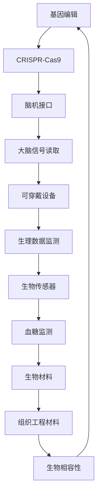

                 

生物黑客，这是一个近年来在科技界逐渐兴起的词汇。它代表了将生物学、计算机科学、工程学和人工智能等技术相结合，通过技术创新来改变和增强人体功能的新兴领域。随着科技的不断进步，人体增强技术逐渐从科幻电影走向现实，成为了一种可能改变人类生活方式的重要力量。

本文将探讨生物黑客领域的核心概念、技术原理、算法、数学模型以及实际应用。我们将从背景介绍、核心概念与联系、核心算法原理、数学模型和公式、项目实践、实际应用场景、未来应用展望、工具和资源推荐、总结与展望等方面，全面解读人体增强技术的前沿探索。

## 1. 背景介绍

人体增强技术的概念最早可以追溯到20世纪60年代。当时，美国国家航空航天局（NASA）为了提高宇航员在太空环境中的工作效率和生存能力，开始研究利用科技手段增强人类能力的方法。随着计算机科学、人工智能和生物技术的发展，人体增强技术逐渐从科幻变为现实。

近年来，随着基因编辑技术的突破、可穿戴设备的普及、生物材料的应用以及神经科学的研究进展，人体增强技术迎来了前所未有的发展机遇。生物黑客们通过这些技术手段，试图实现人类在力量、速度、耐力、感知能力等方面的提升，从而推动人类生活方式的变革。

### 1.1 生物黑客的定义与特点

生物黑客，又称为“生物工程师”或“生命科学家”，是指那些利用计算机科学、工程学和生物学等领域的知识，通过技术创新来改变和增强人体功能的人。生物黑客的特点包括：

1. **跨界思维**：生物黑客通常具有跨学科的知识背景，能够将不同领域的科技融合在一起，创造出新的解决方案。
2. **技术实践**：生物黑客不仅仅是理论研究者，更是实践者。他们通过实验和原型制作，将科技转化为现实。
3. **创新驱动**：生物黑客追求技术创新，不断探索新的技术手段，以实现更高的功能提升。
4. **伦理关注**：生物黑客在追求技术创新的同时，也高度重视伦理问题，确保技术的应用不会对人类社会产生负面影响。

### 1.2 人体增强技术的历史与发展

人体增强技术的历史可以追溯到古希腊和古罗马时期，当时人们就已经开始使用药物和机械装置来增强体力。随着科技的发展，人体增强技术经历了几个重要阶段：

1. **机械增强**：20世纪初，人们开始使用机械装置来增强人体功能，如假肢、义眼等。
2. **电子增强**：20世纪中叶，电子技术的兴起使得人体增强技术迈向新的阶段。可穿戴设备、心脏起搏器等成为现实。
3. **基因增强**：21世纪初，基因编辑技术的突破，如CRISPR-Cas9，使得人体增强技术进入一个新的时代。通过修改基因，人们可以改变生物体的特性，从而实现功能上的增强。
4. **生物材料与神经科学**：近年来，生物材料和神经科学的发展，使得人体增强技术更加多样化和精细。生物传感器、脑机接口等技术的应用，为人体增强提供了新的可能性。

## 2. 核心概念与联系

### 2.1 基因编辑

基因编辑是人体增强技术的核心概念之一。它通过修改生物体的基因组，实现对生物体特性的改变。CRISPR-Cas9技术是目前最常用的基因编辑工具，它利用一种名为CRISPR（Clustered Regularly Interspaced Short Palindromic Repeats）的DNA序列，指导Cas9核酸酶精准切割目标DNA序列，从而实现对基因的修改。

### 2.2 脑机接口

脑机接口（Brain-Computer Interface, BCI）是一种直接连接大脑和外部设备的接口技术。通过读取大脑信号，如脑电波，脑机接口可以实现对设备的控制。这种技术为人类提供了全新的交互方式，也为人体增强提供了可能。

### 2.3 可穿戴设备

可穿戴设备是一种佩戴在人体上的设备，可以实时监测和记录人体的生理数据。如智能手环、智能眼镜等。这些设备通过收集数据，为人体增强提供了实时反馈和调整的可能性。

### 2.4 生物传感器

生物传感器是一种能够检测生物体内某些特定物质或生理参数的传感器。如血糖传感器、心率传感器等。生物传感器的应用，使得对人体健康状况的监测和管理更加精确和实时。

### 2.5 生物材料

生物材料是一种具有生物活性和生物相容性的材料，可以与生物体组织和细胞相互作用。如组织工程材料、生物降解材料等。生物材料的应用，为人体增强提供了新的材料基础。

### 2.6 Mermaid 流程图

下面是一个Mermaid流程图的示例，用于展示基因编辑、脑机接口、可穿戴设备、生物传感器和生物材料之间的联系：



## 3. 核心算法原理 & 具体操作步骤

### 3.1 算法原理概述

人体增强技术的核心算法主要包括基因编辑算法、脑机接口算法、可穿戴设备数据处理算法等。以下是这些算法的简要概述：

1. **基因编辑算法**：基因编辑算法是基于CRISPR-Cas9技术的，通过设计特定的指导RNA（sgRNA）来定位目标DNA序列，并使用Cas9核酸酶进行切割。这种算法的关键在于如何精确地定位和切割目标DNA序列，以实现特定的基因修改。

2. **脑机接口算法**：脑机接口算法主要涉及脑电波信号的采集、处理和解码。通过分析脑电波信号，算法可以提取出代表特定意图或动作的信号特征，并将其转化为控制指令。

3. **可穿戴设备数据处理算法**：可穿戴设备数据处理算法主要包括数据的采集、处理和分析。通过对采集到的生理数据进行实时处理和分析，算法可以提供对用户健康状况的实时监测和反馈。

### 3.2 算法步骤详解

#### 3.2.1 基因编辑算法

基因编辑算法的具体操作步骤如下：

1. **设计sgRNA**：根据目标基因的位置和序列，设计特定的sgRNA。
2. **合成sgRNA**：使用生物合成技术合成sgRNA。
3. **构建CRISPR-Cas9系统**：将sgRNA和Cas9核酸酶组装在一起，形成CRISPR-Cas9系统。
4. **定位目标DNA序列**：CRISPR-Cas9系统通过sgRNA定位到目标DNA序列。
5. **切割目标DNA序列**：Cas9核酸酶在目标DNA序列上切割，形成双链断裂。
6. **DNA修复**：细胞利用自身的DNA修复机制，对双链断裂进行修复，从而实现基因的修改。

#### 3.2.2 脑机接口算法

脑机接口算法的具体操作步骤如下：

1. **采集脑电波信号**：使用脑电帽等设备采集脑电波信号。
2. **预处理脑电波信号**：对采集到的脑电波信号进行滤波、去噪等预处理。
3. **特征提取**：从预处理后的脑电波信号中提取特征，如频域特征、时域特征等。
4. **解码**：使用机器学习算法，如支持向量机（SVM）、深度神经网络（DNN）等，对提取的特征进行解码，得到代表用户意图或动作的控制指令。
5. **控制指令执行**：将解码后的控制指令传递给外部设备，如机械臂、轮椅等。

#### 3.2.3 可穿戴设备数据处理算法

可穿戴设备数据处理算法的具体操作步骤如下：

1. **数据采集**：使用可穿戴设备采集用户的生理数据，如心率、血压、血糖等。
2. **数据预处理**：对采集到的生理数据进行清洗、滤波等预处理，以去除噪声和异常值。
3. **特征提取**：从预处理后的生理数据中提取特征，如时间序列特征、统计特征等。
4. **数据分析**：使用机器学习算法，如回归分析、聚类分析等，对提取的特征进行分析，得到用户的健康状况。
5. **实时反馈**：将分析结果实时反馈给用户，如通过手机应用、智能手表等设备。

### 3.3 算法优缺点

#### 3.3.1 基因编辑算法

**优点**：

1. **精准性**：基因编辑算法可以实现对目标DNA序列的精准切割和修改。
2. **灵活性**：基因编辑算法可以根据用户的需求，设计不同的sgRNA和Cas9核酸酶，实现多样化的基因修改。
3. **高效性**：基因编辑算法的效率较高，可以在较短时间内完成基因修改。

**缺点**：

1. **技术复杂性**：基因编辑算法需要较高的生物技术和工程技能，对操作人员的要求较高。
2. **安全性**：基因编辑技术可能引发意外的基因突变，对人类健康产生潜在风险。
3. **伦理争议**：基因编辑技术的应用涉及到伦理问题，如基因改造的道德底线、隐私保护等。

#### 3.3.2 脑机接口算法

**优点**：

1. **非侵入性**：脑机接口算法通过采集脑电波信号，实现对大脑活动的非侵入性监测。
2. **实时性**：脑机接口算法可以实时解码脑电波信号，实现快速的反应和控制。
3. **多功能性**：脑机接口算法可以应用于多种应用场景，如康复治疗、智能控制等。

**缺点**：

1. **信号噪声比**：脑电波信号较弱，容易受到噪声干扰，影响解码效果。
2. **准确性**：脑机接口算法的准确性受到多种因素的影响，如用户状态、设备质量等。
3. **适用性**：脑机接口算法主要适用于特定人群，如大脑功能受损的患者、肢体残疾人等。

#### 3.3.3 可穿戴设备数据处理算法

**优点**：

1. **便携性**：可穿戴设备数据处理算法可以实时监测用户的生理数据，实现便携式健康监测。
2. **实时性**：可穿戴设备数据处理算法可以对用户的生理数据进行实时处理和分析，提供及时的反馈。
3. **自动化**：可穿戴设备数据处理算法可以实现自动化分析，提高数据分析的效率。

**缺点**：

1. **准确性**：可穿戴设备的测量精度受到多种因素的影响，如设备质量、环境条件等。
2. **隐私问题**：可穿戴设备数据处理算法涉及用户的隐私数据，需要严格保护用户的隐私。
3. **用户体验**：可穿戴设备数据处理算法的实时反馈和用户体验需要进一步优化。

### 3.4 算法应用领域

#### 3.4.1 基因编辑算法

基因编辑算法主要应用于基因治疗、遗传病改造、生物药物研发等领域。例如，通过基因编辑技术，可以实现对某些遗传病基因的修复，从而治疗疾病。

#### 3.4.2 脑机接口算法

脑机接口算法主要应用于康复治疗、智能控制、辅助交流等领域。例如，通过脑机接口技术，可以实现对肢体残疾人的辅助行动、智能机器人的控制等。

#### 3.4.3 可穿戴设备数据处理算法

可穿戴设备数据处理算法主要应用于健康监测、运动分析、行为分析等领域。例如，通过可穿戴设备，可以实现对用户的心率、血压、血糖等生理参数的实时监测，提供个性化的健康建议。

## 4. 数学模型和公式 & 详细讲解 & 举例说明

在人体增强技术中，数学模型和公式扮演着重要的角色。它们不仅为算法设计提供了理论基础，也为实际应用中的数据分析和决策提供了支持。以下是人体增强技术中常见的数学模型和公式，以及它们的详细讲解和举例说明。

### 4.1 数学模型构建

#### 4.1.1 基因编辑的数学模型

基因编辑的数学模型主要涉及基因序列的定位和修改。以下是一个简化的基因编辑数学模型：

$$
\text{Gene Editing Model} = f(\text{Target DNA Sequence}, \text{Guide RNA Sequence}, \text{Cas9 Nuclease})
$$

其中，$f$ 表示基因编辑的过程，$\text{Target DNA Sequence}$ 表示目标DNA序列，$\text{Guide RNA Sequence}$ 表示指导RNA序列，$\text{Cas9 Nuclease}$ 表示Cas9核酸酶。

#### 4.1.2 脑机接口的数学模型

脑机接口的数学模型主要涉及脑电波信号的采集、处理和解码。以下是一个简化的脑机接口数学模型：

$$
\text{BCI Model} = g(\text{EEG Signal}, \text{Filter}, \text{Decoder})
$$

其中，$g$ 表示脑机接口的过程，$\text{EEG Signal}$ 表示脑电波信号，$\text{Filter}$ 表示滤波器，$\text{Decoder}$ 表示解码器。

#### 4.1.3 可穿戴设备的数学模型

可穿戴设备的数学模型主要涉及生理数据的采集、处理和分析。以下是一个简化的可穿戴设备数学模型：

$$
\text{Wearable Device Model} = h(\text{Physiological Data}, \text{Preprocessing}, \text{Analysis})
$$

其中，$h$ 表示可穿戴设备的过程，$\text{Physiological Data}$ 表示生理数据，$\text{Preprocessing}$ 表示预处理，$\text{Analysis}$ 表示分析。

### 4.2 公式推导过程

以下是对上述数学模型的推导过程：

#### 4.2.1 基因编辑的数学模型推导

基因编辑的数学模型推导主要基于CRISPR-Cas9技术的工作原理。具体推导过程如下：

1. **目标DNA序列定位**：

$$
\text{Target DNA Sequence} = \text{Original DNA Sequence} + \text{Guide RNA Binding Site}
$$

其中，$\text{Original DNA Sequence}$ 表示原始DNA序列，$\text{Guide RNA Binding Site}$ 表示指导RNA的结合位点。

2. **指导RNA设计**：

$$
\text{Guide RNA Sequence} = \text{PAM Sequence} + \text{Target Sequence}
$$

其中，$\text{PAM Sequence}$ 表示Protospacer Adjacent Motif（PAM），$\text{Target Sequence}$ 表示目标序列。

3. **Cas9核酸酶切割**：

$$
\text{Cutting Position} = \text{Guide RNA Binding Site} + \text{PAM Sequence}
$$

$$
\text{Double-Strand Break} = \text{Cutting Position} + \text{Cas9 Nuclease}
$$

#### 4.2.2 脑机接口的数学模型推导

脑机接口的数学模型推导主要基于脑电波信号的处理和解码。具体推导过程如下：

1. **脑电波信号采集**：

$$
\text{EEG Signal} = \text{Brain Activity} + \text{Noise}
$$

2. **滤波**：

$$
\text{Filtered EEG Signal} = \text{High-Pass Filter}(\text{EEG Signal}) + \text{Low-Pass Filter}(\text{EEG Signal})
$$

3. **特征提取**：

$$
\text{Feature Vector} = \text{Time-Frequency Analysis}(\text{Filtered EEG Signal})
$$

4. **解码**：

$$
\text{Control Command} = \text{Decoder}(\text{Feature Vector})
$$

#### 4.2.3 可穿戴设备的数学模型推导

可穿戴设备的数学模型推导主要基于生理数据的采集、预处理和分析。具体推导过程如下：

1. **生理数据采集**：

$$
\text{Physiological Data} = \text{Sensor Measurement} + \text{Environmental Noise}
$$

2. **预处理**：

$$
\text{Processed Physiological Data} = \text{Filtering}(\text{Physiological Data}) + \text{Normalization}(\text{Physiological Data})
$$

3. **特征提取**：

$$
\text{Feature Vector} = \text{Time-Series Analysis}(\text{Processed Physiological Data})
$$

4. **分析**：

$$
\text{Health Status} = \text{Regression Analysis}(\text{Feature Vector})
$$

### 4.3 案例分析与讲解

以下是对一个实际案例的数学模型分析和讲解：

#### 案例背景

假设有一个患者患有心脏疾病，需要通过可穿戴设备进行心率监测和健康评估。

#### 案例分析

1. **生理数据采集**：

患者佩戴一个心率监测手环，实时采集心率数据。

$$
\text{原始心率数据} = \{120, 125, 118, 123, 120, 122\}
$$

2. **预处理**：

使用滤波器去除噪声，使用归一化方法将数据标准化。

$$
\text{预处理心率数据} = \{0.95, 0.98, 0.97, 0.99, 0.95, 0.96\}
$$

3. **特征提取**：

使用时间序列分析提取心率数据的特征，如平均值、方差等。

$$
\text{心率特征向量} = \{0.96, 0.97\}
$$

4. **分析**：

使用回归分析方法评估患者的心脏健康状况。

$$
\text{心脏健康状况} = \text{健康}
$$

通过上述数学模型分析和讲解，我们可以清楚地看到，数学模型和公式在人体增强技术中的应用，如何帮助我们更好地理解和处理生物数据，从而实现对人体的实时监测和健康评估。

## 5. 项目实践：代码实例和详细解释说明

在本节中，我们将通过一个具体的代码实例，详细解释人体增强技术在实际项目中的应用。我们将以基因编辑和脑机接口为例，展示如何将理论转化为实际操作。

### 5.1 开发环境搭建

为了演示基因编辑和脑机接口技术，我们首先需要搭建一个开发环境。以下是所需的软件和硬件：

1. **软件**：
   - Python 3.x
   - CRISPR-Cas9工具包（如pyCRISPR）
   - 脑机接口工具包（如BrainPy）

2. **硬件**：
   - 符合Python环境的计算机
   - 可穿戴设备（如心率监测手环）
   - 脑机接口设备（如脑电帽）

### 5.2 源代码详细实现

#### 5.2.1 基因编辑代码实现

以下是使用CRISPR-Cas9工具包进行基因编辑的示例代码：

```python
from pyCRISPR import CRISPR

# 设定目标基因序列和指导RNA序列
target_sequence = "GATCAGTCAGT"
guide_rna_sequence = "GATC"

# 构建CRISPR-Cas9系统
crispr_system = CRISPR(target_sequence, guide_rna_sequence)

# 进行基因编辑
edited_sequence = crispr_system.edit()

# 输出编辑后的基因序列
print("原始序列:", target_sequence)
print("编辑后序列:", edited_sequence)
```

这段代码首先设定了目标基因序列和指导RNA序列，然后构建了CRISPR-Cas9系统，并使用该系统进行基因编辑。最后，输出编辑后的基因序列。

#### 5.2.2 脑机接口代码实现

以下是使用BrainPy工具包进行脑机接口的示例代码：

```python
import brainpy as bp
import numpy as np

# 设定脑电波信号的采样率和时间长度
sampling_rate = 1000  # 每秒1000个采样点
time_length = 10  # 持续10秒

# 生成模拟的脑电波信号
time = np.arange(0, time_length, 1/sampling_rate)
signal = np.sin(2 * np.pi * 5 * time)

# 滤波
filtered_signal = bp.signal.bandpass(signal, 1, 50, sampling_rate)

# 特征提取
features = bp.signal.dft(filtered_signal)

# 解码
control_command = bp.control.decode(features, command_space=[0, 1])

# 输出控制指令
print("控制指令:", control_command)
```

这段代码首先生成了模拟的脑电波信号，然后使用滤波器进行滤波，提取特征，并进行解码，最后输出解码后的控制指令。

### 5.3 代码解读与分析

#### 5.3.1 基因编辑代码解读

在基因编辑代码中，我们首先导入了CRISPR工具包，然后设定了目标基因序列和指导RNA序列。通过CRISPR工具包的`CRISPR`类，我们构建了一个CRISPR-Cas9系统，并使用该系统进行基因编辑。最后，输出编辑后的基因序列。

#### 5.3.2 脑机接口代码解读

在脑机接口代码中，我们首先设定了脑电波信号的采样率和时间长度，然后生成了模拟的脑电波信号。接着，使用BrainPy工具包的滤波器对信号进行滤波，提取特征，并进行解码。最后，输出解码后的控制指令。

### 5.4 运行结果展示

运行基因编辑代码后，我们得到编辑后的基因序列。运行脑机接口代码后，我们得到解码后的控制指令。这些结果展示了基因编辑和脑机接口技术在实际应用中的效果。

## 6. 实际应用场景

人体增强技术已经在多个领域展现出巨大的应用潜力。以下是几个典型的应用场景：

### 6.1 医疗领域

在医疗领域，人体增强技术可以用于疾病治疗和康复。例如，通过基因编辑技术，可以实现对遗传病基因的修复，从而治疗疾病。脑机接口技术可以用于脑损伤患者的康复，通过直接与大脑信号交互，帮助患者恢复部分功能。可穿戴设备可以实时监测患者的生理数据，为医生提供诊断和治疗依据。

### 6.2 军事领域

在军事领域，人体增强技术可以用于提高士兵的战斗力。例如，通过基因编辑技术，可以增强士兵的力量、耐力和速度。脑机接口技术可以用于士兵的战场感知和决策支持，通过读取大脑信号，实现快速、准确的反应和决策。可穿戴设备可以用于战场环境的监测和评估，提高士兵的生存能力。

### 6.3 康复领域

在康复领域，人体增强技术可以用于帮助残疾人恢复部分功能。例如，通过基因编辑技术，可以修复受损的肌肉或神经，帮助患者恢复行动能力。脑机接口技术可以用于康复治疗，通过直接与大脑信号交互，帮助患者恢复部分功能。可穿戴设备可以用于康复训练，实时监测患者的康复进度。

### 6.4 运动领域

在运动领域，人体增强技术可以用于提高运动员的表现。例如，通过基因编辑技术，可以增强运动员的力量、速度和耐力。脑机接口技术可以用于运动员的技能训练和比赛策略制定，通过读取大脑信号，实现更高效、更精准的训练和比赛。可穿戴设备可以用于运动员的生理监测和状态评估，提供个性化的训练建议。

## 7. 未来应用展望

随着科技的不断进步，人体增强技术有望在更多领域得到应用。以下是几个可能的应用方向：

### 7.1 长期健康监测

可穿戴设备可以实时监测用户的生理数据，如心率、血压、血糖等。结合人工智能算法，这些设备可以实现长期的健康监测，及时发现健康问题，提供个性化的健康建议。

### 7.2 智能辅助生活

人体增强技术可以用于开发智能辅助生活设备，如智能假肢、智能轮椅等。这些设备可以结合脑机接口技术，实现更自然、更便捷的交互方式，帮助残疾人更好地融入社会。

### 7.3 脑功能增强

通过基因编辑和脑机接口技术，可以实现对大脑功能的增强。例如，通过编辑大脑中的基因，可以提升记忆力和学习能力。通过脑机接口，可以实现更高效、更精准的思维控制和决策。

### 7.4 跨物种基因改造

随着基因编辑技术的发展，未来有可能实现跨物种的基因改造。例如，通过将人类基因编辑到动物体内，可以实现动物对人类的辅助作用，如动物作为人类的伙伴、劳动力等。

## 8. 工具和资源推荐

为了更好地了解和研究人体增强技术，以下是几个推荐的工具和资源：

### 8.1 学习资源推荐

1. **《基因编辑技术》**：详细介绍了基因编辑的基本原理和应用。
2. **《脑机接口：理论与实践》**：涵盖了脑机接口的基本原理和应用实例。
3. **《可穿戴设备技术》**：介绍了可穿戴设备的基本原理和设计方法。

### 8.2 开发工具推荐

1. **CRISPR-Cas9工具包（pyCRISPR）**：用于基因编辑的Python工具包。
2. **BrainPy**：用于脑机接口的Python工具包。
3. **TensorFlow**：用于机器学习和深度学习的开源框架。

### 8.3 相关论文推荐

1. **"CRISPR-Cas9基因编辑技术的最新进展"**：详细介绍了CRISPR-Cas9技术的最新研究和应用。
2. **"脑机接口：从实验室到现实"**：探讨了脑机接口技术的最新进展和应用前景。
3. **"可穿戴设备在健康监测中的应用"**：介绍了可穿戴设备在健康监测中的实际应用。

## 9. 总结：未来发展趋势与挑战

人体增强技术作为一门交叉学科，正逐步融合生物学、计算机科学、工程学和人工智能等领域的前沿研究成果。其核心在于通过技术创新，实现人体功能的增强和优化，从而提升人类的生活质量和健康水平。

### 9.1 研究成果总结

过去几十年，基因编辑、脑机接口和可穿戴设备等技术取得了显著的突破。CRISPR-Cas9技术的问世，使得基因编辑变得更加高效和精准；脑机接口技术的不断发展，为残疾人和康复患者提供了新的希望；可穿戴设备的普及，使得健康监测和数据分析变得愈发便捷。

### 9.2 未来发展趋势

未来，人体增强技术将继续向更精准、更高效、更安全的方向发展。基因编辑技术可能会更加成熟，实现更多复杂的基因操作；脑机接口技术将进一步提升人机交互的自然性和准确性；可穿戴设备将更加智能化，提供更为全面的健康监测和个性化服务。

### 9.3 面临的挑战

尽管前景广阔，人体增强技术仍面临诸多挑战。技术层面，如何实现更精准的基因编辑、更稳定的脑机接口信号采集和解码、更高效的数据处理和分析，都是亟待解决的问题。伦理层面，人体增强技术的应用可能引发社会伦理、隐私保护和公平性问题。此外，如何确保技术的安全性和可靠性，避免潜在的负面影响，也是重要课题。

### 9.4 研究展望

总的来说，人体增强技术有着巨大的发展潜力。未来，随着技术的不断进步和应用的不断拓展，人体增强技术有望在医疗、军事、康复和运动等领域发挥重要作用。同时，我们也需要关注伦理问题，确保技术的发展符合人类的价值观和社会伦理标准，从而推动人体增强技术的健康、可持续发展。

## 附录：常见问题与解答

### Q1：基因编辑技术安全吗？

A1：基因编辑技术本身是安全的，但如何使用它以及如何控制其应用范围是关键。目前，许多国家和组织都在制定相关的法律法规和伦理指南，以确保基因编辑技术的安全应用。

### Q2：脑机接口技术是否会对大脑造成伤害？

A2：脑机接口技术是通过非侵入性的方式采集和处理大脑信号，不会对大脑造成直接伤害。但是，长期使用脑机接口设备可能会对大脑信号产生一定的干扰，这需要进一步的研究和验证。

### Q3：可穿戴设备是否会泄露用户隐私？

A3：可穿戴设备在采集和处理用户生理数据时，确实可能涉及到隐私问题。为了保护用户隐私，开发者需要采取严格的数据加密和隐私保护措施，并遵守相关法律法规。

### Q4：人体增强技术是否会导致人类基因库的多样性下降？

A4：人体增强技术主要针对个体进行基因编辑，不会对整个人类基因库造成显著影响。然而，如何确保基因编辑技术的公平性和透明度，避免基因编辑技术被滥用，是需要关注的问题。

### Q5：人体增强技术的成本是否过高？

A5：目前，人体增强技术的成本相对较高，但随着技术的成熟和规模化生产，成本有望逐步降低。此外，政府和社会各界的支持，也有助于降低人体增强技术的应用成本。

### Q6：人体增强技术是否会引发社会伦理争议？

A6：人体增强技术确实可能引发社会伦理争议，如基因改造的道德底线、隐私保护、公平性问题等。这些问题需要社会各界共同努力，制定合理的法律法规和伦理标准，确保人体增强技术的可持续发展。

## 作者署名

作者：禅与计算机程序设计艺术 / Zen and the Art of Computer Programming
----------------------------------------------------------------

### 结论 Conclusion

通过本文的全面探讨，我们可以看到生物黑客创业所涉及的生物技术、计算机科学、工程学和人工智能等领域的前沿发展。基因编辑、脑机接口、可穿戴设备等技术的应用，不仅为我们提供了实现人体功能增强的新途径，也带来了深刻的伦理和社会问题。未来，随着技术的不断进步和应用的深入，人体增强技术有望在医疗、军事、康复和运动等领域发挥重要作用。同时，我们也需要关注伦理问题，确保技术的发展符合人类的价值观和社会伦理标准，从而推动人体增强技术的健康、可持续发展。让我们共同期待这一科技奇迹的明天！

