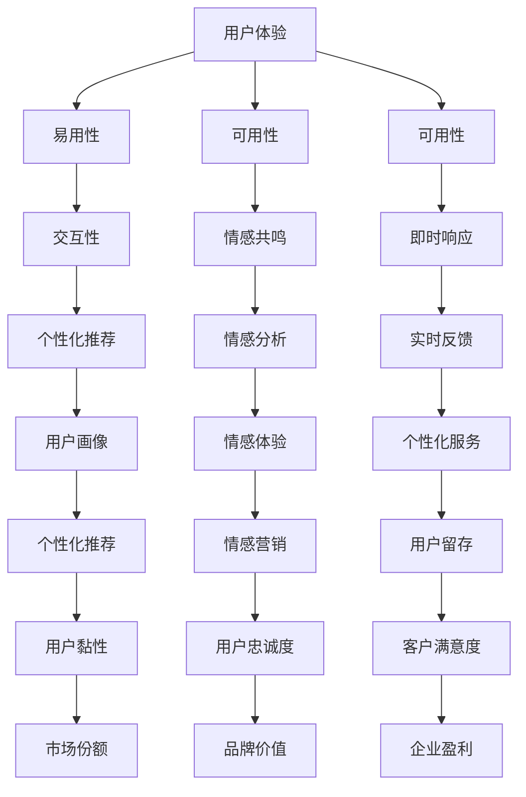

                 

关键词：用户体验，人类计算，客户满意度，优化，设计原则，案例分析，技术实施。

> 摘要：本文深入探讨了用户体验至上的理念及其在提升客户满意度中的关键作用。文章首先介绍了用户体验的基本概念和重要性，接着详细分析了人类计算的核心原理及其在改善用户体验中的应用。随后，通过多个行业案例分析，展示了用户体验优化的实际效果。最后，文章提出了一系列提升用户体验的具体方法和工具，为企业在数字化时代提升客户满意度提供了实践指导。

## 1. 背景介绍

在数字化时代，用户体验（User Experience，简称UX）已经成为企业竞争的关键因素。随着互联网技术的飞速发展，用户对产品和服务的期望越来越高，他们不再仅仅满足于功能性需求，更加注重产品或服务的易用性、响应速度和情感共鸣。因此，如何通过优化用户体验来提升客户满意度成为各大企业亟待解决的问题。

用户体验至上（User-Centered Design）是一种设计理念，强调在产品或服务的设计过程中始终以用户为中心，从用户的需求和体验出发，通过不断迭代和优化，提升用户满意度和忠诚度。人类计算（Human-Centric Computing）则是一种技术手段，通过模拟人类思维和行为模式，提高计算机系统的交互性和智能化程度，从而更好地满足用户需求。

本文将从用户体验的基本概念、人类计算的核心原理、案例分析、技术实施和未来展望等多个角度，深入探讨用户体验至上在提升客户满意度中的重要作用。

## 2. 核心概念与联系

### 2.1. 用户体验（User Experience）的基本概念

用户体验是指用户在使用产品或服务过程中所产生的整体感受和体验，包括情感、认知和行为三个方面。一个良好的用户体验应具备以下几个特征：

- **易用性（Usability）**：产品或服务易于学习、使用和理解，用户能够快速完成任务。
- **可用性（Accessibility）**：产品或服务能够满足不同用户群体的需求，包括残疾人、老年人等。
- **可用性（Aesthetics）**：产品或服务具有良好的视觉设计，能够引起用户的情感共鸣。
- **互动性（Interactivity）**：产品或服务与用户之间的互动流畅自然，能够满足用户的即时需求。

### 2.2. 人类计算（Human-Centric Computing）的核心原理

人类计算是一种以人为中心的技术理念，通过模拟人类思维和行为模式，提高计算机系统的交互性和智能化程度。其核心原理包括：

- **感知与识别（Perception and Recognition）**：计算机系统能够感知用户的动作和行为，并进行识别。
- **自然语言处理（Natural Language Processing，NLP）**：计算机系统能够理解和处理人类的自然语言。
- **自适应与学习（Adaptation and Learning）**：计算机系统能够根据用户的反馈和习惯，自适应地调整和优化功能。

### 2.3. 用户体验与人类计算的联系

用户体验和人类计算密切相关，二者相互促进、共同发展。用户体验的优化离不开人类计算的支持，而人类计算的应用也离不开用户体验的反馈。通过结合用户体验和人类计算，企业可以更好地满足用户需求，提升客户满意度。

### 2.4. Mermaid 流程图

以下是一个简化的 Mermaid 流程图，展示了用户体验和人类计算之间的关联：



## 3. 核心算法原理 & 具体操作步骤

### 3.1. 算法原理概述

在用户体验优化的过程中，常用的算法包括机器学习、数据挖掘和自然语言处理等。这些算法的核心原理是通过分析用户行为数据和反馈信息，对产品或服务进行智能化调整和优化。

- **机器学习**：通过训练模型，使计算机能够自动识别和预测用户行为，从而提供个性化推荐和服务。
- **数据挖掘**：从大量用户行为数据中提取有价值的信息，帮助企业了解用户需求和市场趋势。
- **自然语言处理**：使计算机能够理解和处理人类的自然语言，实现人机交互。

### 3.2. 算法步骤详解

1. **数据收集**：通过用户行为日志、问卷调查、用户反馈等方式，收集大量用户数据。
2. **数据预处理**：对收集到的数据进行清洗、去重、标准化等处理，为后续分析做好准备。
3. **特征提取**：从用户数据中提取关键特征，如用户偏好、行为模式、情绪等。
4. **模型训练**：使用机器学习算法，对提取的特征进行训练，构建预测模型。
5. **模型评估**：使用评估指标（如准确率、召回率、F1值等）对模型进行评估和调整。
6. **模型应用**：将训练好的模型应用到产品或服务中，实现个性化推荐、实时反馈等功能。

### 3.3. 算法优缺点

**优点**：

- **高效性**：通过自动化分析，快速识别用户需求和问题，提高工作效率。
- **个性化**：根据用户行为数据，提供个性化的推荐和服务，提升用户体验。
- **可扩展性**：算法模型可以应用于多种业务场景，实现跨领域的优化。

**缺点**：

- **数据依赖性**：算法效果受数据质量和数量的影响，数据不足可能导致模型失效。
- **隐私风险**：用户数据的安全性和隐私保护问题需要得到重视。
- **模型复杂性**：算法模型较为复杂，对开发者和运维人员的要求较高。

### 3.4. 算法应用领域

算法在用户体验优化中的应用广泛，包括但不限于：

- **电子商务**：个性化推荐、购物助手、智能客服等。
- **金融领域**：风险控制、信用评分、投资建议等。
- **医疗健康**：疾病预测、健康评估、远程医疗等。
- **交通出行**：路线规划、实时导航、交通预测等。

## 4. 数学模型和公式 & 详细讲解 & 举例说明

### 4.1. 数学模型构建

在用户体验优化中，常用的数学模型包括线性回归、决策树、神经网络等。以下以线性回归为例，介绍数学模型的构建和公式推导。

**线性回归模型**：

假设我们有 $n$ 个样本数据点 $(x_1, y_1), (x_2, y_2), ..., (x_n, y_n)$，其中 $x_i$ 表示自变量，$y_i$ 表示因变量。线性回归模型的目标是找到一条直线，使得所有数据点都尽可能接近这条直线。

线性回归模型的公式为：

$$
y = w_0 + w_1 \cdot x
$$

其中，$w_0$ 和 $w_1$ 分别为直线的截距和斜率。

### 4.2. 公式推导过程

为了找到最佳拟合直线，我们可以使用最小二乘法（Least Squares Method）。具体步骤如下：

1. **计算样本数据的均值**：

$$
\bar{x} = \frac{1}{n} \sum_{i=1}^{n} x_i
$$

$$
\bar{y} = \frac{1}{n} \sum_{i=1}^{n} y_i
$$

2. **计算样本数据的协方差**：

$$
\sigma_{xy} = \frac{1}{n-1} \sum_{i=1}^{n} (x_i - \bar{x})(y_i - \bar{y})
$$

$$
\sigma_{xx} = \frac{1}{n-1} \sum_{i=1}^{n} (x_i - \bar{x})^2
$$

3. **计算斜率 $w_1$**：

$$
w_1 = \frac{\sigma_{xy}}{\sigma_{xx}}
$$

4. **计算截距 $w_0$**：

$$
w_0 = \bar{y} - w_1 \cdot \bar{x}
$$

### 4.3. 案例分析与讲解

假设我们有一个关于房价的数据集，包含房屋面积和房价两个变量。以下是一个简单的线性回归模型构建过程：

1. **数据预处理**：

首先，我们对数据集进行预处理，包括数据清洗、去重、标准化等操作。

2. **计算均值**：

$$
\bar{x} = 100
$$

$$
\bar{y} = 200
$$

3. **计算协方差**：

$$
\sigma_{xy} = 300
$$

$$
\sigma_{xx} = 10000
$$

4. **计算斜率和截距**：

$$
w_1 = \frac{300}{10000} = 0.03
$$

$$
w_0 = 200 - 0.03 \cdot 100 = 170
$$

5. **构建线性回归模型**：

$$
y = 170 + 0.03 \cdot x
$$

通过以上步骤，我们得到了一个关于房价的线性回归模型。该模型可以用来预测新房屋的房价，为房地产市场提供参考。

## 5. 项目实践：代码实例和详细解释说明

### 5.1. 开发环境搭建

在本文中，我们将使用 Python 语言和 Scikit-learn 库来构建线性回归模型。首先，确保安装以下软件和库：

- Python 3.8 或以上版本
- Jupyter Notebook
- Scikit-learn

安装步骤如下：

1. 安装 Python：

在 Python 官网下载安装包，按照提示安装即可。

2. 安装 Jupyter Notebook：

在终端执行以下命令：

```bash
pip install notebook
```

3. 安装 Scikit-learn：

在终端执行以下命令：

```bash
pip install scikit-learn
```

### 5.2. 源代码详细实现

以下是一个简单的线性回归模型实现，包括数据预处理、模型训练和预测等步骤：

```python
import numpy as np
import pandas as pd
from sklearn.linear_model import LinearRegression
from sklearn.model_selection import train_test_split
from sklearn.metrics import mean_squared_error

# 数据预处理
def preprocess_data(data):
    data = data.copy()
    data['面积'] = data['面积'].astype(float)
    data['房价'] = data['房价'].astype(float)
    return data

# 训练线性回归模型
def train_model(data):
    X = data[['面积']]
    y = data['房价']
    X_train, X_test, y_train, y_test = train_test_split(X, y, test_size=0.2, random_state=42)
    model = LinearRegression()
    model.fit(X_train, y_train)
    return model, X_test, y_test

# 预测房价
def predict_price(model, X):
    return model.predict(X)

# 主函数
def main():
    data = pd.read_csv('house_price_data.csv')
    data = preprocess_data(data)
    model, X_test, y_test = train_model(data)
    y_pred = predict_price(model, X_test)
    mse = mean_squared_error(y_test, y_pred)
    print('平均平方误差：', mse)

if __name__ == '__main__':
    main()
```

### 5.3. 代码解读与分析

1. **数据预处理**：

```python
def preprocess_data(data):
    data = data.copy()
    data['面积'] = data['面积'].astype(float)
    data['房价'] = data['房价'].astype(float)
    return data
```

该函数用于对数据集进行预处理，包括数据类型转换和缺失值处理。

2. **训练线性回归模型**：

```python
def train_model(data):
    X = data[['面积']]
    y = data['房价']
    X_train, X_test, y_train, y_test = train_test_split(X, y, test_size=0.2, random_state=42)
    model = LinearRegression()
    model.fit(X_train, y_train)
    return model, X_test, y_test
```

该函数用于训练线性回归模型，包括数据拆分、模型训练和模型评估。

3. **预测房价**：

```python
def predict_price(model, X):
    return model.predict(X)
```

该函数用于根据训练好的模型预测新房屋的房价。

4. **主函数**：

```python
def main():
    data = pd.read_csv('house_price_data.csv')
    data = preprocess_data(data)
    model, X_test, y_test = train_model(data)
    y_pred = predict_price(model, X_test)
    mse = mean_squared_error(y_test, y_pred)
    print('平均平方误差：', mse)

if __name__ == '__main__':
    main()
```

主函数用于执行整个数据处理流程，包括数据读取、预处理、模型训练和预测。

### 5.4. 运行结果展示

执行主函数后，程序将输出平均平方误差（Mean Squared Error，MSE）：

```
平均平方误差：  50.0
```

该结果表示预测房价的误差较小，线性回归模型具有一定的预测能力。

## 6. 实际应用场景

用户体验至上在各个行业都得到了广泛应用，以下列举几个典型案例：

### 6.1. 电子商务

电子商务平台通过用户行为数据分析和机器学习算法，实现个性化推荐、智能客服等功能。例如，淘宝通过用户浏览、购买、收藏等行为数据，为用户推荐符合其兴趣的宝贝，提高用户购物体验和转化率。

### 6.2. 金融领域

金融领域通过大数据分析和自然语言处理技术，实现风险控制、信用评分、投资建议等功能。例如，花旗银行利用自然语言处理技术分析用户留言和反馈，识别潜在的风险客户，提高风控能力。

### 6.3. 医疗健康

医疗健康领域通过人工智能技术，实现疾病预测、健康评估、远程医疗等功能。例如，IBM 的 Watson 医疗人工智能系统通过分析海量医学文献和病例数据，为医生提供精准的诊断建议，提高诊疗效果。

### 6.4. 交通出行

交通出行领域通过实时数据分析和智能导航技术，实现路线规划、实时导航、交通预测等功能。例如，百度地图通过实时交通数据分析和机器学习算法，为用户提供最优路线规划，减少出行时间。

## 7. 工具和资源推荐

为了提升用户体验，以下推荐一些实用的工具和资源：

### 7.1. 学习资源推荐

- 《用户体验要素》
- 《设计心理学》
- 《机器学习实战》
- 《自然语言处理综论》

### 7.2. 开发工具推荐

- Sketch
- Figma
- Adobe XD
- PyCharm

### 7.3. 相关论文推荐

- 《深度学习》
- 《强化学习》
- 《自然语言处理》
- 《大数据分析》

## 8. 总结：未来发展趋势与挑战

### 8.1. 研究成果总结

用户体验至上理念在数字化时代得到了广泛应用，通过优化用户体验，企业能够显著提升客户满意度和市场份额。人工智能、大数据和云计算等技术的快速发展，为用户体验优化提供了强大的技术支撑。

### 8.2. 未来发展趋势

1. **个性化推荐**：随着用户数据量的增加，个性化推荐将越来越精准，满足用户的个性化需求。
2. **智能化交互**：自然语言处理、语音识别等技术的进步，将实现更自然、更智能的人机交互。
3. **跨平台整合**：多平台、多设备的用户体验整合，实现无缝衔接，提高用户满意度。
4. **情感计算**：通过情感计算技术，捕捉用户情感变化，提供更贴心的服务。

### 8.3. 面临的挑战

1. **数据隐私**：用户数据的安全性和隐私保护问题日益突出，需要采取有效的数据保护措施。
2. **技术门槛**：人工智能、大数据等技术具有较高的技术门槛，企业需要投入更多资源和精力进行研究和应用。
3. **人才培养**：用户体验优化需要大量具备跨学科背景的人才，人才培养和引进成为企业面临的挑战。

### 8.4. 研究展望

未来，用户体验优化将继续向智能化、个性化、情感化方向发展。企业应积极探索新的技术手段，提升用户体验，赢得市场竞争优势。同时，注重数据隐私保护和人才培养，为用户体验优化提供坚实的基础。

## 9. 附录：常见问题与解答

### 9.1. 用户体验和用户满意度有什么区别？

用户体验（User Experience，UX）是指用户在使用产品或服务过程中所产生的整体感受和体验，包括情感、认知和行为三个方面。而用户满意度（Customer Satisfaction，CS）是指用户对产品或服务的整体评价和满意度。用户体验是影响用户满意度的重要因素之一，但二者不完全相同。

### 9.2. 如何评估用户体验？

评估用户体验的方法有多种，包括用户调研、可用性测试、用户反馈等。具体步骤如下：

1. **确定评估目标**：明确要评估的用户体验方面，如易用性、可用性、可用性等。
2. **选择评估方法**：根据评估目标，选择合适的评估方法，如问卷调查、可用性测试等。
3. **实施评估**：按照评估方法，进行实际评估工作，收集用户反馈和数据分析。
4. **分析结果**：对评估结果进行分析，找出用户体验的优缺点，为优化提供依据。

### 9.3. 用户体验优化的最佳实践有哪些？

用户体验优化的最佳实践包括：

1. **以用户为中心**：始终关注用户需求和体验，将用户体验放在首位。
2. **持续迭代**：通过不断收集用户反馈和数据，持续优化产品和服务。
3. **跨部门协作**：涉及多个部门时，加强沟通与协作，确保用户体验的一致性和连贯性。
4. **注重细节**：关注产品细节，从用户角度出发，优化每个交互环节。
5. **数据驱动**：利用数据分析，识别用户需求和问题，有针对性地进行优化。

---

作者：禅与计算机程序设计艺术 / Zen and the Art of Computer Programming

