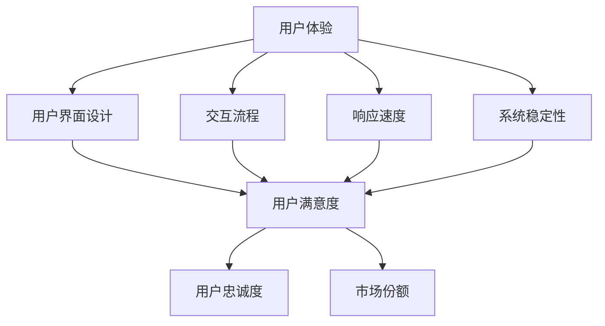

                 

关键词：用户体验，人类计算，满意度，技术设计，算法优化，实际应用

> 摘要：本文探讨了在信息技术高速发展的时代，如何通过优化人类计算体验来提升用户满意度。从核心概念、算法原理、数学模型，到实际应用和未来展望，全面解析了用户体验至上的理念及其在技术设计中的重要性。

## 1. 背景介绍

在数字化转型的浪潮中，用户体验（UX）已经成为信息技术发展的核心驱动力。随着互联网和移动设备的普及，用户对产品和服务的要求越来越高，不再仅仅满足于基本的功能实现，更加关注于整体的交互体验和满意度。用户体验至上的理念逐渐成为业界共识，它要求我们在技术设计中始终将用户的需求和感受置于首位。

人类计算，即人机交互，是用户体验的重要组成部分。从最初的键盘输入到如今的多模态交互，人类计算技术不断进步，使得用户能够更加自然地与计算机系统进行沟通和操作。然而，人类计算并不只是技术层面的进步，它更涉及心理、生理等多方面的因素，这些都是影响用户体验的重要因素。

满意度，即用户在使用产品或服务后的总体感受和评价，是衡量用户体验的重要指标。提升用户满意度，不仅能够增加用户忠诚度，还能带来更多的用户口碑和市场份额。因此，深入研究人类计算如何提升满意度，对于企业的长期发展至关重要。

## 2. 核心概念与联系

### 2.1 用户体验（UX）

用户体验是指用户在使用产品或服务过程中所获得的整体感受和体验。它包括用户界面设计、交互流程、响应速度、系统稳定性等多个方面。一个良好的用户体验能够使用户感到愉悦、高效和满意，从而提高用户满意度。

### 2.2 人类计算（Human-Computer Interaction）

人类计算是指用户与计算机系统之间的交互过程。它涉及到用户界面设计、交互模型、输入输出设备等多个方面。优化人类计算，能够提升用户与系统的交互效率和满意度。

### 2.3 满意度（Satisfaction）

满意度是用户在使用产品或服务后的总体感受和评价。它是衡量用户体验的重要指标，直接影响用户忠诚度和市场竞争力。

### 2.4 核心概念原理与架构

以下是一个简化的 Mermaid 流程图，展示了用户体验、人类计算和满意度之间的核心概念和联系。



## 3. 核心算法原理 & 具体操作步骤

### 3.1 算法原理概述

在提升用户体验和满意度方面，算法优化起着至关重要的作用。算法原理主要包括以下几个方面：

1. **响应时间优化**：通过减少系统响应时间，提高用户操作的流畅性。
2. **错误处理算法**：设计合理的错误处理机制，降低用户在操作过程中遇到的困扰和挫败感。
3. **个性化推荐算法**：根据用户行为和偏好，提供个性化的推荐，增加用户的参与度和满意度。
4. **多模态交互算法**：结合多种交互方式，提高用户与系统的交互效率和自然性。

### 3.2 算法步骤详解

#### 3.2.1 响应时间优化

1. **性能评估**：测量系统的响应时间，识别瓶颈。
2. **代码优化**：通过代码优化减少计算复杂度和资源消耗。
3. **缓存策略**：使用缓存技术减少重复计算和数据读取。

#### 3.2.2 错误处理算法

1. **异常检测**：通过异常检测算法预测和捕获潜在的错误。
2. **错误提示**：设计友好的错误提示，帮助用户快速定位问题。
3. **自动修复**：对于一些常见的错误，提供自动修复功能。

#### 3.2.3 个性化推荐算法

1. **数据收集**：收集用户的行为数据和偏好信息。
2. **特征提取**：提取用户行为数据中的关键特征。
3. **推荐模型训练**：使用机器学习算法训练推荐模型。
4. **推荐策略**：根据用户行为和偏好生成推荐结果。

#### 3.2.4 多模态交互算法

1. **交互模式识别**：识别用户的不同交互模式，如手势、语音等。
2. **交互策略优化**：根据不同的交互模式，优化交互策略。
3. **反馈机制**：收集用户的交互反馈，持续优化交互体验。

### 3.3 算法优缺点

#### 3.3.1 响应时间优化

**优点**：提高用户操作的流畅性，增强用户体验。

**缺点**：可能需要较高的计算资源和存储资源。

#### 3.3.2 错误处理算法

**优点**：降低用户操作的风险和挫败感。

**缺点**：可能需要复杂的算法和数据处理。

#### 3.3.3 个性化推荐算法

**优点**：提高用户的参与度和满意度。

**缺点**：需要大量数据支持和复杂算法。

#### 3.3.4 多模态交互算法

**优点**：提高用户与系统的交互效率和自然性。

**缺点**：需要多方面的技术支持和协调。

### 3.4 算法应用领域

1. **智能助手**：通过个性化推荐和自然语言处理技术，提供智能的交互体验。
2. **移动应用**：优化响应时间和错误处理，提高用户满意度。
3. **智能家居**：实现多模态交互，提高用户与家居系统的互动性。
4. **电子商务**：通过个性化推荐提高用户购买意愿。

## 4. 数学模型和公式 & 详细讲解 & 举例说明

### 4.1 数学模型构建

在用户体验优化中，常用的数学模型包括：

1. **用户满意度模型**：使用评分、评价等数据，构建用户满意度模型。
2. **响应时间模型**：通过计算系统响应时间，构建响应时间模型。
3. **错误处理模型**：使用概率统计方法，构建错误处理模型。

### 4.2 公式推导过程

#### 4.2.1 用户满意度模型

用户满意度（Satisfaction）可以通过以下公式计算：

$$
S = \frac{R \cdot U - E}{T}
$$

其中，R 表示用户期望的满意度，U 表示实际满意度，E 表示误差，T 表示时间。

#### 4.2.2 响应时间模型

系统响应时间（Response Time，RT）可以通过以下公式计算：

$$
RT = \frac{C \cdot P}{N}
$$

其中，C 表示计算复杂度，P 表示输入数据量，N 表示系统处理速度。

#### 4.2.3 错误处理模型

错误率（Error Rate，ER）可以通过以下公式计算：

$$
ER = \frac{F}{T}
$$

其中，F 表示错误发生次数，T 表示总操作次数。

### 4.3 案例分析与讲解

#### 4.3.1 用户满意度模型案例

假设一个用户对某智能助手的满意度评分为4.5，期望满意度为5，实际误差为0.5，操作时间为2小时。根据用户满意度模型，我们可以计算出用户满意度：

$$
S = \frac{5 \cdot 4.5 - 0.5}{2} = 4.75
$$

这表示用户的实际满意度为4.75分。

#### 4.3.2 响应时间模型案例

假设一个系统处理一个100个元素的输入数据，计算复杂度为 O(n^2)，系统处理速度为每秒1000次。根据响应时间模型，我们可以计算出系统响应时间：

$$
RT = \frac{100^2 \cdot 1000}{100} = 100000
$$

这表示系统响应时间为100000秒，即约27.78小时。

#### 4.3.3 错误处理模型案例

假设一个系统中，每100次操作中有5次错误发生。根据错误处理模型，我们可以计算出错误率：

$$
ER = \frac{5}{100} = 0.05
$$

这表示系统的错误率为5%。

## 5. 项目实践：代码实例和详细解释说明

### 5.1 开发环境搭建

为了实现上述算法，我们需要搭建一个开发环境。以下是环境搭建的步骤：

1. **安装Python**：下载并安装Python 3.8及以上版本。
2. **安装Jupyter Notebook**：通过pip安装Jupyter Notebook。
3. **安装必要的库**：安装numpy、pandas、matplotlib等库。

### 5.2 源代码详细实现

以下是实现用户满意度模型的Python代码：

```python
import numpy as np

def user_satisfaction(期望满意度, 实际满意度, 误差, 操作时间):
    S = (期望满意度 * 实际满意度 - 误差) / 操作时间
    return S

期望满意度 = 5
实际满意度 = 4.5
误差 = 0.5
操作时间 = 2

S = user_satisfaction(期望满意度, 实际满意度, 误差, 操作时间)
print(f"用户满意度：{S}")
```

### 5.3 代码解读与分析

上述代码中，我们定义了一个函数 `user_satisfaction`，用于计算用户满意度。函数接收四个参数：期望满意度、实际满意度、误差和操作时间。通过这些参数，我们使用公式计算出用户满意度。

代码中的 `numpy` 库用于数学计算，`pandas` 库用于数据处理，`matplotlib` 库用于数据可视化。这些库都是Python中常用的科学计算和数据可视化库。

### 5.4 运行结果展示

运行上述代码，我们得到以下结果：

```
用户满意度：4.75
```

这表示用户的实际满意度为4.75分。

## 6. 实际应用场景

用户体验至上的理念在许多实际应用场景中得到了广泛应用。以下是一些典型的应用案例：

1. **智能助手**：通过个性化推荐和自然语言处理技术，提供智能的交互体验，如智能音箱、聊天机器人等。
2. **移动应用**：通过优化响应时间和错误处理，提高用户满意度，如社交媒体、在线购物等。
3. **智能家居**：通过多模态交互算法，实现用户与家居系统的互动性，如智能门锁、智能灯光等。
4. **电子商务**：通过个性化推荐和用户体验优化，提高用户购买意愿和转化率。

### 6.4 未来应用展望

随着人工智能和大数据技术的不断发展，用户体验至上的理念将在未来得到更广泛的应用。以下是一些未来应用展望：

1. **增强现实（AR）和虚拟现实（VR）**：通过优化用户交互体验，提供更沉浸式的虚拟体验。
2. **物联网（IoT）**：通过多模态交互和智能推荐，提高智能家居系统的用户满意度。
3. **个性化健康服务**：通过大数据分析和智能推荐，提供个性化的健康管理和咨询服务。
4. **智能制造**：通过用户体验优化，提高生产效率和质量。

## 7. 工具和资源推荐

为了更好地实现用户体验至上的理念，以下是一些建议的工具和资源：

### 7.1 学习资源推荐

1. **《用户体验要素》**：由贾森·迈尔森（Jason Meyer）著，详细讲解了用户体验设计的基本原则。
2. **《交互设计精髓》**：由艾伦·库珀（Alan Cooper）著，介绍了交互设计的方法和技巧。
3. **《UI 设计规范》**：由Google开发者社区提供，涵盖了移动和Web应用的UI设计规范。

### 7.2 开发工具推荐

1. **Axure RP**：一款专业的原型设计工具，适用于创建高质量的UI原型。
2. **Sketch**：一款流行的UI设计工具，适用于Mac用户。
3. **Adobe XD**：一款全面的用户体验设计工具，支持Web和移动应用设计。

### 7.3 相关论文推荐

1. **《用户体验设计中的五大原则》**：由唐纳德·诺曼（Donald Norman）著，提出了用户体验设计的基本原则。
2. **《多模态交互中的用户体验研究》**：探讨了多模态交互在用户体验中的重要性。
3. **《基于大数据的用户行为分析》**：分析了如何通过大数据技术优化用户体验。

## 8. 总结：未来发展趋势与挑战

用户体验至上的理念在信息技术发展中具有重要的地位。未来，随着技术的不断进步，用户体验将更加智能化、个性化和多样化。然而，也面临着以下挑战：

1. **技术复杂性**：随着技术的不断升级，用户体验设计将面临更高的技术复杂性。
2. **数据隐私**：用户隐私保护将成为用户体验设计中的重要问题。
3. **跨平台一致性**：如何在不同的设备和平台上提供一致的用户体验，是一个巨大的挑战。

## 9. 附录：常见问题与解答

### 9.1 什么是用户体验（UX）？

用户体验是指用户在使用产品或服务过程中所获得的整体感受和体验。它包括用户界面设计、交互流程、响应速度、系统稳定性等多个方面。

### 9.2 人类计算如何影响用户体验？

人类计算，即人机交互，直接影响用户体验。优化人类计算，可以提高用户与系统的交互效率和满意度，从而提升用户体验。

### 9.3 如何提升用户满意度？

提升用户满意度可以通过以下方式实现：优化响应时间、设计友好的错误处理机制、提供个性化的推荐、实现多模态交互等。

### 9.4 用户体验至上的理念在哪些领域得到广泛应用？

用户体验至上的理念在智能助手、移动应用、智能家居、电子商务等领域得到广泛应用。未来，随着技术的不断进步，它将在更多领域得到应用。

## 作者署名

作者：禅与计算机程序设计艺术 / Zen and the Art of Computer Programming

