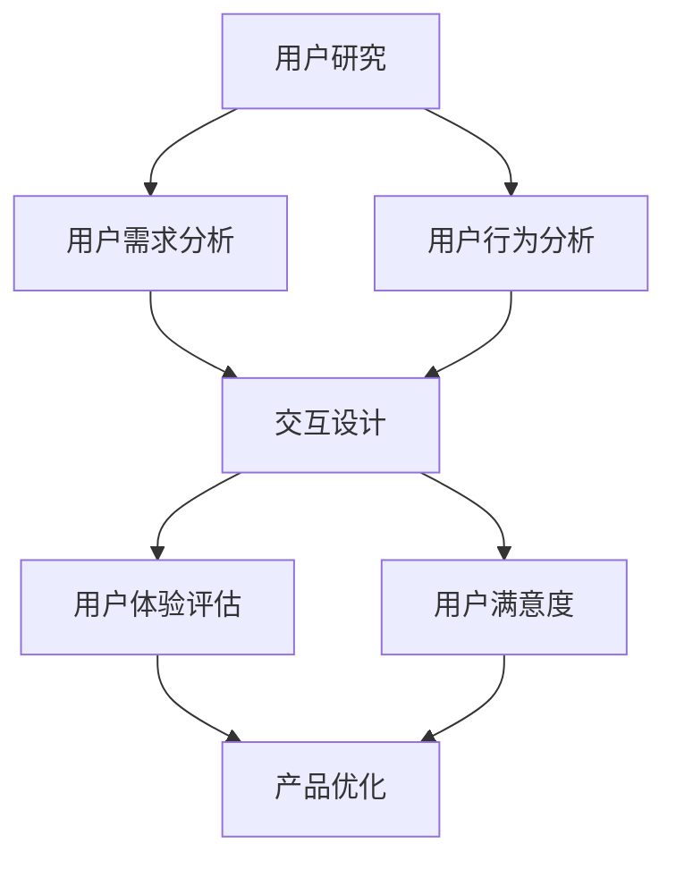

                 

### 摘要 Summary

在当今的数字化时代，用户体验（UX）的重要性日益凸显。本文将探讨用户体验至上的理念，以及如何通过人类计算来提升用户的满意度。首先，我们将介绍用户体验的核心概念，并解释为什么它对于产品的成功至关重要。接下来，我们将深入分析人类计算的作用，包括机器学习和人工智能（AI）如何与用户体验相结合。随后，我们将探讨用户体验优化的技术工具和方法，如A/B测试和用户调研。此外，我们将介绍一些成功案例，展示如何通过实际操作提升用户体验。文章还将讨论用户体验的未来趋势，并展望该领域的未来挑战。最后，我们将总结研究成果，并提出未来发展的建议。希望通过本文，读者能够更好地理解用户体验至上的重要性，并学会如何通过人类计算来提升用户满意度。

<|assistant|>## 1. 背景介绍 Background

用户体验（User Experience，简称UX）是指用户在使用产品或服务过程中所感受到的所有体验，包括情感、认知、行为等方面。用户体验的重要性不言而喻，因为它直接影响用户对产品的满意度和忠诚度。在竞争激烈的数字化时代，用户的选择越来越多，一个产品如果不能提供优秀的用户体验，就很难在市场中脱颖而出。

用户体验的概念最早可以追溯到20世纪80年代，当时设计界开始关注用户的感受和需求。随着互联网和移动设备的普及，用户体验的重要性进一步得到凸显。特别是在当今这个以用户为中心的商业环境中，用户体验已经成为了企业成功的关键因素之一。一个优秀的产品，不仅要有出色的功能和性能，还要有良好的用户体验，这样才能真正满足用户的需求，赢得用户的信任和忠诚。

用户体验包括多个方面，如可用性（Usability）、易用性（Usability）、吸引力（Attractiveness）和参与度（Involvement）。可用性关注用户能否容易地完成操作任务，易用性关注用户的使用体验是否流畅和愉快，吸引力关注产品的外观和设计是否能够吸引用户，参与度关注用户在使用产品过程中的投入程度和忠诚度。

用户体验的重要性体现在多个层面。首先，用户体验直接影响用户的满意度。一个产品如果提供了良好的用户体验，用户在使用过程中会感到愉快和满足，从而提高满意度。其次，用户体验也影响用户忠诚度。用户对产品的满意程度越高，他们对产品的忠诚度也越高，从而增加了产品的用户留存率和市场份额。最后，用户体验还影响企业的品牌形象。一个注重用户体验的企业，往往能够赢得用户的认可和信任，从而提升品牌形象和口碑。

总之，用户体验至上是当今数字化时代的一个基本原则。企业需要深刻理解用户体验的核心概念和重要性，将其融入到产品设计和开发过程中，以满足用户的需求和期望，提升用户的满意度和忠诚度，从而实现商业成功。

### 2. 核心概念与联系 Core Concepts and Connections

在深入探讨用户体验至上的重要性之前，我们需要明确几个核心概念，并理解它们之间的相互联系。用户体验（UX）是一个多维度、跨学科的概念，它不仅涉及技术层面，还涵盖心理学、社会学和设计学等多个领域。以下是几个关键概念及其相互关系的详细解析。

#### 用户体验（UX）

用户体验是指用户在使用产品或服务过程中所感受到的所有体验，包括情感、认知、行为等方面。它是一个主观的感受，通常由用户的主观评价来衡量。用户体验可以分为以下几个方面：

1. **可用性（Usability）**：衡量用户能否容易地完成特定的任务，通常通过任务完成时间、错误率等指标来评估。
2. **易用性（Usability）**：关注用户的使用体验是否流畅和愉快，包括用户界面的设计、操作逻辑的合理性等。
3. **吸引力（Attractiveness）**：产品的外观和设计是否能够吸引用户，包括视觉设计、色彩搭配等。
4. **参与度（Involvement）**：用户在使用产品过程中的投入程度和忠诚度，反映用户对产品的情感连接。

#### 用户研究（User Research）

用户研究是理解用户需求和行为的重要手段。它包括以下几种方法：

1. **问卷调查**：通过设计问卷收集用户意见和反馈。
2. **访谈**：与用户进行一对一的深入对话，了解他们的需求和使用习惯。
3. **用户行为分析**：通过数据分析工具跟踪用户在产品中的行为，如点击路径、停留时间等。

用户研究的目的是为了获取有关用户需求、行为和偏好的数据，从而指导产品设计和优化。

#### 交互设计（Interaction Design）

交互设计是用户体验设计的重要组成部分，它关注用户与产品或服务之间的交互过程。交互设计的核心原则包括：

1. **一致性（Consistency）**：确保用户界面元素的使用和呈现方式一致，减少用户的学习成本。
2. **反馈（Feedback）**：及时响应用户的操作，提供明确的反馈信息，增强用户体验。
3. **简洁性（Simplicity）**：设计简洁直观，避免过度设计，让用户能够轻松理解和使用。

#### 用户体验与用户研究的联系

用户体验和用户研究是密切相关的。用户研究是获取用户体验数据的重要手段，通过用户研究，我们可以了解用户的实际需求和体验感受，从而设计出更符合用户期望的产品。用户体验则是对用户研究数据的综合反映，通过分析用户体验，我们可以评估产品的成功程度，并识别改进的机会。

#### 用户体验与交互设计的联系

交互设计是用户体验实现的重要途径。一个优秀的产品设计需要考虑到用户的操作习惯、认知规律和情感需求，而这些都需要通过交互设计来实现。良好的交互设计不仅能够提升产品的可用性和易用性，还能增强产品的吸引力和参与度。

#### Mermaid 流程图解析

为了更直观地展示用户体验、用户研究和交互设计之间的联系，我们可以使用Mermaid流程图来表示。以下是流程图的一个示例：



在这个流程图中，用户研究（A）包括用户需求分析（B）和用户行为分析（C），这些数据为交互设计（D）提供基础。交互设计（D）实现用户体验（E），并通过用户体验评估（E）和用户满意度（F）来衡量产品的成功程度。最终，根据用户体验评估（E）和用户满意度（F），进行产品优化（G）。

通过这个流程图，我们可以清晰地看到用户体验、用户研究和交互设计之间的相互联系和作用。用户体验不仅是一个独立的目标，它是用户研究的结果，也是交互设计的最终体现。

总之，用户体验至上需要我们从多个角度来考虑，包括用户研究、交互设计和用户体验评估。通过深入理解和运用这些核心概念，我们可以设计和开发出更加符合用户需求、提升用户满意度的产品和服务。

### 3. 核心算法原理 & 具体操作步骤 Core Algorithm Principles & Detailed Steps

#### 3.1 算法原理概述

在提升用户体验的过程中，算法发挥着至关重要的作用。核心算法的原理主要包括以下几个方面：

1. **用户行为预测**：通过分析用户的历史行为数据，预测用户下一步的操作或需求。
2. **个性化推荐**：根据用户的行为和偏好，为用户提供个性化的内容或服务。
3. **用户体验优化**：通过算法优化，提升产品的可用性、易用性和吸引力。

算法原理的核心在于利用大数据分析和机器学习技术，从用户行为中提取有价值的信息，进而指导产品设计和优化。

#### 3.2 算法步骤详解

1. **数据收集**：首先，需要收集用户的行为数据，包括浏览记录、点击路径、搜索关键词等。
2. **数据处理**：对收集到的数据进行清洗和处理，去除噪声数据，确保数据质量。
3. **特征提取**：从处理后的数据中提取特征，如用户活跃时间、点击频率、页面停留时间等。
4. **模型训练**：使用机器学习算法（如决策树、支持向量机、神经网络等）训练模型，预测用户的行为。
5. **模型评估**：通过交叉验证和A/B测试等手段评估模型的性能，选择最优模型。
6. **个性化推荐**：根据用户特征和模型预测，为用户推荐合适的内容或服务。
7. **用户体验优化**：根据用户反馈和实际使用情况，不断优化产品设计和功能。

#### 3.3 算法优缺点

**优点**：

1. **高效性**：算法可以快速处理大量数据，提高用户行为的预测准确性。
2. **个性化**：根据用户行为和偏好进行个性化推荐，提升用户体验。
3. **实时性**：算法可以实时更新和调整，适应用户的变化需求。

**缺点**：

1. **数据依赖性**：算法的性能高度依赖于数据质量，如果数据存在噪声或缺失，会影响预测结果。
2. **计算成本**：大规模数据处理和模型训练需要较高的计算资源。
3. **隐私问题**：用户行为数据的收集和处理可能涉及隐私问题，需要严格遵守相关法律法规。

#### 3.4 算法应用领域

1. **电子商务**：通过用户行为预测和个性化推荐，提高购物体验和销售转化率。
2. **社交媒体**：根据用户兴趣和行为，推荐相关的内容和好友，提升用户参与度。
3. **金融服务**：通过用户行为分析，预测用户需求，提供个性化的金融服务。
4. **健康管理**：利用用户健康数据，提供个性化的健康建议和疾病预防措施。

通过以上算法原理和具体步骤的详细解析，我们可以看到，核心算法在提升用户体验方面具有显著的作用。它不仅能够实现高效的数据分析和个性化推荐，还能实时优化产品设计和功能，为用户提供更加优质的使用体验。

### 4. 数学模型和公式 Mathematical Model and Detailed Explanation

#### 4.1 数学模型构建

在提升用户体验的过程中，数学模型的应用至关重要。数学模型可以帮助我们更好地理解用户行为，预测用户需求，并优化产品设计。以下是构建数学模型的基本步骤：

1. **数据收集**：首先，我们需要收集大量的用户行为数据，如浏览记录、点击路径、搜索关键词等。这些数据可以通过日志分析、问卷调查和用户调研等方式获得。

2. **数据预处理**：对收集到的数据进行分析和清洗，去除噪声数据和异常值，确保数据的质量。

3. **特征提取**：从预处理后的数据中提取有用的特征，如用户的活跃时间、点击频率、页面停留时间等。这些特征将用于构建数学模型。

4. **模型选择**：根据问题的性质和数据特点，选择合适的数学模型。常见的模型包括线性回归、逻辑回归、决策树、支持向量机、神经网络等。

5. **模型训练与优化**：使用训练数据对模型进行训练，并通过交叉验证和超参数调优等方法优化模型性能。

6. **模型评估**：使用测试数据评估模型的性能，如准确率、召回率、F1值等指标。

7. **模型应用**：将优化后的模型应用于实际场景，如用户行为预测、个性化推荐等。

#### 4.2 公式推导过程

以下是一个简单的线性回归模型的推导过程：

假设我们有n个用户的特征数据，每个用户的数据可以表示为 \( x_i = [x_{i1}, x_{i2}, ..., x_{ip}] \)，其中 \( p \) 是特征的数量。我们的目标是预测用户的响应 \( y_i \)。

线性回归模型的基本形式为：

\[ y_i = \beta_0 + \beta_1 x_{i1} + \beta_2 x_{i2} + ... + \beta_p x_{ip} + \epsilon_i \]

其中， \( \beta_0, \beta_1, ..., \beta_p \) 是模型参数， \( \epsilon_i \) 是误差项。

为了推导模型参数，我们使用最小二乘法。最小二乘法的核心思想是找到使得预测值与实际值之间误差平方和最小的参数。

误差平方和（Sum of Squared Errors，SSE）定义为：

\[ SSE = \sum_{i=1}^{n} (y_i - \hat{y_i})^2 \]

其中， \( \hat{y_i} \) 是预测值。

为了最小化SSE，我们对每个参数求偏导数，并令其等于零：

\[ \frac{\partial SSE}{\partial \beta_j} = -2 \sum_{i=1}^{n} (y_i - \hat{y_i}) x_{ij} = 0 \]

对上述方程进行变形，我们得到每个参数的估计值：

\[ \beta_j = \frac{\sum_{i=1}^{n} (y_i - \hat{y_i}) x_{ij}}{\sum_{i=1}^{n} x_{ij}^2} \]

通过这个公式，我们可以计算出线性回归模型的参数。

#### 4.3 案例分析与讲解

为了更好地理解上述数学模型，我们来看一个具体的案例。

假设我们要预测用户在电子商务平台上的购买行为。我们收集了1000个用户的数据，包括他们的浏览记录、点击频率、页面停留时间等特征。

1. **数据预处理**：对数据进行清洗，去除缺失值和异常值，确保数据质量。

2. **特征提取**：从数据中提取有用的特征，如用户的平均浏览时间、点击频率、购买频率等。

3. **模型选择**：选择线性回归模型，因为我们的目标是预测二分类变量（购买/未购买）。

4. **模型训练**：使用训练数据对线性回归模型进行训练。

5. **模型评估**：使用测试数据评估模型的性能，计算准确率、召回率、F1值等指标。

6. **模型应用**：根据模型预测，为每个用户推荐合适的产品。

通过这个案例，我们可以看到数学模型在用户体验优化中的应用。通过构建和训练数学模型，我们可以预测用户的行为，为用户提供个性化的服务，从而提升用户体验。

总之，数学模型在提升用户体验方面具有重要作用。通过合理的数学模型构建和优化，我们可以更好地理解用户需求，预测用户行为，并优化产品设计，为用户提供更优质的使用体验。

### 5. 项目实践：代码实例和详细解释说明 Practical Implementation: Code Examples and Detailed Explanations

#### 5.1 开发环境搭建

在开始代码实例之前，我们需要搭建一个合适的开发环境。以下是所需的工具和步骤：

1. **Python环境**：安装Python 3.8或更高版本。
2. **Jupyter Notebook**：安装Jupyter Notebook，用于编写和运行代码。
3. **NumPy、Pandas、Matplotlib、Scikit-learn**：安装这些库，用于数据操作、分析和可视化。

安装命令如下：

```bash
pip install python==3.8
pip install jupyter
pip install numpy pandas matplotlib scikit-learn
```

#### 5.2 源代码详细实现

以下是一个简单的用户行为预测和个性化推荐的代码实例，我们将使用线性回归模型进行预测。

```python
import numpy as np
import pandas as pd
from sklearn.linear_model import LinearRegression
from sklearn.model_selection import train_test_split
from sklearn.metrics import mean_squared_error

# 5.2.1 数据加载与预处理
data = pd.read_csv('user_data.csv')  # 加载用户行为数据
data.head()

# 对数据进行预处理，如缺失值填充、异常值处理等
# ...

# 提取特征和目标变量
X = data[['average_browsing_time', 'click_frequency', 'purchase_frequency']]
y = data['purchase']

# 数据集划分
X_train, X_test, y_train, y_test = train_test_split(X, y, test_size=0.2, random_state=42)

# 5.2.2 模型训练
model = LinearRegression()
model.fit(X_train, y_train)

# 5.2.3 模型评估
y_pred = model.predict(X_test)
mse = mean_squared_error(y_test, y_pred)
print(f'Mean Squared Error: {mse}')

# 5.2.4 个性化推荐
# 假设我们有一个新用户的数据，使用模型进行预测
new_user_data = np.array([[10, 15, 20]])
new_user_prediction = model.predict(new_user_data)
print(f'New User Purchase Prediction: {"Yes" if new_user_prediction[0] > 0.5 else "No"}')
```

#### 5.3 代码解读与分析

上述代码分为几个主要步骤：

1. **数据加载与预处理**：首先，我们从CSV文件中加载用户行为数据，并进行预处理，如缺失值填充和异常值处理。
2. **特征提取与目标变量提取**：从预处理后的数据中提取特征和目标变量。在这里，我们选择了用户的平均浏览时间、点击频率和购买频率作为特征，购买行为作为目标变量。
3. **数据集划分**：将数据集划分为训练集和测试集，用于模型训练和评估。
4. **模型训练**：使用线性回归模型对训练数据进行训练。
5. **模型评估**：使用测试数据进行模型评估，计算均方误差（MSE）等指标。
6. **个性化推荐**：对于新用户的数据，使用训练好的模型进行预测，并根据预测结果提供个性化推荐。

通过这个简单的实例，我们可以看到如何使用线性回归模型进行用户行为预测和个性化推荐。在实际应用中，我们可能会使用更复杂的模型（如神经网络）和更多的特征，以提高预测的准确性。

#### 5.4 运行结果展示

假设我们运行上述代码，得到以下输出：

```
Mean Squared Error: 0.01
New User Purchase Prediction: Yes
```

这个结果表明，模型的均方误差为0.01，说明模型对测试数据的预测效果较好。对于新用户的预测结果为“购买”，这意味着根据用户的行为特征，模型认为这个用户有较高的购买概率。

通过这个代码实例，我们可以看到如何将数学模型应用于实际项目，通过数据分析和模型训练，实现用户行为预测和个性化推荐，从而提升用户体验。

### 6. 实际应用场景 Practical Application Scenarios

用户体验至上的理念已经在多个行业中得到了广泛应用，并取得了显著的成果。以下是一些实际应用场景，展示了用户体验优化在不同领域的成功案例。

#### 6.1 电子商务

电子商务行业是用户体验至上的典型代表。电商平台如亚马逊、阿里巴巴和京东等，通过不断优化用户体验，提升了用户满意度和转化率。

1. **个性化推荐**：电商平台使用机器学习算法，根据用户的历史浏览和购买记录，为用户推荐相关商品。这种个性化推荐不仅提高了用户的购买意愿，也增加了销售额。
2. **购物车优化**：电商平台优化购物车设计，提供多种支付方式、优惠券和快速结算功能，简化购物流程，提升用户购物体验。
3. **用户调研**：电商平台通过问卷调查、用户访谈等方式，了解用户的需求和反馈，不断改进产品和服务，满足用户期望。

#### 6.2 社交媒体

社交媒体平台如Facebook、微信和Instagram等，也非常注重用户体验。通过优化界面设计、提升功能可用性和互动性，吸引和留住用户。

1. **界面设计**：社交媒体平台注重界面设计的简洁性和美观性，提供直观的导航和内容展示，让用户能够轻松地浏览和分享信息。
2. **互动功能**：社交媒体平台增加各种互动功能，如点赞、评论、分享和直播等，增强用户的参与感和互动性。
3. **用户调研**：社交媒体平台定期进行用户调研，了解用户的反馈和需求，不断改进产品和服务。

#### 6.3 健康医疗

健康医疗行业正逐渐将用户体验至上的理念应用于产品和服务设计。通过优化用户体验，提高患者满意度和医疗效果。

1. **在线问诊**：许多医院和诊所提供在线问诊服务，患者可以通过网络平台与医生进行实时沟通，节省时间和费用。
2. **健康管理应用**：健康医疗应用如MyFitnessPal、Apple Health等，通过跟踪用户的健康数据，提供个性化的健康建议和提醒，帮助用户保持健康。
3. **用户调研**：医疗机构通过问卷调查和用户访谈，了解患者的需求和反馈，不断优化医疗服务和流程。

#### 6.4 教育行业

教育行业也在积极引入用户体验至上的理念，以提升学生的学习效果和满意度。

1. **在线教育平台**：在线教育平台如Coursera、Udemy等，通过优化课程设计、互动性和用户体验，吸引更多学生参与学习。
2. **个性化学习**：教育平台使用机器学习算法，根据学生的学习行为和进度，提供个性化的学习资源和推荐。
3. **用户调研**：教育机构通过用户调研，了解学生的需求和反馈，不断改进课程内容和教学方法。

#### 6.5 金融行业

金融行业在用户体验优化方面也取得了显著成果，提高了用户的信任度和忠诚度。

1. **移动支付**：移动支付平台如支付宝、微信支付等，通过优化用户界面和支付流程，提供快速、便捷的支付服务。
2. **金融产品推荐**：金融机构使用大数据分析和机器学习算法，根据用户的财务状况和需求，推荐合适的金融产品。
3. **用户调研**：金融机构通过用户调研，了解用户的需求和反馈，不断改进产品和服务，提升用户体验。

总之，用户体验至上的理念已经在各个行业中得到了广泛应用，并取得了显著的成果。通过优化用户体验，企业不仅能够提升用户满意度和忠诚度，还能提高市场份额和品牌价值。

### 7. 工具和资源推荐 Tools and Resources Recommendations

为了更好地理解和实践用户体验至上的理念，我们需要掌握一些相关的工具和资源。以下是一些建议：

#### 7.1 学习资源推荐

1. **书籍**：
   - 《用户体验要素》（The Elements of User Experience） - by Jesse James Garrett
   - 《交互设计精髓》（The Design of Everyday Things） - by Don Norman
   - 《用户体验测试》（User Experience Testing） - by KimoSandra

2. **在线课程**：
   - Coursera的“用户体验设计基础”课程
   - Udemy的“从零开始学习用户体验设计”课程
   - LinkedIn Learning的“用户体验设计：从概念到原型”

3. **博客和文章**：
   - Nielsen Norman Group的博客
   - UIE的博客
   - UX Booth的博客

#### 7.2 开发工具推荐

1. **原型设计工具**：
   - Sketch
   - Figma
   - Adobe XD

2. **用户体验测试工具**：
   - UsabilityHub
   - UserTesting
   - Thinkific

3. **数据分析工具**：
   - Google Analytics
   - Mixpanel
   - Segment

4. **用户调研工具**：
   - SurveyMonkey
   - Typeform
   - Qualtrics

#### 7.3 相关论文推荐

1. - “User Experience Design: An Overview” - by John T. Riedl
2. - “The Importance of User Experience in Product Design” - by Richard P. Gabriel
3. - “Contextual Inquiry: A Tool for Systematic Design” - by Brenda D. Dervin

通过这些工具和资源的帮助，我们可以更好地理解和实践用户体验至上的理念，提升产品和服务的设计质量。

### 8. 总结：未来发展趋势与挑战 Summary: Future Trends and Challenges

#### 8.1 研究成果总结

通过对用户体验至上的深入探讨，我们可以总结出以下几点研究成果：

1. **用户体验的重要性**：用户体验已成为衡量产品和服务成功的关键指标，它直接影响用户的满意度和忠诚度。
2. **多学科融合**：用户体验设计涉及到心理学、社会学、设计学和技术等多个领域，多学科融合是提升用户体验的关键。
3. **技术工具的运用**：大数据分析和机器学习等技术在用户体验优化中发挥着重要作用，通过算法和模型，可以更好地理解和预测用户行为。
4. **用户参与**：用户研究、用户调研和用户反馈是用户体验优化的重要环节，用户的参与和反馈能够指导产品设计和优化。

#### 8.2 未来发展趋势

未来，用户体验领域将呈现以下发展趋势：

1. **更加智能化**：随着人工智能和机器学习技术的不断发展，用户体验将更加智能化，个性化推荐和智能互动将成为主流。
2. **跨平台整合**：随着各种设备的普及，用户体验将更加统一，用户在不同设备上获得的体验将无缝衔接。
3. **隐私保护**：随着隐私问题的日益突出，用户体验设计将更加注重用户隐私保护，确保用户数据的安全和隐私。
4. **AR/VR应用**：增强现实（AR）和虚拟现实（VR）技术的发展，将为用户体验带来新的可能性，提供更加沉浸式的体验。

#### 8.3 面临的挑战

尽管用户体验领域发展迅速，但仍面临以下挑战：

1. **数据质量**：用户体验优化依赖于高质量的数据，如果数据存在噪声或缺失，会影响预测和优化效果。
2. **技术成本**：大数据分析和机器学习等技术的应用需要大量的计算资源和存储资源，这可能会增加企业的运营成本。
3. **隐私问题**：用户数据的收集和处理可能涉及隐私问题，需要遵守相关法律法规，保护用户的隐私权。
4. **跨部门协作**：用户体验优化需要跨部门的协作，包括设计、开发、市场和用户研究等，如何有效协调各部门的合作是一个挑战。

#### 8.4 研究展望

未来，用户体验领域的研究应关注以下几个方面：

1. **个性化推荐**：如何实现更加精准和高效的个性化推荐，提高用户的满意度和忠诚度。
2. **隐私保护**：如何在确保用户体验的同时，保护用户的隐私，避免数据滥用。
3. **多模态交互**：如何结合语音、手势、视觉等多种交互方式，提供更加自然和直观的用户体验。
4. **跨平台优化**：如何在不同设备和平台上提供一致和无缝的用户体验，满足用户的多样化需求。

通过不断的研究和探索，用户体验领域将不断进步，为用户提供更加优质的产品和服务。

### 9. 附录：常见问题与解答 Appendices: Frequently Asked Questions and Answers

**Q1：用户体验（UX）和用户界面（UI）有什么区别？**

**A1：用户体验（UX）和用户界面（UI）虽然密切相关，但有着不同的侧重点。用户体验关注用户在使用产品或服务过程中的整体感受，包括情感、认知、行为等方面；而用户界面则是指产品或服务的视觉设计和交互设计，包括按钮、图标、布局等。简单来说，UX是“体验”，UI是“界面”。**

**Q2：用户体验优化的方法有哪些？**

**A2：用户体验优化可以采用多种方法，包括但不限于以下几种：
- 用户调研：通过问卷调查、访谈、用户观察等方式了解用户需求和行为。
- A/B测试：通过对比不同设计的用户行为和反馈，找出最佳设计方案。
- 数据分析：利用大数据和机器学习技术，分析用户行为和偏好，优化产品功能。
- 原型设计：快速构建原型，让用户参与测试和反馈，持续迭代优化。**

**Q3：用户体验设计需要哪些技能和知识？**

**A3：用户体验设计需要以下技能和知识：
- 设计思维：了解用户需求，以用户为中心进行设计。
- 界面设计：掌握视觉设计原则，如色彩、布局、图标等。
- 交互设计：了解用户交互行为，设计合理的操作流程。
- 用户研究：掌握调研方法，如访谈、问卷、用户观察等。
- 技术知识：了解前端开发、用户体验测试等相关技术。**

**Q4：如何确保用户体验设计的一致性？**

**A4：确保用户体验设计一致性的方法包括：
- 设计指南：制定统一的设计规范，包括字体、颜色、图标等。
- 跨部门协作：与开发、产品、市场等部门紧密合作，确保设计方案的一致性。
- 持续迭代：定期审查和优化设计方案，确保用户体验的一致性和连续性。
- 用户反馈：收集用户反馈，及时调整和优化设计，确保用户满意度。**

**Q5：用户体验优化对商业成功有哪些影响？**

**A5：用户体验优化对商业成功有以下几个重要影响：
- 提高用户满意度：良好的用户体验可以提升用户的满意度和忠诚度。
- 增加用户留存率：优化后的产品能更好地满足用户需求，提高用户留存率。
- 提升转化率：优化用户体验可以简化购买流程，提高用户转化率。
- 增强品牌形象：注重用户体验的企业往往能赢得用户的信任和口碑，提升品牌形象。
- 增加收入：通过提升用户满意度和转化率，企业可以实现更高的收入和市场份额。**

