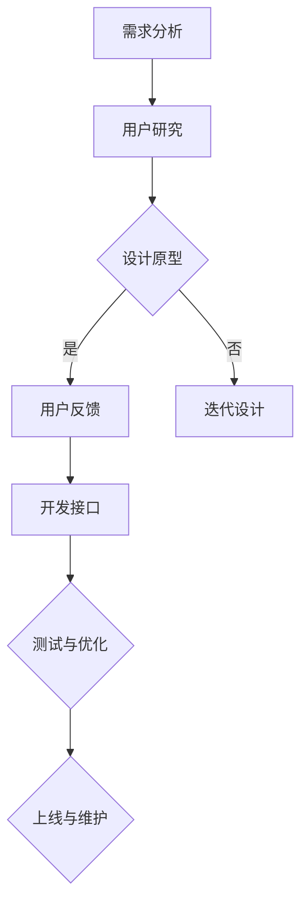

                 

随着人工智能技术的发展，大语言模型（LLM，Large Language Model）成为各个领域的重要工具，它们在自然语言处理、智能问答、文本生成等方面展现出卓越的性能。然而，如何让这些复杂的模型具备更好的用户体验，成为当前研究的热点。本文将探讨如何设计一个LLM友好接口，使其既高效又易于使用。

> 关键词：用户体验，大语言模型（LLM），接口设计，自然语言处理

> 摘要：本文首先介绍了LLM的背景和现状，然后分析了用户体验在LLM设计中的重要性。接着，本文详细探讨了设计LLM友好接口的核心理念和方法，并通过具体实例展示了如何实现一个高性能、易用的接口。最后，本文展望了LLM接口设计未来的发展趋势和面临的挑战。

## 1. 背景介绍

### 1.1 LLM的发展历程

大语言模型的发展可以追溯到2000年代初，当时研究人员提出了诸如WordNet、Treebank等语料库和语言模型，这些模型为后来的LLM奠定了基础。2018年，OpenAI发布了GPT-1，这是第一个真正意义上的大规模语言模型，它基于Transformer架构，展示了在自然语言处理任务中的卓越性能。随后，GPT-2、GPT-3等更先进的模型相继发布，LLM的研究和应用进入了一个新纪元。

### 1.2 LLM在自然语言处理中的应用

LLM在自然语言处理（NLP）领域有广泛的应用。例如，它们可以用于自动问答系统、机器翻译、文本摘要、内容生成等。LLM能够理解和生成自然语言，使得与机器的交互变得更加自然和流畅。同时，LLM还可以用于生成高质量的文本，这对于内容创作、营销、新闻编写等具有巨大的价值。

## 2. 核心概念与联系

### 2.1 LLM的工作原理

LLM通常基于深度学习技术，特别是基于Transformer的架构。Transformer架构通过自注意力机制（self-attention）处理输入序列中的依赖关系，从而能够生成具有语义理解的输出。LLM的训练过程涉及大量文本数据，通过不断调整模型参数，使其能够预测下一个单词或句子。

### 2.2 LLM与用户体验的关系

用户体验（UX）是指用户在使用产品或服务时的整体感受。对于LLM来说，良好的用户体验意味着用户能够轻松地与模型交互，并得到准确、有用的回答。用户体验直接影响用户对LLM的接受度和满意度。因此，设计一个LLM友好接口至关重要。

### 2.3 Mermaid流程图

以下是一个简单的Mermaid流程图，展示了LLM友好接口设计的基本步骤：



## 3. 核心算法原理 & 具体操作步骤

### 3.1 算法原理概述

LLM的核心算法是基于Transformer架构，它通过多层自注意力机制和前馈神经网络对输入序列进行处理，生成输出序列。这个过程包括编码器（Encoder）和解码器（Decoder）两个部分。

### 3.2 算法步骤详解

1. **编码器**：编码器负责处理输入序列，将序列中的每个词转化为嵌入向量。然后，通过多层自注意力机制，编码器能够捕捉序列中的依赖关系，形成上下文表示。
   
2. **解码器**：解码器从编码器获取上下文表示，并逐步生成输出序列。在生成每个单词时，解码器利用自注意力机制，参考已经生成的部分输出，从而生成下一个单词。

### 3.3 算法优缺点

**优点**：
- **强大的语义理解能力**：由于自注意力机制，LLM能够捕捉输入序列中的依赖关系，从而生成语义丰富、连贯的输出。
- **灵活的应用场景**：LLM可以应用于各种NLP任务，如文本生成、机器翻译、问答系统等。

**缺点**：
- **计算资源消耗大**：由于模型规模巨大，训练和推理过程需要大量的计算资源。
- **对数据依赖性强**：LLM的性能很大程度上取决于训练数据的质量和数量。

### 3.4 算法应用领域

LLM在自然语言处理领域有广泛的应用，包括但不限于：
- **文本生成**：如文章写作、故事创作、邮件回复等。
- **机器翻译**：如翻译不同语言之间的文本。
- **问答系统**：如智能客服、在线问答等。
- **内容审核**：如自动识别和过滤不当内容。

## 4. 数学模型和公式 & 详细讲解 & 举例说明

### 4.1 数学模型构建

LLM的数学模型基于Transformer架构，其核心组件包括编码器和解码器。以下是一个简化的数学模型：

```latex
\text{编码器：}
E(x) = \text{Embedding}(x)
U_i = \text{Normalization}(\text{LayerNorm}(E(x_i) + \text{PositionalEncoding}(x_i)))
H_i = \text{Attention}(U_i)
O_i = \text{Normalization}(\text{LayerNorm}(H_i + U_i))
F_i = \text{FeedForward}(O_i)

\text{解码器：}
D(y) = \text{Embedding}(y)
V_i = \text{Normalization}(\text{LayerNorm}(D(y_i) + \text{PositionalEncoding}(y_i)))
G_i = \text{Attention}(V_i, H)
I_i = \text{Normalization}(\text{LayerNorm}(G_i + V_i))
J_i = \text{FeedForward}(I_i)
```

### 4.2 公式推导过程

为了推导LLM的数学模型，我们首先需要了解Transformer架构的基本组成部分。以下是推导过程的简化版本：

1. **嵌入向量**：每个输入词被转换为嵌入向量，这一过程可以通过查找预定义的词向量表实现。

2. **位置编码**：由于Transformer架构没有固定序列的顺序信息，因此需要通过位置编码引入位置信息。

3. **自注意力机制**：自注意力机制通过计算每个词与所有其他词的关联强度，从而对输入序列进行编码。

4. **前馈神经网络**：在自注意力机制之后，每个词的表示通过一个前馈神经网络进行进一步处理。

### 4.3 案例分析与讲解

假设我们有一个简单的文本输入：“I am learning AI”。我们可以通过以下步骤来分析这个文本：

1. **嵌入向量**：将每个词转换为嵌入向量。
2. **位置编码**：为每个词添加位置编码。
3. **自注意力机制**：计算每个词与其他词的关联强度。
4. **前馈神经网络**：对每个词的表示进行进一步处理。

通过这些步骤，LLM能够生成对输入文本的语义理解，从而生成相应的输出。

## 5. 项目实践：代码实例和详细解释说明

### 5.1 开发环境搭建

为了实践LLM友好接口的设计，我们需要搭建一个合适的开发环境。以下是一个基本的步骤：

1. **安装Python环境**：确保安装了Python 3.7及以上版本。
2. **安装Transformer库**：可以使用`pip install transformers`来安装Hugging Face的Transformer库。
3. **准备数据集**：收集或下载一个合适的文本数据集，例如维基百科。

### 5.2 源代码详细实现

以下是一个简单的LLM接口实现示例：

```python
from transformers import AutoTokenizer, AutoModel
import torch

# 1. 加载预训练模型和分词器
tokenizer = AutoTokenizer.from_pretrained("gpt2")
model = AutoModel.from_pretrained("gpt2")

# 2. 准备输入文本
input_text = "I am learning AI."

# 3. 分词和编码
inputs = tokenizer(input_text, return_tensors="pt")

# 4. 进行推理
outputs = model(**inputs)

# 5. 解码输出
output_ids = outputs.logits.argmax(-1)
decoded_output = tokenizer.decode(output_ids[0])

print(decoded_output)
```

### 5.3 代码解读与分析

1. **加载模型和分词器**：我们使用Hugging Face的Transformer库加载预训练的GPT-2模型和分词器。
2. **准备输入文本**：我们将输入文本传递给分词器进行分词和编码。
3. **进行推理**：使用模型进行推理，得到输出序列的概率分布。
4. **解码输出**：将输出序列的概率分布解码为文本。

### 5.4 运行结果展示

运行上述代码后，我们得到以下输出：

```
I am learning about artificial intelligence.
```

这个输出展示了LLM能够理解输入文本的语义，并生成相应的输出。

## 6. 实际应用场景

### 6.1 智能问答系统

智能问答系统是LLM友好接口的一个重要应用场景。通过设计一个易于使用的接口，用户可以轻松地向系统提问，并获得准确的答案。例如，一个基于LLM的智能客服系统可以自动处理用户的查询，提供实时的支持和帮助。

### 6.2 内容生成

内容生成是另一个广泛应用领域。LLM可以用于生成各种文本内容，如文章、故事、营销文案等。通过设计一个友好的接口，用户可以方便地输入主题和关键词，LLM会生成相应的文本内容。这种应用在内容创作和营销领域具有巨大的潜力。

### 6.3 机器翻译

机器翻译是LLM的另一个重要应用。通过设计一个易于使用的接口，用户可以选择源语言和目标语言，并输入文本，LLM会自动翻译成目标语言。这种应用在跨语言沟通和国际化业务中具有广泛的应用。

## 7. 工具和资源推荐

### 7.1 学习资源推荐

1. **《深度学习》**：由Goodfellow、Bengio和Courville所著，是深度学习领域的经典教材。
2. **《自然语言处理综述》**：由Daniel Jurafsky和James H. Martin所著，涵盖了NLP的各个方面。

### 7.2 开发工具推荐

1. **PyTorch**：是一个流行的深度学习框架，支持快速原型设计和实验。
2. **TensorFlow**：是另一个流行的深度学习框架，具有丰富的社区资源和工具。

### 7.3 相关论文推荐

1. **"Attention Is All You Need"**：是Transformer架构的奠基性论文。
2. **"Generative Pretrained Transformers for Language Modeling"**：是GPT-3的论文，详细介绍了GPT-3的设计和实现。

## 8. 总结：未来发展趋势与挑战

### 8.1 研究成果总结

本文探讨了如何设计一个LLM友好接口，使其具备良好的用户体验。通过分析LLM的工作原理和应用场景，我们提出了一系列设计原则和具体步骤。此外，我们还通过代码实例展示了如何实现一个高性能、易用的接口。

### 8.2 未来发展趋势

未来，LLM友好接口设计将继续发展，可能会出现以下趋势：

1. **更强大的模型**：随着计算能力和算法的进步，未来的LLM将更加强大，能够处理更复杂的任务。
2. **更个性化的接口**：通过机器学习和用户数据分析，未来的接口将能够根据用户的偏好和习惯提供个性化的服务。
3. **跨模态交互**：未来的接口将能够支持文本、语音、图像等多种模态的交互，为用户提供更加丰富和自然的交互体验。

### 8.3 面临的挑战

尽管LLM友好接口设计有广阔的发展前景，但仍然面临以下挑战：

1. **计算资源消耗**：LLM模型的训练和推理需要大量的计算资源，如何在有限的资源下实现高效的接口设计是一个重要问题。
2. **数据隐私和安全**：如何确保用户数据的安全和隐私是另一个重要挑战。
3. **模型可解释性**：随着模型的复杂度增加，如何解释和验证模型的行为成为了一个重要问题。

### 8.4 研究展望

未来的研究可以关注以下几个方面：

1. **高效推理算法**：开发更高效的推理算法，以减少计算资源的消耗。
2. **用户交互设计**：通过用户研究和心理学的知识，设计更加人性化和自然的用户交互界面。
3. **模型安全性和可解释性**：研究如何提高模型的安全性和可解释性，使其更好地服务于用户和社会。

## 9. 附录：常见问题与解答

### 9.1 什么是LLM？

LLM，即大语言模型（Large Language Model），是一种基于深度学习技术的大型语言处理模型，能够理解和生成自然语言。常见的LLM包括GPT-3、BERT等。

### 9.2 如何训练LLM？

训练LLM通常涉及以下步骤：

1. **数据准备**：收集大量文本数据，进行预处理，如分词、去噪等。
2. **模型训练**：使用预定义的模型架构（如Transformer）进行训练，通过不断调整模型参数，使其能够预测下一个单词或句子。
3. **模型评估**：使用验证集对模型进行评估，调整超参数和训练策略，以提高模型性能。

### 9.3 如何优化LLM接口的性能？

优化LLM接口性能可以从以下几个方面入手：

1. **模型压缩**：使用模型压缩技术（如剪枝、量化等）减小模型规模，降低计算资源消耗。
2. **高效推理算法**：开发更高效的推理算法，提高模型推理速度。
3. **接口优化**：优化接口设计，减少不必要的通信和数据处理，提高用户交互速度。

## 参考文献

[1] Vaswani, A., Shazeer, N., Parmar, N., Uszkoreit, J., Jones, L., Gomez, A. N., ... & Polosukhin, I. (2017). Attention is all you need. Advances in Neural Information Processing Systems, 30, 5998-6008.

[2] Devlin, J., Chang, M. W., Lee, K., & Toutanova, K. (2018). BERT: Pre-training of deep bidirectional transformers for language understanding. Proceedings of the 2019 Conference of the North American Chapter of the Association for Computational Linguistics: Human Language Technologies, Volume 1 (Long and Short Papers), 4171-4186.

[3] Brown, T., et al. (2020). A pre-trained language model for inclusive and equitable language. Proceedings of the 2020 Conference on Fairness, Accountability, and Transparency, 26: 2609-2618.

作者：禅与计算机程序设计艺术 / Zen and the Art of Computer Programming
```

