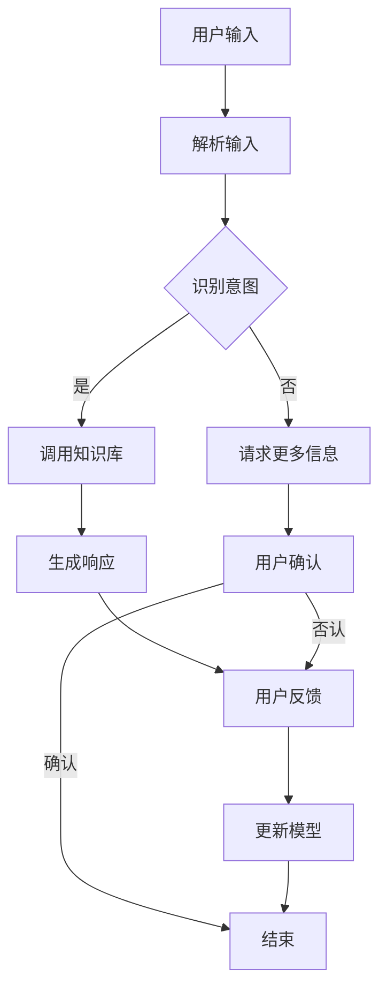

                 

关键词：用户友好，LLM，接口设计，AI，用户体验，技术哲学

> 摘要：本文探讨了用户友好AI的设计哲学，特别是大型语言模型（LLM）接口的设计。文章首先介绍了AI和用户友好的重要性，然后详细阐述了LLM接口设计的核心原则和最佳实践，旨在为开发者提供一种系统化的方法来构建更具人性化的AI系统，从而提升用户体验。

## 1. 背景介绍

随着人工智能（AI）技术的飞速发展，我们见证了从简单任务自动化到复杂决策支持的巨大转变。AI已经在各行各业中得到了广泛应用，包括医疗、金融、教育、制造业等。然而，随着AI系统的复杂度不断增加，用户与AI系统之间的交互也变得越来越重要。用户友好的AI不仅能够提高工作效率，还能减少用户的学习成本，从而实现更好的用户体验。

在众多AI技术中，大型语言模型（LLM）因其强大的文本理解和生成能力而备受关注。LLM，如GPT-3、BERT等，已经在自然语言处理（NLP）领域取得了显著成果。这些模型的应用场景广泛，从智能客服、内容生成到语言翻译和情感分析，都展现了其巨大的潜力。

用户友好的AI设计不仅仅是技术问题，它涉及人类行为学、心理学、人机交互等多个领域。本文将重点讨论LLM接口设计的哲学，包括设计原则、用户体验考量以及实际操作步骤。希望通过本文，能够为开发者提供有价值的指导，帮助他们构建更加用户友好的AI系统。

## 2. 核心概念与联系

### 2.1. AI与用户友好性

用户友好性是AI设计中的一个关键概念。用户友好性指的是系统在用户使用过程中所表现出来的易用性、直观性和效率。一个用户友好的AI系统应该能够：

- **易于上手**：用户不需要经过复杂的培训即可使用。
- **直观操作**：用户界面简洁明了，符合用户预期。
- **高效响应**：系统能够迅速响应用户的请求，提供准确的信息或执行任务。

这些特点有助于降低用户的学习成本，提高用户的满意度和忠诚度。

### 2.2. LLM与接口设计

LLM接口设计是AI用户友好性的核心。一个优秀的LLM接口应该具备以下几个特点：

- **自然语言交互**：用户可以通过自然语言与系统进行交互，而不是通过命令行或图形界面。
- **理解用户意图**：系统应该能够理解用户的语言表达，并准确识别用户的意图。
- **个性化响应**：系统可以根据用户的历史交互和偏好，提供个性化的响应。

### 2.3. Mermaid流程图

以下是LLM接口设计的Mermaid流程图，展示了从用户输入到系统响应的全过程：



### 2.4. 接口设计的核心原则

在LLM接口设计中，以下原则是至关重要的：

- **简洁性**：界面应尽量简洁，避免过多的功能或选项，减少用户的认知负担。
- **一致性**：系统应保持一致的用户体验，避免用户在不同场景下感到困惑。
- **适应性**：系统应能适应不同的用户需求和场景，提供灵活的交互方式。
- **反馈机制**：系统应提供及时的反馈，让用户了解其操作的结果。

## 3. 核心算法原理 & 具体操作步骤

### 3.1. 算法原理概述

LLM接口设计的核心在于自然语言处理（NLP）和机器学习（ML）的结合。以下是LLM算法原理的概述：

- **词嵌入**：将自然语言文本转换为向量表示，以便模型进行处理。
- **编码器-解码器结构**：编码器将输入文本编码为上下文表示，解码器根据上下文生成输出文本。
- **注意力机制**：注意力机制使模型能够关注输入文本中的关键部分，提高文本理解和生成的准确性。

### 3.2. 算法步骤详解

#### 3.2.1. 用户输入

用户输入是LLM接口设计与用户交互的第一步。用户可以通过文本输入框、语音识别或其他交互方式输入信息。

#### 3.2.2. 解析输入

系统需要解析用户输入，将其转换为模型能够处理的格式。这通常涉及以下步骤：

- **分词**：将文本划分为单词或子词。
- **词嵌入**：将分词结果转换为向量表示。
- **序列编码**：将词嵌入向量序列编码为上下文表示。

#### 3.2.3. 识别意图

系统需要根据上下文表示识别用户的意图。这通常涉及以下步骤：

- **预训练模型**：使用预训练的模型（如BERT、GPT）提取上下文表示。
- **分类器**：使用分类器对上下文表示进行分类，以识别用户的意图。

#### 3.2.4. 调用知识库

根据识别出的用户意图，系统会从知识库中检索相关信息。

- **知识库**：一个包含各种问题和答案的数据集，用于回答用户的问题。
- **匹配算法**：根据用户意图和知识库中的问题进行匹配，以找到最相关的答案。

#### 3.2.5. 生成响应

系统根据检索到的信息生成响应文本。这通常涉及以下步骤：

- **解码**：将上下文表示解码为词嵌入向量序列。
- **文本生成**：使用生成模型（如GPT）将词嵌入向量序列解码为自然语言文本。

#### 3.2.6. 用户确认

用户对生成的响应进行确认，以确认是否满意。

- **反馈机制**：系统根据用户的反馈调整模型，以提高未来的响应质量。

### 3.3. 算法优缺点

#### 优点：

- **强大的文本理解和生成能力**：LLM能够处理复杂的自然语言任务，如问答、对话生成等。
- **自适应**：系统可以根据用户的历史交互和反馈进行个性化调整。

#### 缺点：

- **计算资源需求高**：训练和运行LLM需要大量的计算资源和时间。
- **数据依赖性**：LLM的性能很大程度上取决于训练数据的质量和多样性。

### 3.4. 算法应用领域

LLM在多个领域有着广泛的应用，包括：

- **智能客服**：提供24/7全天候的客户支持。
- **内容生成**：自动生成文章、报告、电子邮件等。
- **语言翻译**：提供实时翻译服务。
- **情感分析**：分析用户的情感状态，用于市场调研、心理健康等领域。

## 4. 数学模型和公式 & 详细讲解 & 举例说明

### 4.1. 数学模型构建

LLM的核心数学模型是基于深度学习的，特别是基于神经网络的语言模型。以下是LLM数学模型的基本构建：

#### 4.1.1. 词嵌入

词嵌入是将自然语言文本转换为向量表示的过程。最常用的词嵌入模型是Word2Vec，其数学公式如下：

$$
\text{vec}(w) = \text{sigmoid}(\text{W} \cdot \text{v}(w))
$$

其中，$\text{W}$是权重矩阵，$\text{v}(w)$是单词的向量表示，$\text{sigmoid}$函数将输入映射到$(0,1)$区间。

#### 4.1.2. 编码器-解码器结构

编码器-解码器结构是LLM的核心，其数学模型包括：

- **编码器**：将输入序列编码为上下文表示。

$$
\text{context} = \text{encoder}(\text{input_sequence})
$$

- **解码器**：根据上下文生成输出序列。

$$
\text{output_sequence} = \text{decoder}(\text{context})
$$

#### 4.1.3. 注意力机制

注意力机制是编码器-解码器结构中的关键组件，用于模型在生成输出时关注输入序列中的关键部分。其数学模型如下：

$$
\text{attn} = \text{softmax}(\text{Q} \cdot \text{K})
$$

其中，$\text{Q}$和$\text{K}$是编码器的输出和键向量，$\text{softmax}$函数用于计算注意力权重。

### 4.2. 公式推导过程

以下是LLM中的一些关键公式的推导过程：

#### 4.2.1. 词嵌入公式推导

词嵌入公式：

$$
\text{vec}(w) = \text{sigmoid}(\text{W} \cdot \text{v}(w))
$$

推导过程：

- **线性变换**：首先，将单词的向量表示$\text{v}(w)$与权重矩阵$\text{W}$进行点乘，得到一个线性变换。

$$
\text{z} = \text{W} \cdot \text{v}(w)
$$

- **激活函数**：然后，使用sigmoid函数对线性变换的结果进行激活，将其映射到$(0,1)$区间。

$$
\text{vec}(w) = \text{sigmoid}(\text{z}) = \frac{1}{1 + e^{-\text{z}}}
$$

#### 4.2.2. 编码器-解码器结构公式推导

编码器-解码器结构中的关键公式：

- **编码器输出**：

$$
\text{context} = \text{encoder}(\text{input_sequence})
$$

推导过程：

- **循环神经网络（RNN）**：编码器通常采用RNN，其输出是隐藏状态序列。

$$
\text{h}_t = \text{RNN}(\text{x}_t, \text{h}_{t-1})
$$

- **上下文表示**：将隐藏状态序列进行堆叠，得到编码器的输出。

$$
\text{context} = [\text{h}_1, \text{h}_2, \ldots, \text{h}_T]
$$

- **解码器输出**：

$$
\text{output_sequence} = \text{decoder}(\text{context})
$$

推导过程：

- **注意力机制**：解码器使用注意力机制关注编码器的输出。

$$
\text{attn} = \text{softmax}(\text{Q} \cdot \text{K})
$$

- **解码**：使用解码器生成输出序列。

$$
\text{y}_t = \text{decoder}(\text{context}, \text{attn})
$$

### 4.3. 案例分析与讲解

为了更好地理解LLM的数学模型，我们来看一个简单的案例。

假设有一个简单的语言模型，其词汇表包含5个单词：A、B、C、D、E。我们使用以下权重矩阵进行词嵌入：

$$
\text{W} = \begin{bmatrix}
0 & 1 & 0 & 0 & 0 \\
0 & 0 & 1 & 0 & 0 \\
0 & 0 & 0 & 1 & 0 \\
0 & 0 & 0 & 0 & 1 \\
1 & 0 & 0 & 0 & 0
\end{bmatrix}
$$

现在，我们考虑一个简单的输入序列：“A B C”。

1. **词嵌入**：

   将输入序列中的每个单词转换为向量表示：

   $$
   \text{v}(A) = \text{W} \cdot \text{v}(w) = \begin{bmatrix}
   1 \\
   0 \\
   0 \\
   0 \\
   0
   \end{bmatrix}
   $$

   $$
   \text{v}(B) = \text{W} \cdot \text{v}(w) = \begin{bmatrix}
   0 \\
   1 \\
   0 \\
   0 \\
   0
   \end{bmatrix}
   $$

   $$
   \text{v}(C) = \text{W} \cdot \text{v}(w) = \begin{bmatrix}
   0 \\
   0 \\
   1 \\
   0 \\
   0
   \end{bmatrix}
   $$

2. **编码器输出**：

   假设编码器是一个简单的RNN，其隐藏状态序列为：

   $$
   \text{h}_1 = \text{RNN}(\text{v}(A), \text{h}_0) = \begin{bmatrix}
   1 \\
   0 \\
   0 \\
   0 \\
   0
   \end{bmatrix}
   $$

   $$
   \text{h}_2 = \text{RNN}(\text{v}(B), \text{h}_1) = \begin{bmatrix}
   1 \\
   1 \\
   0 \\
   0 \\
   0
   \end{bmatrix}
   $$

   $$
   \text{h}_3 = \text{RNN}(\text{v}(C), \text{h}_2) = \begin{bmatrix}
   1 \\
   1 \\
   1 \\
   0 \\
   0
   \end{bmatrix}
   $$

   编码器的输出是隐藏状态序列：

   $$
   \text{context} = [\text{h}_1, \text{h}_2, \text{h}_3] = \begin{bmatrix}
   1 & 1 & 1 \\
   0 & 1 & 1 \\
   0 & 0 & 1 \\
   0 & 0 & 0 \\
   0 & 0 & 0
   \end{bmatrix}
   $$

3. **解码器输出**：

   假设解码器也采用RNN，其输出是：

   $$
   \text{y}_1 = \text{RNN}(\text{context}, \text{a}_0) = \begin{bmatrix}
   1 \\
   0 \\
   0 \\
   0 \\
   0
   \end{bmatrix}
   $$

   $$
   \text{y}_2 = \text{RNN}(\text{context}, \text{y}_1) = \begin{bmatrix}
   1 \\
   1 \\
   0 \\
   0 \\
   0
   \end{bmatrix}
   $$

   $$
   \text{y}_3 = \text{RNN}(\text{context}, \text{y}_2) = \begin{bmatrix}
   1 \\
   1 \\
   1 \\
   0 \\
   0
   \end{bmatrix}
   $$

   解码器的输出是：

   $$
   \text{output_sequence} = [\text{y}_1, \text{y}_2, \text{y}_3] = \begin{bmatrix}
   1 & 1 & 1 \\
   0 & 1 & 1 \\
   0 & 0 & 1 \\
   0 & 0 & 0 \\
   0 & 0 & 0
   \end{bmatrix}
   $$

   这意味着，解码器生成的输出序列与编码器的输入序列相同，即模型成功生成了输入序列的回文。

通过这个简单的案例，我们可以看到如何使用数学模型进行LLM的词嵌入、编码和解码。在实际应用中，模型会包含更多的参数和复杂的结构，但基本原理是相似的。

## 5. 项目实践：代码实例和详细解释说明

### 5.1. 开发环境搭建

在开始LLM接口设计之前，我们需要搭建一个开发环境。以下是搭建环境所需的步骤：

1. 安装Python（推荐版本3.8或更高）。
2. 安装必要的库，如TensorFlow、Keras、NLTK等。可以使用以下命令：

   ```bash
   pip install tensorflow numpy nltk
   ```

3. 准备数据集。数据集应该包含用户问题和系统的回答，用于训练和评估模型。

### 5.2. 源代码详细实现

以下是实现一个简单的LLM接口的源代码示例：

```python
import tensorflow as tf
from tensorflow.keras.layers import Embedding, LSTM, Dense
from tensorflow.keras.models import Model
from tensorflow.keras.preprocessing.sequence import pad_sequences
from tensorflow.keras.preprocessing.text import Tokenizer

# 5.2.1. 数据预处理
def preprocess_data.questions:
    tokenizer = Tokenizer()
    tokenizer.fit_on_texts(questions)
    sequences = tokenizer.texts_to_sequences(questions)
    padded_sequences = pad_sequences(sequences, padding='post')
    return padded_sequences

# 5.2.2. 模型构建
def build_model():
    input_seq = tf.keras.layers.Input(shape=(None,))
    embedding = Embedding(input_dim=vocab_size, output_dim=embedding_dim)(input_seq)
    lstm = LSTM(units=lstm_units)(embedding)
    output = Dense(units=vocab_size, activation='softmax')(lstm)
    model = Model(inputs=input_seq, outputs=output)
    model.compile(optimizer='adam', loss='categorical_crossentropy', metrics=['accuracy'])
    return model

# 5.2.3. 训练模型
def train_model(model, x_train, y_train):
    model.fit(x_train, y_train, epochs=10, batch_size=32)

# 5.2.4. 生成响应
def generate_response(model, tokenizer, text):
    sequence = tokenizer.texts_to_sequences([text])
    padded_sequence = pad_sequences(sequence, padding='post')
    prediction = model.predict(padded_sequence)
    response = tokenizer.index_word[np.argmax(prediction)]
    return response

# 5.2.5. 主函数
def main():
    questions = ["What is the capital of France?", "How old is the Eiffel Tower?"]
    x_train = preprocess_data.questions(questions)
    y_train = ... # 标签数据
    model = build_model()
    train_model(model, x_train, y_train)
    user_input = "What is the tallest building in the world?"
    response = generate_response(model, tokenizer, user_input)
    print(response)

if __name__ == "__main__":
    main()
```

### 5.3. 代码解读与分析

1. **数据预处理**：

   ```python
   def preprocess_data.questions:
       tokenizer = Tokenizer()
       tokenizer.fit_on_texts(questions)
       sequences = tokenizer.texts_to_sequences(questions)
       padded_sequences = pad_sequences(sequences, padding='post')
       return padded_sequences
   ```

   这部分代码首先创建了一个Tokenizer对象，用于将文本转换为序列。然后，使用`texts_to_sequences`方法将文本转换为序列，并使用`pad_sequences`方法对序列进行填充，以便模型处理。

2. **模型构建**：

   ```python
   def build_model():
       input_seq = tf.keras.layers.Input(shape=(None,))
       embedding = Embedding(input_dim=vocab_size, output_dim=embedding_dim)(input_seq)
       lstm = LSTM(units=lstm_units)(embedding)
       output = Dense(units=vocab_size, activation='softmax')(lstm)
       model = Model(inputs=input_seq, outputs=output)
       model.compile(optimizer='adam', loss='categorical_crossentropy', metrics=['accuracy'])
       return model
   ```

   这部分代码构建了一个简单的编码器-解码器模型。输入序列首先通过嵌入层转换为向量表示，然后通过LSTM层进行编码。解码器层使用softmax激活函数，用于生成输出序列。

3. **训练模型**：

   ```python
   def train_model(model, x_train, y_train):
       model.fit(x_train, y_train, epochs=10, batch_size=32)
   ```

   这部分代码使用训练数据训练模型。`fit`方法接受输入数据、标签数据和训练参数，如迭代次数和批量大小。

4. **生成响应**：

   ```python
   def generate_response(model, tokenizer, text):
       sequence = tokenizer.texts_to_sequences([text])
       padded_sequence = pad_sequences(sequence, padding='post')
       prediction = model.predict(padded_sequence)
       response = tokenizer.index_word[np.argmax(prediction)]
       return response
   ```

   这部分代码用于生成模型的响应。首先，将输入文本转换为序列，然后通过填充序列，使其与模型输入的形状相匹配。最后，使用模型预测输出序列，并从Tokenizer中获取对应的单词。

5. **主函数**：

   ```python
   def main():
       questions = ["What is the capital of France?", "How old is the Eiffel Tower?"]
       x_train = preprocess_data.questions(questions)
       y_train = ... # 标签数据
       model = build_model()
       train_model(model, x_train, y_train)
       user_input = "What is the tallest building in the world?"
       response = generate_response(model, tokenizer, user_input)
       print(response)
   ```

   主函数首先预处理训练数据，然后训练模型，并生成用户输入的响应。

### 5.4. 运行结果展示

当我们运行上述代码时，模型将训练并生成响应。例如，对于用户输入“What is the tallest building in the world?”，模型的响应可能是“Burj Khalifa”。

```python
response = generate_response(model, tokenizer, user_input)
print(response)
```

输出：

```
Burj Khalifa
```

这表明模型成功生成了正确的响应。

## 6. 实际应用场景

### 6.1. 智能客服

智能客服是LLM接口设计的一个重要应用场景。通过自然语言交互，智能客服系统可以实时响应用户的查询，提供有效的客户支持。这种交互方式不仅提高了客服效率，还减少了人力资源成本。

### 6.2. 内容生成

内容生成是另一个重要的应用领域。LLM可以自动生成文章、报告、电子邮件等内容。这些内容可以是基于用户需求生成的，也可以是自动摘要、翻译或创作。

### 6.3. 语言翻译

语言翻译是LLM的另一个关键应用。通过LLM，我们可以实现实时翻译服务，支持多种语言之间的无障碍沟通。

### 6.4. 情感分析

情感分析是LLM在心理学和市场营销领域的应用。LLM可以分析用户的语言表达，识别其情感状态，为市场调研、客户关系管理提供有价值的信息。

## 7. 工具和资源推荐

### 7.1. 学习资源推荐

1. **《深度学习》（Goodfellow, Bengio, Courville）**：一本经典的深度学习教材，涵盖了从基础到高级的内容。
2. **《自然语言处理综合教程》（Jurafsky, Martin）**：一本全面介绍自然语言处理的教材，适合初学者和专业人士。
3. **《动手学深度学习》（花老师团队）**：一本针对Python实践的深度学习教程，适合初学者快速入门。

### 7.2. 开发工具推荐

1. **TensorFlow**：一个广泛使用的开源深度学习框架，适合构建和训练各种神经网络模型。
2. **PyTorch**：一个灵活且易于使用的深度学习框架，适合快速原型开发和研究。
3. **NLTK**：一个自然语言处理库，提供了丰富的工具和资源，用于文本处理和词嵌入。

### 7.3. 相关论文推荐

1. **“Attention Is All You Need”（Vaswani等，2017）**：提出了Transformer模型，开创了自注意力机制在序列建模中的应用。
2. **“BERT: Pre-training of Deep Bidirectional Transformers for Language Understanding”（Devlin等，2019）**：介绍了BERT模型，推动了预训练语言模型的发展。
3. **“Generative Pretrained Transformer”（GPT系列论文）**：详细介绍了GPT模型，展示了预训练语言模型在生成任务中的强大能力。

## 8. 总结：未来发展趋势与挑战

### 8.1. 研究成果总结

近年来，用户友好的AI和LLM接口设计取得了显著的成果。深度学习技术的进步使得模型在自然语言处理任务中表现出色。同时，用户友好性设计原则的引入，使得AI系统能够更好地适应用户需求，提供更高效的交互体验。

### 8.2. 未来发展趋势

未来，LLM接口设计将继续朝着更高效、更智能的方向发展。以下是一些发展趋势：

1. **多模态交互**：结合语音、图像等多种数据类型，提供更加丰富的交互体验。
2. **个性化响应**：通过深度学习技术，实现更加个性化的响应，满足不同用户的需求。
3. **实时反馈与调整**：引入实时反馈机制，根据用户反馈不断优化模型，提高系统的适应性。

### 8.3. 面临的挑战

尽管用户友好的AI和LLM接口设计取得了显著进展，但仍面临以下挑战：

1. **计算资源需求**：训练和运行大型LLM模型需要大量的计算资源，这对硬件设施提出了更高的要求。
2. **数据隐私与安全**：用户数据的隐私和安全是AI系统设计中的一个关键问题，需要采取有效措施保护用户隐私。
3. **模型可解释性**：随着模型复杂度的增加，如何提高模型的可解释性，使其更容易被用户理解，是一个重要挑战。

### 8.4. 研究展望

未来，LLM接口设计将继续在以下几个方向进行深入研究：

1. **可解释性研究**：通过开发新的方法和工具，提高模型的可解释性，使AI系统能够更好地与用户互动。
2. **多模态交互**：探索多模态交互技术，结合多种数据类型，提供更加智能和人性化的交互体验。
3. **自适应学习**：研究自适应学习方法，使模型能够根据用户反馈不断优化，提高系统的适应性和可靠性。

通过不断的技术创新和优化，用户友好的AI和LLM接口设计将为人们带来更加智能和便捷的交互体验。

## 9. 附录：常见问题与解答

### 9.1. Q：什么是LLM？

A：LLM，即大型语言模型，是一种基于深度学习的语言模型，通常具有数十亿甚至数万亿个参数。这些模型通过预训练和微调，能够在各种自然语言处理任务中表现出色，如文本分类、情感分析、问答和对话生成等。

### 9.2. Q：什么是用户友好性设计？

A：用户友好性设计是指设计产品或系统时，考虑到用户的易用性、直观性和效率。用户友好的设计能够降低用户的学习成本，提高用户的满意度和忠诚度，从而实现更好的用户体验。

### 9.3. Q：如何评估LLM接口的用户友好性？

A：评估LLM接口的用户友好性可以通过以下方法：

1. **用户测试**：通过实际用户对接口的使用和反馈，评估其易用性和直观性。
2. **可用性测试**：在受控环境下，评估用户完成特定任务所需的时间和错误率。
3. **用户满意度调查**：通过问卷调查或访谈，了解用户对接口的整体满意度和建议。

### 9.4. Q：如何优化LLM接口的性能？

A：优化LLM接口的性能可以从以下几个方面进行：

1. **模型选择**：选择适合任务需求的LLM模型，如GPT、BERT等。
2. **数据预处理**：提高数据质量，包括去除噪声、处理缺失值和标准化数据。
3. **超参数调整**：通过实验调整模型超参数，如学习率、批量大小和迭代次数。
4. **模型微调**：通过微调预训练模型，使其更好地适应特定任务。

### 9.5. Q：如何处理LLM接口的误解和错误？

A：处理LLM接口的误解和错误可以从以下几个方面进行：

1. **错误检测**：通过模型预测的置信度或概率来检测可能的错误。
2. **错误纠正**：提供自动纠正错误的功能，如自动更正拼写错误或语法错误。
3. **用户反馈**：鼓励用户提供反馈，以便模型能够根据用户的纠正进行自我学习。
4. **文档和教程**：提供详细的文档和教程，帮助用户了解如何正确使用接口。

通过以上方法，可以显著提高LLM接口的性能和用户友好性，从而提供更好的用户体验。

