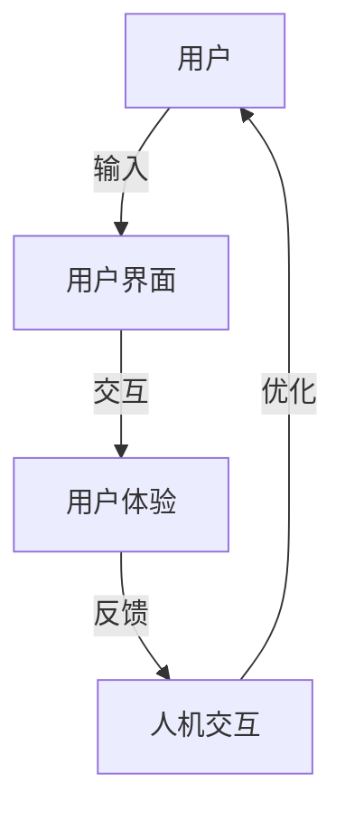

                 

关键词：用户界面设计、人机交互、用户体验、UI/UX、易用性、设计原则、设计工具、案例分析

> 摘要：本文旨在探讨用户界面设计在打造友好易用的人机交互体验中的重要性。通过介绍核心概念、设计原则、算法原理以及实际应用案例，本文将为设计师和开发者提供一套系统的用户界面设计方法论，以指导他们在实际项目中打造高质量的交互体验。

## 1. 背景介绍

随着信息技术的飞速发展，用户界面（User Interface，简称UI）和用户体验（User Experience，简称UX）设计已成为软件产品成功的关键因素。无论是移动应用、Web服务还是桌面软件，用户界面都是用户与软件系统交互的桥梁。一个良好的用户界面设计不仅能提高用户的满意度和忠诚度，还能显著提升产品的市场竞争力。

用户界面设计不仅仅是视觉上的美感，它还包括用户交互流程的优化、信息架构的合理布局、导航逻辑的清晰易懂等多方面内容。设计一个友好易用的用户界面，需要综合考虑用户需求、技术实现、商业模式等多方面因素。

本文将围绕以下主题展开：

- 核心概念与联系
- 核心算法原理与操作步骤
- 数学模型和公式
- 项目实践：代码实例解析
- 实际应用场景与未来展望
- 工具和资源推荐
- 总结与展望

通过这些内容的讲解，读者将能够全面了解用户界面设计的重要性和实现方法。

### 2. 核心概念与联系

在设计用户界面时，有几个核心概念和联系需要明确。首先，我们来看一下几个关键的定义：

#### 2.1 用户界面（UI）

用户界面是指用户与软件系统交互的界面，包括按钮、图标、菜单、文本框等各种元素。一个良好的UI设计应该具备以下几个特点：

1. **易用性**：界面应直观易懂，用户无需花费过多时间学习就能使用。
2. **美观性**：设计应具有吸引力和美感，符合用户审美。
3. **一致性**：界面元素在视觉和交互上的风格应保持一致。
4. **反馈**：用户操作后应有明显的视觉或听觉反馈，确保用户知道系统已响应。

#### 2.2 用户体验（UX）

用户体验涵盖了用户在使用产品过程中所感受到的所有方面，包括感知、情感、行为和成就等。一个良好的UX设计应关注以下几点：

1. **目标导向**：界面设计应明确用户的任务和目标，并引导用户完成。
2. **易访问性**：界面应无障碍，包括为残障人士提供辅助功能。
3. **效率**：用户应能快速找到所需功能，减少认知负荷。
4. **情感共鸣**：设计应能够与用户产生情感共鸣，提高用户忠诚度。

#### 2.3 人机交互（HCI）

人机交互（Human-Computer Interaction，简称HCI）是研究人类与计算机系统之间交互的学科。它涉及心理学、计算机科学、设计学等多个领域。HCI的目标是设计出易用、高效、愉悦的交互系统。

##### Mermaid 流程图

下面是一个简化的Mermaid流程图，展示了UI、UX和HCI之间的联系：



通过这个流程图，我们可以看到用户与用户界面进行交互，生成用户体验，进而影响人机交互，并通过不断的优化，形成一个良性循环。

### 3. 核心算法原理与操作步骤

用户界面设计的核心在于如何合理地组织和展示信息，使其易于用户理解和操作。这里，我们将介绍几个关键的设计原则和算法原理，以及具体操作步骤。

#### 3.1 设计原则

1. **简洁性**：界面应尽量简洁，避免冗余信息。
2. **直观性**：界面设计应直观，用户一眼就能理解其功能。
3. **一致性**：界面风格和交互逻辑应保持一致。
4. **反馈**：用户操作后应有明确的视觉或听觉反馈。

#### 3.2 算法原理

1. **信息架构**：信息架构是界面的骨架，决定信息的组织和展示方式。常用的算法包括信息分层、导航设计、内容优先级排序等。
2. **响应式设计**：响应式设计算法能够根据不同设备尺寸和分辨率，自动调整界面布局和元素大小，确保在不同设备上均有良好体验。

##### 具体操作步骤

1. **需求分析**：明确用户需求和目标，收集用户反馈。
2. **原型设计**：使用工具（如Figma、Sketch等）制作界面原型。
3. **用户测试**：通过用户测试，收集反馈，调整设计。
4. **迭代优化**：根据测试结果不断迭代和优化设计。

#### 3.3 算法优缺点

1. **优点**：
   - 提高用户满意度：通过合理设计，提高用户操作的效率和愉悦感。
   - 增强产品竞争力：良好的界面设计能提升产品的市场竞争力。
   - 降低维护成本：设计良好的界面易于维护和更新。

2. **缺点**：
   - 需要较长时间的迭代和测试：设计过程可能需要多次迭代和测试。
   - 需要跨部门协作：界面设计涉及多个部门，需要协调和沟通。

#### 3.4 算法应用领域

- 移动应用：如手机游戏、社交媒体应用等。
- Web服务：如电子商务网站、在线教育平台等。
- 桌面软件：如办公软件、设计工具等。

### 4. 数学模型和公式

用户界面设计中的数学模型和公式主要用于信息架构和响应式设计。以下是一些常用的模型和公式：

#### 4.1 数学模型构建

1. **信息熵**：用于评估界面信息的混乱程度。公式如下：

   $$ H = -\sum_{i} p_i \log_2 p_i $$

   其中，$p_i$ 是界面中第 $i$ 个元素的概率。

2. **响应时间**：用于评估用户操作系统的响应速度。公式如下：

   $$ RT = \frac{1}{f} $$

   其中，$f$ 是系统的刷新频率。

#### 4.2 公式推导过程

1. **信息熵**推导：

   信息熵来源于信息论，最早由克劳德·香农提出。香农认为，信息是一种不确定性的度量，而信息熵则是这种不确定性的数学表示。

   假设我们有一个随机变量 $X$，它的可能取值有 $x_1, x_2, ..., x_n$，且每个取值的概率为 $p_1, p_2, ..., p_n$。那么，$X$ 的熵 $H(X)$ 可以表示为：

   $$ H(X) = -\sum_{i} p_i \log_2 p_i $$

   这里的对数函数用来衡量概率的“不确定性”。概率越大，对数值越小，整个熵值也越小。

2. **响应时间**推导：

   响应时间主要取决于系统的刷新频率。假设系统的刷新频率为 $f$（单位为Hz），那么系统每秒可以响应 $f$ 次操作。因此，每次响应的时间为：

   $$ RT = \frac{1}{f} $$

   这里的倒数关系表明，刷新频率越高，响应时间越短。

#### 4.3 案例分析与讲解

以一个电子商务网站为例，我们使用信息熵和响应时间来评估其界面设计。

1. **信息熵**：

   假设网站首页有5个主要导航按钮，分别是“商品分类”、“购物车”、“客户服务”、“联系我们”和“关于我们”。根据用户行为数据，这些按钮的访问概率分别为 $p_1 = 0.6$，$p_2 = 0.2$，$p_3 = 0.1$，$p_4 = 0.05$ 和 $p_5 = 0.05$。那么，首页的信息熵为：

   $$ H = -0.6 \log_2 0.6 - 0.2 \log_2 0.2 - 0.1 \log_2 0.1 - 0.05 \log_2 0.05 - 0.05 \log_2 0.05 $$

   $$ H \approx 1.47 $$

   信息熵较低，表明首页的信息组织较为清晰。

2. **响应时间**：

   假设网站使用的是100Hz的刷新频率，那么每次响应的时间为：

   $$ RT = \frac{1}{100} = 0.01s $$

   响应时间较短，表明用户操作后能够快速得到反馈。

### 5. 项目实践：代码实例和详细解释说明

为了更好地理解用户界面设计，我们将通过一个实际的项目案例来进行讲解。本案例将使用Python和PyQt5库来构建一个简单的用户界面，并详细解释每个部分的实现。

#### 5.1 开发环境搭建

首先，确保已安装Python和PyQt5。可以按照以下步骤进行：

```bash
pip install PyQt5
```

#### 5.2 源代码详细实现

以下是一个简单的Python代码实例，用于创建一个带有按钮和标签的界面：

```python
import sys
from PyQt5.QtWidgets import QApplication, QWidget, QPushButton, QLabel

def main():
    app = QApplication(sys.argv)

    window = QWidget()
    window.setWindowTitle('简单用户界面')

    label = QLabel('欢迎使用！')
    button = QPushButton('点击我')

    button.clicked.connect(on_button_click)

    layout = QVBoxLayout()
    layout.addWidget(label)
    layout.addWidget(button)

    window.setLayout(layout)
    window.show()

    sys.exit(app.exec_())

def on_button_click():
    label.setText('已点击！')

if __name__ == '__main__':
    main()
```

#### 5.3 代码解读与分析

1. **导入模块**：

   ```python
   import sys
   from PyQt5.QtWidgets import QApplication, QWidget, QPushButton, QLabel
   ```

   这里导入了Python的标准库和PyQt5的模块。

2. **定义应用程序和窗口**：

   ```python
   def main():
       app = QApplication(sys.argv)
       window = QWidget()
       window.setWindowTitle('简单用户界面')
   ```

   创建一个`QApplication`实例，这是PyQt5中所有GUI应用程序的基础。然后创建一个`QWidget`作为主窗口，并设置窗口的标题。

3. **添加控件**：

   ```python
   label = QLabel('欢迎使用！')
   button = QPushButton('点击我')
   ```

   创建一个标签（`QLabel`）和一个按钮（`QPushButton`）。标签用于显示文本，按钮用于响应用户点击。

4. **连接信号与槽**：

   ```python
   button.clicked.connect(on_button_click)
   ```

   这里使用`clicked`信号连接了一个名为`on_button_click`的槽函数，当按钮被点击时，该函数将被调用。

5. **布局**：

   ```python
   layout = QVBoxLayout()
   layout.addWidget(label)
   layout.addWidget(button)
   window.setLayout(layout)
   ```

   使用垂直布局（`QVBoxLayout`）将标签和按钮添加到窗口中。布局是PyQt5中用于组织和排列控件的重要机制。

6. **运行应用程序**：

   ```python
   sys.exit(app.exec_())
   ```

   启动应用程序，并等待用户交互。

#### 5.4 运行结果展示

运行上面的代码后，将看到一个简单的窗口，其中包含一个标签和一个按钮。点击按钮时，标签的文本将更新为“已点击！”，展示了一个基本的用户交互。

### 6. 实际应用场景

用户界面设计在许多实际应用场景中至关重要。以下是一些典型的应用场景：

#### 6.1 移动应用

移动应用的用户界面设计尤其关键，因为用户通常在有限的空间和时间压力下使用移动设备。例如，社交媒体应用如Facebook和Instagram，其界面设计注重简洁和高效，用户可以快速发布内容、浏览动态和与朋友互动。

#### 6.2 Web服务

Web服务的用户界面设计对于用户体验同样重要。电子商务网站如Amazon和Etsy，通过优化的界面设计，提供了便捷的购物体验，用户可以轻松搜索商品、添加购物车和完成支付。

#### 6.3 桌面软件

桌面软件的用户界面设计也需要考虑用户的长期使用和高效操作。例如，Microsoft Office系列软件提供了丰富的功能和直观的界面，帮助用户高效完成各种办公任务。

#### 6.4 未来应用展望

随着技术的发展，用户界面设计将继续演化。以下是几个未来可能的发展方向：

1. **人工智能与界面设计**：人工智能将帮助设计师更好地理解用户需求，通过个性化推荐和自适应界面，提供更加个性化的用户体验。
2. **增强现实与虚拟现实**：随着AR和VR技术的成熟，用户界面将变得更加沉浸和互动，为用户提供全新的交互体验。
3. **无界面交互**：语音助手和智能聊天机器人等无界面交互方式正在兴起，用户可以通过语音命令与系统进行交互，减少对传统界面的依赖。

### 7. 工具和资源推荐

为了更好地进行用户界面设计，以下是几个推荐的工具和资源：

#### 7.1 学习资源推荐

- 《用户体验要素》 - 作者是Joel Spolsky，这本书详细介绍了用户体验设计的各个方面。
- 《设计心理学》 - 作者是Don Norman，这本书探讨了设计如何影响人类行为和体验。

#### 7.2 开发工具推荐

- Figma：一款流行的设计工具，支持多人协作和实时预览。
- Sketch：适用于macOS的设计工具，提供了丰富的图标和组件库。

#### 7.3 相关论文推荐

- "The Design of Sites" - Don Norman，这篇文章详细介绍了Web设计的原则。
- "The Design of Everyday Things" - Don Norman，这本书探讨了产品设计的基本原则。

### 8. 总结：未来发展趋势与挑战

用户界面设计在软件产品中扮演着至关重要的角色。随着技术的不断进步，用户界面设计也将迎来新的发展。未来，人工智能和机器学习将帮助设计师更好地理解用户需求，提供个性化的交互体验。同时，随着增强现实和虚拟现实技术的发展，用户界面将变得更加沉浸和互动。然而，面对日益复杂的用户需求和技术挑战，设计师和开发者需要不断学习和创新，以提供高质量的交互体验。

### 9. 附录：常见问题与解答

#### 9.1 什么是用户体验（UX）设计？

用户体验设计是设计学科的一个分支，关注用户在使用产品或服务过程中的所有体验，包括情感、行为和认知等方面。它旨在优化用户的使用体验，提高用户满意度。

#### 9.2 用户界面设计（UI）和用户体验设计（UX）有什么区别？

用户界面设计（UI）专注于产品界面的视觉和交互设计，包括布局、颜色、字体和按钮等元素。用户体验设计（UX）则更广泛，涵盖整个用户旅程，包括用户需求分析、信息架构、交互设计和用户体验测试等。

#### 9.3 如何评估一个用户界面设计的好坏？

评估用户界面设计的好坏可以从多个维度进行，包括：

- **易用性**：用户能否轻松完成目标任务。
- **美观性**：设计是否符合用户审美，是否具有吸引力。
- **一致性**：界面风格和交互逻辑是否一致。
- **反馈**：用户操作后是否有明确的反馈。

### 作者署名

作者：禅与计算机程序设计艺术 / Zen and the Art of Computer Programming
------------------------------------------------------------------------

