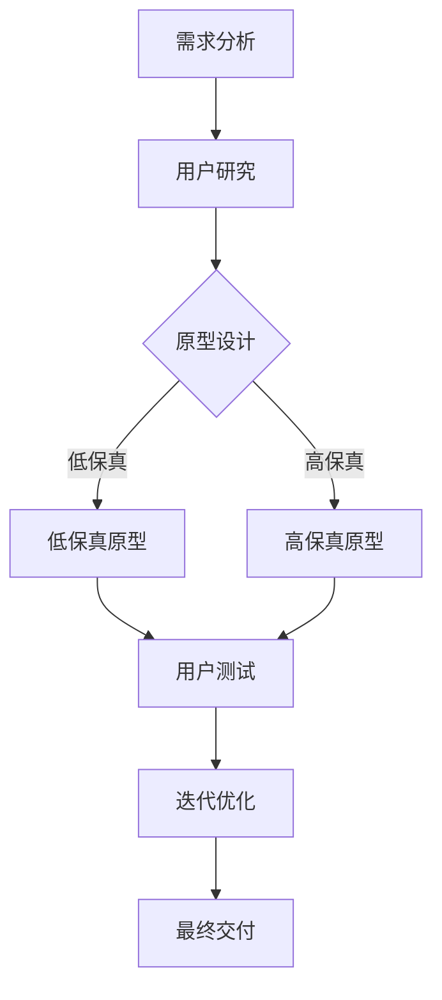

                 

关键词：用户界面设计，人机交互，用户体验，UI/UX，设计原则，最佳实践

> 摘要：本文深入探讨了用户界面设计的核心概念、设计原则、方法和最佳实践，旨在帮助开发者和设计师打造出既美观又易用的用户界面，提升人机交互的体验。

## 1. 背景介绍

随着互联网和移动设备的普及，用户界面设计（User Interface Design，简称UI设计）已经成为现代软件和应用程序开发中不可或缺的一部分。用户界面设计的目标是创建直观、美观、易于使用的交互界面，使最终用户能够高效地完成操作任务，从而提升用户体验（User Experience，简称UX）。

一个成功的用户界面设计不仅需要满足功能需求，还要关注用户的心理感受。因此，设计者需要深入理解用户行为、心理和需求，并结合设计原则和工具进行创新和优化。

本文将从以下几个角度探讨用户界面设计：

1. **核心概念与联系**：介绍用户界面设计的核心概念，如用户界面、用户体验、交互设计等，并分析它们之间的关系。
2. **核心算法原理 & 具体操作步骤**：详细讲解用户界面设计的基本原理和流程，包括需求分析、原型设计、界面布局、交互设计等。
3. **数学模型和公式 & 详细讲解 & 举例说明**：介绍用户界面设计中的数学模型和公式，如信息熵、用户体验度量等，并通过具体案例进行分析。
4. **项目实践：代码实例和详细解释说明**：提供实际项目中的用户界面设计案例，包括开发环境搭建、源代码实现、代码解读与分析等。
5. **实际应用场景**：探讨用户界面设计在各个领域的应用，如Web应用、移动应用、桌面应用等，并分析其特点。
6. **工具和资源推荐**：推荐学习用户界面设计的相关资源和工具，帮助读者快速提升设计能力。
7. **总结：未来发展趋势与挑战**：总结用户界面设计的研究成果和未来发展趋势，以及面临的挑战。

### 1.1 用户界面设计的核心概念

用户界面（User Interface，简称UI）是用户与系统之间进行交互的界面，包括图形界面、命令行界面、触摸界面等。用户界面设计的目标是创建一个直观、美观、易用的交互环境，使用户能够轻松地完成任务。

用户体验（User Experience，简称UX）是用户在使用产品或服务过程中所感受到的总体体验。用户体验不仅包括用户界面，还涵盖用户在使用过程中的情感、认知和行为等方面。一个良好的用户体验能够提升用户满意度、忠诚度和转化率。

交互设计（Interaction Design，简称ID）是用户界面设计的一个重要组成部分，它关注用户与产品之间的交互过程。交互设计的目标是创建一个流畅、直观、具有吸引力的交互体验，使用户能够轻松地完成任务。

用户界面设计、用户体验和交互设计之间的关系如图1-1所示。

### 1.2 用户界面设计的发展历程

用户界面设计经历了多个阶段的发展，从最早的命令行界面到图形用户界面，再到现在的触摸界面和语音界面，用户界面设计的目标始终是提高用户交互的效率和体验。

1. **命令行界面（Command-Line Interface，简称CLI）**：命令行界面是早期计算机系统的主要用户界面。用户通过输入命令来与系统进行交互。CLI具有高度灵活性和可定制性，但需要用户具备一定的计算机知识和技能。

2. **图形用户界面（Graphical User Interface，简称GUI）**：图形用户界面在20世纪80年代逐渐取代命令行界面，成为主流的用户界面设计。GUI使用图形元素（如按钮、图标、窗口等）来代替文本命令，使操作更加直观和易用。

3. **触摸界面（Touch Interface）**：随着智能手机和平板电脑的普及，触摸界面逐渐成为主流。触摸界面使用触摸屏作为输入设备，用户通过触摸、滑动、点击等手势与界面进行交互。

4. **语音界面（Voice Interface）**：语音界面是一种基于语音输入和输出的用户界面。语音界面使得用户可以通过语音命令来与设备进行交互，提高了交互的效率和便利性。

### 1.3 用户界面设计的重要性

用户界面设计对于软件和应用程序的成功至关重要。以下是用户界面设计的几个关键重要性：

1. **提升用户体验**：良好的用户界面设计能够提供直观、流畅、易用的交互体验，使用户能够快速完成任务，从而提升用户满意度和忠诚度。

2. **降低学习成本**：优秀的用户界面设计能够减少用户学习系统的成本，使得用户能够快速上手，提高工作效率。

3. **提高用户参与度**：通过设计具有吸引力和互动性的用户界面，可以提高用户的参与度，增加用户对产品的兴趣和粘性。

4. **增加用户转化率**：良好的用户界面设计能够提高用户的转化率，即用户从浏览产品到购买产品的过程。一个直观、易用的用户界面能够使用户更愿意购买和推荐产品。

5. **提升品牌形象**：优秀的用户界面设计能够提升品牌形象，使得产品在竞争激烈的市场中脱颖而出。

### 1.4 用户界面设计的挑战

尽管用户界面设计对于软件和应用程序的成功至关重要，但设计过程中仍然面临一些挑战：

1. **多样化的用户需求**：用户的需求和偏好各不相同，设计者需要考虑到不同用户群体的需求，以满足他们的期望。

2. **技术限制**：用户界面设计需要考虑不同设备和操作系统的兼容性，以及技术实现的限制。

3. **时间与成本限制**：用户界面设计需要投入大量的时间和资源，而且设计过程中可能会遇到预算和时间上的限制。

4. **用户体验评估**：设计者需要通过用户测试和反馈来评估用户界面的效果，并不断优化和改进。

### 1.5 用户界面设计的方法和最佳实践

用户界面设计是一个系统化的过程，涉及多个阶段和方法。以下是一些用户界面设计的方法和最佳实践：

1. **需求分析**：在开始设计之前，了解用户需求是至关重要的。通过调查问卷、用户访谈、用户行为分析等方式，收集用户的需求和反馈。

2. **用户研究**：了解用户的目标、行为和偏好，可以帮助设计者创建符合用户期望的界面。用户研究方法包括用户访谈、用户行为分析、用户画像等。

3. **原型设计**：原型设计是用户界面设计的重要阶段，通过创建低保真或高保真的界面原型，可以直观地展示界面布局、交互逻辑和视觉效果。

4. **界面布局**：合理的界面布局可以提高用户界面的易用性和美观性。常用的界面布局方法包括网格布局、层次布局、卡片布局等。

5. **交互设计**：交互设计关注用户与界面之间的交互过程，包括按钮、菜单、滚动条等交互元素的布局和操作逻辑。

6. **视觉设计**：视觉设计是用户界面设计的重要组成部分，包括颜色、字体、图标、图像等视觉元素的选择和搭配。

7. **可用性测试**：通过可用性测试，评估用户界面的易用性和用户体验。可用性测试方法包括用户测试、 heuristic评估、A/B测试等。

8. **迭代优化**：用户界面设计是一个持续迭代的过程。通过收集用户反馈、分析数据，不断优化和改进用户界面。

### 1.6 用户界面设计工具推荐

以下是几款常用的用户界面设计工具：

1. **Sketch**：Sketch是一款流行的矢量界面设计工具，适用于Mac操作系统。它具有丰富的绘图工具和插件，支持响应式设计。

2. **Adobe XD**：Adobe XD是一款强大的界面设计工具，支持网页、移动应用和桌面应用的界面设计。它具有直观的用户界面、丰富的模板和组件库。

3. **Figma**：Figma是一款基于云计算的界面设计工具，支持多用户协作。它提供了丰富的设计元素、组件和交互功能，适用于网页和移动应用的设计。

4. **Axure RP**：Axure RP是一款专业的原型设计工具，适用于创建高保真的界面原型。它提供了丰富的交互功能、组件库和注释功能。

5. **Adobe Photoshop**：Adobe Photoshop是一款经典的图像处理工具，也可用于用户界面设计。它提供了丰富的绘图工具、滤镜和图层功能，适用于创意性的界面设计。

## 2. 核心概念与联系

### 2.1 用户界面（UI）

用户界面（User Interface，简称UI）是用户与系统之间进行交互的界面，包括图形界面、命令行界面、触摸界面等。用户界面设计的目标是创建一个直观、美观、易用的交互环境，使用户能够高效地完成任务。

用户界面包括以下几个核心组成部分：

1. **图形元素**：图形元素包括按钮、图标、菜单、滚动条等，用于展示信息和提供交互操作。

2. **布局**：布局是界面元素的组织方式，包括界面布局、页面布局、组件布局等。合理的布局可以提高界面的易用性和美观性。

3. **交互**：交互是用户与界面之间的互动过程，包括点击、滑动、拖动等手势。交互设计关注用户与界面之间的交互逻辑和体验。

4. **信息架构**：信息架构是界面的信息组织结构，包括导航、分类、标签等。良好的信息架构有助于用户快速找到所需信息。

5. **色彩与字体**：色彩和字体是界面设计的重要组成部分，可以传达情感、增强视觉效果和区分信息层次。

### 2.2 用户体验（UX）

用户体验（User Experience，简称UX）是用户在使用产品或服务过程中所感受到的总体体验。用户体验不仅包括用户界面，还涵盖用户在使用过程中的情感、认知和行为等方面。一个良好的用户体验能够提升用户满意度、忠诚度和转化率。

用户体验的核心要素包括：

1. **易用性**：易用性是用户体验的基础，指的是用户能否快速、轻松地完成任务，不感到困惑或沮丧。

2. **可用性**：可用性是指产品或服务在特定环境下满足用户需求的能力，包括功能完整性、稳定性、响应速度等。

3. **可访问性**：可访问性是指产品或服务能够满足不同用户群体的需求，包括残障人士、老年人等。

4. **满意度**：满意度是指用户对产品或服务的整体评价，包括功能、性能、设计、价格等。

5. **情感**：情感是用户体验的重要组成部分，包括愉悦、兴奋、焦虑、愤怒等情感反应。

### 2.3 交互设计（ID）

交互设计（Interaction Design，简称ID）是用户界面设计的一个重要组成部分，它关注用户与产品之间的交互过程。交互设计的目标是创建一个流畅、直观、具有吸引力的交互体验，使用户能够轻松地完成任务。

交互设计包括以下几个核心组成部分：

1. **交互元素**：交互元素包括按钮、菜单、滚动条、输入框等，用于提供用户交互操作。

2. **交互流程**：交互流程是用户与产品之间的交互步骤，包括用户的输入、系统的响应、用户的反馈等。

3. **交互语言**：交互语言是用户与产品之间的沟通方式，包括文本、图标、颜色、声音等。

4. **交互体验**：交互体验是用户在使用产品过程中的感受和反应，包括易用性、流畅性、互动性等。

### 2.4 用户界面设计、用户体验和交互设计之间的关系

用户界面设计、用户体验和交互设计之间存在着紧密的联系，如图2-1所示。

1. **用户界面设计**：用户界面设计关注用户与系统之间的交互界面，包括图形元素、布局、交互等。它是用户体验和交互设计的基础。

2. **用户体验**：用户体验是用户在使用产品或服务过程中所感受到的总体体验，包括易用性、可用性、满意度等。用户体验不仅取决于用户界面设计，还受到交互设计的影响。

3. **交互设计**：交互设计关注用户与产品之间的交互过程，包括交互元素、交互流程、交互语言等。它是用户界面设计和用户体验的重要支撑。

综上所述，用户界面设计、用户体验和交互设计是相互关联、相互影响的一个整体。一个成功的用户界面设计需要综合考虑这三个方面，以创建一个直观、美观、易用的交互体验。

### 2.5 用户界面设计的关键概念

在用户界面设计中，有几个关键概念需要深入理解，以便更好地指导设计和实践：

1. **用户中心设计**：用户中心设计是一种以用户需求为中心的设计理念，强调在设计过程中始终关注用户的需求和行为。这种设计方法要求设计师深入了解用户的目标、动机和痛点，以便创建出真正满足用户需求的产品。

2. **直观性**：直观性是指用户界面设计应该易于理解和使用。一个直观的用户界面能够减少用户的认知负荷，使他们在短时间内学会如何使用产品。直观性可以通过清晰的导航、一致的布局、易于识别的图标和文本来实现。

3. **一致性**：一致性是指用户界面设计在不同设备和平台上的表现应该保持一致。一致性可以减少用户的认知负担，使他们能够轻松地在不同设备上切换使用产品。一致性包括视觉元素（如颜色、字体、图标）的一致性和交互元素（如按钮、菜单）的一致性。

4. **反馈**：反馈是用户界面设计中的一个重要概念，它指的是系统对用户操作的反应。有效的反馈可以帮助用户了解他们的操作是否成功，以及如何进一步操作。反馈可以包括视觉反馈（如按钮的点击效果、动画）、听觉反馈（如点击声效）和触觉反馈（如触摸屏的震动）。

5. **可访问性**：可访问性是指用户界面设计应该能够满足不同用户群体的需求，包括残障人士、老年人等。可访问性可以通过提供辅助功能（如屏幕阅读器、键盘导航）和确保界面设计符合无障碍标准来实现。

6. **响应式设计**：响应式设计是一种能够适应不同设备和屏幕尺寸的界面设计方法。通过响应式设计，用户界面可以在桌面电脑、平板电脑、智能手机等设备上提供一致的体验。响应式设计通常涉及弹性布局、媒体查询和适应性组件。

7. **用户测试**：用户测试是用户界面设计过程中的一种关键实践，它通过观察用户在实际使用产品时的行为和反馈，评估用户界面的易用性和用户体验。用户测试可以帮助设计师发现设计中的问题，并指导改进。

### 2.6 用户界面设计的 Mermaid 流程图

为了更好地展示用户界面设计的过程和步骤，我们可以使用 Mermaid 语言创建一个流程图。以下是一个简单的用户界面设计流程图的示例：

上述流程图展示了用户界面设计的典型步骤，包括需求分析、用户研究、原型设计（低保真和高保真）、用户测试和迭代优化，最终交付给开发团队进行实现。

### 2.7 用户界面设计的基本原则

在用户界面设计过程中，遵循一些基本原则可以帮助设计师创建出既美观又易用的界面。以下是一些常用的用户界面设计原则：

1. **一致性**：保持界面元素（如颜色、字体、图标）和交互元素（如按钮、菜单）的一致性，有助于减少用户的认知负荷，提高用户体验。

2. **简洁性**：界面设计应该简洁明了，避免过多的信息和无用的装饰。简洁的界面能够减少用户的困惑，提高操作效率。

3. **直观性**：界面设计应该直观易懂，使用户能够快速理解和使用。直观的界面可以通过合理的布局、清晰的标签、易于识别的图标等来实现。

4. **易用性**：界面设计应该易于使用，使用户能够轻松地完成任务。易用性可以通过提供明确的反馈、合理的操作逻辑、简洁的导航来实现。

5. **响应性**：界面设计应该能够适应不同的设备和屏幕尺寸，提供一致的体验。响应性设计可以通过弹性布局、媒体查询、适应性组件来实现。

6. **可访问性**：界面设计应该能够满足不同用户群体的需求，包括残障人士、老年人等。可访问性可以通过提供辅助功能、确保界面设计符合无障碍标准来实现。

7. **反馈**：界面设计应该提供有效的反馈，帮助用户了解他们的操作是否成功，以及如何进一步操作。反馈可以通过视觉反馈（如按钮的点击效果、动画）、听觉反馈（如点击声效）和触觉反馈（如触摸屏的震动）来实现。

### 2.8 用户界面设计的最佳实践

在用户界面设计过程中，遵循一些最佳实践可以帮助设计师创建出优秀的界面。以下是一些用户界面设计的最佳实践：

1. **用户研究**：在开始设计之前，深入了解用户的需求、行为和偏好。用户研究可以通过问卷调查、用户访谈、用户行为分析等方式进行。

2. **原型设计**：使用原型设计工具创建低保真或高保真的界面原型，以便直观地展示界面布局、交互逻辑和视觉效果。原型设计可以帮助设计师在早期阶段发现和解决问题。

3. **可用性测试**：通过可用性测试评估用户界面的易用性和用户体验。可用性测试可以通过用户测试、heuristic评估、A/B测试等方式进行。

4. **迭代优化**：用户界面设计是一个持续迭代的过程。通过收集用户反馈、分析数据，不断优化和改进用户界面。

5. **响应式设计**：使用响应式设计方法，确保界面在不同设备和屏幕尺寸上提供一致的体验。响应式设计可以通过弹性布局、媒体查询、适应性组件来实现。

6. **符合无障碍标准**：确保界面设计符合无障碍标准，能够满足不同用户群体的需求，包括残障人士、老年人等。

7. **关注细节**：关注界面设计的细节，如颜色搭配、字体选择、图标设计等，以提高界面的美观度和用户体验。

8. **遵循设计指南**：遵循操作系统和平台的设计指南，确保界面设计的一致性和可访问性。

### 2.9 用户界面设计的挑战与解决方案

在用户界面设计过程中，设计师可能会面临一些挑战。以下是一些常见的挑战以及相应的解决方案：

1. **用户需求多样性**：用户需求各不相同，设计师需要考虑到不同用户群体的需求，以便满足他们的期望。解决方案：进行用户研究，了解用户的需求、行为和偏好，创建用户画像，以便有针对性地设计。

2. **技术限制**：用户界面设计需要考虑不同设备和操作系统的兼容性，以及技术实现的限制。解决方案：了解并遵循操作系统和平台的设计指南，使用响应式设计方法，确保界面在不同设备和屏幕尺寸上提供一致的体验。

3. **时间与成本限制**：用户界面设计需要投入大量的时间和资源，而且设计过程中可能会遇到预算和时间上的限制。解决方案：制定详细的设计计划，合理分配时间和资源，确保在预算和时间范围内完成设计。

4. **用户体验评估**：评估用户界面的易用性和用户体验是一个复杂的过程。解决方案：进行可用性测试，收集用户反馈，分析数据，不断优化和改进用户界面。

5. **设计一致性和灵活性**：在设计过程中，需要确保界面的一致性，同时提供足够的灵活性以适应不同场景。解决方案：制定统一的设计规范，同时使用适应性组件和模块化设计，以提高界面的灵活性和可扩展性。

### 2.10 用户界面设计的未来发展趋势

随着技术的不断进步，用户界面设计也在不断发展和变革。以下是一些用户界面设计的未来发展趋势：

1. **增强现实（AR）和虚拟现实（VR）**：随着AR和VR技术的成熟，用户界面设计将逐渐从二维平面转向三维空间。AR和VR界面将提供更沉浸式的交互体验，为用户带来全新的视觉和感官体验。

2. **语音界面**：随着语音识别技术的进步，语音界面将成为用户界面设计的重要趋势。语音界面允许用户通过语音命令与系统进行交互，提高交互的效率和便利性。

3. **自适应界面**：自适应界面可以根据用户的设备、环境和行为动态调整界面布局、交互方式和内容。自适应界面将提供更加个性化的用户体验，提高用户满意度和参与度。

4. **人工智能（AI）和机器学习（ML）**：人工智能和机器学习技术将赋能用户界面设计，使得界面能够根据用户的行为和偏好进行智能化调整和优化。智能界面将提供更加个性化的交互体验，提高用户满意度。

5. **无障碍设计**：随着对残障人士和老年人需求的重视，无障碍设计将成为用户界面设计的重点。无障碍界面将确保所有用户群体都能够轻松访问和使用产品。

6. **可定制性**：用户界面设计将更加注重可定制性，允许用户根据自己的需求和偏好调整界面布局、主题和功能。

7. **跨平台集成**：用户界面设计将逐渐从单一平台转向跨平台集成，提供一致的体验和无缝的交互。跨平台界面设计将提高用户的使用体验和效率。

### 2.11 用户界面设计的资源推荐

为了帮助读者进一步了解用户界面设计，以下是几本推荐的书籍、论文和网站：

1. **书籍**：
    - 《用户体验要素》：作者：唐纳德·诺曼
    - 《交互设计精髓》：作者：艾伦·库珀
    - 《界面设计原理》：作者：史蒂夫·克罗宁

2. **论文**：
    - “User-Centered Design Process for Software Applications”：作者：Kathy Sierra
    - “Designing for Emotion”：作者：Donald Norman

3. **网站**：
    - UX Booth：https://uxbooth.com/
    - Smashing Magazine：https://www.smashingmagazine.com/
    - A List Apart：https://alistapart.com/

### 2.12 用户界面设计的总结与展望

用户界面设计是现代软件开发和应用程序中不可或缺的一部分，它关注用户与系统之间的交互体验。通过深入理解用户需求、行为和心理，设计师可以创建出既美观又易用的用户界面，提升用户体验。

本文从用户界面设计、用户体验和交互设计的核心概念出发，探讨了用户界面设计的基本原则、方法和最佳实践，以及面临的挑战和未来发展趋势。用户界面设计的成功不仅取决于技术实现，更取决于对用户需求的关注和对设计原则的遵循。

展望未来，用户界面设计将随着技术的进步和用户需求的变化而不断发展。增强现实、虚拟现实、语音界面、人工智能等新兴技术将为用户界面设计带来更多的创新和可能性。设计师需要不断学习和适应新的设计趋势，以提供更加个性化和沉浸式的用户体验。

在用户界面设计的道路上，我们面临的挑战和机遇并存。通过持续的研究和实践，设计师将不断推动用户界面设计的发展，为用户提供更加优秀和满意的产品和服务。

### 2.13 用户界面设计的常见问题与解答

在用户界面设计过程中，开发者可能会遇到一些常见的问题。以下是一些常见问题及其解答：

1. **如何平衡美观和易用性？**
   - 美观和易用性并非对立的，而是相辅相成的。设计师可以通过以下方法平衡两者：
     - 使用简洁的布局和色彩方案，避免过多装饰。
     - 确保界面元素具有清晰的功能和目的。
     - 提供明确的反馈，帮助用户理解操作结果。

2. **如何适应不同设备和屏幕尺寸？**
   - 使用响应式设计方法，确保界面在不同设备和屏幕尺寸上提供一致的体验。
     - 使用弹性布局、媒体查询和适应性组件。
     - 设计时考虑不同设备和屏幕尺寸的交互方式。

3. **如何确保界面设计的一致性？**
   - 制定统一的设计规范，包括颜色、字体、图标等。
   - 遵循操作系统和平台的设计指南。
   - 在设计过程中不断回顾和调整，确保一致性。

4. **如何进行用户测试？**
   - 用户测试是评估用户界面易用性和用户体验的有效方法。以下是一些进行用户测试的建议：
     - 设计测试场景，模拟用户完成任务的过程。
     - 选择具有代表性的用户群体参与测试。
     - 记录用户的操作行为和反馈，分析测试结果。

5. **如何收集用户反馈？**
   - 用户反馈是改进用户界面设计的重要依据。以下是一些收集用户反馈的方法：
     - 用户访谈和问卷调查。
     - 可用性测试和A/B测试。
     - 观察用户在使用产品时的行为和反应。

6. **如何处理用户反馈中的负面意见？**
   - 用户反馈中的负面意见可能涉及设计缺陷或用户习惯差异。以下是一些处理建议：
     - 仔细分析负面意见，找出问题的根本原因。
     - 与团队成员讨论解决方案，制定改进计划。
     - 尝试在后续版本中逐步解决用户提出的问题。

7. **如何确保界面设计的可访问性？**
   - 可访问性是确保所有用户群体都能够使用产品的重要原则。以下是一些确保界面设计可访问性的方法：
     - 遵循无障碍设计标准，如WCAG。
     - 提供辅助功能，如屏幕阅读器、键盘导航。
     - 测试界面设计在残障人士和老年人群体中的可用性。

通过遵循这些常见问题的解答，设计师可以创建出更加美观、易用、一致和可访问的用户界面，提升用户体验。在用户界面设计的过程中，持续的学习、实践和改进是关键。不断关注用户需求和技术趋势，设计师将能够为用户提供更加优秀的产品和服务。

