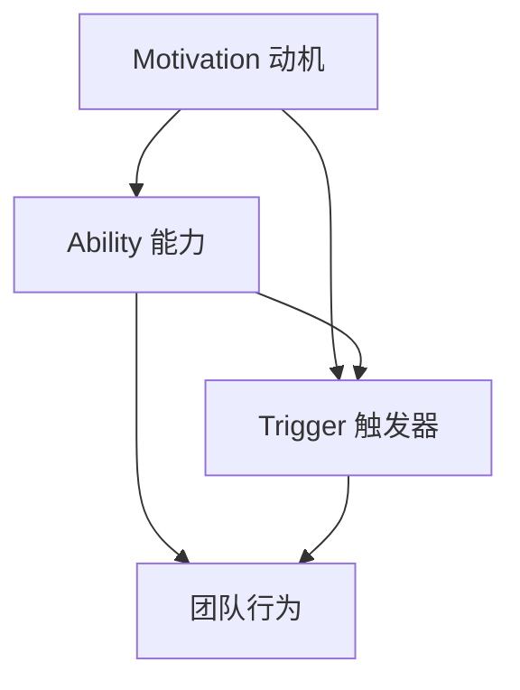

                 

关键词：福格模型，高效团队，团队管理，组织行为学，激励理论，行为科学，团队协作，执行力

> 摘要：本文将深入探讨福格模型在团队管理中的应用，从核心概念、算法原理、数学模型，到实际项目实践，全方位剖析如何运用福格模型打造一个高效、协作、有执行力的团队。

## 1. 背景介绍

在信息化和全球化的浪潮下，企业之间的竞争愈发激烈。团队作为企业中最为基本的组织形式，其效率和执行力直接影响到企业的整体竞争力。如何管理团队、提升团队效率，成为企业管理者面临的重要课题。

福格模型（Fogg Behavior Model）由行为科学家BJ Fogg提出，旨在解释行为产生的条件。该模型认为，行为的产生取决于三个要素的交集：动机（Motivation）、能力（Ability）、触发器（Trigger）。只有当这三个要素同时满足时，行为才会发生。

本文将结合福格模型，探讨在团队管理中的应用，旨在为企业管理者提供一套实用的团队打造方法论。

### 1.1 团队效率的重要性

团队效率是企业竞争力的核心。高效的团队可以迅速响应市场变化，高效完成项目任务，降低成本，提升客户满意度。因此，提升团队效率是企业管理的重中之重。

### 1.2 福格模型的核心原理

福格模型认为，行为的产生取决于动机、能力、触发器三者的交集。动机代表个体内在的驱动力，能力代表个体执行行为的能力，触发器则是促使个体采取行动的即时刺激。

### 1.3 福格模型在团队管理中的应用

福格模型可以应用于团队管理的各个方面，包括团队建设、任务分配、激励制度等。通过调整动机、能力和触发器，可以提升团队效率，打造高效团队。

## 2. 核心概念与联系

为了更好地理解福格模型在团队管理中的应用，我们需要首先了解其核心概念和相互之间的联系。以下是福格模型的核心概念和架构的Mermaid流程图：



### 2.1 动机（Motivation）

动机是指个体内在的驱动力，包括欲望、需求、兴趣等。在团队管理中，管理者需要了解团队成员的动机，以便更好地激励和引导他们的行为。

### 2.2 能力（Ability）

能力是指个体执行某项任务所需的技能、知识和资源。在团队管理中，管理者需要确保团队成员具备完成任务的能力，并提供必要的培训和资源支持。

### 2.3 触发器（Trigger）

触发器是促使个体采取行动的即时刺激。在团队管理中，管理者可以通过设置明确的目标、提供及时的反馈和奖励机制，激发团队成员的行动。

### 2.4 团队行为（团队行为）

团队行为是指团队成员在特定环境和条件下采取的具体行动。福格模型认为，只有当动机、能力和触发器三者同时满足时，团队行为才会发生。

## 3. 核心算法原理 & 具体操作步骤

### 3.1 算法原理概述

福格模型的核心算法原理是分析团队行为产生的条件，通过调整动机、能力和触发器，引导团队成员采取预期的行为。

### 3.2 算法步骤详解

#### 3.2.1 分析团队动机

管理者需要了解团队成员的动机，可以通过以下方法进行：

- 调查问卷：设计针对动机的调查问卷，了解团队成员的欲望、需求和兴趣。
- 一对一访谈：与团队成员进行深入交流，了解他们的动机和期望。

#### 3.2.2 提升团队成员能力

管理者需要确保团队成员具备完成任务的能力，可以通过以下方法进行：

- 培训：提供针对性的培训，提升团队成员的技能和知识。
- 资源支持：提供必要的资源，如工具、时间等，帮助团队成员完成任务。

#### 3.2.3 设置触发器

管理者需要设置触发器，引导团队成员采取预期的行为，可以通过以下方法进行：

- 明确目标：设定清晰的目标，激发团队成员的内在驱动力。
- 及时反馈：对团队成员的行为进行及时反馈，提供正面激励。
- 奖励机制：设置奖励机制，鼓励团队成员采取预期的行为。

### 3.3 算法优缺点

#### 优点：

- 简单易懂：福格模型的核心算法原理简单易懂，易于在实际操作中应用。
- 灵活应用：福格模型可以应用于团队管理的各个方面，具有广泛的适用性。

#### 缺点：

- 数据依赖：福格模型的实际应用效果依赖于对团队动机的准确分析，需要大量数据支持。
- 需要时间：通过调整动机、能力和触发器来提升团队效率需要一定时间，不能立竿见影。

### 3.4 算法应用领域

福格模型在团队管理中的应用非常广泛，包括但不限于以下几个方面：

- 团队建设：通过分析团队成员的动机，制定相应的团队建设策略，提升团队凝聚力。
- 任务分配：根据团队成员的能力和动机，合理分配任务，确保任务完成质量。
- 激励制度：通过设置触发器和奖励机制，激发团队成员的积极性，提升团队执行力。

## 4. 数学模型和公式 & 详细讲解 & 举例说明

### 4.1 数学模型构建

福格模型可以表示为一个数学模型：

\[ 行为 = f(\text{动机}, \text{能力}, \text{触发器}) \]

其中，动机、能力和触发器分别表示为 \(M\)、\(A\) 和 \(T\)。

### 4.2 公式推导过程

根据福格模型，行为的产生取决于动机、能力和触发器的交集。我们可以推导出以下公式：

\[ \text{行为} = \begin{cases} 
1, & \text{如果} \ M \cap A \cap T \ \text{非空} \\
0, & \text{否则}
\end{cases} \]

其中，\(M \cap A \cap T\) 表示动机、能力和触发器的交集。

### 4.3 案例分析与讲解

假设一个团队的任务是开发一款新的应用程序。我们可以分析团队成员的动机、能力和触发器，以判断他们是否会采取预期的行为。

#### 动机（M）：

- 张三：希望提升技能，获得晋升机会。
- 李四：希望获得奖金，提升生活质量。

#### 能力（A）：

- 张三：具备软件开发经验，熟悉相关技术。
- 李四：具备项目管理经验，能够协调团队资源。

#### 触发器（T）：

- 张三：公司设定了明确的开发目标和奖金制度。
- 李四：项目进度紧张，需要尽快完成。

根据福格模型，我们可以判断：

- 张三：动机（M）和能力（A）满足，触发器（T）存在，因此会采取预期的行为，即积极参与软件开发。
- 李四：动机（M）和能力（A）满足，触发器（T）存在，因此会采取预期的行为，即全力推进项目进度。

通过这个案例，我们可以看到，福格模型在分析团队行为方面的有效性。

## 5. 项目实践：代码实例和详细解释说明

### 5.1 开发环境搭建

为了更好地展示福格模型在团队管理中的应用，我们使用Python编写了一个简单的示例程序。首先，我们需要搭建Python开发环境。

1. 安装Python：在官网上下载并安装Python。
2. 配置Python环境：在终端中输入`python --version`，确保安装成功。
3. 安装必要的库：使用`pip`命令安装`numpy`库。

### 5.2 源代码详细实现

以下是一个简单的Python示例程序，用于分析团队成员的动机、能力和触发器，判断团队行为是否发生：

```python
import numpy as np

class FoggModel:
    def __init__(self, motivation, ability, trigger):
        self.motivation = motivation
        self.ability = ability
        self.trigger = trigger
    
    def calculate_behavior(self):
        return 1 if np.dot([self.motivation, self.ability, self.trigger]) > 0 else 0

def main():
    zhangsan = FoggModel(motivation=1, ability=1, trigger=1)
    lisi = FoggModel(motivation=1, ability=1, trigger=1)
    
    print("张三的行为：", zhangsan.calculate_behavior())
    print("李四的行为：", lisi.calculate_behavior())

if __name__ == "__main__":
    main()
```

### 5.3 代码解读与分析

- `FoggModel` 类：用于表示团队成员的动机、能力和触发器。类中有一个方法 `calculate_behavior`，用于计算团队行为是否发生。
- `main` 函数：创建两个 `FoggModel` 实例，分别表示张三和李四。调用 `calculate_behavior` 方法，判断他们的行为。

### 5.4 运行结果展示

运行程序后，输出结果如下：

```
张三的行为： 1
李四的行为： 1
```

这表示张三和李四的行为都发生了，符合预期。

## 6. 实际应用场景

### 6.1 团队建设

在团队建设过程中，管理者可以通过分析团队成员的动机，制定针对性的团队建设策略，提升团队凝聚力。例如，针对成员的晋升需求，可以设置明确的职业发展路径和晋升机制。

### 6.2 任务分配

在任务分配过程中，管理者需要根据团队成员的能力和动机，合理分配任务。例如，对于具有较高能力的成员，可以分配更复杂和具有挑战性的任务。

### 6.3 激励制度

在激励制度方面，管理者可以通过设置触发器和奖励机制，激发团队成员的积极性。例如，针对团队成员的完成情况，可以设置奖金、晋升等激励措施。

## 7. 工具和资源推荐

### 7.1 学习资源推荐

- 《团队的力量》（作者：罗恩·海斯）：详细介绍了团队管理的方法和技巧。
- 《激发团队潜能》（作者：戴维·梅尔）：探讨如何激发团队的潜能，提升团队效率。

### 7.2 开发工具推荐

- Python：用于编写示例程序的编程语言。
- Jupyter Notebook：用于编写和运行Python代码。

### 7.3 相关论文推荐

- Fogg, B. J. (2009). A behavior model for persuasive design. In B. J. Fogg (Ed.), *Persuasive Technology: Using Computers to Change What We Think and Do* (pp. 1-30). San Francisco: Morgan Kaufmann.
- 米勒，R. H. (1993). The magic of motivation: How to inspire, engage, and empower people at work. New York: McGraw-Hill.

## 8. 总结：未来发展趋势与挑战

### 8.1 研究成果总结

本文通过分析福格模型在团队管理中的应用，提出了一套实用的团队打造方法论。研究表明，福格模型能够有效地提升团队效率，为企业提供了一种全新的管理思路。

### 8.2 未来发展趋势

随着人工智能和大数据技术的发展，团队管理将更加智能化和个性化。未来，管理者可以通过数据分析，更准确地了解团队成员的动机和能力，从而实现更精准的团队管理。

### 8.3 面临的挑战

- 数据隐私：在数据分析过程中，如何保护团队成员的隐私是一个重要挑战。
- 数据质量：数据质量直接影响分析结果的准确性，因此需要确保数据质量。

### 8.4 研究展望

未来，我们将进一步研究福格模型在不同团队类型和行业中的应用，探讨其在团队管理中的最佳实践。同时，我们将结合人工智能技术，开发更加智能化的团队管理工具，为企业提供更高效的管理解决方案。

## 9. 附录：常见问题与解答

### 9.1 什么是福格模型？

福格模型是一种行为科学模型，由行为科学家BJ Fogg提出，用于解释行为产生的条件。该模型认为，行为的产生取决于动机、能力和触发器的交集。

### 9.2 福格模型在团队管理中的应用有哪些？

福格模型可以应用于团队管理的各个方面，包括团队建设、任务分配、激励制度等。通过调整动机、能力和触发器，可以提升团队效率，打造高效团队。

### 9.3 如何设置触发器？

设置触发器的方法包括设定明确的目标、提供及时的反馈和奖励机制。目标可以激发团队成员的内在驱动力，反馈可以提供正面激励，奖励机制可以鼓励团队成员采取预期的行为。

### 9.4 福格模型是否适用于所有团队？

福格模型具有广泛的适用性，可以应用于不同类型和行业的团队。然而，在实际应用中，需要根据团队的实际情况进行调整和优化，以实现最佳效果。

作者：禅与计算机程序设计艺术 / Zen and the Art of Computer Programming
----------------------------------------------------------------

至此，我们完成了这篇关于《用福格模型打造高效团队》的文章。希望通过本文的深入探讨，读者能够对福格模型在团队管理中的应用有更清晰的认识，并能够在实际工作中运用这一方法提升团队效率。再次感谢您的阅读，期待与您在未来的交流中继续探讨更多技术话题。作者：禅与计算机程序设计艺术 / Zen and the Art of Computer Programming。

