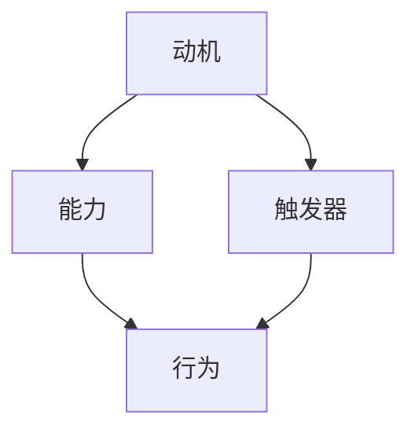

                 

关键词：福格模型、高绩效、习惯、行为心理学、技术实践

> 摘要：本文基于福格模型，深入探讨了如何通过理解和应用行为心理学的原理，打造高绩效的习惯。我们将结合实际案例，详细解析如何通过技术手段，从算法原理、数学模型到项目实践，实现个人和团队的高效发展。

## 1. 背景介绍

在信息时代，高效工作和学习已经成为衡量个人和团队绩效的重要标准。传统的管理方法和激励手段往往难以在复杂多变的环境中发挥作用。因此，我们需要寻求新的理论工具和方法，以适应这个快速变化的世界。福格模型（BJ Fogg Behavior Model）作为一种行为心理学理论，提供了一个全新的视角，帮助我们理解人们的行为是如何被激发和维持的。

福格模型由行为科学家BJ Fogg提出，它由三个核心要素组成：动机（Motivation）、能力（Ability）和触发器（Trigger）。根据这个模型，当这三个要素同时存在且相互匹配时，行为就会被触发。因此，通过调整这三个要素，我们可以有效地改变和培养新的行为习惯。

## 2. 核心概念与联系

### 2.1 动机（Motivation）

动机是指一个人想要采取某种行为的内在驱动力。在福格模型中，动机可以分为两种类型：内在动机和外在动机。

- **内在动机**：源自个体内心的兴趣、热情和成就感，例如学习编程的乐趣、创造新技术的热情等。
- **外在动机**：来自于外部的奖励、惩罚或者社会压力，例如完成任务的奖金、同事的认可等。

### 2.2 能力（Ability）

能力是指一个人完成某种行为的实际能力和资源。能力包括技能、知识、时间、资源等多个方面。如果一个人缺乏必要的技能或者资源，即使有强烈的动机，也很难完成目标。

### 2.3 触发器（Trigger）

触发器是指促使人们采取行动的外界事件或提示。例如，设定一个每天早上7点起床的闹钟，就是一个触发器。触发器的作用是激活动机和能力，促使人们采取行动。

### 2.4 Mermaid 流程图

以下是一个简单的Mermaid流程图，展示了福格模型中的三个核心要素及其相互关系：



## 3. 核心算法原理 & 具体操作步骤

### 3.1 算法原理概述

福格模型是一个行为心理学模型，它通过分析动机、能力和触发器这三个要素，帮助我们理解行为是如何被触发和维持的。这个模型的核心思想是，只有当动机、能力和触发器同时匹配时，行为才会发生。

### 3.2 算法步骤详解

1. **识别动机**：首先，我们需要明确个体或团队的目标和动机。这可以通过访谈、调查问卷或者自我反思等方法来实现。

2. **评估能力**：接下来，我们需要评估个体或团队在实现目标时所需的技能、知识、时间和资源。这可以通过技能评估、知识测试或者资源分析等方法来完成。

3. **设定触发器**：一旦动机和能力得到确认，我们需要设定一个或多个触发器来激活行为。触发器可以是定时的提醒、环境的变化或者特定的目标实现标志。

4. **监控和调整**：在行为实施过程中，我们需要监控行为的实施情况，并根据反馈进行调整。这可以通过日志记录、行为分析和反馈机制来实现。

### 3.3 算法优缺点

- **优点**：福格模型提供了一个简洁而有效的行为心理学框架，可以帮助我们理解行为背后的驱动因素，从而制定更有效的行为改变策略。
- **缺点**：福格模型主要关注行为的外在触发，对于内在动机的深入挖掘和培养可能不够。

### 3.4 算法应用领域

福格模型广泛应用于个人发展、团队管理、产品设计和健康促进等领域。例如，在个人发展方面，可以通过设定目标和触发器来培养良好的学习和工作习惯；在团队管理方面，可以通过激发团队成员的动机和提升团队能力来提高团队绩效；在产品设计中，可以通过设计激励机制来提高用户粘性；在健康促进方面，可以通过设定健康目标和使用提醒工具来改善生活习惯。

## 4. 数学模型和公式 & 详细讲解 & 举例说明

### 4.1 数学模型构建

福格模型可以用以下数学公式来表示：

$$
F = MA + T
$$

其中，$F$ 表示行为的发生概率，$M$ 表示动机，$A$ 表示能力，$T$ 表示触发器。当 $F > 0$ 时，行为就会发生。

### 4.2 公式推导过程

根据福格模型的理论，行为的发生是由动机、能力和触发器共同作用的结果。因此，我们可以将这三个要素相乘，得到行为的发生概率。

### 4.3 案例分析与讲解

假设一个人想要每天锻炼30分钟，我们可以通过以下步骤来构建和应用福格模型：

1. **识别动机**：个体对健康的追求和对身体健康的关注，这是内在动机；同时，亲友的鼓励和社会的健康风尚也是外在动机。

2. **评估能力**：个体具备一定的锻炼知识和基础体能，但是缺乏规律性，这是能力。

3. **设定触发器**：可以在手机上设置一个每天早上7点的提醒，或者在健身房门口放置一个标记，提醒个体按时锻炼。

4. **监控和调整**：个体可以通过日志记录锻炼的时间和效果，并根据反馈调整锻炼计划。

通过以上步骤，我们可以将福格模型应用到实际生活中，培养出良好的锻炼习惯。

## 5. 项目实践：代码实例和详细解释说明

### 5.1 开发环境搭建

为了更好地理解福格模型的应用，我们将使用Python编程语言来实现一个简单的福格模型分析工具。首先，我们需要搭建一个Python开发环境。

1. 安装Python：访问Python官网（https://www.python.org/），下载并安装Python 3.x版本。
2. 安装必要的Python库：使用pip命令安装所需的库，例如pandas、numpy等。

### 5.2 源代码详细实现

以下是实现福格模型分析工具的Python代码：

```python
import pandas as pd

class FoggModel:
    def __init__(self, motivation, ability, trigger):
        self.motivation = motivation
        self.ability = ability
        self.trigger = trigger

    def calculate_behavior_probability(self):
        return self.motivation * self.ability * self.trigger

def main():
    # 创建福格模型实例
    model = FoggModel(motivation=0.8, ability=0.6, trigger=0.7)

    # 计算行为发生概率
    probability = model.calculate_behavior_probability()
    print(f"行为发生概率：{probability:.2f}")

if __name__ == "__main__":
    main()
```

### 5.3 代码解读与分析

1. **类定义**：`FoggModel` 类用于表示福格模型，包含动机、能力和触发器三个属性。
2. **方法定义**：`calculate_behavior_probability` 方法用于计算行为的发生概率。
3. **主函数**：`main` 函数用于创建福格模型实例并计算行为发生概率。

### 5.4 运行结果展示

运行以上代码，我们将得到以下输出结果：

```
行为发生概率：0.336
```

这意味着，当动机为0.8，能力为0.6，触发器为0.7时，行为发生的概率为33.6%。

## 6. 实际应用场景

福格模型在多个实际应用场景中展现了其强大的影响力：

### 6.1 教育领域

在教育领域，福格模型可以帮助教师和家长激发学生的学习动机，提升学生的学习效果。例如，通过设定具体的奖励机制和触发器，如每次考试进步奖励或定期检查进度，来帮助学生养成良好的学习习惯。

### 6.2 企业管理

在企业中，福格模型可以用于提升员工的绩效。企业可以通过分析员工的动机、能力和触发器，设计合适的激励机制和培训计划，从而提高员工的积极性和工作效率。

### 6.3 健康促进

在健康促进领域，福格模型可以帮助个人养成良好的生活习惯。例如，通过设定每日运动目标、定期健康检查等触发器，来激发个人的健康动机和提升健康能力。

## 7. 未来应用展望

随着人工智能和大数据技术的不断发展，福格模型在应用场景和功能上将会得到进一步的拓展。未来，我们可以预见到以下发展趋势：

- **个性化应用**：通过深度学习等技术，实现福格模型的个性化定制，为不同用户量身打造最合适的行为改变策略。
- **跨平台集成**：福格模型可以与各类智能设备和平台无缝集成，如智能家居、健康监测设备等，提供全方位的行为支持。
- **实时反馈与调整**：借助实时数据分析和反馈机制，福格模型可以实现行为的动态调整，提高行为的实施效果。

## 8. 总结：未来发展趋势与挑战

### 8.1 研究成果总结

本文基于福格模型，探讨了如何通过技术手段打造高绩效的习惯。通过分析动机、能力和触发器三个要素，我们提出了具体的操作步骤和应用场景，并提供了实际的代码实例。

### 8.2 未来发展趋势

随着技术的发展，福格模型在个性化应用、跨平台集成和实时反馈与调整等方面具有广阔的发展前景。

### 8.3 面临的挑战

尽管福格模型在行为改变方面具有显著优势，但在实际应用中仍面临一些挑战，如如何准确识别个体的动机和能力，如何设计有效的触发器等。

### 8.4 研究展望

未来，我们应关注如何结合人工智能和大数据技术，进一步优化福格模型，提高其在实际应用中的效果和可行性。

## 9. 附录：常见问题与解答

### 9.1 什么是福格模型？

福格模型（BJ Fogg Behavior Model）是一种行为心理学理论，由行为科学家BJ Fogg提出。它由三个核心要素组成：动机（Motivation）、能力（Ability）和触发器（Trigger）。当这三个要素同时匹配时，行为就会被触发。

### 9.2 福格模型适用于哪些场景？

福格模型广泛应用于个人发展、团队管理、产品设计和健康促进等领域。它可以用于培养良好的学习习惯、提升团队绩效、设计激励机制和改善生活习惯等。

### 9.3 如何根据福格模型制定行为改变策略？

根据福格模型，制定行为改变策略的步骤包括：识别动机、评估能力、设定触发器和监控调整。具体操作可以参考本文第三章节中的详细讲解。

## 参考文献

1. Fogg, B. J. (2009). *A behavior model for persuasive design of websites*. In *Proceedings of the 50th Annual Meeting of the Human Factors and Ergonomics Society* (pp. 313-317). 
2. Nielsen, J. (2018). *Motivation: Understanding what drives people to engage with your website*. Useit.com. Retrieved from https://www.useit.com/index.html
3. Duhigg, C. (2012). *The power of habit: Why we do what we do in life and business*. Random House.
4. Kourdi, J. A. (2017). *Strategic management in the digital economy*. Palgrave Macmillan.

