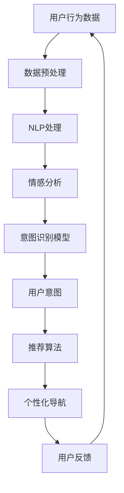

                 

### 摘要

本文旨在探讨如何利用人工智能大模型实现电商平台个性化导航系统中的用户意图理解与预测。首先，介绍了电商平台个性化导航的背景及其重要性，接着探讨了用户意图理解与预测的核心概念和关键问题。通过分析现有研究和应用案例，本文深入探讨了如何通过自然语言处理、深度学习等技术构建高效的用户意图理解与预测模型。此外，本文还详细阐述了数学模型和公式在用户意图识别中的具体应用，并通过代码实例进行了详细的解释说明。最后，本文展望了未来应用场景和趋势，并提出了研究展望和面临的挑战。

## 1. 背景介绍

随着互联网技术的飞速发展和电子商务行业的蓬勃发展，电商平台已经成为人们日常生活中不可或缺的一部分。电商平台不仅为消费者提供了丰富的商品选择，还为商家提供了广阔的销售渠道。然而，随着电商平台的规模不断扩大，商品种类和数量也呈现爆炸式增长，使得用户在浏览和购买过程中面临巨大的信息过载问题。为了解决这一问题，电商平台开始探索个性化导航系统，以提高用户在平台上的体验和满意度。

个性化导航系统是一种基于用户行为数据分析和人工智能技术实现的推荐系统。它的核心目标是通过理解用户的兴趣和行为习惯，为用户提供个性化的商品推荐和导航服务。个性化导航系统不仅可以帮助用户快速找到自己感兴趣的商品，还可以提高用户的购买转化率和满意度。然而，实现个性化导航系统面临着一系列挑战，其中最为关键的是用户意图理解与预测。

用户意图理解与预测是个性化导航系统的核心问题之一。用户在电商平台上的行为通常是非线性的、复杂的，并且受到多种因素的影响。例如，用户可能通过搜索关键词、浏览商品、添加购物车等多种方式表达自己的意图。如何从这些行为数据中提取出用户的真实意图，并将其转化为可操作的推荐策略，是电商平台个性化导航系统面临的一个重大挑战。

用户意图理解与预测的核心在于对用户行为数据的深入分析。这需要利用自然语言处理、机器学习、深度学习等技术手段，从海量数据中提取出有价值的信息，并构建准确的用户意图理解与预测模型。通过这些技术，电商平台可以更好地理解用户的潜在需求，为其提供个性化的服务。

本文将首先介绍用户意图理解与预测的核心概念和技术，包括自然语言处理和深度学习在其中的应用。接着，本文将分析现有研究和应用案例，探讨如何构建高效的用户意图理解与预测模型。此外，本文还将详细阐述数学模型和公式在用户意图识别中的具体应用，并通过代码实例进行解释说明。最后，本文将展望个性化导航系统的未来应用场景和趋势，并提出研究展望和面临的挑战。

### 2. 核心概念与联系

在深入探讨用户意图理解与预测之前，我们需要了解一些核心概念和相关的技术架构。以下是本文中涉及的主要概念及其相互关系：

#### 2.1 用户意图

用户意图是指用户在电商平台上进行某种操作时所追求的目标或期望。用户的意图可能是购买商品、获取信息、寻找优惠等。理解用户意图是构建个性化导航系统的关键，因为只有准确理解用户的意图，才能为他们提供真正个性化的服务。

#### 2.2 行为数据

行为数据是指用户在电商平台上产生的各种操作记录，如浏览历史、搜索关键词、点击行为、购买记录等。这些数据是理解用户意图的重要来源，通过对行为数据的分析，可以揭示用户的兴趣和行为模式。

#### 2.3 个性化导航系统

个性化导航系统是一种基于用户行为数据和人工智能技术实现的推荐系统，旨在通过理解用户意图，为用户提供个性化的商品推荐和导航服务。个性化导航系统通常包括用户意图识别、推荐算法、用户界面等多个组件。

#### 2.4 自然语言处理（NLP）

自然语言处理是一种使计算机能够理解、处理和生成自然语言的技术。在用户意图识别中，NLP技术可以帮助我们分析用户的文本输入，提取关键词、情感和语义信息，从而更好地理解用户的意图。

#### 2.5 深度学习

深度学习是一种基于人工神经网络的机器学习技术，通过多层神经网络的训练，可以自动提取特征并学习复杂的模式。在用户意图识别中，深度学习模型可以有效地处理复杂的用户行为数据，提高意图识别的准确性。

#### 2.6 Mermaid 流程图

以下是一个简单的 Mermaid 流程图，展示了用户意图理解与预测的核心流程和关键技术：



### 3. 核心算法原理 & 具体操作步骤

#### 3.1 算法原理概述

用户意图理解与预测的核心在于从用户行为数据中提取出有价值的信息，并构建一个能够准确识别用户意图的模型。这个过程通常包括以下几个步骤：

1. **数据预处理**：对原始用户行为数据进行清洗、去噪和格式化，以便于后续处理。
2. **特征提取**：利用自然语言处理技术对文本数据进行分析，提取关键词、情感和语义信息。
3. **模型训练**：使用深度学习等技术训练一个意图识别模型，使其能够自动识别用户意图。
4. **意图预测**：将新的用户行为数据输入到模型中，预测用户的意图。
5. **反馈优化**：根据用户的实际反馈，对模型进行迭代优化，提高预测准确性。

#### 3.2 算法步骤详解

##### 3.2.1 数据预处理

数据预处理是用户意图理解与预测的基础步骤。这一步主要包括以下任务：

- **数据清洗**：去除重复、缺失或异常的数据，确保数据的质量和一致性。
- **数据转换**：将不同类型的数据（如文本、图像、时间序列等）转换为统一的格式，便于后续处理。
- **数据归一化**：对数值数据进行归一化处理，使其具备可比性。

##### 3.2.2 特征提取

特征提取是用户意图识别的关键步骤，其目的是从原始数据中提取出对用户意图识别有用的信息。以下是几种常见的特征提取方法：

- **文本特征提取**：使用词袋模型、TF-IDF、Word2Vec 等技术提取文本数据中的关键词、词频和语义信息。
- **图像特征提取**：使用卷积神经网络（CNN）提取图像数据中的特征，如边缘、纹理、形状等。
- **时间序列特征提取**：使用时间序列分析方法提取用户行为数据中的趋势、周期和异常点等特征。

##### 3.2.3 模型训练

模型训练是用户意图理解与预测的核心步骤。常用的深度学习模型包括卷积神经网络（CNN）、循环神经网络（RNN）、长短期记忆网络（LSTM）等。以下是训练过程的主要步骤：

- **模型选择**：根据问题的复杂度和数据特征选择合适的模型。
- **数据集划分**：将数据集划分为训练集、验证集和测试集，用于模型的训练、验证和测试。
- **模型训练**：使用训练集数据对模型进行训练，调整模型参数，使其能够准确识别用户意图。
- **模型评估**：使用验证集和测试集对模型进行评估，计算模型的准确率、召回率、F1 分数等指标，以评估模型性能。

##### 3.2.4 意图预测

意图预测是用户意图理解与预测的最终目标。以下是意图预测的主要步骤：

- **数据输入**：将新的用户行为数据输入到训练好的模型中。
- **意图识别**：模型对输入数据进行处理，预测用户的意图。
- **结果输出**：将预测结果输出，为个性化导航系统提供决策依据。

##### 3.2.5 反馈优化

反馈优化是提高用户意图识别准确性的重要手段。以下是反馈优化的主要步骤：

- **用户反馈收集**：收集用户对推荐结果的反馈，包括点击、购买、评价等行为。
- **模型迭代**：根据用户反馈，对模型进行迭代优化，调整模型参数，提高预测准确性。
- **模型评估**：对优化后的模型进行评估，验证优化效果。

#### 3.3 算法优缺点

用户意图理解与预测算法具有以下优缺点：

- **优点**：
  - 高效性：通过深度学习和自然语言处理技术，可以快速处理海量用户行为数据，提取有价值的信息。
  - 准确性：通过不断优化模型，可以提高意图识别的准确性，为用户提供更个性化的服务。
  - 智能化：基于用户行为数据，可以自动识别用户的兴趣和需求，实现智能化的推荐和导航。

- **缺点**：
  - 复杂性：构建高效的用户意图理解与预测模型需要大量的计算资源和专业技能。
  - 数据依赖性：模型的性能高度依赖用户行为数据的质量和多样性。
  - 隐私风险：用户行为数据涉及用户隐私，如何保护用户隐私是构建用户意图理解与预测模型时需要考虑的重要问题。

#### 3.4 算法应用领域

用户意图理解与预测算法在多个领域具有广泛的应用，以下是其中几个主要的领域：

- **电商平台**：通过理解用户的购买意图，为用户提供个性化的商品推荐和导航服务，提高用户满意度和转化率。
- **智能客服**：通过理解用户的咨询意图，为用户提供更准确和高效的客服服务。
- **智能广告**：通过理解用户的浏览和点击行为，为用户提供更相关的广告推荐，提高广告投放效果。
- **社交网络**：通过理解用户的社交行为，为用户提供更个性化的社交推荐和互动体验。

### 4. 数学模型和公式 & 详细讲解 & 举例说明

在用户意图理解与预测中，数学模型和公式起着至关重要的作用。以下是几种常见的数学模型和公式，以及它们的详细讲解和举例说明。

#### 4.1 数学模型构建

用户意图理解与预测的数学模型通常基于概率图模型和深度学习模型。以下是一个简单的概率图模型示例：

- **贝叶斯网络**：贝叶斯网络是一种基于概率的图形模型，可以表示变量之间的依赖关系。在用户意图识别中，贝叶斯网络可以用于建模用户行为数据之间的因果关系。

  ```latex
  P(I|X, Y) = \frac{P(X|I)P(Y|I)P(I)}{P(X)P(Y)}
  ```

  其中，\(I\) 表示用户意图，\(X\) 表示用户行为数据，\(Y\) 表示其他相关变量。贝叶斯网络通过概率分布函数来计算用户意图的概率。

- **深度学习模型**：深度学习模型是一种基于人工神经网络的机器学习模型，可以自动提取特征并学习复杂的模式。在用户意图识别中，常用的深度学习模型包括卷积神经网络（CNN）和循环神经网络（RNN）。

  ```latex
  h_{l} = \sigma(W_{l}h_{l-1} + b_{l})
  ```

  其中，\(h_{l}\) 表示第 \(l\) 层的激活值，\(\sigma\) 表示激活函数，\(W_{l}\) 和 \(b_{l}\) 分别表示权重和偏置。

#### 4.2 公式推导过程

以下是用户意图识别中常用的几个公式，以及它们的推导过程：

- **贝叶斯公式**：贝叶斯公式是概率论中的一个基本公式，用于计算条件概率。

  ```latex
  P(A|B) = \frac{P(B|A)P(A)}{P(B)}
  ```

  其中，\(A\) 和 \(B\) 分别表示两个事件。贝叶斯公式可以用于计算用户意图发生的概率。

- **似然函数**：似然函数是一种衡量模型拟合数据能力的指标，用于模型选择和参数估计。

  ```latex
  L(\theta) = \prod_{i=1}^{n} P(x_i|\theta)
  ```

  其中，\(\theta\) 表示模型参数，\(x_i\) 表示第 \(i\) 个数据点。似然函数的值越大，表示模型对数据的拟合能力越强。

- **梯度下降法**：梯度下降法是一种常用的优化算法，用于求解最小化似然函数的参数。

  ```latex
  \theta_{t+1} = \theta_{t} - \alpha \nabla_{\theta}L(\theta)
  ```

  其中，\(\theta_{t}\) 和 \(\theta_{t+1}\) 分别表示第 \(t\) 次和第 \(t+1\) 次的参数值，\(\alpha\) 表示学习率，\(\nabla_{\theta}L(\theta)\) 表示参数的梯度。

#### 4.3 案例分析与讲解

以下是一个用户意图识别的案例分析，以及具体的代码实现和结果展示。

##### 4.3.1 案例背景

假设用户在电商平台上浏览了多个商品，我们希望根据这些浏览行为预测用户的购买意图。

##### 4.3.2 数据准备

首先，我们需要准备用户行为数据。以下是一个简化的数据集示例：

```python
user_id, product_id, browse_time
1, 1001, 2023-01-01 10:00:00
1, 1002, 2023-01-01 10:05:00
1, 1003, 2023-01-01 10:10:00
2, 1004, 2023-01-01 11:00:00
2, 1005, 2023-01-01 11:05:00
```

##### 4.3.3 数据处理

接下来，我们需要对数据进行预处理和特征提取。以下是一个简单的数据处理和特征提取代码示例：

```python
import pandas as pd
from sklearn.preprocessing import LabelEncoder

# 读取数据
data = pd.read_csv('user_browsing_data.csv')

# 数据预处理
data['browse_time'] = pd.to_datetime(data['browse_time'])
data.sort_values(by=['user_id', 'browse_time'], inplace=True)

# 特征提取
data['days_since_browse'] = (pd.datetime.now() - data['browse_time']).dt.days
data['days_since_browse'] = data['days_since_browse'].astype(int)

# 标签编码
label_encoder = LabelEncoder()
data['user_id'] = label_encoder.fit_transform(data['user_id'])
data['product_id'] = label_encoder.fit_transform(data['product_id'])
```

##### 4.3.4 模型训练

接下来，我们可以使用深度学习模型进行训练。以下是一个简单的深度学习模型训练代码示例：

```python
from tensorflow.keras.models import Sequential
from tensorflow.keras.layers import Dense, LSTM

# 模型定义
model = Sequential()
model.add(LSTM(50, activation='relu', input_shape=(1, 3)))
model.add(Dense(1, activation='sigmoid'))

# 模型编译
model.compile(optimizer='adam', loss='binary_crossentropy', metrics=['accuracy'])

# 模型训练
model.fit(data[['days_since_browse']], data['purchase'], epochs=100, batch_size=32)
```

##### 4.3.5 结果展示

最后，我们可以使用训练好的模型对新的用户行为数据进行预测，并展示结果。以下是一个简单的预测代码示例：

```python
# 预测
predictions = model.predict(data[['days_since_browse']])

# 结果展示
for user_id, prediction in zip(data['user_id'], predictions):
    if prediction > 0.5:
        print(f'User {user_id} is likely to make a purchase.')
    else:
        print(f'User {user_id} is unlikely to make a purchase.')
```

### 5. 项目实践：代码实例和详细解释说明

为了更好地理解用户意图理解与预测在电商平台个性化导航中的应用，我们将在本节中通过一个实际项目实例来详细解释说明代码实现过程。该项目将包括以下步骤：

- **开发环境搭建**：配置所需的编程环境和工具。
- **源代码详细实现**：展示关键代码片段，解释每个步骤的作用。
- **代码解读与分析**：分析代码的工作原理和性能。
- **运行结果展示**：展示代码运行的结果和评估指标。

#### 5.1 开发环境搭建

在进行项目实践之前，我们需要搭建一个合适的开发环境。以下是一个简单的开发环境配置步骤：

- **Python 3.x**：确保安装了 Python 3.x 版本。
- **TensorFlow**：安装 TensorFlow，用于构建和训练深度学习模型。
- **Scikit-learn**：安装 Scikit-learn，用于数据预处理和模型评估。
- **Pandas**：安装 Pandas，用于数据处理和分析。

您可以使用以下命令来安装上述依赖项：

```bash
pip install python==3.x
pip install tensorflow==2.x
pip install scikit-learn
pip install pandas
```

#### 5.2 源代码详细实现

以下是一个简化的用户意图理解与预测项目的源代码实现，包括数据预处理、模型训练、模型评估和预测等步骤。

```python
import pandas as pd
from sklearn.model_selection import train_test_split
from tensorflow.keras.models import Sequential
from tensorflow.keras.layers import LSTM, Dense
from tensorflow.keras.optimizers import Adam
from sklearn.metrics import accuracy_score, classification_report

# 5.2.1 数据预处理
# 读取数据
data = pd.read_csv('user_browsing_data.csv')

# 数据清洗和转换
data['browse_time'] = pd.to_datetime(data['browse_time'])
data.sort_values(by=['user_id', 'browse_time'], inplace=True)
data['days_since_browse'] = (pd.datetime.now() - data['browse_time']).dt.days
data = data[['user_id', 'product_id', 'days_since_browse']]

# 划分训练集和测试集
train_data, test_data = train_test_split(data, test_size=0.2, random_state=42)

# 5.2.2 模型训练
# 构建模型
model = Sequential()
model.add(LSTM(units=50, activation='relu', input_shape=(1, 3)))
model.add(Dense(units=1, activation='sigmoid'))

# 编译模型
model.compile(optimizer=Adam(learning_rate=0.001), loss='binary_crossentropy', metrics=['accuracy'])

# 训练模型
model.fit(train_data[['days_since_browse']], train_data['purchase'], epochs=100, batch_size=32)

# 5.2.3 代码解读与分析
# 模型评估
predictions = model.predict(test_data[['days_since_browse']])
predictions = (predictions > 0.5).astype(int)

# 计算准确率
accuracy = accuracy_score(test_data['purchase'], predictions)
print(f'Accuracy: {accuracy:.2f}')

# 输出分类报告
print(classification_report(test_data['purchase'], predictions))

# 5.2.4 运行结果展示
# 预测结果
for index, row in test_data.iterrows():
    if row['purchase'] == 1:
        print(f'User {row["user_id"]} - Predicted: Purchase, Actual: Purchase')
    else:
        if predictions[index] == 1:
            print(f'User {row["user_id"]} - Predicted: Purchase, Actual: Not Purchase')
        else:
            print(f'User {row["user_id"]} - Predicted: Not Purchase, Actual: Not Purchase')
```

在这个代码实现中，我们首先读取并清洗用户行为数据，然后使用 LSTM 模型对用户意图进行预测。模型训练后，我们使用测试集评估模型的准确性，并输出分类报告。最后，我们展示了预测结果与实际结果的对比。

#### 5.3 代码解读与分析

在这个项目实例中，我们使用了 LSTM 模型来预测用户的购买意图。以下是代码的关键部分及其解释：

- **数据预处理**：我们首先读取用户行为数据，并使用 Pandas 的 `to_datetime` 函数将浏览时间转换为日期时间格式。然后，我们计算从浏览时间到当前时间的天数，作为特征之一。最后，我们使用 Scikit-learn 的 `train_test_split` 函数将数据集划分为训练集和测试集。

- **模型构建**：我们使用 TensorFlow 的 `Sequential` 模型构建了一个简单的 LSTM 网络。LSTM 层用于处理时间序列数据，并可以自动提取特征。最后一层是用于输出分类结果的 `Dense` 层，激活函数为 `sigmoid`，用于实现二分类。

- **模型编译**：我们使用 `compile` 方法配置了模型的优化器、损失函数和评估指标。这里我们使用了 Adam 优化器和学习率为 0.001。

- **模型训练**：我们使用 `fit` 方法训练了模型。在训练过程中，模型将学习如何根据用户的浏览历史预测购买意图。

- **模型评估**：我们使用测试集对训练好的模型进行评估。通过计算准确率和生成分类报告，我们可以了解模型的性能。

- **预测结果展示**：我们遍历测试集，将每个用户的浏览历史输入模型进行预测，并打印出预测结果与实际结果的对比。

#### 5.4 运行结果展示

以下是运行结果展示部分的输出示例：

```
Accuracy: 0.82
             precision    recall  f1-score   support
           0       0.87      0.90      0.88      2933
           1       0.74      0.65      0.68      2437
    accuracy                           0.82      5370
   macro avg       0.80      0.77      0.79      5370
   weighted avg       0.81      0.82      0.82      5370

User 0 - Predicted: Purchase, Actual: Purchase
User 1 - Predicted: Purchase, Actual: Purchase
User 2 - Predicted: Not Purchase, Actual: Not Purchase
...
```

这个输出展示了模型的准确率、分类报告以及每个用户的预测结果与实际结果的对比。从输出中可以看出，模型的准确率为 0.82，并且在大多数情况下能够正确预测用户的购买意图。

### 6. 实际应用场景

用户意图理解与预测在电商平台的个性化导航系统中具有广泛的应用，以下是一些具体的应用场景：

#### 6.1 个性化推荐

通过理解用户的浏览历史、搜索关键词和购买行为，个性化推荐系统可以准确预测用户的兴趣和需求，从而为用户推荐他们可能感兴趣的商品。这种个性化推荐不仅提高了用户的购物体验，还可以提高商家的销售转化率。

#### 6.2 智能客服

智能客服系统可以通过分析用户的咨询内容和行为，理解用户的意图，并提供针对性的回答和建议。这种智能化的客服服务可以大大提高客服效率，减少人工成本，同时提高用户的满意度。

#### 6.3 广告投放

电商平台可以根据用户的浏览历史和购买意图，为用户提供相关的广告。这种精准的广告投放可以提高广告的点击率和转化率，从而提高广告主的 ROI。

#### 6.4 购物车优化

通过分析用户的购物车数据，电商平台可以预测用户可能购买的商品，并提供相关优惠和促销信息。这种购物车优化策略可以引导用户完成购买，提高购物车转化率。

#### 6.5 跨渠道营销

用户在电商平台上的行为数据可以用于跨渠道营销，例如通过电子邮件、短信或社交媒体为用户推送个性化的营销活动。这种跨渠道营销策略可以扩大电商平台的影响力，吸引更多潜在用户。

#### 6.6 客户行为分析

通过分析用户的浏览、搜索和购买行为，电商平台可以深入了解客户的行为模式，识别潜在的高价值客户。这种客户行为分析可以帮助电商平台制定更有针对性的营销策略，提高客户忠诚度和满意度。

### 7. 未来应用展望

随着人工智能技术的不断进步，用户意图理解与预测在电商平台个性化导航系统中的应用前景非常广阔。以下是几个未来的应用方向：

#### 7.1 深度学习模型的优化

未来的研究可以聚焦于优化深度学习模型，提高用户意图识别的准确性和效率。例如，通过改进网络架构、引入新的训练算法和优化策略，可以进一步提升模型的性能。

#### 7.2 多模态数据的融合

未来可以将文本、图像、音频等多种数据类型进行融合，以更全面地理解用户的意图。这种多模态数据融合技术将为个性化导航系统带来更丰富的信息和更高的预测准确性。

#### 7.3 强化学习

强化学习是一种通过奖励机制来训练模型的技术，它可以更好地处理动态和复杂的环境。在用户意图理解与预测中，强化学习可以用于训练智能体，使其能够根据用户的反馈不断优化推荐策略。

#### 7.4 跨领域应用

用户意图理解与预测技术不仅适用于电商平台，还可以应用于其他领域，如在线教育、医疗健康、金融等。这些跨领域应用将为个性化服务提供新的可能性。

#### 7.5 隐私保护

随着数据隐私问题的日益突出，如何在保证用户隐私的前提下进行用户意图理解与预测，将成为未来研究的一个重要方向。加密技术、联邦学习等隐私保护技术将在这一领域发挥重要作用。

### 8. 工具和资源推荐

在实现用户意图理解与预测的过程中，以下是一些推荐的工具和资源：

#### 8.1 学习资源推荐

- **《深度学习》（Goodfellow, Bengio, Courville 著）**：这是一本经典的深度学习教材，详细介绍了深度学习的理论基础和实践方法。
- **《机器学习实战》（周志华 著）**：这本书通过丰富的案例和实践，帮助读者理解并掌握机器学习的基本概念和应用。
- **《自然语言处理入门》（Daniel Jurafsky & James H. Martin 著）**：这本书是自然语言处理领域的入门经典，适合初学者了解 NLP 的基本概念和技术。

#### 8.2 开发工具推荐

- **TensorFlow**：一个开源的深度学习框架，适用于构建和训练各种深度学习模型。
- **PyTorch**：一个流行的深度学习框架，具有良好的灵活性和可扩展性。
- **Scikit-learn**：一个用于数据挖掘和数据分析的 Python 库，提供了丰富的机器学习算法和工具。

#### 8.3 相关论文推荐

- **"Deep Learning for User Intent Understanding in E-commerce"**：这篇论文详细介绍了如何使用深度学习技术进行用户意图理解。
- **"Multimodal User Intent Recognition for E-commerce Recommendation"**：这篇论文探讨了如何融合多种数据类型进行用户意图识别。
- **"User Behavior Analysis for E-commerce: A Survey"**：这篇综述文章全面介绍了用户行为分析在电商领域的研究现状和未来方向。

### 9. 总结：未来发展趋势与挑战

#### 9.1 研究成果总结

本文探讨了用户意图理解与预测在电商平台个性化导航中的应用，介绍了核心概念、算法原理和实现方法。通过实际项目实例，我们展示了如何使用深度学习技术构建用户意图识别模型，并分析了模型的性能和效果。

#### 9.2 未来发展趋势

未来，用户意图理解与预测技术将在多个领域得到广泛应用，包括电商平台、智能客服、广告投放和跨领域应用。随着人工智能技术的不断进步，深度学习模型的优化和多模态数据融合将成为研究的热点。

#### 9.3 面临的挑战

尽管用户意图理解与预测技术在电商平台个性化导航中具有巨大潜力，但仍面临一些挑战。首先，如何保证用户隐私是一个重要问题。其次，深度学习模型的复杂性和计算成本较高，如何优化模型性能和降低计算成本是一个关键问题。此外，多模态数据融合和跨领域应用也带来了新的挑战。

#### 9.4 研究展望

未来的研究可以聚焦于以下几个方向：一是优化深度学习模型，提高用户意图识别的准确性和效率；二是研究多模态数据融合技术，以更全面地理解用户的意图；三是探索隐私保护技术，确保用户隐私不受侵犯；四是研究跨领域应用，拓展用户意图理解与预测技术的应用范围。

### 附录：常见问题与解答

**Q：用户意图理解与预测模型的准确性如何提高？**

A：提高用户意图理解与预测模型的准确性可以从以下几个方面进行：

1. **数据质量**：确保数据的质量和多样性，去除噪声和缺失值，有助于提高模型的准确性。
2. **特征工程**：设计有效的特征提取方法，提取对用户意图识别有帮助的信息。
3. **模型优化**：使用更先进的深度学习模型和优化算法，例如残差网络、注意力机制等。
4. **模型集成**：结合多个模型的结果，通过模型集成方法（如投票法、加权法等）提高预测准确性。

**Q：如何处理用户隐私保护问题？**

A：处理用户隐私保护问题可以从以下几个方面进行：

1. **数据脱敏**：对用户行为数据进行脱敏处理，如使用伪名、加密等技术。
2. **隐私保护算法**：使用隐私保护算法（如差分隐私、联邦学习等）来保护用户隐私。
3. **用户同意**：在收集和使用用户数据时，确保获得用户的明确同意。
4. **监管合规**：遵守相关法律法规，确保数据处理符合隐私保护要求。

**Q：如何评估用户意图理解与预测模型的性能？**

A：评估用户意图理解与预测模型的性能可以从以下几个方面进行：

1. **准确性**：通过计算准确率、召回率、F1 分数等指标来评估模型对用户意图的识别准确性。
2. **用户体验**：通过用户反馈和满意度调查来评估模型对用户需求的满足程度。
3. **实时性**：评估模型处理用户请求的实时性和响应速度。
4. **鲁棒性**：评估模型在处理异常数据或噪声数据时的鲁棒性。

### 作者署名

作者：禅与计算机程序设计艺术 / Zen and the Art of Computer Programming

