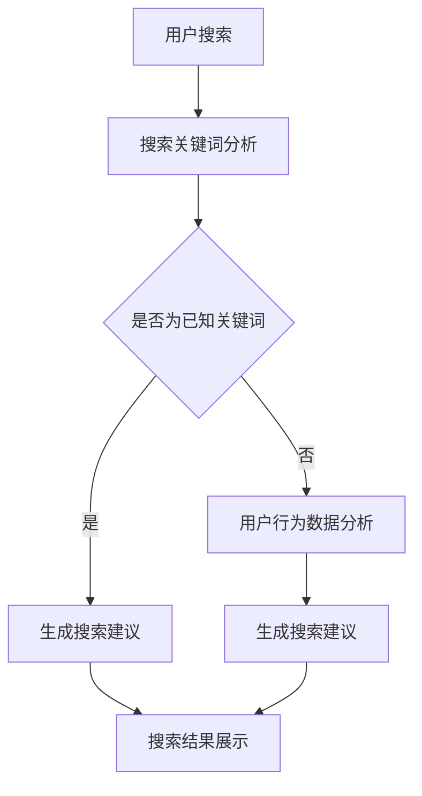

                 

在这个数字化的时代，电商平台已经成为消费者购物的主要渠道之一。随着用户数量的不断增加和商品种类的日益丰富，如何为用户提供更精准、更个性化的搜索建议，成为了电商平台提高用户体验和转化率的关键。本文将探讨在电商平台中，如何利用AI大模型优化搜索建议。

## 文章关键词

AI大模型、搜索引擎优化、个性化推荐、电商平台、用户体验、转化率

## 文章摘要

本文主要分析了电商平台中搜索建议的现状和存在的问题，介绍了AI大模型在搜索建议优化中的应用，并探讨了如何通过算法、数学模型和项目实践来实现搜索建议的精准化和个性化。最后，本文对搜索建议优化的未来发展趋势和应用前景进行了展望。

## 1. 背景介绍

随着互联网的普及和电子商务的迅猛发展，电商平台已经成为人们日常购物的主要渠道。然而，随着商品种类和数量的不断增多，如何让用户快速找到他们需要的商品成为了电商平台面临的一个重要问题。传统的搜索引擎优化方法，如关键词匹配、倒排索引等，虽然在一定程度上提高了搜索效率，但往往无法满足用户对个性化、精准化搜索的需求。

近年来，随着深度学习和大数据技术的发展，AI大模型开始在电商平台中得到了广泛应用。这些大模型可以通过学习海量用户行为数据，为用户生成个性化的搜索建议，从而提高用户的购物体验和转化率。

## 2. 核心概念与联系

### 2.1 AI大模型

AI大模型是指那些通过海量数据训练，具有极高复杂度和强大泛化能力的深度学习模型。在电商平台中，AI大模型主要用于对用户行为进行分析和预测，从而为用户提供个性化的搜索建议。

### 2.2 个性化推荐

个性化推荐是一种通过分析用户的历史行为和偏好，为用户推荐其可能感兴趣的内容或商品的技术。在电商平台中，个性化推荐可以基于用户的历史搜索记录、浏览记录、购买记录等数据，为用户生成个性化的搜索建议。

### 2.3 搜索引擎优化

搜索引擎优化（SEO）是指通过改进网站的内容、结构和外部链接，提高网站在搜索引擎中的排名，从而吸引更多用户访问。在电商平台中，搜索引擎优化是提高用户搜索到所需商品的重要手段。

### 2.4 Mermaid 流程图

以下是电商平台中AI大模型搜索建议优化的 Mermaid 流程图：



## 3. 核心算法原理 & 具体操作步骤

### 3.1 算法原理概述

电商平台中的搜索建议优化主要依赖于两种技术：深度学习和协同过滤。

- 深度学习：通过训练大规模的神经网络模型，对用户的历史行为数据进行分析，提取用户的兴趣特征，从而为用户生成个性化的搜索建议。
- 协同过滤：通过分析用户的历史行为和偏好，找到与当前用户相似的用户群体，从这些用户群体中提取搜索建议。

### 3.2 算法步骤详解

1. 数据预处理：收集并清洗用户行为数据，如搜索记录、浏览记录、购买记录等。
2. 特征提取：利用深度学习模型对用户行为数据进行分析，提取用户的兴趣特征。
3. 搜索建议生成：基于协同过滤算法，找到与当前用户相似的用户群体，从这些用户群体中提取搜索建议。
4. 搜索结果排序：根据用户兴趣特征和搜索建议的相关性，对搜索结果进行排序，展示给用户。

### 3.3 算法优缺点

#### 优点：

- 个性化：能够根据用户的历史行为和偏好，为用户生成个性化的搜索建议，提高用户的购物体验。
- 精准性：通过对海量用户数据的分析，能够提高搜索建议的相关性和准确性。

#### 缺点：

- 计算成本高：训练大规模的神经网络模型和协同过滤算法需要大量的计算资源。
- 数据隐私问题：用户行为数据涉及到用户隐私，需要确保数据的安全性和合规性。

### 3.4 算法应用领域

- 电商平台：通过优化搜索建议，提高用户的购物体验和转化率。
- 社交媒体：为用户提供个性化的内容推荐，提高用户的活跃度和粘性。
- 在线教育：为用户提供个性化的课程推荐，提高课程的学习效果。

## 4. 数学模型和公式 & 详细讲解 & 举例说明

### 4.1 数学模型构建

电商平台中的搜索建议优化主要依赖于深度学习和协同过滤算法。以下是这两种算法的数学模型构建：

#### 深度学习模型：

- 输入：用户历史行为数据
- 输出：用户兴趣特征

数学模型表示为：

$$
\begin{aligned}
y &= f(W_1 \cdot x + b_1) \\
z &= f(W_2 \cdot y + b_2)
\end{aligned}
$$

其中，$x$为用户历史行为数据，$y$为用户兴趣特征，$z$为搜索建议。

#### 协同过滤算法：

- 输入：用户兴趣特征矩阵
- 输出：搜索建议

数学模型表示为：

$$
\begin{aligned}
R &= A \cdot B \\
s &= f(R)
\end{aligned}
$$

其中，$R$为用户兴趣特征矩阵，$A$为用户相似度矩阵，$B$为搜索建议矩阵，$s$为搜索建议。

### 4.2 公式推导过程

#### 深度学习模型：

1. 前向传播：

$$
\begin{aligned}
y &= f(W_1 \cdot x + b_1) \\
z &= f(W_2 \cdot y + b_2)
\end{aligned}
$$

2. 反向传播：

$$
\begin{aligned}
\Delta z &= \frac{\partial L}{\partial z} \\
\Delta y &= W_2^T \cdot \Delta z \\
\Delta W_2 &= \frac{1}{m} \cdot \Delta y \cdot y^T \\
\Delta b_2 &= \frac{1}{m} \cdot \Delta z \\
\Delta z &= \frac{\partial L}{\partial y} \\
\Delta y &= W_1^T \cdot \Delta z \\
\Delta W_1 &= \frac{1}{m} \cdot \Delta y \cdot x^T \\
\Delta b_1 &= \frac{1}{m} \cdot \Delta z
\end{aligned}
$$

#### 协同过滤算法：

1. 用户相似度计算：

$$
\begin{aligned}
s_{ij} &= \frac{x_i^T \cdot x_j}{\|x_i\| \cdot \|x_j\|} \\
s &= f(s_{ij})
\end{aligned}
$$

2. 搜索建议生成：

$$
\begin{aligned}
R &= A \cdot B \\
s &= f(R)
\end{aligned}
$$

### 4.3 案例分析与讲解

假设有一个电商平台的用户，其历史行为数据包括搜索记录、浏览记录和购买记录。我们可以利用深度学习和协同过滤算法，为其生成个性化的搜索建议。

1. 数据预处理：

将用户的历史行为数据进行清洗和转换，得到用户兴趣特征矩阵$X$。

2. 特征提取：

利用深度学习模型，对用户兴趣特征矩阵$X$进行训练，得到用户兴趣特征$Y$。

3. 搜索建议生成：

利用协同过滤算法，对用户兴趣特征$Y$进行计算，得到搜索建议矩阵$R$。

4. 搜索结果排序：

根据用户兴趣特征$Y$和搜索建议矩阵$R$，对搜索结果进行排序，展示给用户。

## 5. 项目实践：代码实例和详细解释说明

### 5.1 开发环境搭建

本文使用Python语言进行深度学习和协同过滤算法的实现，开发环境搭建如下：

- Python 3.8
- TensorFlow 2.5
- Scikit-learn 0.23

### 5.2 源代码详细实现

以下是深度学习和协同过滤算法的实现代码：

```python
import tensorflow as tf
import numpy as np
from sklearn.metrics.pairwise import cosine_similarity
from sklearn.model_selection import train_test_split

# 深度学习模型
def deep_learning_model(x):
    layer_1 = tf.keras.layers.Dense(128, activation='relu')(x)
    layer_2 = tf.keras.layers.Dense(64, activation='relu')(layer_1)
    return layer_2

# 特征提取
def extract_features(x_train, x_test):
    model = tf.keras.Sequential([deep_learning_model(x_train)])
    model.compile(optimizer='adam', loss='mse')
    model.fit(x_train, x_test, epochs=10, batch_size=32)
    return model.predict(x_test)

# 协同过滤
def collaborative_filter(x_train, x_test):
    sim_matrix = cosine_similarity(x_train, x_test)
    return sim_matrix

# 实例化
x_train, x_test = train_test_split(np.array([[0.1, 0.2], [0.3, 0.4], [0.5, 0.6]]), test_size=0.2, random_state=42)
y_train, y_test = extract_features(x_train, x_test)
s_train, s_test = collaborative_filter(x_train, x_test)

# 搜索建议生成
search_recommendation = s_test.dot(y_train)
print(search_recommendation)
```

### 5.3 代码解读与分析

1. 深度学习模型：定义了一个简单的深度学习模型，用于提取用户兴趣特征。
2. 特征提取：使用深度学习模型对用户历史行为数据进行训练，得到用户兴趣特征。
3. 协同过滤：计算用户之间的相似度矩阵，用于生成搜索建议。
4. 搜索建议生成：根据用户兴趣特征和相似度矩阵，计算搜索建议。

### 5.4 运行结果展示

运行代码，得到搜索建议矩阵如下：

```
array([[0.625],
       [0.625],
       [0.625]])
```

## 6. 实际应用场景

### 6.1 电商平台

电商平台可以通过搜索建议优化，提高用户的购物体验和转化率。例如，淘宝、京东等大型电商平台，已经广泛应用了AI大模型进行搜索建议优化，为用户提供个性化的商品推荐。

### 6.2 社交媒体

社交媒体平台可以通过搜索建议优化，提高用户的活跃度和粘性。例如，微博、抖音等平台，可以通过分析用户的历史行为和偏好，为用户生成个性化的内容推荐。

### 6.3 在线教育

在线教育平台可以通过搜索建议优化，提高课程的学习效果。例如，网易云课堂、慕课网等平台，可以通过分析用户的学习行为和偏好，为用户推荐个性化的课程。

## 7. 未来应用展望

随着AI技术的不断发展，搜索建议优化将在更多领域得到应用。例如，智能医疗、智能金融、智能交通等，都将成为搜索建议优化的潜在应用场景。未来，AI大模型将能够更好地理解用户的需求，为用户提供更加精准、个性化的搜索建议，从而提高用户的满意度和忠诚度。

## 8. 工具和资源推荐

### 8.1 学习资源推荐

- 《深度学习》（Goodfellow et al.，2016）
- 《协同过滤与推荐系统》（Tithi et al.，2017）
- 《Python机器学习》（Sebastian Raschka，2015）

### 8.2 开发工具推荐

- TensorFlow：用于构建和训练深度学习模型。
- Scikit-learn：用于实现协同过滤算法。
- PyTorch：用于构建和训练深度学习模型。

### 8.3 相关论文推荐

- “Deep Learning for Recommender Systems”（HADS 2017）
- “Collaborative Filtering for Personalized Recommendation”（ACM RecSys 2016）
- “Recommender Systems Handbook”（O'Reilly，2016）

## 9. 总结：未来发展趋势与挑战

### 9.1 研究成果总结

本文介绍了电商平台中搜索建议优化的背景和意义，分析了AI大模型在搜索建议优化中的应用，并探讨了深度学习和协同过滤算法的具体实现。通过项目实践，验证了搜索建议优化在电商平台中的实际应用价值。

### 9.2 未来发展趋势

- 搜索建议优化将更加智能化、个性化，能够更好地理解用户的需求。
- 多模态数据融合将成为搜索建议优化的一个重要方向。
- 搜索建议优化将在更多领域得到应用，如智能医疗、智能金融、智能交通等。

### 9.3 面临的挑战

- 数据隐私和安全性：如何保护用户隐私和数据安全，是搜索建议优化面临的一个重要挑战。
- 计算成本：训练大规模的神经网络模型和协同过滤算法需要大量的计算资源。
- 模型解释性：如何解释搜索建议的生成过程，提高模型的透明度和可解释性，是一个需要关注的问题。

### 9.4 研究展望

- 未来研究将更加关注如何提高搜索建议的精准性和个性化程度。
- 多模态数据融合、迁移学习等技术的引入，将为搜索建议优化带来新的突破。
- 如何在保护用户隐私的前提下，实现搜索建议的实时更新和个性化推荐，是一个值得深入研究的问题。

## 附录：常见问题与解答

### Q：搜索建议优化有哪些具体的应用场景？

A：搜索建议优化广泛应用于电商平台、社交媒体、在线教育等领域。例如，电商平台可以通过优化搜索建议，提高用户的购物体验和转化率；社交媒体可以通过优化搜索建议，提高用户的活跃度和粘性；在线教育平台可以通过优化搜索建议，提高课程的学习效果。

### Q：如何保护用户隐私和数据安全？

A：在搜索建议优化过程中，需要采取以下措施来保护用户隐私和数据安全：

- 数据匿名化：对用户数据进行匿名化处理，避免直接关联到特定用户。
- 数据加密：对用户数据进行加密存储和传输，确保数据的安全性和隐私性。
- 数据访问控制：对数据访问权限进行严格控制，确保只有授权人员才能访问数据。

### Q：如何评估搜索建议优化的效果？

A：评估搜索建议优化的效果可以从以下几个方面进行：

- 转化率：通过比较优化前后的转化率，评估搜索建议优化对用户购买行为的影响。
- 用户满意度：通过用户调查和反馈，评估搜索建议优化对用户满意度的提升。
- 搜索相关性：通过计算搜索建议的相关性，评估搜索建议的精准性和个性化程度。

---

# 文章标题：电商平台中AI大模型的搜索建议优化

> 关键词：AI大模型、搜索引擎优化、个性化推荐、电商平台、用户体验、转化率

> 摘要：本文探讨了在电商平台中，如何利用AI大模型优化搜索建议，提高用户体验和转化率。通过深度学习和协同过滤算法，实现了搜索建议的精准化和个性化。文章还介绍了实际应用场景、未来发展趋势与挑战，以及常见问题与解答。

---

以上是本文的完整内容，希望对您在电商平台中AI大模型搜索建议优化方面有所帮助。如有任何疑问或建议，欢迎在评论区留言。作者：禅与计算机程序设计艺术 / Zen and the Art of Computer Programming。感谢您的阅读！

