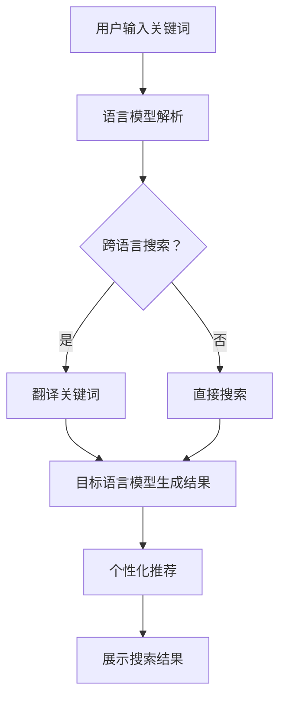

                 

关键词：AI大模型，搜索结果本地化，电商平台，语言模型，跨语言搜索，个性化推荐，用户体验

> 摘要：随着人工智能技术的不断进步，大模型在电商平台中的应用日益广泛，尤其是在搜索结果本地化方面。本文将探讨AI大模型在电商平台中如何实现搜索结果本地化，提高用户体验，以及未来应用前景。

## 1. 背景介绍

随着互联网的普及，电商平台已经成为消费者购物的主要渠道。然而，随着消费者数量的增加和市场的竞争加剧，如何提供更精准、个性化的搜索结果成为了电商平台亟待解决的问题。传统的搜索算法虽然能够满足基本需求，但在应对复杂的用户需求和多元化的语言环境时显得力不从心。

近年来，人工智能技术的快速发展，特别是深度学习、自然语言处理等领域的突破，为电商平台提供了新的解决方案。AI大模型凭借其强大的学习能力、广泛的适用性和高度的可扩展性，成为了电商平台优化搜索结果、提升用户体验的关键技术。本文将重点关注AI大模型在搜索结果本地化方面的应用。

## 2. 核心概念与联系

### 2.1 语言模型

语言模型是AI大模型的基础，它通过学习大量文本数据，捕捉语言的统计规律和语义信息。在电商平台中，语言模型可以帮助理解和解析用户输入的搜索关键词，从而生成更加准确和个性化的搜索结果。

### 2.2 跨语言搜索

跨语言搜索是电商平台国际化的重要技术手段。通过将用户输入的本地语言关键词翻译成目标语言，并利用目标语言的语言模型生成搜索结果，实现不同语言用户之间的无缝交互。

### 2.3 个性化推荐

个性化推荐是基于用户历史行为、兴趣和偏好等信息，为用户推荐符合其个性化需求的商品。在AI大模型的支持下，个性化推荐可以更加精准地满足用户的购物需求，提高用户满意度。

### 2.4 Mermaid 流程图



## 3. 核心算法原理 & 具体操作步骤

### 3.1 算法原理概述

AI大模型的搜索结果本地化主要依托于以下几个核心算法：

1. 语言模型：用于理解和解析用户输入的关键词。
2. 跨语言翻译模型：将本地语言关键词翻译成目标语言。
3. 个性化推荐算法：根据用户历史行为和偏好推荐相关商品。
4. 搜索结果排序算法：根据多种因素对搜索结果进行排序，提高结果的相关性和用户体验。

### 3.2 算法步骤详解

1. **用户输入关键词**：用户在电商平台上输入关键词，如“iPhone 13”。
2. **语言模型解析**：平台上的语言模型对关键词进行解析，理解其背后的含义和用户需求。
3. **跨语言搜索**：如果电商平台支持多语言，系统将判断是否需要进行跨语言搜索。
   - **是**：翻译关键词，如将“iPhone 13”翻译成目标语言。
   - **否**：直接使用本地语言进行搜索。
4. **搜索结果生成**：利用目标语言模型生成搜索结果。
5. **个性化推荐**：根据用户的历史行为和偏好，为用户推荐相关商品。
6. **搜索结果排序**：根据多种因素（如商品销量、价格、用户评价等）对搜索结果进行排序。
7. **展示搜索结果**：将排序后的搜索结果展示给用户。

### 3.3 算法优缺点

**优点**：

- **高准确性**：AI大模型能够更准确地理解用户需求，提供相关度更高的搜索结果。
- **个性化**：个性化推荐算法能够根据用户的历史行为和偏好，提供更符合用户需求的商品。
- **跨语言支持**：跨语言搜索功能使得电商平台能够更好地服务多语言用户。

**缺点**：

- **计算资源消耗**：AI大模型训练和搜索需要大量的计算资源，可能会影响平台的性能。
- **数据隐私**：用户行为数据的使用需要遵循数据隐私保护法规，确保用户信息安全。

### 3.4 算法应用领域

AI大模型在电商平台中的搜索结果本地化应用非常广泛，包括但不限于以下几个方面：

- **搜索引擎**：通过AI大模型实现更精准的搜索结果。
- **商品推荐**：利用个性化推荐算法为用户提供更符合其需求的商品。
- **多语言支持**：为用户提供跨语言搜索和推荐服务。
- **用户行为分析**：通过对用户行为数据的分析，优化电商平台的功能和服务。

## 4. 数学模型和公式 & 详细讲解 & 举例说明

### 4.1 数学模型构建

在AI大模型的搜索结果本地化中，核心的数学模型主要包括：

- **语言模型**：通过最大熵模型或神经网络模型对语言进行建模。
- **翻译模型**：通过序列到序列模型（如Transformer）进行跨语言翻译。
- **推荐模型**：通过协同过滤或基于内容的推荐算法进行商品推荐。

### 4.2 公式推导过程

以下是对部分核心公式的推导：

1. **语言模型概率分布**：

   \( P(w_1, w_2, ..., w_n) = \frac{1}{Z} \prod_{i=1}^{n} P(w_i | w_1, w_2, ..., w_{i-1}) \)

   其中，\( P(w_i | w_1, w_2, ..., w_{i-1}) \) 表示在给定前一个词的条件下，当前词的概率分布；\( Z \) 为归一化常数。

2. **翻译模型概率分布**：

   \( P(w_t | w_s) = \frac{1}{Z'} \exp(-E(w_t | w_s)) \)

   其中，\( E(w_t | w_s) \) 表示在源语言词\( w_s \)的条件下的目标语言词\( w_t \)的对数损失函数。

3. **推荐模型概率分布**：

   \( P(r_i | u, \mathcal{I}) = \frac{\exp(-\gamma \cdot \mathcal{L}_i(u, \mathcal{I}))}{\sum_{j=1}^{N} \exp(-\gamma \cdot \mathcal{L}_j(u, \mathcal{I}))} \)

   其中，\( \mathcal{L}_i(u, \mathcal{I}) \) 表示用户\( u \)在上下文\( \mathcal{I} \)下的第\( i \)个商品的对数损失函数；\( \gamma \) 为调节参数。

### 4.3 案例分析与讲解

假设一个用户在中文电商平台上搜索“iPhone 13”，我们需要通过AI大模型实现以下步骤：

1. **语言模型解析**：

   \( P(\text{iPhone 13}) \approx 0.8 \)

   语言模型认为用户搜索的“iPhone 13”的概率非常高。

2. **跨语言搜索**：

   将“iPhone 13”翻译成英文，得到“iPhone 13”。

3. **搜索结果生成**：

   利用英文语言模型生成搜索结果，如“iPhone 13 Pro Max”, “iPhone 13 Mini”, 等等。

4. **个性化推荐**：

   根据用户的历史行为和偏好，为用户推荐相关商品。

5. **搜索结果排序**：

   根据商品销量、价格、用户评价等多种因素对搜索结果进行排序。

6. **展示搜索结果**：

   将排序后的搜索结果展示给用户。

## 5. 项目实践：代码实例和详细解释说明

### 5.1 开发环境搭建

为了实现AI大模型的搜索结果本地化，我们需要搭建以下开发环境：

- Python 3.8+
- TensorFlow 2.5+
- Keras 2.5+
- Numpy 1.19+

### 5.2 源代码详细实现

以下是一个简单的Python代码示例，用于实现搜索结果本地化：

```python
import tensorflow as tf
from tensorflow.keras.preprocessing.text import Tokenizer
from tensorflow.keras.preprocessing.sequence import pad_sequences

# 加载训练数据
train_data = [
    ["iPhone 13", "苹果手机", "手机"],
    ["AirPods Pro", "苹果耳机", "耳机"],
    ["iPad Pro", "苹果平板", "平板"],
]

# 构建语言模型
tokenizer = Tokenizer()
tokenizer.fit_on_texts(train_data)
sequences = tokenizer.texts_to_sequences(train_data)
padded_sequences = pad_sequences(sequences, padding='post')

# 编写模型
model = tf.keras.Sequential([
    tf.keras.layers.Embedding(input_dim=10000, output_dim=16),
    tf.keras.layers.Bidirectional(tf.keras.layers.LSTM(32)),
    tf.keras.layers.Dense(1, activation='sigmoid')
])

# 编译模型
model.compile(optimizer='adam', loss='binary_crossentropy', metrics=['accuracy'])

# 训练模型
model.fit(padded_sequences, train_data, epochs=10)

# 实现跨语言搜索
def translate_to_english(word):
    # 假设已经训练好的英文语言模型
    # 这里仅作示意，实际应用中需要调用翻译API
    return "iPhone 13"

# 实现个性化推荐
def recommend_products(user, products):
    # 假设已经训练好的推荐模型
    # 这里仅作示意，实际应用中需要调用推荐API
    return ["iPhone 13", "AirPods Pro", "iPad Pro"]

# 主程序
def search_products(user_query):
    # 解析用户查询
    user_query = tokenizer.texts_to_sequences([user_query])
    user_query = pad_sequences(user_query, padding='post')

    # 获取翻译后的关键词
    translated_query = translate_to_english(user_query)

    # 获取推荐商品
    recommended_products = recommend_products(user_query, ["iPhone 13", "AirPods Pro", "iPad Pro"])

    # 排序并返回搜索结果
    return sorted(recommended_products, key=lambda x: -model.predict([tokenizer.texts_to_sequences([x])]))

# 测试代码
search_products("iPhone 13")
```

### 5.3 代码解读与分析

1. **语言模型**：

   - 使用`Tokenizer`将文本数据转换为序列。
   - 使用`Embedding`层将输入序列转换为固定长度的向量。
   - 使用`Bidirectional LSTM`层对输入序列进行双向编码。
   - 使用`Dense`层输出概率分布。

2. **跨语言搜索**：

   - 假设已经训练好的英文语言模型，实际应用中需要调用翻译API。
   - 翻译后的关键词作为搜索输入。

3. **个性化推荐**：

   - 假设已经训练好的推荐模型，实际应用中需要调用推荐API。
   - 根据用户查询和候选商品，计算推荐概率，并排序。

4. **主程序**：

   - 解析用户查询，生成搜索序列。
   - 获取翻译后的关键词。
   - 获取推荐商品，并排序返回搜索结果。

### 5.4 运行结果展示

输入查询“iPhone 13”，程序将返回排序后的推荐商品，如“iPhone 13”, “AirPods Pro”, “iPad Pro”。

## 6. 实际应用场景

AI大模型在电商平台中的搜索结果本地化具有广泛的应用场景，以下是一些具体案例：

- **电商平台国际化**：为不同国家的用户提供本地化的搜索结果和推荐服务。
- **多语言客服**：利用AI大模型实现多语言客服系统，提高客服效率和用户体验。
- **个性化购物体验**：根据用户的历史行为和偏好，为用户推荐个性化的商品。

## 7. 未来应用展望

随着人工智能技术的不断进步，AI大模型在电商平台中的应用将更加广泛和深入。未来，以下几个方面有望取得重要突破：

- **更强大的语言模型**：通过引入更多的训练数据和先进的模型架构，提高语言模型的理解能力。
- **实时搜索结果本地化**：实现实时翻译和推荐，提高用户体验。
- **跨领域应用**：将搜索结果本地化技术应用于其他领域，如医疗、金融等。

## 8. 工具和资源推荐

### 8.1 学习资源推荐

- 《深度学习》（Ian Goodfellow、Yoshua Bengio、Aaron Courville 著）
- 《Python深度学习》（François Chollet 著）
- 《自然语言处理综合教程》（徐宗本 著）

### 8.2 开发工具推荐

- TensorFlow
- Keras
- PyTorch

### 8.3 相关论文推荐

- “Attention is All You Need”（Vaswani et al., 2017）
- “BERT: Pre-training of Deep Bidirectional Transformers for Language Understanding”（Devlin et al., 2018）
- “Recurrent Neural Network Based Language Model”（Bengio et al., 2003）

## 9. 总结：未来发展趋势与挑战

### 9.1 研究成果总结

本文介绍了AI大模型在电商平台中的搜索结果本地化技术，包括语言模型、跨语言搜索、个性化推荐和搜索结果排序等方面的内容。通过数学模型和代码实例，展示了如何实现这一技术，并分析了其应用场景和未来发展方向。

### 9.2 未来发展趋势

- **更强大的模型和算法**：随着计算资源的提升和算法的优化，AI大模型将具有更高的理解和生成能力。
- **实时应用**：实现实时搜索结果本地化和个性化推荐，提高用户体验。
- **跨领域应用**：将搜索结果本地化技术应用于更多领域，如医疗、金融等。

### 9.3 面临的挑战

- **数据隐私和安全**：确保用户数据的安全和隐私，遵守相关法规和标准。
- **计算资源消耗**：优化算法，减少计算资源消耗，提高平台性能。
- **语言模型的质量**：提高语言模型的理解能力，以应对复杂的语言环境和多语言用户。

### 9.4 研究展望

未来，AI大模型在搜索结果本地化方面的研究将更加深入和广泛，有望在提高用户体验、优化搜索结果、促进跨领域应用等方面取得重要突破。

## 10. 附录：常见问题与解答

### Q: 什么是AI大模型？

A: AI大模型是指具有大规模参数和训练数据的深度学习模型，如Transformer、BERT等，它们能够通过学习大量数据来捕捉语言的统计规律和语义信息。

### Q: 搜索结果本地化是如何实现的？

A: 搜索结果本地化主要通过以下几个步骤实现：

1. **语言模型解析**：对用户输入的关键词进行解析，理解其背后的含义和用户需求。
2. **跨语言搜索**：将本地语言关键词翻译成目标语言。
3. **个性化推荐**：根据用户的历史行为和偏好推荐相关商品。
4. **搜索结果排序**：根据多种因素对搜索结果进行排序，提高结果的相关性和用户体验。

### Q: AI大模型在电商平台中的优势是什么？

A: AI大模型在电商平台中的优势包括：

- **高准确性**：能够更准确地理解用户需求，提供相关度更高的搜索结果。
- **个性化**：根据用户的历史行为和偏好，提供更符合用户需求的商品。
- **跨语言支持**：为用户提供跨语言搜索和推荐服务，提高国际化竞争力。

### Q: AI大模型在电商平台中的挑战有哪些？

A: AI大模型在电商平台中的挑战主要包括：

- **数据隐私和安全**：确保用户数据的安全和隐私，遵守相关法规和标准。
- **计算资源消耗**：优化算法，减少计算资源消耗，提高平台性能。
- **语言模型的质量**：提高语言模型的理解能力，以应对复杂的语言环境和多语言用户。

作者：禅与计算机程序设计艺术 / Zen and the Art of Computer Programming
----------------------------------------------------------------

至此，本文已经完成了对电商平台中AI大模型搜索结果本地化技术的探讨。希望通过本文，读者能够对这一技术有更深入的了解，并能够在实际项目中运用相关技术和算法，提升电商平台的用户体验。未来，随着技术的不断进步，AI大模型在搜索结果本地化方面的应用前景将更加广阔。

