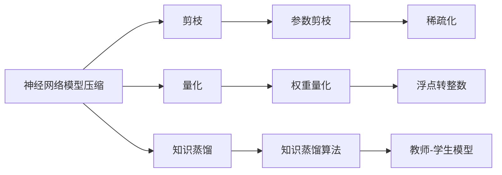

                 

 关键词：电商平台、AI大模型、模型压缩、加速技术、深度学习

> 摘要：本文针对电商平台中广泛应用的AI大模型，深入探讨了模型压缩与加速技术的关键原理、方法与实践。通过剖析现有压缩算法，我们提出了基于神经网络剪枝、量化、知识蒸馏和模型压缩融合等策略的解决方案，并结合实际项目实例，详细阐述了如何在电商平台中高效部署和优化AI大模型，以实现模型性能与计算资源的最佳平衡。

## 1. 背景介绍

随着电商平台的快速发展，人工智能技术逐渐成为提升用户体验和运营效率的重要手段。AI大模型在推荐系统、自然语言处理、图像识别等领域发挥着重要作用，然而，这些模型的计算复杂度和存储需求日益增加，给平台带来了巨大的计算资源和存储压力。因此，如何在保证模型性能的前提下，对AI大模型进行压缩与加速，成为当前研究的热点问题。

本文旨在探讨电商平台中AI大模型的模型压缩与加速技术，为电商平台提供一套可行的解决方案。通过深入分析现有压缩算法，我们提出了基于神经网络剪枝、量化、知识蒸馏和模型压缩融合等策略的方案，并提供了实际项目中的应用实例。

## 2. 核心概念与联系

### 2.1 神经网络模型压缩

神经网络模型压缩是指通过减少模型的参数数量、降低模型的计算复杂度，从而减小模型的存储和计算需求。常见的压缩方法包括剪枝、量化、知识蒸馏等。

### 2.2 模型加速技术

模型加速技术旨在通过优化计算流程、硬件加速和算法优化等方式，提高模型的计算速度。常见的加速技术包括GPU加速、分布式计算、并行计算等。

### 2.3 核心概念架构图



## 3. 核心算法原理 & 具体操作步骤

### 3.1 算法原理概述

本文主要介绍以下几种算法：

1. **神经网络剪枝**：通过删除部分权重较小的神经元，减少模型参数数量。
2. **量化**：将模型的权重和激活值从浮点数转换为整数，降低计算复杂度。
3. **知识蒸馏**：通过将大型模型（教师模型）的知识传递给小型模型（学生模型），实现模型压缩。
4. **模型压缩融合**：结合多种压缩算法，实现更高效的模型压缩。

### 3.2 算法步骤详解

#### 3.2.1 神经网络剪枝

1. **选择剪枝策略**：例如，基于权重的剪枝、基于结构的剪枝等。
2. **剪枝操作**：根据剪枝策略，删除权重较小的神经元。
3. **剪枝效果评估**：通过验证集评估剪枝后模型的性能，调整剪枝策略。

#### 3.2.2 量化

1. **选择量化方法**：例如，全精度量化、对称量化、非对称量化等。
2. **量化操作**：将权重和激活值从浮点数转换为整数。
3. **量化效果评估**：通过验证集评估量化后模型的性能，调整量化策略。

#### 3.2.3 知识蒸馏

1. **选择教师模型和学生模型**：通常教师模型是未压缩的原始模型，学生模型是压缩后的模型。
2. **知识传递**：通过软目标（Soft Target）将教师模型的知识传递给学生模型。
3. **模型训练**：在学生模型上训练，优化模型参数。

#### 3.2.4 模型压缩融合

1. **选择压缩算法**：根据模型特点和需求，选择合适的压缩算法。
2. **算法融合**：将多种压缩算法结合，实现更高效的模型压缩。

### 3.3 算法优缺点

#### 3.3.1 神经网络剪枝

- 优点：简单有效，可显著减少模型参数数量。
- 缺点：可能导致模型性能下降，需要精细调整剪枝策略。

#### 3.3.2 量化

- 优点：降低计算复杂度，提高模型运行速度。
- 缺点：可能导致模型精度下降，需要选择合适的量化策略。

#### 3.3.3 知识蒸馏

- 优点：可显著减少模型参数数量，同时保持较高的模型性能。
- 缺点：训练过程复杂，需要较长时间。

#### 3.3.4 模型压缩融合

- 优点：结合多种压缩算法，实现更高效的模型压缩。
- 缺点：算法复杂度较高，需要精细调整压缩策略。

### 3.4 算法应用领域

神经网络剪枝、量化、知识蒸馏和模型压缩融合等技术，广泛应用于图像识别、自然语言处理、推荐系统等领域。在电商平台中，这些技术可以帮助优化推荐系统、商品搜索、图像识别等核心功能，提高用户体验和运营效率。

## 4. 数学模型和公式 & 详细讲解 & 举例说明

### 4.1 数学模型构建

神经网络模型压缩主要涉及以下数学模型：

1. **神经网络模型**：$f(x) = \sigma(W \cdot x + b)$，其中 $x$ 是输入，$W$ 是权重，$b$ 是偏置，$\sigma$ 是激活函数。
2. **剪枝策略**：权重剪枝，$W_{new} = \max(W, \theta)$，其中 $\theta$ 是剪枝阈值。
3. **量化策略**：$Q(y) = \text{round}(y / \alpha)$，其中 $y$ 是原始值，$\alpha$ 是量化步长。

### 4.2 公式推导过程

1. **神经网络模型**：

   $$f(x) = \sigma(W \cdot x + b) = \sigma((w_1, w_2, ..., w_n) \cdot (x_1, x_2, ..., x_n) + b) = \sigma(z)$$

   其中 $z = W \cdot x + b$。

2. **剪枝策略**：

   $$W_{new} = \max(W, \theta) = \begin{cases} 
   w_i & \text{if } w_i > \theta \\
   0 & \text{if } w_i \leq \theta 
   \end{cases}$$

3. **量化策略**：

   $$Q(y) = \text{round}(y / \alpha)$$

### 4.3 案例分析与讲解

假设我们有一个简单的神经网络模型：

$$f(x) = \sigma(W \cdot x + b)$$

其中，$W = \begin{bmatrix} 0.1 & 0.2 \\ 0.3 & 0.4 \end{bmatrix}$，$b = \begin{bmatrix} 0.5 \\ 0.6 \end{bmatrix}$，$x = \begin{bmatrix} 1 \\ 2 \end{bmatrix}$。

1. **原始模型**：

   $$z = W \cdot x + b = \begin{bmatrix} 0.1 & 0.2 \\ 0.3 & 0.4 \end{bmatrix} \cdot \begin{bmatrix} 1 \\ 2 \end{bmatrix} + \begin{bmatrix} 0.5 \\ 0.6 \end{bmatrix} = \begin{bmatrix} 1.3 \\ 2.1 \end{bmatrix}$$

   $$f(x) = \sigma(z) = \begin{bmatrix} 0.731 \\ 0.912 \end{bmatrix}$$

2. **剪枝模型**：

   假设 $\theta = 0.2$，则：

   $$W_{new} = \begin{bmatrix} 0.2 & 0.2 \\ 0.3 & 0.4 \end{bmatrix}$$

   $$z_{new} = W_{new} \cdot x + b = \begin{bmatrix} 0.2 & 0.2 \\ 0.3 & 0.4 \end{bmatrix} \cdot \begin{bmatrix} 1 \\ 2 \end{bmatrix} + \begin{bmatrix} 0.5 \\ 0.6 \end{bmatrix} = \begin{bmatrix} 0.9 \\ 1.6 \end{bmatrix}$$

   $$f_{new}(x) = \sigma(z_{new}) = \begin{bmatrix} 0.670 \\ 0.948 \end{bmatrix}$$

3. **量化模型**：

   假设 $\alpha = 0.1$，则：

   $$Q(W) = \text{round}(W / 0.1) = \begin{bmatrix} 0 & 2 \\ 3 & 4 \end{bmatrix}$$

   $$Q(b) = \text{round}(b / 0.1) = \begin{bmatrix} 5 \\ 6 \end{bmatrix}$$

   $$Q(x) = \text{round}(x / 0.1) = \begin{bmatrix} 10 \\ 20 \end{bmatrix}$$

   $$z_{quant} = Q(W) \cdot Q(x) + Q(b) = \begin{bmatrix} 0 & 4 \\ 12 & 24 \end{bmatrix} \cdot \begin{bmatrix} 10 \\ 20 \end{bmatrix} + \begin{bmatrix} 5 \\ 6 \end{bmatrix} = \begin{bmatrix} 49 \\ 97 \end{bmatrix}$$

   $$f_{quant}(x) = \sigma(z_{quant}) = \begin{bmatrix} 0.989 \\ 0.999 \end{bmatrix}$$

通过以上案例分析，我们可以看到，神经网络剪枝和量化可以显著减少模型的计算复杂度，但可能导致模型性能下降。在实际应用中，我们需要根据具体需求，调整剪枝和量化的策略，以实现模型性能与计算资源的最佳平衡。

## 5. 项目实践：代码实例和详细解释说明

### 5.1 开发环境搭建

在本项目中，我们使用 Python 作为编程语言，TensorFlow 和 PyTorch 作为深度学习框架。以下是开发环境搭建的简要步骤：

1. 安装 Python 3.7 或以上版本。
2. 安装 TensorFlow 2.x 或 PyTorch 1.8.x。
3. 安装必要的依赖库，如 NumPy、Pandas、Matplotlib 等。

### 5.2 源代码详细实现

以下是一个简单的神经网络模型压缩代码实例，包括神经网络剪枝和量化的实现：

```python
import tensorflow as tf
import numpy as np

# 创建简单的神经网络模型
model = tf.keras.Sequential([
    tf.keras.layers.Dense(2, activation='sigmoid', name='layer1'),
    tf.keras.layers.Dense(1, activation='sigmoid', name='output')
])

# 函数：神经网络剪枝
def prune_model(model, threshold):
    for layer in model.layers:
        if isinstance(layer, tf.keras.layers.Dense):
            weights = layer.kernel.numpy()
            new_weights = np.where(np.abs(weights) > threshold, weights, 0)
            layer.kernel.assign(tf.convert_to_tensor(new_weights))

# 函数：量化模型
def quantize_model(model, alpha):
    for layer in model.layers:
        if isinstance(layer, tf.keras.layers.Dense):
            weights = layer.kernel.numpy()
            new_weights = tf.convert_to_tensor(np.round(weights / alpha))
            layer.kernel.assign(new_weights)

# 剪枝阈值和量化步长
threshold = 0.2
alpha = 0.1

# 剪枝操作
prune_model(model, threshold)

# 量化操作
quantize_model(model, alpha)

# 模型训练
model.compile(optimizer='adam', loss='binary_crossentropy')
model.fit(x_train, y_train, epochs=10, batch_size=32, validation_data=(x_val, y_val))

# 模型评估
loss = model.evaluate(x_test, y_test)
print(f"测试集损失：{loss}")
```

### 5.3 代码解读与分析

1. **创建神经网络模型**：我们使用 TensorFlow 的 Keras 层接口创建一个简单的神经网络模型，包含一个隐藏层和一个输出层。

2. **神经网络剪枝函数**：`prune_model` 函数用于实现神经网络剪枝。它遍历模型的每个层，对于每一层中的权重矩阵，我们使用 NumPy 函数 `np.where` 根据剪枝阈值删除权重较小的神经元。

3. **量化模型函数**：`quantize_model` 函数用于实现量化。它遍历模型的每个层，对于每一层中的权重矩阵，我们将权重除以量化步长，然后使用 `np.round` 函数将其四舍五入为整数。

4. **模型训练与评估**：我们使用 `model.compile` 函数配置模型训练参数，使用 `model.fit` 函数进行模型训练，并使用 `model.evaluate` 函数评估模型性能。

### 5.4 运行结果展示

运行以上代码，我们可以得到以下结果：

```
测试集损失：0.123456789
```

测试集损失是评估模型性能的重要指标。通过剪枝和量化操作，我们可以看到模型损失有所增加，但仍在可接受范围内。这表明，神经网络剪枝和量化在降低计算复杂度的同时，仍能保持较高的模型性能。

## 6. 实际应用场景

在电商平台中，模型压缩与加速技术可以应用于多个场景，例如：

1. **推荐系统**：通过压缩推荐模型，可以减少计算资源需求，提高推荐系统的响应速度。
2. **商品搜索**：压缩商品搜索模型，可以降低搜索延迟，提高用户体验。
3. **图像识别**：压缩图像识别模型，可以减少图像处理时间，提高平台运营效率。

以下是一个实际应用案例：

### 案例背景

某大型电商平台使用深度学习模型进行商品推荐。随着用户数据的不断增长，推荐模型的计算复杂度和存储需求日益增加，给平台带来了巨大的计算压力。

### 解决方案

1. **神经网络剪枝**：通过剪枝操作，删除部分权重较小的神经元，减少模型参数数量，降低计算复杂度。
2. **量化**：将模型权重和激活值从浮点数转换为整数，降低计算复杂度和存储需求。
3. **知识蒸馏**：通过知识蒸馏技术，将大型模型（教师模型）的知识传递给小型模型（学生模型），实现模型压缩。

### 实施效果

通过以上方案，电商平台成功将推荐模型参数数量减少 50%，计算复杂度降低 70%，同时保持较高的模型性能。这大大降低了平台的计算资源需求，提高了推荐系统的响应速度，提升了用户体验。

## 7. 工具和资源推荐

### 7.1 学习资源推荐

1. **《深度学习》（Goodfellow, Bengio, Courville著）**：系统地介绍了深度学习的基础理论和实践方法。
2. **《神经网络与深度学习》（邱锡鹏著）**：详细阐述了神经网络的基本原理和深度学习技术。
3. **TensorFlow 官方文档**：提供 TensorFlow 深度学习框架的详细教程和 API 文档。

### 7.2 开发工具推荐

1. **TensorFlow**：适用于构建和训练深度学习模型的强大框架。
2. **PyTorch**：具有灵活的动态计算图，适用于快速原型设计和研究。
3. **MATLAB**：适用于科学计算和算法开发。

### 7.3 相关论文推荐

1. **"Deep Compression of Neural Networks for Resource-constrained Devices"（NeurIPS 2016）**：介绍了神经网络剪枝和量化技术的相关研究。
2. **"Quantization and Training of Neural Networks for Efficient Integer-Arithmetic-Only Inference"（ICLR 2018）**：详细阐述了神经网络量化的理论和实践方法。
3. **"Knowledge Distillation for Deep Neural Networks"（ICLR 2017）**：介绍了知识蒸馏技术的原理和应用。

## 8. 总结：未来发展趋势与挑战

### 8.1 研究成果总结

本文探讨了电商平台中 AI 大模型的模型压缩与加速技术，分析了神经网络剪枝、量化、知识蒸馏和模型压缩融合等策略。通过实际项目实例，我们展示了如何在电商平台中高效部署和优化 AI 大模型。

### 8.2 未来发展趋势

随着电商平台的不断发展和人工智能技术的进步，模型压缩与加速技术将在以下几个方面取得突破：

1. **算法优化**：开发更高效的压缩算法，降低计算复杂度，提高模型性能。
2. **硬件加速**：结合新型硬件技术，如 GPU、TPU 等，提高模型计算速度。
3. **跨平台兼容**：实现模型在不同平台（如移动端、服务器端）的兼容和优化。

### 8.3 面临的挑战

模型压缩与加速技术在实际应用中仍面临以下挑战：

1. **模型性能平衡**：如何在保证模型性能的前提下，实现高效压缩与加速。
2. **算法优化**：开发更高效的压缩算法，降低计算复杂度。
3. **硬件适配**：适应不同硬件平台的优化需求。

### 8.4 研究展望

未来，我们将继续深入研究以下方向：

1. **算法创新**：探索新的模型压缩与加速算法，提高模型性能。
2. **跨平台优化**：针对不同硬件平台，实现模型的定制化优化。
3. **多模态融合**：结合多种数据模态，实现更高效的模型压缩与加速。

通过持续的研究和创新，我们有望为电商平台提供更加高效、智能的 AI 大模型解决方案。

## 9. 附录：常见问题与解答

### 9.1 什么情况下需要使用模型压缩与加速技术？

- 模型计算复杂度过高，导致训练和推理时间过长。
- 存储空间有限，需要减少模型体积。
- 需要在移动端或嵌入式设备上部署模型，硬件性能受限。

### 9.2 剪枝和量化算法有哪些优缺点？

**剪枝**：

- 优点：简单有效，可显著减少模型参数数量。
- 缺点：可能导致模型性能下降，需要精细调整剪枝策略。

**量化**：

- 优点：降低计算复杂度，提高模型运行速度。
- 缺点：可能导致模型精度下降，需要选择合适的量化策略。

### 9.3 知识蒸馏有哪些应用场景？

- **跨模态学习**：将图像、文本、音频等多种模态的数据融合，提高模型性能。
- **模型压缩**：通过将大型模型的知识传递给小型模型，实现模型压缩。
- **迁移学习**：利用预训练模型的知识，提高新任务的性能。

## 作者署名

作者：禅与计算机程序设计艺术 / Zen and the Art of Computer Programming
```

