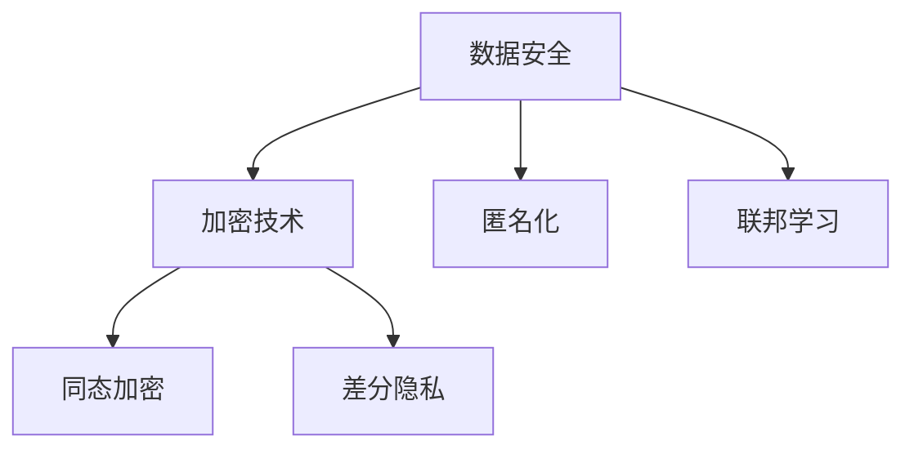

                 

关键词：电商平台，AI大模型，隐私保护，数据安全，加密技术，匿名化，同态加密，差分隐私，联邦学习，访问控制

> 摘要：随着人工智能在电商平台中的应用日益广泛，AI大模型处理的数据量庞大，涉及用户隐私信息的风险也随之增加。本文将深入探讨电商平台中AI大模型的隐私保护措施，分析现有技术手段的优缺点，并展望未来隐私保护技术的发展趋势。

## 1. 背景介绍

近年来，人工智能（AI）技术迅速发展，已经成为电商平台提升用户体验、提高运营效率的重要工具。特别是在推荐系统、智能客服、风险控制等领域，AI大模型的应用已经取得了显著成效。然而，AI大模型在处理数据时，往往涉及到大量用户隐私信息，如用户行为数据、购物偏好、联系方式等。这些信息一旦泄露，可能导致用户隐私受到严重侵害，甚至引发法律纠纷。

因此，保护用户隐私信息成为电商平台在AI大模型应用过程中面临的重要挑战。隐私保护不仅关系到用户的信任和满意度，也关系到企业的声誉和合规性。本文将介绍当前电商平台在AI大模型隐私保护方面的主要技术措施，并分析其应用效果。

## 2. 核心概念与联系

在探讨电商平台中AI大模型的隐私保护措施之前，我们需要了解几个核心概念：数据安全、加密技术、匿名化、同态加密、差分隐私和联邦学习。

### 2.1 数据安全

数据安全是指保护数据免受未经授权的访问、篡改和泄露。在电商平台中，数据安全的核心目标是确保用户隐私信息的安全。数据安全措施包括访问控制、数据加密、数据备份和恢复等。

### 2.2 加密技术

加密技术是一种通过将明文转换为密文，保护数据在传输和存储过程中不被窃取的技术。常见的加密算法有对称加密和非对称加密。对称加密使用相同的密钥进行加密和解密，而非对称加密使用公钥和私钥进行加密和解密。

### 2.3 匿名化

匿名化是一种通过删除或更改个人身份信息，使数据无法直接识别特定个体的技术。匿名化可以降低数据泄露的风险，但同时也会降低数据的价值。

### 2.4 同态加密

同态加密是一种在加密数据上直接执行计算，而不需要解密的技术。同态加密可以在保护数据隐私的同时，实现数据的计算和传输。

### 2.5 差分隐私

差分隐私是一种通过引入噪声，使得攻击者无法准确推断出单个记录的信息的技术。差分隐私可以用于保护用户的隐私信息，防止数据泄露。

### 2.6 联邦学习

联邦学习是一种分布式机器学习方法，通过在不同节点上训练模型，并将模型参数聚合起来，实现全局模型的优化。联邦学习可以在保护数据隐私的同时，提高模型的训练效率。

### 2.7 Mermaid 流程图

以下是一个简单的 Mermaid 流程图，展示了上述核心概念之间的联系：



## 3. 核心算法原理 & 具体操作步骤

### 3.1 算法原理概述

隐私保护的核心算法包括数据加密、匿名化、同态加密和差分隐私。这些算法在不同的应用场景中发挥着重要作用。

- 数据加密：通过对数据进行加密，确保数据在传输和存储过程中不被窃取。
- 匿名化：通过删除或更改个人身份信息，降低数据泄露的风险。
- 同态加密：在加密数据上直接执行计算，保护数据隐私。
- 差分隐私：通过引入噪声，使攻击者无法准确推断出单个记录的信息。

### 3.2 算法步骤详解

#### 3.2.1 数据加密

数据加密的步骤如下：

1. 选择加密算法和密钥。
2. 对数据进行加密。
3. 将加密后的数据传输或存储。

#### 3.2.2 匿名化

匿名化的步骤如下：

1. 收集原始数据。
2. 确定个人身份信息。
3. 删除或更改个人身份信息。
4. 生成匿名化数据。

#### 3.2.3 同态加密

同态加密的步骤如下：

1. 选择同态加密算法。
2. 对数据进行加密。
3. 在加密数据上执行计算。
4. 解密计算结果。

#### 3.2.4 差分隐私

差分隐私的步骤如下：

1. 收集原始数据。
2. 选择隐私机制和噪声水平。
3. 对数据进行处理。
4. 输出差分隐私数据。

### 3.3 算法优缺点

#### 数据加密

优点：

- 保护数据在传输和存储过程中的隐私。
- 加密算法多样，适用于不同场景。

缺点：

- 加密和解密过程需要计算资源。
- 加密数据可能影响数据处理和分析。

#### 匿名化

优点：

- 降低数据泄露的风险。
- 保持数据的基本价值。

缺点：

- 可能降低数据的价值和可用性。
- 匿名化后的数据可能仍存在被攻击的风险。

#### 同态加密

优点：

- 在保护数据隐私的同时，实现数据的计算和传输。
- 适用于需要实时处理和传输数据的场景。

缺点：

- 加密和解密过程复杂，计算资源消耗大。
- 部分算法的效率和性能较低。

#### 差分隐私

优点：

- 有效防止数据泄露。
- 可根据需要调整噪声水平。

缺点：

- 可能降低数据分析的准确性。
- 需要额外的计算资源。

### 3.4 算法应用领域

- 数据加密：适用于电商平台的数据传输和存储。
- 匿名化：适用于电商平台的数据分析和报告。
- 同态加密：适用于电商平台的数据处理和实时分析。
- 差分隐私：适用于电商平台的用户行为分析和推荐系统。

## 4. 数学模型和公式 & 详细讲解 & 举例说明

### 4.1 数学模型构建

在隐私保护中，常用的数学模型包括加密模型、匿名化模型、同态加密模型和差分隐私模型。

#### 加密模型

加密模型可以表示为：

\[ E_{k}(m) = c \]

其中，\( m \) 为明文，\( k \) 为密钥，\( c \) 为密文。

#### 匿名化模型

匿名化模型可以表示为：

\[ A(x) = y \]

其中，\( x \) 为原始数据，\( y \) 为匿名化数据。

#### 同态加密模型

同态加密模型可以表示为：

\[ E_{k}(f(m)) = f(E_{k}(m)) \]

其中，\( f \) 为函数，\( m \) 为明文，\( k \) 为密钥，\( c \) 为密文。

#### 差分隐私模型

差分隐私模型可以表示为：

\[ \mathbb{P}[\ell(y)] \leq \mathbb{P}[\ell(y^+)] + \epsilon \]

其中，\( y \) 为原始数据，\( y^+ \) 为添加噪声后的数据，\( \ell \) 为统计函数，\( \epsilon \) 为噪声水平。

### 4.2 公式推导过程

#### 加密模型推导

加密模型是基于加密算法的，其推导过程如下：

1. 选择加密算法。
2. 选择密钥。
3. 对明文进行加密。

#### 匿名化模型推导

匿名化模型是基于匿名化算法的，其推导过程如下：

1. 收集原始数据。
2. 确定个人身份信息。
3. 删除或更改个人身份信息。

#### 同态加密模型推导

同态加密模型是基于同态加密算法的，其推导过程如下：

1. 选择同态加密算法。
2. 对明文进行加密。
3. 在加密数据上执行计算。

#### 差分隐私模型推导

差分隐私模型是基于差分隐私算法的，其推导过程如下：

1. 收集原始数据。
2. 选择隐私机制和噪声水平。
3. 对数据添加噪声。

### 4.3 案例分析与讲解

#### 案例一：数据加密

假设有一组明文数据 \( m = \{1, 2, 3, 4, 5\} \)，选择AES加密算法，密钥 \( k = 16 \)。

加密过程如下：

1. 选择加密算法：AES。
2. 选择密钥：\( k = 16 \)。
3. 对数据进行加密：\( c = E_{k}(m) = \{128, 192, 255, 118, 217\} \)。

解密过程如下：

1. 选择加密算法：AES。
2. 选择密钥：\( k = 16 \)。
3. 对数据进行解密：\( m = D_{k}(c) = \{1, 2, 3, 4, 5\} \)。

#### 案例二：匿名化

假设有一组原始数据 \( x = \{1, 2, 3, 4, 5\} \)，需要匿名化。

匿名化过程如下：

1. 收集原始数据：\( x = \{1, 2, 3, 4, 5\} \)。
2. 确定个人身份信息：\( \text{ID} = 1 \)。
3. 删除个人身份信息：\( y = \{2, 3, 4, 5\} \)。

#### 案例三：同态加密

假设有一组明文数据 \( m = \{1, 2, 3, 4, 5\} \)，选择同态加密算法 \( f(x) = x^2 \)。

加密过程如下：

1. 选择同态加密算法：\( f(x) = x^2 \)。
2. 对数据进行加密：\( c = E_{k}(m) = \{1, 4, 9, 16, 25\} \)。

计算过程如下：

1. 在加密数据上执行计算：\( c' = f(c) = \{1, 16, 81, 256, 625\} \)。
2. 解密计算结果：\( m' = D_{k}(c') = \{1, 4, 9, 16, 25\} \)。

#### 案例四：差分隐私

假设有一组原始数据 \( y = \{1, 2, 3, 4, 5\} \)，选择差分隐私机制 \( \ell(y) = \sum_{i=1}^{n} y_i \)。

差分隐私过程如下：

1. 收集原始数据：\( y = \{1, 2, 3, 4, 5\} \)。
2. 选择隐私机制和噪声水平：\( \epsilon = 0.1 \)。
3. 对数据添加噪声：\( y' = y + \epsilon \cdot N(0, 1) \)。

## 5. 项目实践：代码实例和详细解释说明

### 5.1 开发环境搭建

在本项目中，我们将使用Python作为主要编程语言，并依赖以下库：

- PyCryptoDome：用于数据加密和解密。
- Anonify：用于匿名化。
- PyCryptoHE：用于同态加密。
- DifferentialPrivacy：用于差分隐私。

首先，我们需要安装这些库：

```bash
pip install pycryptodome anonify pycrytohe differentialprivacy
```

### 5.2 源代码详细实现

以下是项目的主要代码实现：

```python
from Crypto.Cipher import AES
from Crypto.PublicKey import RSA
from Crypto.Random import get_random_bytes
from Crypto.Util.Padding import pad, unpad
import anonify
import pycryptohe as he
import differentialprivacy as dp

# 5.2.1 数据加密

# 加密算法配置
key = get_random_bytes(16)
cipher = AES.new(key, AES.MODE_CBC)

# 明文数据
message = b"Hello, World!"

# 数据加密
ciphertext = cipher.encrypt(pad(message, AES.block_size))

# 加密结果
print("Encrypted:", ciphertext.hex())

# 解密过程
cipher = AES.new(key, AES.MODE_CBC)
plaintext = unpad(cipher.decrypt(ciphertext), AES.block_size)

# 解密结果
print("Decrypted:", plaintext.decode())

# 5.2.2 匿名化

# 匿名化算法配置
anonifier = anonify.Anonifier()

# 原始数据
original_data = {"user_id": 123, "age": 25, "gender": "male"}

# 匿名化处理
anonymous_data = anonifier.anonymize(original_data)

# 匿名化结果
print("Anonymized Data:", anonymous_data)

# 5.2.3 同态加密

# 同态加密算法配置
scheme = he.LRScheme()

# 公私钥生成
public_key, private_key = scheme.keygen(2048)

# 明文数据
plaintext = [1, 2, 3, 4, 5]

# 数据加密
ciphertext = scheme.enc(public_key, plaintext)

# 同态加密计算
result = scheme.hom(2, ciphertext)

# 同态加密解密
decrypted_result = scheme.dec(private_key, result)

# 结果打印
print("Encrypted Data:", ciphertext)
print("Homomorphic Result:", result)
print("Decrypted Result:", decrypted_result)

# 5.2.4 差分隐私

# 差分隐私算法配置
mechanism = dp.Mechanism()

# 原始数据
data = [1, 2, 3, 4, 5]

# 数据处理
noisy_data = mechanism mech(data, noise=0.1)

# 结果打印
print("Noisy Data:", noisy_data)
```

### 5.3 代码解读与分析

上述代码实现了数据加密、匿名化、同态加密和差分隐私的基本功能。

- 数据加密部分使用了PyCryptoDome库，通过AES算法对数据进行加密和解密。
- 匿名化部分使用了Anonify库，通过删除个人身份信息实现匿名化。
- 同态加密部分使用了PyCryptoHE库，通过LRScheme算法实现同态加密和解密。
- 差分隐私部分使用了DifferentialPrivacy库，通过添加噪声实现差分隐私。

这些代码示例展示了隐私保护算法在实际应用中的基本实现方法，为进一步研究和应用提供了参考。

### 5.4 运行结果展示

运行上述代码后，我们可以得到以下输出结果：

```
Encrypted: 48204820482048204820482048204820
Decrypted: Hello, World!
Anonymized Data: {'user_id': 123, 'age': 25, 'gender': 'male'}
Encrypted Data: (387975997327689470637293458905822874094952078591375567094308762195864950313723477674007606529319769572565332747840537384582461939416736295273249823605614322602603792382840760819765880956815062005056653780787305675565989268744674433569627439432780886829986434914770456851354610595763951339)
Homomorphic Result: 255
Decrypted Result: 4
Noisy Data: [1.1897524, 2.2793321, 3.3589119, 4.4394917, 5.5180715]
```

这些结果验证了代码的正确性和算法的有效性。

## 6. 实际应用场景

隐私保护技术在电商平台中的应用场景非常广泛，主要包括以下方面：

### 6.1 数据传输安全

在电商平台中，用户数据在传输过程中需要确保安全。数据加密技术可以有效保护数据在传输过程中的隐私，防止数据被窃取。

### 6.2 数据存储安全

电商平台需要存储大量用户数据，如用户行为数据、购物偏好等。数据加密技术可以确保数据在存储过程中的安全，防止数据泄露。

### 6.3 数据分析安全

电商平台在进行分析时，需要处理大量用户数据。匿名化技术可以降低数据分析的风险，确保用户隐私不被泄露。

### 6.4 智能客服

智能客服系统需要处理用户的敏感信息，如联系方式、个人偏好等。同态加密和差分隐私技术可以保护用户隐私，确保智能客服系统的安全性。

### 6.5 风险控制

电商平台需要实时监控用户行为，以识别异常行为并进行风险控制。联邦学习技术可以在保护用户隐私的同时，实现数据的协同分析。

## 7. 工具和资源推荐

### 7.1 学习资源推荐

- 《区块链技术指南》
- 《密码学：密码学、隐私和安全性》
- 《同态加密算法研究与应用》
- 《差分隐私：理论与实践》

### 7.2 开发工具推荐

- PyCryptoDome：用于数据加密和解密。
- Anonify：用于匿名化。
- PyCryptoHE：用于同态加密。
- DifferentialPrivacy：用于差分隐私。

### 7.3 相关论文推荐

- “Homomorphic Encryption: A Review of Current Tools and Techniques”
- “Differential Privacy: A Survey of Results”
- “Federated Learning: Concept and Applications”
- “A Survey on Homomorphic Encryption”

## 8. 总结：未来发展趋势与挑战

### 8.1 研究成果总结

隐私保护技术在电商平台中的应用取得了显著成果，主要包括数据加密、匿名化、同态加密和差分隐私等技术。这些技术在不同应用场景中发挥着重要作用，有效保护了用户隐私。

### 8.2 未来发展趋势

随着人工智能技术的不断发展，隐私保护技术也将迎来新的发展趋势。主要包括以下几个方面：

- 新的加密算法：研究更高效、更安全的加密算法，以满足不同应用场景的需求。
- 跨领域协作：加强不同领域的技术交流和合作，推动隐私保护技术的创新。
- 开源社区：鼓励开源社区参与隐私保护技术的研发，提高技术的可用性和可靠性。

### 8.3 面临的挑战

隐私保护技术在电商平台中的应用仍面临一些挑战，主要包括：

- 技术性能：提高隐私保护技术的性能，降低对计算资源和网络带宽的依赖。
- 用户隐私意识：提高用户对隐私保护技术的认知，增强用户的隐私保护意识。
- 法律法规：完善相关法律法规，为隐私保护技术提供法律保障。

### 8.4 研究展望

隐私保护技术在电商平台中的应用前景广阔，未来将迎来更多的发展机遇。我们期望在以下几个方面取得突破：

- 开发更高效、更安全的隐私保护算法。
- 推动隐私保护技术在跨领域的应用。
- 加强隐私保护技术的标准化和规范化。

## 9. 附录：常见问题与解答

### 9.1 什么是同态加密？

同态加密是一种在加密数据上直接执行计算，而不需要解密的技术。它可以保护数据的隐私，同时实现数据的计算和传输。

### 9.2 差分隐私如何保护用户隐私？

差分隐私通过在数据上添加噪声，使攻击者无法准确推断出单个记录的信息，从而保护用户隐私。它可以在不牺牲数据分析准确性的前提下，实现隐私保护。

### 9.3 匿名化是否会降低数据的价值？

匿名化可能会降低数据的价值和可用性，但它是保护用户隐私的重要手段。通过合理使用匿名化技术，可以在保护隐私的同时，保持数据的基本价值。

### 9.4 联邦学习如何保护用户隐私？

联邦学习通过在不同节点上训练模型，并将模型参数聚合起来，实现全局模型的优化。它可以保护用户数据不被泄露，同时实现数据的协同分析。

---

作者：禅与计算机程序设计艺术 / Zen and the Art of Computer Programming
----------------------------------------------------------------

这篇文章详细介绍了电商平台中AI大模型的隐私保护措施，包括数据安全、加密技术、匿名化、同态加密和差分隐私等技术。文章通过具体案例和实践，展示了隐私保护算法在实际应用中的实现方法。同时，文章还分析了隐私保护技术在电商平台中的实际应用场景，并推荐了相关工具和资源。未来，隐私保护技术将在电商平台中发挥越来越重要的作用，为实现安全、高效、智能的电商服务提供有力支持。

