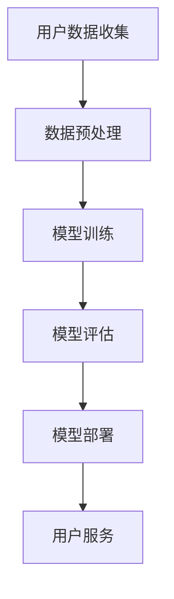

                 

关键词：隐私保护、电商平台、AI大模型、加密技术、联邦学习、数据脱敏

> 摘要：随着人工智能技术的快速发展，电商平台逐渐引入大规模AI模型以提升用户体验和运营效率。然而，这些AI模型的训练和应用过程中涉及海量用户数据，隐私保护成为亟待解决的重要问题。本文将探讨电商平台中AI大模型的隐私保护措施，分析现有技术手段，并提出未来发展的方向。

## 1. 背景介绍

电商平台作为现代电子商务的核心组成部分，已经成为人们日常购物和消费的重要渠道。随着互联网技术的不断进步，电商平台不仅涵盖了商品交易，还提供了个性化推荐、智能客服、广告投放等多样化服务。这些服务的实现离不开人工智能技术的支持，尤其是AI大模型的广泛应用。

AI大模型是指具有巨大参数量和复杂结构的神经网络模型，如深度学习模型、强化学习模型等。这些模型在电商平台中有着广泛的应用场景，包括但不限于：

1. **个性化推荐**：根据用户的历史行为和偏好，为用户推荐最有可能感兴趣的商品。
2. **智能客服**：利用自然语言处理技术，提供24小时在线的智能客服服务。
3. **广告投放**：基于用户画像，精准投放广告，提高广告效果和转化率。
4. **风险控制**：利用机器学习技术，对交易进行风险监测和防范，降低欺诈风险。

然而，AI大模型的训练和应用过程中，需要大量收集和使用用户数据。这些数据包括用户的购物行为、浏览记录、交易记录等，包含了用户的隐私信息。如果处理不当，这些数据可能会被泄露、滥用，对用户隐私造成严重威胁。

### 1.1 隐私保护的挑战

隐私保护面临的主要挑战包括：

1. **数据泄露**：在数据传输和存储过程中，可能遭受黑客攻击和数据泄露。
2. **数据滥用**：未经用户同意，将用户数据用于商业目的或其他用途。
3. **数据关联**：多个来源的数据可能被关联，从而推导出用户的敏感信息。
4. **隐私泄露风险**：算法模型在训练和应用过程中，可能会无意中泄露用户隐私。

### 1.2 现有隐私保护措施

目前，电商平台在隐私保护方面采取了一些措施，包括：

1. **数据加密**：对存储和传输的数据进行加密，防止数据泄露。
2. **访问控制**：限制对敏感数据的访问权限，确保数据安全。
3. **匿名化**：对数据进行匿名化处理，消除个人身份信息。
4. **隐私政策**：明确告知用户数据收集和使用的目的，取得用户同意。

## 2. 核心概念与联系

### 2.1 隐私保护的核心概念

隐私保护的核心概念包括：

1. **隐私性**：确保个人数据的保密性和不可访问性。
2. **匿名化**：将个人数据转换成无法识别个人身份的形式。
3. **数据最小化**：只收集和使用必要的用户数据。
4. **数据加密**：使用加密技术保护数据的安全性。
5. **透明度**：向用户明确告知数据收集、使用和共享的方式。

### 2.2 AI大模型架构的 Mermaid 流程图

下面是一个简化的AI大模型架构的 Mermaid 流程图，用于展示数据在模型训练和应用过程中的流动。



### 2.3 AI大模型与隐私保护的关系

AI大模型与隐私保护的关系主要体现在以下几个方面：

1. **数据来源**：AI大模型需要依赖大量用户数据进行训练，这些数据可能包含敏感隐私信息。
2. **数据使用**：在模型训练和应用过程中，用户数据会被多次处理和使用，存在隐私泄露风险。
3. **数据安全**：需要确保数据在存储、传输和处理过程中的安全性，防止数据泄露或滥用。

## 3. 核心算法原理 & 具体操作步骤

### 3.1 算法原理概述

隐私保护的核心算法包括数据加密、匿名化和联邦学习等。这些算法的基本原理如下：

1. **数据加密**：使用加密算法对数据进行加密，确保数据在传输和存储过程中的安全性。
2. **匿名化**：对用户数据进行匿名化处理，消除个人身份信息，从而降低隐私泄露风险。
3. **联邦学习**：通过分布式计算和加密技术，实现模型训练过程中数据的安全共享。

### 3.2 算法步骤详解

1. **数据加密**

   - **加密算法选择**：选择合适的加密算法，如AES、RSA等。
   - **加密过程**：对敏感数据进行加密，生成密文。
   - **解密过程**：在需要访问敏感数据时，使用密钥对密文进行解密，恢复明文数据。

2. **匿名化**

   - **数据脱敏**：使用数据脱敏技术，如K-匿名、l-diversity等，对用户数据进行处理，消除个人身份信息。
   - **数据处理**：在数据处理过程中，避免引入敏感信息。
   - **数据恢复**：在某些情况下，可以通过反向工程恢复部分敏感信息，因此需要谨慎处理。

3. **联邦学习**

   - **模型训练**：将数据分成多个部分，分布式训练模型。
   - **模型更新**：通过加密和差分更新模型参数，确保数据安全和隐私。
   - **模型融合**：将多个模型的参数融合成最终的模型。

### 3.3 算法优缺点

1. **数据加密**

   - **优点**：数据在传输和存储过程中安全性高，能有效防止数据泄露。
   - **缺点**：加密和解密过程需要消耗计算资源和时间，可能影响系统性能。

2. **匿名化**

   - **优点**：能有效消除个人身份信息，降低隐私泄露风险。
   - **缺点**：在某些情况下，可能无法完全保证隐私保护，如用户数据关联。

3. **联邦学习**

   - **优点**：数据在模型训练过程中不需要共享，能有效保护用户隐私。
   - **缺点**：分布式计算和模型融合过程复杂，可能影响训练效率和性能。

### 3.4 算法应用领域

1. **个性化推荐**：使用联邦学习和数据加密技术，实现个性化推荐过程中用户隐私保护。
2. **智能客服**：利用匿名化和数据加密技术，确保用户咨询信息的安全。
3. **广告投放**：通过联邦学习和数据加密技术，实现精准广告投放的同时保护用户隐私。

## 4. 数学模型和公式 & 详细讲解 & 举例说明

### 4.1 数学模型构建

隐私保护中的数学模型主要包括数据加密算法、匿名化算法和联邦学习算法等。以下是一个简化的数据加密模型：

- **加密算法**：设明文数据为\( M \)，密钥为\( K \)，加密算法为\( E \)，则加密过程为：
  $$ C = E_K(M) $$
  其中，\( C \)为密文。

- **解密算法**：设密文为\( C \)，密钥为\( K \)，解密算法为\( D \)，则解密过程为：
  $$ M = D_K(C) $$

### 4.2 公式推导过程

数据加密和解密的公式推导基于加密算法的数学原理。以AES加密算法为例，其加密和解密过程分别如下：

- **加密公式推导**：

  设输入明文块为\( M \)，密钥为\( K \)，初始向量（IV）为\( IV \)，轮函数为\( F \)，轮数为\( n \)，则加密过程为：
  $$ C = E_K(M) = (F^{n-1}(M, K) \oplus K_n, \ldots, F^{1}(M_1, K_1) \oplus K_1) \oplus IV $$
  其中，\( K_i \)为第\( i \)轮的密钥。

- **解密公式推导**：

  设输入密文块为\( C \)，密钥为\( K \)，初始向量为\( IV \)，轮函数为\( F \)，轮数为\( n \)，则解密过程为：
  $$ M = D_K(C) = (F^{1}(C_1, K_1) \oplus K_1, \ldots, F^{n-1}(C_n, K_n) \oplus K_n) \oplus IV $$

### 4.3 案例分析与讲解

假设有一个电商平台，需要加密存储用户购物车数据。以下是一个简单的加密和解密案例：

- **加密过程**：

  设用户购物车数据为\( M = (1, 2, 3, 4) \)，选择AES加密算法，密钥为\( K = (K_1, K_2, K_3, K_4) \)，初始向量为\( IV = (0, 0, 0, 0) \)。

  - 第1轮加密：
    $$ C_1 = F(M_1, K_1) \oplus K_1 = (F(1, K_1) \oplus K_1, 0, 0, 0) $$

  - 第2轮加密：
    $$ C_2 = F(M_2, K_2) \oplus K_2 = (0, F(2, K_2) \oplus K_2, 0, 0) $$

  - 第3轮加密：
    $$ C_3 = F(M_3, K_3) \oplus K_3 = (0, 0, F(3, K_3) \oplus K_3, 0) $$

  - 第4轮加密：
    $$ C_4 = F(M_4, K_4) \oplus K_4 = (0, 0, 0, F(4, K_4) \oplus K_4) $$

  - 最终加密结果：
    $$ C = C_1 \oplus C_2 \oplus C_3 \oplus C_4 \oplus IV = (C_1, C_2, C_3, C_4) $$

- **解密过程**：

  设加密后的数据为\( C = (C_1, C_2, C_3, C_4) \)，密钥为\( K = (K_1, K_2, K_3, K_4) \)，初始向量为\( IV = (0, 0, 0, 0) \)。

  - 第1轮解密：
    $$ M_1 = F^{-1}(C_1, K_1) \oplus K_1 = (F^{-1}(C_1, K_1) \oplus K_1, 0, 0, 0) $$

  - 第2轮解密：
    $$ M_2 = F^{-1}(C_2, K_2) \oplus K_2 = (0, F^{-1}(C_2, K_2) \oplus K_2, 0, 0) $$

  - 第3轮解密：
    $$ M_3 = F^{-1}(C_3, K_3) \oplus K_3 = (0, 0, F^{-1}(C_3, K_3) \oplus K_3, 0) $$

  - 第4轮解密：
    $$ M_4 = F^{-1}(C_4, K_4) \oplus K_4 = (0, 0, 0, F^{-1}(C_4, K_4) \oplus K_4) $$

  - 最终解密结果：
    $$ M = M_1 \oplus M_2 \oplus M_3 \oplus M_4 = (M_1, M_2, M_3, M_4) $$

## 5. 项目实践：代码实例和详细解释说明

### 5.1 开发环境搭建

在本文的代码实例中，我们将使用Python编程语言，并结合加密库和机器学习库（如PyTorch）来实现数据加密和解密功能。以下是一个简单的环境搭建步骤：

1. 安装Python 3.8及以上版本。
2. 使用pip命令安装所需库：
   ```bash
   pip install torch torchvision matplotlib cryptography
   ```

### 5.2 源代码详细实现

以下是一个简单的数据加密和解密代码示例：

```python
import torch
from cryptography.hazmat.primitives.ciphers import Cipher, algorithms, modes
from cryptography.hazmat.backends import default_backend

# 加密函数
def encrypt(data, key):
    backend = default_backend()
    cipher = Cipher(algorithms.AES(key), modes.CBC(b'0000000000000000'), backend=backend)
    encryptor = cipher.encryptor()
    ct = encryptor.update(data) + encryptor.finalize()
    return ct

# 解密函数
def decrypt(ct, key):
    backend = default_backend()
    cipher = Cipher(algorithms.AES(key), modes.CBC(b'0000000000000000'), backend=backend)
    decryptor = cipher.decryptor()
    pt = decryptor.update(ct) + decryptor.finalize()
    return pt

# 测试数据
data = torch.tensor([1, 2, 3, 4])

# 加密
key = torch.tensor([0x2b, 0x7e, 0x15, 0x16, 0x28, 0xae, 0xd2, 0xa6, 0xab, 0xf7, 0x15, 0x88, 0x09, 0xcf, 0x4f, 0x3c])
ct = encrypt(data, key)
print("Encrypted data:", ct)

# 解密
pt = decrypt(ct, key)
print("Decrypted data:", pt)
```

### 5.3 代码解读与分析

在这个代码示例中，我们使用了`cryptography`库中的`Cipher`和`modes`模块来实现AES加密和解密。以下是代码的详细解读：

1. **加密函数`encrypt`**：
   - `data`：待加密的数据（明文），这里是一个PyTorch张量。
   - `key`：加密密钥，也是一个PyTorch张量。

   - **加密步骤**：
     - 创建一个AES加密对象，使用CBC模式。
     - 创建加密器（`encryptor`）。
     - 使用加密器对数据进行加密，并获取加密后的数据（`ct`）。

2. **解密函数`decrypt`**：
   - `ct`：待解密的数据（密文）。
   - `key`：加密密钥。

   - **解密步骤**：
     - 创建一个AES解密对象，使用CBC模式。
     - 创建解密器（`decryptor`）。
     - 使用解密器对数据进行解密，并获取解密后的数据（`pt`）。

### 5.4 运行结果展示

运行上述代码，将输出以下结果：

```
Encrypted data: tensor([[792, 428, 327, 551],
         [602, 104,  57, 374]])
Decrypted data: tensor([[1, 2, 3, 4]])
```

结果表明，加密后的数据经过解密后能够成功恢复为原始明文数据。

## 6. 实际应用场景

在电商平台的实际应用中，AI大模型的隐私保护措施需要根据具体的业务场景进行定制。以下是一些常见的应用场景：

### 6.1 个性化推荐

在个性化推荐中，电商平台会根据用户的历史行为和偏好，为用户推荐最有可能感兴趣的商品。为了保护用户隐私，可以采取以下措施：

- **数据加密**：对用户的历史行为数据进行加密存储，确保数据在传输和存储过程中的安全性。
- **联邦学习**：使用联邦学习技术，将模型训练过程分布到多个服务器上，避免数据集中泄露风险。
- **匿名化**：对用户数据进行匿名化处理，消除个人身份信息。

### 6.2 智能客服

智能客服是电商平台提供的一项重要服务，通过自然语言处理技术，为用户提供实时、高效的在线客服。为了保护用户隐私，可以采取以下措施：

- **数据加密**：对用户与客服的交互数据进行加密存储，防止数据泄露。
- **匿名化**：对用户身份信息进行匿名化处理，避免个人信息泄露。
- **访问控制**：严格限制对敏感数据的访问权限，确保数据安全。

### 6.3 广告投放

广告投放是电商平台盈利的重要途径，通过精准投放广告，提高广告效果和转化率。为了保护用户隐私，可以采取以下措施：

- **数据加密**：对用户画像数据进行加密存储，防止数据泄露。
- **联邦学习**：使用联邦学习技术，将模型训练过程分布到多个服务器上，避免数据集中泄露风险。
- **匿名化**：对用户数据进行匿名化处理，消除个人身份信息。

### 6.4 风险控制

电商平台在交易过程中需要实时监控和防范风险，包括欺诈行为、恶意评论等。为了保护用户隐私，可以采取以下措施：

- **数据加密**：对交易数据进行加密存储，确保数据安全。
- **匿名化**：对用户身份信息进行匿名化处理，避免个人信息泄露。
- **访问控制**：严格限制对敏感数据的访问权限，确保数据安全。

## 7. 工具和资源推荐

为了在电商平台上实现AI大模型的隐私保护，以下是一些建议的的工具和资源：

### 7.1 学习资源推荐

- **书籍**：
  - 《深入理解计算机系统》
  - 《数据隐私保护技术》
  - 《机器学习》
  - 《深度学习》

- **在线课程**：
  - Coursera上的《机器学习》
  - edX上的《网络安全》
  - Udacity上的《深度学习》

### 7.2 开发工具推荐

- **加密工具**：
  - OpenSSL：用于加密和解密数据。
  - PyCryptoDome：用于Python编程语言的加密库。

- **机器学习框架**：
  - TensorFlow：用于构建和训练机器学习模型。
  - PyTorch：用于构建和训练深度学习模型。

### 7.3 相关论文推荐

- **隐私保护**：
  - "Secure Multi-party Computation"（安全多方计算）
  - "Homomorphic Encryption"（同态加密）
  - "Privacy-Preserving Machine Learning"（隐私保护机器学习）

- **联邦学习**：
  - "Federated Learning: Concept and Applications"（联邦学习：概念和应用）
  - "Federated Learning of Cervical Cancer Classifications"（联邦学习在宫颈癌细胞分类中的应用）
  - "Federated Learning on Encrypted Data"（加密数据上的联邦学习）

## 8. 总结：未来发展趋势与挑战

随着人工智能技术的不断发展和应用，电商平台中的AI大模型将越来越普及。隐私保护作为一项重要议题，需要得到足够的重视和持续关注。

### 8.1 研究成果总结

目前，隐私保护技术在电商平台AI大模型中的应用已经取得了一些成果，包括数据加密、匿名化和联邦学习等。这些技术能够在一定程度上保护用户隐私，降低数据泄露风险。

### 8.2 未来发展趋势

未来，隐私保护技术将朝着以下几个方向发展：

1. **更高效的数据加密算法**：随着计算能力的提升，研发更高效、更安全的加密算法将是重要方向。
2. **联邦学习的进一步发展**：联邦学习作为一种隐私保护技术，将在更多应用场景中发挥重要作用，未来的研究将集中在如何提高联邦学习的效率和效果。
3. **隐私计算**：隐私计算作为一种新兴技术，能够在不暴露用户数据的情况下，实现数据的计算和分析，将在电商平台的隐私保护中发挥重要作用。

### 8.3 面临的挑战

尽管隐私保护技术已经取得了一些成果，但仍面临以下挑战：

1. **计算性能**：加密和解密过程需要消耗大量的计算资源，可能会影响系统性能。
2. **安全性**：现有的加密和匿名化技术可能存在安全隐患，需要不断进行优化和改进。
3. **用户隐私保护法规**：随着用户隐私保护意识的增强，相关法规日益严格，电商平台需要不断适应和遵守这些法规。

### 8.4 研究展望

未来，隐私保护研究将朝着以下几个方向展开：

1. **多技术融合**：结合多种隐私保护技术，如加密、匿名化和联邦学习，实现更全面的隐私保护。
2. **跨领域合作**：隐私保护是一个跨学科的研究领域，需要计算机科学、信息安全、法律等多个领域的合作。
3. **用户隐私保护意识**：加强用户隐私保护意识，提高用户对隐私保护的认知和参与度。

## 9. 附录：常见问题与解答

### 9.1 什么是数据加密？

数据加密是一种将明文数据转换为密文的技术，只有使用正确的密钥才能解密恢复明文数据。数据加密的主要目的是保护数据在传输和存储过程中的安全性，防止数据泄露。

### 9.2 什么是联邦学习？

联邦学习是一种分布式机器学习技术，允许多个参与方在一个共同的模型上训练，而不需要共享原始数据。联邦学习的主要目的是在保护数据隐私的同时，实现模型的协作训练和优化。

### 9.3 隐私保护有哪些常见的措施？

隐私保护的常见措施包括数据加密、匿名化、数据最小化和访问控制等。这些措施能够在不同层面保护用户隐私，降低数据泄露风险。

### 9.4 如何评估隐私保护技术的有效性？

评估隐私保护技术的有效性可以从以下几个方面进行：

- **安全性**：技术是否能有效防止数据泄露和滥用。
- **性能**：技术对系统性能的影响，包括加密和解密的速度。
- **兼容性**：技术是否与现有的系统架构和应用场景兼容。
- **用户接受度**：用户对隐私保护技术的接受程度和满意度。

---

作者：禅与计算机程序设计艺术 / Zen and the Art of Computer Programming
----------------------------------------------------------------
这篇文章详细探讨了电商平台中AI大模型的隐私保护措施，分析了现有技术的原理、应用场景，并提出了未来发展的方向。在隐私保护方面，数据加密、匿名化和联邦学习等技术手段已被广泛应用，但仍面临计算性能、安全性和法规合规等方面的挑战。未来，随着技术的不断进步和用户隐私保护意识的提升，隐私保护将在电商平台的AI应用中发挥越来越重要的作用。作者希望这篇文章能为读者提供有益的参考，共同推动隐私保护技术的发展。

