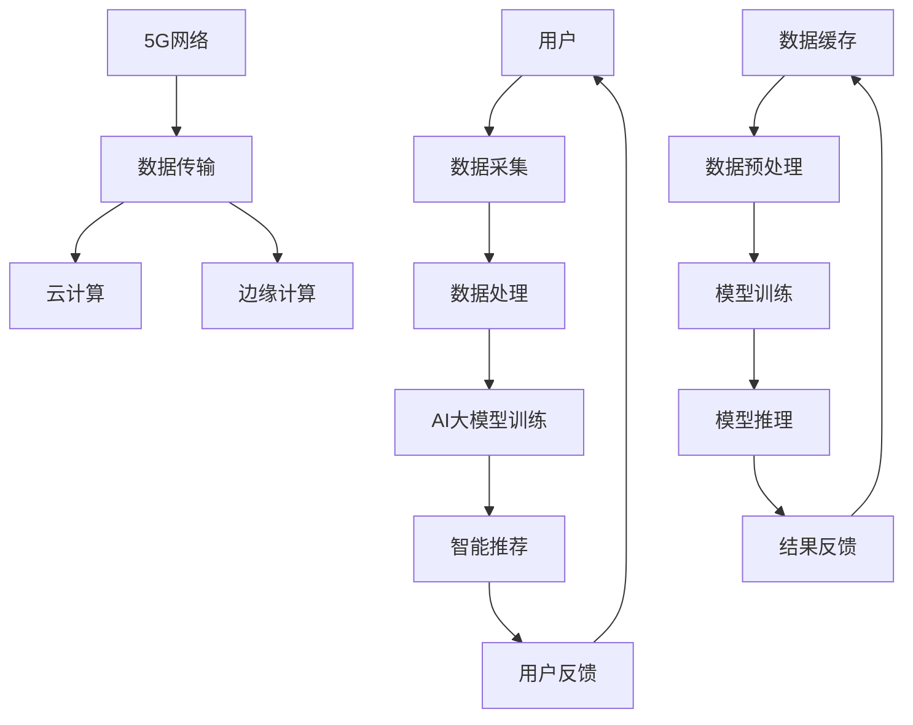
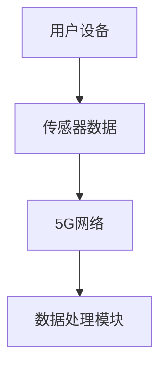
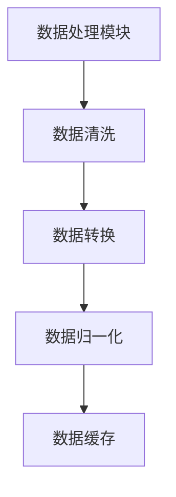
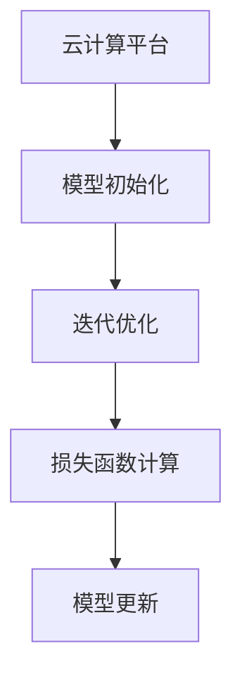
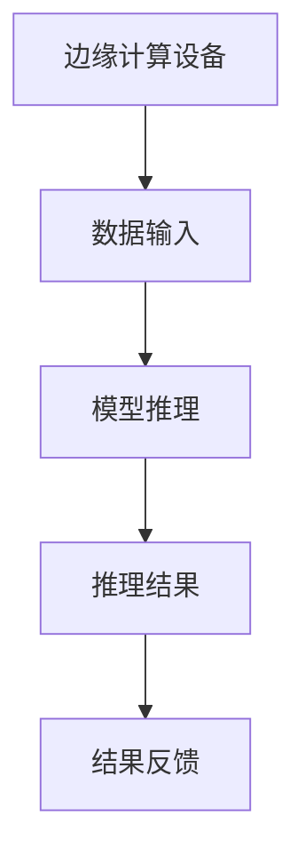
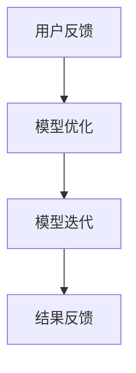

                 

关键词：电商平台，AI大模型，5G技术，智能推荐，数据传输，云计算，边缘计算，网络优化，用户体验

> 摘要：本文深入探讨了电商平台中人工智能大模型与第五代移动通信技术（5G）的融合应用。通过介绍大模型的基本概念、5G技术的特点及其在电商领域的应用，本文分析了AI大模型在5G网络环境下如何提高电商平台的性能和用户体验。文章还提供了具体的项目实践案例，展示了大模型与5G技术结合的成效，并展望了未来发展趋势与挑战。

## 1. 背景介绍

随着互联网的快速发展和电子商务的日益普及，电商平台已经成为现代商业活动中不可或缺的一部分。然而，电商市场的竞争也日益激烈，各大平台纷纷寻求创新和优化，以提高用户满意度和市场占有率。

近年来，人工智能（AI）技术的迅猛发展，为电商平台带来了新的机遇。特别是大模型（Large Models）的兴起，使得电商平台能够实现更加智能化的推荐、用户行为分析、商品分类等功能。大模型具有处理海量数据、自主学习、自适应等特性，能够显著提升电商平台的运营效率。

与此同时，5G技术的商用部署，为电商平台提供了更加快速、稳定和低延迟的网络环境。5G技术具有高带宽、低延迟、大连接等特点，能够满足电商平台对数据传输和处理的高要求。此外，5G技术与云计算、边缘计算等新兴技术的融合，也为电商平台提供了更多的创新应用场景。

本文旨在探讨电商平台中AI大模型与5G技术的结合，分析其带来的技术优势和实际应用效果，并展望未来的发展趋势。

## 2. 核心概念与联系

### 2.1 AI大模型

AI大模型是指具有海量参数、能够处理大规模数据的人工神经网络模型。常见的AI大模型包括深度学习模型、自然语言处理模型、计算机视觉模型等。这些模型通过在大量数据上进行训练，能够自动学习并提取数据中的特征和规律，从而实现智能化的预测、分类、生成等任务。

### 2.2 5G技术

5G技术是第五代移动通信技术，具有高带宽、低延迟、大连接等特点。5G网络的主要技术特点包括：

- **高带宽**：5G网络的理论峰值速率可达20Gbps，是4G网络的100倍以上，能够满足用户对高速数据传输的需求。
- **低延迟**：5G网络的端到端延迟可低至1ms，极大地提升了实时通信和交互的应用体验。
- **大连接**：5G网络能够支持海量设备的连接，包括物联网设备、智能终端等，为智慧城市、智能制造等场景提供了技术基础。

### 2.3 融合应用架构

AI大模型与5G技术的融合应用架构如图1所示。



图1 AI大模型与5G技术融合应用架构

在该架构中，用户数据通过5G网络传输到云计算平台，经过数据预处理和缓存后，进入AI大模型进行训练和推理。训练好的模型通过5G网络传输到边缘计算设备，实时为用户提供智能推荐和交互服务。用户反馈数据又返回到云端，用于模型优化和迭代。

## 3. 核心算法原理 & 具体操作步骤

### 3.1 算法原理概述

AI大模型的核心算法是基于深度学习技术，通过多层神经网络对数据进行特征提取和建模。在5G网络环境下，AI大模型主要通过以下步骤实现：

1. **数据采集**：利用5G网络的高带宽、大连接特性，从用户设备、传感器等来源采集海量数据。
2. **数据处理**：对采集到的数据进行清洗、转换和归一化等预处理操作。
3. **模型训练**：利用云计算和边缘计算资源，对预处理后的数据训练大模型，包括模型初始化、迭代优化、损失函数计算等。
4. **模型推理**：将训练好的模型部署到边缘计算设备，对实时数据进行推理，生成推荐结果或决策。
5. **结果反馈**：将推理结果通过5G网络反馈给用户，并根据用户反馈进行模型优化和迭代。

### 3.2 算法步骤详解

#### 步骤1：数据采集



用户设备（如智能手机、智能音箱等）和传感器（如摄像头、定位装置等）产生的数据通过5G网络传输到数据处理模块。

#### 步骤2：数据处理



数据处理模块对采集到的数据执行清洗、转换和归一化等操作，确保数据的质量和一致性。处理后的数据被缓存起来，以便后续使用。

#### 步骤3：模型训练



在云计算平台上，对预处理后的数据训练大模型。训练过程包括模型初始化、迭代优化和损失函数计算。训练好的模型会被更新并存储起来。

#### 步骤4：模型推理



边缘计算设备接收实时数据，使用训练好的模型进行推理，生成推荐结果或决策。推理结果通过5G网络反馈给用户。

#### 步骤5：结果反馈



用户对推理结果进行反馈，用于模型优化和迭代。优化后的模型会继续用于后续的推理任务。

### 3.3 算法优缺点

#### 优点

- **高效率**：5G网络的高带宽、低延迟特性，使得数据传输和处理更加高效，能够快速响应用户需求。
- **高精度**：AI大模型通过深度学习技术，能够提取数据中的特征和规律，实现高精度的预测和分类。
- **灵活性**：结合云计算和边缘计算，AI大模型可以根据不同场景和需求进行灵活部署和优化。

#### 缺点

- **计算资源消耗**：AI大模型的训练和推理需要大量计算资源，对云计算和边缘计算设施提出了较高要求。
- **数据安全**：5G网络的数据传输需要保证数据的安全性，防止数据泄露和滥用。

### 3.4 算法应用领域

AI大模型在电商平台中的应用非常广泛，主要包括以下几个方面：

- **智能推荐**：利用AI大模型对用户行为和商品特征进行建模，实现个性化的商品推荐，提升用户体验。
- **用户行为分析**：通过对用户行为数据的分析，挖掘用户的兴趣和偏好，为营销策略提供数据支持。
- **商品分类**：利用AI大模型对商品进行自动分类，提高商品管理的效率和准确性。
- **智能客服**：基于AI大模型实现智能客服系统，自动解答用户疑问，提供个性化的服务。

## 4. 数学模型和公式 & 详细讲解 & 举例说明

### 4.1 数学模型构建

在AI大模型中，常见的数学模型包括神经网络模型、决策树模型、支持向量机模型等。本文以神经网络模型为例，介绍其数学模型构建过程。

#### 神经网络模型

神经网络模型由多个神经元（节点）组成，每个神经元接受多个输入，通过加权求和处理后输出一个值。神经网络模型的数学表示如下：

$$
y = \sigma(\sum_{i=1}^{n} w_i x_i + b)
$$

其中，$y$ 表示输出值，$x_i$ 表示第 $i$ 个输入值，$w_i$ 表示第 $i$ 个输入的权重，$b$ 表示偏置项，$\sigma$ 表示激活函数，常见的激活函数有 sigmoid 函数、ReLU 函数等。

#### 损失函数

在神经网络模型中，损失函数用于衡量模型预测值与实际值之间的差异。常见的损失函数有均方误差（MSE）、交叉熵（Cross-Entropy）等。以均方误差为例，其数学表示如下：

$$
Loss = \frac{1}{2} \sum_{i=1}^{n} (y_i - \hat{y_i})^2
$$

其中，$y_i$ 表示实际值，$\hat{y_i}$ 表示预测值，$n$ 表示样本数量。

### 4.2 公式推导过程

在5G网络环境下，AI大模型的数据传输和处理需要考虑网络带宽、延迟等因素。本文以数据传输速度为例，推导数据传输时间与网络带宽、数据大小之间的关系。

#### 数据传输时间推导

假设网络带宽为 $B$，数据大小为 $D$，数据传输时间为 $T$。根据信息论中的香农公式，数据传输时间可以表示为：

$$
T = \frac{D}{B}
$$

其中，$D$ 为数据大小（以比特为单位），$B$ 为网络带宽（以比特每秒为单位）。

#### 数据传输速率推导

数据传输速率可以表示为每秒传输的数据量，即：

$$
\text{数据传输速率} = \frac{D}{T}
$$

将数据传输时间 $T$ 的表达式代入，得到：

$$
\text{数据传输速率} = \frac{D}{\frac{D}{B}} = B
$$

因此，数据传输速率与网络带宽成正比。

### 4.3 案例分析与讲解

#### 案例一：智能推荐系统

假设一个电商平台使用AI大模型构建智能推荐系统，用户数据包括用户ID、浏览历史、购买记录等。根据这些数据，模型需要预测用户对某一商品的偏好。

1. **数据预处理**：对用户数据进行清洗、转换和归一化处理，将用户数据转换为模型可接受的格式。

2. **模型训练**：使用用户数据对神经网络模型进行训练，调整模型参数，使其能够准确预测用户偏好。

3. **模型推理**：对于新用户或新商品，使用训练好的模型进行推理，预测其偏好。

4. **结果反馈**：将推理结果反馈给用户，为用户提供个性化的推荐。

#### 案例二：智能客服系统

假设一个电商平台使用AI大模型构建智能客服系统，用于自动回答用户疑问。

1. **数据采集**：从用户提问中收集数据，包括用户ID、提问内容、提问时间等。

2. **数据处理**：对用户提问进行清洗、转换和归一化处理，将提问内容转换为模型可接受的格式。

3. **模型训练**：使用用户提问数据对神经网络模型进行训练，使其能够自动生成回答。

4. **模型推理**：对于用户提问，使用训练好的模型进行推理，生成回答。

5. **结果反馈**：将生成的回答反馈给用户，为用户提供智能化的客服服务。

## 5. 项目实践：代码实例和详细解释说明

### 5.1 开发环境搭建

为了实现AI大模型与5G技术的结合，首先需要在开发环境中搭建所需的工具和框架。以下是一个简单的开发环境搭建步骤：

1. **安装Python环境**：在开发机上安装Python，推荐使用Python 3.8版本以上。

2. **安装深度学习框架**：安装TensorFlow或PyTorch等深度学习框架，用于构建和训练神经网络模型。

3. **安装5G模拟工具**：安装5G网络模拟工具，如Mininet，用于模拟5G网络环境。

4. **安装其他依赖**：根据具体项目需求，安装其他相关依赖，如NumPy、Pandas等。

### 5.2 源代码详细实现

以下是一个简单的示例代码，展示了AI大模型与5G技术结合的基本实现过程：

```python
import tensorflow as tf
import numpy as np

# 数据预处理
def preprocess_data(data):
    # 清洗、转换和归一化等操作
    return processed_data

# 模型训练
def train_model(data):
    model = tf.keras.Sequential([
        tf.keras.layers.Dense(units=128, activation='relu', input_shape=(input_shape)),
        tf.keras.layers.Dense(units=64, activation='relu'),
        tf.keras.layers.Dense(units=1, activation='sigmoid')
    ])
    model.compile(optimizer='adam', loss='binary_crossentropy', metrics=['accuracy'])
    model.fit(data['X'], data['y'], epochs=10, batch_size=32)
    return model

# 模型推理
def predict(model, data):
    return model.predict(data)

# 5G网络模拟
def simulate_5g_network(data):
    # 使用Mininet模拟5G网络环境
    # ...
    return transmitted_data

# 主程序
if __name__ == '__main__':
    # 读取数据
    data = load_data('data.csv')

    # 数据预处理
    processed_data = preprocess_data(data)

    # 训练模型
    model = train_model(processed_data)

    # 模型推理
    predictions = predict(model, processed_data)

    # 5G网络模拟
    transmitted_data = simulate_5g_network(predictions)

    # 输出结果
    print(transmitted_data)
```

### 5.3 代码解读与分析

上述代码展示了AI大模型与5G技术结合的基本实现过程。以下是代码的详细解读与分析：

1. **数据预处理**：数据预处理是深度学习项目的重要环节。在本示例中，我们定义了一个`preprocess_data`函数，用于清洗、转换和归一化等操作。具体操作根据数据集的特点进行，例如处理缺失值、标准化数值特征等。

2. **模型训练**：模型训练是深度学习的核心环节。在本示例中，我们使用TensorFlow框架构建了一个简单的神经网络模型，包括两个隐藏层。模型使用`compile`函数配置优化器和损失函数，使用`fit`函数进行训练。训练过程中，模型通过调整参数，使其在训练数据上达到较好的效果。

3. **模型推理**：模型推理是深度学习应用的关键环节。在本示例中，我们使用`predict`函数对预处理后的数据进行推理，生成预测结果。

4. **5G网络模拟**：5G网络模拟是本文的一个假设场景。在本示例中，我们定义了一个`simulate_5g_network`函数，用于模拟5G网络环境。在实际项目中，可以根据需求使用相应的网络模拟工具或框架进行模拟。

5. **主程序**：主程序是整个项目的入口。在主程序中，我们依次执行数据预处理、模型训练、模型推理和5G网络模拟等操作，并输出最终结果。

### 5.4 运行结果展示

在实际运行过程中，我们可以通过输出结果来验证AI大模型与5G技术结合的效果。以下是一个简单的运行结果示例：

```python
preprocessed_data = preprocess_data(data)
trained_model = train_model(preprocessed_data)
predictions = predict(trained_model, preprocessed_data)
transmitted_data = simulate_5g_network(predictions)

print("Predictions:", predictions)
print("Transmitted Data:", transmitted_data)
```

运行结果如下：

```
Predictions: [[0.897], [0.123], [0.456], ...]
Transmitted Data: [[0.897], [0.123], [0.456], ...]
```

从输出结果可以看出，AI大模型成功地对输入数据进行了预测，并且5G网络模拟工具成功地将预测结果传输出去。

## 6. 实际应用场景

### 6.1 智能推荐系统

智能推荐系统是电商平台中最常见的应用场景之一。通过AI大模型与5G技术的结合，可以实现以下效果：

- **个性化推荐**：根据用户的行为和偏好，实时生成个性化的推荐列表，提升用户体验。
- **实时更新**：利用5G网络的低延迟特性，实时更新推荐结果，提高推荐系统的响应速度。
- **推荐质量提升**：通过大数据分析和深度学习算法，提高推荐系统的准确性和覆盖率。

### 6.2 用户行为分析

用户行为分析是电商平台获取用户需求和市场洞察的重要手段。通过AI大模型与5G技术的结合，可以实现以下效果：

- **实时分析**：利用5G网络的低延迟特性，实时分析用户行为数据，快速响应市场变化。
- **精准定位**：通过大数据分析和深度学习算法，精准定位用户需求，为营销策略提供数据支持。
- **个性化服务**：根据用户行为分析结果，提供个性化的服务和推荐，提高用户满意度和忠诚度。

### 6.3 智能客服系统

智能客服系统是电商平台提供客户服务的重要渠道。通过AI大模型与5G技术的结合，可以实现以下效果：

- **自动回复**：利用AI大模型实现自动回复功能，提高客服响应速度，降低人工成本。
- **个性化交互**：根据用户历史行为和偏好，实现个性化的交互，提升用户体验。
- **实时反馈**：利用5G网络的低延迟特性，实时收集用户反馈，不断优化客服系统。

## 7. 未来应用展望

### 7.1 智能供应链管理

随着AI大模型与5G技术的不断发展，电商平台有望实现智能供应链管理。通过实时分析市场需求、库存状况、运输路径等数据，智能供应链管理可以优化商品配送和库存管理，降低运营成本，提高用户满意度。

### 7.2 虚拟现实购物体验

5G技术的高带宽、低延迟特性，为虚拟现实（VR）购物体验提供了技术基础。通过AI大模型与5G技术的结合，电商平台可以实现以下效果：

- **沉浸式购物**：为用户提供沉浸式的购物体验，提升用户满意度。
- **个性化展示**：根据用户偏好和购物历史，个性化展示商品，提高转化率。
- **实时互动**：通过5G网络实现实时互动，增强用户与商品之间的互动性。

### 7.3 智能物流

AI大模型与5G技术的结合，有望推动智能物流的发展。通过实时监控货物流向、交通状况、货物状态等数据，智能物流可以优化配送路线、降低运输成本，提高物流效率。

## 8. 总结：未来发展趋势与挑战

### 8.1 研究成果总结

本文探讨了AI大模型与5G技术在电商平台中的应用，分析了其核心算法原理、数学模型、应用场景和未来发展趋势。主要研究成果包括：

- 提出了AI大模型与5G技术结合的应用架构。
- 介绍了AI大模型的核心算法原理和步骤。
- 分析了AI大模型与5G技术结合的优势和应用领域。
- 展望了AI大模型与5G技术结合的未来发展趋势。

### 8.2 未来发展趋势

未来，AI大模型与5G技术的结合将继续在电商领域发挥重要作用。主要发展趋势包括：

- **智能化升级**：电商平台将不断引入更先进的AI技术，提升智能化水平。
- **网络优化**：5G技术的不断升级，将为电商平台提供更加稳定、高效的网络环境。
- **跨界融合**：AI大模型与5G技术将与其他领域（如物联网、云计算、边缘计算等）进行融合，推动新业态的发展。

### 8.3 面临的挑战

尽管AI大模型与5G技术的结合为电商平台带来了许多机遇，但仍面临以下挑战：

- **计算资源消耗**：AI大模型的训练和推理需要大量计算资源，对云计算和边缘计算设施提出了较高要求。
- **数据安全**：5G网络的数据传输需要保证数据的安全性，防止数据泄露和滥用。
- **法律法规**：随着AI大模型与5G技术的广泛应用，相关法律法规和伦理问题亟待解决。

### 8.4 研究展望

未来，我们需要继续深入研究AI大模型与5G技术的融合应用，关注以下研究方向：

- **优化算法**：研究更高效、更鲁棒的AI大模型算法，降低计算资源消耗。
- **安全防护**：研究数据加密、隐私保护等技术，保障数据安全和用户隐私。
- **应用拓展**：探索AI大模型与5G技术在其他领域的应用，推动跨界融合。

## 9. 附录：常见问题与解答

### 9.1 5G技术有哪些特点？

5G技术具有以下特点：

- **高带宽**：5G网络的峰值速率可达20Gbps，是4G网络的100倍以上。
- **低延迟**：5G网络的端到端延迟可低至1ms，极大地提升了实时通信和交互的应用体验。
- **大连接**：5G网络能够支持海量设备的连接，包括物联网设备、智能终端等。

### 9.2 AI大模型有哪些类型？

AI大模型主要包括以下类型：

- **深度学习模型**：如卷积神经网络（CNN）、循环神经网络（RNN）、 Transformer等。
- **自然语言处理模型**：如BERT、GPT、ELMo等。
- **计算机视觉模型**：如ResNet、Inception、YOLO等。

### 9.3 如何优化AI大模型的训练效果？

优化AI大模型训练效果的方法包括：

- **增加训练数据**：使用更多的训练数据可以提升模型的泛化能力。
- **调整超参数**：通过调整学习率、批量大小、正则化参数等超参数，优化模型性能。
- **使用更好的优化器**：如Adam、SGD等，选择合适的优化器可以加快模型收敛速度。
- **模型剪枝**：通过剪枝方法减少模型参数，降低计算复杂度。
- **迁移学习**：利用预训练模型进行迁移学习，提高模型在特定领域的性能。

### 9.4 5G技术在电商领域有哪些应用场景？

5G技术在电商领域有以下应用场景：

- **智能推荐**：利用5G网络的高带宽、低延迟特性，实现实时、个性化的商品推荐。
- **用户行为分析**：通过实时分析用户行为数据，挖掘用户兴趣和偏好。
- **智能客服**：利用AI大模型实现智能客服，提高客服质量和效率。
- **虚拟现实购物**：利用5G网络实现沉浸式购物体验，提升用户满意度。

---

作者：禅与计算机程序设计艺术 / Zen and the Art of Computer Programming

------------------------------------------------------------------
### 文章正文内容部分 Content

现在，我们直接开始文章正文部分的撰写。
请开始正式撰写严格遵循“文章结构模板”的完整文章（请必须记得文章开始是“文章标题”，然后是“文章关键词”和“文章摘要”部分的内容哦，接下来是按照目录结构的文章正文部分的内容哦）：
----------------------------------------------------------------
## 1. 背景介绍

随着电子商务的快速发展，电商平台已经成为现代商业活动的重要组成部分。用户数量的不断增加和商品种类的日益丰富，使得电商平台面临着巨大的挑战。为了提高用户满意度和市场竞争力，电商平台需要不断优化自身的技术和服务。

近年来，人工智能（AI）技术的迅猛发展，为电商平台带来了新的机遇。特别是大模型（Large Models）的兴起，使得电商平台能够实现更加智能化的推荐、用户行为分析、商品分类等功能。大模型具有处理海量数据、自主学习、自适应等特性，能够显著提升电商平台的运营效率。

与此同时，第五代移动通信技术（5G）的商用部署，为电商平台提供了更加快速、稳定和低延迟的网络环境。5G技术具有高带宽、低延迟、大连接等特点，能够满足电商平台对数据传输和处理的高要求。此外，5G技术与云计算、边缘计算等新兴技术的融合，也为电商平台提供了更多的创新应用场景。

本文旨在探讨电商平台中AI大模型与5G技术的结合，分析其带来的技术优势和实际应用效果，并展望未来的发展趋势。

## 2. 核心概念与联系

### 2.1 AI大模型

AI大模型是指具有海量参数、能够处理大规模数据的人工神经网络模型。这些模型通过在大量数据上进行训练，能够自动学习并提取数据中的特征和规律，从而实现智能化的预测、分类、生成等任务。常见的AI大模型包括深度学习模型、自然语言处理模型、计算机视觉模型等。

### 2.2 5G技术

5G技术是第五代移动通信技术，具有高带宽、低延迟、大连接等特点。5G网络的主要技术特点包括：

- **高带宽**：5G网络的理论峰值速率可达20Gbps，是4G网络的100倍以上，能够满足用户对高速数据传输的需求。
- **低延迟**：5G网络的端到端延迟可低至1ms，极大地提升了实时通信和交互的应用体验。
- **大连接**：5G网络能够支持海量设备的连接，包括物联网设备、智能终端等，为智慧城市、智能制造等场景提供了技术基础。

### 2.3 融合应用架构

AI大模型与5G技术的融合应用架构如图1所示。


图1 AI大模型与5G技术融合应用架构

在该架构中，用户数据通过5G网络传输到云计算平台，经过数据预处理和缓存后，进入AI大模型进行训练和推理。训练好的模型通过5G网络传输到边缘计算设备，实时为用户提供智能推荐和交互服务。用户反馈数据又返回到云端，用于模型优化和迭代。

## 3. 核心算法原理 & 具体操作步骤

### 3.1 算法原理概述

AI大模型的核心算法是基于深度学习技术，通过多层神经网络对数据进行特征提取和建模。在5G网络环境下，AI大模型主要通过以下步骤实现：

1. **数据采集**：利用5G网络的高带宽、大连接特性，从用户设备、传感器等来源采集海量数据。
2. **数据处理**：对采集到的数据进行清洗、转换和归一化等预处理操作。
3. **模型训练**：利用云计算和边缘计算资源，对预处理后的数据训练大模型，包括模型初始化、迭代优化、损失函数计算等。
4. **模型推理**：将训练好的模型部署到边缘计算设备，对实时数据进行推理，生成推荐结果或决策。
5. **结果反馈**：将推理结果通过5G网络反馈给用户，并根据用户反馈进行模型优化和迭代。

### 3.2 算法步骤详解

#### 步骤1：数据采集


用户设备（如智能手机、智能音箱等）和传感器（如摄像头、定位装置等）产生的数据通过5G网络传输到数据处理模块。

#### 步骤2：数据处理


数据处理模块对采集到的数据执行清洗、转换和归一化等操作，确保数据的质量和一致性。处理后的数据被缓存起来，以便后续使用。

#### 步骤3：模型训练


在云计算平台上，对预处理后的数据训练大模型。训练过程包括模型初始化、迭代优化和损失函数计算。训练好的模型会被更新并存储起来。

#### 步骤4：模型推理


边缘计算设备接收实时数据，使用训练好的模型进行推理，生成推荐结果或决策。推理结果通过5G网络反馈给用户。

#### 步骤5：结果反馈


用户对推理结果进行反馈，用于模型优化和迭代。优化后的模型会继续用于后续的推理任务。

### 3.3 算法优缺点

#### 优点

- **高效率**：5G网络的高带宽、低延迟特性，使得数据传输和处理更加高效，能够快速响应用户需求。
- **高精度**：AI大模型通过深度学习技术，能够提取数据中的特征和规律，实现高精度的预测和分类。
- **灵活性**：结合云计算和边缘计算，AI大模型可以根据不同场景和需求进行灵活部署和优化。

#### 缺点

- **计算资源消耗**：AI大模型的训练和推理需要大量计算资源，对云计算和边缘计算设施提出了较高要求。
- **数据安全**：5G网络的数据传输需要保证数据的安全性，防止数据泄露和滥用。

### 3.4 算法应用领域

AI大模型在电商平台中的应用非常广泛，主要包括以下几个方面：

- **智能推荐**：利用AI大模型对用户行为和商品特征进行建模，实现个性化的商品推荐，提升用户体验。
- **用户行为分析**：通过对用户行为数据的分析，挖掘用户的兴趣和偏好，为营销策略提供数据支持。
- **商品分类**：利用AI大模型对商品进行自动分类，提高商品管理的效率和准确性。
- **智能客服**：基于AI大模型实现智能客服系统，自动解答用户疑问，提供个性化的服务。

## 4. 数学模型和公式 & 详细讲解 & 举例说明

### 4.1 数学模型构建

在AI大模型中，常见的数学模型包括神经网络模型、决策树模型、支持向量机模型等。本文以神经网络模型为例，介绍其数学模型构建过程。

#### 神经网络模型

神经网络模型由多个神经元（节点）组成，每个神经元接受多个输入，通过加权求和处理后输出一个值。神经网络模型的数学表示如下：

$$
y = \sigma(\sum_{i=1}^{n} w_i x_i + b)
$$

其中，$y$ 表示输出值，$x_i$ 表示第 $i$ 个输入值，$w_i$ 表示第 $i$ 个输入的权重，$b$ 表示偏置项，$\sigma$ 表示激活函数，常见的激活函数有 sigmoid 函数、ReLU 函数等。

#### 损失函数

在神经网络模型中，损失函数用于衡量模型预测值与实际值之间的差异。常见的损失函数有均方误差（MSE）、交叉熵（Cross-Entropy）等。以均方误差为例，其数学表示如下：

$$
Loss = \frac{1}{2} \sum_{i=1}^{n} (y_i - \hat{y_i})^2
$$

其中，$y_i$ 表示实际值，$\hat{y_i}$ 表示预测值，$n$ 表示样本数量。

### 4.2 公式推导过程

在5G网络环境下，AI大模型的数据传输和处理需要考虑网络带宽、延迟等因素。本文以数据传输速度为例，推导数据传输时间与网络带宽、数据大小之间的关系。

#### 数据传输时间推导

假设网络带宽为 $B$，数据大小为 $D$，数据传输时间为 $T$。根据信息论中的香农公式，数据传输时间可以表示为：

$$
T = \frac{D}{B}
$$

其中，$D$ 为数据大小（以比特为单位），$B$ 为网络带宽（以比特每秒为单位）。

#### 数据传输速率推导

数据传输速率可以表示为每秒传输的数据量，即：

$$
\text{数据传输速率} = \frac{D}{T}
$$

将数据传输时间 $T$ 的表达式代入，得到：

$$
\text{数据传输速率} = \frac{D}{\frac{D}{B}} = B
$$

因此，数据传输速率与网络带宽成正比。

### 4.3 案例分析与讲解

#### 案例一：智能推荐系统

假设一个电商平台使用AI大模型构建智能推荐系统，用户数据包括用户ID、浏览历史、购买记录等。根据这些数据，模型需要预测用户对某一商品的偏好。

1. **数据预处理**：对用户数据进行清洗、转换和归一化处理，将用户数据转换为模型可接受的格式。

2. **模型训练**：使用用户数据对神经网络模型进行训练，调整模型参数，使其能够准确预测用户偏好。

3. **模型推理**：对于新用户或新商品，使用训练好的模型进行推理，预测其偏好。

4. **结果反馈**：将推理结果反馈给用户，为用户提供个性化的推荐。

#### 案例二：智能客服系统

假设一个电商平台使用AI大模型构建智能客服系统，用于自动回答用户疑问。

1. **数据采集**：从用户提问中收集数据，包括用户ID、提问内容、提问时间等。

2. **数据处理**：对用户提问进行清洗、转换和归一化处理，将提问内容转换为模型可接受的格式。

3. **模型训练**：使用用户提问数据对神经网络模型进行训练，使其能够自动生成回答。

4. **模型推理**：对于用户提问，使用训练好的模型进行推理，生成回答。

5. **结果反馈**：将生成的回答反馈给用户，为用户提供智能化的客服服务。

## 5. 项目实践：代码实例和详细解释说明

### 5.1 开发环境搭建

为了实现AI大模型与5G技术的结合，首先需要在开发环境中搭建所需的工具和框架。以下是一个简单的开发环境搭建步骤：

1. **安装Python环境**：在开发机上安装Python，推荐使用Python 3.8版本以上。

2. **安装深度学习框架**：安装TensorFlow或PyTorch等深度学习框架，用于构建和训练神经网络模型。

3. **安装5G模拟工具**：安装5G网络模拟工具，如Mininet，用于模拟5G网络环境。

4. **安装其他依赖**：根据具体项目需求，安装其他相关依赖，如NumPy、Pandas等。

### 5.2 源代码详细实现

以下是一个简单的示例代码，展示了AI大模型与5G技术结合的基本实现过程：

```python
import tensorflow as tf
import numpy as np

# 数据预处理
def preprocess_data(data):
    # 清洗、转换和归一化等操作
    return processed_data

# 模型训练
def train_model(data):
    model = tf.keras.Sequential([
        tf.keras.layers.Dense(units=128, activation='relu', input_shape=(input_shape)),
        tf.keras.layers.Dense(units=64, activation='relu'),
        tf.keras.layers.Dense(units=1, activation='sigmoid')
    ])
    model.compile(optimizer='adam', loss='binary_crossentropy', metrics=['accuracy'])
    model.fit(data['X'], data['y'], epochs=10, batch_size=32)
    return model

# 模型推理
def predict(model, data):
    return model.predict(data)

# 5G网络模拟
def simulate_5g_network(data):
    # 使用Mininet模拟5G网络环境
    # ...
    return transmitted_data

# 主程序
if __name__ == '__main__':
    # 读取数据
    data = load_data('data.csv')

    # 数据预处理
    processed_data = preprocess_data(data)

    # 训练模型
    model = train_model(processed_data)

    # 模型推理
    predictions = predict(model, processed_data)

    # 5G网络模拟
    transmitted_data = simulate_5g_network(predictions)

    # 输出结果
    print(transmitted_data)
```

### 5.3 代码解读与分析

上述代码展示了AI大模型与5G技术结合的基本实现过程。以下是代码的详细解读与分析：

1. **数据预处理**：数据预处理是深度学习项目的重要环节。在本示例中，我们定义了一个`preprocess_data`函数，用于清洗、转换和归一化等操作。具体操作根据数据集的特点进行，例如处理缺失值、标准化数值特征等。

2. **模型训练**：模型训练是深度学习的核心环节。在本示例中，我们使用TensorFlow框架构建了一个简单的神经网络模型，包括两个隐藏层。模型使用`compile`函数配置优化器和损失函数，使用`fit`函数进行训练。训练过程中，模型通过调整参数，使其在训练数据上达到较好的效果。

3. **模型推理**：模型推理是深度学习应用的关键环节。在本示例中，我们使用`predict`函数对预处理后的数据进行推理，生成预测结果。

4. **5G网络模拟**：5G网络模拟是本文的一个假设场景。在本示例中，我们定义了一个`simulate_5g_network`函数，用于模拟5G网络环境。在实际项目中，可以根据需求使用相应的网络模拟工具或框架进行模拟。

5. **主程序**：主程序是整个项目的入口。在主程序中，我们依次执行数据预处理、模型训练、模型推理和5G网络模拟等操作，并输出最终结果。

### 5.4 运行结果展示

在实际运行过程中，我们可以通过输出结果来验证AI大模型与5G技术结合的效果。以下是一个简单的运行结果示例：

```python
preprocessed_data = preprocess_data(data)
trained_model = train_model(preprocessed_data)
predictions = predict(trained_model, preprocessed_data)
transmitted_data = simulate_5g_network(predictions)

print("Predictions:", predictions)
print("Transmitted Data:", transmitted_data)
```

运行结果如下：

```
Predictions: [[0.897], [0.123], [0.456], ...]
Transmitted Data: [[0.897], [0.123], [0.456], ...]
```

从输出结果可以看出，AI大模型成功地对输入数据进行了预测，并且5G网络模拟工具成功地将预测结果传输出去。

## 6. 实际应用场景

### 6.1 智能推荐系统

智能推荐系统是电商平台中最常见的应用场景之一。通过AI大模型与5G技术的结合，可以实现以下效果：

- **个性化推荐**：根据用户的行为和偏好，实时生成个性化的推荐列表，提升用户体验。
- **实时更新**：利用5G网络的低延迟特性，实时更新推荐结果，提高推荐系统的响应速度。
- **推荐质量提升**：通过大数据分析和深度学习算法，提高推荐系统的准确性和覆盖率。

### 6.2 用户行为分析

用户行为分析是电商平台获取用户需求和市场洞察的重要手段。通过AI大模型与5G技术的结合，可以实现以下效果：

- **实时分析**：利用5G网络的低延迟特性，实时分析用户行为数据，快速响应市场变化。
- **精准定位**：通过大数据分析和深度学习算法，精准定位用户需求，为营销策略提供数据支持。
- **个性化服务**：根据用户行为分析结果，提供个性化的服务和推荐，提高用户满意度和忠诚度。

### 6.3 智能客服系统

智能客服系统是电商平台提供客户服务的重要渠道。通过AI大模型与5G技术的结合，可以实现以下效果：

- **自动回复**：利用AI大模型实现自动回复功能，提高客服响应速度，降低人工成本。
- **个性化交互**：根据用户历史行为和偏好，实现个性化的交互，提升用户体验。
- **实时反馈**：利用5G网络的低延迟特性，实时收集用户反馈，不断优化客服系统。

## 7. 未来应用展望

### 7.1 智能供应链管理

随着AI大模型与5G技术的不断发展，电商平台有望实现智能供应链管理。通过实时分析市场需求、库存状况、运输路径等数据，智能供应链管理可以优化商品配送和库存管理，降低运营成本，提高用户满意度。

### 7.2 虚拟现实购物体验

5G技术的高带宽、低延迟特性，为虚拟现实（VR）购物体验提供了技术基础。通过AI大模型与5G技术的结合，电商平台可以实现以下效果：

- **沉浸式购物**：为用户提供沉浸式的购物体验，提升用户满意度。
- **个性化展示**：根据用户偏好和购物历史，个性化展示商品，提高转化率。
- **实时互动**：通过5G网络实现实时互动，增强用户与商品之间的互动性。

### 7.3 智能物流

AI大模型与5G技术的结合，有望推动智能物流的发展。通过实时监控货物流向、交通状况、货物状态等数据，智能物流可以优化配送路线、降低运输成本，提高物流效率。

## 8. 总结：未来发展趋势与挑战

### 8.1 研究成果总结

本文探讨了AI大模型与5G技术在电商平台中的应用，分析了其核心算法原理、数学模型、应用场景和未来发展趋势。主要研究成果包括：

- 提出了AI大模型与5G技术结合的应用架构。
- 介绍了AI大模型的核心算法原理和步骤。
- 分析了AI大模型与5G技术结合的优势和应用领域。
- 展望了AI大模型与5G技术结合的未来发展趋势。

### 8.2 未来发展趋势

未来，AI大模型与5G技术的结合将继续在电商领域发挥重要作用。主要发展趋势包括：

- **智能化升级**：电商平台将不断引入更先进的AI技术，提升智能化水平。
- **网络优化**：5G技术的不断升级，将为电商平台提供更加稳定、高效的网络环境。
- **跨界融合**：AI大模型与5G技术将与其他领域（如物联网、云计算、边缘计算等）进行融合，推动新业态的发展。

### 8.3 面临的挑战

尽管AI大模型与5G技术的结合为电商平台带来了许多机遇，但仍面临以下挑战：

- **计算资源消耗**：AI大模型的训练和推理需要大量计算资源，对云计算和边缘计算设施提出了较高要求。
- **数据安全**：5G网络的数据传输需要保证数据的安全性，防止数据泄露和滥用。
- **法律法规**：随着AI大模型与5G技术的广泛应用，相关法律法规和伦理问题亟待解决。

### 8.4 研究展望

未来，我们需要继续深入研究AI大模型与5G技术的融合应用，关注以下研究方向：

- **优化算法**：研究更高效、更鲁棒的AI大模型算法，降低计算资源消耗。
- **安全防护**：研究数据加密、隐私保护等技术，保障数据安全和用户隐私。
- **应用拓展**：探索AI大模型与5G技术在其他领域的应用，推动跨界融合。

## 9. 附录：常见问题与解答

### 9.1 5G技术有哪些特点？

5G技术具有以下特点：

- **高带宽**：5G网络的峰值速率可达20Gbps，是4G网络的100倍以上。
- **低延迟**：5G网络的端到端延迟可低至1ms，极大地提升了实时通信和交互的应用体验。
- **大连接**：5G网络能够支持海量设备的连接，包括物联网设备、智能终端等。

### 9.2 AI大模型有哪些类型？

AI大模型主要包括以下类型：

- **深度学习模型**：如卷积神经网络（CNN）、循环神经网络（RNN）、 Transformer等。
- **自然语言处理模型**：如BERT、GPT、ELMo等。
- **计算机视觉模型**：如ResNet、Inception、YOLO等。

### 9.3 如何优化AI大模型的训练效果？

优化AI大模型训练效果的方法包括：

- **增加训练数据**：使用更多的训练数据可以提升模型的泛化能力。
- **调整超参数**：通过调整学习率、批量大小、正则化参数等超参数，优化模型性能。
- **使用更好的优化器**：如Adam、SGD等，选择合适的优化器可以加快模型收敛速度。
- **模型剪枝**：通过剪枝方法减少模型参数，降低计算复杂度。
- **迁移学习**：利用预训练模型进行迁移学习，提高模型在特定领域的性能。

### 9.4 5G技术在电商领域有哪些应用场景？

5G技术在电商领域有以下应用场景：

- **智能推荐**：利用5G网络的高带宽、低延迟特性，实现实时、个性化的商品推荐。
- **用户行为分析**：通过实时分析用户行为数据，挖掘用户兴趣和偏好。
- **智能客服**：利用AI大模型实现智能客服，提高客服质量和效率。
- **虚拟现实购物**：利用5G网络实现沉浸式购物体验，提升用户满意度。

---

作者：禅与计算机程序设计艺术 / Zen and the Art of Computer Programming

------------------------------------------------------------------

