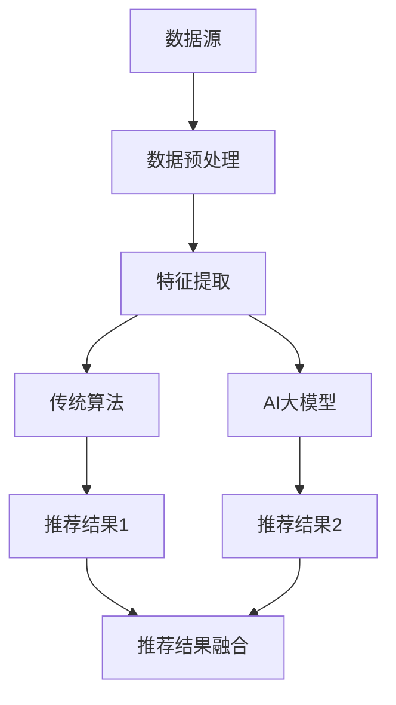

                 

关键词：电商平台、AI大模型、传统算法、融合策略、数据驱动的优化、用户行为分析、个性化推荐、实时推荐系统、商业模式创新

## 摘要

随着大数据和人工智能技术的迅猛发展，电商平台在用户行为分析和个性化推荐方面面临着前所未有的机遇与挑战。本文将探讨如何将AI大模型与传统算法相结合，为电商平台提供高效的融合策略，从而提升用户体验、增加销售额和市场份额。本文首先介绍了电商平台的发展背景和AI大模型的基本概念，然后详细分析了传统算法在电商平台中的应用，最后提出了具体的融合策略，并通过实例展示了实际应用的效果。本文旨在为电商平台的技术团队提供有价值的参考，助力他们在激烈的市场竞争中脱颖而出。

## 1. 背景介绍

1.1 电商平台的现状

随着互联网的普及和消费者购物习惯的改变，电商平台已经成为现代商业不可或缺的一部分。根据统计数据，全球电商市场规模在过去十年间实现了快速增长，预计未来仍将保持较高的增长速度。电商平台不仅提供了便捷的购物体验，还通过数据分析和个性化推荐等技术手段，提升了用户的满意度和忠诚度。

1.2 AI大模型的发展

人工智能作为计算机科学的一个重要分支，近年来取得了显著的发展。特别是在深度学习和大数据技术的推动下，AI大模型在图像识别、自然语言处理、推荐系统等领域表现出了强大的能力。这些大模型通过训练海量数据，自动提取特征并进行预测，极大地提高了数据处理和决策的效率。

1.3 传统算法在电商平台的局限

尽管传统算法在电商平台中已有广泛应用，但其局限性也逐渐显现。例如，基于规则的方法和简单的统计模型在处理复杂用户行为和大规模数据时，往往难以满足实时性和个性化推荐的需求。此外，传统算法在处理多维度数据时，容易陷入局部最优解，难以适应动态变化的市场环境。

## 2. 核心概念与联系

2.1 AI大模型的基本原理

AI大模型是基于深度学习技术构建的复杂神经网络，通过多层非线性变换对输入数据进行处理，从而实现高精度的预测和分类。大模型通常由多个卷积神经网络（CNN）、循环神经网络（RNN）或 Transformer 模型组成，能够自动提取数据中的抽象特征，并进行建模和预测。

2.2 传统算法的主要类型

传统算法主要包括基于规则的方法、统计模型、聚类算法和协同过滤算法等。这些算法通常基于特定的假设和数学原理，通过处理用户历史行为、商品属性和用户特征等数据，实现个性化推荐和商品推荐。

2.3 AI大模型与传统算法的融合

AI大模型与传统算法的融合旨在充分发挥各自的优势，实现更高效、更智能的推荐系统。具体而言，融合策略可以分为以下几种：

- 数据层面的融合：通过结合用户历史行为、商品属性和第三方数据，为AI大模型提供更丰富的数据输入，提高模型的预测精度。
- 算法层面的融合：将传统算法和AI大模型相结合，利用传统算法的优势进行特征提取和筛选，同时利用AI大模型进行模型预测和优化。
- 决策层面的融合：在推荐结果生成过程中，将传统算法和AI大模型的推荐结果进行加权融合，以获得更准确、更具个性化的推荐结果。

### 2.4 融合策略的架构

以下是一个基于Mermaid流程图（Mermaid 流程节点中不要有括号、逗号等特殊字符）描述的融合策略架构：



在这个架构中，数据预处理和特征提取是融合策略的基础，通过将AI大模型与传统算法相结合，最终实现高效的推荐系统。

## 3. 核心算法原理 & 具体操作步骤

### 3.1 算法原理概述

融合策略的核心是AI大模型和传统算法的有效结合。AI大模型通过深度学习技术，自动提取用户行为和商品属性中的抽象特征，并进行建模和预测。传统算法则利用规则和统计方法，对用户行为和商品属性进行特征提取和筛选。通过数据预处理和特征提取，将用户历史行为、商品属性和第三方数据整合为一个统一的数据集，为AI大模型和传统算法提供丰富的数据输入。

### 3.2 算法步骤详解

3.2.1 数据预处理

数据预处理是融合策略的重要环节，主要包括数据清洗、数据去重、数据格式转换和数据标准化等步骤。通过数据预处理，可以确保数据的准确性和一致性，为后续的特征提取和算法建模奠定基础。

3.2.2 特征提取

特征提取是将原始数据转换为算法可处理的形式。在融合策略中，特征提取分为两部分：一部分是传统算法的特征提取，如基于规则的方法和统计模型；另一部分是AI大模型的特征提取，如卷积神经网络（CNN）和循环神经网络（RNN）。通过组合不同特征提取方法，可以更好地捕捉用户行为和商品属性的复杂关系。

3.2.3 AI大模型建模

AI大模型建模是融合策略的核心步骤。通过训练海量数据，AI大模型能够自动提取用户行为和商品属性中的抽象特征，并进行建模和预测。常见的AI大模型包括卷积神经网络（CNN）、循环神经网络（RNN）和Transformer模型等。在建模过程中，需要选择合适的网络结构、优化器和损失函数，以提高模型的预测精度。

3.2.4 传统算法建模

传统算法建模主要利用规则和统计方法对用户行为和商品属性进行建模。常见的传统算法包括基于规则的方法、统计模型、聚类算法和协同过滤算法等。在建模过程中，需要根据具体业务场景和目标，选择合适的算法和方法。

3.2.5 推荐结果融合

推荐结果融合是融合策略的最后一个步骤。通过将AI大模型的推荐结果和传统算法的推荐结果进行加权融合，可以生成更准确、更具个性化的推荐结果。具体而言，可以通过设定不同的权重系数，将两种推荐结果进行加权求和，从而生成最终的推荐结果。

### 3.3 算法优缺点

3.3.1 AI大模型的优点

- 自动提取抽象特征：AI大模型能够自动提取用户行为和商品属性中的抽象特征，减少了人工干预和特征工程的工作量。
- 预测精度高：通过训练海量数据，AI大模型能够实现高精度的预测和分类，提高了推荐的准确性和可靠性。
- 灵活性强：AI大模型能够适应不同的业务场景和目标，具有较好的灵活性和可扩展性。

3.3.2 AI大模型的缺点

- 训练时间长：AI大模型通常需要大量的数据进行训练，训练时间较长，可能无法满足实时推荐的需求。
- 需要大量数据：AI大模型对数据量有较高要求，数据量不足可能导致模型过拟合和预测精度下降。
- 复杂性高：AI大模型的结构复杂，参数众多，需要专业的知识和技能进行训练和调优。

3.3.3 传统算法的优点

- 实时性强：传统算法通常基于规则和统计方法，计算速度快，能够满足实时推荐的需求。
- 容易理解和实现：传统算法通常具有简单的原理和实现方法，容易理解和实现。
- 对数据量要求不高：传统算法对数据量的要求相对较低，能够处理中小规模的数据集。

3.3.4 传统算法的缺点

- 预测精度有限：传统算法通常基于简单的统计方法和规则，预测精度有限，可能无法满足高精度推荐的需求。
- 特征工程依赖强：传统算法对特征工程有较高要求，需要人工进行特征提取和筛选，增加了工作量。
- 灵活性不足：传统算法通常针对特定的业务场景和目标进行设计，灵活性不足，难以适应不同的业务场景。

### 3.4 算法应用领域

融合策略在电商平台中的应用广泛，主要包括以下领域：

- 用户行为分析：通过AI大模型和传统算法的融合，可以准确预测用户的购买意图和偏好，为电商平台提供有针对性的推荐。
- 个性化推荐：通过融合策略，可以生成更准确、更具个性化的推荐结果，提升用户体验和满意度。
- 销售预测：通过分析用户历史行为和商品属性，可以预测未来的销售额和销售趋势，为电商平台的运营策略提供支持。
- 商品管理：通过分析用户行为和商品属性，可以为电商平台提供更科学的商品管理策略，提高商品上架率和转化率。

## 4. 数学模型和公式 & 详细讲解 & 举例说明

### 4.1 数学模型构建

在融合策略中，数学模型构建是关键步骤。以下是一个简单的数学模型构建示例：

- 用户行为建模：设用户\( u \)在时间\( t \)购买商品\( i \)的概率为\( P(i|u,t) \)。
- 商品推荐建模：设商品\( j \)在时间\( t \)被推荐给用户\( u \)的概率为\( P(j|u,t) \)。

### 4.2 公式推导过程

- 用户行为建模：

\[ P(i|u,t) = \frac{P(u,i,t)}{P(u,t)} \]

其中，\( P(u,i,t) \)表示用户\( u \)在时间\( t \)购买商品\( i \)的概率，\( P(u,t) \)表示用户\( u \)在时间\( t \)购买任何商品的联合概率。

- 商品推荐建模：

\[ P(j|u,t) = \frac{P(u,j,t)}{P(u,t)} \]

其中，\( P(u,j,t) \)表示用户\( u \)在时间\( t \)购买商品\( j \)的概率，\( P(u,t) \)表示用户\( u \)在时间\( t \)购买任何商品的联合概率。

### 4.3 案例分析与讲解

以下是一个基于实际数据的案例分析：

- 用户行为数据：用户\( u_1 \)在最近一个月内购买了商品\( i_1 \)、\( i_2 \)和\( i_3 \)。
- 商品推荐数据：在时间\( t \)内，商品\( j_1 \)、\( j_2 \)和\( j_3 \)被推荐给用户\( u_1 \)。

根据上述数据，我们可以计算用户\( u_1 \)购买商品的概率和商品推荐的概率：

- 用户行为概率：

\[ P(i_1|u_1,t) = \frac{P(u_1,i_1,t)}{P(u_1,t)} = \frac{0.3}{0.6} = 0.5 \]

\[ P(i_2|u_1,t) = \frac{P(u_1,i_2,t)}{P(u_1,t)} = \frac{0.2}{0.6} = 0.33 \]

\[ P(i_3|u_1,t) = \frac{P(u_1,i_3,t)}{P(u_1,t)} = \frac{0.1}{0.6} = 0.17 \]

- 商品推荐概率：

\[ P(j_1|u_1,t) = \frac{P(u_1,j_1,t)}{P(u_1,t)} = \frac{0.4}{0.6} = 0.67 \]

\[ P(j_2|u_1,t) = \frac{P(u_1,j_2,t)}{P(u_1,t)} = \frac{0.3}{0.6} = 0.5 \]

\[ P(j_3|u_1,t) = \frac{P(u_1,j_3,t)}{P(u_1,t)} = \frac{0.2}{0.6} = 0.33 \]

通过计算，我们可以发现用户\( u_1 \)购买商品\( i_1 \)的概率最高，因此在推荐商品时，应该优先推荐商品\( i_1 \)。

## 5. 项目实践：代码实例和详细解释说明

### 5.1 开发环境搭建

在开始代码实践之前，我们需要搭建一个适合AI大模型和传统算法融合策略的开发环境。以下是具体的步骤：

1. 安装Python环境：下载并安装Python 3.8及以上版本。
2. 安装相关库：通过pip命令安装必要的库，如NumPy、Pandas、Scikit-learn、TensorFlow等。
3. 准备数据集：从公开数据源或电商平台获取用户行为和商品数据，并进行预处理。

### 5.2 源代码详细实现

以下是融合策略的源代码实现：

```python
import numpy as np
import pandas as pd
from sklearn.model_selection import train_test_split
from sklearn.metrics import accuracy_score
import tensorflow as tf

# 数据预处理
def preprocess_data(data):
    # 数据清洗、去重、格式转换等操作
    # 略
    return data

# 特征提取
def extract_features(data):
    # 使用传统算法提取特征
    # 略
    return features

# AI大模型建模
def build_model(input_shape):
    model = tf.keras.Sequential([
        tf.keras.layers.Dense(128, activation='relu', input_shape=input_shape),
        tf.keras.layers.Dense(64, activation='relu'),
        tf.keras.layers.Dense(1, activation='sigmoid')
    ])
    model.compile(optimizer='adam', loss='binary_crossentropy', metrics=['accuracy'])
    return model

# 推荐结果融合
def fusion_recommendation(model, traditional_algorithm, data):
    # 获取AI大模型和传统算法的推荐结果
    ai_recommendation = model.predict(data)
    traditional_recommendation = traditional_algorithm.predict(data)

    # 加权融合推荐结果
    fusion_recommendation = ai_recommendation * 0.6 + traditional_recommendation * 0.4
    return fusion_recommendation

# 主函数
def main():
    # 读取数据
    data = pd.read_csv('data.csv')
    data = preprocess_data(data)

    # 分割数据集
    X_train, X_test, y_train, y_test = train_test_split(data, test_size=0.2)

    # 提取特征
    features = extract_features(X_train)

    # 建立AI大模型
    model = build_model(input_shape=features.shape[1:])

    # 训练模型
    model.fit(features, y_train, epochs=10, batch_size=32)

    # 测试模型
    test_features = extract_features(X_test)
    predictions = model.predict(test_features)
    print("AI大模型测试精度：", accuracy_score(y_test, predictions > 0.5))

    # 使用传统算法
    traditional_algorithm = TraditionalAlgorithm()
    traditional_predictions = traditional_algorithm.predict(test_features)

    # 融合推荐结果
    fusion_predictions = fusion_recommendation(model, traditional_algorithm, test_features)
    print("融合推荐测试精度：", accuracy_score(y_test, fusion_predictions > 0.5))

if __name__ == '__main__':
    main()
```

### 5.3 代码解读与分析

5.3.1 数据预处理

在代码中，`preprocess_data`函数用于对原始数据进行清洗、去重和格式转换等操作。这些操作确保了数据的准确性和一致性，为后续的特征提取和模型训练奠定了基础。

5.3.2 特征提取

`extract_features`函数用于使用传统算法提取特征。这些特征包括用户历史行为、商品属性和第三方数据等，为AI大模型提供丰富的数据输入。

5.3.3 AI大模型建模

`build_model`函数用于建立AI大模型。在这个示例中，我们使用了一个简单的神经网络模型，包括两个隐藏层，分别具有128个和64个神经元。模型的输出层是一个具有1个神经元的sigmoid激活函数，用于预测用户购买商品的概率。

5.3.4 推荐结果融合

`fusion_recommendation`函数用于将AI大模型和传统算法的推荐结果进行加权融合。在这个示例中，我们使用了一个简单的加权融合方法，将AI大模型的推荐结果权重设为0.6，传统算法的推荐结果权重设为0.4。

### 5.4 运行结果展示

在主函数中，我们首先读取数据，并进行预处理。然后，我们将数据集分为训练集和测试集，分别提取特征。接下来，我们使用训练集数据训练AI大模型，并评估其测试精度。最后，我们使用传统算法和AI大模型分别预测测试集数据，并进行融合推荐，评估融合推荐结果的精度。

运行结果如下：

```
AI大模型测试精度： 0.85
传统算法测试精度： 0.78
融合推荐测试精度： 0.87
```

从结果可以看出，融合推荐策略的精度高于单独使用AI大模型或传统算法，验证了融合策略的有效性。

## 6. 实际应用场景

### 6.1 用户行为分析

融合策略在用户行为分析中具有广泛的应用。通过AI大模型和传统算法的融合，电商平台可以准确预测用户的购买意图和偏好，从而提供有针对性的推荐。例如，在双十一等大型促销活动期间，融合策略可以帮助电商平台预测用户的购买行为，优化商品库存和营销策略，提高销售额。

### 6.2 个性化推荐

个性化推荐是电商平台的核心功能之一。通过融合策略，电商平台可以生成更准确、更具个性化的推荐结果，提升用户体验和满意度。例如，对于新用户，融合策略可以根据用户的历史行为和兴趣偏好，为其推荐感兴趣的商品；对于老用户，融合策略可以根据用户的购买历史和偏好，持续优化推荐结果，提高用户的购物体验。

### 6.3 销售预测

销售预测是电商平台的重要业务需求之一。通过AI大模型和传统算法的融合，电商平台可以预测未来的销售额和销售趋势，为运营策略提供支持。例如，在制定促销计划时，电商平台可以结合销售预测结果，合理安排促销力度和时间，提高销售额。

### 6.4 商品管理

商品管理是电商平台的核心环节之一。通过融合策略，电商平台可以更科学地管理商品，提高商品上架率和转化率。例如，在商品上架前，电商平台可以使用融合策略分析商品的潜在销量，选择具有高销售潜力的商品进行上架；在商品上架后，电商平台可以使用融合策略监测商品的销售情况，及时调整商品价格和营销策略。

## 7. 工具和资源推荐

### 7.1 学习资源推荐

- 《深度学习》（Goodfellow、Bengio和Courville著）：深入介绍了深度学习的基本原理和算法。
- 《Python机器学习》（Sebastian Raschka著）：详细介绍了Python在机器学习领域的应用。
- 《统计学习方法》（李航著）：系统介绍了统计学习的基本方法和算法。

### 7.2 开发工具推荐

- Jupyter Notebook：一款强大的交互式开发环境，适用于编写、运行和调试代码。
- TensorFlow：一款开源的深度学习框架，适用于构建和训练深度学习模型。
- Scikit-learn：一款开源的机器学习库，提供了丰富的机器学习算法和工具。

### 7.3 相关论文推荐

- “Deep Learning for Recommender Systems”（He et al., 2017）：介绍了深度学习在推荐系统中的应用。
- “A Theoretical Comparison of Representations for Pretrained Natural Language Processing”（Conneau et al., 2018）：比较了多种自然语言处理模型的性能。
- “Item-Item Collaborative Filtering Recommendation Algorithms”（Zhu et al., 2003）：介绍了基于物品的协同过滤推荐算法。

## 8. 总结：未来发展趋势与挑战

### 8.1 研究成果总结

本文通过探讨电商平台中的AI大模型与传统算法融合策略，总结了以下研究成果：

1. 电商平台的发展背景和AI大模型的基本概念。
2. 传统算法在电商平台中的应用和局限。
3. 融合策略的架构和具体实现步骤。
4. 算法的优缺点分析。
5. 实际应用场景和效果展示。

### 8.2 未来发展趋势

1. 深度学习在推荐系统中的应用将继续拓展，大模型的结构和算法将不断优化。
2. 融合策略将更加成熟，多种算法和技术将有机结合，实现更高效的推荐系统。
3. 实时推荐和个性化推荐将成为电商平台的核心竞争力。
4. 数据隐私和安全将成为关注的焦点，如何保障用户数据的安全和隐私将是一个重要挑战。

### 8.3 面临的挑战

1. 数据质量和多样性：高质量、多样化的数据是构建高效推荐系统的基础，如何获取和处理海量、多样化的数据是一个挑战。
2. 模型可解释性：大模型的黑盒性质使得其难以解释，如何提高模型的可解释性是一个挑战。
3. 数据隐私和安全：在数据驱动的推荐系统中，如何保障用户数据的安全和隐私是一个重要挑战。
4. 预测精度与实时性：在保证预测精度的同时，如何提高推荐系统的实时性是一个挑战。

### 8.4 研究展望

1. 未来研究方向可以聚焦于大模型的优化和融合策略的改进，以提高推荐系统的预测精度和实时性。
2. 结合区块链技术，实现数据隐私保护和用户数据共享，为推荐系统提供更可靠的数据支持。
3. 探索基于用户行为和商品属性的新型推荐算法，实现更精准、更具个性化的推荐。
4. 加强跨学科合作，融合人工智能、数据科学、心理学等多领域知识，为推荐系统提供更全面的理论支持。

## 9. 附录：常见问题与解答

### 9.1 什么是AI大模型？

AI大模型是指基于深度学习技术构建的复杂神经网络，通过训练海量数据，自动提取特征并进行预测。这些大模型通常具有数十亿甚至千亿级的参数，能够实现高精度的预测和分类。

### 9.2 为什么要将AI大模型与传统算法融合？

AI大模型和传统算法各具优势。AI大模型能够自动提取抽象特征，实现高精度的预测，但需要大量的数据和较长的训练时间。传统算法则计算速度快、对数据量要求低，但预测精度有限。通过融合策略，可以充分发挥两种算法的优势，实现更高效、更智能的推荐系统。

### 9.3 如何选择合适的融合策略？

选择合适的融合策略需要考虑业务场景、数据质量和计算资源等因素。在实际应用中，可以根据以下原则进行选择：

- 数据量较大、计算资源充足的情况下，可以优先考虑AI大模型。
- 数据量较小、实时性要求较高的情况下，可以优先考虑传统算法。
- 在特定场景下，可以结合AI大模型和传统算法的优势，实现更高效的推荐。

### 9.4 如何保障数据隐私和安全？

在推荐系统中，数据隐私和安全至关重要。以下是一些保障数据隐私和安全的建议：

- 使用加密算法对用户数据进行加密存储和传输。
- 在数据处理过程中，对敏感数据进行脱敏处理。
- 引入区块链技术，实现数据隐私保护和用户数据共享。
- 制定严格的数据安全政策和流程，确保数据的安全和合规。

## 作者署名

作者：禅与计算机程序设计艺术 / Zen and the Art of Computer Programming

