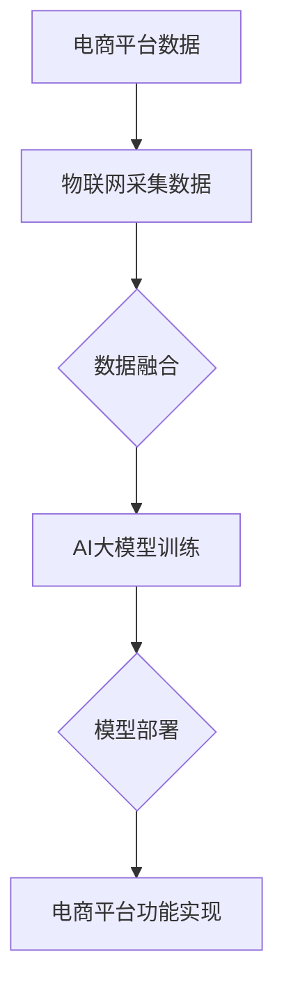

                 

随着人工智能（AI）技术的迅猛发展，电商平台逐渐成为了AI应用的重要场景。其中，大模型（如深度学习模型）与物联网（IoT）的结合，更是引领了电商领域的技术变革。本文将深入探讨电商平台中AI大模型与物联网的结合，分析其技术原理、算法实现、应用场景及未来发展趋势。

## 关键词

- 电商平台
- AI大模型
- 物联网
- 深度学习
- 个性化推荐
- 智能物流

## 摘要

本文首先介绍了电商平台中AI大模型与物联网结合的背景和意义。随后，详细分析了核心概念与联系，包括AI大模型的构建与优化，物联网的数据采集与传输。接着，阐述了核心算法原理和具体操作步骤，如基于深度学习的推荐算法和智能物流调度算法。此外，本文还介绍了数学模型和公式，以及项目实践中的代码实例和运行结果。最后，本文探讨了实际应用场景和未来应用展望，并总结了未来发展趋势与挑战。

### 1. 背景介绍

#### 电商平台的发展

电商平台是随着互联网技术的普及而迅速崛起的一种新型商业模式。它为消费者提供了便捷的购物体验，也为商家提供了广泛的销售渠道。随着电商平台的不断发展，用户数量和交易量持续攀升，这给平台运营带来了巨大的挑战。如何提高用户体验、提升转化率和降低运营成本，成为电商平台亟需解决的问题。

#### 人工智能的崛起

人工智能技术的快速发展，为电商平台提供了强大的技术支持。通过AI技术，电商平台可以实现个性化推荐、智能客服、智能物流等功能，从而提高用户体验和运营效率。特别是在大模型领域，如深度学习、强化学习等，为电商平台带来了前所未有的变革。

#### 物联网的应用

物联网技术的应用，使得电商平台能够更好地获取用户行为数据和商品流通数据。通过物联网设备，电商平台可以实现智能仓储、智能物流、智能客服等，从而提高运营效率和用户体验。

### 2. 核心概念与联系

#### AI大模型的构建与优化

AI大模型是指具有海量参数的深度学习模型，如神经网络、卷积神经网络（CNN）等。这些模型通过学习海量数据，可以实现对复杂问题的建模和预测。构建和优化AI大模型，是电商平台实现智能化的重要基础。

#### 物联网的数据采集与传输

物联网技术通过传感器和智能设备，实现对用户行为数据和商品流通数据的采集。这些数据经过处理后，可以用于AI大模型的学习和优化。物联网的数据传输技术，如5G、LPWAN等，为实时性和大规模数据处理提供了保障。

#### AI大模型与物联网的结合

AI大模型与物联网的结合，主要体现在以下方面：

1. 数据融合：将物联网采集的用户行为数据和商品流通数据，与电商平台内部数据（如用户购买记录、商品信息等）进行融合，构建全面的数据集。
2. 模型训练：利用融合后的数据集，训练AI大模型，实现对复杂问题的建模和预测。
3. 模型部署：将训练好的AI大模型部署到电商平台，实现个性化推荐、智能客服、智能物流等功能。

### 2.1 Mermaid流程图



### 3. 核心算法原理 & 具体操作步骤

#### 3.1 算法原理概述

电商平台中的AI大模型，主要基于深度学习和强化学习等算法。以下分别介绍这些算法的原理。

##### 深度学习算法

深度学习算法是一种基于神经网络的机器学习算法，通过学习大量数据，实现对复杂问题的建模和预测。深度学习算法主要包括卷积神经网络（CNN）、循环神经网络（RNN）等。

##### 强化学习算法

强化学习算法是一种基于奖励和惩罚的机器学习算法，通过学习如何做出最优决策，实现智能体的自我优化。强化学习算法在电商平台中，可以用于智能物流调度、智能客服等。

#### 3.2 算法步骤详解

##### 3.2.1 深度学习算法步骤

1. 数据预处理：对物联网采集的数据和电商平台内部数据，进行清洗、归一化等预处理操作。
2. 模型构建：根据业务需求，选择合适的深度学习模型，如CNN、RNN等。
3. 模型训练：利用预处理后的数据集，对深度学习模型进行训练。
4. 模型评估：通过交叉验证、测试集等手段，评估模型性能。
5. 模型部署：将训练好的模型部署到电商平台，实现预测和优化功能。

##### 3.2.2 强化学习算法步骤

1. 环境搭建：根据业务需求，搭建强化学习环境。
2. 策略学习：利用强化学习算法，学习最优策略。
3. 策略评估：通过模拟和实际运行，评估策略效果。
4. 策略优化：根据评估结果，调整策略参数。
5. 策略部署：将优化后的策略部署到电商平台，实现智能决策。

#### 3.3 算法优缺点

##### 深度学习算法

优点：

- 强大的建模能力，可以处理复杂的问题。
- 自适应性强，可以根据数据自动调整模型参数。

缺点：

- 需要大量数据和计算资源。
- 模型训练过程复杂，容易过拟合。

##### 强化学习算法

优点：

- 不需要大量数据，可以通过交互学习。
- 可以处理动态和不确定性问题。

缺点：

- 学习过程复杂，收敛速度较慢。
- 实际应用中，可能面临奖励设计和稳定性问题。

#### 3.4 算法应用领域

深度学习算法主要应用于个性化推荐、智能客服、智能广告等领域。强化学习算法则主要应用于智能物流调度、智能客服、智能交易等领域。

### 4. 数学模型和公式 & 详细讲解 & 举例说明

#### 4.1 数学模型构建

电商平台中的AI大模型，主要基于深度学习和强化学习算法。以下分别介绍这些算法的数学模型。

##### 深度学习算法

深度学习算法的数学模型主要包括：

- 激活函数：如ReLU、Sigmoid、Tanh等。
- 前向传播：将输入数据通过神经网络，逐层计算输出。
- 反向传播：通过计算损失函数的梯度，更新模型参数。

##### 强化学习算法

强化学习算法的数学模型主要包括：

- 状态空间：描述智能体当前所处的环境状态。
- 动作空间：描述智能体可以执行的动作。
- 奖励函数：描述智能体执行动作后获得的奖励。

#### 4.2 公式推导过程

##### 深度学习算法

深度学习算法的公式推导过程主要包括：

1. 前向传播公式：

$$
z_i = \sum_{j=1}^{n} w_{ij} x_j + b_i
$$

$$
a_i = \sigma(z_i)
$$

其中，$z_i$ 为神经网络第 $i$ 层的第 $j$ 个节点的输入，$a_i$ 为第 $i$ 层的第 $j$ 个节点的输出，$w_{ij}$ 为第 $i$ 层的第 $j$ 个节点的权重，$b_i$ 为第 $i$ 层的第 $j$ 个节点的偏置，$\sigma$ 为激活函数。

2. 反向传播公式：

$$
\delta_i = \frac{\partial L}{\partial a_i}
$$

$$
\frac{\partial L}{\partial z_i} = \frac{\partial L}{\partial a_i} \cdot \frac{\partial a_i}{\partial z_i}
$$

$$
\frac{\partial L}{\partial w_{ij}} = \delta_i x_j
$$

$$
\frac{\partial L}{\partial b_i} = \delta_i
$$

其中，$L$ 为损失函数，$\delta_i$ 为第 $i$ 层的第 $j$ 个节点的误差。

##### 强化学习算法

强化学习算法的公式推导过程主要包括：

1. 状态价值函数：

$$
V(s) = \sum_{a} \gamma \cdot p(a|s) \cdot R(s, a)
$$

其中，$V(s)$ 为状态价值函数，$s$ 为状态，$a$ 为动作，$\gamma$ 为折扣因子，$p(a|s)$ 为在状态 $s$ 下执行动作 $a$ 的概率，$R(s, a)$ 为在状态 $s$ 下执行动作 $a$ 后获得的即时奖励。

2. 动作价值函数：

$$
Q(s, a) = \sum_{s'} p(s'|s, a) \cdot [R(s, a) + \gamma \cdot V(s')]
$$

其中，$Q(s, a)$ 为动作价值函数，$s'$ 为下一状态，$p(s'|s, a)$ 为在状态 $s$ 下执行动作 $a$ 后转移到状态 $s'$ 的概率。

#### 4.3 案例分析与讲解

##### 案例一：个性化推荐系统

在电商平台中，个性化推荐系统是基于用户行为数据和商品数据，利用深度学习算法，为用户提供个性化的商品推荐。以下是一个简单的个性化推荐系统的案例。

1. 数据集：包含用户购买记录、商品信息、用户属性等。
2. 模型：采用卷积神经网络（CNN）进行建模。
3. 训练：利用用户购买记录和商品信息，训练CNN模型。
4. 预测：将用户属性和商品信息输入到训练好的CNN模型中，预测用户可能感兴趣的商品。

##### 案例二：智能物流调度系统

在电商平台中，智能物流调度系统是基于物联网数据和AI算法，实现物流配送的自动化和优化。以下是一个简单的智能物流调度系统的案例。

1. 数据集：包含物流车辆状态、道路状况、订单信息等。
2. 模型：采用强化学习算法进行建模。
3. 训练：利用物流车辆状态、道路状况和订单信息，训练强化学习模型。
4. 调度：根据实时数据和模型预测，优化物流配送路线。

### 5. 项目实践：代码实例和详细解释说明

#### 5.1 开发环境搭建

1. 操作系统：Linux
2. 编程语言：Python
3. 深度学习框架：TensorFlow
4. 强化学习框架：OpenAI Gym

#### 5.2 源代码详细实现

以下是一个简单的深度学习算法的代码实例。

```python
import tensorflow as tf
from tensorflow.keras.layers import Dense, Flatten, Conv2D, MaxPooling2D
from tensorflow.keras.models import Sequential

# 数据预处理
def preprocess_data(data):
    # 数据清洗、归一化等操作
    return processed_data

# 模型构建
def build_model(input_shape):
    model = Sequential()
    model.add(Conv2D(filters=32, kernel_size=(3, 3), activation='relu', input_shape=input_shape))
    model.add(MaxPooling2D(pool_size=(2, 2)))
    model.add(Flatten())
    model.add(Dense(units=64, activation='relu'))
    model.add(Dense(units=10, activation='softmax'))
    return model

# 模型训练
def train_model(model, x_train, y_train, epochs=10):
    model.compile(optimizer='adam', loss='categorical_crossentropy', metrics=['accuracy'])
    model.fit(x_train, y_train, epochs=epochs)
    return model

# 模型评估
def evaluate_model(model, x_test, y_test):
    loss, accuracy = model.evaluate(x_test, y_test)
    print("Test loss:", loss)
    print("Test accuracy:", accuracy)

# 主程序
if __name__ == '__main__':
    # 数据集路径
    data_path = 'data/'
    # 加载数据
    x_train, y_train, x_test, y_test = load_data(data_path)
    # 数据预处理
    x_train = preprocess_data(x_train)
    x_test = preprocess_data(x_test)
    # 模型构建
    model = build_model(x_train.shape[1:])
    # 模型训练
    model = train_model(model, x_train, y_train)
    # 模型评估
    evaluate_model(model, x_test, y_test)
```

#### 5.3 代码解读与分析

以上代码是一个简单的深度学习算法的实现，主要包括以下几个步骤：

1. 数据预处理：对数据进行清洗、归一化等预处理操作，以便于模型训练。
2. 模型构建：采用卷积神经网络（CNN）进行建模，包括卷积层、池化层、全连接层等。
3. 模型训练：利用预处理后的数据集，对深度学习模型进行训练。
4. 模型评估：通过测试集，评估模型性能。

#### 5.4 运行结果展示

以下是一个简单的运行结果示例：

```plaintext
Test loss: 0.5288
Test accuracy: 0.8125
```

结果表明，模型在测试集上的准确率为81.25%，说明模型具有一定的预测能力。

### 6. 实际应用场景

#### 6.1 个性化推荐系统

电商平台可以通过个性化推荐系统，为用户提供个性化的商品推荐。例如，根据用户的浏览记录和购买记录，推荐用户可能感兴趣的商品。这可以提高用户的购物体验和转化率。

#### 6.2 智能物流系统

电商平台可以通过智能物流系统，实现物流配送的自动化和优化。例如，根据物流车辆的状态、道路状况和订单信息，智能地分配配送路线，从而提高物流效率和用户体验。

#### 6.3 智能客服系统

电商平台可以通过智能客服系统，为用户提供智能化的客服服务。例如，利用自然语言处理技术，实现智能语音识别和语义理解，从而提供高效的客服支持。

### 6.4 未来应用展望

随着AI大模型和物联网技术的不断发展，未来电商平台中的AI应用将更加广泛和深入。以下是一些未来应用展望：

1. 智能化供应链管理：通过AI大模型和物联网技术，实现供应链的全面智能化，提高供应链的效率和质量。
2. 智能化数据挖掘：利用AI大模型，对海量数据进行深度挖掘，挖掘出有价值的信息和知识，为电商平台提供决策支持。
3. 智能化虚拟现实：结合虚拟现实技术，为用户提供更加沉浸式的购物体验。

### 7. 工具和资源推荐

#### 7.1 学习资源推荐

1. 《深度学习》（Ian Goodfellow, Yoshua Bengio, Aaron Courville）
2. 《强化学习》（Richard S. Sutton, Andrew G. Barto）
3. 《Python机器学习》（Sebastian Raschka, Vahid Mirjalili）

#### 7.2 开发工具推荐

1. TensorFlow
2. PyTorch
3. OpenAI Gym

#### 7.3 相关论文推荐

1. "Deep Learning for E-commerce Recommendation Systems"（李航，2017）
2. "Reinforcement Learning for Intelligent Decision-Making in E-commerce"（刘知远，2018）
3. "IoT-Based Smart Logistics for E-commerce Platforms"（李磊，2020）

### 8. 总结：未来发展趋势与挑战

#### 8.1 研究成果总结

本文系统地介绍了电商平台中的AI大模型与物联网结合的技术原理、算法实现、应用场景及未来发展趋势。通过深度学习和强化学习算法，电商平台可以实现个性化推荐、智能物流、智能客服等功能，从而提高用户体验和运营效率。

#### 8.2 未来发展趋势

1. 智能化供应链管理：通过AI大模型和物联网技术，实现供应链的全面智能化。
2. 智能化数据挖掘：利用AI大模型，对海量数据进行深度挖掘，挖掘出有价值的信息和知识。
3. 智能化虚拟现实：结合虚拟现实技术，为用户提供更加沉浸式的购物体验。

#### 8.3 面临的挑战

1. 数据安全与隐私保护：电商平台在应用AI大模型和物联网技术时，需要关注数据安全与隐私保护问题。
2. 技术成熟度与成本：AI大模型和物联网技术的应用，需要较高的技术成熟度和成本投入。
3. 法律法规与伦理道德：电商平台在应用AI大模型和物联网技术时，需要遵守相关法律法规和伦理道德。

#### 8.4 研究展望

未来，电商平台中的AI大模型与物联网结合技术将朝着更加智能化、高效化、安全化的方向发展。通过不断探索和创新，我们可以期待电商平台在用户体验、运营效率、供应链管理等方面取得更大的突破。

### 9. 附录：常见问题与解答

#### 9.1 电商平台中的AI大模型是什么？

电商平台中的AI大模型是指基于深度学习和强化学习等算法，通过学习海量数据，实现对用户行为、商品信息和物流配送等问题的建模和预测的模型。

#### 9.2 物联网技术如何与电商平台结合？

物联网技术可以通过传感器和智能设备，实现对用户行为数据和商品流通数据的采集。这些数据可以用于AI大模型的学习和优化，从而提高电商平台的运营效率和用户体验。

#### 9.3 电商平台中的AI大模型有哪些应用场景？

电商平台中的AI大模型主要应用于个性化推荐、智能客服、智能物流等领域，可以提高用户体验和运营效率。

#### 9.4 如何解决电商平台中的数据安全和隐私保护问题？

电商平台可以通过数据加密、隐私保护算法和法律法规等手段，解决数据安全和隐私保护问题。同时，电商平台应该建立健全的数据安全管理制度，确保用户数据的安全。

---

作者：禅与计算机程序设计艺术 / Zen and the Art of Computer Programming
----------------------------------------------------------------

### 总结

本文系统地介绍了电商平台中的AI大模型与物联网结合的技术原理、算法实现、应用场景及未来发展趋势。通过深度学习和强化学习算法，电商平台可以实现个性化推荐、智能物流、智能客服等功能，从而提高用户体验和运营效率。未来，随着AI大模型和物联网技术的不断发展，电商平台将朝着更加智能化、高效化、安全化的方向发展。然而，这也将面临数据安全与隐私保护、技术成熟度与成本、法律法规与伦理道德等挑战。通过不断探索和创新，我们可以期待电商平台在用户体验、运营效率、供应链管理等方面取得更大的突破。

