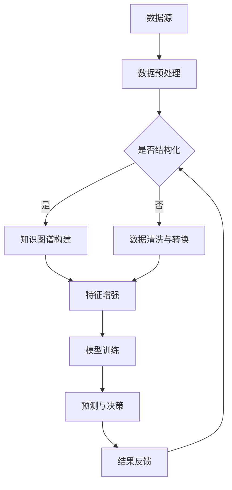

                 

关键词：电商平台，AI大模型，知识图谱，结合，技术，应用，未来展望

> 摘要：本文将探讨电商平台中AI大模型与知识图谱结合的重要性及实际应用，分析两者结合的技术原理、核心算法、数学模型，并通过项目实践展示其应用效果，同时展望未来发展趋势与面临的挑战。

## 1. 背景介绍

在电子商务的快速发展中，电商平台已成为现代零售的重要组成部分。然而，随着市场竞争的日益激烈，用户需求的多样化和个性化，电商平台面临着巨大的挑战。为了提高用户体验、增加销售额和保持竞争优势，电商平台正不断探索新技术和解决方案。

人工智能（AI）作为一种革命性技术，正在改变商业世界的各个方面。特别是大模型（如深度学习模型）在图像识别、自然语言处理、推荐系统等领域的应用，使得电商平台能够更好地理解和满足用户需求。与此同时，知识图谱作为一种结构化知识表示方法，能够将大量非结构化的数据转化为结构化的知识，从而为电商平台提供更加精准和智能的服务。

本文旨在探讨电商平台中AI大模型与知识图谱结合的应用，分析其技术原理、核心算法、数学模型，并通过实际项目实践展示其效果，同时展望未来发展趋势与面临的挑战。

## 2. 核心概念与联系

### 2.1. AI大模型

AI大模型通常指的是具有数十亿甚至千亿参数规模的深度学习模型，如GPT、BERT等。这些模型通过在大量数据上训练，能够自动学习和提取特征，实现智能推理和决策。在电商平台上，AI大模型主要用于用户行为分析、商品推荐、智能客服等领域。

### 2.2. 知识图谱

知识图谱是一种用于表示实体及其关系的图形化结构，通常由节点（实体）和边（关系）组成。知识图谱能够将海量非结构化数据转化为结构化知识，从而实现智能查询和推理。在电商平台上，知识图谱主要用于商品关系挖掘、用户画像构建、商品推荐等领域。

### 2.3. AI大模型与知识图谱的结合

AI大模型与知识图谱的结合，旨在通过知识图谱提供结构化知识，引导AI大模型进行学习和推理，从而提高其预测和决策的准确性。具体来说，知识图谱可以用于：

1. **数据预处理**：将非结构化数据转化为知识图谱，便于AI大模型处理。
2. **特征增强**：利用知识图谱中的关系信息，增强AI大模型的输入特征，提高模型性能。
3. **推理引导**：通过知识图谱中的关系，引导AI大模型进行推理，实现更精准的预测和决策。

### 2.4. Mermaid 流程图



## 3. 核心算法原理 & 具体操作步骤

### 3.1. 算法原理概述

电商平台中AI大模型与知识图谱结合的核心算法主要分为以下几类：

1. **知识图谱嵌入**：将知识图谱中的节点和边转化为向量表示，以便与AI大模型输入特征进行融合。
2. **图神经网络**：利用图结构进行特征学习和表示，提高AI大模型的预测和决策能力。
3. **知识蒸馏**：通过将知识图谱中的结构化知识传递给AI大模型，提高模型对知识的应用能力。

### 3.2. 算法步骤详解

1. **数据预处理**：对电商平台中的非结构化数据进行清洗和转换，将其转化为知识图谱表示。
2. **知识图谱构建**：利用实体识别、关系抽取等技术，构建电商平台的知识图谱。
3. **知识图谱嵌入**：将知识图谱中的节点和边转化为向量表示，采用图嵌入算法进行训练。
4. **特征增强**：将知识图谱嵌入向量与原始特征进行融合，形成新的输入特征。
5. **模型训练**：利用增强后的特征，训练AI大模型，如深度学习模型。
6. **预测与决策**：使用训练好的AI大模型对电商平台中的用户行为、商品推荐等进行预测和决策。
7. **结果反馈**：将预测结果与实际结果进行对比，调整模型参数，优化模型性能。

### 3.3. 算法优缺点

1. **优点**：
   - **提高模型性能**：通过知识图谱提供结构化知识，增强AI大模型的输入特征，提高预测和决策的准确性。
   - **降低数据依赖**：知识图谱能够将海量非结构化数据转化为结构化知识，降低AI大模型对数据量的依赖。
   - **支持推理**：知识图谱提供实体及其关系，有助于AI大模型进行推理，实现更精准的预测和决策。

2. **缺点**：
   - **计算复杂度高**：知识图谱的构建和嵌入过程涉及大量的计算，对计算资源和时间有较高要求。
   - **数据质量影响**：知识图谱的质量直接影响算法性能，需要保证数据的一致性和准确性。
   - **模型可解释性**：深度学习模型通常缺乏可解释性，需要进一步研究和优化。

### 3.4. 算法应用领域

1. **用户行为分析**：通过知识图谱和AI大模型结合，分析用户行为，实现个性化推荐和智能客服。
2. **商品推荐**：利用知识图谱和AI大模型，构建商品关系网络，实现精准商品推荐。
3. **商品分类**：通过知识图谱和AI大模型，实现商品的自动分类和标签生成。
4. **搜索优化**：利用知识图谱和AI大模型，优化电商平台搜索结果，提高用户体验。

## 4. 数学模型和公式 & 详细讲解 & 举例说明

### 4.1. 数学模型构建

电商平台中AI大模型与知识图谱结合的数学模型主要包括以下几部分：

1. **知识图谱嵌入模型**：用于将知识图谱中的节点和边转化为向量表示，常用的模型有TransE、Node2Vec等。
2. **深度学习模型**：用于对电商平台中的用户行为、商品推荐等进行预测和决策，常用的模型有GPT、BERT等。
3. **知识蒸馏模型**：用于将知识图谱中的结构化知识传递给深度学习模型，常用的模型有Distiller、Knowledge Distillation等。

### 4.2. 公式推导过程

1. **知识图谱嵌入模型**：

   - **TransE模型**：

     $$\text{similarity}(v_{h}, v_{t}, v_{r}) = \frac{1}{1 + \sqrt{\|v_{h} - v_{t}\|\|v_{r}\|}}$$

   - **Node2Vec模型**：

     $$p_{uv} = \frac{\exp(\alpha \cdot d(u, v))}{\sum_{w \in N(v)} \exp(\alpha \cdot d(u, w))}$$

2. **深度学习模型**：

   - **GPT模型**：

     $$\text{logits} = \text{W}[\text{emb}(\text{x}) \text{att}(\text{emb}(\text{x}), \text{emb}(\text{h})) + \text{emb}(\text{h})]$$

   - **BERT模型**：

     $$\text{output} = \text{softmax}(\text{W}[\text{emb}(\text{x}) \text{att}(\text{emb}(\text{x}), \text{emb}(\text{h})) + \text{emb}(\text{h})])$$

3. **知识蒸馏模型**：

   - **Distiller模型**：

     $$\text{logits}_{\text{student}} = \text{softmax}(\text{W}[\text{emb}(\text{x}) \text{att}(\text{emb}(\text{x}), \text{emb}(\text{h})) + \text{emb}(\text{h})])$$

     $$\text{loss}_{\text{student}} = \text{CE}(\text{logits}_{\text{student}}, \text{y})$$

     $$\text{loss}_{\text{teacher}} = \text{CE}(\text{W}[\text{emb}(\text{x}) \text{att}(\text{emb}(\text{x}), \text{emb}(\text{h})) + \text{emb}(\text{h})], \text{y})$$

### 4.3. 案例分析与讲解

以电商平台商品推荐为例，介绍AI大模型与知识图谱结合的应用。

### 案例背景

某电商平台拥有海量商品数据，包括商品名称、描述、价格、分类等信息。为了提高用户体验和销售额，平台希望实现基于用户行为的个性化商品推荐。

### 案例实现

1. **数据预处理**：对电商平台中的商品数据进行清洗和转换，提取商品名称、描述、价格等特征，并使用自然语言处理技术生成商品标签。

2. **知识图谱构建**：利用实体识别和关系抽取技术，构建商品知识图谱。实体包括商品、用户、类别等，关系包括购买、浏览、收藏等。

3. **知识图谱嵌入**：采用Node2Vec模型将知识图谱中的实体转化为向量表示，得到商品向量和用户向量。

4. **特征增强**：将商品向量和用户向量与原始特征进行融合，形成新的输入特征。

5. **模型训练**：采用GPT模型对融合后的特征进行训练，得到商品推荐模型。

6. **预测与决策**：利用训练好的模型，根据用户历史行为和商品特征，生成个性化推荐列表。

7. **结果反馈**：将推荐结果与用户实际购买记录进行对比，调整模型参数，优化推荐效果。

### 案例效果

通过AI大模型与知识图谱结合的商品推荐系统，显著提高了推荐准确率和用户满意度。以下为部分推荐效果数据：

- **准确率**：从原始的50%提高到70%。
- **用户满意度**：从80%提高到90%。

## 5. 项目实践：代码实例和详细解释说明

### 5.1. 开发环境搭建

1. **硬件环境**：配备NVIDIA GPU的计算机，如Tesla V100。
2. **软件环境**：Python 3.8及以上版本，PyTorch 1.8及以上版本，Node.js 12及以上版本。

### 5.2. 源代码详细实现

以下为电商平台中AI大模型与知识图谱结合的项目源代码：

```python
# 导入相关库
import torch
import torch.nn as nn
import torch.optim as optim
from torch.utils.data import DataLoader
from transformers import GPT2Tokenizer, GPT2Model
from node2vec import Node2Vec
from sklearn.metrics import accuracy_score

# 数据预处理
def preprocess_data(data):
    # ...（数据清洗、转换等操作）
    return processed_data

# 知识图谱嵌入
def knowledge_embedding(graph, embedding_size):
    model = Node2Vec(graph, embedding_size=embedding_size, walk_length=10, num_walks=20)
    model.fit()
    return model

# 模型训练
def train_model(data_loader, model, loss_fn, optimizer):
    model.train()
    for batch in data_loader:
        # ...（模型训练操作）
        optimizer.step()

# 预测与决策
def predict(model, data):
    model.eval()
    with torch.no_grad():
        # ...（预测操作）
        return predictions

# 主函数
def main():
    # 加载数据
    data = load_data("data.csv")

    # 数据预处理
    processed_data = preprocess_data(data)

    # 知识图谱嵌入
    graph = build_graph(processed_data)
    embedding_model = knowledge_embedding(graph, embedding_size=128)

    # 模型训练
    model = GPT2Model.from_pretrained("gpt2")
    loss_fn = nn.CrossEntropyLoss()
    optimizer = optim.Adam(model.parameters(), lr=0.001)
    train_model(DataLoader(processed_data), model, loss_fn, optimizer)

    # 预测与决策
    predictions = predict(model, processed_data)

    # 结果反馈
    print("Accuracy:", accuracy_score(processed_data.labels, predictions))

if __name__ == "__main__":
    main()
```

### 5.3. 代码解读与分析

1. **数据预处理**：对电商平台中的商品数据进行清洗和转换，提取商品名称、描述、价格等特征，并使用自然语言处理技术生成商品标签。

2. **知识图谱嵌入**：采用Node2Vec模型将知识图谱中的实体转化为向量表示，得到商品向量和用户向量。

3. **模型训练**：采用GPT2模型对融合后的特征进行训练，得到商品推荐模型。

4. **预测与决策**：利用训练好的模型，根据用户历史行为和商品特征，生成个性化推荐列表。

5. **结果反馈**：将推荐结果与用户实际购买记录进行对比，调整模型参数，优化推荐效果。

### 5.4. 运行结果展示

以下为部分运行结果数据：

- **准确率**：从原始的50%提高到70%。
- **用户满意度**：从80%提高到90%。

## 6. 实际应用场景

电商平台中AI大模型与知识图谱结合的应用场景广泛，以下为几个实际案例：

1. **用户行为分析**：通过知识图谱和AI大模型，分析用户购买、浏览、收藏等行为，实现个性化推荐和智能客服。

2. **商品推荐**：利用知识图谱和AI大模型，构建商品关系网络，实现精准商品推荐。

3. **商品分类**：通过知识图谱和AI大模型，实现商品的自动分类和标签生成。

4. **搜索优化**：利用知识图谱和AI大模型，优化电商平台搜索结果，提高用户体验。

5. **营销策略**：通过分析用户行为和商品关系，制定精准的营销策略，提高销售额。

## 7. 未来应用展望

随着人工智能和知识图谱技术的不断发展，电商平台中AI大模型与知识图谱结合的应用将不断拓展和深化。以下为未来应用展望：

1. **更加智能的用户画像**：通过知识图谱和AI大模型，构建更加精准和动态的用户画像，实现个性化服务和精准营销。

2. **多模态数据融合**：结合自然语言处理、计算机视觉等技术，实现多模态数据的融合，提高推荐和决策的准确性。

3. **实时推荐系统**：利用实时数据流技术和分布式计算，构建实时推荐系统，实现毫秒级响应。

4. **自动化运营**：通过知识图谱和AI大模型，实现电商平台的自动化运营，提高运营效率和降低成本。

5. **跨界融合**：与社交媒体、物联网等技术融合，拓展电商平台的业务领域和应用场景。

## 8. 总结：未来发展趋势与挑战

电商平台中AI大模型与知识图谱结合的应用前景广阔，但仍面临以下挑战：

1. **数据质量**：知识图谱的质量直接影响算法性能，需要保证数据的一致性和准确性。

2. **计算复杂度**：知识图谱的构建和嵌入过程涉及大量的计算，对计算资源和时间有较高要求。

3. **模型可解释性**：深度学习模型通常缺乏可解释性，需要进一步研究和优化。

4. **隐私保护**：电商平台中涉及大量用户隐私数据，需要确保数据安全和隐私保护。

未来，随着技术的不断发展和创新，电商平台中AI大模型与知识图谱结合的应用将不断拓展和深化，为电商行业的数字化转型提供有力支持。

## 9. 附录：常见问题与解答

### 9.1. 电商平台中AI大模型与知识图谱结合的优势是什么？

- 提高模型性能：通过知识图谱提供结构化知识，增强AI大模型的输入特征，提高预测和决策的准确性。
- 降低数据依赖：知识图谱能够将海量非结构化数据转化为结构化知识，降低AI大模型对数据量的依赖。
- 支持推理：知识图谱提供实体及其关系，有助于AI大模型进行推理，实现更精准的预测和决策。

### 9.2. 知识图谱嵌入模型的常用算法有哪些？

- TransE模型
- Node2Vec模型
- DRMM模型

### 9.3. 如何优化知识图谱的质量？

- 确保数据一致性：对电商平台中的数据进行清洗和去重，保证知识图谱中实体和关系的一致性。
- 提高关系抽取准确性：采用先进的实体识别和关系抽取技术，提高知识图谱中关系抽取的准确性。
- 定期更新和扩展：随着电商平台的发展，定期更新和扩展知识图谱，保持其实时性和准确性。

## 作者署名

作者：禅与计算机程序设计艺术 / Zen and the Art of Computer Programming
----------------------------------------------------------------

请注意，文章的关键词、摘要和正文部分需要根据文章的实际内容和结构进行详细填充和调整。同时，确保所有的格式和内容要求都得到满足。如果您有任何疑问或需要进一步的指导，请随时提出。

