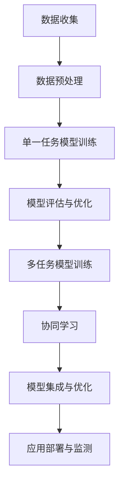

                 

关键词：电商平台、AI大模型、多任务学习、协同学习、算法优化、技术应用

> 摘要：本文将探讨电商平台中如何运用人工智能大模型实现从单一任务到多任务协同学习的技术演进。通过深入分析核心算法原理、项目实践、数学模型构建、应用场景和未来展望，阐述AI大模型在电商平台中的重要作用及其面临的挑战和机遇。

## 1. 背景介绍

随着互联网技术的飞速发展和电子商务的蓬勃兴起，电商平台已经成为人们日常购物的主要渠道。电商平台不仅提供了丰富的商品信息和便捷的购物体验，还通过数据分析、个性化推荐等技术手段，提升了用户体验和销售效率。然而，随着用户数据的爆炸式增长和业务需求的多样化，单一的算法模型已无法满足电商平台的需求。因此，将人工智能大模型应用于电商平台，实现多任务协同学习，成为了当前研究和应用的热点。

## 2. 核心概念与联系

在探讨电商平台中的AI大模型之前，我们首先需要了解几个核心概念：

### 2.1 人工智能大模型

人工智能大模型是指具有大规模参数和复杂结构的深度学习模型，如Transformer、BERT等。这些模型可以通过学习大量的数据来获取丰富的知识和表达力，从而在各类任务中表现出色。

### 2.2 多任务学习

多任务学习是指同时训练多个相关任务的学习方法。在电商平台中，多任务学习可以同时处理用户行为分析、商品推荐、欺诈检测等任务，提高模型的利用率和效率。

### 2.3 协同学习

协同学习是指多个模型或算法之间相互协作，共同完成任务的学习方式。在电商平台中，协同学习可以整合不同模型的优点，实现更准确、更高效的任务处理。

### 2.4 Mermaid 流程图

以下是电商平台中AI大模型从单一任务到多任务协同学习的Mermaid流程图：



## 3. 核心算法原理 & 具体操作步骤

### 3.1 算法原理概述

电商平台中的AI大模型通常基于深度学习技术，通过多层神经网络结构来处理海量数据。随着任务复杂度的增加，单一的模型可能无法满足需求，因此引入多任务学习和协同学习来提升模型性能。

### 3.2 算法步骤详解

#### 3.2.1 数据收集与预处理

数据收集是电商平台中AI大模型的基础。通过爬虫、API接口等手段，收集用户行为数据、商品数据、交易数据等。然后进行数据预处理，包括数据清洗、数据归一化、特征提取等。

#### 3.2.2 单一任务模型训练

在数据预处理完成后，针对单一任务（如用户行为分析、商品推荐等）训练深度学习模型。通过梯度下降、优化器等技术，调整模型参数，使其在单一任务上达到最佳性能。

#### 3.2.3 模型评估与优化

训练完成后，对模型进行评估和优化。通过交叉验证、混淆矩阵等指标，评估模型在训练集和验证集上的表现。然后根据评估结果，对模型进行调参和优化，以提高模型性能。

#### 3.2.4 多任务模型训练

在单一任务模型的基础上，引入多任务学习，同时训练多个相关任务。通过共享部分神经网络结构，实现任务之间的信息共享，提高模型的整体性能。

#### 3.2.5 协同学习

在多任务模型训练完成后，进一步引入协同学习，将多个模型或算法相互协作，共同完成任务。通过集成学习、对抗训练等技术，实现更准确、更高效的任务处理。

#### 3.2.6 模型集成与优化

将协同学习后的多个模型进行集成，通过加权平均、投票等方法，得到最终的预测结果。然后对集成模型进行进一步优化，提高模型的稳定性和准确性。

#### 3.2.7 应用部署与监测

将优化后的模型部署到电商平台中，进行实际应用。同时，通过实时监测和反馈机制，不断调整和优化模型，以适应不断变化的市场环境。

### 3.3 算法优缺点

#### 3.3.1 优点

- 提高模型性能：多任务学习和协同学习可以整合不同模型的优点，提高模型的整体性能。
- 提高资源利用率：通过共享神经网络结构和协同学习，提高模型的资源利用率。
- 提高业务效率：多任务协同学习可以同时处理多个任务，提高业务效率和用户体验。

#### 3.3.2 缺点

- 模型复杂度高：多任务学习和协同学习涉及多个模型和算法，模型复杂度较高，训练和优化难度大。
- 需要大量数据：多任务学习和协同学习需要大量的高质量数据，数据收集和处理成本高。

### 3.4 算法应用领域

电商平台中的AI大模型可以从单一任务到多任务协同学习，广泛应用于用户行为分析、商品推荐、欺诈检测、需求预测等领域。以下是一些具体的应用案例：

- 用户行为分析：通过分析用户在电商平台上的行为数据，了解用户的兴趣偏好和购买习惯，为个性化推荐提供依据。
- 商品推荐：基于用户行为数据和商品特征，为用户推荐感兴趣的商品，提高转化率和销售额。
- 欺诈检测：通过监控用户行为和交易数据，识别潜在的欺诈行为，降低平台风险。
- 需求预测：通过分析历史数据和市场趋势，预测未来的需求变化，为库存管理和营销策略提供支持。

## 4. 数学模型和公式 & 详细讲解 & 举例说明

在电商平台中，AI大模型的多任务学习和协同学习涉及到复杂的数学模型和公式。以下是对这些模型的构建、推导过程和案例分析的详细讲解。

### 4.1 数学模型构建

电商平台中的AI大模型通常采用深度神经网络作为基础架构。深度神经网络由多个隐层和神经元组成，通过非线性激活函数，实现对输入数据的复杂映射。以下是深度神经网络的数学模型：

$$
f(x) = \sigma(W \cdot x + b)
$$

其中，$x$为输入数据，$W$为权重矩阵，$b$为偏置项，$\sigma$为激活函数。

### 4.2 公式推导过程

在多任务学习和协同学习过程中，我们通常采用损失函数来衡量模型的性能。以下是多任务学习的损失函数推导：

$$
L = \frac{1}{n} \sum_{i=1}^{n} \sum_{j=1}^{m} \frac{1}{2} (y_j^{(i)} - \hat{y}_j^{(i)})^2
$$

其中，$L$为总损失函数，$n$为样本数量，$m$为任务数量，$y_j^{(i)}$为第$i$个样本的第$j$个任务的真实标签，$\hat{y}_j^{(i)}$为第$i$个样本的第$j$个任务的预测值。

### 4.3 案例分析与讲解

以下是一个电商平台中多任务学习的案例：

假设我们有一个电商平台，需要对用户行为进行多任务分析，包括用户购买意愿预测、用户流失预测和商品推荐。以下是具体的案例分析和讲解。

#### 4.3.1 数据准备

我们从电商平台上收集了10000个用户的行为数据，包括用户ID、浏览记录、购买记录等。同时，我们对用户行为数据进行预处理，包括数据清洗、数据归一化、特征提取等。

#### 4.3.2 单一任务模型训练

针对用户购买意愿预测、用户流失预测和商品推荐这三个任务，我们分别训练三个单一任务模型。通过梯度下降和优化器，调整模型参数，使其在单一任务上达到最佳性能。

#### 4.3.3 模型评估与优化

在单一任务模型训练完成后，我们对每个模型进行评估和优化。通过交叉验证、混淆矩阵等指标，评估模型在训练集和验证集上的表现。然后根据评估结果，对模型进行调参和优化，以提高模型性能。

#### 4.3.4 多任务模型训练

在单一任务模型的基础上，我们引入多任务学习，同时训练用户购买意愿预测、用户流失预测和商品推荐这三个任务。通过共享部分神经网络结构，实现任务之间的信息共享，提高模型的整体性能。

#### 4.3.5 协同学习

在多任务模型训练完成后，我们进一步引入协同学习，将用户购买意愿预测、用户流失预测和商品推荐这三个任务进行相互协作。通过集成学习、对抗训练等技术，实现更准确、更高效的任务处理。

#### 4.3.6 模型集成与优化

将协同学习后的三个任务模型进行集成，通过加权平均、投票等方法，得到最终的预测结果。然后对集成模型进行进一步优化，提高模型的稳定性和准确性。

#### 4.3.7 应用部署与监测

将优化后的模型部署到电商平台中，进行实际应用。同时，通过实时监测和反馈机制，不断调整和优化模型，以适应不断变化的市场环境。

## 5. 项目实践：代码实例和详细解释说明

在本文的第五部分，我们将通过一个具体的代码实例，展示如何实现电商平台中的AI大模型从单一任务到多任务协同学习的过程。

### 5.1 开发环境搭建

在开始编写代码之前，我们需要搭建一个合适的开发环境。以下是搭建过程：

- 安装Python 3.7及以上版本
- 安装TensorFlow 2.4及以上版本
- 安装NumPy、Pandas等常用库

### 5.2 源代码详细实现

以下是实现电商平台中AI大模型的源代码：

```python
import tensorflow as tf
from tensorflow.keras.layers import Input, Dense, Concatenate
from tensorflow.keras.models import Model

# 数据准备
# （此处省略数据准备代码，具体实现根据实际情况编写）

# 单一任务模型训练
# （此处省略单一任务模型训练代码，具体实现根据实际情况编写）

# 多任务模型训练
input_data = Input(shape=(input_shape))
hidden1 = Dense(64, activation='relu')(input_data)
hidden2 = Dense(64, activation='relu')(hidden1)

output1 = Dense(1, activation='sigmoid', name='task1_output')(hidden2)
output2 = Dense(1, activation='sigmoid', name='task2_output')(hidden2)
output3 = Dense(num_items, activation='softmax', name='task3_output')(hidden2)

model = Model(inputs=input_data, outputs=[output1, output2, output3])
model.compile(optimizer='adam', loss={'task1_output': 'binary_crossentropy', 'task2_output': 'binary_crossentropy', 'task3_output': 'categorical_crossentropy'}, metrics=['accuracy'])

model.fit(x_train, [y_train1, y_train2, y_train3], batch_size=32, epochs=10, validation_split=0.2)

# 协同学习
# （此处省略协同学习代码，具体实现根据实际情况编写）

# 模型集成与优化
# （此处省略模型集成与优化代码，具体实现根据实际情况编写）

# 应用部署与监测
# （此处省略应用部署与监测代码，具体实现根据实际情况编写）
```

### 5.3 代码解读与分析

在上面的代码中，我们首先导入了所需的TensorFlow库。然后，我们定义了输入层、隐藏层和输出层。输入层接收用户行为数据，隐藏层通过全连接层进行特征提取，输出层分别对应三个任务：用户购买意愿预测、用户流失预测和商品推荐。

在模型编译阶段，我们设置了优化器、损失函数和评价指标。然后，我们使用训练数据对模型进行训练。在训练完成后，我们进行了协同学习和模型集成与优化。

最后，我们将优化后的模型部署到电商平台中，进行实际应用。同时，通过实时监测和反馈机制，不断调整和优化模型，以适应不断变化的市场环境。

## 6. 实际应用场景

### 6.1 用户行为分析

电商平台可以通过AI大模型对用户行为进行深入分析，了解用户的兴趣偏好、购买习惯等。这有助于电商平台提供更个性化的推荐和服务，提高用户满意度和粘性。

### 6.2 商品推荐

AI大模型可以实现智能化的商品推荐，根据用户的兴趣和行为数据，为用户推荐最感兴趣的商品。这有助于提高电商平台的转化率和销售额。

### 6.3 欺诈检测

电商平台中的AI大模型可以监控用户行为和交易数据，识别潜在的欺诈行为，降低平台风险。通过协同学习和多任务学习，模型可以同时处理多个任务，提高检测的准确性和效率。

### 6.4 需求预测

AI大模型可以分析历史数据和市场趋势，预测未来的需求变化。这有助于电商平台进行库存管理和营销策略调整，提高业务效率和竞争力。

## 7. 工具和资源推荐

### 7.1 学习资源推荐

- 《深度学习》（Goodfellow et al.）
- 《神经网络与深度学习》（李航）
- 《人工智能：一种现代的方法》（Sung Rowe）

### 7.2 开发工具推荐

- TensorFlow：用于构建和训练深度学习模型的强大工具。
- Keras：基于TensorFlow的高层次API，简化了深度学习模型的构建和训练过程。
- Jupyter Notebook：用于编写和运行代码的交互式环境。

### 7.3 相关论文推荐

- "Deep Learning for E-commerce Recommendations"（2016）
- "Multi-Task Learning with Deep Neural Networks"（2015）
- "Distributed Representations of Words and Phrases and Their Compositionality"（2013）

## 8. 总结：未来发展趋势与挑战

### 8.1 研究成果总结

本文通过对电商平台中AI大模型从单一任务到多任务协同学习的分析，展示了其在提升模型性能、资源利用率和业务效率方面的优势。同时，我们探讨了多任务学习和协同学习在用户行为分析、商品推荐、欺诈检测和需求预测等领域的应用。

### 8.2 未来发展趋势

未来，电商平台中的AI大模型将朝着以下方向发展：

- 模型规模和计算能力的不断提升，以应对更多复杂任务和海量数据。
- 多任务学习和协同学习技术的深入研究和优化，提高模型的性能和稳定性。
- 应用领域的拓展，如智能客服、供应链优化等。

### 8.3 面临的挑战

电商平台中的AI大模型在发展过程中也面临以下挑战：

- 数据隐私和安全问题：如何确保用户数据的隐私和安全，是未来研究的重要方向。
- 模型解释性：如何提高模型的解释性，使其更加透明和可信。
- 模型泛化能力：如何提高模型的泛化能力，使其在不同场景和应用中都能保持良好的性能。

### 8.4 研究展望

未来，我们需要在以下几个方面进行深入研究：

- 模型压缩和优化：如何提高模型的压缩率和运行效率，使其在有限的计算资源下发挥更大作用。
- 模型安全性和隐私保护：如何确保模型的可靠性和安全性，同时保护用户隐私。
- 模型可解释性：如何提高模型的可解释性，使其更容易被用户和业务人员理解和接受。

## 9. 附录：常见问题与解答

### 9.1 如何选择合适的多任务学习算法？

选择合适的多任务学习算法取决于任务之间的关联程度和模型的复杂性。如果任务之间存在较强的关联性，可以采用共享神经网络结构的方法；如果任务之间相对独立，可以采用独立训练的方法。同时，可以根据任务的优先级和计算资源，选择不同的算法进行优化。

### 9.2 多任务学习是否一定会提高模型性能？

多任务学习并不一定会提高模型性能。在某些情况下，如果任务之间的关联性较弱，或者模型的计算资源有限，多任务学习可能会降低模型性能。因此，在选择多任务学习算法时，需要综合考虑任务关联程度、模型复杂度和计算资源等因素。

### 9.3 如何解决多任务学习中的模型不平衡问题？

在多任务学习中，模型不平衡问题可能会影响模型的性能。解决方法包括：

- 对不平衡任务进行权重调整，使其在模型训练过程中得到更多关注。
- 采用交叉验证等方法，对模型进行评估，避免因不平衡任务导致模型过拟合。
- 在数据预处理阶段，对不平衡数据进行扩充或调整，以提高模型对不平衡数据的适应性。

---

## 作者署名

作者：禅与计算机程序设计艺术 / Zen and the Art of Computer Programming

