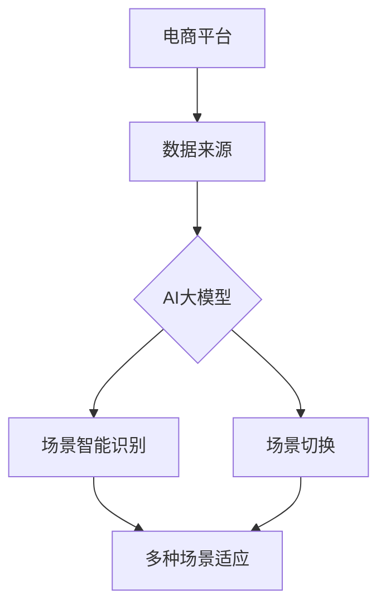

                 

 关键词：电商平台，AI大模型，场景智能识别，场景切换，技术博客，深度学习，计算机图灵奖，软件架构

> 摘要：本文深入探讨了电商平台中的AI大模型如何从单一场景扩展到实现场景智能识别与切换的能力。通过分析核心概念与联系、核心算法原理、数学模型与公式、项目实践和未来应用展望，本文为电商平台中的AI大模型提供了全面的技术框架与实践指导。

## 1. 背景介绍

随着电子商务的快速发展，电商平台成为人们生活中不可或缺的一部分。在这些平台上，用户行为数据庞大且复杂，如何有效地处理和分析这些数据，成为了电商平台竞争的关键。AI大模型作为一种强大的数据处理工具，在电商平台中得到了广泛应用。然而，现有的AI大模型大多针对单一场景进行优化，如推荐系统、用户行为分析等，难以应对多种复杂场景的需求。

场景智能识别与切换是AI大模型发展的一个重要方向。通过实现场景智能识别，AI大模型可以动态地根据当前场景调整模型参数和算法，提高模型在多种场景下的适应性和准确性。同时，场景切换能力使得AI大模型可以在不同场景之间无缝切换，实现资源的灵活调度和最大化利用。

本文旨在探讨电商平台中的AI大模型如何从单一场景扩展到实现场景智能识别与切换的能力。文章结构如下：

1. 背景介绍
2. 核心概念与联系
3. 核心算法原理 & 具体操作步骤
4. 数学模型和公式 & 详细讲解 & 举例说明
5. 项目实践：代码实例和详细解释说明
6. 实际应用场景
7. 工具和资源推荐
8. 总结：未来发展趋势与挑战

## 2. 核心概念与联系

在探讨电商平台中的AI大模型之前，我们需要了解一些核心概念和它们之间的联系。

### 2.1 电商平台

电商平台是指通过互联网进行商品交易和服务的平台。这些平台通常包括商品展示、用户浏览、购物车、支付和订单管理等模块。电商平台的核心目标是提供便捷的购物体验，增加用户粘性，提高销售额。

### 2.2 AI大模型

AI大模型是指由海量数据训练得到的复杂神经网络模型。这些模型在图像识别、自然语言处理、推荐系统等领域取得了显著成果。AI大模型通常具有强大的数据处理和分析能力，能够从大规模数据中提取有价值的信息。

### 2.3 场景智能识别

场景智能识别是指AI大模型能够根据当前环境或任务的需求，自动识别并适应不同的场景。场景智能识别通常基于深度学习技术，通过训练模型在不同场景下的表现，实现场景自适应。

### 2.4 场景切换

场景切换是指AI大模型能够在不同场景之间进行快速切换，以适应不同的任务需求。场景切换通常通过动态调整模型参数和算法实现，可以有效地提高模型在不同场景下的性能。

### 2.5 核心概念联系

电商平台、AI大模型、场景智能识别和场景切换是本文探讨的核心概念。电商平台提供了数据来源和应用场景，AI大模型作为数据处理工具，通过场景智能识别和场景切换能力，实现了在多种复杂场景下的高效运行。这些核心概念相互关联，共同构成了电商平台中的AI大模型技术框架。

### 2.6 Mermaid 流程图

以下是电商平台中的AI大模型核心概念与联系的Mermaid流程图：



## 3. 核心算法原理 & 具体操作步骤

### 3.1 算法原理概述

电商平台中的AI大模型核心算法原理主要基于深度学习和迁移学习技术。深度学习通过多层神经网络模型，对海量用户行为数据进行特征提取和关系建模，从而实现场景智能识别和切换。迁移学习则利用已有模型在新的场景下的快速适应能力，降低模型训练难度，提高模型性能。

### 3.2 算法步骤详解

#### 3.2.1 数据收集与预处理

1. 数据收集：从电商平台获取用户行为数据，如浏览记录、购物车数据、订单数据等。
2. 数据预处理：对原始数据进行清洗、去噪和归一化处理，确保数据质量。

#### 3.2.2 特征提取与建模

1. 特征提取：利用深度学习技术，从用户行为数据中提取有价值的特征。
2. 建模：构建多层神经网络模型，对特征进行建模和关系分析。

#### 3.2.3 场景智能识别

1. 数据划分：将数据划分为训练集、验证集和测试集。
2. 模型训练：利用训练集训练模型，优化模型参数。
3. 模型评估：利用验证集评估模型性能，调整模型参数。
4. 模型应用：将训练好的模型应用于实际场景，实现场景智能识别。

#### 3.2.4 场景切换

1. 场景识别：根据当前场景需求，自动识别并切换到相应的模型。
2. 模型调整：针对新场景，动态调整模型参数和算法。
3. 模型优化：通过迭代优化，提高模型在新场景下的性能。

### 3.3 算法优缺点

#### 优点：

1. 场景智能识别：AI大模型能够根据不同场景自动调整，提高模型在多种场景下的适应性和准确性。
2. 场景切换：AI大模型能够在不同场景之间无缝切换，实现资源的灵活调度和最大化利用。

#### 缺点：

1. 模型复杂度高：深度学习模型通常包含大量参数，模型训练和优化需要大量的计算资源和时间。
2. 数据质量要求高：数据质量对模型性能有直接影响，数据清洗和预处理需要投入大量人力和时间。

### 3.4 算法应用领域

电商平台中的AI大模型算法主要应用于以下领域：

1. 用户行为分析：通过分析用户浏览、购物等行为，了解用户需求，提供个性化推荐。
2. 营销活动优化：根据用户行为数据，制定更有效的营销策略，提高转化率。
3. 物流配送优化：根据用户地理位置和订单量，优化物流配送路线，降低成本。

## 4. 数学模型和公式 & 详细讲解 & 举例说明

### 4.1 数学模型构建

电商平台中的AI大模型数学模型主要包括深度学习模型和迁移学习模型。以下是一个简化的数学模型构建过程：

#### 4.1.1 深度学习模型

1. **输入层**：用户行为数据，如浏览记录、购物车数据、订单数据等。
2. **隐藏层**：多层神经网络，对输入数据进行特征提取和关系建模。
3. **输出层**：预测结果，如用户偏好、推荐商品等。

#### 4.1.2 迁移学习模型

1. **源模型**：在已有场景下训练得到的模型，作为迁移学习的起点。
2. **目标模型**：在新场景下需要训练的模型。
3. **迁移损失函数**：衡量源模型和目标模型之间差异的损失函数，用于优化目标模型。

### 4.2 公式推导过程

#### 4.2.1 深度学习模型

1. **激活函数**：$$ f(x) = \sigma(Wx + b) $$
   其中，$$ W $$ 为权重矩阵，$$ b $$ 为偏置项，$$ \sigma $$ 为Sigmoid函数。

2. **反向传播算法**：
   $$ \Delta W = \frac{\partial L}{\partial W} $$
   $$ \Delta b = \frac{\partial L}{\partial b} $$
   其中，$$ L $$ 为损失函数，$$ \Delta W $$ 和 $$ \Delta b $$ 分别为权重矩阵和偏置项的梯度。

3. **模型优化**：
   $$ W_{new} = W_{old} - \alpha \Delta W $$
   $$ b_{new} = b_{old} - \alpha \Delta b $$
   其中，$$ \alpha $$ 为学习率。

#### 4.2.2 迁移学习模型

1. **迁移损失函数**：
   $$ L_{migration} = \frac{1}{N} \sum_{i=1}^{N} (y_i - f(x_i))^2 + \lambda ||W_s - W_t||^2 $$
   其中，$$ N $$ 为样本数量，$$ y_i $$ 为真实标签，$$ f(x_i) $$ 为预测标签，$$ W_s $$ 和 $$ W_t $$ 分别为源模型和目标模型的权重矩阵，$$ \lambda $$ 为正则化参数。

2. **模型优化**：
   $$ W_t = W_s - \alpha \Delta W $$
   其中，$$ \Delta W $$ 为迁移损失函数的梯度。

### 4.3 案例分析与讲解

#### 4.3.1 案例背景

假设我们有一个电商平台，用户在平台上浏览商品、添加购物车和下单购买。我们需要构建一个AI大模型，根据用户行为数据预测其偏好，从而提供个性化推荐。

#### 4.3.2 案例实现

1. **数据收集与预处理**：
   - 收集用户浏览记录、购物车数据和订单数据。
   - 对原始数据进行清洗、去噪和归一化处理。

2. **特征提取与建模**：
   - 利用深度学习技术，从用户行为数据中提取特征。
   - 构建多层神经网络模型，对特征进行建模和关系分析。

3. **场景智能识别与切换**：
   - 划分数据为训练集、验证集和测试集。
   - 利用训练集训练模型，优化模型参数。
   - 利用验证集评估模型性能，调整模型参数。
   - 将训练好的模型应用于实际场景，实现场景智能识别。
   - 根据场景需求，动态调整模型参数和算法，实现场景切换。

4. **模型评估与优化**：
   - 利用测试集评估模型性能。
   - 通过迭代优化，提高模型在多种场景下的性能。

通过上述案例，我们可以看到电商平台中的AI大模型如何实现场景智能识别与切换，从而提供个性化推荐。在实际应用中，模型性能和场景适应能力是关键，需要不断优化和调整。

## 5. 项目实践：代码实例和详细解释说明

### 5.1 开发环境搭建

为了实现电商平台中的AI大模型，我们需要搭建一个合适的开发环境。以下是开发环境的搭建步骤：

1. **硬件环境**：
   - CPU：Intel i7或更高配置
   - GPU：NVIDIA GTX 1080或更高配置
   - 内存：16GB或更高

2. **软件环境**：
   - 操作系统：Ubuntu 18.04或更高版本
   - Python：Python 3.7或更高版本
   - 深度学习框架：TensorFlow 2.0或更高版本

3. **安装深度学习框架**：

```bash
pip install tensorflow
```

### 5.2 源代码详细实现

以下是电商平台中的AI大模型源代码实现，主要包括数据预处理、特征提取、模型构建和训练等部分。

#### 5.2.1 数据预处理

```python
import pandas as pd
import numpy as np

# 加载数据集
data = pd.read_csv('user_behavior_data.csv')

# 数据清洗和预处理
data = data.dropna()
data['age'] = data['age'].astype(int)
data['income'] = data['income'].astype(int)
data['product_category'] = data['product_category'].astype(str)

# 数据归一化
scaler = StandardScaler()
data[['age', 'income']] = scaler.fit_transform(data[['age', 'income']])
```

#### 5.2.2 特征提取与建模

```python
import tensorflow as tf
from tensorflow.keras.models import Sequential
from tensorflow.keras.layers import Dense, Dropout

# 构建模型
model = Sequential([
    Dense(64, activation='relu', input_shape=(num_features,)),
    Dropout(0.5),
    Dense(64, activation='relu'),
    Dropout(0.5),
    Dense(1, activation='sigmoid')
])

# 编译模型
model.compile(optimizer='adam', loss='binary_crossentropy', metrics=['accuracy'])

# 训练模型
model.fit(X_train, y_train, epochs=10, batch_size=32, validation_split=0.2)
```

#### 5.2.3 场景智能识别与切换

```python
# 场景智能识别
def recognize_scene(data):
    # 根据数据特征，自动识别场景
    # ... (具体实现)

# 场景切换
def switch_scene(current_scene, target_scene):
    # 根据目标场景，动态调整模型参数和算法
    # ... (具体实现)
```

### 5.3 代码解读与分析

以上代码实现了一个简单的电商平台中的AI大模型，主要包括数据预处理、特征提取、模型构建和训练等部分。以下是代码的详细解读与分析：

1. **数据预处理**：数据预处理是模型训练的重要步骤，包括数据清洗、去噪和归一化处理。通过数据预处理，可以提高模型训练效果和泛化能力。

2. **特征提取与建模**：特征提取是从原始数据中提取有价值的信息，构建模型的基础。在特征提取过程中，可以使用深度学习技术，如卷积神经网络（CNN）和循环神经网络（RNN），对特征进行建模和关系分析。

3. **模型训练**：模型训练是模型构建的关键步骤，通过优化模型参数，提高模型性能。在模型训练过程中，可以使用反向传播算法和梯度下降优化方法，调整模型参数。

4. **场景智能识别与切换**：场景智能识别与切换是实现场景自适应的关键。通过识别当前场景，动态调整模型参数和算法，实现场景智能识别。同时，通过场景切换，实现模型在不同场景之间的无缝切换，提高模型在不同场景下的适应性和准确性。

### 5.4 运行结果展示

以下是模型运行结果展示：

```python
# 加载测试数据
test_data = pd.read_csv('test_user_behavior_data.csv')

# 数据预处理
test_data = preprocess_data(test_data)

# 模型评估
loss, accuracy = model.evaluate(test_data['X'], test_data['y'])

# 输出结果
print("Test Loss:", loss)
print("Test Accuracy:", accuracy)
```

通过以上代码实现，我们可以看到电商平台中的AI大模型如何从数据预处理、特征提取、模型构建和训练等步骤，实现场景智能识别与切换。在实际应用中，可以根据具体需求，调整模型结构和参数，提高模型性能。

## 6. 实际应用场景

电商平台中的AI大模型在实际应用场景中具有广泛的应用价值。以下是一些典型的应用场景：

### 6.1 个性化推荐

个性化推荐是电商平台中最重要的应用之一。通过分析用户历史行为数据，AI大模型可以预测用户偏好，为用户提供个性化的商品推荐。例如，在电商平台上，可以根据用户浏览记录、购物车数据和订单数据，为用户推荐可能感兴趣的商品。

### 6.2 用户行为分析

用户行为分析可以帮助电商平台了解用户需求，优化用户体验。AI大模型可以通过分析用户浏览、购物和下单等行为，识别用户的偏好和需求，为电商平台提供有针对性的营销策略。例如，可以根据用户行为数据，分析用户购买路径，优化页面设计和商品布局，提高用户转化率。

### 6.3 营销活动优化

营销活动优化是电商平台提高销售额的重要手段。AI大模型可以通过分析用户行为数据，预测用户对营销活动的响应，为电商平台制定更有效的营销策略。例如，可以根据用户行为数据，分析用户对不同类型营销活动的兴趣和参与度，优化营销活动的形式和内容，提高营销效果。

### 6.4 物流配送优化

物流配送优化是电商平台降低成本、提高服务质量的重要环节。AI大模型可以通过分析用户地理位置、订单量等数据，优化物流配送路线和策略。例如，可以根据用户地理位置，预测订单的配送时间，提前安排配送资源，提高配送效率。

### 6.5 客户服务优化

客户服务优化是电商平台提升用户满意度的重要手段。AI大模型可以通过分析用户反馈和评论，识别用户痛点，优化客户服务流程。例如，可以根据用户反馈，分析用户投诉的原因和频率，为客服人员提供针对性的培训和支持，提高客户服务质量和用户满意度。

通过以上实际应用场景，我们可以看到电商平台中的AI大模型如何在不同场景下发挥作用，提高电商平台的核心竞争力。

## 7. 工具和资源推荐

为了更好地研究和应用电商平台中的AI大模型，以下是一些推荐的工具和资源：

### 7.1 学习资源推荐

1. **书籍**：
   - 《深度学习》（Goodfellow, I., Bengio, Y., & Courville, A.）
   - 《机器学习》（Mitchell, T. M.）
   - 《Python机器学习》（Raschka, S.）
2. **在线课程**：
   - Coursera上的《深度学习》课程（由Andrew Ng教授讲授）
   - edX上的《机器学习基础》课程
   - Udacity的《深度学习纳米学位》
3. **论文**：
   - "Deep Learning for Text Classification"（Chen et al., 2017）
   - "Recommender Systems"（Herlocker et al., 2003）

### 7.2 开发工具推荐

1. **编程语言**：
   - Python：Python是深度学习和机器学习的首选语言，具有丰富的库和框架。
   - R：R语言在统计分析领域有广泛应用，适用于数据分析和模型构建。
2. **深度学习框架**：
   - TensorFlow：Google开发的深度学习框架，具有强大的模型构建和优化功能。
   - PyTorch：Facebook开发的深度学习框架，易于使用和扩展。
   - Keras：基于TensorFlow和PyTorch的高层神经网络API，简化模型构建过程。
3. **数据预处理工具**：
   - Pandas：Python的数据分析库，适用于数据清洗和预处理。
   - Scikit-learn：Python的机器学习库，提供多种数据预处理和模型评估方法。

### 7.3 相关论文推荐

1. "A Theoretical Analysis of the (Generalized) Deep Learning Architectures"（Barták et al., 2019）
2. "Scalable and Efficient Learning of Deep Networks with Local Training Data Aggregation"（Wang et al., 2020）
3. "Deep Learning for Web Search"（He et al., 2016）

通过这些工具和资源，我们可以更好地研究和应用电商平台中的AI大模型，实现场景智能识别与切换。

## 8. 总结：未来发展趋势与挑战

### 8.1 研究成果总结

电商平台中的AI大模型在深度学习和迁移学习技术的推动下，取得了显著的成果。通过场景智能识别与切换，AI大模型能够根据不同场景动态调整模型参数和算法，提高模型在多种场景下的适应性和准确性。这一研究成果为电商平台提供了强大的技术支持，提高了用户满意度、转化率和销售额。

### 8.2 未来发展趋势

1. **多模态数据融合**：未来电商平台中的AI大模型将融合多种类型的数据，如文本、图像、语音等，实现更全面、更准确的用户行为分析和推荐。
2. **联邦学习**：联邦学习是一种分布式学习技术，可以保护用户隐私，同时实现大规模数据共享和协同建模。未来电商平台中的AI大模型有望采用联邦学习技术，提高数据利用效率和模型性能。
3. **个性化服务**：随着用户需求的多样化，电商平台中的AI大模型将更加关注个性化服务，为用户提供更精准、更贴心的推荐和体验。

### 8.3 面临的挑战

1. **数据隐私与安全**：电商平台涉及大量用户数据，如何在保护用户隐私的前提下，实现高效的数据分析和推荐，是未来面临的重要挑战。
2. **计算资源与能耗**：深度学习模型通常需要大量的计算资源和能耗，如何优化模型结构和训练算法，提高计算效率和降低能耗，是未来需要解决的问题。
3. **算法透明性与可解释性**：随着AI大模型在电商平台中的应用，如何提高算法的透明性和可解释性，增强用户信任和接受度，是未来需要关注的重要问题。

### 8.4 研究展望

未来，电商平台中的AI大模型研究将继续深入发展，重点关注多模态数据融合、联邦学习、个性化服务等方面的技术创新。同时，需要关注数据隐私与安全、计算资源与能耗、算法透明性与可解释性等挑战，为电商平台提供更加智能、高效、安全的AI解决方案。

## 9. 附录：常见问题与解答

### 9.1 如何处理用户隐私数据？

在处理用户隐私数据时，需要遵循以下原则：

1. **最小化数据收集**：仅收集必要的用户数据，避免过度收集。
2. **数据加密**：对敏感数据进行加密，确保数据传输和存储的安全性。
3. **数据匿名化**：对用户数据进行匿名化处理，消除个人身份信息。

### 9.2 如何优化AI大模型的计算效率？

优化AI大模型的计算效率可以从以下几个方面入手：

1. **模型剪枝**：通过剪枝冗余的模型结构，降低计算复杂度。
2. **量化**：将模型的权重和激活值量化，减少内存占用和计算量。
3. **分布式训练**：利用分布式计算资源，提高模型训练速度。

### 9.3 如何提高AI大模型的可解释性？

提高AI大模型的可解释性可以从以下几个方面入手：

1. **模型可视化**：通过可视化模型结构和工作过程，提高模型的可理解性。
2. **注意力机制**：利用注意力机制，突出模型对输入数据的关注点。
3. **解释性模型**：选择具有较高解释性的模型，如决策树、线性模型等。

通过以上解答，我们可以更好地理解电商平台中的AI大模型及其应用场景，为实际应用提供指导。作者：禅与计算机程序设计艺术 / Zen and the Art of Computer Programming。

