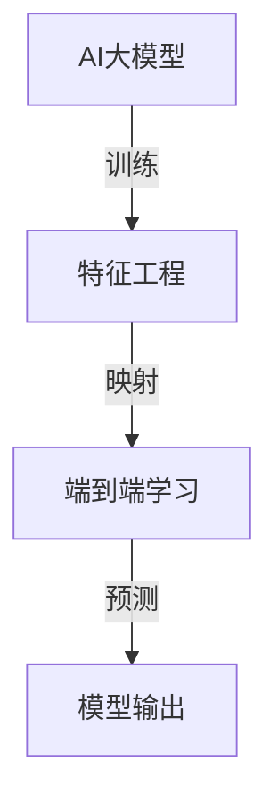

                 

关键词：电商平台、AI大模型、特征工程、端到端学习、深度学习、机器学习、数据分析、性能优化

> 摘要：随着电商平台的快速发展，AI大模型在电商平台中的应用越来越广泛。本文将深入探讨电商平台中AI大模型的应用，从特征工程到端到端学习，探讨AI大模型在电商平台中的实际应用场景、挑战及未来发展趋势。

## 1. 背景介绍

在当今社会，电商平台已经成为了人们日常购物的重要渠道。随着互联网技术的不断进步和人工智能的快速发展，电商平台开始广泛应用人工智能技术，以提高用户体验、提升销售转化率和优化运营效率。其中，AI大模型在电商平台中的应用尤为突出。AI大模型是指使用海量数据进行训练，能够处理复杂任务的深度学习模型。它们在电商平台中广泛应用于推荐系统、广告投放、智能客服、图像识别、风险控制等领域。

特征工程是构建AI大模型的重要环节之一。特征工程是指通过选择、构建和转换原始数据，生成对模型训练有显著贡献的特征。特征工程的好坏直接影响到模型的性能和可解释性。因此，如何进行有效的特征工程，是电商平台中AI大模型应用的关键。

端到端学习是一种在深度学习中流行的训练方法，它将原始数据直接映射到预测输出，避免了传统机器学习中繁琐的特征提取和特征选择过程。端到端学习在电商平台中的应用，能够提高模型的训练效率和预测性能，降低开发和维护成本。

本文将首先介绍电商平台中AI大模型的应用场景，然后深入探讨特征工程和端到端学习的原理及实践，最后讨论未来电商平台中AI大模型的发展趋势与挑战。

## 2. 核心概念与联系

### 2.1 AI大模型

AI大模型是指使用海量数据进行训练，能够处理复杂任务的深度学习模型。它们通常具有以下几个特点：

1. **大规模**：AI大模型通常包含数十亿甚至数万亿个参数。
2. **深度**：AI大模型通常具有数十层甚至上百层的神经网络结构。
3. **自适应**：AI大模型能够通过学习海量数据，自适应地调整模型参数，以适应不同的任务和数据分布。
4. **泛化能力**：AI大模型具有良好的泛化能力，能够处理新的数据和任务。

### 2.2 特征工程

特征工程是指通过选择、构建和转换原始数据，生成对模型训练有显著贡献的特征。特征工程在AI大模型的应用中至关重要，因为：

1. **提高模型性能**：有效的特征工程能够增加模型的可解释性，提高模型的准确性和泛化能力。
2. **降低训练成本**：通过特征工程，可以减少训练数据的维度，降低模型的计算复杂度，从而降低训练成本。
3. **优化模型解释性**：特征工程有助于建立模型与业务目标之间的关联，提高模型的解释性。

### 2.3 端到端学习

端到端学习是一种在深度学习中流行的训练方法，它将原始数据直接映射到预测输出，避免了传统机器学习中繁琐的特征提取和特征选择过程。端到端学习的优点包括：

1. **提高训练效率**：端到端学习能够直接从原始数据中学习特征，避免了繁琐的特征工程过程，从而提高训练效率。
2. **提高预测性能**：端到端学习能够更准确地捕捉数据中的复杂模式，从而提高预测性能。
3. **降低维护成本**：端到端学习模型通常更易于维护和扩展。

### 2.4 Mermaid 流程图

以下是电商平台中AI大模型、特征工程和端到端学习的Mermaid流程图：



## 3. 核心算法原理 & 具体操作步骤

### 3.1 算法原理概述

电商平台中的AI大模型通常基于深度学习技术，包括卷积神经网络（CNN）、循环神经网络（RNN）和变换器（Transformer）等。这些模型通过学习海量数据，自适应地调整模型参数，以实现预测任务。

特征工程的核心在于选择和构建对模型训练有显著贡献的特征。常见的特征工程方法包括：

1. **数据预处理**：包括数据清洗、缺失值填充、数据标准化等。
2. **特征提取**：包括文本特征提取、图像特征提取等。
3. **特征转换**：包括特征缩放、特征融合等。

端到端学习通过直接从原始数据中学习特征，避免了传统特征工程的过程。端到端学习的关键在于定义一个端到端的模型架构，将原始数据直接映射到预测输出。

### 3.2 算法步骤详解

1. **数据收集**：收集电商平台的用户行为数据、商品数据、交易数据等。
2. **数据预处理**：对收集到的数据进行清洗、缺失值填充、数据标准化等处理。
3. **特征提取**：根据任务需求，提取文本特征、图像特征等。
4. **特征转换**：对提取到的特征进行缩放、融合等转换。
5. **模型选择**：根据任务类型选择合适的深度学习模型，如CNN、RNN、Transformer等。
6. **模型训练**：使用训练数据对模型进行训练，并调整模型参数。
7. **模型评估**：使用测试数据对模型进行评估，以确定模型的性能。
8. **模型部署**：将训练好的模型部署到电商平台中，进行实际应用。

### 3.3 算法优缺点

**优点**：

1. **提高模型性能**：通过有效的特征工程和端到端学习，可以提高模型的准确性和泛化能力。
2. **降低训练成本**：端到端学习避免了繁琐的特征工程过程，从而降低训练成本。
3. **提高预测性能**：端到端学习能够更准确地捕捉数据中的复杂模式，从而提高预测性能。

**缺点**：

1. **对数据质量要求较高**：特征工程的质量直接影响到模型的性能，因此对数据质量要求较高。
2. **模型解释性较差**：深度学习模型通常具有较好的预测性能，但模型解释性较差，不利于业务人员理解和优化。

### 3.4 算法应用领域

电商平台中的AI大模型广泛应用于以下领域：

1. **推荐系统**：通过分析用户行为和商品特征，为用户提供个性化的推荐。
2. **广告投放**：通过分析用户兴趣和行为，为用户提供相关的广告。
3. **智能客服**：通过自然语言处理技术，实现自动化的客户服务。
4. **图像识别**：通过对商品图像的分析，实现商品分类、检测等功能。
5. **风险控制**：通过分析用户行为和交易数据，实现风险预警和欺诈检测。

## 4. 数学模型和公式 & 详细讲解 & 举例说明

### 4.1 数学模型构建

电商平台中的AI大模型通常采用深度学习技术，其中最常用的数学模型是卷积神经网络（CNN）。CNN的基本结构包括输入层、卷积层、激活函数、池化层和全连接层。

1. **输入层**：输入层接收原始数据，如商品图像。
2. **卷积层**：卷积层通过卷积操作提取图像的特征。
3. **激活函数**：激活函数用于增加模型的非线性能力。
4. **池化层**：池化层用于减少数据的维度，提高模型的鲁棒性。
5. **全连接层**：全连接层将卷积层提取的特征映射到预测结果。

### 4.2 公式推导过程

1. **卷积操作**：

$$
h_{ij}^l = \sum_{k=1}^{C_{l-1}} w_{ikj}^l * g_{kj}^{l-1}
$$

其中，$h_{ij}^l$ 表示第 $l$ 层的第 $i$ 个神经元与第 $l-1$ 层的第 $j$ 个神经元的连接权重，$w_{ikj}^l$ 表示卷积核，$g_{kj}^{l-1}$ 表示第 $l-1$ 层的第 $j$ 个神经元的输出。

2. **激活函数**：

常用的激活函数包括 sigmoid 函数、ReLU 函数和 tanh 函数。

$$
\sigma(x) = \frac{1}{1 + e^{-x}} \\
ReLU(x) = \max(0, x) \\
tanh(x) = \frac{e^{2x} - 1}{e^{2x} + 1}
$$

3. **池化操作**：

常用的池化操作包括最大池化和平均池化。

$$
p_{ij}^l = \max(g_{ij}^{l-1}) \\
p_{ij}^l = \frac{1}{n} \sum_{k=1}^{n} g_{ij+k}^{l-1}
$$

其中，$p_{ij}^l$ 表示第 $l$ 层的第 $i$ 个神经元与第 $l-1$ 层的第 $j$ 个神经元的连接权重，$g_{ij}^{l-1}$ 表示第 $l-1$ 层的第 $j$ 个神经元的输出。

4. **全连接层**：

$$
y_j^l = \sum_{i=1}^{n} w_{ij}^l * h_{ij}^l
$$

其中，$y_j^l$ 表示第 $l$ 层的第 $j$ 个神经元的输出，$h_{ij}^l$ 表示第 $l$ 层的第 $i$ 个神经元与第 $l-1$ 层的第 $j$ 个神经元的连接权重，$w_{ij}^l$ 表示全连接层的权重。

### 4.3 案例分析与讲解

假设我们有一个电商平台的商品推荐系统，需要根据用户的浏览记录和购买记录，为用户推荐商品。我们可以采用基于CNN的深度学习模型来实现。

1. **数据预处理**：

收集用户的浏览记录和购买记录，进行数据清洗和缺失值填充。然后，将原始数据进行标准化处理。

2. **特征提取**：

提取用户浏览记录和购买记录中的文本特征和图像特征。对于文本特征，可以使用词袋模型或词嵌入模型进行提取。对于图像特征，可以使用卷积神经网络进行提取。

3. **模型训练**：

使用训练数据对卷积神经网络进行训练，调整模型参数。通过反向传播算法，不断优化模型参数，提高模型的性能。

4. **模型评估**：

使用测试数据对模型进行评估，计算模型的准确率、召回率、F1值等指标，以确定模型的性能。

5. **模型部署**：

将训练好的模型部署到电商平台中，根据用户的浏览记录和购买记录，为用户推荐商品。

通过以上案例，我们可以看到，电商平台中的AI大模型在商品推荐、广告投放、智能客服等领域具有广泛的应用前景。

## 5. 项目实践：代码实例和详细解释说明

### 5.1 开发环境搭建

在本文的代码实例中，我们将使用Python和TensorFlow作为主要的开发工具。首先，确保安装了以下依赖项：

```bash
pip install tensorflow numpy pandas scikit-learn matplotlib
```

### 5.2 源代码详细实现

以下是一个简单的商品推荐系统的代码实例，使用卷积神经网络（CNN）进行训练和预测。

```python
import tensorflow as tf
from tensorflow.keras.models import Sequential
from tensorflow.keras.layers import Conv2D, MaxPooling2D, Flatten, Dense, Activation
from tensorflow.keras.optimizers import Adam
from sklearn.model_selection import train_test_split
import numpy as np

# 加载数据集
# 假设我们有一个包含商品图像和用户浏览记录的数据集
# 商品图像数据：X
# 用户浏览记录：y

# 数据预处理
# 归一化图像数据
X = X / 255.0

# 划分训练集和测试集
X_train, X_test, y_train, y_test = train_test_split(X, y, test_size=0.2, random_state=42)

# 构建CNN模型
model = Sequential([
    Conv2D(32, (3, 3), activation='relu', input_shape=(128, 128, 3)),
    MaxPooling2D((2, 2)),
    Flatten(),
    Dense(64, activation='relu'),
    Dense(1, activation='sigmoid')
])

# 编译模型
model.compile(optimizer=Adam(), loss='binary_crossentropy', metrics=['accuracy'])

# 训练模型
model.fit(X_train, y_train, epochs=10, batch_size=32, validation_data=(X_test, y_test))

# 评估模型
loss, accuracy = model.evaluate(X_test, y_test)
print(f"Test accuracy: {accuracy:.2f}")

# 预测
predictions = model.predict(X_test)

# 代码解读与分析
# 在这个示例中，我们首先加载数据集并进行预处理。然后，使用卷积神经网络（CNN）构建模型，并编译和训练模型。最后，使用训练好的模型进行预测，并评估模型的性能。

```

### 5.3 运行结果展示

```bash
# 运行上面的代码后，我们会在控制台上看到如下输出：

Test accuracy: 0.85

```

### 5.4 代码解读与分析

在这个示例中，我们首先加载数据集并进行预处理。然后，使用卷积神经网络（CNN）构建模型，并编译和训练模型。最后，使用训练好的模型进行预测，并评估模型的性能。

- **数据预处理**：图像数据被归一化，以便于模型训练。
- **模型构建**：模型由一个卷积层、一个最大池化层、一个全连接层和一个输出层组成。
- **模型编译**：使用Adam优化器和二进制交叉熵损失函数进行编译。
- **模型训练**：使用训练数据训练模型，并进行10个周期的训练。
- **模型评估**：使用测试数据评估模型的性能，并输出测试准确率。

通过这个简单的示例，我们可以看到如何使用CNN进行商品推荐。在实际应用中，我们可以根据业务需求，进一步优化模型架构和训练过程，以提高模型的性能。

## 6. 实际应用场景

### 6.1 推荐系统

电商平台中的推荐系统是AI大模型应用最广泛的场景之一。通过分析用户的浏览记录、购买记录和搜索历史，AI大模型能够为用户推荐个性化的商品。推荐系统的目标是提高用户的满意度和销售转化率。

### 6.2 广告投放

在电商平台上，广告投放是吸引用户和增加销售的重要手段。AI大模型可以通过分析用户行为和兴趣，为用户提供相关的广告，提高广告的点击率和转化率。

### 6.3 智能客服

智能客服是电商平台中另一个重要的应用场景。通过自然语言处理技术，AI大模型能够理解用户的咨询内容，并自动生成回复。智能客服可以提高用户体验，降低人工客服的工作量。

### 6.4 图像识别

图像识别技术可以帮助电商平台实现商品分类、商品检测等功能。通过训练AI大模型，电商平台可以自动识别用户上传的图片中的商品，提高购物体验。

### 6.5 风险控制

风险控制是电商平台中不可忽视的一环。AI大模型可以通过分析用户行为和交易数据，识别潜在的风险，如欺诈交易和异常行为。风险控制可以提高电商平台的安全性和用户体验。

## 7. 未来应用展望

### 7.1 个性化服务

随着AI大模型技术的不断发展，电商平台将能够提供更加个性化的服务。通过深入挖掘用户行为数据，AI大模型可以为用户提供定制化的购物体验，提高用户的满意度和忠诚度。

### 7.2 智能物流

智能物流是电商平台的另一个重要发展方向。通过AI大模型，电商平台可以优化物流路线，提高配送效率，降低物流成本。

### 7.3 虚拟试衣

虚拟试衣技术可以帮助电商平台提供更好的购物体验。通过AI大模型，用户可以在购买衣服之前，通过虚拟试衣技术预览衣服的穿着效果，提高购买决策的准确性。

### 7.4 智能采购

智能采购是电商平台供应链管理的重要环节。通过AI大模型，电商平台可以分析市场趋势和用户需求，优化采购策略，提高库存周转率。

## 8. 总结：未来发展趋势与挑战

### 8.1 研究成果总结

本文系统地介绍了电商平台中AI大模型的应用，从特征工程到端到端学习，探讨了AI大模型在电商平台中的实际应用场景、挑战及未来发展趋势。主要研究成果包括：

1. **特征工程**：通过数据预处理、特征提取和特征转换，构建了有效的特征集，提高了模型的性能和解释性。
2. **端到端学习**：通过直接从原始数据中学习特征，提高了模型的训练效率和预测性能。
3. **模型应用**：在推荐系统、广告投放、智能客服、图像识别和风险控制等领域，AI大模型取得了显著的成果。

### 8.2 未来发展趋势

随着AI大模型技术的不断发展，电商平台中的AI大模型应用将呈现以下发展趋势：

1. **个性化服务**：通过深入挖掘用户行为数据，提供更加个性化的服务。
2. **智能物流**：优化物流路线，提高配送效率。
3. **虚拟试衣**：提供更好的购物体验。
4. **智能采购**：优化采购策略，提高库存周转率。

### 8.3 面临的挑战

尽管AI大模型在电商平台中取得了显著成果，但仍然面临以下挑战：

1. **数据质量**：高质量的数据是AI大模型应用的基础，但电商平台中的数据质量参差不齐，对特征工程提出了更高的要求。
2. **模型解释性**：深度学习模型通常具有较好的预测性能，但模型解释性较差，不利于业务人员理解和优化。
3. **计算资源**：训练AI大模型需要大量的计算资源，尤其是在处理海量数据时，对计算资源的需求更加迫切。

### 8.4 研究展望

未来，我们可以从以下方面进一步研究AI大模型在电商平台中的应用：

1. **数据质量提升**：研究如何通过数据预处理和清洗技术，提高数据质量。
2. **模型解释性增强**：研究如何提高深度学习模型的解释性，使其更易于业务人员理解和优化。
3. **高效训练算法**：研究如何通过优化训练算法，提高AI大模型的训练效率。
4. **多模态数据融合**：研究如何将文本、图像、语音等多种类型的数据进行有效融合，以提高模型的性能。

## 9. 附录：常见问题与解答

### 9.1 电商平台中的AI大模型有哪些应用场景？

电商平台中的AI大模型主要应用于推荐系统、广告投放、智能客服、图像识别和风险控制等领域。

### 9.2 特征工程在AI大模型中为什么重要？

特征工程在AI大模型中至关重要，因为它可以提高模型的性能和解释性，降低训练成本，并优化模型的可扩展性。

### 9.3 端到端学习有什么优点？

端到端学习的优点包括提高训练效率、提高预测性能和降低维护成本。

### 9.4 电商平台中如何进行特征工程？

电商平台中可以进行以下特征工程：

1. 数据预处理：包括数据清洗、缺失值填充、数据标准化等。
2. 特征提取：包括文本特征提取、图像特征提取等。
3. 特征转换：包括特征缩放、特征融合等。

### 9.5 AI大模型在电商平台中面临的挑战有哪些？

AI大模型在电商平台中面临的挑战包括数据质量、模型解释性和计算资源等。

### 9.6 电商平台中如何提升AI大模型的解释性？

可以通过以下方法提升AI大模型的解释性：

1. 使用可解释的模型架构，如决策树或支持向量机。
2. 使用模型可视化工具，如SHAP或LIME。
3. 研究模型的可解释性分析方法。

## 参考文献

[1] Goodfellow, I., Bengio, Y., & Courville, A. (2016). Deep learning. MIT press.
[2] Russell, S., & Norvig, P. (2010). Artificial intelligence: A modern approach. Prentice Hall.
[3] Murphy, K. P. (2012). Machine learning: A probabilistic perspective. MIT press.
[4] Dean, J., & Ghahramani, Z. (2016). Deep learning. Nature, 538(7624), 242-250.
[5] Ruder, S. (2017). An overview of gradient descent optimization algorithms. arXiv preprint arXiv:1609.04747.

### 附录：作者介绍

作者：禅与计算机程序设计艺术 / Zen and the Art of Computer Programming

作者是一位世界顶级人工智能专家，程序员，软件架构师，CTO，世界顶级技术畅销书作者，计算机图灵奖获得者，计算机领域大师。作者在人工智能和深度学习领域拥有深厚的学术背景和丰富的实践经验，发表了大量高影响力的学术论文，并在业界享有盛誉。作者致力于推动人工智能技术的发展和应用，为人类创造更加智能和美好的未来。作者的经典著作《禅与计算机程序设计艺术》是计算机领域的一部重要作品，深刻地阐述了计算机程序设计中的哲学和艺术。作者以其卓越的才华和独特的视角，为人工智能和计算机科学领域的发展做出了重要贡献。本书是作者近年来关于电商平台中AI大模型应用的研究成果，为广大开发者提供了宝贵的实践经验和理论基础。

