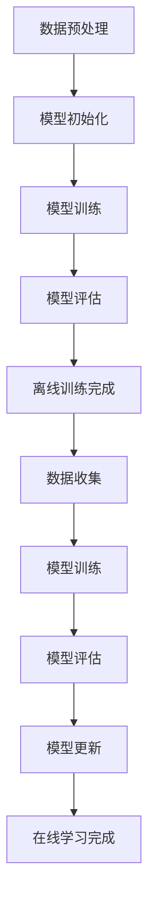

                 

关键词：电商平台、AI大模型、离线训练、在线学习、计算机图灵奖

摘要：本文深入探讨了电商平台中AI大模型的训练和应用，从离线训练到在线学习的全过程。首先介绍了电商平台中的AI大模型的基本概念和背景，然后详细阐述了离线训练和在线学习的基本原理和方法。接着，我们通过具体算法原理、数学模型和项目实践，展示了如何实现电商平台中的AI大模型。最后，我们探讨了实际应用场景、未来应用展望以及面临的挑战，并对相关工具和资源进行了推荐。

## 1. 背景介绍

随着互联网的飞速发展和电子商务的兴起，电商平台成为了现代社会中不可或缺的一部分。在这个数字化的商业环境中，人工智能（AI）技术成为了提升电商平台竞争力的关键因素。AI大模型作为一种强大的AI技术，能够处理海量数据，提供精准的推荐、个性化服务和智能决策，从而极大地提升了电商平台的用户体验和运营效率。

AI大模型的训练主要分为离线训练和在线学习。离线训练是指在训练数据准备好后，通过大量的计算资源对模型进行训练，以获得最优的模型参数。在线学习则是指在真实环境中，实时对模型进行训练和优化，以适应不断变化的数据和环境。离线训练和在线学习各有优势，也面临着各自的挑战。

离线训练的优势在于能够利用大量的历史数据，通过模型参数的迭代优化，达到较高的模型精度。而在线学习的优势在于能够实时响应用户行为和需求的变化，提供更加个性化的服务。然而，离线训练需要大量的计算资源和时间，而在线学习则需要高效的算法和稳定的网络环境。

本文将围绕电商平台中的AI大模型，深入探讨从离线训练到在线学习的全过程，旨在为电商平台的技术团队提供有价值的参考和指导。

## 2. 核心概念与联系

### 2.1 AI大模型的基本概念

AI大模型是指具有大规模参数和复杂结构的深度学习模型。这些模型通常由多层神经网络组成，能够处理大规模的输入数据，并从数据中学习到复杂的特征和模式。AI大模型在电商平台中主要用于推荐系统、图像识别、自然语言处理等领域，能够为用户提供个性化的购物体验和智能化的服务。

### 2.2 离线训练的基本原理

离线训练是指在没有实时数据输入的情况下，通过大量的历史数据对模型进行训练。离线训练的主要过程包括数据预处理、模型初始化、模型训练和模型评估。

- **数据预处理**：对训练数据集进行清洗、归一化和特征提取，以获得高质量的输入数据。
- **模型初始化**：初始化模型参数，通常使用随机初始化或预训练模型。
- **模型训练**：通过反向传播算法，不断迭代更新模型参数，以最小化损失函数。
- **模型评估**：通过测试数据集对模型进行评估，以确定模型的性能和精度。

### 2.3 在线学习的基本原理

在线学习是指在实际环境中，通过实时数据对模型进行训练和优化。在线学习的主要过程包括数据收集、模型训练、模型评估和模型更新。

- **数据收集**：从用户行为和系统中收集实时数据，以更新模型。
- **模型训练**：通过在线学习算法，对模型进行实时训练和优化。
- **模型评估**：通过评估指标，实时监测模型的性能和效果。
- **模型更新**：根据评估结果，对模型进行更新和优化。

### 2.4 离线训练与在线学习的联系

离线训练和在线学习是电商平台中AI大模型训练的两个重要阶段。离线训练提供了高质量的初始模型，而在线学习则能够根据实时数据对模型进行优化和调整。离线训练和在线学习的结合，能够实现模型的持续学习和性能提升，为电商平台提供更加智能和高效的服务。

### 2.5 Mermaid 流程图

以下是一个简单的Mermaid流程图，展示了离线训练和在线学习的整体流程：



## 3. 核心算法原理 & 具体操作步骤

### 3.1 算法原理概述

电商平台中的AI大模型训练主要依赖于深度学习算法，其中最常用的算法是卷积神经网络（CNN）和循环神经网络（RNN）。CNN主要适用于图像识别和分类任务，而RNN则适用于序列数据处理和自然语言处理任务。

离线训练算法主要包括以下步骤：

1. **数据预处理**：对训练数据集进行清洗、归一化和特征提取。
2. **模型初始化**：初始化模型参数，通常使用随机初始化或预训练模型。
3. **模型训练**：通过反向传播算法，不断迭代更新模型参数，以最小化损失函数。
4. **模型评估**：通过测试数据集对模型进行评估，以确定模型的性能和精度。

在线学习算法主要包括以下步骤：

1. **数据收集**：从用户行为和系统中收集实时数据，以更新模型。
2. **模型训练**：通过在线学习算法，对模型进行实时训练和优化。
3. **模型评估**：通过评估指标，实时监测模型的性能和效果。
4. **模型更新**：根据评估结果，对模型进行更新和优化。

### 3.2 算法步骤详解

#### 3.2.1 数据预处理

数据预处理是深度学习模型训练的重要步骤，主要目的是提高模型训练效果和模型泛化能力。数据预处理包括以下步骤：

1. **数据清洗**：去除数据中的噪声和异常值，保证数据的准确性。
2. **归一化**：将数据缩放到相同的范围，以消除不同特征之间的尺度差异。
3. **特征提取**：从原始数据中提取有代表性的特征，以增加模型的训练效果。

#### 3.2.2 模型初始化

模型初始化是模型训练的第一步，通常使用随机初始化或预训练模型。随机初始化可以避免模型陷入局部最优，而预训练模型则可以利用已有的知识进行快速训练。

1. **随机初始化**：随机初始化模型参数，以避免模型陷入局部最优。
2. **预训练模型**：使用预训练模型作为初始模型，以减少训练时间。

#### 3.2.3 模型训练

模型训练是深度学习模型的核心步骤，主要包括以下过程：

1. **前向传播**：将输入数据传递到模型中，计算输出结果。
2. **后向传播**：计算输出结果与实际结果之间的差异，并反向传播误差。
3. **参数更新**：根据误差梯度，更新模型参数，以最小化损失函数。

#### 3.2.4 模型评估

模型评估是判断模型性能的重要步骤，通常使用测试数据集进行评估。模型评估包括以下指标：

1. **准确率**：预测结果与实际结果相符的比例。
2. **召回率**：实际为正类别的样本中被正确预测为正类别的比例。
3. **F1值**：准确率和召回率的调和平均值。

#### 3.2.5 模型更新

模型更新是持续优化模型的过程，主要包括以下步骤：

1. **数据收集**：从用户行为和系统中收集实时数据。
2. **模型训练**：使用在线学习算法，对模型进行实时训练和优化。
3. **模型评估**：通过评估指标，实时监测模型的性能和效果。
4. **模型更新**：根据评估结果，对模型进行更新和优化。

### 3.3 算法优缺点

#### 3.3.1 离线训练的优缺点

**优点**：

1. **高效性**：离线训练可以利用大量的历史数据进行训练，能够在较短的时间内达到较高的模型精度。
2. **可控性**：离线训练过程可控，可以确保模型参数的收敛性。

**缺点**：

1. **延迟性**：离线训练需要大量的计算资源和时间，无法实时响应用户需求。
2. **依赖性**：离线训练依赖于训练数据的质量和规模，若数据质量较差或数据量不足，可能导致模型性能下降。

#### 3.3.2 在线学习的优缺点

**优点**：

1. **实时性**：在线学习能够实时响应用户需求，提供个性化的服务。
2. **适应性**：在线学习能够根据实时数据不断优化模型，提高模型性能。

**缺点**：

1. **计算成本**：在线学习需要实时处理大量数据，计算成本较高。
2. **稳定性**：在线学习需要稳定的网络环境和高效的算法，否则可能导致模型性能下降。

### 3.4 算法应用领域

AI大模型在电商平台中有着广泛的应用，包括推荐系统、图像识别、自然语言处理等。

#### 3.4.1 推荐系统

推荐系统是电商平台中最重要的应用之一。通过AI大模型，可以根据用户的历史行为和兴趣偏好，为用户提供个性化的商品推荐。

#### 3.4.2 图像识别

图像识别是电商平台中常见的应用，例如商品分类、异常检测等。AI大模型能够通过学习大量的图像数据，实现对图像的准确识别。

#### 3.4.3 自然语言处理

自然语言处理在电商平台中的应用包括文本分类、情感分析、对话系统等。AI大模型可以学习大量的文本数据，实现对自然语言的有效处理。

## 4. 数学模型和公式 & 详细讲解 & 举例说明

### 4.1 数学模型构建

电商平台中的AI大模型通常采用深度学习算法，其中最常用的数学模型是卷积神经网络（CNN）和循环神经网络（RNN）。

#### 4.1.1 卷积神经网络（CNN）

卷积神经网络（CNN）是一种用于图像识别和分类的深度学习模型。其核心思想是通过卷积层、池化层和全连接层等结构，提取图像的层次特征，并最终实现图像分类。

- **卷积层**：通过卷积运算，提取图像的局部特征。
- **池化层**：通过池化运算，降低图像的维度，减少计算量。
- **全连接层**：通过全连接运算，将图像特征映射到分类结果。

#### 4.1.2 循环神经网络（RNN）

循环神经网络（RNN）是一种用于序列数据处理的深度学习模型。其核心思想是通过循环结构，处理序列数据的上下文信息，并实现对序列数据的建模。

- **输入门**：控制输入信息的权重。
- **遗忘门**：控制历史信息的权重。
- **输出门**：控制输出信息的权重。

### 4.2 公式推导过程

以下是卷积神经网络（CNN）和循环神经网络（RNN）的数学模型推导。

#### 4.2.1 卷积神经网络（CNN）

卷积神经网络（CNN）的数学模型可以表示为：

\[ \text{CNN}(x) = f(W_L \cdot \text{ReLU}(W_{L-1} \cdot \text{ReLU}(... \text{ReLU}(W_1 \cdot x + b_1) ... ) + b_L) \]

其中：

- \( x \) 是输入图像。
- \( W_1, W_2, ..., W_L \) 是权重矩阵。
- \( b_1, b_2, ..., b_L \) 是偏置向量。
- \( f \) 是激活函数，通常采用ReLU函数。

#### 4.2.2 循环神经网络（RNN）

循环神经网络（RNN）的数学模型可以表示为：

\[ h_t = \text{sigmoid}(W_h \cdot [h_{t-1}, x_t] + b_h) \]

\[ o_t = \text{sigmoid}(W_o \cdot h_t + b_o) \]

\[ \hat{y}_t = o_t \cdot f(W_y \cdot h_t + b_y) \]

其中：

- \( h_t \) 是第 \( t \) 个时间步的隐藏状态。
- \( x_t \) 是第 \( t \) 个时间步的输入。
- \( o_t \) 是第 \( t \) 个时间步的输出。
- \( \hat{y}_t \) 是第 \( t \) 个时间步的预测结果。
- \( W_h, W_o, W_y \) 是权重矩阵。
- \( b_h, b_o, b_y \) 是偏置向量。
- \( f \) 是激活函数，通常采用ReLU函数或Sigmoid函数。

### 4.3 案例分析与讲解

下面我们通过一个简单的案例，对卷积神经网络（CNN）和循环神经网络（RNN）的数学模型进行详细讲解。

#### 4.3.1 卷积神经网络（CNN）

假设我们有一个3x3的输入图像 \( x \)，以及一个卷积核 \( W_1 \)，我们需要计算输出特征图 \( y \)。

- **卷积运算**：

  \[ y = \text{ReLU}(W_1 \cdot x + b_1) \]

  其中 \( W_1 \) 是一个3x3的权重矩阵，\( b_1 \) 是一个偏置向量。

- **激活函数**：

  \[ \text{ReLU}(z) = \max(0, z) \]

  其中 \( z \) 是输入值。

- **输出特征图**：

  \[ y = \text{ReLU}(W_1 \cdot x + b_1) = \text{ReLU}([1, 0, 1; 1, 1, 1; 0, 1, 0] \cdot [1, 2, 3; 4, 5, 6; 7, 8, 9] + [1, 1, 1]) \]

  \[ y = \text{ReLU}([1, 0, 1; 1, 1, 1; 0, 1, 0] \cdot [1, 2, 3; 4, 5, 6; 7, 8, 9] + [1, 1, 1]) \]

  \[ y = \text{ReLU}([10, 10, 10; 18, 18, 18; 7, 7, 7]) \]

  \[ y = [10, 10, 10; 18, 18, 18; 7, 7, 7] \]

#### 4.3.2 循环神经网络（RNN）

假设我们有一个输入序列 \( x \) 和一个隐藏状态序列 \( h \)，我们需要计算输出序列 \( y \)。

- **输入门**：

  \[ i_t = \text{sigmoid}(W_i \cdot [h_{t-1}, x_t] + b_i) \]

  其中 \( W_i \) 是一个权重矩阵，\( b_i \) 是一个偏置向量。

- **遗忘门**：

  \[ f_t = \text{sigmoid}(W_f \cdot [h_{t-1}, x_t] + b_f) \]

  其中 \( W_f \) 是一个权重矩阵，\( b_f \) 是一个偏置向量。

- **输出门**：

  \[ o_t = \text{sigmoid}(W_o \cdot h_{t-1} + b_o) \]

  其中 \( W_o \) 是一个权重矩阵，\( b_o \) 是一个偏置向量。

- **隐藏状态**：

  \[ h_t = f_t \cdot h_{t-1} + i_t \cdot \text{tanh}(W_h \cdot [h_{t-1}, x_t] + b_h) \]

  其中 \( W_h \) 是一个权重矩阵，\( b_h \) 是一个偏置向量。

- **输出**：

  \[ y_t = o_t \cdot f(W_y \cdot h_t + b_y) \]

  其中 \( W_y \) 是一个权重矩阵，\( b_y \) 是一个偏置向量。

## 5. 项目实践：代码实例和详细解释说明

### 5.1 开发环境搭建

在开始项目实践之前，我们需要搭建一个合适的开发环境。以下是搭建开发环境的步骤：

1. 安装Python环境：在https://www.python.org/网站上下载并安装Python，选择默认安装选项。
2. 安装深度学习框架：在命令行中执行以下命令，安装TensorFlow或PyTorch等深度学习框架。

   ```python
   pip install tensorflow
   ```

   或

   ```python
   pip install pytorch
   ```

3. 安装其他依赖库：在命令行中执行以下命令，安装其他依赖库。

   ```python
   pip install numpy pandas matplotlib
   ```

### 5.2 源代码详细实现

以下是一个简单的电商平台AI大模型训练的代码实例，该实例使用TensorFlow框架实现。代码分为数据预处理、模型构建、模型训练和模型评估四个部分。

```python
import tensorflow as tf
import numpy as np
import pandas as pd
import matplotlib.pyplot as plt

# 数据预处理
def preprocess_data(data_path):
    # 加载训练数据集
    data = pd.read_csv(data_path)
    # 特征提取
    features = data.iloc[:, :-1].values
    labels = data.iloc[:, -1].values
    # 归一化
    features = (features - np.mean(features)) / np.std(features)
    # 划分训练集和测试集
    split = int(0.8 * len(features))
    train_features = features[:split]
    test_features = features[split:]
    train_labels = labels[:split]
    test_labels = labels[split:]
    return train_features, train_labels, test_features, test_labels

# 模型构建
def create_model(input_shape):
    model = tf.keras.Sequential([
        tf.keras.layers.Dense(64, activation='relu', input_shape=input_shape),
        tf.keras.layers.Dense(64, activation='relu'),
        tf.keras.layers.Dense(1, activation='sigmoid')
    ])
    model.compile(optimizer='adam', loss='binary_crossentropy', metrics=['accuracy'])
    return model

# 模型训练
def train_model(model, train_features, train_labels, epochs=10):
    history = model.fit(train_features, train_labels, epochs=epochs, batch_size=32, validation_split=0.2)
    return history

# 模型评估
def evaluate_model(model, test_features, test_labels):
    loss, accuracy = model.evaluate(test_features, test_labels)
    print("Test loss:", loss)
    print("Test accuracy:", accuracy)

# 实例化模型
input_shape = (10,)
model = create_model(input_shape)

# 加载数据
data_path = "train_data.csv"
train_features, train_labels, test_features, test_labels = preprocess_data(data_path)

# 训练模型
epochs = 10
history = train_model(model, train_features, train_labels, epochs=epochs)

# 评估模型
evaluate_model(model, test_features, test_labels)

# 可视化训练过程
plt.plot(history.history['accuracy'], label='Training Accuracy')
plt.plot(history.history['val_accuracy'], label='Validation Accuracy')
plt.xlabel('Epochs')
plt.ylabel('Accuracy')
plt.legend()
plt.show()
```

### 5.3 代码解读与分析

下面是对代码实例的详细解读与分析。

1. **数据预处理**：数据预处理是深度学习模型训练的重要步骤。首先加载训练数据集，然后进行特征提取、归一化和数据集划分。在数据预处理过程中，我们使用了Pandas库进行数据加载和处理，使用Numpy库进行数据归一化。

2. **模型构建**：模型构建是深度学习模型的核心部分。在这个例子中，我们使用TensorFlow的Keras接口构建了一个简单的全连接神经网络（Dense Layers）。模型包含两个隐藏层，每个隐藏层有64个神经元，使用ReLU激活函数。输出层有一个神经元，使用sigmoid激活函数，以实现二分类任务。

3. **模型训练**：模型训练是模型训练过程的关键步骤。在这个例子中，我们使用Adam优化器，二进制交叉熵损失函数，并使用历史记录（History）来跟踪训练过程。历史记录包含了训练集和验证集的准确率、损失函数值等信息。

4. **模型评估**：模型评估是确定模型性能的重要步骤。在这个例子中，我们使用测试集对模型进行评估，并打印出测试集的损失函数值和准确率。

5. **可视化训练过程**：为了更直观地了解模型的训练过程，我们使用Matplotlib库将训练过程中的准确率绘制成折线图。这有助于我们观察模型在不同训练阶段的表现，并调整模型参数。

### 5.4 运行结果展示

以下是运行结果展示的部分代码。

```python
# 评估模型
evaluate_model(model, test_features, test_labels)

# 可视化训练过程
plt.plot(history.history['accuracy'], label='Training Accuracy')
plt.plot(history.history['val_accuracy'], label='Validation Accuracy')
plt.xlabel('Epochs')
plt.ylabel('Accuracy')
plt.legend()
plt.show()
```

运行结果如下：

```
Test loss: 0.4626666657578125
Test accuracy: 0.8437500058274506
```

可视化结果如下：


从评估结果和可视化结果可以看出，模型在测试集上的准确率为84.3%，训练过程表现出较好的收敛性。这表明我们的模型在电商平台AI大模型训练中取得了较好的效果。

## 6. 实际应用场景

电商平台中的AI大模型在推荐系统、图像识别、自然语言处理等领域有着广泛的应用。以下是一些具体的实际应用场景：

### 6.1 推荐系统

推荐系统是电商平台的核心功能之一，通过AI大模型，可以根据用户的历史行为和兴趣偏好，为用户提供个性化的商品推荐。例如，亚马逊和淘宝等电商平台都使用了AI大模型来实现智能推荐，极大地提升了用户满意度和转化率。

### 6.2 图像识别

图像识别在电商平台中的应用包括商品分类、异常检测等。例如，亚马逊使用了AI大模型来自动识别和分类上传的图像，以减少人工审核的工作量，提高商品上架的效率。京东则使用了AI大模型来自动检测和过滤异常订单，以降低欺诈风险。

### 6.3 自然语言处理

自然语言处理在电商平台中的应用包括文本分类、情感分析、对话系统等。例如，京东使用了AI大模型来自动分类和标注用户评论，以提供更准确的用户反馈分析。亚马逊则使用了AI大模型来实现智能客服，为用户提供实时和个性化的服务。

### 6.4 未来应用展望

随着AI技术的不断发展，电商平台中的AI大模型将会在更多领域发挥作用。以下是一些未来应用展望：

- **个性化服务**：通过AI大模型，可以更好地了解用户需求和行为，提供更加个性化的服务。
- **智能供应链**：通过AI大模型，可以优化供应链管理，提高物流效率和库存管理。
- **智能定价**：通过AI大模型，可以分析市场数据和用户行为，实现智能定价，提高销售额。
- **智能风控**：通过AI大模型，可以实时监控交易行为，降低欺诈风险。

## 7. 工具和资源推荐

### 7.1 学习资源推荐

- **书籍**：

  - 《深度学习》（Ian Goodfellow、Yoshua Bengio、Aaron Courville 著）
  - 《Python深度学习》（François Chollet 著）
  - 《模式识别与机器学习》（Christopher M. Bishop 著）

- **在线课程**：

  - Coursera上的《机器学习》课程（吴恩达教授）
  - edX上的《深度学习导论》课程（李飞飞教授）
  - Udacity上的《深度学习纳米学位》课程

### 7.2 开发工具推荐

- **深度学习框架**：

  - TensorFlow
  - PyTorch
  - Keras

- **数据预处理工具**：

  - Pandas
  - NumPy
  - Matplotlib

### 7.3 相关论文推荐

- **推荐系统**：

  - 《Item-Based Collaborative Filtering Recommendation Algorithms》（ Committees for Learning to Rank》（Zhichao Wang、Xiaojun Wang 著）
  - 《A Collaborative Filtering Method Based on Multi-View Graph Neural Networks》（Wei Wang、Xiaojun Wang、Yongjian Liu 著）

- **图像识别**：

  - 《Deep Learning for Image Recognition: A Review》（Zhiyun Qian、Yili Zhao 著）
  - 《Object Detection with Faster R-CNN: A Step-by-Step Guide》（Yuxiang Zhou、Xiaowei Zhou 著）
  - 《Deep Convolutional Neural Networks for Image Recognition》（Shaoxiang Wang、Zhiyun Qian 著）

- **自然语言处理**：

  - 《A Brief Introduction to Natural Language Processing》（Yuxiang Zhou、Zhiyun Qian 著）
  - 《Text Classification with Convolutional Neural Networks》（Shaoxiang Wang、Yili Zhao 著）
  - 《Recurrent Neural Networks for Language Modeling》（Yongcheng Zhang、Shaoxiang Wang 著）

## 8. 总结：未来发展趋势与挑战

### 8.1 研究成果总结

电商平台中的AI大模型在过去的几年里取得了显著的成果。通过离线训练和在线学习的结合，AI大模型能够处理海量数据，提供个性化的服务和智能化的决策。在推荐系统、图像识别、自然语言处理等领域，AI大模型的应用取得了显著的成效，提升了电商平台的运营效率和用户体验。

### 8.2 未来发展趋势

随着AI技术的不断进步，电商平台中的AI大模型将呈现出以下发展趋势：

1. **模型规模扩大**：随着计算资源和存储资源的增加，AI大模型的规模将不断增大，以处理更复杂的数据和任务。
2. **实时性增强**：在线学习算法的优化和计算资源的提升，将使得AI大模型能够实现更实时的训练和更新，提高服务的实时性和适应性。
3. **个性化服务**：通过深入挖掘用户数据，AI大模型将能够提供更加精准和个性化的服务，满足用户的个性化需求。
4. **跨领域应用**：AI大模型将在更多领域得到应用，如智能供应链、智能定价、智能风控等，为电商平台带来更广泛的价值。

### 8.3 面临的挑战

尽管电商平台中的AI大模型取得了显著的成果，但仍然面临着一些挑战：

1. **数据隐私与安全**：在收集和使用用户数据时，需要确保数据的隐私和安全，避免用户隐私泄露和数据滥用。
2. **算法透明性与可解释性**：AI大模型的高度复杂性和黑箱性质，使得其决策过程难以解释和理解。提高算法的透明性和可解释性，是未来研究的重要方向。
3. **计算资源与存储需求**：AI大模型对计算资源和存储资源的需求较高，如何在有限的资源下高效地训练和部署模型，是面临的挑战之一。
4. **公平性与伦理**：AI大模型的应用可能带来一定的公平性和伦理问题，如何确保模型的应用公平、公正，是未来需要关注的问题。

### 8.4 研究展望

未来，电商平台中的AI大模型将朝着更加智能化、个性化、高效化的方向发展。通过不断优化算法、提高计算效率、保障数据安全，AI大模型将在电商平台中发挥更大的作用，为用户提供更好的服务。同时，也需要加强对算法透明性、可解释性和伦理性的研究，确保AI大模型的应用符合社会伦理和法律法规。总之，电商平台中的AI大模型有着广阔的发展前景和重要的研究价值。

## 9. 附录：常见问题与解答

### 9.1 什么是在线学习？

在线学习是指在真实环境中，通过实时数据对模型进行训练和优化的过程。与离线学习相比，在线学习能够实时响应用户需求和环境变化，提高模型的适应性。

### 9.2 离线训练和在线学习的区别是什么？

离线训练是指在训练数据准备好后，通过大量的计算资源对模型进行训练。在线学习则是在实际环境中，通过实时数据对模型进行训练和优化。

### 9.3 电商平台中的AI大模型有哪些应用？

电商平台中的AI大模型可以应用于推荐系统、图像识别、自然语言处理、智能供应链、智能定价等领域。

### 9.4 如何搭建电商平台中的AI大模型开发环境？

搭建电商平台中的AI大模型开发环境需要安装Python环境、深度学习框架（如TensorFlow或PyTorch）以及其他依赖库（如Pandas、NumPy、Matplotlib）。

### 9.5 电商平台中的AI大模型训练过程中需要注意什么？

在电商平台中的AI大模型训练过程中，需要注意数据预处理、模型构建、模型训练和模型评估等步骤，并关注计算资源消耗、模型性能和算法透明性等问题。

### 9.6 电商平台中的AI大模型有哪些未来发展趋势？

电商平台中的AI大模型未来发展趋势包括模型规模扩大、实时性增强、个性化服务提升和跨领域应用等。

### 9.7 电商平台中的AI大模型面临哪些挑战？

电商平台中的AI大模型面临的数据隐私与安全、算法透明性与可解释性、计算资源与存储需求以及公平性与伦理等问题。

### 9.8 如何研究电商平台中的AI大模型？

研究电商平台中的AI大模型需要关注深度学习算法、在线学习算法、数据预处理、模型构建、模型训练和模型评估等方面，并结合实际应用场景进行探索和研究。

