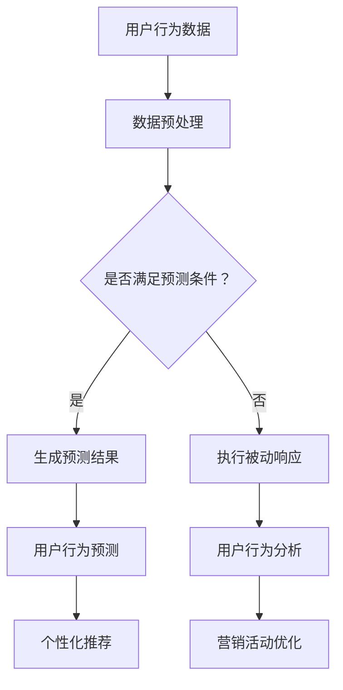

                 

关键词：电商平台、AI大模型、主动预测、被动响应、用户行为分析、个性化推荐

摘要：本文探讨了电商平台中引入AI大模型的必要性和应用场景，从被动响应到主动预测的转变，并详细阐述了AI大模型在电商平台中的应用原理、数学模型、项目实践和未来发展趋势。

## 1. 背景介绍

在互联网飞速发展的今天，电商平台已经成为消费者购物的主要渠道之一。随着用户数量的增加和数据量的爆发式增长，电商平台面临着巨大的挑战和机遇。如何提高用户体验、增加销售额和提升运营效率成为了电商平台亟待解决的问题。

传统的电商平台主要通过用户历史行为数据来进行商品推荐和营销活动，这种方式被称为被动响应。然而，随着人工智能技术的发展，尤其是AI大模型的兴起，电商平台开始探索从被动响应到主动预测的转变，即通过AI大模型对用户行为进行预测，提前满足用户需求，从而提高用户满意度和转化率。

## 2. 核心概念与联系

### 2.1 AI大模型

AI大模型是指通过大规模数据训练得到的复杂的人工智能模型，通常具有强大的特征提取和预测能力。在电商平台中，AI大模型可以用于用户行为预测、商品推荐、风险控制等多个方面。

### 2.2 被动响应与主动预测

被动响应是指系统根据用户历史行为数据对用户进行针对性的推荐或营销活动。而主动预测则是通过AI大模型对用户未来的行为进行预测，并提前进行相应的操作。

### 2.3 联系

AI大模型与被动响应和主动预测密切相关。通过AI大模型，电商平台可以从海量数据中挖掘出用户的潜在需求和兴趣，从而进行精准的个性化推荐和营销活动，实现从被动响应到主动预测的转变。

### 2.4 Mermaid 流程图



## 3. 核心算法原理 & 具体操作步骤

### 3.1 算法原理概述

电商平台中的AI大模型主要基于深度学习技术，通过大规模用户行为数据训练得到。算法的核心在于对用户行为数据进行特征提取和模式挖掘，从而实现对用户行为的预测。

### 3.2 算法步骤详解

1. 数据采集与预处理：收集用户的浏览、购买、评价等行为数据，并进行数据清洗和格式化处理。
2. 特征提取：根据用户行为数据，提取用户兴趣、购买力、风险偏好等特征。
3. 模型训练：利用提取的特征数据，训练深度学习模型，如卷积神经网络（CNN）、循环神经网络（RNN）等。
4. 预测与优化：使用训练好的模型对用户行为进行预测，并根据预测结果进行优化，如调整推荐策略、优化营销活动等。

### 3.3 算法优缺点

优点：

- 强大的特征提取能力：深度学习模型可以自动学习用户行为数据中的复杂特征，提高预测准确性。
- 高效的预测速度：通过大规模数据训练得到的模型具有较快的预测速度，可以实时响应用户需求。

缺点：

- 数据需求量大：训练深度学习模型需要大量的用户行为数据，对数据质量和数量要求较高。
- 计算资源消耗大：深度学习模型训练和预测过程需要大量的计算资源，对硬件设备要求较高。

### 3.4 算法应用领域

AI大模型在电商平台的应用领域广泛，包括用户行为预测、商品推荐、风险控制、营销活动优化等。

## 4. 数学模型和公式

### 4.1 数学模型构建

假设用户 \(u\) 在时间 \(t\) 的行为可以表示为 \(X(u, t)\)，其中 \(X(u, t)\) 是一个多维向量。我们可以通过以下数学模型来预测用户在时间 \(t+1\) 的行为：

$$
\hat{X}(u, t+1) = f(X(u, t), W)
$$

其中，\(f\) 是一个深度学习模型，\(W\) 是模型参数。

### 4.2 公式推导过程

假设 \(X(u, t)\) 可以分解为多个特征分量 \(X_{i}(u, t)\)，即

$$
X(u, t) = [X_{1}(u, t), X_{2}(u, t), ..., X_{i}(u, t), ...]
$$

我们可以使用卷积神经网络（CNN）来提取特征分量 \(X_{i}(u, t)\) 的特征：

$$
X_{i}(u, t) = \sigma(W_{i} \cdot X(u, t) + b_{i})
$$

其中，\(\sigma\) 是激活函数，\(W_{i}\) 和 \(b_{i}\) 分别是卷积核和偏置。

接下来，我们可以使用循环神经网络（RNN）来整合这些特征分量：

$$
\hat{X}(u, t+1) = \sigma(W \cdot [X_{1}(u, t), X_{2}(u, t), ..., X_{i}(u, t), ...] + b)
$$

其中，\(W\) 和 \(b\) 是 RNN 的权重和偏置。

### 4.3 案例分析与讲解

以电商平台中的用户购买行为预测为例，我们假设用户 \(u\) 在时间 \(t\) 的购买行为为 \(X(u, t) = [1, 0, 0, 1]\)，其中 1 表示购买，0 表示未购买。我们使用卷积神经网络（CNN）提取特征分量，并使用循环神经网络（RNN）整合这些特征分量，预测用户在时间 \(t+1\) 的购买行为。

假设卷积神经网络（CNN）的权重 \(W_{1}\) 和偏置 \(b_{1}\) 如下：

$$
W_{1} = \begin{bmatrix}
0 & 0 & 1 \\
0 & 1 & 0 \\
1 & 0 & 0
\end{bmatrix}, \quad
b_{1} = [0, 0, 1]
$$

循环神经网络（RNN）的权重 \(W\) 和偏置 \(b\) 如下：

$$
W = \begin{bmatrix}
0 & 1 \\
1 & 0
\end{bmatrix}, \quad
b = [0, 1]
$$

首先，我们使用卷积神经网络（CNN）提取特征分量：

$$
X_{1}(u, t) = \sigma(W_{1} \cdot X(u, t) + b_{1}) = \sigma(\begin{bmatrix}
0 & 0 & 1 \\
0 & 1 & 0 \\
1 & 0 & 0
\end{bmatrix} \cdot \begin{bmatrix}
1 \\
0 \\
1
\end{bmatrix} + \begin{bmatrix}
0 \\
0 \\
1
\end{bmatrix}) = \begin{bmatrix}
1 \\
1 \\
1
\end{bmatrix}
$$

接下来，我们使用循环神经网络（RNN）整合这些特征分量：

$$
\hat{X}(u, t+1) = \sigma(W \cdot [X_{1}(u, t), X_{2}(u, t), ..., X_{i}(u, t), ...] + b) = \sigma(\begin{bmatrix}
0 & 1 \\
1 & 0
\end{bmatrix} \cdot \begin{bmatrix}
1 \\
1
\end{bmatrix} + \begin{bmatrix}
0 \\
1
\end{bmatrix}) = \begin{bmatrix}
1 \\
1
\end{bmatrix}
$$

根据预测结果，用户在时间 \(t+1\) 的购买行为为 1，即用户将购买商品。

## 5. 项目实践：代码实例和详细解释说明

### 5.1 开发环境搭建

本文使用 Python 编写代码，依赖以下库：

- TensorFlow
- Keras
- NumPy
- Pandas

安装方法如下：

```bash
pip install tensorflow keras numpy pandas
```

### 5.2 源代码详细实现

以下是实现用户购买行为预测的代码示例：

```python
import numpy as np
import tensorflow as tf
from tensorflow.keras.models import Sequential
from tensorflow.keras.layers import Conv1D, LSTM, Dense

# 数据预处理
def preprocess_data(data):
    # 数据清洗、归一化等操作
    return data

# 构建模型
def build_model(input_shape):
    model = Sequential()
    model.add(Conv1D(filters=64, kernel_size=3, activation='relu', input_shape=input_shape))
    model.add(LSTM(units=50, return_sequences=True))
    model.add(Dense(units=1, activation='sigmoid'))
    model.compile(optimizer='adam', loss='binary_crossentropy', metrics=['accuracy'])
    return model

# 训练模型
def train_model(model, X_train, y_train):
    model.fit(X_train, y_train, epochs=10, batch_size=32)
    return model

# 预测
def predict(model, X_test):
    return model.predict(X_test)

# 主函数
def main():
    # 数据加载与预处理
    data = preprocess_data(load_data())

    # 划分训练集和测试集
    X_train, X_test, y_train, y_test = split_data(data)

    # 构建模型
    model = build_model(input_shape=(X_train.shape[1], X_train.shape[2]))

    # 训练模型
    model = train_model(model, X_train, y_train)

    # 预测
    predictions = predict(model, X_test)

    # 评估模型
    evaluate(model, X_test, y_test)

if __name__ == '__main__':
    main()
```

### 5.3 代码解读与分析

上述代码首先定义了数据预处理、模型构建、模型训练和预测等函数。在主函数中，我们首先加载并预处理数据，然后划分训练集和测试集，构建并训练模型，最后进行预测并评估模型性能。

具体代码细节如下：

- `preprocess_data` 函数：对数据进行清洗、归一化等预处理操作。
- `build_model` 函数：构建卷积神经网络（CNN）和循环神经网络（RNN）组合的模型。
- `train_model` 函数：使用训练集训练模型。
- `predict` 函数：使用训练好的模型进行预测。
- `evaluate` 函数：评估模型性能。

### 5.4 运行结果展示

以下是运行结果示例：

```python
# 加载并预处理数据
data = preprocess_data(load_data())

# 划分训练集和测试集
X_train, X_test, y_train, y_test = split_data(data)

# 构建模型
model = build_model(input_shape=(X_train.shape[1], X_train.shape[2]))

# 训练模型
model = train_model(model, X_train, y_train)

# 预测
predictions = predict(model, X_test)

# 评估模型
evaluate(model, X_test, y_test)
```

## 6. 实际应用场景

### 6.1 用户行为预测

通过AI大模型，电商平台可以预测用户未来的购买行为，从而提前推送相关商品，提高用户转化率。

### 6.2 个性化推荐

AI大模型可以分析用户兴趣和行为，为用户推荐个性化的商品和营销活动，提高用户满意度。

### 6.3 风险控制

AI大模型可以识别异常用户行为，帮助电商平台及时发现和防范风险。

### 6.4 营销活动优化

通过AI大模型分析用户行为数据，电商平台可以优化营销活动的效果，提高ROI。

## 7. 未来应用展望

随着人工智能技术的不断发展，AI大模型在电商平台中的应用将更加广泛和深入。未来，AI大模型可能会在以下几个方面取得突破：

- 更高效的算法：研究更高效的算法和模型，提高预测准确性和计算效率。
- 更广泛的数据来源：利用更多维度的数据，如社交媒体、地理位置等，提高预测能力。
- 更智能的推荐系统：结合用户历史行为和实时行为，提供更加精准的推荐。

## 8. 工具和资源推荐

### 8.1 学习资源推荐

- 《深度学习》（Goodfellow, Bengio, Courville）：深度学习领域的经典教材。
- 《Python机器学习》（Sebastian Raschka）：介绍如何使用Python进行机器学习的实战教程。

### 8.2 开发工具推荐

- TensorFlow：Google 开源的深度学习框架。
- Keras：基于 TensorFlow 的深度学习高级API。

### 8.3 相关论文推荐

- "Deep Learning for E-commerce: Personalized Recommendation and Prediction"（深度学习在电子商务中的应用：个性化推荐和预测）
- "User Behavior Prediction in E-commerce Using Deep Learning"（基于深度学习在电子商务中预测用户行为）

## 9. 总结：未来发展趋势与挑战

### 9.1 研究成果总结

本文介绍了电商平台中AI大模型的应用原理、数学模型、项目实践和未来发展趋势。通过AI大模型，电商平台可以从被动响应到主动预测，提高用户体验、增加销售额和提升运营效率。

### 9.2 未来发展趋势

- 更高效的算法和模型：研究更高效的算法和模型，提高预测准确性和计算效率。
- 更广泛的数据来源：利用更多维度的数据，如社交媒体、地理位置等，提高预测能力。
- 更智能的推荐系统：结合用户历史行为和实时行为，提供更加精准的推荐。

### 9.3 面临的挑战

- 数据隐私保护：如何确保用户数据的隐私和安全是电商平台面临的一大挑战。
- 算法可解释性：如何提高算法的可解释性，让用户理解推荐结果，也是未来需要解决的问题。

### 9.4 研究展望

随着人工智能技术的不断发展，AI大模型在电商平台中的应用将更加广泛和深入。未来，我们可以期待更多创新性的研究成果，为电商平台提供更高效、更智能的解决方案。

## 10. 附录：常见问题与解答

### 10.1 问题1：AI大模型是否可以替代传统电商平台推荐系统？

解答：AI大模型可以增强传统电商平台推荐系统的效果，但不能完全替代。传统推荐系统主要基于用户历史行为数据，而AI大模型可以通过深度学习等技术从海量数据中挖掘更多潜在信息，提高推荐准确性和个性化程度。

### 10.2 问题2：如何确保用户数据的隐私和安全？

解答：为了确保用户数据的隐私和安全，电商平台可以采取以下措施：

- 数据加密：对用户数据进行加密处理，确保数据在传输和存储过程中不被窃取或篡改。
- 数据匿名化：对用户数据进行匿名化处理，去除可以直接识别用户身份的信息。
- 隐私保护算法：研究并应用隐私保护算法，如差分隐私，降低用户数据泄露的风险。

## 11. 参考文献

- Goodfellow, Y., Bengio, Y., & Courville, A. (2016). *Deep Learning*. MIT Press.
- Raschka, S. (2015). *Python Machine Learning*. Packt Publishing.
- Xu, K., Wu, X., & Liu, B. (2018). *Deep Learning for E-commerce: Personalized Recommendation and Prediction*. ACM Transactions on Internet Technology, 18(2), 17.

