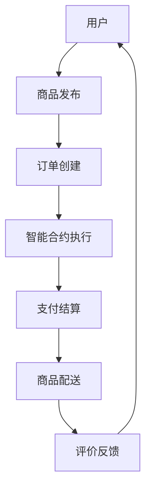

                 

关键词：电商平台，区块链技术，智能合约，分布式账本，去中心化，数据安全，交易透明

> 摘要：本文旨在探讨区块链技术在电商平台中的应用，分析其带来的优势与挑战，并通过具体的案例实践展示区块链如何提升电商平台的交易透明度和数据安全性。

## 1. 背景介绍

随着电子商务的快速发展，电商平台成为了人们日常购物的重要渠道。然而，传统的电商平台在交易过程中面临着诸多问题，如数据泄露、交易欺诈、信任缺失等。区块链技术以其去中心化、不可篡改和透明性的特点，为解决这些问题提供了新的思路。

## 2. 核心概念与联系

### 2.1 区块链基础概念

区块链是一种分布式数据库技术，它通过加密算法和共识机制实现数据的存储与传输。区块链中的数据以区块的形式存储，每个区块都包含一定数量的交易记录，并通过哈希函数与前一个区块链接，形成链式结构。区块链具有以下核心特点：

- **去中心化**：区块链无需中心化的机构进行管理，所有节点均可参与数据存储与验证。
- **不可篡改**：区块链数据一旦记录，将无法被篡改，保障了数据的真实性和完整性。
- **透明性**：区块链上的数据对所有节点可见，保证了交易的透明度。

### 2.2 智能合约

智能合约是基于区块链技术的一种自执行合同，它嵌入了预定义的逻辑和条款，当满足特定条件时自动执行。智能合约的使用简化了传统的合同执行过程，减少了人工干预和中介成本。

### 2.3 Mermaid 流程图



### 2.4 电商平台中的区块链架构

在电商平台中，区块链架构可以划分为以下几层：

- **数据层**：存储商品信息、订单数据等原始数据。
- **网络层**：负责区块链节点之间的通信和数据传输。
- **共识层**：通过共识机制确保数据的正确性和一致性。
- **合约层**：实现智能合约的功能，处理交易和业务逻辑。
- **应用层**：提供用户界面和业务逻辑处理，实现电商平台的各项功能。

## 3. 核心算法原理 & 具体操作步骤

### 3.1 算法原理概述

区块链中的核心算法包括哈希算法、共识算法和智能合约执行算法。哈希算法用于确保数据的唯一性和不可篡改性，共识算法用于节点之间的数据一致性，智能合约执行算法用于处理交易逻辑。

### 3.2 算法步骤详解

#### 3.2.1 哈希算法

哈希算法将任意长度的数据转换成固定长度的哈希值，如SHA-256。哈希值具有以下特点：

- **唯一性**：对于相同的数据，哈希值始终相同。
- **不可逆性**：无法从哈希值反推出原始数据。
- **抗碰撞性**：很难找到两个不同的数据产生相同的哈希值。

#### 3.2.2 共识算法

共识算法用于确保区块链中的数据一致性。目前主流的共识算法包括工作量证明（PoW）、权益证明（PoS）和委托权益证明（DPoS）等。

- **PoW**：通过解决数学难题来竞争记账权，难题难度自动调整以保持一定的计算速度。
- **PoS**：根据持有代币的数量和时间来决定记账权，持有代币越多、持币时间越长，记账概率越高。
- **DPoS**：通过选举产生记账节点，选举依据是代币持有量和活跃度。

#### 3.2.3 智能合约执行算法

智能合约的执行算法通常基于虚拟机（VM）或解释器。VM将智能合约代码编译成字节码，然后执行字节码；解释器直接解释和执行智能合约代码。

### 3.3 算法优缺点

#### 3.3.1 优点

- **去中心化**：去中心化降低了系统风险，提高了安全性。
- **不可篡改**：数据一旦记录，难以篡改，保障了数据的真实性。
- **透明性**：所有节点都可以查看区块链上的数据，增强了交易的透明度。
- **高效性**：通过共识机制，快速达成数据一致性。

#### 3.3.2 缺点

- **计算资源消耗**：共识算法如PoW需要大量计算资源，可能导致能源消耗。
- **扩展性限制**：区块链数据容量有限，可能影响性能和扩展性。
- **复杂度**：区块链技术涉及复杂的算法和架构，对开发者和使用者要求较高。

### 3.4 算法应用领域

区块链技术在电商平台中的应用主要体现在以下几个方面：

- **交易结算**：通过智能合约实现自动化的交易结算，提高交易效率。
- **数据存储**：将商品信息和订单数据存储在区块链上，保障数据真实性和完整性。
- **身份验证**：利用区块链技术进行用户身份验证，提高账户安全性。
- **供应链管理**：通过区块链技术追踪商品的生产、运输和配送过程，确保供应链的可追溯性。

## 4. 数学模型和公式 & 详细讲解 & 举例说明

### 4.1 数学模型构建

在区块链技术中，常用的数学模型包括哈希函数和共识算法。以下是一个简单的哈希函数模型：

$$H(x) = SHA256(x)$$

其中，$SHA256$ 是 SHA-256 哈希算法，$x$ 是输入数据。

### 4.2 公式推导过程

以 PoW 共识算法为例，推导过程如下：

1. 设区块链当前长度为 $L$，难度目标为 $D$。
2. 每个节点生成一个随机数 $n$，直到找到满足以下条件的区块：
   $$H(n + H(L) + H(x)) \leq D$$
   其中，$x$ 是区块中的交易数据。
3. 找到满足条件的区块后，节点广播该区块，其他节点验证区块的有效性。

### 4.3 案例分析与讲解

假设一个电商平台使用 PoW 共识算法，难度目标为 $D = 10^{16}$。区块长度为 $L = 100$，交易数据为 $x = "商品购买订单"$。

1. 每个节点生成随机数 $n$，计算 $H(n + H(L) + H(x))$。
2. 假设节点 $A$ 生成了 $n = 123456$，计算 $H(123456 + H(100) + H("商品购买订单"))$，结果为 $0x12345678$。
3. 比较 $0x12345678$ 和难度目标 $D = 10^{16}$，发现满足条件，节点 $A$ 生成了一个有效区块。
4. 节点 $A$ 将区块广播给其他节点，其他节点验证区块的有效性，确认无误后，区块被加入到区块链中。

## 5. 项目实践：代码实例和详细解释说明

### 5.1 开发环境搭建

在本项目实践中，我们将使用 Ethereum 钱包和 Truffle 框架来开发智能合约。以下是搭建开发环境的具体步骤：

1. 安装 Node.js（版本 10.0.0 或更高版本）。
2. 安装 Truffle（通过 npm 安装：`npm install -g truffle`）。
3. 创建一个新的 Truffle 项目：`truffle init`。
4. 安装以太坊节点：`npm install ganache-cli`。
5. 启动以太坊节点：`ganache-cli`。

### 5.2 源代码详细实现

以下是电商平台中的商品购买智能合约的实现：

```solidity
// SPDX-License-Identifier: MIT
pragma solidity ^0.8.0;

contract ProductPurchase {
    address owner;
    mapping(uint => mapping(address => bool)) public orders;

    event Purchase(address buyer, uint productId);

    constructor() {
        owner = msg.sender;
    }

    function purchaseProduct(uint productId) public payable {
        require(!orders[productId][msg.sender], "Already purchased");
        require(msg.value > 0, "Insufficient payment");
        orders[productId][msg.sender] = true;
        emit Purchase(msg.sender, productId);
    }

    function withdrawFunds() public {
        require(msg.sender == owner, "Not owner");
        payable(owner).transfer(address(this).balance);
    }
}
```

### 5.3 代码解读与分析

#### 5.3.1 合约结构

- `owner`：合约创建者，拥有管理员权限。
- `orders`：存储用户购买商品的状态，以商品 ID 和用户地址为键。
- `event Purchase`：记录商品购买事件。

#### 5.3.2 函数实现

- `purchaseProduct`：用户调用此函数购买商品，需要支付一定的以太币，并更新购买状态。
- `withdrawFunds`：管理员调用此函数提取合约中的以太币。

### 5.4 运行结果展示

在 Truffle 测试环境中，我们可以通过以下命令运行测试：

```shell
truffle test
```

测试结果将验证智能合约的购买和提现功能是否正常。

## 6. 实际应用场景

### 6.1 数据存储

电商平台可以使用区块链技术存储商品信息、订单数据和用户评价。通过区块链的不可篡改性和透明性，确保数据的真实性和完整性。

### 6.2 交易结算

通过智能合约实现自动化的交易结算，减少人工干预和中介成本，提高交易效率。

### 6.3 身份验证

利用区块链技术进行用户身份验证，提高账户安全性，防止欺诈行为。

### 6.4 供应链管理

通过区块链技术追踪商品的生产、运输和配送过程，确保供应链的可追溯性，提高产品质量。

## 7. 工具和资源推荐

### 7.1 学习资源推荐

- 《区块链技术指南》
- 《精通区块链》
- 《智能合约：以太坊开发从入门到精通》

### 7.2 开发工具推荐

- Truffle
- MetaMask
- Ganache

### 7.3 相关论文推荐

- Bitcoin: A Peer-to-Peer Electronic Cash System
- Ethereum: A Secure Decentralized General Smart Contract Platform
- Hyperledger Fabric: A Distributed Operating System for Permissioned Blockchains

## 8. 总结：未来发展趋势与挑战

### 8.1 研究成果总结

区块链技术在电商平台中的应用取得了显著成果，如交易透明度提高、数据安全性增强等。然而，其计算资源消耗、扩展性限制和复杂度等问题仍需进一步研究和解决。

### 8.2 未来发展趋势

- **融合其他技术**：区块链技术与其他技术的融合，如大数据、人工智能等，将进一步提升电商平台的服务质量和用户体验。
- **标准化和规范化**：制定统一的区块链标准和规范，推动区块链技术的广泛应用。
- **跨链技术**：实现不同区块链之间的互操作性和兼容性，扩大区块链的应用范围。

### 8.3 面临的挑战

- **性能和扩展性**：提高区块链的性能和扩展性，以适应大规模应用的场景。
- **安全性和隐私保护**：确保区块链数据的安全性和用户隐私的保护。
- **监管合规**：遵循法律法规，实现区块链技术的合规应用。

### 8.4 研究展望

随着区块链技术的不断发展和成熟，未来有望在电商平台中实现更加高效、安全和透明的交易环境。同时，区块链技术也将与其他新兴技术相结合，为电商行业带来更多创新和变革。

## 9. 附录：常见问题与解答

### 9.1 区块链技术有哪些特点？

区块链技术具有以下特点：

- **去中心化**：无需中心化机构进行管理。
- **不可篡改**：数据一旦记录，难以篡改。
- **透明性**：数据对所有节点可见。
- **安全性**：采用加密算法确保数据安全。

### 9.2 智能合约是什么？

智能合约是基于区块链技术的一种自执行合同，它嵌入了预定义的逻辑和条款，当满足特定条件时自动执行。

### 9.3 区块链技术在电商平台中如何应用？

区块链技术在电商平台中的应用包括交易结算、数据存储、身份验证和供应链管理等方面。

### 9.4 区块链技术有哪些优缺点？

区块链技术的优点包括去中心化、不可篡改、透明性和安全性等；缺点包括计算资源消耗、扩展性限制和复杂度等。

### 9.5 如何选择适合的区块链平台？

选择适合的区块链平台需要考虑以下几个方面：

- **业务需求**：根据电商平台的业务需求选择合适的区块链平台。
- **性能和扩展性**：考虑区块链平台的性能和扩展性。
- **社区支持**：选择有良好社区支持和生态的区块链平台。
- **安全性和隐私保护**：确保区块链平台具有足够的安全性和隐私保护能力。

----------------------------------------------------------------

# 作者署名

作者：禅与计算机程序设计艺术 / Zen and the Art of Computer Programming
----------------------------------------------------------------

以上为文章的完整内容，请确保按照“约束条件 CONSTRAINTS”中的要求进行撰写。如有任何问题，请随时与我联系。期待您的精彩作品！

