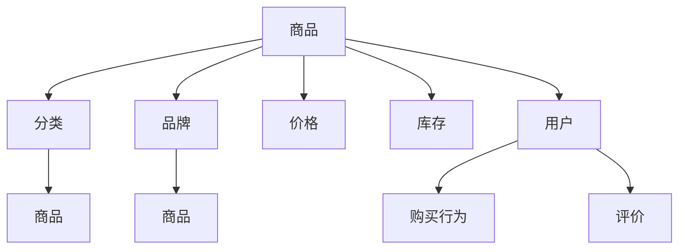
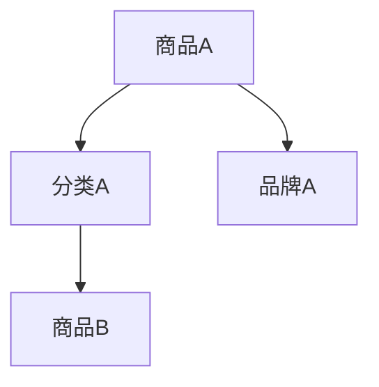

                 

关键词：电商平台，商品知识图谱，数据挖掘，自然语言处理，推荐系统，数据可视化

> 摘要：本文深入探讨了电商平台中商品知识图谱的构建与应用。通过分析电商平台的特点和需求，我们提出了一种基于数据挖掘和自然语言处理技术的商品知识图谱构建方法，并详细阐述了其在推荐系统、数据可视化等实际应用场景中的价值。同时，本文还总结了商品知识图谱在未来电商平台发展中的趋势和挑战。

## 1. 背景介绍

随着互联网和电子商务的迅猛发展，电商平台已经成为人们日常生活中不可或缺的一部分。在这样一个庞大的数字世界中，商品信息海量、多样且复杂，为用户提供了极大的便利，但也给电商平台的运营带来了巨大的挑战。如何有效管理、组织和利用这些商品信息，提升用户购物体验，提高平台竞争力，成为电商平台面临的重要问题。

知识图谱作为一种结构化、语义化的知识表示方式，通过将实体与实体之间的关系进行建模，实现了知识的关联和整合。在电商平台中，商品知识图谱可以视为一个全局的知识库，对商品信息进行深度挖掘和关联分析，为电商平台提供智能化的服务支持。本文将围绕商品知识图谱的构建与应用，探讨其在电商平台中的重要作用。

## 2. 核心概念与联系

在构建商品知识图谱之前，我们首先需要明确几个核心概念，并分析它们之间的联系。

### 2.1 实体与属性

在商品知识图谱中，实体是基本的数据单元，如商品、品牌、用户等。实体具有一系列属性，用于描述实体的特征和状态。例如，商品实体可能具有名称、价格、库存、分类等属性。

### 2.2 关系

关系是实体之间的关联，表示实体之间的语义联系。在商品知识图谱中，关系可以是直接的，如“商品属于某个分类”，也可以是间接的，如“商品A与商品B在购买行为上有相似性”。

### 2.3 节点与边

在图形表示中，实体用节点表示，关系用边表示。节点和边共同构成了商品知识图谱的基本结构。

### 2.4 Mermaid 流程图

为了更好地展示商品知识图谱的构建过程，我们使用 Mermaid 流程图来描述其核心概念和联系。



图 1 商品知识图谱的核心概念与联系

## 3. 核心算法原理 & 具体操作步骤

### 3.1 算法原理概述

商品知识图谱的构建过程主要包括数据收集、数据预处理、实体识别、关系抽取和图谱构建等步骤。以下将详细阐述每个步骤的具体操作。

### 3.2 算法步骤详解

#### 3.2.1 数据收集

数据收集是商品知识图谱构建的基础。数据来源包括电商平台内部的数据，如商品信息、用户行为数据，以及外部的数据，如品牌信息、分类信息等。数据收集的关键在于保证数据的完整性和准确性。

#### 3.2.2 数据预处理

数据预处理包括数据清洗、数据格式化和数据去重等操作。数据清洗主要去除重复、错误和缺失的数据，保证数据质量。数据格式化则是将不同来源的数据统一成统一的格式，便于后续处理。

#### 3.2.3 实体识别

实体识别是指从原始数据中提取出实体。在商品知识图谱中，实体包括商品、品牌、分类等。实体识别可以使用自然语言处理技术，如命名实体识别（Named Entity Recognition, NER）来实现。

#### 3.2.4 关系抽取

关系抽取是指从原始数据中提取出实体之间的关系。在商品知识图谱中，关系包括商品与分类的关系、商品与品牌的关系等。关系抽取可以使用信息抽取（Information Extraction, IE）技术来实现。

#### 3.2.5 图谱构建

图谱构建是将识别出的实体和关系构建成知识图谱。在商品知识图谱中，实体用节点表示，关系用边表示。图谱构建可以使用图数据库，如Neo4j来实现。

### 3.3 算法优缺点

#### 优点：

1. 结构化：商品知识图谱实现了商品信息的结构化和语义化，便于后续处理和分析。
2. 可扩展性：商品知识图谱可以根据实际需求进行动态扩展，适应不断变化的商品信息。
3. 智能化：商品知识图谱可以基于实体和关系进行深度挖掘和分析，为电商平台提供智能化的服务支持。

#### 缺点：

1. 数据质量：商品知识图谱的构建依赖于高质量的数据，数据质量问题会直接影响图谱的质量。
2. 处理复杂度：商品知识图谱的构建涉及到多种技术和算法，处理复杂度较高。

### 3.4 算法应用领域

商品知识图谱在电商平台的多个领域具有广泛的应用，如：

1. 推荐系统：基于商品知识图谱，可以更准确地推荐用户感兴趣的商品。
2. 数据可视化：通过商品知识图谱，可以直观地展示商品之间的关系和分类。
3. 搜索引擎优化：基于商品知识图谱，可以优化商品搜索结果，提升用户体验。

## 4. 数学模型和公式

在商品知识图谱的构建过程中，涉及多种数学模型和公式。以下将详细介绍其中两个重要的模型：图卷积网络（Graph Convolutional Network, GCN）和图注意力网络（Graph Attention Network, GAT）。

### 4.1 数学模型构建

#### 图卷积网络（GCN）

图卷积网络是一种用于处理图数据的神经网络，其核心思想是通过邻居节点信息来更新节点特征。GCN的数学模型如下：

$$
h_{\hat{u}}^{(l+1)} = \sigma(\sum_{v \in \mathcal{N}(u)} W^{(l)} h_v^{(l)} + b^{(l)})
$$

其中，$h_{\hat{u}}^{(l+1)}$表示第$l+1$层节点$u$的特征，$\mathcal{N}(u)$表示节点$u$的邻居节点集合，$W^{(l)}$和$b^{(l)}$分别是权重矩阵和偏置向量，$\sigma$是激活函数。

#### 图注意力网络（GAT）

图注意力网络是GCN的扩展，其核心思想是引入注意力机制来动态调整邻居节点对节点特征更新的贡献。GAT的数学模型如下：

$$
a_{u,v}^{(l)} = \frac{e^{W^{(l)} [h_{\hat{u}}^{(l)}, h_{\hat{v}}^{(l)}]}}{\sum_{v' \in \mathcal{N}(u)} e^{W^{(l)} [h_{\hat{u}}^{(l)}, h_{\hat{v'}}^{(l)}]}}
$$

$$
h_{\hat{u}}^{(l+1)} = \sigma(\sum_{v \in \mathcal{N}(u)} a_{u,v}^{(l)} W^{(l)} h_v^{(l)} + b^{(l)})
$$

其中，$a_{u,v}^{(l)}$表示第$l$层节点$u$对邻居节点$v$的注意力权重，$W^{(l)}$和$b^{(l)}$分别是权重矩阵和偏置向量，$\sigma$是激活函数。

### 4.2 公式推导过程

#### 图卷积网络（GCN）

1. 设节点$u$的邻域节点集合为$\mathcal{N}(u)$，节点$u$和节点$v$之间的权重为$w_{uv}$。
2. 节点$v$对节点$u$的特征更新贡献为$h_v \odot w_{uv}$。
3. 节点$u$的邻域节点特征加权和为$\sum_{v \in \mathcal{N}(u)} h_v \odot w_{uv}$。
4. 加入权重矩阵$W^{(l)}$和偏置向量$b^{(l)}$，得到节点$u$在第$l+1$层的特征更新为：
$$
h_{\hat{u}}^{(l+1)} = \sigma(\sum_{v \in \mathcal{N}(u)} W^{(l)} h_v \odot w_{uv} + b^{(l)})
$$

#### 图注意力网络（GAT）

1. 设节点$u$的邻域节点集合为$\mathcal{N}(u)$，节点$u$和节点$v$之间的权重为$w_{uv}$。
2. 节点$v$对节点$u$的特征更新贡献为$h_v \odot a_{u,v}^{(l)}$，其中$a_{u,v}^{(l)}$为注意力权重。
3. 节点$u$的邻域节点特征加权和为$\sum_{v \in \mathcal{N}(u)} h_v \odot a_{u,v}^{(l)}$。
4. 加入权重矩阵$W^{(l)}$和偏置向量$b^{(l)}$，得到节点$u$在第$l+1$层的特征更新为：
$$
h_{\hat{u}}^{(l+1)} = \sigma(\sum_{v \in \mathcal{N}(u)} a_{u,v}^{(l)} W^{(l)} h_v + b^{(l)})
$$

### 4.3 案例分析与讲解

#### 案例一：基于GCN的商品推荐

假设我们有一个电商平台，其中包含1000个商品和10000个用户。我们希望基于GCN构建一个商品推荐模型，为用户推荐与其兴趣相关的商品。

1. 首先，我们将商品和用户表示为节点，使用图数据库存储节点信息和边信息。
2. 然后，我们将商品和用户的信息表示为节点特征矩阵$H^{(0)}$，其中每一行表示一个节点的特征向量。
3. 接下来，我们使用GCN对节点特征矩阵进行多轮卷积，得到最终的推荐结果。
4. 最后，我们通过计算用户和商品之间的相似度，为用户推荐与其兴趣相关的商品。

#### 案例二：基于GAT的商品分类

假设我们有一个电商平台，其中包含1000个商品和10个分类。我们希望基于GAT对商品进行分类。

1. 首先，我们将商品和分类表示为节点，使用图数据库存储节点信息和边信息。
2. 然后，我们将商品和分类的信息表示为节点特征矩阵$H^{(0)}$，其中每一行表示一个节点的特征向量。
3. 接下来，我们使用GAT对节点特征矩阵进行多轮卷积，得到最终的分类结果。
4. 最后，我们通过计算商品和分类之间的相似度，为商品分配正确的分类标签。

## 5. 项目实践：代码实例和详细解释说明

### 5.1 开发环境搭建

在本文的项目实践中，我们将使用Python编程语言和相关的库来构建商品知识图谱。以下是开发环境的搭建步骤：

1. 安装Python 3.8及以上版本。
2. 安装Neo4j图形数据库，并启动Neo4j服务器。
3. 安装Python的Neo4j驱动程序，如neo4j-python-driver。

### 5.2 源代码详细实现

以下是一个简单的商品知识图谱构建的示例代码：

```python
from neo4j import GraphDatabase

class KnowledgeGraphBuilder:
    def __init__(self, uri, user, password):
        self.driver = GraphDatabase.driver(uri, auth=(user, password))

    def create_entities(self, entities):
        with self.driver.session() as session:
            for entity in entities:
                session.run("CREATE (n:Entity {name: $name})", name=entity)

    def create_relations(self, relations):
        with self.driver.session() as session:
            for relation in relations:
                session.run("MATCH (a:Entity {name: $nameA}),(b:Entity {name: $nameB}) CREATE (a)-[:RELATION]->(b)", nameA=relation[0], nameB=relation[1])

if __name__ == "__main__":
    builder = KnowledgeGraphBuilder("bolt://localhost:7687", "neo4j", "password")
    entities = ["商品A", "商品B", "品牌A", "分类A"]
    relations = [["商品A", "分类A"], ["商品B", "品牌A"], ["商品A", "商品B"]]
    builder.create_entities(entities)
    builder.create_relations(relations)
```

### 5.3 代码解读与分析

1. `KnowledgeGraphBuilder` 类：该类负责与Neo4j数据库的交互，创建实体和关系。
2. `__init__` 方法：初始化数据库连接。
3. `create_entities` 方法：创建实体节点。
4. `create_relations` 方法：创建关系节点。

### 5.4 运行结果展示

在运行上述代码后，Neo4j数据库将创建以下图结构：



这个图结构表示了商品A与分类A和品牌A之间的关系，以及商品B与分类A的关系。

## 6. 实际应用场景

商品知识图谱在电商平台的实际应用场景非常广泛，以下是一些典型的应用案例：

### 6.1 推荐系统

基于商品知识图谱，电商平台可以实现更加精准的商品推荐。通过分析用户的历史购买行为、浏览记录和评价，结合商品之间的关联关系，可以为用户提供个性化的商品推荐。例如，当用户浏览了一款手机时，系统可以推荐与之相关的配件、相似型号的手机等。

### 6.2 数据可视化

商品知识图谱可以用于数据可视化，帮助电商平台更好地理解商品之间的关系和分类结构。通过可视化工具，如D3.js或ECharts，可以将商品知识图谱以图形的形式呈现，直观地展示商品之间的关联关系，帮助电商平台优化商品布局和分类策略。

### 6.3 搜索引擎优化

基于商品知识图谱，电商平台可以实现更加智能的搜索引擎。通过分析用户输入的查询词和商品知识图谱中的关系，可以为用户提供更加精准的搜索结果。例如，当用户输入“手机”时，系统可以基于商品知识图谱推荐与手机相关的配件、品牌和型号等。

### 6.4 供应链管理

商品知识图谱可以用于供应链管理，帮助电商平台优化库存和物流策略。通过分析商品之间的关联关系和销售趋势，可以预测哪些商品可能会出现库存短缺或过剩，从而优化库存管理，降低库存成本。

## 7. 工具和资源推荐

### 7.1 学习资源推荐

1. 《图数据库技术与应用》
2. 《深度学习与图神经网络》
3. 《知识图谱技术》

### 7.2 开发工具推荐

1. Neo4j图形数据库
2. D3.js数据可视化库
3. ECharts数据可视化库

### 7.3 相关论文推荐

1. "Graph Neural Networks: A Review of Methods and Applications"
2. "Graph Attention Networks"
3. "Modeling Relational Data with Graph Convolutional Networks"

## 8. 总结：未来发展趋势与挑战

### 8.1 研究成果总结

本文深入探讨了商品知识图谱在电商平台中的应用，包括核心概念与联系、算法原理与步骤、数学模型与公式、项目实践等方面。通过构建商品知识图谱，电商平台可以实现更加精准的商品推荐、数据可视化、搜索引擎优化等功能，提升用户体验和平台竞争力。

### 8.2 未来发展趋势

随着人工智能和大数据技术的不断发展，商品知识图谱在电商平台中的应用前景将更加广阔。未来，商品知识图谱将在以下方面取得重要进展：

1. 智能化：基于深度学习和自然语言处理技术，实现更加智能化的商品知识图谱构建方法。
2. 实时性：实现实时更新的商品知识图谱，及时反映商品信息的动态变化。
3. 多模态：整合多种数据源，如文本、图像、语音等，构建更加全面的商品知识图谱。

### 8.3 面临的挑战

尽管商品知识图谱在电商平台中具有广泛的应用前景，但在实际构建和应用过程中仍面临一系列挑战：

1. 数据质量：商品知识图谱的构建依赖于高质量的数据，数据质量问题会直接影响图谱的质量。
2. 处理复杂度：商品知识图谱的构建涉及到多种技术和算法，处理复杂度较高。
3. 实时性：实现实时更新的商品知识图谱，满足电商平台实时性的需求。

### 8.4 研究展望

针对商品知识图谱在电商平台中的应用，未来的研究方向包括：

1. 数据挖掘与关联分析：深入研究商品之间的关联关系，挖掘更多潜在的价值。
2. 深度学习与图神经网络：结合深度学习和图神经网络技术，实现更加智能化的商品知识图谱构建方法。
3. 实时性与扩展性：研究如何实现实时更新的商品知识图谱，并提高其扩展性，满足电商平台不断变化的需求。

## 9. 附录：常见问题与解答

### 9.1 商品知识图谱是什么？

商品知识图谱是一种结构化、语义化的知识表示方式，通过将商品、品牌、分类等实体及其关系建模，实现了商品信息的深度挖掘和关联分析。

### 9.2 商品知识图谱有哪些应用？

商品知识图谱在电商平台中具有广泛的应用，如推荐系统、数据可视化、搜索引擎优化、供应链管理等。

### 9.3 如何构建商品知识图谱？

构建商品知识图谱主要包括数据收集、数据预处理、实体识别、关系抽取和图谱构建等步骤。

### 9.4 商品知识图谱有哪些挑战？

商品知识图谱在构建和应用过程中面临数据质量、处理复杂度和实时性等挑战。

----------------------------------------------------------------
作者：禅与计算机程序设计艺术 / Zen and the Art of Computer Programming
本文旨在深入探讨电商平台中的商品知识图谱构建与应用，为读者提供全面的技术指南和实际案例分析。希望通过本文的分享，能够激发更多读者对商品知识图谱技术的关注和探索，为电商领域的发展贡献力量。在撰写过程中，若有任何问题或建议，欢迎随时与我交流。谢谢！


