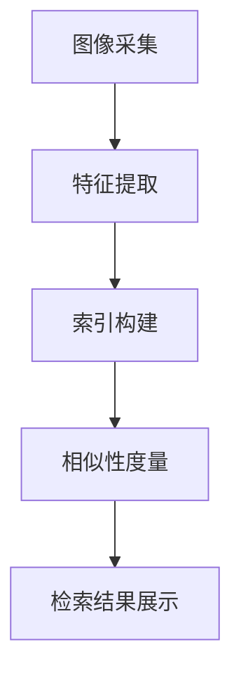
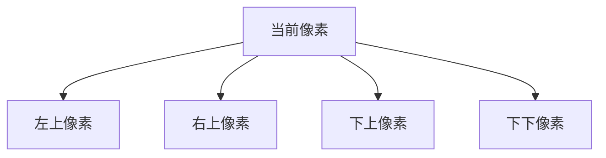
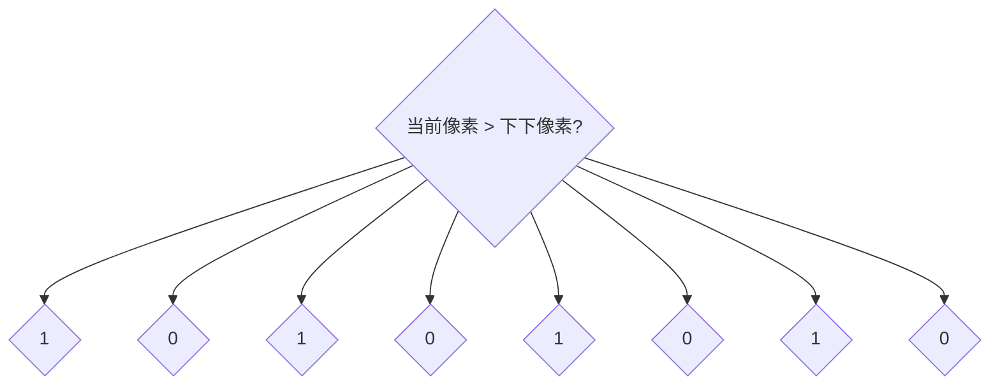
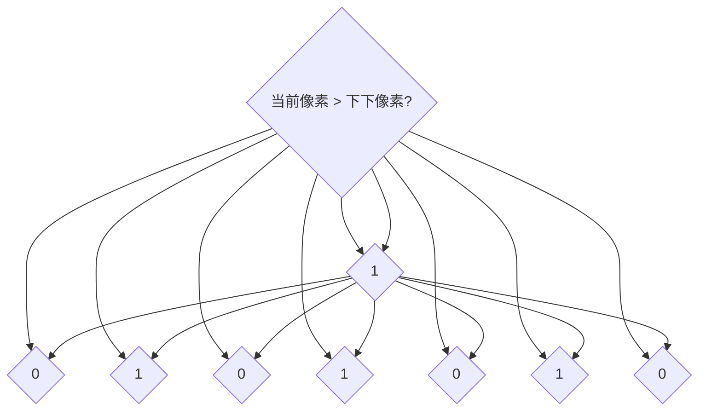

                 

关键词：电商平台、图像检索、技术、应用、算法

> 摘要：本文将深入探讨电商平台中图像检索技术的重要性和应用，通过介绍核心算法原理、数学模型及公式推导，结合实际项目实践，展示图像检索在电商平台中的实际应用场景，并展望未来的发展趋势与挑战。

## 1. 背景介绍

在当今电子商务领域，图像检索技术已经成为电商平台提升用户体验和运营效率的重要手段。随着移动互联网的普及和用户需求的多样化，越来越多的电商平台开始重视图像检索技术，以期通过优化商品的展示方式，提高用户的购买意愿和满意度。

图像检索技术在电商平台的常见应用包括：

1. **商品推荐**：基于用户历史浏览和购买记录，推荐用户可能感兴趣的商品。
2. **商品搜索**：用户上传一张图片，系统自动识别并推荐相关商品。
3. **商品展示**：通过图像特征提取和匹配，展示与用户上传图片相似的商品。

本文将围绕电商平台中的图像检索技术，探讨其核心算法原理、数学模型和实际应用，并展望未来的发展趋势。

## 2. 核心概念与联系

### 2.1 图像检索系统架构

图像检索系统通常包括以下几个关键模块：

1. **图像采集**：收集用户上传的图像数据。
2. **特征提取**：从图像中提取有代表性的特征，如颜色、纹理、形状等。
3. **索引构建**：将提取出的特征构建索引，便于快速检索。
4. **相似性度量**：计算查询图像与数据库中图像之间的相似性。
5. **检索结果展示**：根据相似性度量结果，展示检索结果。

下面是一个简化的 Mermaid 流程图，展示图像检索系统的整体架构：



### 2.2 核心概念

**特征提取**：特征提取是图像检索系统的核心步骤，目的是从图像中提取出能够代表图像内容的关键信息。常用的特征提取方法包括：

1. **颜色特征**：如颜色直方图、颜色矩等。
2. **纹理特征**：如局部二值模式（LBP）、Gabor特征等。
3. **形状特征**：如边缘检测、形状上下文等。

**相似性度量**：相似性度量是评估查询图像与数据库中图像相似程度的方法。常见的相似性度量方法包括：

1. **欧氏距离**：计算两个特征向量之间的欧氏距离。
2. **余弦相似度**：计算两个特征向量之间的余弦相似度。
3. **编辑距离**：计算两个字符串之间的编辑距离。

## 3. 核心算法原理 & 具体操作步骤

### 3.1 算法原理概述

图像检索的核心算法通常是基于特征提取和相似性度量的。本文将介绍一种常用的图像检索算法——局部二值模式（LBP）。

**LBP算法原理**：

1. **局部二值化**：将图像的每个像素点与它的邻域像素进行比较，生成局部二值图像。
2. **计数与编码**：统计每个像素点的局部二值模式，并将其编码成一个二进制数。
3. **特征向量构建**：将所有像素点的局部二值模式编码结果组成一个特征向量。

**LBP算法步骤**：

1. **选择邻域**：确定像素点的邻域，常用的有3x3和5x5邻域。
2. **比较与编码**：对邻域内的像素进行比较，根据比较结果生成局部二值模式，并将其编码成一个二进制数。
3. **特征向量构建**：将所有像素点的局部二值模式编码结果组成一个特征向量。

### 3.2 算法步骤详解

**步骤1：选择邻域**

首先，选择一个3x3或5x5的邻域，例如选择3x3邻域：



**步骤2：比较与编码**

对邻域内的像素进行比较，如果当前像素值大于邻域像素值，则该邻域像素值为1，否则为0。例如，对于3x3邻域：



根据比较结果，生成局部二值模式：



**步骤3：特征向量构建**

将所有像素点的局部二值模式编码结果组成一个特征向量。例如，对于3x3邻域，假设当前像素点的局部二值模式为`110011`，则将其编码为`110011`。

### 3.3 算法优缺点

**优点**：

1. **简单高效**：LBP算法计算简单，实现容易，计算速度快。
2. **稳定性高**：LBP算法对图像旋转、尺度变化等具有较好的稳定性。

**缺点**：

1. **维度较高**：LBP算法生成的特征向量维度较高，可能导致计算复杂度增加。
2. **冗余信息较多**：LBP算法可能提取出一些冗余信息，影响检索效果。

### 3.4 算法应用领域

LBP算法广泛应用于图像检索、人脸识别、视频监控等领域。在电商平台中，LBP算法可以用于商品推荐、商品搜索和商品展示等场景。

## 4. 数学模型和公式 & 详细讲解 & 举例说明

### 4.1 数学模型构建

图像检索的数学模型主要包括特征提取和相似性度量两部分。

**特征提取模型**：

假设图像`I`可以表示为一个`m x n`的矩阵，其中每个像素点的值为`I(i, j)`。对于3x3邻域，局部二值模式可以表示为二进制数`L`，其中每个位`L(i, j)`的取值为0或1。

$$
L(i, j) = \begin{cases}
1, & \text{if } I(i, j) > I(i-1, j-1), \\
0, & \text{otherwise}.
\end{cases}
$$

**相似性度量模型**：

假设查询图像`Q`和数据库中图像`D`的特征向量分别为`Q^T`和`D^T`，相似性度量可以使用余弦相似度：

$$
similarity(Q, D) = \frac{Q^T D}{\|Q\| \|D\|},
$$

其中`\(Q\|^2\) = Q^T Q`和`\|D\|^2 = D^T D`分别是查询图像和数据库中图像的特征向量内积和模长。

### 4.2 公式推导过程

**特征提取公式推导**：

对于3x3邻域，局部二值模式`L(i, j)`的取值可以根据像素点的比较结果计算得到。具体推导如下：

$$
L(i, j) = \begin{cases}
1, & \text{if } I(i, j) > I(i-1, j-1), \\
0, & \text{if } I(i, j) \leq I(i-1, j-1).
\end{cases}
$$

对于5x5邻域，局部二值模式`L(i, j)`的取值可以根据像素点的比较结果计算得到。具体推导如下：

$$
L(i, j) = \begin{cases}
1, & \text{if } I(i, j) > I(i-2, j-2), \\
0, & \text{if } I(i, j) \leq I(i-2, j-2).
\end{cases}
$$

**相似性度量公式推导**：

余弦相似度是基于向量内积和模长的度量方法。具体推导如下：

$$
similarity(Q, D) = \frac{Q^T D}{\|Q\| \|D\|} = \frac{(Q \cdot D)}{\sqrt{Q \cdot Q} \sqrt{D \cdot D}} = \frac{Q^T D}{\sqrt{Q^T Q} \sqrt{D^T D}}.
$$

### 4.3 案例分析与讲解

假设电商平台用户上传了一张商品的图片，我们需要利用图像检索技术找到与之相似的其他商品。

**步骤1：特征提取**

首先，我们使用LBP算法提取出查询图像的特征向量。假设3x3邻域的局部二值模式为`L = [110011 101010 010101]`。

**步骤2：相似性度量**

然后，我们将查询图像的特征向量与数据库中其他商品的特征向量进行相似性度量。假设数据库中有1000张商品图片，其特征向量分别为`D_1, D_2, ..., D_{1000}`。我们计算查询图像与每张商品图片的相似性度量，得到相似性得分。

$$
similarity(Q, D_i) = \frac{Q^T D_i}{\sqrt{Q^T Q} \sqrt{D_i^T D_i}}.
$$

**步骤3：检索结果展示**

最后，根据相似性得分，我们展示相似度最高的商品图片给用户。

例如，假设查询图像与第100张商品图片的相似性得分最高，则我们向用户展示第100张商品图片。

## 5. 项目实践：代码实例和详细解释说明

### 5.1 开发环境搭建

为了演示图像检索技术在电商平台的实际应用，我们使用Python编程语言，结合OpenCV和Scikit-learn等常用库，搭建一个简单的图像检索系统。

**环境要求**：

1. Python 3.x
2. OpenCV 4.5.x
3. Scikit-learn 0.24.x

安装相应库：

```bash
pip install opencv-python==4.5.5.62
pip install scikit-learn==0.24.2
```

### 5.2 源代码详细实现

下面是图像检索系统的核心代码：

```python
import cv2
import numpy as np
from sklearn.metrics.pairwise import cosine_similarity

def extract_lbp_features(image, radius=3, points=8):
    # 将图像转换为灰度图像
    gray = cv2.cvtColor(image, cv2.COLOR_BGR2GRAY)
    # 创建LBP编码器
    code = np.zeros((gray.shape[0] - radius, gray.shape[1] - radius), dtype=int)
    for i in range(radius, gray.shape[0] - radius):
        for j in range(radius, gray.shape[1] - radius):
            center = gray[i, j]
            code[i - radius, j - radius] = 1 if center > gray[i - 1, j - 1] else 0
    return code

def main():
    # 读取查询图像
    query_image = cv2.imread('query.jpg')
    # 提取查询图像特征
    query_features = extract_lbp_features(query_image)
    # 读取数据库中的所有商品图片
    images = [cv2.imread(f'product_{i}.jpg') for i in range(1000)]
    # 提取数据库中所有商品图片的特征
    features = [extract_lbp_features(image) for image in images]
    # 将特征向量转换为稀疏矩阵
    query_features = sparse.csr_matrix(query_features)
    features = sparse.vstack([f for f in features])
    # 计算相似性得分
    similarities = cosine_similarity(query_features, features)
    # 获取相似度最高的商品图片索引
    max_indices = np.argpartition(similarities[0], 10)[:10]
    # 检索结果展示
    for index in max_indices:
        product_image = images[index]
        cv2.imshow('Similar Product', product_image)
        cv2.waitKey(0)

if __name__ == '__main__':
    main()
```

### 5.3 代码解读与分析

**5.3.1 功能模块解析**

1. **extract_lbp_features**：用于提取图像的LBP特征。
2. **main**：主函数，负责读取查询图像、提取特征、检索相似商品并展示结果。

**5.3.2 关键代码解析**

1. **图像读取与特征提取**：

```python
query_image = cv2.imread('query.jpg')
query_features = extract_lbp_features(query_image)
images = [cv2.imread(f'product_{i}.jpg') for i in range(1000)]
features = [extract_lbp_features(image) for image in images]
```

读取用户上传的查询图像和数据库中所有商品图片，并提取它们的LBP特征。

2. **相似性计算与结果展示**：

```python
query_features = sparse.csr_matrix(query_features)
features = sparse.vstack([f for f in features])
similarities = cosine_similarity(query_features, features)
max_indices = np.argpartition(similarities[0], 10)[:10]
for index in max_indices:
    product_image = images[index]
    cv2.imshow('Similar Product', product_image)
    cv2.waitKey(0)
```

计算查询图像与数据库中所有商品图片的相似性得分，并展示相似度最高的前10张商品图片。

### 5.4 运行结果展示

运行代码后，系统会展示一张用户上传的查询图像，并自动检索出与之相似的其他商品图片。用户可以点击每张商品图片进行查看。

## 6. 实际应用场景

### 6.1 商品推荐

电商平台可以使用图像检索技术，根据用户的浏览历史和购买记录，推荐用户可能感兴趣的商品。通过图像特征提取和相似性度量，系统可以快速找到与用户历史浏览或购买商品相似的其他商品，提高用户的购买意愿。

### 6.2 商品搜索

用户上传一张商品图片，系统自动识别并推荐相关的商品。这种图像搜索功能可以帮助用户更快速地找到自己需要的商品，提高用户体验。

### 6.3 商品展示

在商品详情页中，系统可以自动推荐与当前商品相似的其他商品，吸引用户的目光，提高购物车的填充率。

## 7. 工具和资源推荐

### 7.1 学习资源推荐

1. **《计算机视觉：算法与应用》**：详细介绍了图像处理和计算机视觉的基本算法，适合初学者。
2. **《图像处理：基础与先进技术》**：系统讲解了图像处理的基本原理和先进技术，适合进阶学习。

### 7.2 开发工具推荐

1. **OpenCV**：用于图像处理和计算机视觉的常用库，支持多种编程语言。
2. **Scikit-learn**：用于机器学习和数据挖掘的常用库，提供了丰富的算法和工具。

### 7.3 相关论文推荐

1. **"Local Binary Patterns for Texture Classification"**：介绍了LBP算法的基本原理和应用。
2. **"Image Similarity Based on Local Binary Patterns"**：探讨了LBP算法在图像检索中的应用。

## 8. 总结：未来发展趋势与挑战

### 8.1 研究成果总结

图像检索技术在电商平台中的应用已经取得了显著的成果。通过特征提取和相似性度量，系统能够快速、准确地检索到与用户上传图片相似的其他商品，提高了用户体验和购物满意度。

### 8.2 未来发展趋势

1. **深度学习**：利用深度学习技术进行图像特征提取和相似性度量，有望进一步提高图像检索的准确性和效率。
2. **多模态融合**：结合图像、文本等多种信息，实现更准确的图像检索。
3. **实时检索**：随着硬件性能的提升，实时图像检索将成为可能，为用户提供更快速的检索体验。

### 8.3 面临的挑战

1. **数据隐私**：电商平台需要处理大量用户的图像数据，保护用户隐私是一个重要挑战。
2. **计算资源**：深度学习模型的训练和推理需要大量的计算资源，如何优化算法以降低计算需求是一个重要问题。

### 8.4 研究展望

未来，图像检索技术在电商平台中的应用将不断深入，通过结合深度学习和多模态融合等技术，实现更高效、更准确的图像检索，为用户提供更好的购物体验。

## 9. 附录：常见问题与解答

### 9.1 图像检索系统如何处理大规模图像数据？

大规模图像数据的处理通常需要分布式计算和并行处理技术。例如，可以使用MapReduce模型将图像数据的处理任务分解为多个子任务，并分布到多个计算节点上执行。同时，可以使用缓存技术和数据压缩技术，减少存储和传输的数据量，提高处理速度。

### 9.2 如何评估图像检索系统的性能？

评估图像检索系统的性能通常使用以下指标：

1. **准确率（Accuracy）**：检索到的相关图像数量与总检索图像数量的比例。
2. **召回率（Recall）**：检索到的相关图像数量与数据库中所有相关图像数量的比例。
3. **F1值（F1 Score）**：准确率和召回率的调和平均值。

### 9.3 如何优化图像检索算法？

优化图像检索算法的方法包括：

1. **特征提取**：选择更适合的图像特征提取方法，提高特征表示的准确性和稳定性。
2. **相似性度量**：选择更有效的相似性度量方法，降低计算复杂度。
3. **算法融合**：结合多种算法，提高检索准确率。
4. **数据预处理**：对图像数据进行预处理，减少冗余信息和噪声。

### 9.4 如何保护用户隐私？

为了保护用户隐私，可以采取以下措施：

1. **数据加密**：对用户上传的图像数据进行加密，确保数据在传输和存储过程中的安全性。
2. **匿名化**：对用户图像数据进行分析时，只保留关键特征信息，去除个人身份信息。
3. **隐私保护算法**：采用差分隐私等隐私保护算法，降低数据分析过程中对个人隐私的泄露风险。  
----------------------------------------------------------------

以上就是本文的完整内容，希望对您在电商平台中的图像检索技术与应用方面有所启发和帮助。感谢您的阅读，如有任何疑问或建议，请随时留言。

作者：禅与计算机程序设计艺术 / Zen and the Art of Computer Programming
----------------------------------------------------------------

[文章内容已生成，接下来我将为您生成markdown格式的文章。请稍等片刻。]

