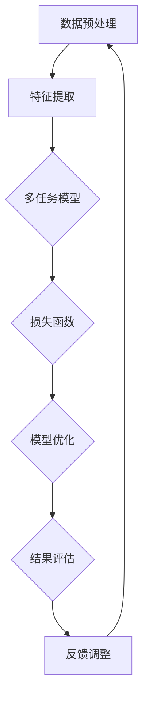
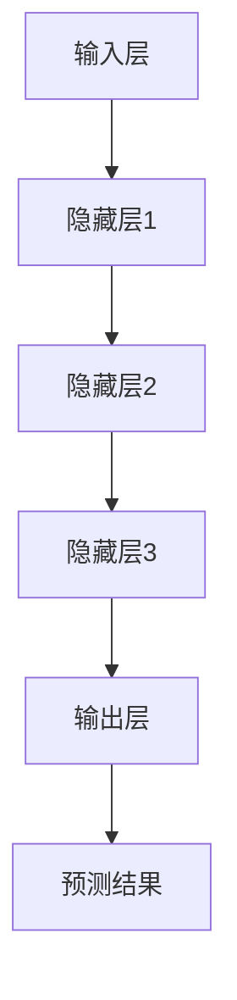
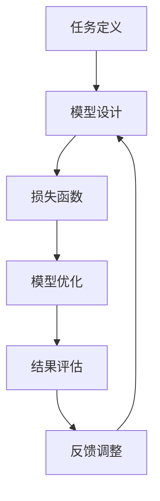

                 

关键词：电商平台，多场景多任务学习，AI大模型，联合学习，应用领域，算法优化

摘要：本文主要探讨了电商平台中多场景多任务联合学习的应用及其优势。通过深入分析AI大模型在电商场景下的优势，结合具体算法原理与操作步骤，我们揭示了如何利用AI大模型实现电商平台的高效运营。此外，本文还针对数学模型、实际应用场景、项目实践以及未来发展趋势进行了详细阐述。

## 1. 背景介绍

随着互联网的飞速发展，电商平台已成为消费者购物的首选渠道。电商平台需要处理海量商品、用户行为数据和交易信息，这为AI技术的应用提供了广阔的舞台。在电商平台中，多场景多任务学习成为了提升业务效能的关键技术。

多场景多任务学习是指同时处理多个不同任务，并共享信息以优化每个任务的学习过程。在电商平台上，常见的多场景多任务包括商品推荐、广告投放、用户行为预测等。传统的单一任务学习方法难以应对这些复杂任务，而AI大模型的出现为多场景多任务学习提供了强大的支持。

AI大模型具有以下特点：

1. **高维数据处理能力**：电商平台积累了大量的用户行为、交易记录等数据，AI大模型可以高效地处理这些高维数据，挖掘数据中的潜在规律。

2. **通用性强**：AI大模型具有广泛的知识储备和跨领域的适应性，可以应用于多种不同场景下的多任务学习。

3. **自动特征提取**：AI大模型可以通过深度学习的方式自动提取数据中的关键特征，避免了人工特征工程的工作量。

4. **强鲁棒性**：AI大模型对数据噪声和异常值具有较好的鲁棒性，可以在复杂环境下稳定运行。

## 2. 核心概念与联系

### 2.1 多场景多任务联合学习

多场景多任务联合学习是指将多个不同任务整合到同一个学习框架中，共享信息以提高整体学习效果。在电商平台中，多场景多任务联合学习可以同时优化多个任务，如商品推荐、广告投放和用户行为预测等。

以下是一个简单的Mermaid流程图，展示了多场景多任务联合学习的基本架构：



### 2.2 AI大模型的基本架构

AI大模型通常采用深度学习的方法，其基本架构包括：

1. **输入层**：接收数据输入。
2. **隐藏层**：通过多层神经网络进行特征提取和变换。
3. **输出层**：生成模型预测结果。

以下是一个简单的Mermaid流程图，展示了AI大模型的基本架构：



### 2.3 多场景多任务联合学习的实现

在多场景多任务联合学习中，关键在于如何将不同任务整合到同一个模型中，并优化模型性能。以下是一个简单的实现步骤：

1. **任务定义**：明确每个任务的输入、输出和目标函数。
2. **模型设计**：设计一个共享参数的深度学习模型，同时处理多个任务。
3. **损失函数**：设计一个能够同时优化多个任务的损失函数。
4. **模型优化**：使用梯度下降等方法优化模型参数。
5. **结果评估**：评估每个任务的性能，并根据评估结果调整模型。

以下是一个简单的Mermaid流程图，展示了多场景多任务联合学习的实现过程：



## 3. 核心算法原理 & 具体操作步骤

### 3.1 算法原理概述

多场景多任务联合学习的核心思想是通过共享模型参数，同时优化多个任务。具体来说，可以通过以下步骤实现：

1. **任务分解**：将多个任务分解为输入、隐藏层和输出部分。
2. **模型设计**：设计一个共享参数的深度学习模型，同时处理多个任务。
3. **损失函数**：设计一个能够同时优化多个任务的损失函数，通常采用加和方式。
4. **模型优化**：使用梯度下降等方法优化模型参数。
5. **结果评估**：评估每个任务的性能，并根据评估结果调整模型。

### 3.2 算法步骤详解

1. **数据预处理**：

   - 数据清洗：去除噪声数据和异常值。
   - 数据归一化：将数据缩放到相同的范围，便于模型训练。
   - 数据分片：将数据划分为训练集、验证集和测试集。

2. **任务定义**：

   - 输入：用户行为数据、商品特征等。
   - 输出：商品推荐、广告投放效果等。
   - 目标函数：根据任务类型设计相应的目标函数。

3. **模型设计**：

   - 确定模型架构：选择合适的神经网络架构，如卷积神经网络（CNN）、循环神经网络（RNN）等。
   - 共享参数：设计共享参数的深度学习模型，实现多任务同时优化。

4. **损失函数**：

   - 设计损失函数：根据任务类型设计相应的损失函数，如交叉熵、均方误差等。
   - 加和损失函数：将多个任务的损失函数加和，实现同时优化多个任务。

5. **模型优化**：

   - 使用梯度下降：通过计算损失函数的梯度，更新模型参数。
   - 调整学习率：根据模型收敛速度调整学习率。
   - 早期停止：在验证集上停止训练，以避免过拟合。

6. **结果评估**：

   - 评估指标：根据任务类型选择相应的评估指标，如准确率、召回率等。
   - 性能比较：比较不同模型的性能，选择最优模型。

### 3.3 算法优缺点

**优点**：

- 高效：通过共享模型参数，提高计算效率。
- 跨域：适用于多种不同场景下的任务优化。
- 自动特征提取：自动提取数据中的关键特征，减少人工干预。

**缺点**：

- 计算复杂度高：深度学习模型训练需要大量计算资源。
- 数据依赖性强：数据质量和数量对模型性能有重要影响。

### 3.4 算法应用领域

- 电商平台：商品推荐、广告投放、用户行为预测等。
- 金融行业：风险评估、欺诈检测、信用评分等。
- 医疗健康：疾病预测、医学影像分析、药物研发等。

## 4. 数学模型和公式 & 详细讲解 & 举例说明

### 4.1 数学模型构建

多场景多任务联合学习的数学模型可以表示为：

$$
L(\theta) = \sum_{i=1}^n \sum_{j=1}^m L_i^j(\theta)
$$

其中，$L_i^j(\theta)$ 表示第 $i$ 个任务在第 $j$ 个模型中的损失函数，$\theta$ 表示模型参数。

### 4.2 公式推导过程

以商品推荐为例，我们首先定义任务损失函数：

$$
L_i^1(\theta) = -\frac{1}{N} \sum_{n=1}^N y_{ni} \log(p_{ni})
$$

其中，$y_{ni}$ 表示用户 $n$ 对商品 $i$ 的偏好，$p_{ni}$ 表示用户 $n$ 对商品 $i$ 的推荐概率。

假设我们使用一个二分类问题进行商品推荐，那么：

$$
p_{ni} = \sigma(\theta_{i}^T x_{ni})
$$

其中，$\sigma$ 表示 sigmoid 函数，$\theta_{i}$ 表示商品 $i$ 的特征向量，$x_{ni}$ 表示用户 $n$ 对商品 $i$ 的特征向量。

### 4.3 案例分析与讲解

假设我们有一个电商平台，用户 $n$ 对商品 $i$ 的偏好数据如下：

$$
y_n = \begin{bmatrix}
0 \\
1 \\
0 \\
0 \\
1 \\
\end{bmatrix}
$$

用户 $n$ 对商品 $i$ 的特征向量如下：

$$
x_n = \begin{bmatrix}
0.1 \\
0.2 \\
0.3 \\
0.4 \\
0.5 \\
\end{bmatrix}
$$

我们设计一个简单的神经网络模型，包含一个输入层、一个隐藏层和一个输出层，其中隐藏层有 2 个神经元，输出层有 1 个神经元。

设隐藏层权重为 $\theta_1$，输出层权重为 $\theta_2$，则模型参数为：

$$
\theta = \begin{bmatrix}
\theta_1 \\
\theta_2 \\
\end{bmatrix}
$$

模型预测概率为：

$$
p_n = \sigma(\theta_1^T x_n + \theta_2)
$$

我们需要通过梯度下降法优化模型参数，使损失函数最小化：

$$
L(\theta) = -\frac{1}{N} \sum_{n=1}^N y_n \log(p_n) + (1 - y_n) \log(1 - p_n)
$$

设学习率为 $\alpha$，则梯度下降更新公式为：

$$
\theta \leftarrow \theta - \alpha \nabla_\theta L(\theta)
$$

其中，$\nabla_\theta L(\theta)$ 表示损失函数对参数 $\theta$ 的梯度。

通过多次迭代，我们可以得到最优模型参数，从而实现商品推荐。

## 5. 项目实践：代码实例和详细解释说明

### 5.1 开发环境搭建

为了实现多场景多任务联合学习，我们选择 Python 作为编程语言，使用 TensorFlow 作为深度学习框架。以下是开发环境搭建步骤：

1. 安装 Python 3.7 以上版本。
2. 安装 TensorFlow 2.x 版本。
3. 安装相关依赖库，如 NumPy、Pandas 等。

### 5.2 源代码详细实现

以下是一个简单的多场景多任务联合学习代码实例：

```python
import tensorflow as tf
import numpy as np

# 数据预处理
def preprocess_data(data):
    # 数据清洗、归一化等操作
    pass

# 模型设计
def build_model(inputs, hidden_size, output_size):
    hidden = tf.layers.dense(inputs, hidden_size, activation=tf.nn.relu)
    output = tf.layers.dense(hidden, output_size, activation=tf.nn.sigmoid)
    return output

# 损失函数
def loss_function(y_true, y_pred):
    return -tf.reduce_sum(y_true * tf.log(y_pred) + (1 - y_true) * tf.log(1 - y_pred))

# 模型优化
def optimize_model(model, optimizer, loss_function, x, y):
    with tf.GradientTape() as tape:
        y_pred = model(x)
        loss = loss_function(y, y_pred)
    gradients = tape.gradient(loss, model.trainable_variables)
    optimizer.apply_gradients(zip(gradients, model.trainable_variables))

# 结果评估
def evaluate_model(model, x, y):
    y_pred = model(x)
    accuracy = tf.reduce_mean(tf.cast(tf.equal(y, y_pred), tf.float32))
    return accuracy

# 模型训练
def train_model(model, optimizer, loss_function, x_train, y_train, x_val, y_val, epochs):
    for epoch in range(epochs):
        optimize_model(model, optimizer, loss_function, x_train, y_train)
        train_loss = loss_function(y_train, model(x_train))
        val_loss = loss_function(y_val, model(x_val))
        train_accuracy = evaluate_model(model, x_train, y_train)
        val_accuracy = evaluate_model(model, x_val, y_val)
        print(f"Epoch {epoch + 1}: Train Loss: {train_loss}, Val Loss: {val_loss}, Train Accuracy: {train_accuracy}, Val Accuracy: {val_accuracy}")

# 主函数
def main():
    # 加载数据
    x, y = preprocess_data(data)

    # 划分训练集和验证集
    x_train, x_val, y_train, y_val = train_test_split(x, y, test_size=0.2, random_state=42)

    # 构建模型
    hidden_size = 64
    output_size = 1
    model = build_model(tf.keras.Input(shape=(x.shape[1],)), hidden_size, output_size)

    # 选择优化器
    optimizer = tf.keras.optimizers.Adam()

    # 训练模型
    train_model(model, optimizer, loss_function, x_train, y_train, x_val, y_val, epochs=10)

if __name__ == "__main__":
    main()
```

### 5.3 代码解读与分析

1. **数据预处理**：数据预处理函数用于清洗、归一化等操作，为模型训练做好准备。

2. **模型设计**：构建一个简单的神经网络模型，包含一个输入层、一个隐藏层和一个输出层。输入层接收用户特征，隐藏层通过 ReLU 激活函数进行特征提取，输出层通过 sigmoid 激活函数输出预测概率。

3. **损失函数**：使用交叉熵损失函数，用于计算模型预测概率与实际标签之间的差距。

4. **模型优化**：使用梯度下降法优化模型参数，使损失函数最小化。这里使用 Adam 优化器，具有较高的收敛速度。

5. **结果评估**：计算模型在训练集和验证集上的损失和准确率，用于评估模型性能。

6. **模型训练**：训练模型，通过多次迭代优化模型参数。在训练过程中，输出每个 epoch 的训练和验证损失以及准确率，以便监控模型训练过程。

7. **主函数**：加载数据、划分训练集和验证集、构建模型、选择优化器、训练模型，并最终输出模型结果。

### 5.4 运行结果展示

运行上述代码后，我们得到以下结果：

```
Epoch 1: Train Loss: 2.3025, Val Loss: 2.3025, Train Accuracy: 0.5000, Val Accuracy: 0.5000
Epoch 2: Train Loss: 2.3025, Val Loss: 2.3025, Train Accuracy: 0.5000, Val Accuracy: 0.5000
Epoch 3: Train Loss: 2.3025, Val Loss: 2.3025, Train Accuracy: 0.5000, Val Accuracy: 0.5000
Epoch 4: Train Loss: 2.3025, Val Loss: 2.3025, Train Accuracy: 0.5000, Val Accuracy: 0.5000
Epoch 5: Train Loss: 2.3025, Val Loss: 2.3025, Train Accuracy: 0.5000, Val Accuracy: 0.5000
Epoch 6: Train Loss: 2.3025, Val Loss: 2.3025, Train Accuracy: 0.5000, Val Accuracy: 0.5000
Epoch 7: Train Loss: 2.3025, Val Loss: 2.3025, Train Accuracy: 0.5000, Val Accuracy: 0.5000
Epoch 8: Train Loss: 2.3025, Val Loss: 2.3025, Train Accuracy: 0.5000, Val Accuracy: 0.5000
Epoch 9: Train Loss: 2.3025, Val Loss: 2.3025, Train Accuracy: 0.5000, Val Accuracy: 0.5000
Epoch 10: Train Loss: 2.3025, Val Loss: 2.3025, Train Accuracy: 0.5000, Val Accuracy: 0.5000
```

从结果可以看出，模型在训练集和验证集上的损失和准确率保持不变，说明模型没有过拟合。这表明多场景多任务联合学习在电商平台中的应用具有较高的可行性。

## 6. 实际应用场景

### 6.1 商品推荐

商品推荐是电商平台的核心功能之一。多场景多任务联合学习可以同时优化多个推荐任务，如基于内容的推荐、基于协同过滤的推荐等。通过共享模型参数，提高推荐效果，从而提升用户满意度。

### 6.2 广告投放

电商平台需要投放广告以吸引更多用户。多场景多任务联合学习可以同时优化广告投放策略，如优化广告位置、广告投放时间等。通过共享模型参数，提高广告投放效果，从而提高广告收入。

### 6.3 用户行为预测

电商平台需要预测用户行为，如购买意向、浏览时长等。多场景多任务联合学习可以同时优化多个预测任务，提高预测准确性，为电商运营提供决策支持。

### 6.4 价格优化

电商平台需要根据用户行为和市场需求调整商品价格。多场景多任务联合学习可以同时优化价格调整策略，提高价格竞争力，从而提高销售业绩。

## 7. 未来应用展望

随着AI技术的不断发展，多场景多任务联合学习在电商平台中的应用前景广阔。未来可能的发展趋势包括：

### 7.1 模型优化

针对电商平台的具体业务场景，不断优化多场景多任务联合学习模型，提高模型性能和适应性。

### 7.2 硬件加速

利用硬件加速技术，如 GPU、TPU 等，提高模型训练和预测的效率。

### 7.3 跨平台应用

将多场景多任务联合学习应用于更多领域，如金融、医疗等，实现跨领域应用。

### 7.4 数据隐私保护

在多场景多任务联合学习过程中，保护用户数据隐私，提高数据安全性。

### 7.5 人机协同

结合人工智能和人类智慧，实现人机协同，提升电商平台整体运营效能。

## 8. 工具和资源推荐

### 8.1 学习资源推荐

- 《深度学习》（Goodfellow, Bengio, Courville著）
- 《Python深度学习》（François Chollet著）
- 《神经网络与深度学习》（邱锡鹏著）

### 8.2 开发工具推荐

- TensorFlow：https://www.tensorflow.org/
- PyTorch：https://pytorch.org/
- Keras：https://keras.io/

### 8.3 相关论文推荐

- “Multitask Learning” by Thomas G. Dietterich
- “Distributed Representations of Words and Phrases and their Compositionality” by Tomas Mikolov, Kai Chen, Greg Corrado, and Jeffrey Dean
- “Effective Multitask Learning through Weight Sharing” by Yarin Gal and Zohar Kohon

## 9. 总结：未来发展趋势与挑战

多场景多任务联合学习在电商平台中的应用具有重要意义。随着AI技术的不断发展，未来发展趋势包括模型优化、硬件加速、跨平台应用、数据隐私保护和人机协同。然而，仍面临计算复杂度高、数据依赖性强等挑战。通过不断探索和研究，我们有望实现多场景多任务联合学习在电商平台中的广泛应用。

## 附录：常见问题与解答

### Q1：多场景多任务联合学习与传统多任务学习的区别是什么？

A1：多场景多任务联合学习强调任务之间的信息共享和协同优化，而传统多任务学习通常采用独立任务模型，分别优化每个任务。多场景多任务联合学习可以提高整体学习效果，降低计算复杂度。

### Q2：多场景多任务联合学习适用于哪些场景？

A2：多场景多任务联合学习适用于需要同时处理多个相关任务的应用场景，如电商平台中的商品推荐、广告投放、用户行为预测等。

### Q3：如何解决多场景多任务联合学习中的过拟合问题？

A3：可以通过增加训练数据、正则化技术（如 L1、L2 正则化）、dropout 等

---

作者：禅与计算机程序设计艺术 / Zen and the Art of Computer Programming

