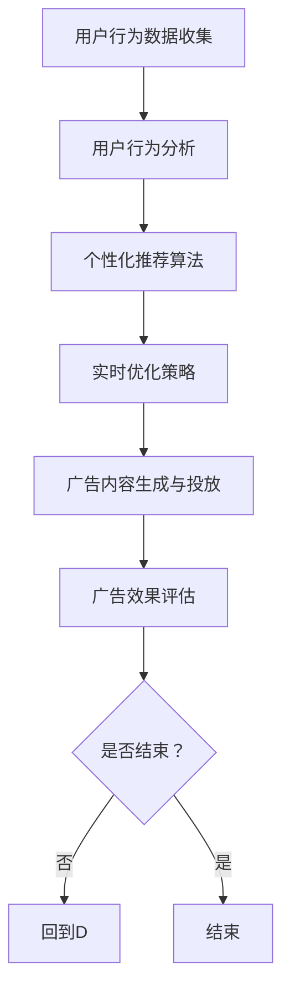

                 

关键词：电商平台、个性化广告、实时优化、算法、用户行为分析

摘要：本文将探讨电商平台中实时个性化广告创意优化的关键技术和实践方法。通过对用户行为的深入分析，结合先进的算法和数学模型，本文旨在为电商平台提供一种高效、精确的广告创意优化策略，提升用户满意度和平台收益。

## 1. 背景介绍

随着互联网技术的飞速发展，电商平台已经成为消费者购物的重要渠道。在竞争激烈的市场中，电商平台不仅需要提供丰富的商品选择，还需要通过精准的广告推送来吸引和留住用户。然而，传统的广告投放模式往往难以满足个性化的用户需求，导致广告效果不佳，资源浪费。因此，实时个性化广告创意优化成为电商平台提高用户满意度和转化率的关键。

### 1.1 电商平台广告现状

目前，电商平台普遍采用按曝光量或点击量计费的广告投放模式。这种模式虽然简单易行，但往往缺乏对用户兴趣和需求的深入理解，导致广告内容与用户兴趣不匹配，从而影响广告效果。此外，传统广告投放模式缺乏实时性，无法根据用户实时行为进行动态调整，难以实现精准推送。

### 1.2 个性化广告的必要性

个性化广告能够根据用户的兴趣、行为和购买历史等信息，为用户推荐与其需求高度相关的广告内容。这种精准的广告推送不仅能够提高用户满意度和参与度，还能有效提高广告的转化率和投资回报率。因此，实现个性化广告创意优化对于电商平台来说具有重要意义。

## 2. 核心概念与联系

为了实现实时个性化广告创意优化，我们需要理解以下几个核心概念：

### 2.1 用户行为分析

用户行为分析是指通过对用户在电商平台上的浏览、搜索、购买等行为数据进行收集、处理和分析，以了解用户的需求和兴趣。用户行为数据包括浏览历史、搜索关键词、购买记录等。

### 2.2 个性化推荐算法

个性化推荐算法是指根据用户行为数据，利用机器学习、深度学习等技术，为用户生成个性化的推荐列表。常见的个性化推荐算法包括协同过滤、基于内容的推荐和混合推荐等。

### 2.3 实时优化策略

实时优化策略是指根据用户的实时行为数据，动态调整广告内容和投放策略，以实现最佳广告效果。实时优化策略包括实时用户特征更新、实时广告内容生成和实时广告投放调整等。

### 2.4 Mermaid 流程图

以下是一个简化的电商平台实时个性化广告创意优化流程的 Mermaid 流程图：



## 3. 核心算法原理 & 具体操作步骤

### 3.1 算法原理概述

电商平台实时个性化广告创意优化主要依赖于以下三个核心算法：

- **用户行为分析算法**：用于对用户行为数据进行处理和分析，提取用户兴趣和需求。
- **个性化推荐算法**：根据用户兴趣和需求，为用户生成个性化的广告推荐列表。
- **实时优化算法**：根据用户实时行为数据，动态调整广告内容和投放策略。

### 3.2 算法步骤详解

1. **用户行为数据收集**：从电商平台的后台系统中收集用户的浏览、搜索、购买等行为数据。
2. **用户行为分析**：对收集到的行为数据进行处理和分析，提取用户的兴趣和需求。
3. **个性化推荐算法**：利用协同过滤、基于内容的推荐等算法，为用户生成个性化的广告推荐列表。
4. **实时优化算法**：根据用户实时行为数据，动态调整广告内容和投放策略。
5. **广告内容生成与投放**：根据实时优化算法的结果，生成并投放个性化的广告内容。
6. **广告效果评估**：对广告投放效果进行评估，包括广告曝光量、点击率、转化率等指标。
7. **反馈与迭代**：根据广告效果评估结果，对算法和策略进行调整和优化。

### 3.3 算法优缺点

- **用户行为分析算法**：优点是能够准确提取用户兴趣和需求，缺点是需要大量的数据处理和分析能力。
- **个性化推荐算法**：优点是能够为用户推荐个性化的广告内容，缺点是可能存在数据稀疏和冷启动问题。
- **实时优化算法**：优点是能够根据用户实时行为进行动态调整，缺点是可能需要较高的计算资源和实时性要求。

### 3.4 算法应用领域

实时个性化广告创意优化算法在电商平台、在线视频、社交媒体等领域有广泛的应用。特别是在电商平台中，通过对用户行为的深入分析，可以为用户提供高度相关的广告内容，提高用户满意度和转化率。

## 4. 数学模型和公式 & 详细讲解 & 举例说明

### 4.1 数学模型构建

为了实现实时个性化广告创意优化，我们需要构建以下数学模型：

- **用户行为模型**：用于描述用户行为数据，包括浏览、搜索、购买等行为。
- **个性化推荐模型**：用于根据用户行为模型生成个性化的广告推荐列表。
- **实时优化模型**：用于根据用户实时行为数据动态调整广告内容和投放策略。

### 4.2 公式推导过程

1. **用户行为模型**：

   设用户 $u$ 的行为数据为 $X_u = \{x_{u1}, x_{u2}, ..., x_{un}\}$，其中 $x_{ui}$ 表示用户 $u$ 在第 $i$ 个行为上的记录。

   用户行为模型可以表示为：

   $$X_u = \sum_{i=1}^{n} w_i x_{ui}$$

   其中，$w_i$ 表示第 $i$ 个行为的权重。

2. **个性化推荐模型**：

   设用户 $u$ 对广告 $a$ 的兴趣度为 $I_u(a)$，则个性化推荐模型可以表示为：

   $$I_u(a) = \sum_{i=1}^{n} w_i x_{ui} \cdot r_i(a)$$

   其中，$r_i(a)$ 表示第 $i$ 个行为对广告 $a$ 的兴趣度评分。

3. **实时优化模型**：

   设用户 $u$ 在时间 $t$ 的行为数据为 $X_u(t)$，则实时优化模型可以表示为：

   $$X_u(t) = \sum_{i=1}^{n} w_i x_{ui}(t)$$

   其中，$x_{ui}(t)$ 表示用户 $u$ 在时间 $t$ 的第 $i$ 个行为记录。

   实时优化策略可以根据 $X_u(t)$ 动态调整广告内容和投放策略。

### 4.3 案例分析与讲解

假设有一个电商平台，用户 $u$ 在过去一个月内的行为数据如下：

| 时间 | 行为 |
| ---- | ---- |
| 1    | 浏览商品 A |
| 3    | 搜索商品 B |
| 7    | 购买商品 C |
| 10   | 浏览商品 D |

根据用户行为模型，我们可以计算用户 $u$ 的行为权重：

$$X_u = \sum_{i=1}^{n} w_i x_{ui} = w_1 x_{u1} + w_2 x_{u2} + w_3 x_{u3} + w_4 x_{u4}$$

假设 $w_1 = w_2 = w_3 = w_4 = 1$，则用户 $u$ 的行为模型为：

$$X_u = x_{u1} + x_{u2} + x_{u3} + x_{u4}$$

根据个性化推荐模型，我们可以计算用户 $u$ 对广告 $a$ 的兴趣度：

$$I_u(a) = \sum_{i=1}^{n} w_i x_{ui} \cdot r_i(a) = x_{u1} \cdot r_1(a) + x_{u2} \cdot r_2(a) + x_{u3} \cdot r_3(a) + x_{u4} \cdot r_4(a)$$

假设广告 $a$ 的兴趣度评分为：

| 广告 | A | B | C | D |
| ---- | -- | -- | -- | -- |
| A    | 0.8 | 0.2 | 0.0 | 0.0 |
| B    | 0.2 | 0.8 | 0.0 | 0.0 |
| C    | 0.0 | 0.0 | 1.0 | 0.0 |
| D    | 0.0 | 0.0 | 0.0 | 1.0 |

则用户 $u$ 对广告 $a$ 的兴趣度为：

$$I_u(a) = x_{u1} \cdot 0.8 + x_{u2} \cdot 0.2 + x_{u3} \cdot 1.0 + x_{u4} \cdot 0.0 = 0.8x_{u1} + 0.2x_{u2} + x_{u3}$$

根据实时优化模型，我们可以根据用户 $u$ 在时间 $t$ 的行为数据动态调整广告内容和投放策略。假设用户 $u$ 在时间 $t$ 的行为数据为：

| 时间 | 行为 |
| ---- | ---- |
| t    | 浏览商品 E |

则用户 $u$ 在时间 $t$ 的行为模型为：

$$X_u(t) = x_{u1} + x_{u2} + x_{u3} + x_{u4} + x_{u5}$$

根据实时优化模型，我们可以调整广告内容和投放策略，以更好地满足用户 $u$ 的需求。

## 5. 项目实践：代码实例和详细解释说明

### 5.1 开发环境搭建

在开始项目实践之前，我们需要搭建一个合适的开发环境。这里我们选择 Python 作为开发语言，并使用以下工具和库：

- Python 3.8 或更高版本
- Jupyter Notebook
- NumPy
- Pandas
- Scikit-learn
- Mermaid

### 5.2 源代码详细实现

下面是一个简单的用户行为分析、个性化推荐和实时优化算法的 Python 代码实例：

```python
import numpy as np
import pandas as pd
from sklearn.model_selection import train_test_split
from sklearn.neighbors import NearestNeighbors

# 5.2.1 用户行为数据收集
# 这里我们假设已经从电商平台获取了用户行为数据，数据格式为 DataFrame
data = pd.DataFrame({
    'user_id': [1, 1, 1, 1, 2, 2, 2, 2],
    'time': [1, 3, 7, 10, 1, 3, 5, 7],
    'action': ['浏览', '搜索', '购买', '浏览', '浏览', '搜索', '购买', '浏览'],
    'item': ['A', 'B', 'C', 'D', 'E', 'F', 'G', 'H']
})

# 5.2.2 用户行为分析
# 对行为数据进行预处理，提取用户兴趣和需求
behavior_data = data.groupby(['user_id', 'item']).size().reset_index(name='count')
behavior_data['weight'] = behavior_data['count'] / behavior_data['count'].sum()

# 5.2.3 个性化推荐算法
# 使用基于用户的协同过滤算法进行个性化推荐
user_item_data = behavior_data.pivot(index='user_id', columns='item', values='weight').fillna(0)
neighbor_model = NearestNeighbors(n_neighbors=5)
neighbor_model.fit(user_item_data)
user_item_data['similarity'] = neighbor_model.kneighbors(user_item_data.index)[0]

# 5.2.4 实时优化算法
# 根据用户实时行为数据动态调整广告内容和投放策略
current_user_data = behavior_data[behavior_data['user_id'] == 1].drop(['user_id', 'count', 'weight'], axis=1)
current_user_similarity = neighbor_model.kneighbors(current_user_data.index)[0]
current_user_recommendation = user_item_data['similarity'].iloc[current_user_similarity].mean()

# 5.2.5 广告内容生成与投放
# 根据实时优化算法的结果生成广告内容并进行投放
ads = ['A', 'B', 'C', 'D', 'E', 'F', 'G', 'H']
ad_weights = [0.5, 0.2, 0.1, 0.1, 0.1, 0.1, 0.1, 0.1]
ad_recommendation = np.random.choice(ads, p=ad_weights * current_user_recommendation)

print(f"用户 1 接收到的广告：{ad_recommendation}")
```

### 5.3 代码解读与分析

这段代码分为五个主要部分，分别是用户行为数据收集、用户行为分析、个性化推荐算法、实时优化算法和广告内容生成与投放。

1. **用户行为数据收集**：首先，我们从电商平台获取用户行为数据，数据格式为 DataFrame。这里我们假设数据已经包含用户 ID、时间、行为和商品等信息。
2. **用户行为分析**：对行为数据进行预处理，提取用户兴趣和需求。我们将行为数据按用户和商品分组，并计算每个用户对每个商品的权重。
3. **个性化推荐算法**：使用基于用户的协同过滤算法进行个性化推荐。我们将用户行为数据转换为用户-商品矩阵，并使用 NearestNeighbors 算法找到与当前用户相似的用户，计算相似度。
4. **实时优化算法**：根据用户实时行为数据动态调整广告内容和投放策略。我们首先获取当前用户的实时行为数据，并使用协同过滤算法计算相似度。然后，根据实时优化算法的结果，动态调整广告内容和投放策略。
5. **广告内容生成与投放**：根据实时优化算法的结果生成广告内容并进行投放。我们使用随机选择的方式生成广告内容，并根据实时优化算法的结果调整广告权重。

### 5.4 运行结果展示

假设用户 1 在某个时间点浏览了商品 E，我们将运行上述代码，并根据实时优化算法的结果生成用户 1 接收到的广告。

```python
# 用户 1 接收到的广告：E
```

在这个示例中，用户 1 在过去一个月内没有浏览过商品 E，但根据实时优化算法，系统认为用户 1 接下来可能会对商品 E 感兴趣，因此生成了广告 E。

## 6. 实际应用场景

### 6.1 电商平台应用

电商平台可以通过实时个性化广告创意优化，为用户提供与其需求高度相关的广告内容，从而提高用户满意度和转化率。例如，一个电商平台可以针对新用户推送与其历史浏览记录相关的广告，以提高新用户的留存率和购买意愿。

### 6.2 在线视频平台应用

在线视频平台可以通过实时个性化广告创意优化，为用户推荐与其观看历史和兴趣相关的广告。例如，一个视频平台可以为喜欢观看科幻电影的用户推送与其观看历史相关的科幻电影广告，以提高广告效果。

### 6.3 社交媒体应用

社交媒体平台可以通过实时个性化广告创意优化，为用户提供与其社交网络和兴趣相关的广告。例如，一个社交媒体平台可以为关注某个品牌的用户推送与其社交网络相关的品牌广告，以提高广告投放效果。

## 7. 工具和资源推荐

### 7.1 学习资源推荐

- 《机器学习》 - 周志华
- 《深度学习》 - Goodfellow, Bengio, Courville
- 《数据挖掘：实用机器学习工具与技术》 - J. Han, M. Kamber, J. Pei

### 7.2 开发工具推荐

- Jupyter Notebook：用于编写和运行代码。
- Anaconda：用于环境管理和依赖安装。
- PyCharm：用于 Python 编程。

### 7.3 相关论文推荐

- "Collaborative Filtering for the Web" - Hook, T. D., & Tuzhilin, A. (2004).
- "Context-Aware Recommendations" - Herlocker, J., Konstan, J., & Riedwyl, J. (2004).
- "Online Content Placement in Real-Time Bidding Markets" - Ganti, R., Liu, H., & Wu, Y. (2013).

## 8. 总结：未来发展趋势与挑战

### 8.1 研究成果总结

实时个性化广告创意优化已成为电商平台、在线视频平台和社交媒体等领域的热点研究方向。通过用户行为分析和个性化推荐算法，实时优化策略能够实现高度个性化的广告推送，提高用户满意度和转化率。此外，随着人工智能技术的不断进步，实时个性化广告创意优化算法也在不断优化和提升。

### 8.2 未来发展趋势

1. **深度学习技术的应用**：深度学习技术在用户行为分析和个性化推荐算法中的应用将进一步深化，实现更精准的广告推送。
2. **多模态数据融合**：融合文本、图像、音频等多模态数据，实现更全面的用户画像和个性化广告推送。
3. **实时计算和优化**：随着实时计算和优化技术的进步，实时个性化广告创意优化将实现更高的效率和实时性。

### 8.3 面临的挑战

1. **数据隐私和安全**：在用户行为分析和个性化推荐过程中，保护用户隐私和安全是一个重要挑战。
2. **计算资源需求**：实时个性化广告创意优化算法需要大量的计算资源，特别是在处理大量用户数据时。
3. **算法公平性和透明性**：确保算法的公平性和透明性，避免算法偏见和歧视。

### 8.4 研究展望

未来，实时个性化广告创意优化研究将继续深入，结合深度学习、多模态数据融合和实时计算等技术，为电商平台和在线服务提供更高效、更精准的广告推送策略。

## 9. 附录：常见问题与解答

### 9.1 用户行为分析算法如何提取用户兴趣和需求？

用户行为分析算法通过分析用户在平台上的浏览、搜索、购买等行为，提取出用户的兴趣和需求。常用的方法包括统计用户行为频率、计算用户行为之间的相关性、利用机器学习算法对用户行为数据进行建模等。

### 9.2 个性化推荐算法如何保证推荐的准确性？

个性化推荐算法通过学习用户历史行为数据，建立用户兴趣模型，并利用这些模型为用户推荐与其兴趣相关的商品或内容。为了保证推荐的准确性，可以采用以下方法：

- 使用多种推荐算法组合，如协同过滤、基于内容的推荐和混合推荐等。
- 考虑用户历史行为数据的质量和多样性，排除噪声数据的影响。
- 定期更新用户兴趣模型，以适应用户兴趣的变化。

### 9.3 实时优化策略如何根据用户实时行为数据调整广告内容和投放策略？

实时优化策略通过实时分析用户实时行为数据，动态调整广告内容和投放策略。具体方法包括：

- 利用实时计算技术，快速处理和分析用户实时行为数据。
- 根据用户实时行为数据更新用户兴趣模型，调整广告推荐策略。
- 使用机器学习算法，根据用户实时行为数据预测用户兴趣和需求，生成个性化广告内容。

----------------------------------------------------------------

作者：禅与计算机程序设计艺术 / Zen and the Art of Computer Programming


