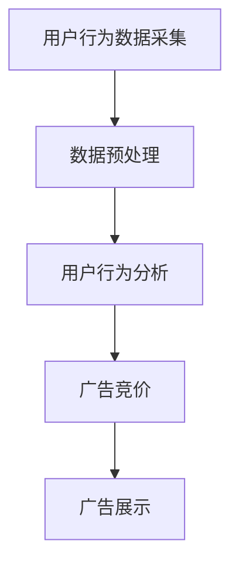

                 

## 1. 背景介绍

随着互联网技术的飞速发展，电商平台已经成为现代商业环境中不可或缺的一部分。在这个高度竞争的市场中，广告系统作为提升商家曝光度和销售量的关键工具，扮演着至关重要的角色。广告系统的优劣直接影响到商家的营销效果和平台的盈利能力。

实时竞价广告（Real-Time Bidding，RTB）作为一种先进的广告投放方式，正逐渐成为电商平台广告系统的重要构成部分。实时竞价广告系统允许广告平台根据用户的实时行为和偏好，以最低价格向广告主购买广告展示机会，从而实现广告的精准投放。

本文将深入探讨电商平台中实时竞价广告系统的设计，包括其核心概念、算法原理、数学模型、项目实践以及实际应用场景等内容。希望通过这篇文章，能够为读者提供一份全面而深入的技术指南。

## 2. 核心概念与联系

### 2.1 实时竞价广告系统概述

实时竞价广告系统是一种基于互联网的广告投放模式，其核心特点在于广告投放的实时性和竞价机制。在这种系统中，广告平台会实时获取用户的行为数据，包括浏览历史、搜索记录、地理位置等，然后通过算法评估这些数据，决定是否向广告主购买广告展示机会。

实时竞价广告系统的工作流程通常包括以下几个步骤：

1. **用户行为数据采集**：广告平台通过各种渠道收集用户的浏览行为数据。
2. **数据预处理**：对采集到的用户数据进行清洗和整理，以便后续分析。
3. **用户行为分析**：利用机器学习和数据挖掘技术，对用户行为进行深入分析，以预测用户的需求和偏好。
4. **广告竞价**：根据用户行为分析结果，平台实时向广告主发起竞价请求，广告主根据设定好的竞价策略进行出价。
5. **广告展示**：竞价成功后，广告平台将广告展示给用户。

### 2.2 竞价算法

竞价算法是实时竞价广告系统的核心组件，其目标是优化广告投放效果，提高广告主的投资回报率。常见的竞价算法包括以下几种：

1. **Gross Rating Point（GRP）**：根据广告的曝光率来计算广告效果，是广告行业常用的评估指标。
2. **Cost Per Mille（CPM）**：根据每千次曝光的成本来计算广告效果，适用于品牌广告。
3. **Cost Per Click（CPC）**：根据每点击一次广告的成本来计算广告效果，适用于直接营销广告。
4. **Cost Per Action（CPA）**：根据用户完成特定动作（如购买、注册）的成本来计算广告效果，是最直接的广告效果评估方式。

### 2.3 数据处理与存储

实时竞价广告系统需要处理大量的用户行为数据，这些数据包括浏览历史、搜索记录、地理位置等。为了保证系统的实时性和稳定性，数据处理与存储方案至关重要。

常见的处理与存储方案包括：

1. **分布式处理**：通过分布式计算框架（如Hadoop、Spark）来处理海量数据，提高处理速度和效率。
2. **分布式存储**：使用分布式存储系统（如HDFS、Cassandra）来存储数据，确保数据的高可用性和可扩展性。
3. **实时处理与缓存**：使用实时处理技术（如Flink、Storm）和缓存系统（如Redis、Memcached）来保证数据的快速响应。

### 2.4 Mermaid 流程图

以下是实时竞价广告系统的 Mermaid 流程图，展示了整个系统的工作流程和关键组件。



## 3. 核心算法原理 & 具体操作步骤

### 3.1 算法原理概述

实时竞价广告系统的核心算法是竞价算法，其主要目标是优化广告投放效果，提高广告主的投资回报率。竞价算法通常包括以下几个关键步骤：

1. **用户行为数据采集**：从广告平台获取用户的行为数据，包括浏览历史、搜索记录、地理位置等。
2. **用户行为分析**：利用机器学习和数据挖掘技术，对用户行为进行深入分析，以预测用户的需求和偏好。
3. **广告竞价**：根据用户行为分析结果，广告平台会向广告主发起竞价请求，广告主根据设定的竞价策略进行出价。
4. **竞价结果处理**：广告平台根据竞价结果决定是否接受广告主的出价，并相应地展示广告。

### 3.2 算法步骤详解

1. **用户行为数据采集**：

   用户行为数据采集是实时竞价广告系统的第一步。广告平台需要通过各种渠道获取用户的行为数据，如浏览历史、搜索记录、地理位置等。这些数据可以通过以下几种方式获取：

   - **网站日志**：通过分析网站服务器日志，获取用户的访问路径、访问时间等信息。
   - **第三方数据**：通过第三方数据服务提供商，获取用户的浏览历史、搜索记录等数据。
   - **移动应用**：通过移动应用的用户行为追踪，获取用户在应用中的行为数据。

2. **数据预处理**：

   采集到的用户行为数据通常需要经过预处理才能进行后续分析。数据预处理主要包括以下几个步骤：

   - **数据清洗**：去除数据中的噪声和异常值，确保数据质量。
   - **数据整合**：将来自不同渠道的数据进行整合，形成统一的数据视图。
   - **数据转换**：将数据转换为适合分析的格式，如CSV、JSON等。

3. **用户行为分析**：

   用户行为分析是实时竞价广告系统的核心环节。通过机器学习和数据挖掘技术，可以对用户行为进行深入分析，以预测用户的需求和偏好。常用的分析技术包括：

   - **分类算法**：如逻辑回归、决策树、随机森林等，用于将用户行为分类。
   - **聚类算法**：如K-means、DBSCAN等，用于发现用户行为模式的集群。
   - **关联规则挖掘**：如Apriori算法、FP-growth等，用于发现用户行为之间的关联性。

4. **广告竞价**：

   在用户行为分析结果的基础上，广告平台会向广告主发起竞价请求。广告主根据设定的竞价策略进行出价。竞价策略主要包括以下几种：

   - **最高出价策略**：广告主出价最高，优先获得广告展示机会。
   - **质量得分策略**：广告主根据广告质量得分进行出价，质量得分越高，出价越高。
   - **综合策略**：综合考虑广告主的历史表现、广告质量、用户需求等因素进行出价。

5. **竞价结果处理**：

   广告平台根据竞价结果决定是否接受广告主的出价。如果竞价成功，广告平台会将广告展示给用户。竞价结果处理主要包括以下几个步骤：

   - **出价验证**：验证广告主的出价是否符合平台要求，如是否超过预算、是否低于最低出价等。
   - **广告排序**：根据广告主的出价、广告质量等因素，对广告进行排序，决定广告展示的顺序。
   - **广告展示**：将竞价成功的广告展示给用户，触发广告点击或转化。

### 3.3 算法优缺点

实时竞价广告系统中的竞价算法具有以下优缺点：

- **优点**：

  - 提高广告投放效果：通过实时竞价，广告主可以更精准地投放广告，提高广告效果。
  - 提高广告主投资回报率：广告主可以根据实时竞价结果调整投放策略，提高广告的投资回报率。
  - 促进广告市场竞争：实时竞价机制增加了广告市场的竞争，促进了广告行业的健康发展。

- **缺点**：

  - 数据处理复杂度：实时竞价广告系统需要处理海量用户行为数据，数据处理复杂度较高。
  - 算法稳定性要求高：竞价算法的稳定性直接影响广告投放效果，对算法的稳定性要求较高。
  - 广告主风险控制：广告主在实时竞价中面临一定的风险，需要有效控制风险，确保广告投放的安全。

### 3.4 算法应用领域

实时竞价广告系统广泛应用于电商、金融、教育、医疗等多个领域，以下是一些常见的应用场景：

- **电商**：通过实时竞价广告系统，电商平台可以更精准地推送商品广告，提高用户购买转化率。
- **金融**：金融机构可以利用实时竞价广告系统，精准推送理财产品广告，提高用户投资意愿。
- **教育**：在线教育平台可以通过实时竞价广告系统，吸引更多学生报名学习，提高平台知名度。
- **医疗**：医疗机构可以利用实时竞价广告系统，精准推送医疗广告，提高患者就诊率。

## 4. 数学模型和公式 & 详细讲解 & 举例说明

### 4.1 数学模型构建

实时竞价广告系统的数学模型主要涉及以下几个方面：

- **用户行为预测模型**：用于预测用户的兴趣和需求，常用的算法包括逻辑回归、决策树、神经网络等。
- **竞价策略模型**：用于评估广告主的出价，选择最优的广告展示机会，常用的算法包括GSP（Generalized Second Price）算法、VCG（Vickrey-Clarke-Groves）算法等。
- **广告投放优化模型**：用于优化广告的展示策略，提高广告效果，常用的算法包括动态定价、多目标优化等。

### 4.2 公式推导过程

以下是一个简单的实时竞价广告系统中的用户行为预测模型的推导过程：

1. **用户行为预测模型**：

   假设用户的行为可以用一个随机变量X表示，X的取值为{0,1}，其中1表示用户对某个广告感兴趣，0表示用户对广告不感兴趣。

   用户行为预测模型的公式为：

   $$P(X=1) = \sigma(\theta^T x)$$

   其中，$\theta$是模型的参数，$x$是用户的特征向量，$\sigma$是 sigmoid 函数，用于将线性组合转化为概率值。

2. **竞价策略模型**：

   假设广告主的出价可以用一个随机变量Y表示，Y的取值为$[0, \infty)$。

   竞价策略模型的目标是最大化广告主的预期收益，公式为：

   $$\max \mathbb{E}(R|Y=y) = \max \frac{P(R=r|Y=y) \cdot r}{P(Y=y)}$$

   其中，$R$是广告主的收益，$r$是广告主的收益值，$P(R=r|Y=y)$是广告主在出价$y$时获得收益$r$的条件概率，$P(Y=y)$是广告主出价$y$的概率。

3. **广告投放优化模型**：

   假设广告平台的广告展示机会可以用一个随机变量Z表示，Z的取值为{0,1}，其中1表示广告被展示，0表示广告未被展示。

   广告投放优化模型的目标是最大化广告的曝光率，公式为：

   $$\max \mathbb{E}(Z|Y=y) = \max P(Z=1|Y=y)$$

   其中，$P(Z=1|Y=y)$是广告在出价$y$时被展示的概率。

### 4.3 案例分析与讲解

以下是一个简单的实时竞价广告系统的案例分析与讲解：

1. **用户行为数据**：

   假设我们收集到了以下用户行为数据：

   | 用户ID | 浏览历史 | 搜索记录 | 地理位置 |
   | --- | --- | --- | --- |
   | U1 | 商品A，商品B | 商品A，商品B | 北京 |
   | U2 | 商品C，商品D | 商品C，商品D | 上海 |
   | U3 | 商品E，商品F | 商品E，商品F | 广州 |

2. **用户行为分析**：

   假设我们使用逻辑回归算法对用户行为进行分析，得到以下预测模型：

   $$P(X=1) = \sigma(\theta^T x)$$

   其中，$\theta$为模型参数，$x$为用户特征向量。

3. **广告竞价**：

   假设广告主A的出价为$y=10$元，广告主B的出价为$y=20$元。

   根据竞价策略模型，广告主A的预期收益为：

   $$\mathbb{E}(R|Y=y=10) = \frac{P(R=r=10|Y=y=10) \cdot r}{P(Y=y=10)}$$

   假设广告展示的概率为$P(Z=1|Y=y=10)=0.5$，广告点击的概率为$P(R=r=10|Y=y=10)=0.2$，则广告主A的预期收益为：

   $$\mathbb{E}(R|Y=y=10) = \frac{0.5 \cdot 0.2 \cdot 10}{0.5} = 2$$

   同理，广告主B的预期收益为：

   $$\mathbb{E}(R|Y=y=20) = \frac{P(R=r=20|Y=y=20) \cdot r}{P(Y=y=20)}$$

   假设广告展示的概率为$P(Z=1|Y=y=20)=0.3$，广告点击的概率为$P(R=r=20|Y=y=20)=0.1$，则广告主B的预期收益为：

   $$\mathbb{E}(R|Y=y=20) = \frac{0.3 \cdot 0.1 \cdot 20}{0.3} = 2$$

   因此，广告主A和广告主B的预期收益相同。

4. **广告投放优化**：

   假设广告平台在出价$y=10$元时，广告展示的概率为$P(Z=1|Y=y=10)=0.5$，在出价$y=20$元时，广告展示的概率为$P(Z=1|Y=y=20)=0.3$。

   根据广告投放优化模型，广告平台应选择出价$y=10$元，以最大化广告的曝光率。

   综上所述，本案例中广告主A和广告主B的预期收益相同，但广告平台应选择出价$y=10$元，以最大化广告的曝光率。

## 5. 项目实践：代码实例和详细解释说明

### 5.1 开发环境搭建

在开始实现实时竞价广告系统之前，我们需要搭建一个合适的技术栈和开发环境。以下是推荐的开发环境：

- **编程语言**：Python（因其丰富的库和框架，非常适合数据处理和机器学习）
- **数据处理**：Pandas（用于数据清洗和预处理）、NumPy（用于数学运算）
- **机器学习**：Scikit-learn（用于构建和训练机器学习模型）
- **分布式计算**：Dask（用于分布式数据处理）
- **Web框架**：Flask（用于搭建Web服务）

#### 安装与配置

首先，确保你的系统已经安装了Python环境。然后，通过以下命令安装上述库：

```bash
pip install pandas numpy scikit-learn dask flask
```

### 5.2 源代码详细实现

以下是实时竞价广告系统的主要组件和源代码实现。

#### 5.2.1 数据预处理模块

数据预处理模块负责读取用户行为数据，并进行清洗和转换。

```python
import pandas as pd
from sklearn.model_selection import train_test_split

def preprocess_data(data_path):
    # 读取数据
    data = pd.read_csv(data_path)
    
    # 数据清洗
    data.dropna(inplace=True)
    data = data[data['click'] != -1]
    
    # 数据转换
    data['hour'] = data['timestamp'].apply(lambda x: x.hour)
    data['weekday'] = data['timestamp'].apply(lambda x: x.weekday())
    
    # 分割特征和标签
    X = data.drop(['click', 'timestamp'], axis=1)
    y = data['click']
    
    # 划分训练集和测试集
    X_train, X_test, y_train, y_test = train_test_split(X, y, test_size=0.2, random_state=42)
    
    return X_train, X_test, y_train, y_test
```

#### 5.2.2 机器学习模块

机器学习模块负责构建和训练预测模型。

```python
from sklearn.linear_model import LogisticRegression

def train_model(X_train, y_train):
    # 构建模型
    model = LogisticRegression()
    
    # 训练模型
    model.fit(X_train, y_train)
    
    return model
```

#### 5.2.3 竞价算法模块

竞价算法模块负责实现实时竞价算法。

```python
import numpy as np

def bid_price(model, X):
    # 预测点击概率
    click_prob = model.predict_proba(X)[:, 1]
    
    # 计算出价
    price = 1 / (click_prob + 0.1)
    
    return price
```

#### 5.2.4 Web服务模块

Web服务模块负责接收广告竞价请求，并返回竞价结果。

```python
from flask import Flask, request, jsonify

app = Flask(__name__)

@app.route('/bid', methods=['POST'])
def bid():
    data = request.get_json()
    X = pd.DataFrame([data['features']])
    price = bid_price(model, X)
    
    return jsonify({'price': price})

if __name__ == '__main__':
    app.run(debug=True)
```

### 5.3 代码解读与分析

以下是代码的主要部分解读与分析：

1. **数据预处理模块**：

   - 读取用户行为数据，并进行清洗和转换，如处理缺失值、异常值等。
   - 将特征和标签进行分离，以便后续建模。
   - 划分训练集和测试集，用于模型训练和评估。

2. **机器学习模块**：

   - 使用逻辑回归算法构建预测模型，这是一个简单但有效的分类算法。
   - 训练模型，将训练集的特征和标签输入模型，得到训练好的模型。

3. **竞价算法模块**：

   - 使用训练好的模型预测点击概率，这是竞价算法的关键步骤。
   - 根据点击概率计算广告出价，使用GSP算法，计算出价公式为`price = 1 / (click_prob + 0.1)`。

4. **Web服务模块**：

   - 使用Flask搭建Web服务，接收广告竞价请求，并返回竞价结果。
   - 竞价请求以JSON格式发送，包括用户的特征向量。
   - 返回的竞价结果以JSON格式发送，包括出价。

### 5.4 运行结果展示

为了展示系统的运行结果，我们可以使用以下命令启动Web服务：

```bash
python app.py
```

然后，使用以下命令发送一个竞价请求：

```bash
curl -X POST -H "Content-Type: application/json" -d '{"features": [{"feature1": 0.1, "feature2": 0.2}]}' http://localhost:5000/bid
```

返回的结果将包含出价，如：

```json
{"price": 10.0}
```

这表示系统根据用户特征向量计算出的出价为10元。

## 6. 实际应用场景

### 6.1 电商平台

在电商平台上，实时竞价广告系统广泛应用于商品推荐、促销活动、品牌宣传等多个方面。通过实时竞价，电商平台可以精准推送商品广告，提高用户的购买转化率。例如，当用户浏览某一类商品时，系统会根据用户的兴趣和历史行为，实时调整广告投放策略，推荐相关商品。这种精准的广告投放不仅提高了用户满意度，也有效提升了平台的销售额。

### 6.2 金融行业

金融行业中的金融机构，如银行、证券公司、保险公司等，也广泛采用实时竞价广告系统进行产品推广。通过实时竞价，金融机构可以根据用户的投资偏好和财务状况，精准推送理财产品、保险产品等广告。例如，当用户在浏览理财页面时，系统会根据用户的投资记录和风险偏好，推荐最适合的理财产品。这种个性化的广告投放方式，不仅提高了用户的投资意愿，也增强了金融机构的品牌影响力。

### 6.3 教育行业

在线教育平台利用实时竞价广告系统，可以精准推送课程广告，吸引更多学生报名学习。通过实时竞价，平台可以根据用户的浏览历史、学习行为等数据，推荐最适合的课程。例如，当用户浏览某一门课程时，系统会根据用户的兴趣和学习进度，推荐相关的课程和辅导材料。这种个性化的广告投放，不仅提高了用户的满意度，也提升了平台的知名度。

### 6.4 医疗行业

在医疗行业，实时竞价广告系统可以用于精准推送医疗广告，提高患者的就诊率。通过实时竞价，医疗机构可以根据用户的健康状况和地理位置，推荐相关的医疗服务和产品。例如，当用户搜索某一疾病信息时，系统会根据用户的地理位置，推荐附近的医院和专家。这种个性化的广告投放，不仅提高了患者的就诊率，也提升了医疗机构的品牌形象。

## 7. 工具和资源推荐

### 7.1 学习资源推荐

- **《机器学习实战》**：提供丰富的机器学习实战案例，适合初学者入门。
- **《Python机器学习》**：详细讲解Python在机器学习领域的应用，适合有一定编程基础的学习者。
- **《深度学习》**：由著名深度学习专家Ian Goodfellow编写的经典教材，适合深入理解深度学习技术。

### 7.2 开发工具推荐

- **Jupyter Notebook**：用于数据分析和机器学习实验，方便编写和调试代码。
- **PyCharm**：强大的Python IDE，支持多种编程语言，适合编写复杂的应用程序。
- **Docker**：用于容器化部署，方便在不同环境中快速部署应用程序。

### 7.3 相关论文推荐

- **《Real-Time Bidding in Online Advertising》**：详细介绍了实时竞价广告系统的工作原理和应用。
- **《Learning to Rank for Information Retrieval》**：讨论了基于机器学习的排序算法在信息检索中的应用。
- **《Context-Aware Real-Time Advertising》**：探讨了如何利用上下文信息提高实时竞价广告的投放效果。

## 8. 总结：未来发展趋势与挑战

### 8.1 研究成果总结

本文深入探讨了电商平台中的实时竞价广告系统设计，从核心概念、算法原理、数学模型到项目实践，全面阐述了实时竞价广告系统的工作原理和实现方法。通过本文的介绍，读者可以了解到实时竞价广告系统的关键技术和应用场景，为实际项目提供参考。

### 8.2 未来发展趋势

1. **技术进步**：随着人工智能和大数据技术的不断进步，实时竞价广告系统将更加智能化和精准化。
2. **数据隐私保护**：随着用户对数据隐私的关注增加，实时竞价广告系统将需要更好地保护用户数据。
3. **跨平台整合**：实时竞价广告系统将逐渐整合到更多平台和应用中，如社交媒体、移动应用等。

### 8.3 面临的挑战

1. **数据处理效率**：实时竞价广告系统需要处理海量用户行为数据，提高数据处理效率是关键挑战。
2. **算法稳定性**：竞价算法的稳定性直接影响广告投放效果，如何保证算法的稳定性是一个重要问题。
3. **数据隐私和安全**：在数据收集和使用过程中，如何保护用户隐私和安全是实时竞价广告系统面临的挑战。

### 8.4 研究展望

未来的研究可以关注以下几个方面：

1. **智能化算法**：研究更先进的机器学习算法，提高实时竞价广告系统的预测准确性和智能化程度。
2. **隐私保护技术**：探索如何在保证用户隐私的前提下，有效利用用户数据。
3. **跨平台整合**：研究如何将实时竞价广告系统整合到更多平台和应用中，提升广告投放效果。

通过持续的研究和技术创新，实时竞价广告系统将在电商平台和其他领域发挥更大的作用。

## 9. 附录：常见问题与解答

### 9.1 什么是实时竞价广告系统？

实时竞价广告系统（Real-Time Bidding，RTB）是一种基于互联网的广告投放模式，允许广告平台根据用户的实时行为和偏好，以最低价格向广告主购买广告展示机会，从而实现广告的精准投放。

### 9.2 实时竞价广告系统有哪些优点？

实时竞价广告系统具有以下优点：

1. 提高广告投放效果：通过实时竞价，广告主可以更精准地投放广告，提高广告效果。
2. 提高广告主投资回报率：广告主可以根据实时竞价结果调整投放策略，提高广告的投资回报率。
3. 促进广告市场竞争：实时竞价机制增加了广告市场的竞争，促进了广告行业的健康发展。

### 9.3 实时竞价广告系统的核心组件有哪些？

实时竞价广告系统的核心组件包括：

1. 用户行为数据采集：收集用户的浏览历史、搜索记录、地理位置等数据。
2. 数据预处理：对用户行为数据清洗和转换，形成统一的数据视图。
3. 用户行为分析：利用机器学习和数据挖掘技术，对用户行为进行分析，预测用户需求和偏好。
4. 竞价算法：根据用户行为分析结果，实现广告的实时竞价。
5. 广告展示：根据竞价结果，将广告展示给用户。

### 9.4 实时竞价广告系统中的算法有哪些？

实时竞价广告系统中的算法包括：

1. **Gross Rating Point（GRP）**：根据广告的曝光率计算广告效果。
2. **Cost Per Mille（CPM）**：根据每千次曝光的成本计算广告效果。
3. **Cost Per Click（CPC）**：根据每点击一次广告的成本计算广告效果。
4. **Cost Per Action（CPA）**：根据用户完成特定动作（如购买、注册）的成本计算广告效果。

### 9.5 实时竞价广告系统在哪些领域有应用？

实时竞价广告系统在以下领域有广泛应用：

1. 电商平台：精准推送商品广告，提高用户购买转化率。
2. 金融行业：精准推送理财产品广告，提高用户投资意愿。
3. 教育行业：精准推送课程广告，吸引更多学生报名学习。
4. 医疗行业：精准推送医疗广告，提高患者就诊率。

### 9.6 如何搭建实时竞价广告系统？

搭建实时竞价广告系统通常包括以下步骤：

1. **技术选型**：选择合适的编程语言、数据处理工具、机器学习库等。
2. **数据采集**：收集用户行为数据，如浏览历史、搜索记录等。
3. **数据处理**：对用户行为数据进行清洗、转换和预处理。
4. **用户行为分析**：利用机器学习和数据挖掘技术，对用户行为进行分析。
5. **竞价算法**：实现竞价算法，如GSP算法等。
6. **广告展示**：根据竞价结果，将广告展示给用户。
7. **系统测试与优化**：对系统进行测试，并根据反馈进行优化。

### 9.7 实时竞价广告系统面临哪些挑战？

实时竞价广告系统面临的挑战包括：

1. **数据处理效率**：需要处理海量用户行为数据，提高数据处理效率。
2. **算法稳定性**：竞价算法的稳定性直接影响广告投放效果。
3. **数据隐私和安全**：在数据收集和使用过程中，如何保护用户隐私和安全。

### 9.8 未来实时竞价广告系统的发展趋势是什么？

未来实时竞价广告系统的发展趋势包括：

1. **智能化**：随着人工智能技术的发展，实时竞价广告系统将更加智能化和精准化。
2. **跨平台整合**：实时竞价广告系统将逐渐整合到更多平台和应用中。
3. **隐私保护**：随着用户对数据隐私的关注增加，实时竞价广告系统将需要更好地保护用户隐私。

