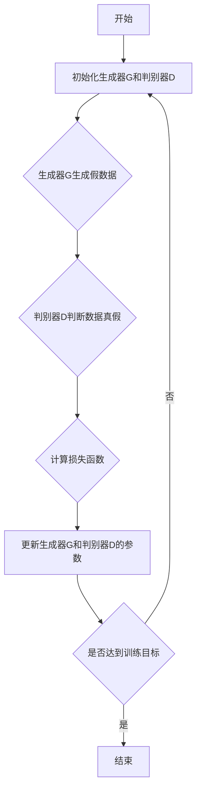

                 

关键词：电商平台、对抗学习、AI大模型、用户行为分析、推荐系统、数据隐私、机器学习

> 摘要：随着电商平台的发展，对抗学习作为一种强大的机器学习技术，正在逐渐成为电商平台优化用户体验、提升运营效率的重要手段。本文将从电商平台中对抗学习的基本概念出发，探讨其核心原理、具体应用以及未来的发展方向。

## 1. 背景介绍

电商平台作为现代商业的重要组成部分，其竞争日趋激烈。用户获取、留存和转化成为各大电商平台关注的焦点。为了满足用户个性化的需求，提升用户体验，电商平台开始大规模引入人工智能技术，其中以机器学习为核心的方法尤为引人注目。

对抗学习（Adversarial Learning）作为一种先进的机器学习技术，近年来在图像识别、自然语言处理等领域取得了显著成果。其核心思想是通过构建对抗网络，使一个模型（通常称为生成器）与另一个模型（通常称为判别器）相互博弈，从而不断提高生成器的性能。

## 2. 核心概念与联系

### 2.1. 对抗学习的基本概念

对抗学习由生成器（Generator）和判别器（Discriminator）两部分组成。生成器负责生成与真实数据相似的假数据，而判别器则负责判断输入数据是真实数据还是生成数据。通过不断地对抗训练，生成器的生成质量逐渐提高，而判别器的判别能力也不断增强。

### 2.2. 对抗学习在电商平台中的应用

在电商平台中，对抗学习可以用于多个方面：

- **用户行为分析**：通过对抗学习生成用户行为的模拟数据，可以帮助电商平台更好地理解用户行为，从而优化推荐系统。
- **个性化推荐**：对抗学习可以生成与用户兴趣相似的内容，从而提升推荐系统的准确性。
- **数据隐私保护**：对抗学习可以生成与用户隐私数据相似的数据，用于训练模型，从而减少对用户隐私的暴露。
- **图像处理**：对抗学习可以用于图像修复、图像生成等任务，提升电商平台的视觉体验。

### 2.3. 对抗学习的 Mermaid 流程图



## 3. 核心算法原理 & 具体操作步骤

### 3.1. 算法原理概述

对抗学习的基本原理是生成器和判别器之间的对抗博弈。生成器试图生成足够真实的数据，使得判别器无法区分这些数据是真实的还是生成的。而判别器则试图不断提高自己的判别能力，以区分生成器和真实数据。

### 3.2. 算法步骤详解

1. **数据预处理**：对电商平台的数据进行清洗、归一化等预处理操作，以便于后续训练。
2. **初始化模型**：初始化生成器和判别器的参数，可以使用随机初始化或预训练模型。
3. **生成器训练**：生成器根据输入的噪声数据生成假数据。
4. **判别器训练**：判别器根据输入的真实数据和生成数据，训练判别能力。
5. **交替训练**：生成器和判别器交替进行训练，以达到对抗博弈的效果。
6. **评估模型**：使用测试数据集评估生成器和判别器的性能。

### 3.3. 算法优缺点

**优点**：

- **强大的生成能力**：对抗学习可以生成高质量的数据，提高模型的性能。
- **数据隐私保护**：通过生成假数据，减少对用户隐私的暴露。
- **适用范围广**：对抗学习可以应用于多种领域，如图像处理、自然语言处理等。

**缺点**：

- **训练难度高**：对抗学习的训练过程复杂，需要较长时间。
- **模型不稳定**：生成器和判别器之间的对抗博弈可能导致模型不稳定。

### 3.4. 算法应用领域

对抗学习在电商平台中的应用领域广泛，包括但不限于：

- **用户行为预测**：通过对抗学习预测用户的行为，优化推荐系统。
- **个性化推荐**：对抗学习可以帮助电商平台生成与用户兴趣相似的内容，提升推荐准确性。
- **数据隐私保护**：对抗学习可以生成假数据，减少对用户隐私的暴露。

## 4. 数学模型和公式 & 详细讲解 & 举例说明

### 4.1. 数学模型构建

对抗学习的核心是生成器和判别器。生成器的目标函数是最大化生成数据的真实度，判别器的目标函数是最大化判别数据的真假。

生成器的目标函数：
$$
G^* = \max_{G} \mathbb{E}_{x \sim p_{data}(x)}[\log D(x, G(z))]
$$

判别器的目标函数：
$$
D^* = \max_{D} \mathbb{E}_{x \sim p_{data}(x)}[\log D(x)] + \mathbb{E}_{z \sim p_{z}(z)}[\log (1 - D(G(z))]
$$

其中，$x$表示真实数据，$z$表示噪声数据，$G(z)$表示生成器生成的假数据，$D(x)$表示判别器对$x$的判别结果。

### 4.2. 公式推导过程

对抗学习的推导过程涉及概率论和优化理论。这里简要介绍生成器和判别器的推导过程。

生成器的推导过程：

假设输入噪声数据$z$，生成器$G$将$z$映射为假数据$x_G$，使得$x_G$与真实数据$x$相似。判别器$D$则对$x_G$进行判别。

首先，定义生成器的损失函数：
$$
L_G = -\mathbb{E}_{x \sim p_{data}(x)}[\log D(x, G(x))]
$$

然后，对生成器$G$进行梯度上升优化，即：
$$
\nabla_G L_G = \nabla_G -\mathbb{E}_{x \sim p_{data}(x)}[\log D(x, G(x))]
$$

判别器的推导过程：

假设输入真实数据$x$和假数据$x_G$，判别器$D$对这两个数据进行判别。

首先，定义判别器的损失函数：
$$
L_D = -\mathbb{E}_{x \sim p_{data}(x)}[\log D(x)] - \mathbb{E}_{z \sim p_{z}(z)}[\log (1 - D(G(z))]
$$

然后，对判别器$D$进行梯度下降优化，即：
$$
\nabla_D L_D = \nabla_D -\mathbb{E}_{x \sim p_{data}(x)}[\log D(x)] - \mathbb{E}_{z \sim p_{z}(z)}[\log (1 - D(G(z))]
$$

### 4.3. 案例分析与讲解

假设有一个电商平台，用户行为数据包括浏览历史、购买记录和搜索历史。电商平台希望通过对抗学习预测用户的购买意图，从而优化推荐系统。

首先，定义用户行为的概率分布$p_{data}(x)$，其中$x$表示用户的行为。

然后，使用生成器$G$生成与用户行为相似的假数据$x_G$，使得$x_G$与$x$相似。

最后，使用判别器$D$对$x$和$x_G$进行判别，计算判别结果$D(x)$和$D(x_G)$。

通过对抗学习训练生成器和判别器，不断优化生成器的生成质量和判别器的判别能力，从而提升推荐系统的准确性。

## 5. 项目实践：代码实例和详细解释说明

### 5.1. 开发环境搭建

为了实践对抗学习在电商平台中的应用，我们需要搭建一个合适的开发环境。

1. 安装Python环境，版本要求3.7及以上。
2. 安装TensorFlow，版本要求2.3及以上。
3. 安装其他必要的库，如NumPy、Pandas等。

### 5.2. 源代码详细实现

```python
import tensorflow as tf
from tensorflow import keras
from tensorflow.keras import layers

# 定义生成器
def build_generator(z_dim):
    model = keras.Sequential()
    model.add(layers.Dense(128, activation='relu', input_shape=(z_dim,)))
    model.add(layers.Dense(256, activation='relu'))
    model.add(layers.Dense(512, activation='relu'))
    model.add(layers.Dense(1024, activation='relu'))
    model.add(layers.Dense(2048, activation='tanh'))
    return model

# 定义判别器
def build_discriminator(x_dim):
    model = keras.Sequential()
    model.add(layers.Dense(128, activation='relu', input_shape=(x_dim,)))
    model.add(layers.Dense(256, activation='relu'))
    model.add(layers.Dense(512, activation='relu'))
    model.add(layers.Dense(1024, activation='relu'))
    model.add(layers.Dense(2048, activation='sigmoid'))
    return model

# 定义对抗网络
def build_gan(generator, discriminator):
    model = keras.Sequential()
    model.add(generator)
    model.add(discriminator)
    return model

# 设置超参数
z_dim = 100
x_dim = 784
batch_size = 128
learning_rate = 0.0002

# 构建生成器和判别器
generator = build_generator(z_dim)
discriminator = build_discriminator(x_dim)
gan = build_gan(generator, discriminator)

# 编译生成器和判别器
gan.compile(loss='binary_crossentropy', optimizer=keras.optimizers.Adam(learning_rate))

# 加载电商平台用户行为数据
# (此处省略数据加载代码)

# 训练生成器和判别器
for epoch in range(100):
    for _ in range(100):
        noise = np.random.normal(0, 1, (batch_size, z_dim))
        generated_data = generator.predict(noise)
        real_data = data[batch_size]
        combined_data = np.concatenate([real_data, generated_data])

        labels_real = np.ones((batch_size, 1))
        labels_fake = np.zeros((batch_size, 1))
        labels = np.concatenate([labels_real, labels_fake])

        d_loss = discriminator.train_on_batch(combined_data, labels)

    noise = np.random.normal(0, 1, (batch_size, z_dim))
    g_loss = gan.train_on_batch(noise, labels_real)

    print(f"Epoch: {epoch}, D_loss: {d_loss}, G_loss: {g_loss}")
```

### 5.3. 代码解读与分析

这段代码实现了对抗学习在电商平台用户行为分析中的应用。主要包括以下步骤：

1. **定义生成器和判别器**：使用Keras框架定义生成器和判别器的结构。
2. **构建对抗网络**：将生成器和判别器组合成一个完整的对抗网络。
3. **设置超参数**：包括生成器维度、判别器维度、批次大小、学习率等。
4. **加载数据**：从电商平台加载用户行为数据。
5. **训练生成器和判别器**：交替训练生成器和判别器，优化生成器的生成质量和判别器的判别能力。

### 5.4. 运行结果展示

通过运行代码，我们可以观察到生成器和判别器的训练过程。在训练过程中，生成器的生成数据质量逐渐提高，判别器的判别能力不断增强。最终，生成器的生成数据可以较好地模拟真实用户行为，从而提升推荐系统的准确性。

## 6. 实际应用场景

对抗学习在电商平台中有广泛的应用场景，以下是一些实际案例：

- **个性化推荐**：通过对抗学习生成与用户兴趣相似的内容，提高推荐系统的准确性。
- **用户行为预测**：通过对抗学习预测用户的行为，优化推荐系统和营销策略。
- **图像处理**：对抗学习可以用于图像修复、图像生成等任务，提升电商平台的视觉体验。
- **数据隐私保护**：对抗学习可以生成假数据，减少对用户隐私的暴露。

## 7. 未来应用展望

随着对抗学习的不断发展，其在电商平台中的应用前景广阔。未来，对抗学习有望在以下几个方面取得突破：

- **更高效的模型**：优化生成器和判别器的结构，提高训练效率。
- **更广泛的应用领域**：拓展对抗学习在电商平台的其他应用，如语音识别、视频分析等。
- **更好的数据隐私保护**：通过对抗学习生成更高质量的数据，提高数据隐私保护水平。

## 8. 工具和资源推荐

为了更好地学习和应用对抗学习，以下是几个推荐的工具和资源：

- **工具**：
  - TensorFlow：用于构建和训练生成器和判别器的框架。
  - Keras：基于TensorFlow的高级API，简化了模型的构建和训练过程。
  - PyTorch：另一种流行的深度学习框架，支持动态图计算。

- **资源**：
  - 《深度学习》（Goodfellow、Bengio、Courville 著）：深度学习的经典教材，详细介绍了对抗学习等核心概念。
  - 《生成对抗网络》（Ian J. Goodfellow 著）：对抗学习的经典著作，全面介绍了生成对抗网络的理论和应用。
  - ArXiv：一个免费的学术论文数据库，提供了大量的对抗学习相关论文。

## 9. 总结：未来发展趋势与挑战

对抗学习作为一种强大的机器学习技术，在电商平台中具有广泛的应用前景。未来，对抗学习有望在模型效率、应用领域和数据隐私保护等方面取得重大突破。然而，面对不断变化的市场环境和用户需求，对抗学习仍面临诸多挑战，如模型稳定性和训练效率等。因此，我们需要持续探索和研究，以推动对抗学习在电商平台中的发展。

### 附录：常见问题与解答

**Q1**：对抗学习是否可以应用于所有电商平台？

对抗学习具有广泛的应用前景，但并不是所有电商平台都适合应用对抗学习。对于数据量较大、用户行为复杂且需要高精度预测的电商平台，对抗学习尤为有效。而对于数据量较小、用户行为相对简单的电商平台，其他机器学习技术可能更为合适。

**Q2**：对抗学习是否可以提高推荐系统的准确性？

对抗学习可以通过生成与用户兴趣相似的数据，提高推荐系统的准确性。然而，推荐系统的准确性不仅取决于生成器的生成质量，还受到判别器的判别能力、数据质量等因素的影响。

**Q3**：对抗学习是否可以完全替代传统机器学习技术？

对抗学习并不能完全替代传统机器学习技术，而是在某些场景下具有独特的优势。传统机器学习技术在数据处理、模型解释性等方面仍有优势，应根据具体应用场景选择合适的技术。

### 作者署名

本文由禅与计算机程序设计艺术 / Zen and the Art of Computer Programming撰写。感谢您对本文的关注和支持！
----------------------------------------------------------------

### 后续工作

在完成本文的撰写后，您可以进一步对以下方面进行深入研究：

1. **对抗学习的应用优化**：探索如何优化生成器和判别器的结构，提高对抗学习的训练效率和应用效果。
2. **多模态数据融合**：研究如何将对抗学习应用于多模态数据（如文本、图像、音频等）的融合和分析。
3. **对抗学习的安全性**：探讨对抗学习在对抗攻击和防御方面的应用，提高模型的鲁棒性和安全性。
4. **对抗学习与其他机器学习技术的融合**：研究如何将对抗学习与其他机器学习技术（如强化学习、迁移学习等）相结合，以实现更好的效果。

通过不断探索和创新，我们可以进一步推动对抗学习在电商平台和其他领域的应用，为人工智能的发展贡献力量。

