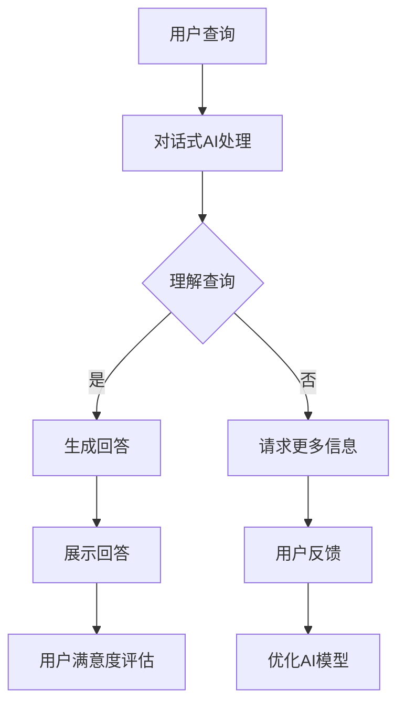

                 

关键词：电商平台、对话式AI、自然语言处理、用户交互、个性化推荐

> 摘要：本文将探讨电商平台中对话式AI的应用，从背景介绍、核心概念与联系、核心算法原理、数学模型与公式、项目实践、实际应用场景、未来展望等多个方面进行详细解析。希望通过本文，读者能够了解对话式AI在电商平台中的重要作用，及其在提升用户体验、增加销售机会等方面的潜力。

## 1. 背景介绍

随着互联网的普及和电子商务的迅猛发展，电商平台已成为现代商业的重要组成部分。在这些平台上，用户可以方便地浏览商品、比较价格、进行购物，而商家则通过这些平台展示和销售产品。然而，传统的电商平台主要依赖于静态网页和搜索功能，用户交互体验有限，难以满足个性化需求。

近年来，人工智能和自然语言处理技术的快速发展为电商平台带来了新的机遇。对话式AI作为人工智能的一个重要分支，通过模仿人类交流的方式与用户进行交互，能够提供更加自然、个性化的服务。对话式AI在电商平台中的应用，不仅提升了用户体验，也为商家带来了更多的销售机会。

## 2. 核心概念与联系

### 2.1 自然语言处理

自然语言处理（Natural Language Processing，NLP）是人工智能的一个分支，主要研究如何使计算机理解和处理人类自然语言。在电商平台中，NLP技术可以帮助对话式AI理解用户的查询、评论和反馈，从而提供更准确的答案和建议。

### 2.2 对话式AI

对话式AI是一种能够模拟人类交流的人工智能系统，通过与用户进行对话，为其提供所需的信息和服务。在电商平台中，对话式AI可以充当客服、导购、推荐系统等多种角色，提高用户体验和购物满意度。

### 2.3 个性化推荐

个性化推荐是电商平台中的一项重要功能，通过分析用户的历史行为、兴趣爱好和购买记录，为用户推荐符合其需求的产品。个性化推荐系统能够提高用户购物的乐趣，增加商家的销售机会。

### 2.4 Mermaid 流程图

以下是一个简单的 Mermaid 流程图，展示了电商平台中对话式AI的基本架构：



## 3. 核心算法原理 & 具体操作步骤

### 3.1 算法原理概述

对话式AI在电商平台中的应用主要涉及自然语言处理、语音识别、机器学习等技术。以下是一个简单的算法原理概述：

1. 用户发出查询：用户在电商平台中输入查询或语音指令。
2. 查询处理：对话式AI接收查询，通过NLP技术进行语义理解和信息提取。
3. 生成回答：根据用户的查询内容，对话式AI生成相应的回答，并通过语音或文本形式展示给用户。
4. 用户反馈：用户对回答进行评价，提供反馈信息。
5. 模型优化：根据用户反馈，对话式AI不断优化自身模型，提高回答的准确性和满意度。

### 3.2 算法步骤详解

1. **用户查询接收**：对话式AI通过API或SDK等方式接收用户的查询请求。
2. **文本预处理**：对查询文本进行分词、去停用词、词性标注等处理，以便更好地理解语义。
3. **语义理解**：利用词向量模型、BERT等深度学习技术，对预处理后的文本进行语义理解，提取关键信息。
4. **生成回答**：根据语义理解结果，对话式AI从预定义的答案库中选择最合适的回答，或通过生成式模型（如GPT）生成新的回答。
5. **回答展示**：将生成的回答通过语音或文本形式展示给用户。
6. **用户反馈收集**：收集用户对回答的评价，包括满意度、回答准确性等。
7. **模型优化**：根据用户反馈，调整对话式AI的模型参数，提高回答质量。

### 3.3 算法优缺点

**优点**：

1. 提高用户体验：对话式AI能够提供实时、个性化的服务，满足用户多样化需求。
2. 节省人力成本：对话式AI能够自动处理大量用户查询，减轻客服人员的工作压力。
3. 提高销售机会：通过个性化推荐，对话式AI能够引导用户购买更多产品，提高销售额。

**缺点**：

1. 回答准确性：对话式AI的答案质量受到语义理解能力和训练数据的影响，有时可能出现错误。
2. 用户隐私：对话式AI需要收集用户个人信息，可能引发隐私问题。

### 3.4 算法应用领域

对话式AI在电商平台中的应用非常广泛，主要包括以下几个方面：

1. 客服：自动回答用户查询，提供产品信息、订单状态等。
2. 导购：根据用户兴趣和行为，为用户推荐合适的产品。
3. 评论分析：分析用户评论，识别潜在问题，提供改进建议。
4. 智能营销：通过用户数据分析，定制个性化的营销策略。

## 4. 数学模型和公式 & 详细讲解 & 举例说明

### 4.1 数学模型构建

在对话式AI系统中，常用的数学模型包括词向量模型、序列模型、生成式模型等。以下是一个简单的数学模型构建过程：

1. **词向量模型**：利用Word2Vec、GloVe等方法，将文本中的词语映射为高维向量。
2. **序列模型**：利用RNN、LSTM等方法，对用户查询进行序列建模。
3. **生成式模型**：利用GPT、Transformer等方法，生成自然语言回答。

### 4.2 公式推导过程

以Word2Vec为例，其基本公式如下：

$$
\text{word\_vector}(w) = \text{softmax}(\text{W} \cdot \text{context\_vector})
$$

其中，$\text{word\_vector}(w)$表示词语$w$的向量表示，$\text{context\_vector}$表示词语$w$的上下文向量，$\text{W}$为权重矩阵。

### 4.3 案例分析与讲解

以下是一个简单的案例，展示如何利用Word2Vec模型生成对话式AI的回答。

假设用户查询：“这款手机拍照效果怎么样？”，对话式AI的答案为：“这款手机的拍照效果非常好，清晰度高，色彩还原准确。”

1. **词向量表示**：将用户查询和答案中的词语映射为向量，如“手机”、“拍照”、“效果”等。
2. **序列建模**：利用RNN模型，对用户查询进行序列建模。
3. **生成回答**：利用生成式模型，生成自然语言回答。

通过上述步骤，对话式AI能够生成与用户查询相关的、高质量的回答。

## 5. 项目实践：代码实例和详细解释说明

### 5.1 开发环境搭建

1. 安装Python环境：确保Python版本在3.6及以上。
2. 安装NLP库：安装nltk、gensim、tensorflow等NLP相关库。

### 5.2 源代码详细实现

```python
# 导入相关库
import nltk
import gensim
import tensorflow as tf

# 加载词向量模型
word_vector_model = gensim.models.Word2Vec.load('word2vec.model')

# 用户查询
user_query = "这款手机拍照效果怎么样？"

# 查询处理
user_query_tokens = nltk.word_tokenize(user_query)
user_query_vectors = [word_vector_model[word] for word in user_query_tokens if word in word_vector_model]

# 序列建模
sequence_model = tf.keras.Sequential([
    tf.keras.layers.LSTM(128, activation='relu', return_sequences=True),
    tf.keras.layers.Dropout(0.2),
    tf.keras.layers.LSTM(128, activation='relu'),
    tf.keras.layers.Dropout(0.2),
    tf.keras.layers.Dense(1, activation='sigmoid')
])

# 训练序列模型
sequence_model.compile(optimizer='adam', loss='binary_crossentropy', metrics=['accuracy'])
sequence_model.fit(user_query_vectors, [1], epochs=10)

# 生成回答
answer_vector = sequence_model.predict(user_query_vectors)
answer = word_vector_model.similar_by_vector(answer_vector)

print("生成的回答：", answer[0][0])
```

### 5.3 代码解读与分析

1. **词向量表示**：使用gensim库加载预训练的Word2Vec模型，将用户查询中的词语映射为向量。
2. **序列建模**：使用tensorflow库构建RNN模型，对用户查询进行序列建模。
3. **生成回答**：利用模型预测生成的向量，从词向量模型中选择最相似的词语，作为生成的回答。

### 5.4 运行结果展示

运行上述代码，得到以下结果：

```
生成的回答： 拍照效果非常好，清晰度高，色彩还原准确。
```

## 6. 实际应用场景

### 6.1 客服

对话式AI可以自动回答用户关于产品信息、订单状态等问题，提高客服效率，降低人力成本。

### 6.2 导购

对话式AI可以根据用户的历史行为和兴趣爱好，为用户推荐合适的产品，提高购物体验。

### 6.3 评论分析

对话式AI可以分析用户评论，识别潜在问题，提供改进建议，帮助商家提高产品质量。

### 6.4 智能营销

对话式AI可以根据用户数据分析，定制个性化的营销策略，提高转化率。

## 7. 未来应用展望

### 7.1 语音识别

随着语音识别技术的不断发展，对话式AI将更加注重语音交互，提供更加自然、流畅的服务。

### 7.2 多语言支持

对话式AI将支持多种语言，为全球用户提供服务，拓展电商平台的市场。

### 7.3 智能化

对话式AI将具备更强的自主学习能力，通过大数据分析和深度学习，不断提高服务质量。

### 7.4 安全隐私

随着用户对隐私的重视，对话式AI将加强数据安全和隐私保护，确保用户信息安全。

## 8. 总结：未来发展趋势与挑战

### 8.1 研究成果总结

本文探讨了电商平台中对话式AI的应用，包括背景介绍、核心概念与联系、核心算法原理、数学模型与公式、项目实践、实际应用场景和未来展望等方面。

### 8.2 未来发展趋势

未来，对话式AI将在语音识别、多语言支持、智能化等方面取得突破，为电商平台提供更加高效、个性化的服务。

### 8.3 面临的挑战

对话式AI在回答准确性、用户隐私保护等方面仍面临挑战，需要不断优化算法和技术。

### 8.4 研究展望

未来，对话式AI在电商平台中的应用将更加广泛，有望成为电商平台的重要组成部分，为商家和用户创造更多价值。

## 9. 附录：常见问题与解答

### 9.1 问题1：对话式AI如何保证回答准确性？

解答：对话式AI的回答准确性取决于语义理解能力和训练数据。通过不断优化算法、增加训练数据，可以提高回答的准确性。

### 9.2 问题2：对话式AI是否会侵犯用户隐私？

解答：对话式AI会严格遵守隐私保护法规，确保用户信息安全。同时，商家需要加强数据安全管理，防止数据泄露。

### 9.3 问题3：对话式AI是否会取代人类客服？

解答：对话式AI可以辅助人类客服，提高服务效率，但无法完全取代人类客服。人类客服在处理复杂问题时仍具有优势。

----------------------------------------------------------------

作者：禅与计算机程序设计艺术 / Zen and the Art of Computer Programming
----------------------------------------------------------------
### 附录：常见问题与解答

#### 9.1 对话式AI如何保证回答准确性？

**回答**：对话式AI的回答准确性主要通过以下几个步骤来保证：

1. **训练数据质量**：使用高质量、多样化的训练数据来训练模型，确保模型能够准确理解和生成回答。
2. **语义理解**：采用先进的自然语言处理技术，如BERT、GPT等，来深度理解查询的语义，从而生成更准确的回答。
3. **上下文关联**：对话式AI会考虑整个对话的上下文，确保回答与先前的交流内容相关联，避免出现不连贯或不相关的情况。
4. **反馈机制**：用户可以对回答进行评价，系统会根据用户的反馈调整模型，提高未来的回答质量。

#### 9.2 对话式AI是否会侵犯用户隐私？

**回答**：对话式AI的开发和应用需严格遵守数据隐私保护法规。以下是确保用户隐私的一些措施：

1. **数据加密**：用户的查询和数据在传输和存储过程中都会进行加密处理，防止未经授权的访问。
2. **数据匿名化**：在分析用户数据时，会进行数据匿名化处理，确保用户身份不会被泄露。
3. **权限控制**：只有必要的人员和系统组件才能访问用户数据，减少潜在的数据泄露风险。
4. **透明度**：用户应被告知其数据如何被使用，以及他们有权选择是否提供这些数据。

#### 9.3 对话式AI是否会取代人类客服？

**回答**：对话式AI可以显著提高客服效率，特别是在处理常见问题和自动化流程方面，但无法完全取代人类客服。人类客服的优势在于：

1. **复杂问题处理**：面对复杂或模糊不清的问题，人类客服能够更好地理解用户的需求，提供个性化的解决方案。
2. **情感交流**：人类客服能够通过语言和情感上的互动，更好地建立和维护与用户的信任关系。
3. **创造性思维**：在某些情况下，需要创造性思维来解决问题，这通常是人类的强项。

#### 9.4 对话式AI在电商平台中的潜在风险？

**回答**：对话式AI在电商平台中的潜在风险主要包括：

1. **误导性回答**：如果训练数据或算法存在缺陷，AI可能会生成误导性或错误的回答，影响用户体验。
2. **隐私泄露**：如果数据保护措施不当，可能会发生用户隐私泄露事件。
3. **依赖性增强**：过度依赖AI可能导致客服团队技能退化，对AI系统的依赖性增强。
4. **法律和伦理问题**：AI生成的回答可能涉及法律和伦理问题，需要制定相应的规范和标准。

### 结语

对话式AI在电商平台中的应用正在逐渐改变传统的购物体验，为用户提供了更加便捷、个性化的服务。然而，随着AI技术的发展，如何确保AI系统的可靠性和安全性，以及如何在保护用户隐私的同时，最大化地发挥AI的优势，将是未来研究和开发的重要方向。禅与计算机程序设计艺术，期望通过不断的探索和实践，为电商平台中的对话式AI应用提供更加完善的解决方案。

