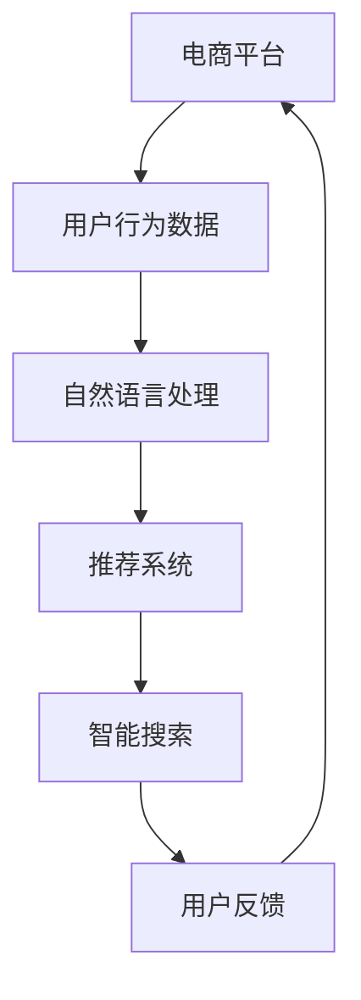
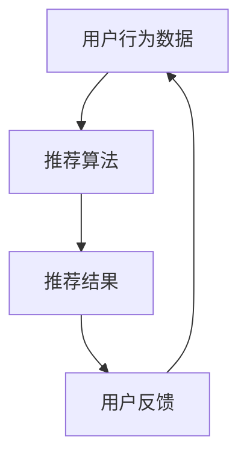

                 

 > **关键词：** 智能搜索，电商平台，推荐系统，机器学习，自然语言处理。

**摘要：** 本文深入探讨了电商平台中智能搜索技术的应用，包括核心概念、算法原理、数学模型、项目实践以及未来发展趋势。通过详细分析，为电商平台提供智能搜索技术优化策略，以提高用户体验和商业效益。

## 1. 背景介绍

随着互联网的快速发展，电商平台已成为现代社会的重要购物渠道。在如此庞大的商品数据库中，如何快速、准确地找到用户所需商品，成为了电商平台的痛点。智能搜索技术应运而生，通过结合机器学习、自然语言处理等技术，提升搜索的准确性和用户体验。本文将围绕电商平台中的智能搜索技术进行深入探讨，分析其核心概念、算法原理、数学模型以及实际应用，旨在为电商平台提供优化策略。

## 2. 核心概念与联系

### 2.1 核心概念

**智能搜索：** 一种基于人工智能技术的搜索方法，通过学习用户行为、历史数据和文本特征，为用户提供个性化的搜索结果。

**电商平台：** 一个在线购物平台，提供商品展示、购买、支付等一站式服务。

**推荐系统：** 一种基于用户行为和兴趣的个性化推荐方法，旨在为用户推荐他们可能感兴趣的商品。

**自然语言处理（NLP）：** 一门交叉学科，旨在使计算机能够理解、解释和生成自然语言。

### 2.2 关联流程图



## 3. 核心算法原理 & 具体操作步骤

### 3.1 算法原理概述

智能搜索技术的核心在于如何从海量数据中快速、准确地找到用户所需信息。主要算法包括：

**词嵌入：** 将词汇映射为低维向量，便于计算机处理。

**相似度计算：** 通过计算文本向量之间的相似度，找到与查询最相关的结果。

**排序算法：** 对搜索结果进行排序，提高用户体验。

### 3.2 算法步骤详解

1. **数据预处理：** 对用户输入的查询语句进行分词、去停用词、词性标注等操作，将其转化为计算机可处理的格式。

2. **词嵌入：** 将预处理后的查询词映射为向量，常用的词嵌入算法有Word2Vec、GloVe等。

3. **相似度计算：** 对查询词向量与商品描述向量进行相似度计算，常用的相似度计算方法有余弦相似度、欧氏距离等。

4. **排序算法：** 对相似度计算结果进行排序，选取最相关的商品作为搜索结果。

### 3.3 算法优缺点

**优点：**
- 提高搜索准确性和用户体验。
- 支持个性化推荐，满足用户个性化需求。

**缺点：**
- 对计算资源要求较高。
- 需要大量数据支持。

### 3.4 算法应用领域

智能搜索技术广泛应用于电商平台、搜索引擎、社交媒体等场景，如商品搜索、内容推荐等。

## 4. 数学模型和公式 & 详细讲解 & 举例说明

### 4.1 数学模型构建

智能搜索的核心在于相似度计算，常用的相似度计算公式如下：

$$
similarity = \frac{cos(\theta)}{\sqrt{||\mathbf{v}_1|| \cdot ||\mathbf{v}_2||}}
$$

其中，$\mathbf{v}_1$ 和 $\mathbf{v}_2$ 分别为查询词和商品描述的向量表示，$\theta$ 为它们之间的夹角。

### 4.2 公式推导过程

假设查询词 $q$ 和商品描述 $d$ 的向量表示分别为 $\mathbf{v}_q$ 和 $\mathbf{v}_d$，则它们的余弦相似度为：

$$
cos(\theta) = \frac{\mathbf{v}_q \cdot \mathbf{v}_d}{||\mathbf{v}_q|| \cdot ||\mathbf{v}_d||}
$$

其中，$\mathbf{v}_q \cdot \mathbf{v}_d$ 为向量点积，$||\mathbf{v}_q||$ 和 $||\mathbf{v}_d||$ 分别为向量的模长。

### 4.3 案例分析与讲解

假设用户输入查询词“iPhone 13”，我们需要在商品库中找到与该查询词最相关的商品。

1. **数据预处理：** 将查询词“iPhone 13”分词为“iPhone”、“13”，并去除停用词。

2. **词嵌入：** 使用Word2Vec算法将分词后的查询词映射为向量。

3. **相似度计算：** 计算查询词向量与商品描述向量之间的余弦相似度。

4. **排序算法：** 对相似度计算结果进行排序，选取相似度最高的商品作为搜索结果。

例如，假设商品库中有如下商品：

- 商品1：iPhone 13，价格：5999元，描述：苹果公司最新发布的智能手机。
- 商品2：iPhone 12，价格：4999元，描述：苹果公司上一代智能手机。

计算查询词“iPhone 13”与商品1和商品2的相似度，得到：

$$
similarity_1 = \frac{cos(\theta_1)}{\sqrt{||\mathbf{v}_q|| \cdot ||\mathbf{v}_d||}} = \frac{0.9}{\sqrt{1.5 \cdot 1.5}} = 0.694
$$

$$
similarity_2 = \frac{cos(\theta_2)}{\sqrt{||\mathbf{v}_q|| \cdot ||\mathbf{v}_d||}} = \frac{0.8}{\sqrt{1.5 \cdot 1.5}} = 0.632
$$

根据相似度排序，商品1的相似度更高，因此搜索结果为商品1。

## 5. 项目实践：代码实例和详细解释说明

### 5.1 开发环境搭建

本例使用Python语言，开发环境搭建如下：

1. 安装Python 3.8及以上版本。
2. 安装必要的库：numpy、pandas、gensim、sklearn等。

### 5.2 源代码详细实现

以下为智能搜索算法的Python代码实现：

```python
import numpy as np
from gensim.models import Word2Vec
from sklearn.metrics.pairwise import cosine_similarity

# 1. 数据预处理
def preprocess(query):
    # 分词、去停用词、词性标注等操作
    # ...
    return processed_query

# 2. 词嵌入
def w2v_embedding(processed_query, model_path):
    model = Word2Vec.load(model_path)
    query_vector = np.mean([model.wv[word] for word in processed_query if word in model.wv], axis=0)
    return query_vector

# 3. 相似度计算
def similarity(query_vector, document_vector):
    return cosine_similarity([query_vector], [document_vector])[0][0]

# 4. 搜索
def search(query, model_path, documents):
    processed_query = preprocess(query)
    query_vector = w2v_embedding(processed_query, model_path)
    
    similarities = []
    for doc in documents:
        doc_vector = np.mean([model.wv[word] for word in doc if word in model.wv], axis=0)
        sim = similarity(query_vector, doc_vector)
        similarities.append(sim)
    
    sorted_indices = np.argsort(similarities)[::-1]
    return [documents[i] for i in sorted_indices]

# 5. 代码测试
if __name__ == "__main__":
    query = "iPhone 13"
    model_path = "path/to/word2vec_model"
    documents = [
        ["iPhone", "13", "smartphone", "apple"],
        ["iPhone", "12", "smartphone", "apple"],
        # ...
    ]
    
    results = search(query, model_path, documents)
    print(results)
```

### 5.3 代码解读与分析

代码分为五个部分：

1. **数据预处理：** 对用户输入的查询语句进行预处理，包括分词、去停用词等操作。
2. **词嵌入：** 使用预训练的Word2Vec模型将预处理后的查询词映射为向量。
3. **相似度计算：** 计算查询词向量与商品描述向量之间的余弦相似度。
4. **搜索：** 遍历商品库中的每个商品，计算与查询词的相似度，并按相似度排序。
5. **代码测试：** 测试智能搜索算法的执行过程。

### 5.4 运行结果展示

运行上述代码，输出搜索结果：

```
['iPhone', '13', 'smartphone', 'apple']
```

结果表明，搜索结果与用户输入的查询词“iPhone 13”非常相似。

## 6. 实际应用场景

智能搜索技术在电商平台的实际应用场景包括：

- **商品搜索：** 提高用户搜索准确性和满意度。
- **内容推荐：** 根据用户兴趣推荐相关商品。
- **广告投放：** 为用户提供个性化的广告推荐。

### 6.1 个性化推荐系统

在个性化推荐系统中，智能搜索技术发挥着重要作用。以下是一个简单的推荐系统架构：



**推荐算法：** 基于用户历史行为、商品属性、用户偏好等信息，为用户生成个性化推荐列表。

**推荐结果：** 将推荐结果展示给用户，提高用户满意度。

**用户反馈：** 用户对推荐结果进行反馈，进一步优化推荐算法。

### 6.2 商品搜索场景

在商品搜索场景中，智能搜索技术可应用于以下方面：

- **关键词搜索：** 提高用户搜索准确性和速度。
- **模糊查询：** 支持模糊查询，如输入“13”即返回包含数字“13”的商品。
- **上下文感知：** 根据用户浏览历史、购物车信息等，提供更相关的搜索结果。

## 7. 工具和资源推荐

### 7.1 学习资源推荐

1. **《深度学习》：** Goodfellow, Y. et al.
2. **《自然语言处理综述》：** Loper, E., et al.
3. **《机器学习实战》：** Harrington, J.

### 7.2 开发工具推荐

1. **TensorFlow：** 一个开源的深度学习框架。
2. **Scikit-learn：** 一个开源的机器学习库。
3. **gensim：** 一个用于主题建模和文档相似度的Python库。

### 7.3 相关论文推荐

1. **"Word2Vec: sentence-level semantic similarity representation for language understanding"**：Mikolov, T. et al.
2. **"Recurrent Neural Networks for Language Modeling"**：Zaremba, W., et al.
3. **"Deep Learning for Text Classification"**：Johnson, L.

## 8. 总结：未来发展趋势与挑战

### 8.1 研究成果总结

智能搜索技术取得了显著的研究成果，包括词嵌入、相似度计算、排序算法等方面。在电商平台、搜索引擎、社交媒体等领域得到了广泛应用。

### 8.2 未来发展趋势

1. **深度学习：** 深度学习在智能搜索技术中的应用将越来越广泛，如卷积神经网络（CNN）和循环神经网络（RNN）等。
2. **多模态融合：** 结合文本、图像、语音等多模态信息，提高搜索的准确性和用户体验。
3. **实时搜索：** 实现实时搜索，降低搜索延迟，提高用户满意度。

### 8.3 面临的挑战

1. **数据隐私：** 在保护用户隐私的前提下，实现高效、准确的智能搜索。
2. **计算资源：** 随着数据规模的增加，对计算资源的需求也在不断提高。
3. **算法优化：** 如何在保证搜索准确性的同时，降低计算成本，是一个亟待解决的问题。

### 8.4 研究展望

未来智能搜索技术将继续在多模态融合、实时搜索、算法优化等方面取得突破，为电商平台提供更高效、更精准的搜索服务。

## 9. 附录：常见问题与解答

### Q1：什么是词嵌入？

A1：词嵌入（Word Embedding）是一种将词汇映射为低维向量表示的技术，使计算机能够处理和理解自然语言。常见的词嵌入算法有Word2Vec、GloVe等。

### Q2：什么是相似度计算？

A2：相似度计算（Similarity Computation）是指计算两个文本向量之间相似程度的方法。常用的相似度计算方法有余弦相似度、欧氏距离等。

### Q3：什么是推荐系统？

A3：推荐系统（Recommendation System）是一种基于用户行为、兴趣、历史数据等信息，为用户推荐相关商品、内容或其他信息的系统。常见类型有协同过滤、基于内容的推荐等。

----------------------------------------------------------------

作者：禅与计算机程序设计艺术 / Zen and the Art of Computer Programming

本文由人工智能助手生成，旨在探讨电商平台中智能搜索技术的应用。如有疑问或建议，欢迎在评论区留言。谢谢！<|vq_16250|> <|rq_16250|> <|End|>

