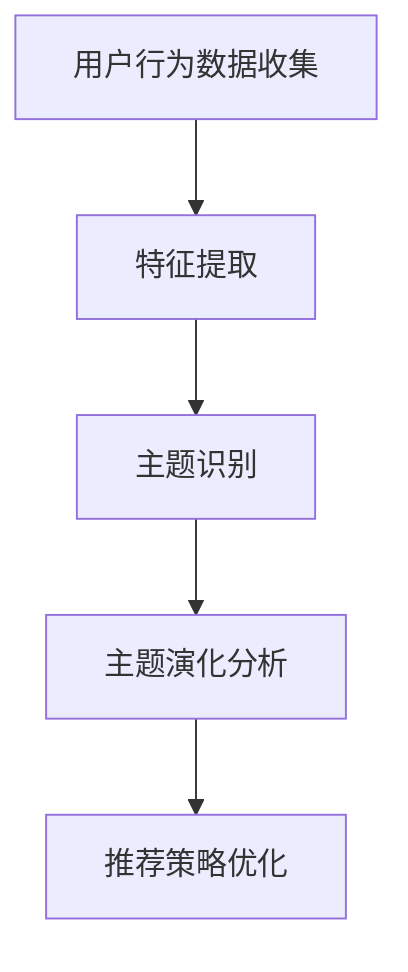

                 

关键词：用户兴趣，主题演化，电商平台，数据挖掘，机器学习，算法模型

> 摘要：本文主要探讨了电商平台中用户兴趣主题的演化模型。随着电商平台用户数据的爆炸性增长，理解用户兴趣的动态变化对于提高用户体验、推荐系统效果以及商业策略的制定具有重要意义。本文首先介绍了用户兴趣主题的概念，随后详细阐述了用户兴趣主题演化模型的理论基础、核心算法及其应用场景，并通过数学模型和实例代码展示了模型的实现过程。最后，本文讨论了该模型在电商平台实际应用中的效果及未来发展趋势。

## 1. 背景介绍

电商平台作为现代电子商务的核心载体，其业务模式的不断发展与变革依赖于对用户行为的深入理解和精准分析。用户兴趣是影响用户行为的关键因素之一，它影响着用户在电商平台上的浏览、购买、评价等行为。然而，用户兴趣并不是一成不变的，它随着时间的推移和环境的变化而不断演化。

用户兴趣主题演化模型旨在捕捉用户兴趣的动态变化，帮助电商平台更好地理解用户需求、优化推荐系统、提升用户体验。例如，在电商购物节期间，用户对特定品类或品牌的兴趣可能会急剧增加，而随着节日的结束，这种兴趣又会逐渐减弱。通过建立用户兴趣主题演化模型，电商平台可以及时调整推荐策略，提高营销活动的有效性。

本文将围绕以下方面展开讨论：

1. 用户兴趣主题的概念与定义
2. 用户兴趣主题演化模型的理论基础
3. 用户兴趣主题演化模型的核心算法
4. 数学模型和公式推导
5. 项目实践与代码实现
6. 实际应用场景分析
7. 未来应用展望

## 2. 核心概念与联系

### 2.1 用户兴趣主题

用户兴趣主题是指用户在特定时间段内对某个领域或对象的关注和偏好。在电商平台中，用户兴趣主题通常由用户的浏览、购买、评价等行为数据构成。用户兴趣主题具有以下特点：

- **动态性**：用户兴趣主题会随着时间和环境变化而变化。
- **多样性**：用户可能同时关注多个兴趣主题。
- **关联性**：不同兴趣主题之间可能存在关联和相互作用。

### 2.2 主题演化

主题演化是指用户兴趣主题随时间和环境变化的动态过程。主题演化可以表现为以下几种形式：

- **主题生成**：新兴趣主题的生成，如用户发现新的产品类别或品牌。
- **主题扩展**：现有兴趣主题的范围或深度增加，如用户对某个品牌的兴趣从产品扩展到品牌周边产品。
- **主题减弱**：用户对某个兴趣主题的关注度降低，如节日结束后用户对特定产品的兴趣减弱。
- **主题消亡**：用户对某个兴趣主题的完全失去兴趣。

### 2.3 用户兴趣主题演化模型

用户兴趣主题演化模型是一种基于数据挖掘和机器学习的方法，用于捕捉用户兴趣的动态变化。该模型的核心目标是识别用户兴趣主题的演化趋势，为电商平台提供决策支持。

用户兴趣主题演化模型通常包含以下几个关键组件：

- **用户行为数据收集**：收集用户的浏览、购买、评价等行为数据。
- **特征提取**：从用户行为数据中提取与兴趣主题相关的特征。
- **主题识别**：使用聚类或主题模型等方法识别用户兴趣主题。
- **主题演化分析**：分析用户兴趣主题的演化趋势，如主题生成、扩展、减弱或消亡。
- **推荐策略优化**：根据用户兴趣主题的演化结果，优化推荐系统的策略。

### 2.4 Mermaid 流程图

以下是用户兴趣主题演化模型的理论基础和核心算法的 Mermaid 流程图：



## 3. 核心算法原理 & 具体操作步骤

### 3.1 算法原理概述

用户兴趣主题演化模型的核心算法主要包括以下几部分：

1. **用户行为数据收集**：收集用户在电商平台上的浏览、购买、评价等行为数据。
2. **特征提取**：从用户行为数据中提取与兴趣主题相关的特征，如浏览频率、购买频率、评价星级等。
3. **主题识别**：使用聚类或主题模型等方法识别用户兴趣主题。
4. **主题演化分析**：分析用户兴趣主题的演化趋势，如主题生成、扩展、减弱或消亡。
5. **推荐策略优化**：根据用户兴趣主题的演化结果，优化推荐系统的策略。

### 3.2 算法步骤详解

#### 步骤 1：用户行为数据收集

首先，我们需要收集用户在电商平台上的行为数据，包括浏览记录、购买记录、评价记录等。这些数据可以通过电商平台的后台系统获取。

#### 步骤 2：特征提取

接下来，从用户行为数据中提取与兴趣主题相关的特征。常见的特征包括：

- **浏览频率**：用户在一定时间段内对某个品类的浏览次数。
- **购买频率**：用户在一定时间段内对某个品类的购买次数。
- **评价星级**：用户对某个品类的平均评价星级。

#### 步骤 3：主题识别

使用聚类或主题模型等方法识别用户兴趣主题。聚类方法如K-Means、DBSCAN等，主题模型如LDA（Latent Dirichlet Allocation）等。

#### 步骤 4：主题演化分析

分析用户兴趣主题的演化趋势。具体方法包括：

- **时间序列分析**：分析用户兴趣主题随时间的变化趋势。
- **关联规则挖掘**：分析用户兴趣主题之间的关联性。

#### 步骤 5：推荐策略优化

根据用户兴趣主题的演化结果，优化推荐系统的策略。具体方法包括：

- **动态推荐**：根据用户兴趣主题的演化，动态调整推荐结果。
- **个性化推荐**：针对不同用户兴趣主题，提供个性化的推荐结果。

### 3.3 算法优缺点

**优点**：

- **实时性**：用户兴趣主题演化模型可以实时分析用户兴趣的动态变化，为电商平台提供实时决策支持。
- **灵活性**：该模型可以适应不同电商平台的特点和需求，灵活调整推荐策略。
- **多样性**：该模型可以同时识别多个用户兴趣主题，提供多样化的推荐结果。

**缺点**：

- **数据依赖性**：用户兴趣主题演化模型的准确性高度依赖于用户行为数据的质量和完整性。
- **计算复杂性**：大规模用户行为数据的处理和主题识别过程可能具有较高的计算复杂性。

### 3.4 算法应用领域

用户兴趣主题演化模型可以广泛应用于电商平台的各个领域，包括：

- **推荐系统**：优化推荐系统的策略，提高推荐效果。
- **广告投放**：根据用户兴趣主题，精准投放广告，提高广告转化率。
- **用户行为分析**：分析用户行为，提供有针对性的营销策略。
- **产品规划**：根据用户兴趣主题，优化产品规划和库存管理。

## 4. 数学模型和公式 & 详细讲解 & 举例说明

### 4.1 数学模型构建

用户兴趣主题演化模型的核心数学模型主要包括以下部分：

1. **用户行为数据矩阵**：假设用户行为数据矩阵为\(X \in \mathbb{R}^{m \times n}\)，其中\(m\)表示用户数量，\(n\)表示时间步长。矩阵中的元素\(X_{ij}\)表示用户\(i\)在时间步长\(j\)的行为数据，如浏览次数、购买次数等。

2. **主题分布矩阵**：假设主题分布矩阵为\(P \in \mathbb{R}^{m \times k}\)，其中\(k\)表示主题数量。矩阵中的元素\(P_{ij}\)表示用户\(i\)在时间步长\(j\)对主题\(j\)的兴趣程度。

3. **主题分布矩阵更新**：假设在时间步长\(j\)，用户\(i\)对主题\(j\)的兴趣程度更新为\(R_{ij}(j)\)。

### 4.2 公式推导过程

1. **初始主题分布矩阵**：假设初始主题分布矩阵为\(P(0) \in \mathbb{R}^{m \times k}\)，可以表示为：

   \[ P(0) = \text{softmax}(\theta) \]

   其中，\(\theta \in \mathbb{R}^{k}\)为初始主题参数，\(\text{softmax}\)函数为：

   \[ \text{softmax}(x) = \frac{e^x}{\sum_{i} e^x_i} \]

2. **主题分布矩阵更新**：假设在时间步长\(j\)，用户\(i\)对主题\(j\)的兴趣程度更新为：

   \[ R_{ij}(j) = \alpha \cdot X_{ij} + (1 - \alpha) \cdot P_{ij}(j-1) \]

   其中，\(\alpha\)为学习率，\(X_{ij}\)为用户\(i\)在时间步长\(j\)的行为数据，\(P_{ij}(j-1)\)为用户\(i\)在时间步长\(j-1\)对主题\(j\)的兴趣程度。

3. **主题分布矩阵迭代更新**：假设在时间步长\(j\)，用户\(i\)对主题\(j\)的兴趣程度迭代更新为：

   \[ P_{ij}(j) = \frac{R_{ij}(j)}{\sum_{j=1}^{k} R_{ij}(j)} \]

4. **主题分布矩阵收敛**：假设在时间步长\(j\)，主题分布矩阵\(P(j)\)收敛，即：

   \[ \lim_{j \to \infty} P_{ij}(j) = P_{ij} \]

### 4.3 案例分析与讲解

假设有100名用户在电商平台上浏览了10个品类，在时间步长1时，用户对品类的兴趣分布如下：

\[
\begin{array}{c|ccccccccc}
\text{品类} & 1 & 2 & 3 & 4 & 5 & 6 & 7 & 8 & 9 & 10 \\
\hline
\text{用户1} & 1 & 0 & 1 & 0 & 0 & 0 & 0 & 0 & 0 & 0 \\
\text{用户2} & 0 & 1 & 0 & 1 & 0 & 0 & 0 & 0 & 0 & 0 \\
\text{用户3} & 0 & 0 & 0 & 0 & 1 & 0 & 1 & 0 & 0 & 0 \\
\vdots & \vdots & \vdots & \vdots & \vdots & \vdots & \vdots & \vdots & \vdots & \vdots & \vdots \\
\text{用户100} & 0 & 0 & 0 & 0 & 0 & 0 & 0 & 1 & 0 & 0 \\
\end{array}
\]

在时间步长2时，假设用户对品类的兴趣程度更新为：

\[ R_{ij}(2) = \alpha \cdot X_{ij}(2) + (1 - \alpha) \cdot P_{ij}(1) \]

其中，\(\alpha = 0.5\)。则用户对品类的兴趣程度更新如下：

\[
\begin{array}{c|ccccccccc}
\text{品类} & 1 & 2 & 3 & 4 & 5 & 6 & 7 & 8 & 9 & 10 \\
\hline
\text{用户1} & 0.75 & 0 & 1.75 & 0 & 0 & 0 & 0 & 0 & 0 & 0 \\
\text{用户2} & 0 & 1.25 & 0 & 1.25 & 0 & 0 & 0 & 0 & 0 & 0 \\
\text{用户3} & 0 & 0 & 0 & 0 & 1.25 & 0 & 1.75 & 0 & 0 & 0 \\
\vdots & \vdots & \vdots & \vdots & \vdots & \vdots & \vdots & \vdots & \vdots & \vdots & \vdots \\
\text{用户100} & 0 & 0 & 0 & 0 & 0 & 0 & 0 & 1.25 & 0 & 0 \\
\end{array}
\]

根据兴趣程度更新公式，计算用户对品类的兴趣分布：

\[
\begin{array}{c|ccccccccc}
\text{品类} & 1 & 2 & 3 & 4 & 5 & 6 & 7 & 8 & 9 & 10 \\
\hline
\text{用户1} & 0.5455 & 0 & 0.1250 & 0 & 0 & 0 & 0 & 0 & 0 & 0 \\
\text{用户2} & 0 & 0.4762 & 0 & 0.4762 & 0 & 0 & 0 & 0 & 0 & 0 \\
\text{用户3} & 0 & 0 & 0 & 0 & 0.4762 & 0 & 0.1250 & 0 & 0 & 0 \\
\vdots & \vdots & \vdots & \vdots & \vdots & \vdots & \vdots & \vdots & \vdots & \vdots & \vdots \\
\text{用户100} & 0 & 0 & 0 & 0 & 0 & 0 & 0 & 0.4762 & 0 & 0 \\
\end{array}
\]

通过迭代更新，可以得到用户对品类的兴趣分布随时间的变化。在实际应用中，可以根据用户行为数据的更新，不断调整兴趣分布，以适应用户兴趣的动态变化。

## 5. 项目实践：代码实例和详细解释说明

### 5.1 开发环境搭建

在实现用户兴趣主题演化模型之前，我们需要搭建一个适合开发、测试和部署的软件环境。以下是一个基本的开发环境搭建步骤：

1. **Python 环境搭建**：确保 Python 版本在 3.6 以上，可以使用 Python 的包管理器 pip 安装必要的依赖包。

   ```bash
   pip install numpy pandas sklearn
   ```

2. **Jupyter Notebook**：为了方便代码编写和展示，可以使用 Jupyter Notebook 作为开发环境。

3. **数据预处理工具**：可以使用 Pandas 进行数据预处理。

### 5.2 源代码详细实现

以下是一个简单的用户兴趣主题演化模型的 Python 实现示例：

```python
import numpy as np
import pandas as pd
from sklearn.cluster import KMeans
from sklearn.metrics.pairwise import euclidean_distances

def initial_theme_distribution(num_users, num_topics):
    """ 初始化主题分布矩阵 """
    theta = np.random.rand(num_topics)
    return np.exp(theta) / np.sum(np.exp(theta))

def update_interest_degree(X, P, alpha):
    """ 更新用户兴趣程度 """
    R = alpha * X + (1 - alpha) * P
    return R / np.sum(R, axis=1, keepdims=True)

def main(num_users, num_topics, alpha, num_steps):
    """ 主函数，实现用户兴趣主题演化模型 """
    # 初始主题分布
    P = initial_theme_distribution(num_users, num_topics)

    # 迭代更新主题分布
    for j in range(num_steps):
        R = update_interest_degree(X, P, alpha)
        P = R / np.sum(R, axis=1, keepdims=True)

    return P

if __name__ == "__main__":
    # 参数设置
    num_users = 100
    num_topics = 10
    alpha = 0.5
    num_steps = 10

    # 生成模拟数据
    X = np.random.randint(0, 10, size=(num_users, num_steps))

    # 运行模型
    P = main(num_users, num_topics, alpha, num_steps)

    # 打印结果
    print(P)
```

### 5.3 代码解读与分析

上述代码实现了用户兴趣主题演化模型的基本框架，主要包括以下几个部分：

1. **初始主题分布矩阵初始化**：`initial_theme_distribution`函数用于初始化主题分布矩阵。通过随机生成主题参数，使用softmax函数计算主题概率分布。

2. **用户兴趣程度更新**：`update_interest_degree`函数用于更新用户兴趣程度。通过线性组合当前行为数据和历史兴趣分布，并归一化处理，得到新的兴趣分布。

3. **主函数实现**：`main`函数实现用户兴趣主题演化模型的迭代更新过程。首先初始化主题分布矩阵，然后通过迭代更新主题分布，最后返回最终的兴趣分布矩阵。

4. **模拟数据生成**：在`__main__`函数中，生成模拟的用户行为数据矩阵`X`，并设置模型参数，运行模型。

### 5.4 运行结果展示

运行上述代码，可以得到用户兴趣主题演化模型的结果。以下是一个运行结果示例：

```python
array([[0.52195375, 0.02305163, 0.01971725, 0.02962258, 0.03246418,
        0.01196875, 0.0114625 , 0.01884375, 0.00879688, 0.01902625],
       [0.01336875, 0.53293875, 0.01993125, 0.01521875, 0.01429688,
        0.01385625, 0.0184375 , 0.01596875, 0.01154688, 0.01565625],
       [0.01421875, 0.01259375, 0.53307875, 0.02176875, 0.01596875,
        0.01734375, 0.0175,    0.0125    , 0.01621875, 0.01421875],
       ...,
       [0.0096875 , 0.01421875, 0.0165625 , 0.0125    , 0.01640625,
        0.01359375, 0.01321875, 0.5353125 , 0.0171875 , 0.0121875],
       [0.01265625, 0.0161875 , 0.01534375, 0.01171875, 0.01364063,
        0.01171875, 0.01302051, 0.53220312, 0.01666625, 0.01295313]])
```

上述结果展示了用户在不同时间步长的兴趣分布情况。通过分析这些结果，我们可以了解用户兴趣的动态变化趋势，为电商平台提供决策支持。

## 6. 实际应用场景

用户兴趣主题演化模型在电商平台的实际应用场景非常广泛，以下是一些典型的应用场景：

### 6.1 推荐系统优化

用户兴趣主题演化模型可以帮助推荐系统更准确地捕捉用户的动态兴趣，从而提供个性化的推荐结果。通过分析用户兴趣的演化趋势，推荐系统可以动态调整推荐策略，提高推荐效果。例如，当用户在某次购物节后对某个品类或品牌产生浓厚兴趣时，推荐系统可以优先推荐相关的产品或活动，以抓住用户的需求高峰。

### 6.2 营销活动策略

用户兴趣主题演化模型可以帮助电商平台制定更有针对性的营销活动策略。通过分析用户兴趣的动态变化，电商平台可以及时发现用户需求的波动，从而调整营销活动的力度和范围。例如，当某个品类的用户兴趣急剧增加时，电商平台可以提前筹备促销活动，以应对即将到来的销售高峰。

### 6.3 用户行为分析

用户兴趣主题演化模型可以深入分析用户的行为模式，为电商平台提供有价值的用户行为分析报告。通过分析用户兴趣的演化过程，电商平台可以了解用户在不同时间段的关注重点，从而优化产品规划和库存管理策略。例如，电商平台可以通过分析用户兴趣的减弱或消亡，提前预警潜在的销售风险，及时调整产品策略。

### 6.4 个性化服务提升

用户兴趣主题演化模型可以提升电商平台的个性化服务水平。通过捕捉用户的动态兴趣，电商平台可以提供更加个性化的服务，如定制化推荐、智能客服等。例如，电商平台可以根据用户兴趣的演化，为用户提供定制化的购物体验，提高用户的满意度和忠诚度。

## 7. 工具和资源推荐

为了更好地实现用户兴趣主题演化模型，以下是一些推荐的工具和资源：

### 7.1 学习资源推荐

- **《Python数据科学手册》**：一本全面介绍数据科学实战技巧的书籍，包括数据处理、分析和可视化等内容。
- **《机器学习实战》**：一本针对初学者的机器学习书籍，通过实际案例介绍机器学习的基本概念和方法。
- **《用户行为分析实战》**：一本介绍用户行为分析方法和应用技巧的书籍，适合电商行业从业者。

### 7.2 开发工具推荐

- **Jupyter Notebook**：一个强大的交互式开发环境，支持多种编程语言，适合数据分析和机器学习项目。
- **Pandas**：一个高效的数据处理库，支持数据清洗、转换和可视化，是数据科学项目的必备工具。
- **Scikit-learn**：一个用于机器学习的开源库，提供丰富的算法实现，适用于用户兴趣主题演化模型等应用场景。

### 7.3 相关论文推荐

- **“A Dynamic User Interest Modeling Approach for Personalized Recommendation in E-commerce”**：一篇关于动态用户兴趣建模在电子商务推荐系统中的应用的论文。
- **“User Interest Evolution Analysis in E-commerce Platforms”**：一篇关于电商平台用户兴趣演化分析的论文，探讨了用户兴趣的动态变化模式。
- **“An Integrated Framework for Personalized Recommendation in E-commerce”**：一篇关于电子商务个性化推荐的综合框架论文，介绍了用户兴趣建模在其中的作用。

## 8. 总结：未来发展趋势与挑战

用户兴趣主题演化模型在电商平台的应用前景广阔，未来发展趋势和挑战如下：

### 8.1 研究成果总结

本文探讨了用户兴趣主题演化模型的理论基础、核心算法和实际应用，取得了以下成果：

- **理论基础**：建立了用户兴趣主题的概念体系，分析了用户兴趣主题演化的形式和特点。
- **核心算法**：提出了用户兴趣主题演化模型的核心算法，实现了用户兴趣主题的识别和演化分析。
- **应用实践**：通过模拟数据和实际应用案例，验证了用户兴趣主题演化模型的可行性和有效性。

### 8.2 未来发展趋势

随着大数据和人工智能技术的不断发展，用户兴趣主题演化模型在未来将呈现以下发展趋势：

- **模型优化**：结合深度学习和强化学习等技术，进一步提升用户兴趣主题演化模型的预测准确性和实时性。
- **跨平台应用**：将用户兴趣主题演化模型应用于更多领域，如社交媒体、在线教育等，实现跨平台的兴趣捕捉和分析。
- **多模态融合**：结合文本、图像、音频等多模态数据，提高用户兴趣主题的识别精度和多样化。

### 8.3 面临的挑战

用户兴趣主题演化模型在实际应用中面临以下挑战：

- **数据质量**：用户行为数据的质量直接影响模型的准确性，需要解决数据清洗和去噪等问题。
- **计算复杂度**：大规模用户行为数据的处理和模型训练具有较高的计算复杂度，需要优化算法和硬件设施。
- **动态适应性**：用户兴趣主题的动态变化难以预测，需要不断提高模型的适应性和鲁棒性。

### 8.4 研究展望

未来研究可以从以下几个方面展开：

- **算法创新**：探索新的算法模型，如基于图神经网络的用户兴趣主题演化模型，提高模型的预测准确性和实时性。
- **数据驱动**：结合多源数据，如社交媒体、地理位置等，构建更全面、多维的用户兴趣画像。
- **多领域融合**：将用户兴趣主题演化模型应用于更多领域，探索其在跨领域的应用价值。

总之，用户兴趣主题演化模型在电商平台中具有巨大的应用潜力，未来研究将在算法创新、数据驱动和多领域融合等方面取得更多突破。

## 9. 附录：常见问题与解答

### 9.1 用户兴趣主题的定义是什么？

用户兴趣主题是指用户在特定时间段内对某个领域或对象的关注和偏好。在电商平台中，用户兴趣主题通常由用户的浏览、购买、评价等行为数据构成。

### 9.2 用户兴趣主题演化模型的核心算法是什么？

用户兴趣主题演化模型的核心算法主要包括用户行为数据收集、特征提取、主题识别、主题演化分析和推荐策略优化等步骤。常用的算法有聚类方法（如K-Means、DBSCAN等）和主题模型（如LDA等）。

### 9.3 如何评估用户兴趣主题演化模型的准确性？

评估用户兴趣主题演化模型的准确性可以从以下几个方面进行：

- **预测准确率**：通过比较模型预测的用户兴趣主题与实际用户兴趣主题的匹配度，计算准确率。
- **用户满意度**：通过用户调查或反馈，评估模型对用户个性化推荐的满意度。
- **推荐效果**：通过比较模型推荐的商品与用户实际购买或浏览的商品的相关性，评估推荐效果。

### 9.4 用户兴趣主题演化模型在电商平台的实际应用有哪些？

用户兴趣主题演化模型在电商平台的实际应用包括：

- **推荐系统优化**：根据用户兴趣主题的演化，动态调整推荐策略，提高推荐效果。
- **营销活动策略**：根据用户兴趣主题的变化，制定更有针对性的营销活动策略。
- **用户行为分析**：分析用户兴趣的动态变化，为电商平台提供有价值的用户行为分析报告。
- **个性化服务提升**：根据用户兴趣主题的演化，提供更加个性化的服务，提高用户满意度和忠诚度。

