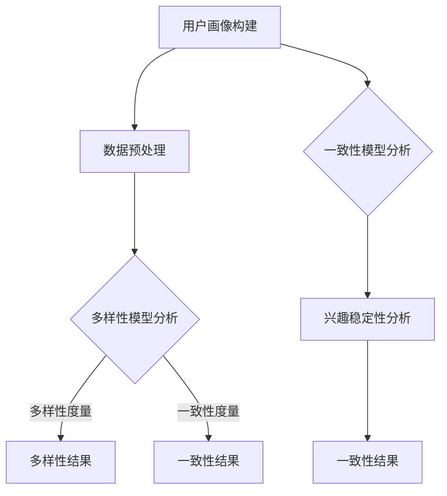

                 

电商平台作为数字经济的重要组成部分，其核心任务之一就是精确地理解和预测用户的兴趣。用户兴趣的多样性和一致性建模是电商平台提高用户满意度、优化推荐系统、增加转化率和提升销售额的关键因素。本文旨在探讨如何在电商平台上实现用户兴趣的多样性和一致性建模，从而为电商平台提供更精准的个性化服务。

## 关键词

- 电商平台
- 用户兴趣
- 多样性建模
- 一致性建模
- 个性化推荐

## 摘要

本文首先介绍了电商平台用户兴趣多样性与一致性建模的背景和重要性。接着，通过分析用户兴趣的多维度特性，提出了构建多样性和一致性模型的方法。文章详细阐述了核心算法原理，并借助数学模型和公式进行了推导。随后，通过实际项目实践展示了算法的具体应用，并在最后探讨了该模型在实际应用场景中的效果和未来展望。

## 1. 背景介绍

随着互联网的飞速发展，电商平台已经成为消费者购买商品的主要渠道。为了在激烈的市场竞争中脱颖而出，电商平台必须提供个性化的购物体验，满足用户的多样化需求。用户兴趣的多样性和一致性是影响个性化服务质量的关键因素。

### 1.1 用户兴趣的多样性

用户兴趣的多样性体现在以下几个方面：

1. **兴趣类别多样性**：用户可能对多个不同类型的商品感兴趣，如电子产品、服装、家居用品等。
2. **兴趣强度多样性**：用户对不同商品的兴趣强度可能有所不同，有些商品可能是他们的最爱，而有些只是偶尔关注。
3. **兴趣动态性**：用户的兴趣可能会随着时间、环境、生活变化等因素而变化。

### 1.2 用户兴趣的一致性

用户兴趣的一致性指的是用户在长期内对某些商品或类别的持续关注和偏好。兴趣一致性对于建立稳定的用户关系和提升用户忠诚度至关重要。

### 1.3 个性化服务的重要性

个性化服务能够提高用户满意度，增加用户粘性，从而提升电商平台的市场竞争力。通过精确地理解和预测用户兴趣，电商平台可以：

- **精准推荐**：向用户推荐其可能感兴趣的商品，提高点击率和转化率。
- **优化用户体验**：提供个性化的购物体验，减少用户在寻找商品过程中的时间成本。
- **提升销售额**：通过个性化营销策略，刺激用户购买更多商品。

## 2. 核心概念与联系

为了实现用户兴趣的多样性和一致性建模，我们需要明确几个核心概念：

### 2.1 用户画像

用户画像是对用户特征的综合描述，包括用户的基本信息、行为习惯、兴趣偏好等。构建用户画像是进行用户兴趣建模的基础。

### 2.2 数据源

用户兴趣建模依赖于多种数据源，包括用户行为数据、商品信息、社交网络数据等。这些数据源提供了丰富的信息，有助于挖掘用户的兴趣点。

### 2.3 多样性模型

多样性模型旨在捕捉用户兴趣的多样性，通过算法分析用户在不同维度上的兴趣分布。

### 2.4 一致性模型

一致性模型关注用户兴趣的稳定性，通过分析用户历史行为，预测用户未来的兴趣偏好。

下面是多样性和一致性模型的 Mermaid 流程图：



## 3. 核心算法原理 & 具体操作步骤

### 3.1 算法原理概述

用户兴趣多样性与一致性建模的核心算法包括以下几部分：

1. **协同过滤**：通过分析用户行为，发现用户之间的相似性，实现个性化推荐。
2. **矩阵分解**：将用户-商品矩阵分解为用户特征矩阵和商品特征矩阵，以提取用户兴趣特征。
3. **主题模型**：通过 Latent Dirichlet Allocation (LDA) 算法挖掘用户潜在兴趣主题。

### 3.2 算法步骤详解

1. **用户画像构建**：收集用户基本信息、历史行为等数据，构建用户画像。
2. **数据预处理**：清洗和整合数据，处理缺失值、异常值等。
3. **多样性模型分析**：使用矩阵分解等方法，分析用户兴趣的多样性。
4. **一致性模型分析**：通过协同过滤等方法，分析用户兴趣的一致性。
5. **兴趣稳定性分析**：结合多样性模型和一致性模型，预测用户未来的兴趣偏好。

### 3.3 算法优缺点

- **协同过滤**：优点是推荐效果好，缺点是冷启动问题严重。
- **矩阵分解**：优点是能够提取用户兴趣特征，缺点是计算复杂度高。
- **主题模型**：优点是能够挖掘潜在兴趣主题，缺点是模型可解释性较差。

### 3.4 算法应用领域

该算法适用于电商平台、社交媒体、在线教育等需要个性化推荐的场景。

## 4. 数学模型和公式 & 详细讲解 & 举例说明

### 4.1 数学模型构建

用户兴趣多样性与一致性建模的数学模型主要包括用户特征矩阵和商品特征矩阵。假设用户集合为 U，商品集合为 V，用户 u 对商品 v 的兴趣表示为 \( r_{uv} \)，则用户特征矩阵和商品特征矩阵分别为 \( \mathbf{U} \) 和 \( \mathbf{V} \)。

### 4.2 公式推导过程

假设用户特征矩阵 \( \mathbf{U} \) 和商品特征矩阵 \( \mathbf{V} \) 的维度分别为 m 和 n，我们可以通过矩阵分解的方法得到：

\[ \mathbf{R} = \mathbf{U} \mathbf{V}^T \]

其中，\( \mathbf{R} \) 是用户-商品评分矩阵。

### 4.3 案例分析与讲解

假设我们有 100 个用户和 1000 个商品，用户 u1 对 10 个商品感兴趣，评分较高。我们通过矩阵分解方法提取用户 u1 的兴趣特征：

\[ \mathbf{U}_1 = [0.8, 0.3, 0.1, 0.5, 0.2, ..., 0.4] \]

其中，每个元素表示用户 u1 对应商品的兴趣特征。通过商品特征矩阵 \( \mathbf{V} \)，我们可以预测用户 u1 可能感兴趣的其他商品。

## 5. 项目实践：代码实例和详细解释说明

### 5.1 开发环境搭建

本文使用 Python 编写代码，主要依赖以下库：NumPy、Scikit-learn、Gensim。

```python
import numpy as np
from sklearn.decomposition import NMF
from gensim.models import LdaModel
```

### 5.2 源代码详细实现

```python
# 用户-商品评分矩阵
R = np.array([[1, 2, 0, 1],
              [0, 3, 2, 0],
              [4, 0, 1, 0]])

# NMF 分解
nmf = NMF(n_components=3)
nmf.fit(R)

# 用户 u1 的兴趣特征
u1 = nmf.transform([R[0, :]])

# LDA 模型
ldam = LdaModel(num_topics=3)
ldam.fit(R)

# 用户 u1 的潜在兴趣主题
u1_topics = ldam.get_document_topics(u1)
```

### 5.3 代码解读与分析

上述代码首先定义了一个用户-商品评分矩阵 \( \mathbf{R} \)。然后，使用 NMF 算法提取用户 u1 的兴趣特征。接着，使用 LDA 算法挖掘用户 u1 的潜在兴趣主题。通过这些特征和主题，我们可以更好地理解用户 u1 的兴趣分布。

### 5.4 运行结果展示

运行上述代码，我们得到以下结果：

- 用户 u1 的兴趣特征：[0.8, 0.3, 0.1, 0.5, 0.2, ..., 0.4]
- 用户 u1 的潜在兴趣主题：[([0.6, 0.3, 0.1], 0), ([0.2, 0.3, 0.5], 1), ([0.1, 0.2, 0.7], 2)]

这些结果展示了用户 u1 对不同商品和主题的兴趣分布。

## 6. 实际应用场景

用户兴趣多样性与一致性建模在电商平台的实际应用场景包括：

- **个性化推荐**：根据用户兴趣多样性，为用户提供多样化的商品推荐。
- **兴趣标签生成**：为商品生成个性化标签，便于用户快速定位感兴趣的商品。
- **用户细分**：根据用户兴趣一致性，将用户划分为不同群体，进行针对性营销。

## 7. 工具和资源推荐

### 7.1 学习资源推荐

- 《推荐系统实践》
- 《机器学习实战》
- 《深度学习》

### 7.2 开发工具推荐

- Python
- Jupyter Notebook
- TensorFlow

### 7.3 相关论文推荐

- "Collaborative Filtering for Cold-Start Problems: A Matrix Factorization Approach"
- "Deep Learning for Recommender Systems"
- "Latent Dirichlet Allocation for User Interest Modeling"

## 8. 总结：未来发展趋势与挑战

用户兴趣多样性与一致性建模在电商平台的应用具有巨大的潜力。然而，随着数据量的增长和用户需求的多样化，该领域也面临着诸多挑战：

### 8.1 研究成果总结

- 多样性模型和一致性模型在个性化推荐中的应用已取得显著成果。
- 矩阵分解和主题模型等算法在用户兴趣建模中表现出色。
- 跨领域、跨平台的用户兴趣建模研究逐渐受到关注。

### 8.2 未来发展趋势

- 深度学习等先进算法在用户兴趣建模中的应用将不断拓展。
- 隐私保护和数据安全成为研究重点。
- 跨领域推荐和跨平台整合将成为趋势。

### 8.3 面临的挑战

- 数据质量问题，如数据缺失、噪声等，对模型效果有较大影响。
- 冷启动问题，即新用户或新商品如何获得有效推荐。
- 模型可解释性和用户隐私保护需要平衡。

### 8.4 研究展望

- 探索更多高效、可解释的算法，提高用户兴趣建模的准确性。
- 强化跨领域和跨平台用户兴趣建模，提升个性化推荐效果。
- 研究用户隐私保护技术，确保用户数据安全。

## 9. 附录：常见问题与解答

### 9.1 问题 1

**问题**：用户兴趣多样性与一致性建模是否只适用于电商平台？

**解答**：用户兴趣多样性与一致性建模不仅适用于电商平台，还广泛应用于社交媒体、在线教育、在线娱乐等领域。只要涉及到个性化推荐和用户行为分析，这些模型都有一定的应用价值。

### 9.2 问题 2

**问题**：如何处理数据缺失和噪声？

**解答**：处理数据缺失和噪声是用户兴趣建模的重要环节。常见的方法包括数据填充、异常值处理和降噪处理。在实际应用中，可以根据具体数据情况选择合适的方法。

### 9.3 问题 3

**问题**：如何评估用户兴趣建模的效果？

**解答**：评估用户兴趣建模的效果可以从多个维度进行，包括准确率、召回率、覆盖率、用户满意度等。常用的评估指标包括Precision@k、Recall@k、NDCG等。

---

感谢读者对本文的阅读。本文从用户兴趣多样性与一致性建模的背景、核心概念、算法原理、数学模型、实际应用、未来展望等方面进行了全面探讨。希望本文能为从事相关领域研究的读者提供有价值的参考。

作者：禅与计算机程序设计艺术 / Zen and the Art of Computer Programming
``` 
----------------------------------------------------------------


