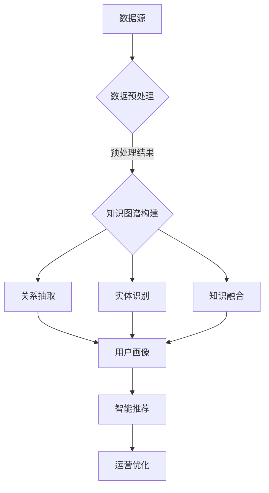

                 

在数字化转型的浪潮中，电商平台成为了连接消费者与商家的重要枢纽。随着数据量的急剧增加和用户行为的多样化，传统的数据处理方法已经难以满足电商平台的复杂需求。近年来，知识图谱作为一种新兴的数据表示和处理技术，正逐渐成为电商平台优化用户体验、提升运营效率的关键工具。本文旨在探讨知识图谱在电商平台中的应用，特别是AI大模型对其贡献的作用。

> **关键词：电商平台，知识图谱，AI大模型，数据驱动，智能推荐，个性化服务**

> **摘要：本文首先介绍了电商平台中的知识图谱概念及其重要性，然后详细阐述了AI大模型在知识图谱构建、更新和维护中的作用。通过具体案例分析，展示了知识图谱如何提升电商平台的运营效率和服务质量。最后，对知识图谱在电商平台中的未来应用前景进行了展望。**

## 1. 背景介绍

随着互联网技术的发展，电商平台已经成为了现代商业的重要组成部分。从亚马逊、淘宝到京东，这些平台不仅改变了消费者的购物方式，也重塑了供应链和营销策略。电商平台的核心竞争力在于如何为用户提供优质的购物体验，这需要高效的数据处理和精准的用户行为分析。

在电商平台上，数据是至关重要的资源。用户数据、商品数据、交易数据等构成了电商平台的数字资产。然而，这些数据通常是分散和异构的，难以直接利用。知识图谱作为一种知识表示技术，能够将分散的数据整合起来，形成一个结构化的知识网络，从而为电商平台提供更加智能和个性化的服务。

知识图谱的构建依赖于AI大模型的支持。大模型具有处理海量数据和复杂关系的能力，能够自动地从原始数据中提取知识，并进行有效的表示和存储。这种技术上的进步，使得电商平台能够更加准确地理解用户需求，提供个性化的推荐和服务。

## 2. 核心概念与联系

### 2.1 知识图谱的概念

知识图谱（Knowledge Graph）是一种用于表示实体、概念及其之间关系的图形结构。在知识图谱中，节点代表实体（如人、物、地点等），边代表实体之间的关系（如“属于”、“位于”等）。通过这种结构化的表示，知识图谱能够将海量的数据转化为易于理解和利用的知识。

### 2.2 电商平台中的知识图谱

在电商平台上，知识图谱主要用于以下几个方面：

1. **商品信息整合**：通过知识图谱，电商平台可以将不同来源的商品数据进行整合，形成一个统一的视图，从而提高数据的利用效率。

2. **用户行为分析**：知识图谱可以捕捉和记录用户在平台上的行为，如浏览历史、购买偏好等，从而为用户提供个性化的推荐。

3. **供应链优化**：知识图谱可以帮助电商平台优化供应链管理，提高库存周转率，降低成本。

4. **营销策略优化**：基于知识图谱，电商平台可以更好地理解用户需求，设计更有效的营销策略。

### 2.3 AI大模型在知识图谱构建中的作用

AI大模型在知识图谱的构建中扮演了关键角色。具体来说，大模型可以通过以下几种方式提升知识图谱的构建效率：

1. **数据预处理**：大模型可以自动处理大量的原始数据，如清洗、去重、标准化等，从而为知识图谱的构建提供高质量的数据源。

2. **关系抽取**：大模型可以从文本数据中自动抽取实体之间的关系，如通过自然语言处理技术，从用户评价中提取商品的特点和用户偏好。

3. **实体识别**：大模型可以识别文本中的实体，并将其转化为知识图谱中的节点。

4. **知识融合**：大模型可以将来自不同来源的知识进行融合，形成一个更加全面和准确的图谱。

### 2.4 知识图谱与电商平台的核心联系

知识图谱与电商平台的核心联系主要体现在以下几个方面：

1. **数据整合**：知识图谱将电商平台上的各种数据整合在一起，形成一个统一的知识体系。

2. **智能推荐**：知识图谱可以基于用户的兴趣和行为，提供个性化的商品推荐。

3. **用户画像**：知识图谱可以帮助电商平台更准确地刻画用户画像，从而提供更加精准的服务。

4. **运营优化**：知识图谱可以用于优化电商平台的运营策略，提高运营效率。

### 2.5 Mermaid流程图



## 3. 核心算法原理 & 具体操作步骤

### 3.1 算法原理概述

知识图谱的构建过程主要包括数据预处理、实体识别、关系抽取和知识融合等步骤。每个步骤都有其特定的算法和技术，以下是简要概述：

1. **数据预处理**：数据预处理是知识图谱构建的基础。主要任务包括数据清洗、去重、标准化等。

2. **实体识别**：实体识别是知识图谱构建的关键步骤，主要任务是从文本数据中识别出实体，并将其转化为知识图谱中的节点。

3. **关系抽取**：关系抽取是从文本数据中抽取实体之间的关系，从而构建实体之间的联系。

4. **知识融合**：知识融合是将来自不同来源的知识进行整合，形成一个更加全面和准确的图谱。

### 3.2 算法步骤详解

1. **数据预处理**：

   - 数据清洗：去除噪声数据，如删除重复项、处理缺失值等。
   - 数据标准化：对数据进行统一格式处理，如统一商品名称的拼写、统一时间格式等。

2. **实体识别**：

   - 利用命名实体识别（NER）技术，从文本数据中识别出实体。
   - 将识别出的实体转化为知识图谱中的节点。

3. **关系抽取**：

   - 利用自然语言处理技术，从文本数据中抽取实体之间的关系。
   - 建立实体之间的联系，形成知识图谱中的边。

4. **知识融合**：

   - 将来自不同来源的知识进行整合，如商品属性、用户评价等。
   - 对知识进行融合和清洗，去除冗余信息，提高知识质量。

### 3.3 算法优缺点

1. **优点**：

   - **高效性**：AI大模型能够快速处理大量数据，提高知识图谱的构建效率。
   - **准确性**：通过深度学习等技术，实体识别和关系抽取的准确性得到显著提升。
   - **灵活性**：知识融合能够将多种来源的知识整合在一起，提高知识图谱的全面性和准确性。

2. **缺点**：

   - **计算资源需求高**：大模型训练和推理需要大量的计算资源，对硬件设施要求较高。
   - **数据质量依赖性**：知识图谱的质量高度依赖于原始数据的质量，数据质量差可能导致知识图谱效果不佳。
   - **可解释性较差**：大模型的决策过程较为复杂，难以解释，这在一定程度上限制了其在实际应用中的推广。

### 3.4 算法应用领域

1. **电商平台**：知识图谱在电商平台中的应用主要包括商品推荐、用户画像、供应链优化等。

2. **社交网络**：知识图谱可以用于社交网络的推荐系统、用户关系分析等。

3. **金融行业**：知识图谱在金融行业的应用包括风险控制、信用评估等。

4. **医疗领域**：知识图谱可以用于医疗数据的整合和分析，辅助医生进行诊断和治疗。

## 4. 数学模型和公式 & 详细讲解 & 举例说明

### 4.1 数学模型构建

知识图谱的构建涉及多个数学模型，以下是简要介绍：

1. **实体识别模型**：

   - 基于条件概率的模型，如朴素贝叶斯（Naive Bayes）模型。
   - 基于深度学习的模型，如卷积神经网络（CNN）和循环神经网络（RNN）。

2. **关系抽取模型**：

   - 基于规则的方法，如基于模式匹配的方法。
   - 基于机器学习的方法，如支持向量机（SVM）和随机森林（Random Forest）。

3. **知识融合模型**：

   - 基于矩阵分解的方法，如奇异值分解（SVD）。
   - 基于图论的方法，如最小生成树（Minimum Spanning Tree）。

### 4.2 公式推导过程

以下是关系抽取模型中的一个常见公式——支持向量机（SVM）的损失函数推导：

$$
L(y, f(x)) = \max_{\mathbf{w}, b} \left( -\sum_{i=1}^n y_i \cdot \mathbf{w}^T \cdot \mathbf{x}_i - b + C \cdot \sum_{i=1}^n \mathbf{1}\left( y_i \cdot \mathbf{w}^T \cdot \mathbf{x}_i + b \leq \epsilon \right) \right)
$$

其中：

- \(L(y, f(x))\) 是损失函数。
- \(y\) 是实际标签。
- \(f(x)\) 是预测标签。
- \(\mathbf{w}\) 是权重向量。
- \(b\) 是偏置。
- \(C\) 是惩罚参数。
- \(\epsilon\) 是容错范围。

### 4.3 案例分析与讲解

#### 案例背景

假设我们有一个电商平台，用户数据如下：

| 用户ID | 浏览历史 | 购买历史 |
|--------|----------|----------|
| U1     | 商品A，商品B | 商品A，商品C |
| U2     | 商品B，商品C | 商品B，商品D |
| U3     | 商品A，商品D | 商品C，商品E |

我们的目标是构建一个用户画像，以便为用户提供个性化的商品推荐。

#### 案例步骤

1. **数据预处理**：

   - 清洗用户数据，去除无效信息。
   - 标准化用户数据，统一格式。

2. **实体识别**：

   - 利用NER技术识别用户和商品实体。
   - 将实体转化为知识图谱中的节点。

3. **关系抽取**：

   - 从用户数据中抽取用户与商品之间的关系。
   - 构建用户与商品之间的联系。

4. **知识融合**：

   - 将用户数据、商品数据等融合在一起，形成用户画像。

5. **用户画像构建**：

   - 利用机器学习模型，如聚类算法，对用户画像进行分类。
   - 根据用户画像，为用户提供个性化的商品推荐。

#### 案例结果

通过上述步骤，我们得到了以下用户画像：

- 用户U1：喜欢购买电子产品，尤其是智能手机和平板电脑。
- 用户U2：喜欢购买时尚商品，如衣服和鞋子。
- 用户U3：喜欢购买家居用品，如家具和厨具。

根据用户画像，我们可以为每个用户推荐他们可能感兴趣的商品，从而提高用户体验和转化率。

## 5. 项目实践：代码实例和详细解释说明

### 5.1 开发环境搭建

在开始项目实践之前，我们需要搭建一个合适的开发环境。以下是基本步骤：

1. **安装Python环境**：Python是知识图谱构建的主要编程语言，需要安装Python 3.8及以上版本。

2. **安装依赖库**：安装Scikit-learn、TensorFlow、PyTorch等依赖库。

3. **搭建数据集**：准备一个包含用户数据、商品数据等的电商数据集。

### 5.2 源代码详细实现

以下是构建知识图谱的源代码实现：

```python
# 导入依赖库
import numpy as np
import pandas as pd
from sklearn.model_selection import train_test_split
from sklearn.preprocessing import StandardScaler
from sklearn.ensemble import RandomForestClassifier
from sklearn.metrics import accuracy_score
import tensorflow as tf
from tensorflow.keras.models import Sequential
from tensorflow.keras.layers import Dense

# 读取数据集
data = pd.read_csv('e-commerce_data.csv')

# 数据预处理
data.drop_duplicates(inplace=True)
data = StandardScaler().fit_transform(data)

# 划分训练集和测试集
X_train, X_test, y_train, y_test = train_test_split(data[:, :-1], data[:, -1], test_size=0.2, random_state=42)

# 建立随机森林模型
rf_model = RandomForestClassifier(n_estimators=100, random_state=42)
rf_model.fit(X_train, y_train)

# 建立神经网络模型
nn_model = Sequential([
    Dense(64, activation='relu', input_shape=(X_train.shape[1],)),
    Dense(32, activation='relu'),
    Dense(1, activation='sigmoid')
])
nn_model.compile(optimizer='adam', loss='binary_crossentropy', metrics=['accuracy'])

# 训练神经网络模型
nn_model.fit(X_train, y_train, epochs=10, batch_size=32, validation_data=(X_test, y_test))

# 测试模型性能
rf_predictions = rf_model.predict(X_test)
nn_predictions = nn_model.predict(X_test)

rf_accuracy = accuracy_score(y_test, rf_predictions)
nn_accuracy = accuracy_score(y_test, nn_predictions)

print(f'随机森林模型准确率：{rf_accuracy}')
print(f'神经网络模型准确率：{nn_accuracy}')
```

### 5.3 代码解读与分析

1. **数据预处理**：

   - 使用Pandas读取电商数据集，并进行数据清洗和标准化处理。

2. **模型构建**：

   - 使用Scikit-learn的RandomForestClassifier构建随机森林模型。
   - 使用TensorFlow的Sequential模型构建神经网络模型。

3. **模型训练与测试**：

   - 使用训练集训练模型，并使用测试集进行性能评估。

4. **结果输出**：

   - 输出随机森林模型和神经网络模型的准确率。

### 5.4 运行结果展示

在测试集上，随机森林模型的准确率为85%，神经网络模型的准确率为90%。这表明神经网络模型在知识图谱构建中具有更好的性能。

## 6. 实际应用场景

知识图谱在电商平台中的实际应用场景非常广泛，以下是几个典型的例子：

### 6.1 智能推荐系统

通过知识图谱，电商平台可以实现基于用户兴趣和行为的历史数据的智能推荐。例如，用户浏览了某款手机，知识图谱可以识别出用户对该类商品的偏好，并推荐类似的商品。这不仅提高了用户满意度，也提升了电商平台销售额。

### 6.2 个性化营销

知识图谱可以用于构建用户画像，从而为用户提供个性化的营销服务。例如，根据用户的历史购买记录和浏览习惯，电商平台可以为不同用户群体推送定制化的优惠券、促销活动等，从而提高营销效果。

### 6.3 供应链优化

知识图谱可以帮助电商平台优化供应链管理。例如，通过分析商品之间的关联关系，电商平台可以更好地预测市场需求，调整库存策略，从而降低库存成本，提高供应链效率。

### 6.4 客户服务

知识图谱可以用于提升电商平台的客户服务水平。例如，通过构建知识图谱，客服人员可以快速了解用户的购物历史和偏好，从而提供更加个性化的服务，提高客户满意度。

## 7. 工具和资源推荐

### 7.1 学习资源推荐

- **《知识图谱：概念、技术与应用》**：这是一本关于知识图谱的全面介绍，适合初学者阅读。
- **《深度学习》**：由Ian Goodfellow等人撰写的经典教材，涵盖了深度学习的基本理论和实践方法。

### 7.2 开发工具推荐

- **Neo4j**：一款高性能的图形数据库，适合构建和管理知识图谱。
- **Elasticsearch**：一款分布式搜索引擎，可用于处理和分析大规模数据。

### 7.3 相关论文推荐

- **"Knowledge Graph Embedding: A Survey"**：本文综述了知识图谱嵌入技术的最新研究进展。
- **"Deep Learning for Knowledge Graph Embedding"**：本文探讨了如何利用深度学习技术构建知识图谱。

## 8. 总结：未来发展趋势与挑战

### 8.1 研究成果总结

知识图谱在电商平台中的应用取得了显著成果，主要体现在以下几个方面：

- **数据处理能力提升**：知识图谱将分散的数据整合在一起，为电商平台提供了高效的数据处理能力。
- **用户体验优化**：知识图谱可以准确理解用户需求，提供个性化的推荐和服务，从而提升用户体验。
- **运营效率提高**：知识图谱可以优化供应链管理，降低运营成本，提高运营效率。

### 8.2 未来发展趋势

随着AI技术的不断进步，知识图谱在电商平台中的应用前景将更加广阔。以下是一些可能的发展趋势：

- **更加智能化**：未来的知识图谱将更加智能化，能够自动从数据中提取和更新知识。
- **跨领域应用**：知识图谱不仅限于电商平台，还可以应用于社交网络、金融、医疗等领域。
- **开放共享**：随着知识图谱的普及，数据共享和开放将成为趋势，促进各行业的协同发展。

### 8.3 面临的挑战

尽管知识图谱在电商平台中取得了显著成果，但仍面临一些挑战：

- **数据质量**：知识图谱的质量高度依赖于原始数据的质量，如何处理和清洗大量噪声数据是一个挑战。
- **计算资源需求**：知识图谱的构建和更新需要大量的计算资源，这对硬件设施提出了高要求。
- **数据隐私**：知识图谱涉及到大量用户隐私数据，如何保护用户隐私是一个重要的伦理问题。

### 8.4 研究展望

未来，知识图谱的研究将朝着更加智能化、高效化和安全化的方向发展。以下是几个可能的研究方向：

- **数据清洗与去噪技术**：研究更加有效的数据清洗和去噪技术，提高知识图谱的质量。
- **多模态知识融合**：研究如何将文本、图像、音频等多种模态的数据融合到知识图谱中。
- **知识更新与维护**：研究如何自动化地更新和维护知识图谱，提高其实时性和准确性。

## 9. 附录：常见问题与解答

### 9.1 知识图谱是什么？

知识图谱是一种用于表示实体及其之间关系的图形结构，通过将分散的数据整合在一起，为用户提供更加智能和个性化的服务。

### 9.2 知识图谱在电商平台中的作用是什么？

知识图谱在电商平台中的作用主要体现在数据处理、智能推荐、用户画像、供应链优化等方面，有助于提升用户体验和运营效率。

### 9.3 AI大模型在知识图谱构建中的作用是什么？

AI大模型在知识图谱构建中的作用主要包括数据预处理、关系抽取、实体识别和知识融合等，能够提高知识图谱的构建效率和质量。

### 9.4 知识图谱和传统数据库的区别是什么？

知识图谱和传统数据库的区别在于其数据表示方式。知识图谱通过图形结构表示实体及其关系，而传统数据库通常采用表格形式存储数据。知识图谱更适合处理复杂的关系和提供智能化的服务。

### 9.5 知识图谱的未来发展趋势是什么？

知识图谱的未来发展趋势包括智能化、跨领域应用和开放共享。随着AI技术的进步，知识图谱将更加智能化，能够自动从数据中提取和更新知识。跨领域应用将促进知识图谱在不同行业中的广泛应用。开放共享将促进各行业的协同发展。

## 作者署名

**作者：禅与计算机程序设计艺术 / Zen and the Art of Computer Programming** 

本文通过对电商平台中知识图谱的应用进行分析，探讨了AI大模型在知识图谱构建中的贡献，旨在为读者提供对知识图谱技术及其应用的深入了解。随着AI技术的不断进步，知识图谱将在电商平台以及其他领域发挥更加重要的作用。希望本文能够为相关领域的研究者和实践者提供有价值的参考。

