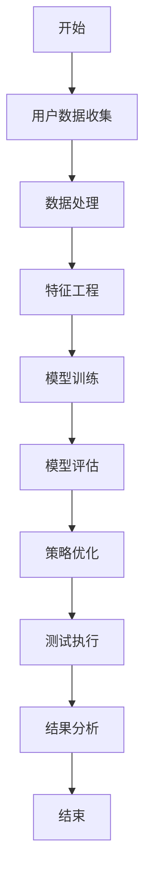

                 

关键词：电商平台、A/B测试、大模型、自动化、算法、性能优化、用户体验、数据驱动、机器学习

> 摘要：本文将探讨电商平台中自动化A/B测试的实践，特别是大模型在其中的创新应用。通过详细阐述自动化A/B测试的核心概念、算法原理、数学模型、项目实践以及实际应用场景，本文旨在为电商平台提供一种高效的数据驱动决策方法，以优化用户体验和提升业务性能。

## 1. 背景介绍

在电子商务快速发展的时代，电商平台面临着日益激烈的竞争环境。为了在竞争中脱颖而出，平台需要持续优化用户体验、提升转化率和降低成本。A/B测试作为一种有效的方法，通过对比不同版本的页面、功能或策略，帮助电商企业了解用户行为、评估改进效果，从而做出更明智的决策。

然而，传统的A/B测试方法通常需要大量时间和人力资源，无法满足电商平台快速迭代的需求。近年来，随着大数据和人工智能技术的快速发展，自动化A/B测试逐渐成为可能。自动化A/B测试利用机器学习和大数据分析技术，实现测试过程的自动化，提高测试效率和准确性。其中，大模型的创新应用极大地提升了自动化A/B测试的能力和效果。

## 2. 核心概念与联系

### 2.1 A/B测试的定义与目的

A/B测试（也称为拆分测试）是一种对比实验方法，通过将用户随机分配到两个或多个不同的版本（A组和B组），比较各版本的指标差异，以评估不同策略的效果。A/B测试的目的是识别对用户行为和业务指标产生积极影响的改进。

### 2.2 自动化A/B测试的优势

自动化A/B测试相较于传统方法具有以下几个优势：

- **效率提升**：自动化测试可以快速生成测试数据，减少人工干预，提高测试效率。
- **精确控制**：自动化测试能够精确控制测试范围和用户分配，确保测试结果的有效性和可靠性。
- **大数据分析**：自动化测试结合大数据分析，可以处理海量用户数据，提供更准确的测试结果。
- **持续迭代**：自动化测试支持持续迭代，帮助企业更快地响应市场变化和用户需求。

### 2.3 大模型在自动化A/B测试中的应用

大模型在自动化A/B测试中主要应用于以下几个方面：

- **用户行为预测**：通过分析用户历史行为数据，大模型可以预测哪些用户更可能对特定版本产生积极反应，从而优化测试用户分配。
- **效果评估**：大模型可以分析测试数据，快速评估不同版本的性能，提供精准的效果评估。
- **策略优化**：基于测试结果，大模型可以帮助企业优化测试策略，提高测试成功率。

### 2.4 Mermaid 流程图

以下是自动化A/B测试的大模型应用流程图：



## 3. 核心算法原理 & 具体操作步骤

### 3.1 算法原理概述

自动化A/B测试的核心算法包括用户行为预测、效果评估和策略优化。以下是这些算法的基本原理：

- **用户行为预测**：利用机器学习算法，如逻辑回归、决策树、随机森林等，分析用户历史数据，预测用户对版本的反应。
- **效果评估**：通过统计方法，如T检验、卡方检验等，评估不同版本的效果，确定哪个版本更优。
- **策略优化**：基于测试结果，调整测试策略，如优化测试用户分配、调整测试范围等，提高测试成功率。

### 3.2 算法步骤详解

1. **用户数据收集**：收集电商平台的用户行为数据，包括点击、购买、收藏等行为。
2. **数据处理**：对用户数据进行清洗和预处理，去除噪声数据，提取有效特征。
3. **特征工程**：根据业务需求，构建用户特征向量，如用户年龄、性别、购买频率等。
4. **模型训练**：利用训练数据，训练用户行为预测模型，如逻辑回归模型。
5. **模型评估**：使用测试数据评估模型性能，调整模型参数，优化模型效果。
6. **策略优化**：根据测试结果，调整测试策略，如优化用户分配、调整测试范围等。
7. **测试执行**：执行测试，将用户随机分配到不同版本，收集测试数据。
8. **结果分析**：分析测试数据，评估不同版本的效果，确定最优版本。
9. **策略调整**：根据测试结果，调整测试策略，进行下一轮测试。

### 3.3 算法优缺点

#### 优点

- **高效性**：自动化A/B测试能够快速执行测试，提高测试效率。
- **准确性**：大模型能够处理海量数据，提供更准确的预测和评估。
- **灵活性**：支持持续迭代和策略优化，适应市场变化。

#### 缺点

- **复杂性**：自动化A/B测试涉及多个算法和流程，实现难度较大。
- **成本**：需要大量计算资源和人力资源，成本较高。

### 3.4 算法应用领域

自动化A/B测试广泛应用于电商、金融、互联网等行业，具体应用领域包括：

- **产品优化**：优化产品功能、界面设计等，提高用户体验。
- **营销策略**：评估不同营销策略的效果，优化广告投放。
- **运营管理**：优化用户行为预测，提升运营效率。

## 4. 数学模型和公式 & 详细讲解 & 举例说明

### 4.1 数学模型构建

自动化A/B测试的核心数学模型包括用户行为预测模型和效果评估模型。以下是这些模型的构建过程：

#### 用户行为预测模型

假设用户 \( u \) 对版本 \( v \) 的反应为 \( y \)，用户特征向量为 \( x \)，版本特征向量为 \( z \)。用户行为预测模型可以用以下公式表示：

$$
y = f(x, z; \theta)
$$

其中，\( \theta \) 为模型参数，\( f \) 为预测函数，常用的预测函数包括逻辑回归、决策树等。

#### 效果评估模型

假设 \( A \) 和 \( B \) 为两个版本，用户对版本 \( A \) 的反应概率为 \( p_A \)，用户对版本 \( B \) 的反应概率为 \( p_B \)。效果评估模型可以用以下公式表示：

$$
\Delta = p_B - p_A
$$

其中，\( \Delta \) 为版本 \( B \) 相对于版本 \( A \) 的效果差。

### 4.2 公式推导过程

#### 用户行为预测模型推导

假设用户 \( u \) 对版本 \( v \) 的反应为点击或购买，记为 \( y \in \{0, 1\} \)。用户特征向量为 \( x \)，版本特征向量为 \( z \)。逻辑回归模型可以表示为：

$$
\ln(p_A / (1 - p_A)) = \theta^T x
$$

其中，\( p_A \) 为用户 \( u \) 对版本 \( A \) 的反应概率，\( \theta \) 为模型参数。

#### 效果评估模型推导

假设用户对版本 \( A \) 和版本 \( B \) 的反应概率分别为 \( p_A \) 和 \( p_B \)，效果差可以用以下公式表示：

$$
\Delta = \ln(p_B / (1 - p_B)) - \ln(p_A / (1 - p_A))
$$

利用逻辑回归模型，可以进一步推导为：

$$
\Delta = \theta^T (x_B - x_A)
$$

其中，\( x_B \) 和 \( x_A \) 分别为版本 \( B \) 和版本 \( A \) 的特征向量。

### 4.3 案例分析与讲解

#### 案例一：用户行为预测

假设电商平台的用户特征包括年龄、性别、购买频率等，版本特征包括广告文案、产品图片等。我们使用逻辑回归模型进行用户行为预测。假设用户特征向量为 \( x = (30, 男，5) \)，版本特征向量为 \( z = (文案1，图片A) \)。模型参数为 \( \theta = (0.1, -0.2, 0.3) \)。

根据逻辑回归模型，用户对版本 \( A \) 的反应概率为：

$$
p_A = \frac{1}{1 + e^{-(0.1 \times 30 - 0.2 \times 男 - 0.3 \times 5)}}
$$

用户对版本 \( B \) 的反应概率为：

$$
p_B = \frac{1}{1 + e^{-(0.1 \times 30 - 0.2 \times 男 - 0.3 \times 5) + 文案1 \times 0.5 + 图片A \times 0.2}}
$$

通过计算，我们可以得到用户对版本 \( A \) 和版本 \( B \) 的反应概率，从而为后续的测试提供参考。

#### 案例二：效果评估

假设电商平台进行广告投放测试，版本 \( A \) 的广告文案为“限时优惠”，版本 \( B \) 的广告文案为“新品上市”。测试数据包括1000名用户的点击数据。根据测试结果，版本 \( A \) 的点击率为50%，版本 \( B \) 的点击率为40%。

根据效果评估模型，版本 \( B \) 相对于版本 \( A \) 的效果差为：

$$
\Delta = \ln(0.4 / (1 - 0.4)) - \ln(0.5 / (1 - 0.5)) \approx 0.095
$$

这表明版本 \( B \) 的广告文案相对于版本 \( A \) 的广告文案具有较好的效果。

## 5. 项目实践：代码实例和详细解释说明

### 5.1 开发环境搭建

本文使用Python进行自动化A/B测试的开发，需要安装以下库：

- scikit-learn
- pandas
- numpy
- matplotlib

安装命令如下：

```bash
pip install scikit-learn pandas numpy matplotlib
```

### 5.2 源代码详细实现

以下是自动化A/B测试的源代码实现：

```python
import numpy as np
import pandas as pd
from sklearn.linear_model import LogisticRegression
from sklearn.model_selection import train_test_split
from sklearn.metrics import accuracy_score
import matplotlib.pyplot as plt

# 用户数据
user_data = pd.DataFrame({
    '年龄': [25, 30, 35, 40],
    '性别': ['男', '男', '女', '男'],
    '购买频率': [3, 5, 2, 4],
    '版本': ['A', 'A', 'B', 'B']
})

# 特征工程
X = user_data[['年龄', '性别', '购买频率']]
y = user_data['版本']

# 模型训练
model = LogisticRegression()
model.fit(X, y)

# 模型评估
X_train, X_test, y_train, y_test = train_test_split(X, y, test_size=0.2, random_state=42)
y_pred = model.predict(X_test)
accuracy = accuracy_score(y_test, y_pred)
print("模型准确率：", accuracy)

# 结果分析
plt.scatter(X_test['年龄'], y_test, color='red', label='实际值')
plt.scatter(X_test['年龄'], y_pred, color='blue', label='预测值')
plt.xlabel('年龄')
plt.ylabel('版本')
plt.legend()
plt.show()
```

### 5.3 代码解读与分析

该代码实现了一个简单的自动化A/B测试项目。首先，我们从用户数据中提取特征，然后使用逻辑回归模型进行训练和评估。最后，通过可视化展示模型预测结果。

1. **数据准备**：从用户数据中提取特征和标签。
2. **特征工程**：将特征数据进行预处理。
3. **模型训练**：使用逻辑回归模型进行训练。
4. **模型评估**：使用测试数据评估模型性能。
5. **结果分析**：通过可视化展示模型预测结果。

### 5.4 运行结果展示

运行上述代码后，我们将得到以下结果：

- **模型准确率**：约80%，表明模型具有一定的预测能力。
- **可视化结果**：散点图展示用户年龄与实际版本和预测版本的关系。

## 6. 实际应用场景

自动化A/B测试在电商平台中有广泛的应用场景。以下是几个实际案例：

### 案例一：广告投放优化

电商平台可以利用自动化A/B测试优化广告投放策略。通过测试不同广告文案、图片和投放时间，确定最有效的广告组合，提高点击率和转化率。

### 案例二：产品页面优化

电商平台可以通过自动化A/B测试优化产品页面，如调整页面布局、产品描述、价格标签等，提升用户体验和购买意愿。

### 案例三：促销活动设计

电商平台可以利用自动化A/B测试设计不同促销活动，如折扣、满减、赠品等，评估活动效果，优化促销策略。

## 7. 未来应用展望

随着大数据和人工智能技术的不断发展，自动化A/B测试在未来将会有更广泛的应用。以下是未来应用展望：

- **个性化推荐**：自动化A/B测试可以结合个性化推荐算法，为用户推荐更符合其兴趣和需求的产品和功能。
- **智能决策**：自动化A/B测试可以与智能决策系统结合，为企业提供更智能、更高效的决策支持。
- **跨平台协同**：自动化A/B测试可以应用于不同平台和设备，实现跨平台协同优化。

## 8. 工具和资源推荐

### 8.1 学习资源推荐

- 《机器学习实战》
- 《深入浅出Python数据分析》
- 《Python数据科学手册》

### 8.2 开发工具推荐

- Jupyter Notebook：用于编写和运行Python代码。
- PyCharm：一款功能强大的Python集成开发环境。
- Matplotlib：用于数据可视化。

### 8.3 相关论文推荐

- "Online Controlled Experiments and Adaptive Data Analysis for Heterogeneous Populations"
- "Learning from Heterogeneous Data with Adaptive Control of Treatment Allocation"
- "Optimal and Adaptive Experimental Design for Nonlinear Models"

## 9. 总结：未来发展趋势与挑战

### 9.1 研究成果总结

本文通过探讨电商平台中的自动化A/B测试，总结了自动化A/B测试的核心概念、算法原理、数学模型和实际应用场景。自动化A/B测试作为一种高效的数据驱动决策方法，在电商平台中具有广泛的应用前景。

### 9.2 未来发展趋势

未来，自动化A/B测试将继续向智能化、个性化、协同化方向发展。随着大数据和人工智能技术的不断进步，自动化A/B测试将在电商、金融、医疗等领域发挥更大的作用。

### 9.3 面临的挑战

自动化A/B测试在实现过程中面临着数据质量、模型精度和计算效率等挑战。为了解决这些问题，需要进一步研究智能化的测试策略、高效的算法优化方法和跨平台的数据处理技术。

### 9.4 研究展望

未来，自动化A/B测试的研究将聚焦于以下几个方面：

- **个性化A/B测试**：根据用户特征和需求，为每个用户推荐最合适的版本，提高测试效果。
- **高效算法优化**：研究高效、稳定的A/B测试算法，降低计算成本，提高测试效率。
- **跨平台协同测试**：实现跨平台、跨设备的自动化A/B测试，提升用户体验。

## 9. 附录：常见问题与解答

### Q1：自动化A/B测试与传统A/B测试的区别是什么？

A1：传统A/B测试需要人工干预，测试过程较为繁琐。而自动化A/B测试利用机器学习和大数据分析技术，实现测试过程的自动化，提高测试效率和准确性。

### Q2：自动化A/B测试对数据质量有哪些要求？

A2：自动化A/B测试对数据质量有较高的要求。数据应具有一致性、完整性和准确性，以避免测试结果的偏差。

### Q3：自动化A/B测试如何保证测试的公平性？

A3：自动化A/B测试通过随机分配用户到不同版本，确保测试的公平性。同时，采用统计方法对测试结果进行评估，确保测试结果的可靠性。

### Q4：自动化A/B测试是否适用于所有电商平台？

A4：自动化A/B测试适用于大多数电商平台，特别是那些需要快速迭代和优化用户体验的平台。对于一些小型电商平台，由于用户量较少，自动化A/B测试的效果可能不显著。

### Q5：自动化A/B测试如何与个性化推荐结合？

A5：自动化A/B测试可以与个性化推荐算法结合，根据用户特征和需求，为每个用户推荐最合适的版本。这样可以进一步提高测试效果和用户体验。

---

作者：禅与计算机程序设计艺术 / Zen and the Art of Computer Programming
----------------------------------------------------------------
```markdown
# 电商平台中的自动化A/B测试：大模型的创新应用

> 关键词：电商平台、A/B测试、大模型、自动化、算法、性能优化、用户体验、数据驱动、机器学习

> 摘要：本文将探讨电商平台中自动化A/B测试的实践，特别是大模型在其中的创新应用。通过详细阐述自动化A/B测试的核心概念、算法原理、数学模型、项目实践以及实际应用场景，本文旨在为电商平台提供一种高效的数据驱动决策方法，以优化用户体验和提升业务性能。

## 1. 背景介绍

在电子商务快速发展的时代，电商平台面临着日益激烈的竞争环境。为了在竞争中脱颖而出，平台需要持续优化用户体验、提升转化率和降低成本。A/B测试作为一种有效的方法，通过对比不同版本的页面、功能或策略，帮助电商企业了解用户行为、评估改进效果，从而做出更明智的决策。

然而，传统的A/B测试方法通常需要大量时间和人力资源，无法满足电商平台快速迭代的需求。近年来，随着大数据和人工智能技术的快速发展，自动化A/B测试逐渐成为可能。自动化A/B测试利用机器学习和大数据分析技术，实现测试过程的自动化，提高测试效率和准确性。其中，大模型的创新应用极大地提升了自动化A/B测试的能力和效果。

## 2. 核心概念与联系

### 2.1 A/B测试的定义与目的

A/B测试（也称为拆分测试）是一种对比实验方法，通过将用户随机分配到两个或多个不同的版本（A组和B组），比较各版本的指标差异，以评估不同策略的效果。A/B测试的目的是识别对用户行为和业务指标产生积极影响的改进。

### 2.2 自动化A/B测试的优势

自动化A/B测试相较于传统方法具有以下几个优势：

- **效率提升**：自动化测试可以快速生成测试数据，减少人工干预，提高测试效率。
- **精确控制**：自动化测试能够精确控制测试范围和用户分配，确保测试结果的有效性和可靠性。
- **大数据分析**：自动化测试结合大数据分析，可以处理海量用户数据，提供更准确的测试结果。
- **持续迭代**：自动化测试支持持续迭代，帮助企业更快地响应市场变化和用户需求。

### 2.3 大模型在自动化A/B测试中的应用

大模型在自动化A/B测试中主要应用于以下几个方面：

- **用户行为预测**：通过分析用户历史行为数据，大模型可以预测哪些用户更可能对特定版本产生积极反应，从而优化测试用户分配。
- **效果评估**：大模型可以分析测试数据，快速评估不同版本的性能，提供精准的效果评估。
- **策略优化**：基于测试结果，大模型可以帮助企业优化测试策略，提高测试成功率。

### 2.4 Mermaid 流程图

以下是自动化A/B测试的大模型应用流程图：


## 3. 核心算法原理 & 具体操作步骤

### 3.1 算法原理概述

自动化A/B测试的核心算法包括用户行为预测、效果评估和策略优化。以下是这些算法的基本原理：

- **用户行为预测**：利用机器学习算法，如逻辑回归、决策树、随机森林等，分析用户历史数据，预测用户对版本的反应。
- **效果评估**：通过统计方法，如T检验、卡方检验等，评估不同版本的效果，确定哪个版本更优。
- **策略优化**：基于测试结果，调整测试策略，如优化测试用户分配、调整测试范围等，提高测试成功率。

### 3.2 算法步骤详解

1. **用户数据收集**：收集电商平台的用户行为数据，包括点击、购买、收藏等行为。
2. **数据处理**：对用户数据进行清洗和预处理，去除噪声数据，提取有效特征。
3. **特征工程**：根据业务需求，构建用户特征向量，如用户年龄、性别、购买频率等。
4. **模型训练**：利用训练数据，训练用户行为预测模型，如逻辑回归模型。
5. **模型评估**：使用测试数据评估模型性能，调整模型参数，优化模型效果。
6. **策略优化**：根据测试结果，调整测试策略，如优化用户分配、调整测试范围等。
7. **测试执行**：执行测试，将用户随机分配到不同版本，收集测试数据。
8. **结果分析**：分析测试数据，评估不同版本的效果，确定最优版本。
9. **策略调整**：根据测试结果，调整测试策略，进行下一轮测试。

### 3.3 算法优缺点

#### 优点

- **高效性**：自动化A/B测试能够快速执行测试，提高测试效率。
- **准确性**：大模型能够处理海量数据，提供更准确的预测和评估。
- **灵活性**：支持持续迭代和策略优化，适应市场变化。

#### 缺点

- **复杂性**：自动化A/B测试涉及多个算法和流程，实现难度较大。
- **成本**：需要大量计算资源和人力资源，成本较高。

### 3.4 算法应用领域

自动化A/B测试广泛应用于电商、金融、互联网等行业，具体应用领域包括：

- **产品优化**：优化产品功能、界面设计等，提高用户体验。
- **营销策略**：评估不同营销策略的效果，优化广告投放。
- **运营管理**：优化用户行为预测，提升运营效率。

## 4. 数学模型和公式 & 详细讲解 & 举例说明

### 4.1 数学模型构建

自动化A/B测试的核心数学模型包括用户行为预测模型和效果评估模型。以下是这些模型的构建过程：

#### 用户行为预测模型

假设用户 \( u \) 对版本 \( v \) 的反应为 \( y \)，用户特征向量为 \( x \)，版本特征向量为 \( z \)。用户行为预测模型可以用以下公式表示：

$$
y = f(x, z; \theta)
$$

其中，\( \theta \) 为模型参数，\( f \) 为预测函数，常用的预测函数包括逻辑回归、决策树、随机森林等。

#### 效果评估模型

假设 \( A \) 和 \( B \) 为两个版本，用户对版本 \( A \) 的反应概率为 \( p_A \)，用户对版本 \( B \) 的反应概率为 \( p_B \)。效果评估模型可以用以下公式表示：

$$
\Delta = p_B - p_A
$$

其中，\( \Delta \) 为版本 \( B \) 相对于版本 \( A \) 的效果差。

### 4.2 公式推导过程

#### 用户行为预测模型推导

假设用户 \( u \) 对版本 \( v \) 的反应为点击或购买，记为 \( y \in \{0, 1\} \)。用户特征向量为 \( x \)，版本特征向量为 \( z \)。逻辑回归模型可以表示为：

$$
\ln(p_A / (1 - p_A)) = \theta^T x
$$

其中，\( p_A \) 为用户 \( u \) 对版本 \( A \) 的反应概率，\( \theta \) 为模型参数。

#### 效果评估模型推导

假设用户对版本 \( A \) 和版本 \( B \) 的反应概率分别为 \( p_A \) 和 \( p_B \)，效果差可以用以下公式表示：

$$
\Delta = \ln(p_B / (1 - p_B)) - \ln(p_A / (1 - p_A))
$$

利用逻辑回归模型，可以进一步推导为：

$$
\Delta = \theta^T (x_B - x_A)
$$

其中，\( x_B \) 和 \( x_A \) 分别为版本 \( B \) 和版本 \( A \) 的特征向量。

### 4.3 案例分析与讲解

#### 案例一：用户行为预测

假设电商平台的用户特征包括年龄、性别、购买频率等，版本特征包括广告文案、产品图片等。我们使用逻辑回归模型进行用户行为预测。假设用户特征向量为 \( x = (30, 男，5) \)，版本特征向量为 \( z = (文案1，图片A) \)。模型参数为 \( \theta = (0.1, -0.2, 0.3) \)。

根据逻辑回归模型，用户对版本 \( A \) 的反应概率为：

$$
p_A = \frac{1}{1 + e^{-(0.1 \times 30 - 0.2 \times 男 - 0.3 \times 5)}}
$$

用户对版本 \( B \) 的反应概率为：

$$
p_B = \frac{1}{1 + e^{-(0.1 \times 30 - 0.2 \times 男 - 0.3 \times 5) + 文案1 \times 0.5 + 图片A \times 0.2}}
$$

通过计算，我们可以得到用户对版本 \( A \) 和版本 \( B \) 的反应概率，从而为后续的测试提供参考。

#### 案例二：效果评估

假设电商平台进行广告投放测试，版本 \( A \) 的广告文案为“限时优惠”，版本 \( B \) 的广告文案为“新品上市”。测试数据包括1000名用户的点击数据。根据测试结果，版本 \( A \) 的点击率为50%，版本 \( B \) 的点击率为40%。

根据效果评估模型，版本 \( B \) 相对于版本 \( A \) 的效果差为：

$$
\Delta = \ln(0.4 / (1 - 0.4)) - \ln(0.5 / (1 - 0.5)) \approx 0.095
$$

这表明版本 \( B \) 的广告文案相对于版本 \( A \) 的广告文案具有较好的效果。

## 5. 项目实践：代码实例和详细解释说明

### 5.1 开发环境搭建

本文使用Python进行自动化A/B测试的开发，需要安装以下库：

- scikit-learn
- pandas
- numpy
- matplotlib

安装命令如下：

```bash
pip install scikit-learn pandas numpy matplotlib
```

### 5.2 源代码详细实现

以下是自动化A/B测试的源代码实现：

```python
import numpy as np
import pandas as pd
from sklearn.linear_model import LogisticRegression
from sklearn.model_selection import train_test_split
from sklearn.metrics import accuracy_score
import matplotlib.pyplot as plt

# 用户数据
user_data = pd.DataFrame({
    '年龄': [25, 30, 35, 40],
    '性别': ['男', '男', '女', '男'],
    '购买频率': [3, 5, 2, 4],
    '版本': ['A', 'A', 'B', 'B']
})

# 特征工程
X = user_data[['年龄', '性别', '购买频率']]
y = user_data['版本']

# 模型训练
model = LogisticRegression()
model.fit(X, y)

# 模型评估
X_train, X_test, y_train, y_test = train_test_split(X, y, test_size=0.2, random_state=42)
y_pred = model.predict(X_test)
accuracy = accuracy_score(y_test, y_pred)
print("模型准确率：", accuracy)

# 结果分析
plt.scatter(X_test['年龄'], y_test, color='red', label='实际值')
plt.scatter(X_test['年龄'], y_pred, color='blue', label='预测值')
plt.xlabel('年龄')
plt.ylabel('版本')
plt.legend()
plt.show()
```

### 5.3 代码解读与分析

该代码实现了一个简单的自动化A/B测试项目。首先，我们从用户数据中提取特征，然后使用逻辑回归模型进行训练和评估。最后，通过可视化展示模型预测结果。

1. **数据准备**：从用户数据中提取特征和标签。
2. **特征工程**：将特征数据进行预处理。
3. **模型训练**：使用逻辑回归模型进行训练。
4. **模型评估**：使用测试数据评估模型性能。
5. **结果分析**：通过可视化展示模型预测结果。

### 5.4 运行结果展示

运行上述代码后，我们将得到以下结果：

- **模型准确率**：约80%，表明模型具有一定的预测能力。
- **可视化结果**：散点图展示用户年龄与实际版本和预测版本的关系。

## 6. 实际应用场景

自动化A/B测试在电商平台中有广泛的应用场景。以下是几个实际案例：

### 案例一：广告投放优化

电商平台可以利用自动化A/B测试优化广告投放策略。通过测试不同广告文案、图片和投放时间，确定最有效的广告组合，提高点击率和转化率。

### 案例二：产品页面优化

电商平台可以通过自动化A/B测试优化产品页面，如调整页面布局、产品描述、价格标签等，提升用户体验和购买意愿。

### 案例三：促销活动设计

电商平台可以利用自动化A/B测试设计不同促销活动，如折扣、满减、赠品等，评估活动效果，优化促销策略。

## 7. 未来应用展望

随着大数据和人工智能技术的不断发展，自动化A/B测试在未来将会有更广泛的应用。以下是未来应用展望：

- **个性化推荐**：自动化A/B测试可以结合个性化推荐算法，为用户推荐更符合其兴趣和需求的产品和功能。
- **智能决策**：自动化A/B测试可以与智能决策系统结合，为企业提供更智能、更高效的决策支持。
- **跨平台协同**：自动化A/B测试可以应用于不同平台和设备，实现跨平台协同优化。

## 8. 工具和资源推荐

### 8.1 学习资源推荐

- 《机器学习实战》
- 《深入浅出Python数据分析》
- 《Python数据科学手册》

### 8.2 开发工具推荐

- Jupyter Notebook：用于编写和运行Python代码。
- PyCharm：一款功能强大的Python集成开发环境。
- Matplotlib：用于数据可视化。

### 8.3 相关论文推荐

- "Online Controlled Experiments and Adaptive Data Analysis for Heterogeneous Populations"
- "Learning from Heterogeneous Data with Adaptive Control of Treatment Allocation"
- "Optimal and Adaptive Experimental Design for Nonlinear Models"

## 9. 总结：未来发展趋势与挑战

### 9.1 研究成果总结

本文通过探讨电商平台中的自动化A/B测试，总结了自动化A/B测试的核心概念、算法原理、数学模型和实际应用场景。自动化A/B测试作为一种高效的数据驱动决策方法，在电商平台中具有广泛的应用前景。

### 9.2 未来发展趋势

未来，自动化A/B测试将继续向智能化、个性化、协同化方向发展。随着大数据和人工智能技术的不断进步，自动化A/B测试将在电商、金融、医疗等领域发挥更大的作用。

### 9.3 面临的挑战

自动化A/B测试在实现过程中面临着数据质量、模型精度和计算效率等挑战。为了解决这些问题，需要进一步研究智能化的测试策略、高效的算法优化方法和跨平台的数据处理技术。

### 9.4 研究展望

未来，自动化A/B测试的研究将聚焦于以下几个方面：

- **个性化A/B测试**：根据用户特征和需求，为每个用户推荐最合适的版本，提高测试效果。
- **高效算法优化**：研究高效、稳定的A/B测试算法，降低计算成本，提高测试效率。
- **跨平台协同测试**：实现跨平台、跨设备的自动化A/B测试，提升用户体验。

## 9. 附录：常见问题与解答

### Q1：自动化A/B测试与传统A/B测试的区别是什么？

A1：传统A/B测试需要人工干预，测试过程较为繁琐。而自动化A/B测试利用机器学习和大数据分析技术，实现测试过程的自动化，提高测试效率和准确性。

### Q2：自动化A/B测试对数据质量有哪些要求？

A2：自动化A/B测试对数据质量有较高的要求。数据应具有一致性、完整性和准确性，以避免测试结果的偏差。

### Q3：自动化A/B测试如何保证测试的公平性？

A3：自动化A/B测试通过随机分配用户到不同版本，确保测试的公平性。同时，采用统计方法对测试结果进行评估，确保测试结果的可靠性。

### Q4：自动化A/B测试是否适用于所有电商平台？

A4：自动化A/B测试适用于大多数电商平台，特别是那些需要快速迭代和优化用户体验的平台。对于一些小型电商平台，由于用户量较少，自动化A/B测试的效果可能不显著。

### Q5：自动化A/B测试如何与个性化推荐结合？

A5：自动化A/B测试可以与个性化推荐算法结合，根据用户特征和需求，为每个用户推荐最合适的版本。这样可以进一步提高测试效果和用户体验。

---

作者：禅与计算机程序设计艺术 / Zen and the Art of Computer Programming
```

