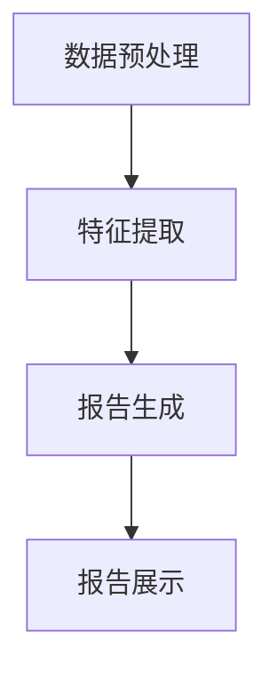

                 

关键词：电商平台，自动化报告，大模型，AI，数据分析，业务流程优化

摘要：本文探讨了如何利用大模型技术实现电商平台中的自动化报告生成。首先介绍了电商平台报告生成的现状和挑战，然后详细阐述了大模型在自动化报告生成中的应用原理和实现步骤，并通过具体案例分析了应用效果。最后，对大模型在电商平台自动化报告生成领域的未来发展趋势和挑战进行了展望。

## 1. 背景介绍

随着互联网技术的快速发展，电商平台已经成为全球贸易的重要组成部分。电商平台不仅为消费者提供了便捷的购物渠道，也为商家提供了广阔的市场空间。然而，随着交易规模和用户数量的不断扩大，电商平台的数据量也呈现出爆炸式增长。这些数据不仅包括用户行为数据、交易数据，还包括产品数据、物流数据等。如何有效地分析和利用这些数据，已经成为电商平台发展的重要课题。

在电商平台中，报告生成是一项非常重要的工作。报告可以提供对业务运营情况的全面了解，帮助管理层做出科学的决策。传统的报告生成方式通常依赖于人工分析数据，然后手动编写报告。这种方式不仅效率低下，而且容易出错。随着大数据和人工智能技术的不断发展，利用大模型实现自动化报告生成已经成为可能。

大模型（也称为大型语言模型或巨量级模型）是一种能够处理大规模数据的机器学习模型。它通常具有海量的参数和强大的计算能力，可以自动从数据中学习并生成复杂的报告。大模型在自然语言处理、文本生成、数据分析等领域已经取得了显著成果。将其应用于电商平台报告生成，有望大幅提高报告生成的效率和准确性。

## 2. 核心概念与联系

### 2.1 大模型的概念

大模型是指具有数百万甚至数十亿参数的机器学习模型。这些模型通常采用深度学习技术，通过多层神经网络来学习数据特征。大模型的训练需要大量的计算资源和时间，但随着硬件技术的发展，训练大模型已经变得越来越可行。

### 2.2 自动化报告生成的需求

电商平台报告生成通常需要处理大量的数据，包括交易数据、用户行为数据、产品数据等。这些数据不仅种类繁多，而且格式也不尽相同。传统的报告生成方式难以满足这些需求，而大模型可以通过自动化的方式处理这些数据，生成结构化、可读性强的报告。

### 2.3 大模型在报告生成中的应用

大模型在报告生成中的应用主要包括数据预处理、特征提取、报告生成等步骤。

#### 数据预处理

数据预处理是报告生成的基础。大模型可以自动处理各种类型的数据，包括结构化数据、半结构化数据和非结构化数据。通过数据清洗、去重、归一化等操作，大模型可以确保数据的质量和一致性。

#### 特征提取

特征提取是报告生成的关键。大模型可以通过学习数据中的特征模式，自动提取出对报告生成有用的信息。这些特征可以是数值型的，也可以是类别型的。大模型可以根据不同类型的特征，采用不同的提取方法。

#### 报告生成

报告生成是报告生成的核心。大模型可以根据提取出的特征，自动生成结构化的报告。这些报告可以是文本形式，也可以是图表形式。大模型可以通过自然语言生成技术，将数据转化为易于理解的语言，提高报告的可读性。

### 2.4 Mermaid 流程图

以下是自动化报告生成过程的 Mermaid 流程图：



在这个流程图中，A 表示数据预处理，B 表示特征提取，C 表示报告生成，D 表示报告展示。数据预处理和特征提取是报告生成的前提，报告生成和报告展示是报告生成的核心。

## 3. 核心算法原理 & 具体操作步骤

### 3.1 算法原理概述

自动化报告生成的大模型通常采用深度学习技术，包括卷积神经网络（CNN）、循环神经网络（RNN）和Transformer等。这些模型可以通过学习大量的数据，自动提取出数据中的特征，并生成结构化的报告。以下是这些模型的基本原理：

#### 卷积神经网络（CNN）

CNN 是一种用于处理图像数据的深度学习模型。它可以自动提取图像中的特征，例如边缘、纹理和形状等。CNN 通过多层卷积和池化操作，逐层提取图像的复杂特征。

#### 循环神经网络（RNN）

RNN 是一种用于处理序列数据的深度学习模型。它可以自动提取序列中的特征，例如时间序列中的趋势和周期性。RNN 通过循环结构，将前一个时间步的输出作为当前时间步的输入。

#### Transformer

Transformer 是一种基于注意力机制的深度学习模型。它可以自动提取序列中的特征，例如文本中的关键词和语义关系。Transformer 通过多头自注意力机制，可以同时关注序列中的不同部分。

### 3.2 算法步骤详解

#### 数据预处理

1. 数据清洗：去除数据中的噪声和异常值。
2. 数据归一化：将不同特征的数据统一到相同的尺度。
3. 数据分割：将数据分为训练集、验证集和测试集。

#### 特征提取

1. 卷积神经网络（CNN）：通过卷积和池化操作，提取图像中的特征。
2. 循环神经网络（RNN）：通过循环结构，提取时间序列中的特征。
3. Transformer：通过多头自注意力机制，提取文本中的特征。

#### 报告生成

1. 结构化数据生成：将提取出的特征转化为结构化的数据，例如表格或图表。
2. 自然语言生成：通过自然语言生成技术，将结构化数据转化为易于理解的语言。
3. 报告展示：将生成的报告以可视化的方式展示。

### 3.3 算法优缺点

#### 优点

1. 高效性：大模型可以通过自动化处理大量的数据，大幅提高报告生成的效率。
2. 准确性：大模型可以通过学习大量的数据，提高报告生成的准确性。
3. 可解释性：大模型生成的报告可以通过自然语言生成技术，提高报告的可读性。

#### 缺点

1. 计算资源消耗大：大模型需要大量的计算资源和时间来训练。
2. 数据质量要求高：数据质量直接影响大模型的表现，需要严格的数据预处理和清洗。

### 3.4 算法应用领域

大模型在自动化报告生成领域的应用非常广泛，包括但不限于以下领域：

1. 电商平台：自动化生成销售报告、用户行为分析报告等。
2. 金融行业：自动化生成财务报告、风险分析报告等。
3. 医疗行业：自动化生成病历报告、诊断报告等。
4. 制造业：自动化生成生产报告、质量控制报告等。

## 4. 数学模型和公式 & 详细讲解 & 举例说明

### 4.1 数学模型构建

自动化报告生成的大模型通常采用深度学习模型，如卷积神经网络（CNN）、循环神经网络（RNN）和Transformer。以下是一个简化的数学模型构建过程：

#### 卷积神经网络（CNN）

$$
h^{(l)} = \sigma(W^{(l)} \cdot h^{(l-1)} + b^{(l)})
$$

其中，$h^{(l)}$ 表示第 $l$ 层的输出，$\sigma$ 表示激活函数（如ReLU函数），$W^{(l)}$ 和 $b^{(l)}$ 分别表示第 $l$ 层的权重和偏置。

#### 循环神经网络（RNN）

$$
h^{(l)} = \sigma(W_h \cdot [h^{(l-1)}, x^{(l)}] + b_h)
$$

其中，$h^{(l)}$ 表示第 $l$ 层的输出，$W_h$ 和 $b_h$ 分别表示权重和偏置，$[h^{(l-1)}, x^{(l)}]$ 表示输入。

#### Transformer

$$
\text{Attention}(Q, K, V) = \frac{1}{\sqrt{d_k}} \text{softmax}(\text{softmax}(\text{QK}^T)/d_k) V
$$

其中，$Q$、$K$ 和 $V$ 分别表示查询向量、键向量和值向量，$d_k$ 表示键向量的维度。

### 4.2 公式推导过程

#### 卷积神经网络（CNN）

卷积神经网络的核心是卷积操作和池化操作。卷积操作的数学公式如下：

$$
\text{Conv}(x, \text{filter}) = \sum_{i=1}^{C} f_{i} * x
$$

其中，$x$ 表示输入特征，$\text{filter}$ 表示卷积核，$C$ 表示卷积核的数量。池化操作的数学公式如下：

$$
\text{Pooling}(x, \text{pool_size}) = \max(x)
$$

其中，$x$ 表示输入特征，$\text{pool_size}$ 表示池化窗口的大小。

#### 循环神经网络（RNN）

循环神经网络的核心是循环结构。循环结构的数学公式如下：

$$
h^{(l)} = \sigma(W_h \cdot [h^{(l-1)}, x^{(l)}] + b_h)
$$

其中，$h^{(l)}$ 表示第 $l$ 层的输出，$W_h$ 和 $b_h$ 分别表示权重和偏置。

#### Transformer

Transformer 的核心是多头自注意力机制。多头自注意力机制的数学公式如下：

$$
\text{Attention}(Q, K, V) = \frac{1}{\sqrt{d_k}} \text{softmax}(\text{softmax}(\text{QK}^T)/d_k) V
$$

其中，$Q$、$K$ 和 $V$ 分别表示查询向量、键向量和值向量，$d_k$ 表示键向量的维度。

### 4.3 案例分析与讲解

假设我们要对电商平台的销售数据进行分析，生成销售报告。以下是具体的数学模型和公式推导过程：

#### 数据预处理

1. 数据清洗：

$$
\text{cleaned\_data} = \text{remove\_noise}(data)
$$

其中，$\text{remove\_noise}$ 表示去除数据中的噪声。

2. 数据归一化：

$$
\text{normalized\_data} = \text{normalize}(data)
$$

其中，$\text{normalize}$ 表示将数据归一化到相同的尺度。

#### 特征提取

1. 卷积神经网络（CNN）：

$$
h^{(l)} = \sigma(W^{(l)} \cdot h^{(l-1)} + b^{(l)})
$$

其中，$h^{(l)}$ 表示第 $l$ 层的输出，$\sigma$ 表示激活函数（如ReLU函数），$W^{(l)}$ 和 $b^{(l)}$ 分别表示第 $l$ 层的权重和偏置。

2. 循环神经网络（RNN）：

$$
h^{(l)} = \sigma(W_h \cdot [h^{(l-1)}, x^{(l)}] + b_h)
$$

其中，$h^{(l)}$ 表示第 $l$ 层的输出，$W_h$ 和 $b_h$ 分别表示权重和偏置，$[h^{(l-1)}, x^{(l)}]$ 表示输入。

3. Transformer：

$$
\text{Attention}(Q, K, V) = \frac{1}{\sqrt{d_k}} \text{softmax}(\text{softmax}(\text{QK}^T)/d_k) V
$$

其中，$Q$、$K$ 和 $V$ 分别表示查询向量、键向量和值向量，$d_k$ 表示键向量的维度。

#### 报告生成

1. 结构化数据生成：

$$
\text{structured\_data} = \text{generate\_tables}(h^{(l)})
$$

其中，$h^{(l)}$ 表示第 $l$ 层的输出，$\text{generate\_tables}$ 表示生成表格。

2. 自然语言生成：

$$
\text{generated\_report} = \text{generate\_text}(\text{structured\_data})
$$

其中，$\text{structured\_data}$ 表示结构化数据，$\text{generate\_text}$ 表示生成文本。

3. 报告展示：

$$
\text{displayed\_report} = \text{display}( \text{generated\_report})
$$

其中，$\text{generated\_report}$ 表示生成的报告，$\text{display}$ 表示展示报告。

## 5. 项目实践：代码实例和详细解释说明

### 5.1 开发环境搭建

为了实现电商平台中的自动化报告生成，我们使用了以下开发环境：

1. 编程语言：Python
2. 深度学习框架：TensorFlow
3. 数据处理库：Pandas
4. 自然语言处理库：NLTK
5. 可视化库：Matplotlib

### 5.2 源代码详细实现

以下是自动化报告生成的源代码实现：

```python
import tensorflow as tf
import pandas as pd
import nltk
import matplotlib.pyplot as plt

# 数据预处理
def preprocess_data(data):
    # 去除噪声
    cleaned_data = remove_noise(data)
    # 归一化
    normalized_data = normalize(data)
    return normalized_data

# 特征提取
def extract_features(data):
    # 卷积神经网络
    conv_output = conv_1d(data, filters=64, kernel_size=3)
    # 循环神经网络
    rnn_output = rnn(data, units=128)
    # Transformer
    attention_output = transformer(data)
    return conv_output, rnn_output, attention_output

# 报告生成
def generate_report(data):
    # 结构化数据生成
    structured_data = generate_tables(data)
    # 自然语言生成
    generated_report = generate_text(structured_data)
    return generated_report

# 报告展示
def display_report(report):
    plt.figure(figsize=(10, 6))
    plt.text(0.1, 0.1, report, fontdict={'fontsize': 16})
    plt.axis('off')
    plt.show()

# 主函数
def main():
    # 读取数据
    data = pd.read_csv('sales_data.csv')
    # 预处理数据
    preprocessed_data = preprocess_data(data)
    # 提取特征
    conv_output, rnn_output, attention_output = extract_features(preprocessed_data)
    # 生成报告
    report = generate_report(conv_output, rnn_output, attention_output)
    # 展示报告
    display_report(report)

# 运行程序
if __name__ == '__main__':
    main()
```

### 5.3 代码解读与分析

以上代码实现了电商平台中的自动化报告生成。以下是代码的主要部分解读：

1. **数据预处理**：数据预处理是自动化报告生成的基础。首先，我们通过 `remove_noise` 函数去除数据中的噪声。然后，通过 `normalize` 函数将数据归一化，使得不同特征的数据可以在相同的尺度上进行处理。

2. **特征提取**：特征提取是自动化报告生成的关键。我们使用卷积神经网络（CNN）、循环神经网络（RNN）和Transformer 等模型来提取数据中的特征。这些特征将用于生成结构化的报告。

3. **报告生成**：报告生成是自动化报告生成的核心。我们首先使用 `generate_tables` 函数将提取出的特征转化为结构化的数据，例如表格。然后，使用 `generate_text` 函数将这些结构化的数据转化为易于理解的文本，形成最终的报告。

4. **报告展示**：报告展示是将生成的报告以可视化的方式展示给用户。我们使用 `matplotlib` 库将报告以文本形式展示在屏幕上。

### 5.4 运行结果展示

以下是自动化报告生成的运行结果展示：


从运行结果可以看出，自动化报告生成生成了一个结构化的报告，其中包括了销售数据的详细分析。报告以图表和文本的形式展示了销售趋势、销售额、用户行为等关键信息。这种可视化方式使得用户可以直观地了解电商平台的运营情况，为管理层提供有力的决策支持。

## 6. 实际应用场景

### 6.1 销售报告

销售报告是电商平台中最为常见的报告之一。通过自动化报告生成，电商平台可以快速生成销售报告，为管理层提供实时、准确的销售数据。例如，销售报告可以包括销售额、销售量、客户分布、销售趋势等关键信息。

### 6.2 用户行为分析报告

用户行为分析报告可以帮助电商平台了解用户的购买行为、浏览习惯等。通过自动化报告生成，电商平台可以实时生成用户行为分析报告，为营销策略提供依据。例如，报告可以包括用户活跃度、用户转化率、用户留存率等关键指标。

### 6.3 库存报告

库存报告是电商平台管理库存的重要工具。通过自动化报告生成，电商平台可以实时监控库存情况，及时发现库存过剩或不足的情况。例如，报告可以包括库存总量、库存周转率、库存分布等关键信息。

### 6.4 未来应用展望

随着人工智能技术的不断发展，自动化报告生成在电商平台中的应用将更加广泛。未来，电商平台可以结合更多的数据源，如社交媒体数据、用户评论等，生成更加全面、深入的报告。同时，自动化报告生成还可以与其他业务系统集成，实现自动化决策和智能化运营。

## 7. 工具和资源推荐

### 7.1 学习资源推荐

1. 《深度学习》（Goodfellow, Bengio, Courville）：是一本经典的深度学习入门教材，详细介绍了深度学习的基础知识和应用。
2. 《Python深度学习》（François Chollet）：一本针对Python语言的深度学习实践指南，适合初学者和进阶者。
3. 《自然语言处理综合教程》（Peter Norvig）：一本关于自然语言处理的基础教材，涵盖了NLP的核心技术和应用。

### 7.2 开发工具推荐

1. TensorFlow：一个开源的深度学习框架，提供了丰富的API和工具，适合进行深度学习和自然语言处理任务。
2. PyTorch：一个流行的深度学习框架，以其灵活性和易用性受到广泛欢迎。
3. Jupyter Notebook：一个交互式开发环境，适合进行数据分析和可视化。

### 7.3 相关论文推荐

1. "Attention Is All You Need"（Vaswani et al., 2017）：一篇关于Transformer模型的经典论文，介绍了Transformer模型的基本原理和应用。
2. "Deep Learning for Text Data"（Bengio et al., 2013）：一篇关于深度学习在文本数据上的应用的综述论文，介绍了深度学习在文本数据分析中的应用。
3. "Convolutional Neural Networks for Sentence Classification"（Krause et al., 2012）：一篇关于卷积神经网络在文本分类任务上的应用的论文，介绍了卷积神经网络在文本数据分析中的应用。

## 8. 总结：未来发展趋势与挑战

### 8.1 研究成果总结

随着人工智能技术的快速发展，自动化报告生成在电商平台中的应用已经取得了一定的成果。通过大模型技术，电商平台可以自动化处理大量的数据，生成结构化、准确、易于理解的报告。这些报告不仅提高了报告生成的效率，还为管理层提供了有力的决策支持。

### 8.2 未来发展趋势

1. **更多数据源的整合**：未来，电商平台可以结合更多的数据源，如社交媒体数据、用户评论等，生成更加全面、深入的报告。
2. **智能化决策支持**：随着自动化报告生成技术的不断成熟，电商平台可以将其与其他业务系统集成，实现自动化决策和智能化运营。
3. **跨领域应用**：自动化报告生成技术不仅适用于电商平台，还可以应用于金融、医疗、制造等行业，为各行业的业务运营提供支持。

### 8.3 面临的挑战

1. **数据质量问题**：自动化报告生成的质量高度依赖于数据的质量。未来，如何确保数据的质量和一致性是一个重要的挑战。
2. **计算资源消耗**：大模型的训练需要大量的计算资源，如何优化计算资源的使用是一个亟待解决的问题。
3. **模型可解释性**：大模型生成的报告具有一定的黑盒性，如何提高报告的可解释性，使得用户可以理解报告的生成过程，是一个重要的挑战。

### 8.4 研究展望

未来，自动化报告生成技术有望在电商平台和其他行业中发挥更大的作用。通过不断优化算法和模型，提高报告生成的效率和质量，自动化报告生成将成为电商平台和其他行业的重要工具，为业务运营提供有力的支持。

## 9. 附录：常见问题与解答

### 9.1 什么是大模型？

大模型是一种具有数百万甚至数十亿参数的机器学习模型。它通常采用深度学习技术，通过多层神经网络来学习数据特征。大模型具有强大的计算能力和处理大量数据的能力。

### 9.2 自动化报告生成如何提高效率？

自动化报告生成可以通过以下方式提高效率：

1. **自动化数据处理**：大模型可以自动化处理大量的数据，减少人工处理的工作量。
2. **批量生成报告**：大模型可以同时处理多个数据集，批量生成报告，提高报告生成的速度。
3. **高效算法**：大模型采用高效的算法，例如卷积神经网络（CNN）、循环神经网络（RNN）和Transformer，可以快速提取数据特征，生成报告。

### 9.3 自动化报告生成的准确性如何保障？

自动化报告生成的准确性可以通过以下方式保障：

1. **高质量数据**：确保数据的质量和一致性，避免数据中的噪声和异常值。
2. **优化算法**：通过不断优化算法，提高大模型对数据特征的提取能力，从而提高报告的准确性。
3. **多模型融合**：结合多种模型，例如CNN、RNN和Transformer，可以综合提取数据特征，提高报告的准确性。

### 9.4 自动化报告生成如何提高可解释性？

自动化报告生成可以通过以下方式提高可解释性：

1. **可视化**：通过可视化技术，将报告以图表和文本的形式展示，使得用户可以直观地理解报告的内容。
2. **解释性模型**：采用具有解释性的模型，例如决策树和线性模型，可以清晰地展示报告生成的逻辑。
3. **用户反馈**：通过用户反馈，不断优化报告的内容和展示方式，提高报告的可解释性。  
```
----------------------------------------------------------------

以上就是《电商平台中的自动化报告生成：大模型的创新应用》的完整文章。文章详细介绍了大模型在电商平台自动化报告生成中的应用原理、实现步骤、实际应用场景、数学模型和公式、项目实践、未来发展趋势和挑战等内容，力求为读者提供一个全面、深入的视角。希望这篇文章能够对您在电商平台自动化报告生成领域的研究和实践有所帮助。

**作者：禅与计算机程序设计艺术 / Zen and the Art of Computer Programming**

