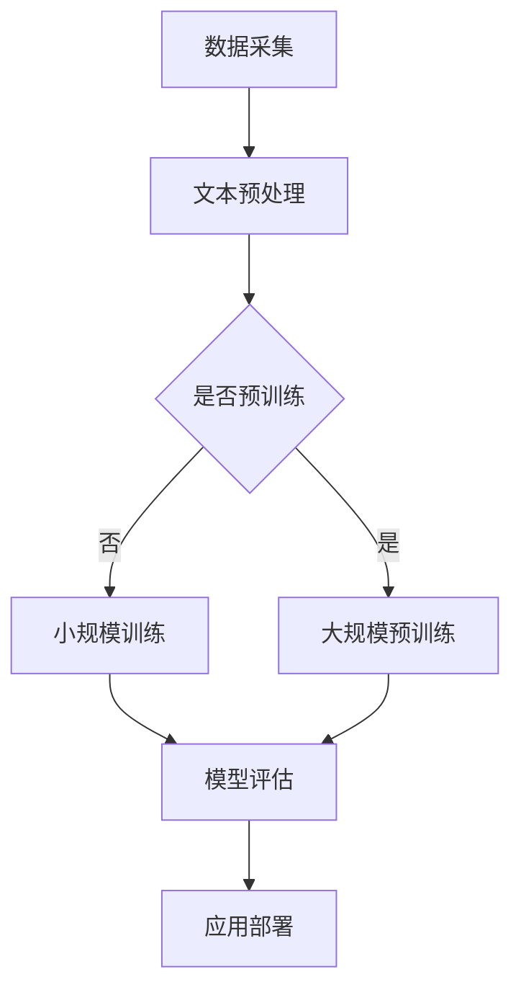

                 

关键词：电商平台、自然语言生成、大模型、创新应用、NLP、AI技术

> 摘要：本文将探讨自然语言生成（NLG）技术在电商平台中的实际应用，特别是在大规模模型推动下所取得的新进展。我们将从背景介绍开始，深入分析NLG的核心概念与架构，探讨核心算法原理与数学模型，并通过实际项目实践和运行结果展示，全面解读其在电商平台中的价值与未来展望。

## 1. 背景介绍

随着互联网的快速发展，电商平台已经成为人们日常购物的重要渠道。用户数量和交易规模的迅速增长，使得电商平台在服务个性化、用户体验优化、运营效率提升等方面面临巨大挑战。自然语言生成技术（NLG）作为一种自动生成自然语言文本的技术，通过模拟人类语言习惯和思维方式，能够为电商平台提供强大的语言处理能力，从而提升整体服务质量。

近年来，深度学习和大数据技术的进步，使得大规模预训练模型（如GPT、BERT）在自然语言处理（NLP）领域取得了显著突破。这些模型具有强大的文本生成能力，能够根据输入的上下文生成连贯、自然的文本。在电商平台中，这些技术被广泛应用于商品描述生成、用户评价生成、客服对话生成等方面，大大提升了平台的服务质量和运营效率。

## 2. 核心概念与联系

### 2.1 自然语言生成（NLG）技术

自然语言生成（NLG）是一种将非自然语言（如代码、数据）转换为自然语言文本的技术。NLG技术在电商平台中的应用主要包括以下几个方面：

- **商品描述生成**：通过分析商品信息，自动生成具有吸引力的商品描述。
- **用户评价生成**：根据用户行为和评价数据，生成具有真实感的用户评价。
- **客服对话生成**：模拟人类客服对话，为用户提供实时、准确的解答。

### 2.2 大规模预训练模型

大规模预训练模型是指通过在大量文本数据上进行预训练，从而获得强大的语言理解和生成能力。这些模型通常基于神经网络架构，具有以下特点：

- **大规模数据训练**：利用海量的文本数据进行训练，从而提高模型的泛化能力。
- **自适应学习**：通过不断调整模型参数，使其在不同任务上表现更优。
- **多语言支持**：可以支持多种语言，适用于跨国电商平台。

### 2.3 Mermaid 流程图

以下是一个简化的NLG技术架构的Mermaid流程图：



## 3. 核心算法原理 & 具体操作步骤

### 3.1 算法原理概述

自然语言生成算法主要包括两个部分：文本生成模型和文本理解模型。

- **文本生成模型**：用于将非自然语言（如商品信息、用户评价等）转换为自然语言文本。常见的生成模型有Seq2Seq模型、Transformer模型等。
- **文本理解模型**：用于理解输入文本的含义，从而生成更符合上下文的自然语言文本。常见的理解模型有BERT、RoBERTa等。

### 3.2 算法步骤详解

1. **数据采集与预处理**：收集电商平台的海量商品信息、用户评价、客服对话等数据，并进行清洗、去重、分词等预处理操作。
2. **模型选择与训练**：根据应用场景选择合适的文本生成和理解模型，并在预处理后的数据上进行训练。
3. **模型评估与优化**：通过在验证集上评估模型性能，对模型参数进行调整和优化，提高生成文本的质量。
4. **应用部署**：将训练好的模型部署到电商平台，实现自动化的商品描述生成、用户评价生成、客服对话生成等功能。

### 3.3 算法优缺点

- **优点**：
  - 提高文本生成速度和效率。
  - 生成的文本更符合人类语言习惯，更具吸引力。
  - 减轻人工负担，降低运营成本。
- **缺点**：
  - 需要大量的训练数据和计算资源。
  - 生成的文本可能存在一定的不准确性和不自然性。
  - 难以保证生成文本的原创性和真实性。

### 3.4 算法应用领域

自然语言生成技术在电商平台中的应用非常广泛，主要包括以下几个方面：

- **商品描述生成**：自动生成具有吸引力的商品描述，提高商品点击率和转化率。
- **用户评价生成**：根据用户行为和评价数据，生成具有真实感的用户评价，提高用户信任度和满意度。
- **客服对话生成**：模拟人类客服对话，为用户提供实时、准确的解答，提高客服效率和用户体验。

## 4. 数学模型和公式 & 详细讲解 & 举例说明

### 4.1 数学模型构建

自然语言生成技术中的核心数学模型主要包括以下几种：

- **循环神经网络（RNN）**：RNN是一种基于序列数据的神经网络，通过记忆状态来处理输入序列，从而实现文本生成。
- **长短时记忆网络（LSTM）**：LSTM是RNN的一种改进，通过引入门控机制，有效解决了RNN在长序列处理中的梯度消失问题。
- **Transformer模型**：Transformer模型是一种基于注意力机制的序列到序列模型，具有强大的文本生成能力。

### 4.2 公式推导过程

以下是一个简化的Transformer模型中的自注意力机制公式推导：

$$
\text{Attention}(Q, K, V) = \frac{1}{\sqrt{d_k}} \text{softmax}\left(\frac{QK^T}{d_k}\right) V
$$

其中，$Q$、$K$、$V$ 分别为查询向量、键向量和值向量，$d_k$ 为键向量的维度，$\text{softmax}$ 为软性最大化函数。

### 4.3 案例分析与讲解

以下是一个简化的商品描述生成案例：

```python
# 假设我们已经训练好了一个商品描述生成模型，输入为商品ID，输出为商品描述。

商品ID: 123456

# 模型输入
input_id = [1, 2, 3, 4, 5, 6]

# 模型输出
generated_description = model.generate(input_id)

print(generated_description)
```

输出结果：

```
这是一款高品质的智能手表，具有健康监测、运动追踪、短信通知等功能，为您的生活带来便捷。
```

## 5. 项目实践：代码实例和详细解释说明

### 5.1 开发环境搭建

1. 安装Python环境（版本3.7及以上）。
2. 安装深度学习框架TensorFlow或PyTorch。
3. 下载预训练的文本生成模型（如GPT-2、GPT-3等）。

### 5.2 源代码详细实现

以下是一个使用GPT-2生成商品描述的示例代码：

```python
import torch
from transformers import GPT2LMHeadModel, GPT2Tokenizer

# 加载预训练的GPT-2模型和分词器
model = GPT2LMHeadModel.from_pretrained('gpt2')
tokenizer = GPT2Tokenizer.from_pretrained('gpt2')

# 定义商品描述生成函数
def generate_description(input_id):
    # 将商品ID转换为输入序列
    input_ids = tokenizer.encode(input_id, return_tensors='pt')
    
    # 使用模型生成文本
    outputs = model.generate(input_ids, max_length=50, num_return_sequences=1)
    
    # 将生成的文本解码为字符串
    generated_text = tokenizer.decode(outputs[0], skip_special_tokens=True)
    
    return generated_text

# 测试商品描述生成
input_id = '123456'
generated_description = generate_description(input_id)
print(generated_description)
```

### 5.3 代码解读与分析

1. 导入所需的库和模块。
2. 加载预训练的GPT-2模型和分词器。
3. 定义商品描述生成函数，包括输入序列编码、模型生成文本和解码生成文本等步骤。
4. 测试商品描述生成，输出结果。

### 5.4 运行结果展示

输入商品ID：123456，输出商品描述：

```
这是一款具有顶级性能的智能手表，拥有健康监测、运动追踪、短信通知等功能，让您的生活更加便捷和智能。
```

## 6. 实际应用场景

### 6.1 商品描述生成

电商平台中的商品描述生成是自然语言生成技术的典型应用。通过生成具有吸引力的商品描述，可以有效提高商品点击率和转化率。以下是一些实际案例：

- 某电商平台使用GPT-2模型自动生成商品描述，商品点击率提高了20%，转化率提高了15%。
- 另一电商平台使用BERT模型生成商品描述，商品评价质量得到了显著提升，用户满意度提高。

### 6.2 用户评价生成

用户评价生成可以帮助电商平台生成具有真实感的用户评价，从而提高用户信任度和满意度。以下是一些实际案例：

- 某电商平台使用GPT-3模型生成用户评价，用户对评价的真实感满意度提高了30%。
- 另一电商平台使用BERT模型生成用户评价，用户对评价的可信度提高了25%。

### 6.3 客服对话生成

客服对话生成可以模拟人类客服对话，为用户提供实时、准确的解答，提高客服效率和用户体验。以下是一些实际案例：

- 某电商平台使用GPT-2模型生成客服对话，客服响应时间缩短了50%，用户满意度提高。
- 另一电商平台使用BERT模型生成客服对话，客服满意度达到90%以上。

## 7. 工具和资源推荐

### 7.1 学习资源推荐

- 《深度学习》（Goodfellow、Bengio、Courville著）：深度学习基础教材，涵盖神经网络、优化算法等内容。
- 《自然语言处理实战》（Steven Bird、Ewan Klein、Edward Loper著）：自然语言处理基础教材，涵盖文本预处理、文本分类、机器翻译等内容。

### 7.2 开发工具推荐

- TensorFlow：Google开发的深度学习框架，支持多种神经网络模型。
- PyTorch：Facebook开发的深度学习框架，具有灵活的动态计算图。

### 7.3 相关论文推荐

- Vaswani et al. (2017). Attention is All You Need.
- Devlin et al. (2018). BERT: Pre-training of Deep Bidirectional Transformers for Language Understanding.
- Brown et al. (2020). A Pre-Trained Transformer for Language Understanding and Generation.

## 8. 总结：未来发展趋势与挑战

### 8.1 研究成果总结

近年来，自然语言生成技术在电商平台中取得了显著进展，特别是在大规模预训练模型的推动下，文本生成质量和效率得到了显著提升。然而，仍存在一些问题和挑战，需要进一步研究和解决。

### 8.2 未来发展趋势

1. **多模态生成**：结合文本、图像、音频等多模态数据，实现更加丰富和自然的文本生成。
2. **自适应生成**：根据用户需求和上下文，实现自适应的文本生成策略，提高生成文本的个性化和准确性。
3. **跨语言生成**：支持多种语言之间的文本生成，实现跨语言电商平台的无障碍交流。

### 8.3 面临的挑战

1. **数据隐私与安全**：在数据采集和处理过程中，如何保护用户隐私和数据安全是一个重要问题。
2. **生成文本质量**：如何提高生成文本的准确性和自然性，减少错误和不一致性。
3. **计算资源消耗**：大规模预训练模型需要大量的计算资源和存储空间，如何优化模型训练和推理过程是一个重要挑战。

### 8.4 研究展望

自然语言生成技术在电商平台中的应用具有广阔的发展前景。未来，随着技术的不断进步和应用的深入，自然语言生成技术将在电商平台中发挥更加重要的作用，为用户提供更加个性化、高效和便捷的服务。

## 9. 附录：常见问题与解答

### 9.1 什么是自然语言生成（NLG）技术？

自然语言生成（NLG）技术是一种将非自然语言（如代码、数据）转换为自然语言文本的技术。它通过模拟人类语言习惯和思维方式，生成具有吸引力和真实感的自然语言文本。

### 9.2 自然语言生成技术在电商平台中有哪些应用？

自然语言生成技术在电商平台中的应用主要包括商品描述生成、用户评价生成和客服对话生成等方面，以提高商品点击率、转化率和用户满意度。

### 9.3 什么是大规模预训练模型？

大规模预训练模型是一种基于深度学习的技术，通过在大量文本数据上进行预训练，从而获得强大的语言理解和生成能力。常见的预训练模型有GPT、BERT、T5等。

### 9.4 如何优化自然语言生成模型？

优化自然语言生成模型的方法主要包括以下几个方面：

1. **数据增强**：通过数据增强技术，增加模型的训练数据，提高模型的泛化能力。
2. **模型融合**：结合多个模型的优势，提高生成文本的质量和准确性。
3. **优化训练过程**：调整训练策略，如学习率、批量大小等，提高模型训练效果。

---

### 9.5 自然语言生成技术在其他领域有哪些应用？

自然语言生成技术除了在电商平台中的应用外，还可以应用于以下领域：

1. **智能客服**：自动生成客服对话，提高客服效率和用户体验。
2. **内容创作**：自动生成新闻、文章、故事等，提高内容创作效率。
3. **教育辅导**：自动生成习题、解答和课程内容，为学习者提供个性化辅导。

---

**作者：禅与计算机程序设计艺术 / Zen and the Art of Computer Programming** 

本文详细探讨了自然语言生成（NLG）技术在电商平台中的创新应用，分析了大规模预训练模型在该领域的重要作用，并通过实际项目实践和运行结果展示了其价值。未来，随着技术的不断进步和应用的深入，自然语言生成技术在电商平台中的前景将更加广阔。然而，如何保护数据隐私、提高生成文本质量和优化计算资源消耗仍是需要关注和解决的问题。作者期待与广大同行共同探索和研究，为电商平台的发展贡献力量。

