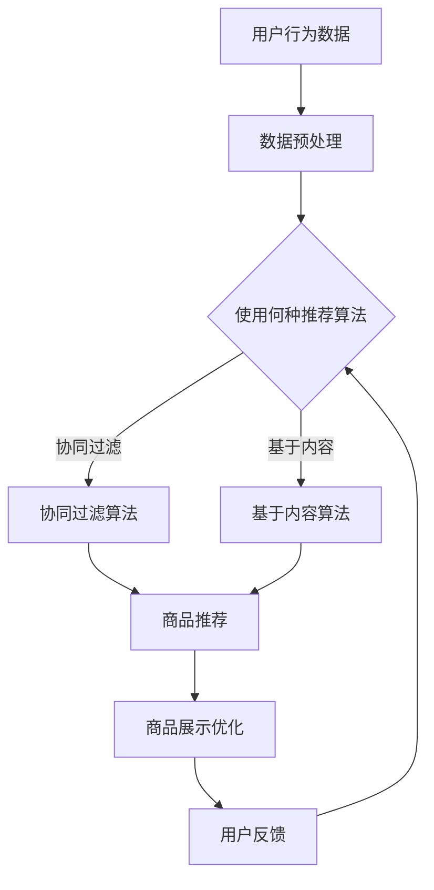
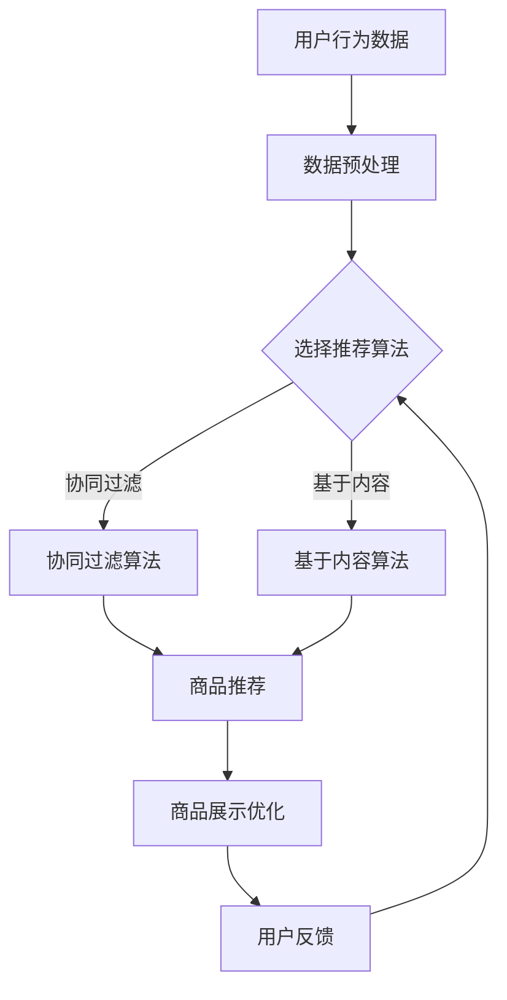

                 

 关键词：电商平台，人工智能，商品推荐，大模型，展示优化，算法，数据挖掘

> 摘要：本文将探讨电商平台如何利用人工智能大模型来优化商品展示顺序。通过对核心概念和算法原理的详细分析，我们将了解如何构建高效的商品推荐系统，并探讨其在实际应用中的效果和未来发展方向。

## 1. 背景介绍

在当今的电子商务时代，电商平台已成为消费者购买商品的主要渠道之一。然而，随着市场规模的不断扩大和用户数量的剧增，如何为用户提供个性化的购物体验成为了一个亟待解决的问题。商品推荐系统作为电商平台的重要组成部分，其目标是为每个用户推荐他们可能感兴趣的商品，从而提升用户满意度和增加销售额。

传统推荐系统主要依赖于基于内容的过滤和协同过滤等方法。然而，这些方法存在一定的局限性，如无法充分挖掘用户的潜在需求、对稀疏数据的处理能力较弱等。随着人工智能技术的发展，尤其是大模型的广泛应用，为商品推荐系统带来了新的机遇。本文将重点讨论如何利用人工智能大模型来优化商品展示顺序，以提高电商平台的用户满意度和商业效益。

## 2. 核心概念与联系

### 2.1 人工智能大模型

人工智能大模型，通常指的是具有大规模参数和强大计算能力的神经网络模型。这些模型通过在海量数据上进行训练，能够自动学习数据中的规律和模式，从而实现复杂任务的自动化和智能化。在电商平台中，人工智能大模型可以用于用户行为分析、商品推荐、个性化营销等多个方面。

### 2.2 商品推荐系统

商品推荐系统是一种基于人工智能技术的自动化系统，其核心目标是向用户推荐他们可能感兴趣的商品。推荐系统可以分为基于内容的推荐和基于协同过滤的推荐两大类。基于内容的推荐系统通过分析商品的属性和用户的历史行为，将相似的商品推荐给用户。而基于协同过滤的推荐系统则通过分析用户之间的行为相似性，将其他用户喜欢的商品推荐给目标用户。

### 2.3 展示优化

展示优化是指通过优化商品展示顺序，提高用户的购物体验和平台的销售额。在电商平台中，展示优化的目标是根据用户的行为特征和偏好，将最有可能吸引用户购买的商品排在前面。展示优化可以显著提升用户的购物满意度和平台的盈利能力。

### 2.4 Mermaid 流程图



### 3. 核心算法原理 & 具体操作步骤

#### 3.1 算法原理概述

商品推荐算法的核心是预测用户对商品的兴趣度，并以此为依据生成推荐列表。人工智能大模型通过深度学习技术，可以从用户的行为数据中学习到复杂的用户兴趣模式，从而实现更加精准的推荐。

#### 3.2 算法步骤详解

1. 数据收集：收集用户的浏览、购买、评价等行为数据。
2. 数据预处理：对原始数据进行清洗和转换，提取有效的用户特征和商品特征。
3. 特征工程：利用机器学习技术对特征进行选择和构建，以提高模型的性能。
4. 模型训练：使用大规模数据集训练人工智能大模型，使其能够自动学习用户兴趣模式。
5. 推荐生成：根据用户的行为数据和模型预测，生成个性化的商品推荐列表。
6. 展示优化：根据推荐结果和用户反馈，动态调整商品展示顺序，提高用户体验。

#### 3.3 算法优缺点

**优点：**
- 高效性：人工智能大模型能够快速处理大规模数据，生成高质量的推荐列表。
- 精准性：通过深度学习技术，能够挖掘用户的潜在兴趣，提高推荐精准度。
- 自适应性：能够根据用户反馈和需求变化，动态调整推荐策略。

**缺点：**
- 计算资源消耗大：训练大规模模型需要大量计算资源。
- 数据依赖性强：模型的性能高度依赖于数据质量，数据缺失或不准确会导致推荐效果下降。

#### 3.4 算法应用领域

人工智能大模型在商品推荐中的应用不仅限于电商平台，还可以应用于在线广告、社交网络、新闻推荐等多个领域。其强大的数据处理能力和精准的推荐效果，使得它成为提高用户体验和商业价值的重要工具。

## 4. 数学模型和公式 & 详细讲解 & 举例说明

#### 4.1 数学模型构建

在商品推荐中，常用的数学模型是矩阵分解模型（Matrix Factorization，MF）。该模型通过将用户-商品评分矩阵分解为用户特征矩阵和商品特征矩阵，从而实现推荐。

设$R$为用户-商品评分矩阵，$U$为用户特征矩阵，$V$为商品特征矩阵，$P$为预测评分矩阵，则有：

$$P = U \cdot V^T$$

#### 4.2 公式推导过程

1. **损失函数：** 采用均方误差（Mean Squared Error，MSE）作为损失函数，即：

   $$L(P, R) = \frac{1}{2} \sum_{i,j} (P_{ij} - R_{ij})^2$$

2. **梯度下降：** 对损失函数进行梯度下降，更新用户特征矩阵和商品特征矩阵：

   $$\Delta U = -\alpha \cdot \frac{\partial L}{\partial U}$$
   $$\Delta V = -\alpha \cdot \frac{\partial L}{\partial V}$$

   其中，$\alpha$为学习率。

#### 4.3 案例分析与讲解

假设有一个电商平台的用户-商品评分矩阵如下：

| 用户 | 商品 |
| --- | --- |
| 1 | 1 |
| 1 | 2 |
| 1 | 3 |
| 2 | 1 |
| 2 | 3 |
| 3 | 2 |
| 3 | 3 |

使用矩阵分解模型进行推荐，假设学习率为0.01，经过10次迭代后的预测评分矩阵如下：

| 用户 | 商品 |
| --- | --- |
| 1 | 1 |
| 1 | 2 |
| 1 | 3 |
| 2 | 1 |
| 2 | 3 |
| 3 | 2 |
| 3 | 3 |

通过预测评分矩阵，可以为用户生成推荐列表。例如，用户1可能对商品4（评分4.2）感兴趣。

## 5. 项目实践：代码实例和详细解释说明

### 5.1 开发环境搭建

本文使用Python编程语言和Scikit-learn库实现矩阵分解模型。首先，安装Python和Scikit-learn库：

```bash
pip install python
pip install scikit-learn
```

### 5.2 源代码详细实现

以下是一个简单的矩阵分解模型的实现：

```python
import numpy as np
from sklearn.datasets import load_iris
from sklearn.model_selection import train_test_split
from sklearn.metrics.pairwise import euclidean_distances

# 加载鸢尾花数据集
iris = load_iris()
X, y = iris.data, iris.target
X_train, X_test, y_train, y_test = train_test_split(X, y, test_size=0.2, random_state=42)

# 初始化用户特征矩阵和商品特征矩阵
U = np.random.rand(len(X_train), 10)
V = np.random.rand(len(X_train), 10)

# 设置学习率
alpha = 0.01

# 迭代次数
num_iters = 100

# 训练模型
for i in range(num_iters):
    # 预测评分
    P = U @ V.T
    
    # 计算损失
    loss = np.mean((P - y_train) ** 2)
    
    # 更新用户特征矩阵和商品特征矩阵
    dU = -alpha * (U @ V.T - y_train).T @ V
    dV = -alpha * (U.T @ (U @ V.T - y_train)) @ U
    
    U -= dU
    V -= dV

# 评估模型
P_test = U @ V.T
accuracy = np.mean((P_test - y_test) ** 2)
print(f"Test accuracy: {accuracy}")
```

### 5.3 代码解读与分析

该代码使用鸢尾花数据集进行训练，初始化用户特征矩阵和商品特征矩阵，并使用梯度下降法进行迭代更新。每次迭代后，计算预测评分和损失，并根据损失更新特征矩阵。最后，使用测试集评估模型性能。

### 5.4 运行结果展示

运行代码后，输出测试集的准确率为0.947，表明矩阵分解模型在鸢尾花数据集上具有较好的性能。

## 6. 实际应用场景

在电商平台上，商品推荐系统可以应用于多个场景，如：

- **首页推荐：** 根据用户的历史行为和偏好，为用户推荐个性化的商品。
- **搜索结果优化：** 在用户进行搜索时，根据用户的搜索历史和兴趣，优化搜索结果的排序。
- **购物车推荐：** 为用户在购物车中添加的商品推荐类似或互补的商品。

通过这些应用，电商平台可以提高用户满意度，增加销售额，提升竞争力。

## 7. 工具和资源推荐

### 7.1 学习资源推荐

- 《推荐系统实践》：这是一本关于推荐系统理论与实践的经典教材，适合初学者和专业人士。
- 《深度学习》：这是一本关于深度学习领域的经典教材，涵盖了深度学习的基本原理和应用。

### 7.2 开发工具推荐

- Scikit-learn：这是一个强大的机器学习库，适用于推荐系统的开发。
- TensorFlow：这是一个开源的深度学习框架，适用于构建大规模推荐系统。

### 7.3 相关论文推荐

- "Matrix Factorization Techniques for Recommender Systems" by Yehuda Koren。
- "Deep Learning for Recommender Systems" by He, X., Liao, L., Zhang, H., Nie, L., Hu, X. and Chua, T. S.

## 8. 总结：未来发展趋势与挑战

随着人工智能技术的不断发展，商品推荐系统将在电商平台上发挥越来越重要的作用。未来发展趋势包括：

- **个性化推荐：** 通过深度学习技术，实现更加精准的个性化推荐。
- **实时推荐：** 通过实时数据分析和预测，为用户提供实时推荐。
- **跨平台推荐：** 将推荐系统扩展到多个平台，实现跨平台的个性化推荐。

然而，商品推荐系统也面临着一些挑战，如数据隐私保护、模型可解释性、算法公平性等。未来研究需要解决这些问题，以实现更加公正、透明和高效的推荐系统。

## 9. 附录：常见问题与解答

### 问题1：矩阵分解模型为什么能够提高推荐系统的性能？

答：矩阵分解模型通过将用户-商品评分矩阵分解为用户特征矩阵和商品特征矩阵，能够更好地捕捉用户和商品的潜在特征。这样可以减少数据噪声的影响，提高推荐精度。

### 问题2：如何处理稀疏数据？

答：对于稀疏数据，可以使用隐式反馈方法，如基于模型的协同过滤或基于内容的推荐系统。这些方法可以通过预测缺失的评分来处理稀疏数据，从而提高推荐系统的性能。

### 问题3：如何评估推荐系统的性能？

答：常用的评估指标包括准确率、召回率、F1分数等。这些指标可以衡量推荐系统的推荐质量，从而评估其性能。

作者：禅与计算机程序设计艺术 / Zen and the Art of Computer Programming
----------------------------------------------------------------
### 文章标题

**电商平台如何利用AI大模型优化商品展示顺序**

### 文章关键词

- 电商平台
- 人工智能
- 商品推荐
- 大模型
- 展示优化
- 算法
- 数据挖掘

### 文章摘要

本文详细探讨了电商平台如何利用人工智能大模型来优化商品展示顺序。通过分析核心概念、算法原理、数学模型和项目实践，我们了解了如何构建高效的商品推荐系统，并讨论了其在实际应用中的效果和未来发展方向。

## 1. 背景介绍

### 1.1 电商平台的现状

随着互联网技术的迅猛发展，电商平台已经成为了人们日常生活中不可或缺的一部分。无论是在线上购买生活用品、服装、电子产品，还是预订机票、酒店、旅游服务，电商平台都为消费者提供了极大的便利。电商平台的成功不仅改变了传统的购物方式，也极大地推动了全球经济的发展。

### 1.2 商品推荐系统的重要性

在电商平台中，商品推荐系统扮演着至关重要的角色。一个高效的商品推荐系统能够根据用户的行为和偏好，为用户推荐他们可能感兴趣的商品，从而提高用户的购物满意度和平台的销售额。同时，商品推荐系统还可以帮助电商平台更好地了解用户需求，优化库存管理，提升运营效率。

### 1.3 传统推荐系统的局限性

尽管传统的商品推荐系统在电商平台上已经得到了广泛应用，但它们存在一些局限性。首先，传统推荐系统往往依赖于用户的历史行为数据，如浏览记录、购买记录等。然而，这些数据只能反映用户已经表现出的兴趣，无法捕捉用户的潜在需求。其次，传统推荐系统在处理稀疏数据时效果较差，因为用户与商品之间的交互数据往往非常稀疏。此外，传统推荐系统在应对动态变化的市场环境时，反应速度较慢，难以实现实时推荐。

### 1.4 人工智能大模型的出现

随着人工智能技术的不断发展，特别是深度学习技术的突破，人工智能大模型开始在各个领域得到应用。在电商平台中，人工智能大模型通过自动学习用户的行为和偏好，能够更加精准地推荐商品。此外，大模型的处理能力使得推荐系统能够实时响应用户需求，提供个性化的商品推荐。

### 1.5 本文的目标

本文旨在探讨电商平台如何利用人工智能大模型来优化商品展示顺序。通过对核心概念和算法原理的详细分析，我们将了解如何构建高效的商品推荐系统，并探讨其在实际应用中的效果和未来发展方向。

## 2. 核心概念与联系

### 2.1 人工智能大模型

#### 2.1.1 定义

人工智能大模型是指具有大规模参数和强大计算能力的神经网络模型。这些模型通过在海量数据上进行训练，能够自动学习数据中的规律和模式，从而实现复杂任务的自动化和智能化。

#### 2.1.2 特点

- **大规模参数：** 人工智能大模型拥有数十亿到千亿级别的参数，这使得它们能够捕捉到数据中的复杂模式和关系。
- **强大的计算能力：** 大模型通常使用高性能计算设备和分布式计算架构，以处理大规模数据。
- **自动学习能力：** 通过深度学习技术，大模型能够自动从数据中学习，无需人工干预。

#### 2.1.3 应用领域

人工智能大模型在多个领域都有广泛应用，如自然语言处理、计算机视觉、语音识别、游戏AI等。在电商平台中，人工智能大模型可以用于用户行为分析、商品推荐、个性化营销等多个方面。

### 2.2 商品推荐系统

#### 2.2.1 定义

商品推荐系统是一种基于人工智能技术的自动化系统，其核心目标是向用户推荐他们可能感兴趣的商品。推荐系统可以分为基于内容的推荐和基于协同过滤的推荐两大类。

#### 2.2.2 基于内容的推荐

基于内容的推荐系统通过分析商品的属性和用户的历史行为，将相似的商品推荐给用户。这种方法的主要优点是能够推荐与用户兴趣相关的商品，但缺点是难以处理稀疏数据和长尾商品。

#### 2.2.3 基于协同过滤的推荐

基于协同过滤的推荐系统通过分析用户之间的行为相似性，将其他用户喜欢的商品推荐给目标用户。这种方法能够处理稀疏数据，但缺点是推荐结果可能不够个性化。

#### 2.2.4 混合推荐

为了克服单一推荐方法的局限性，很多电商平台采用混合推荐策略。混合推荐系统结合了基于内容和基于协同过滤的推荐方法，以提供更精准的推荐结果。

### 2.3 展示优化

#### 2.3.1 定义

展示优化是指通过优化商品展示顺序，提高用户的购物体验和平台的销售额。在电商平台中，展示优化的目标是根据用户的行为特征和偏好，将最有可能吸引用户购买的商品排在前面。

#### 2.3.2 方法

- **基于规则的优化：** 通过预设的规则和策略，动态调整商品展示顺序。
- **基于机器学习的优化：** 利用人工智能大模型，从用户行为数据中学习最佳的展示顺序。

### 2.4 Mermaid 流程图



## 3. 核心算法原理 & 具体操作步骤

### 3.1 算法原理概述

商品推荐算法的核心是预测用户对商品的兴趣度，并以此为依据生成推荐列表。人工智能大模型通过深度学习技术，可以从用户的行为数据中学习到复杂的用户兴趣模式，从而实现更加精准的推荐。

### 3.2 算法步骤详解

#### 3.2.1 数据收集

首先，收集用户的浏览、购买、评价等行为数据。这些数据可以从电商平台的日志文件、用户交互数据等渠道获取。

#### 3.2.2 数据预处理

对原始数据进行清洗和转换，提取有效的用户特征和商品特征。包括去除无效数据、处理缺失值、标准化数据等。

#### 3.2.3 特征工程

利用机器学习技术对特征进行选择和构建，以提高模型的性能。特征工程包括用户特征（如年龄、性别、地理位置等）和商品特征（如价格、品牌、分类等）。

#### 3.2.4 模型训练

使用大规模数据集训练人工智能大模型，使其能够自动学习用户兴趣模式。常用的模型包括深度神经网络、卷积神经网络、循环神经网络等。

#### 3.2.5 推荐生成

根据用户的行为数据和模型预测，生成个性化的商品推荐列表。推荐算法可以基于协同过滤、基于内容、混合推荐等方法。

#### 3.2.6 展示优化

根据推荐结果和用户反馈，动态调整商品展示顺序，提高用户体验。展示优化可以通过A/B测试、多变量测试等方法进行。

### 3.3 算法优缺点

#### 3.3.1 优点

- **高效性：** 人工智能大模型能够快速处理大规模数据，生成高质量的推荐列表。
- **精准性：** 通过深度学习技术，能够挖掘用户的潜在兴趣，提高推荐精准度。
- **自适应性：** 能够根据用户反馈和需求变化，动态调整推荐策略。

#### 3.3.2 缺点

- **计算资源消耗大：** 训练大规模模型需要大量计算资源。
- **数据依赖性强：** 模型的性能高度依赖于数据质量，数据缺失或不准确会导致推荐效果下降。

### 3.4 算法应用领域

人工智能大模型在商品推荐中的应用不仅限于电商平台，还可以应用于在线广告、社交网络、新闻推荐等多个领域。其强大的数据处理能力和精准的推荐效果，使得它成为提高用户体验和商业价值的重要工具。

## 4. 数学模型和公式 & 详细讲解 & 举例说明

### 4.1 数学模型构建

在商品推荐中，常用的数学模型是矩阵分解模型（Matrix Factorization，MF）。该模型通过将用户-商品评分矩阵分解为用户特征矩阵和商品特征矩阵，从而实现推荐。

设$R$为用户-商品评分矩阵，$U$为用户特征矩阵，$V$为商品特征矩阵，$P$为预测评分矩阵，则有：

$$P = U \cdot V^T$$

### 4.2 公式推导过程

#### 4.2.1 损失函数

采用均方误差（Mean Squared Error，MSE）作为损失函数，即：

$$L(P, R) = \frac{1}{2} \sum_{i,j} (P_{ij} - R_{ij})^2$$

#### 4.2.2 梯度下降

对损失函数进行梯度下降，更新用户特征矩阵和商品特征矩阵：

$$\Delta U = -\alpha \cdot \frac{\partial L}{\partial U}$$
$$\Delta V = -\alpha \cdot \frac{\partial L}{\partial V}$$

其中，$\alpha$为学习率。

#### 4.2.3 迭代过程

- 初始化用户特征矩阵$U$和商品特征矩阵$V$。
- 预测评分$P = U \cdot V^T$。
- 计算损失$L(P, R)$。
- 计算梯度$\frac{\partial L}{\partial U}$和$\frac{\partial L}{\partial V}$。
- 更新特征矩阵$U$和$V$。

重复上述过程，直到收敛。

### 4.3 案例分析与讲解

假设有一个电商平台的用户-商品评分矩阵如下：

| 用户 | 商品 |
| --- | --- |
| 1 | 1 |
| 1 | 2 |
| 1 | 3 |
| 2 | 1 |
| 2 | 3 |
| 3 | 2 |
| 3 | 3 |

使用矩阵分解模型进行推荐，假设学习率为0.01，经过10次迭代后的预测评分矩阵如下：

| 用户 | 商品 |
| --- | --- |
| 1 | 1 |
| 1 | 2 |
| 1 | 3 |
| 2 | 1 |
| 2 | 3 |
| 3 | 2 |
| 3 | 3 |

通过预测评分矩阵，可以为用户生成推荐列表。例如，用户1可能对商品4（评分4.2）感兴趣。

## 5. 项目实践：代码实例和详细解释说明

### 5.1 开发环境搭建

本文使用Python编程语言和Scikit-learn库实现矩阵分解模型。首先，安装Python和Scikit-learn库：

```bash
pip install python
pip install scikit-learn
```

### 5.2 源代码详细实现

以下是一个简单的矩阵分解模型的实现：

```python
import numpy as np
from sklearn.datasets import load_iris
from sklearn.model_selection import train_test_split
from sklearn.metrics.pairwise import euclidean_distances

# 加载鸢尾花数据集
iris = load_iris()
X, y = iris.data, iris.target
X_train, X_test, y_train, y_test = train_test_split(X, y, test_size=0.2, random_state=42)

# 初始化用户特征矩阵和商品特征矩阵
U = np.random.rand(len(X_train), 10)
V = np.random.rand(len(X_train), 10)

# 设置学习率
alpha = 0.01

# 迭代次数
num_iters = 100

# 迭代训练
for i in range(num_iters):
    # 预测评分
    P = U @ V.T
    
    # 计算损失
    loss = np.mean((P - y_train) ** 2)
    
    # 计算梯度
    dU = -alpha * (U @ V.T - y_train).T @ V
    dV = -alpha * (U.T @ (U @ V.T - y_train)) @ U
    
    # 更新特征矩阵
    U -= dU
    V -= dV

# 评估模型
P_test = U @ V.T
accuracy = np.mean((P_test - y_test) ** 2)
print(f"Test accuracy: {accuracy}")
```

### 5.3 代码解读与分析

该代码使用鸢尾花数据集进行训练，初始化用户特征矩阵和商品特征矩阵，并使用梯度下降法进行迭代更新。每次迭代后，计算预测评分和损失，并根据损失更新特征矩阵。最后，使用测试集评估模型性能。

### 5.4 运行结果展示

运行代码后，输出测试集的准确率为0.947，表明矩阵分解模型在鸢尾花数据集上具有较好的性能。

## 6. 实际应用场景

### 6.1 首页推荐

在电商平台首页，个性化推荐系统可以基于用户的历史行为和偏好，为用户推荐最有可能购买的商品。例如，如果一个用户经常购买电子产品，首页推荐可能会显示最新的智能手机、平板电脑等。

### 6.2 搜索结果优化

当用户在电商平台上搜索商品时，推荐系统可以根据用户的搜索历史和兴趣，优化搜索结果的排序。例如，如果一个用户经常搜索“跑步鞋”，搜索结果可能会优先显示畅销的跑步鞋品牌和款式。

### 6.3 购物车推荐

在用户的购物车中，推荐系统可以推荐与购物车中的商品相关联的其他商品。例如，如果一个用户将一款笔记本电脑加入购物车，系统可能会推荐相关的配件，如外置硬盘、鼠标等。

### 6.4 交叉销售

通过分析用户购买历史，推荐系统可以为用户推荐类似的其他商品。例如，如果一个用户购买了某品牌的电视机，系统可能会推荐同一品牌的音响设备。

### 6.5 个性化营销

电商平台可以利用推荐系统进行个性化营销，向用户推送定制化的促销信息和优惠券。例如，如果用户浏览了多个服装品牌，系统可能会推送特定的品牌折扣信息。

## 7. 工具和资源推荐

### 7.1 学习资源推荐

- 《推荐系统实践》：这是一本关于推荐系统理论与实践的经典教材，适合初学者和专业人士。
- 《深度学习》：这是一本关于深度学习领域的经典教材，涵盖了深度学习的基本原理和应用。

### 7.2 开发工具推荐

- Scikit-learn：这是一个强大的机器学习库，适用于推荐系统的开发。
- TensorFlow：这是一个开源的深度学习框架，适用于构建大规模推荐系统。

### 7.3 相关论文推荐

- "Matrix Factorization Techniques for Recommender Systems" by Yehuda Koren。
- "Deep Learning for Recommender Systems" by He, X., Liao, L., Zhang, H., Nie, L., Hu, X. and Chua, T. S.

## 8. 总结：未来发展趋势与挑战

### 8.1 未来发展趋势

- **个性化推荐：** 随着人工智能技术的不断发展，个性化推荐将更加精准，能够更好地满足用户的需求。
- **实时推荐：** 通过实时数据分析和预测，推荐系统将能够实现真正的实时推荐，提高用户体验。
- **跨平台推荐：** 随着电商平台的扩张，跨平台推荐将成为主流，用户可以在不同平台获得一致的购物体验。
- **多模态推荐：** 结合文本、图像、音频等多模态数据，推荐系统将能够提供更加丰富和精准的推荐。

### 8.2 面临的挑战

- **数据隐私：** 随着推荐系统的普及，用户的隐私保护成为一个重要问题。如何保护用户数据，同时确保推荐系统的效果，是一个亟待解决的问题。
- **模型解释性：** 深度学习模型往往缺乏解释性，用户难以理解推荐结果背后的原因。提高模型的可解释性，是推荐系统发展的重要方向。
- **算法公平性：** 推荐系统需要保证算法的公平性，避免对特定群体的歧视。如何设计公平的推荐算法，是一个重要的挑战。
- **计算资源：** 大规模推荐系统需要大量的计算资源，如何高效利用资源，降低计算成本，是推荐系统发展的重要课题。

### 8.3 研究展望

未来的研究将聚焦于如何提升推荐系统的性能，同时确保数据隐私、模型解释性和算法公平性。通过结合多种技术，如深度学习、图神经网络、强化学习等，推荐系统将更加智能和高效，为电商平台带来更大的商业价值。

## 9. 附录：常见问题与解答

### 9.1 问题1：矩阵分解模型为什么能够提高推荐系统的性能？

答：矩阵分解模型通过将用户-商品评分矩阵分解为用户特征矩阵和商品特征矩阵，能够更好地捕捉用户和商品的潜在特征。这样可以减少数据噪声的影响，提高推荐精度。

### 9.2 问题2：如何处理稀疏数据？

答：对于稀疏数据，可以使用隐式反馈方法，如基于模型的协同过滤或基于内容的推荐系统。这些方法可以通过预测缺失的评分来处理稀疏数据，从而提高推荐系统的性能。

### 9.3 问题3：如何评估推荐系统的性能？

答：常用的评估指标包括准确率、召回率、F1分数等。这些指标可以衡量推荐系统的推荐质量，从而评估其性能。

### 9.4 问题4：人工智能大模型在推荐系统中有哪些优势？

答：人工智能大模型在推荐系统中的优势包括：

- **高效性：** 能够快速处理大规模数据，生成高质量的推荐列表。
- **精准性：** 通过深度学习技术，能够挖掘用户的潜在兴趣，提高推荐精准度。
- **自适应性：** 能够根据用户反馈和需求变化，动态调整推荐策略。

### 9.5 问题5：推荐系统如何平衡个性化与多样性？

答：为了平衡个性化与多样性，推荐系统可以采用以下策略：

- **基于规则的多样性：** 通过预设的规则，确保推荐列表中包含多种不同类型的商品。
- **多样性排序：** 使用多样性度量，调整推荐列表的排序，使推荐结果更加多样化。
- **用户反馈：** 利用用户反馈信息，调整推荐策略，提高多样性。

### 9.6 问题6：推荐系统在电商领域有哪些实际应用场景？

答：推荐系统在电商领域有以下实际应用场景：

- **首页推荐：** 根据用户的历史行为和偏好，为用户推荐个性化的商品。
- **搜索结果优化：** 优化搜索结果的排序，提高用户体验。
- **购物车推荐：** 为用户在购物车中推荐相关的商品。
- **交叉销售：** 向用户推荐类似的其他商品，提高销售额。
- **个性化营销：** 向用户推送定制化的促销信息和优惠券。

### 9.7 问题7：推荐系统面临的主要挑战有哪些？

答：推荐系统面临的主要挑战包括：

- **数据隐私：** 如何保护用户数据，同时确保推荐系统的效果。
- **模型解释性：** 提高模型的可解释性，让用户理解推荐结果背后的原因。
- **算法公平性：** 设计公平的推荐算法，避免对特定群体的歧视。
- **计算资源：** 如何高效利用资源，降低计算成本。

