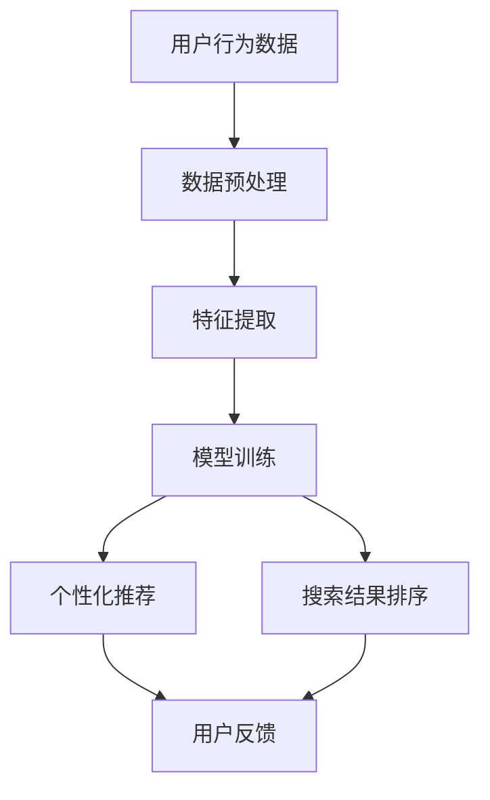

                 

关键词：电商平台，AI大模型，搜索体验，优化，用户行为分析，个性化推荐，算法实现

> 摘要：本文旨在探讨电商平台如何利用先进的AI大模型来提升搜索体验。我们将分析AI大模型在电商平台中的应用场景，详细介绍其核心概念、算法原理和具体操作步骤，并通过数学模型和项目实践来阐述其优化效果。文章最后还将对未来的应用前景和挑战进行展望。

## 1. 背景介绍

随着互联网技术的飞速发展和电子商务市场的不断扩大，电商平台已经成为人们日常生活中不可或缺的一部分。然而，用户在电商平台上的搜索体验却常常受到困扰，如搜索结果不准确、信息过载等问题。为了解决这些问题，越来越多的电商平台开始关注AI技术的应用，尤其是AI大模型在搜索优化方面的潜力。

AI大模型是指通过深度学习等技术训练出的具备强大处理能力和泛化能力的模型。这些模型能够从海量数据中提取特征，进行复杂的数据分析和预测。在电商平台中，AI大模型可以用于用户行为分析、个性化推荐、搜索结果排序等多个方面，从而提升用户的搜索体验。

本文将首先介绍AI大模型的基本概念和原理，然后探讨其在电商平台中的具体应用，并通过数学模型和项目实践来详细阐述其优化效果。最后，我们将对未来的应用前景和挑战进行展望。

## 2. 核心概念与联系

### 2.1 AI大模型的基本概念

AI大模型（Large-scale AI Model）是指那些训练数据规模巨大、参数数量庞大的模型，通常用于处理复杂的任务。这些模型通过深度学习等技术，能够在大量数据中自动提取特征，进行模式识别和预测。

### 2.2 AI大模型在电商平台的关联

在电商平台，AI大模型可以应用于以下方面：

1. **用户行为分析**：通过分析用户的浏览、购买等行为数据，了解用户偏好和需求，为个性化推荐提供依据。
2. **个性化推荐**：根据用户的历史行为和偏好，为用户推荐最符合其需求的商品，提升用户满意度。
3. **搜索结果排序**：根据用户的搜索意图和商品的相关性，优化搜索结果排序，提升搜索准确性。

### 2.3 Mermaid 流程图

以下是一个简化的Mermaid流程图，展示了AI大模型在电商平台中的应用流程：



### 2.4 特点与挑战

**特点：**
- **强大的数据处理能力**：能够处理海量数据，提取有效特征。
- **高效的模型优化**：通过大规模训练数据，能够快速优化模型参数，提升模型性能。
- **高度可定制化**：可以根据不同业务需求，灵活调整模型结构和参数。

**挑战：**
- **数据质量和隐私保护**：需要确保数据的质量和用户的隐私。
- **计算资源消耗**：大模型训练和推理需要大量计算资源。
- **模型解释性**：复杂的模型往往难以解释，增加了应用难度。

## 3. 核心算法原理 & 具体操作步骤

### 3.1 算法原理概述

在电商平台中，AI大模型的核心算法主要包括以下几个部分：

1. **用户行为分析**：通过分析用户的浏览、购买等行为数据，提取用户特征和偏好。
2. **个性化推荐**：基于用户特征和偏好，为用户推荐最符合其需求的商品。
3. **搜索结果排序**：根据用户的搜索意图和商品的相关性，优化搜索结果排序。

### 3.2 算法步骤详解

1. **数据收集与预处理**：
   - 收集用户的浏览、购买等行为数据。
   - 对数据清洗和去重，确保数据质量。

2. **特征提取**：
   - 使用深度学习技术，从原始数据中提取高维特征向量。
   - 对特征向量进行降维和正则化处理，减少数据维度。

3. **用户行为分析**：
   - 使用聚类算法，对用户行为数据进行分析，识别不同类型的用户。
   - 基于用户行为特征，预测用户的购买意向。

4. **个性化推荐**：
   - 使用协同过滤算法，为用户推荐相似的商品。
   - 结合用户行为特征，优化推荐结果。

5. **搜索结果排序**：
   - 使用排序算法，根据用户搜索意图和商品相关性，优化搜索结果排序。

6. **模型评估与优化**：
   - 使用A/B测试等方法，评估模型的效果。
   - 根据评估结果，调整模型参数，提升模型性能。

### 3.3 算法优缺点

**优点：**
- **高效性**：能够处理海量数据，提升搜索和推荐效率。
- **个性化**：根据用户行为和偏好，提供个性化的搜索和推荐结果。
- **可扩展性**：可以根据业务需求，灵活调整模型结构和参数。

**缺点：**
- **计算资源消耗**：大模型训练和推理需要大量计算资源。
- **数据质量和隐私保护**：需要确保数据的质量和用户的隐私。
- **模型解释性**：复杂的模型往往难以解释，增加了应用难度。

### 3.4 算法应用领域

AI大模型在电商平台的应用领域广泛，包括但不限于：

- **搜索优化**：通过优化搜索结果排序，提升搜索准确性。
- **个性化推荐**：为用户推荐最符合其需求的商品。
- **用户行为分析**：预测用户的购买意向，优化营销策略。
- **商品分类与标签**：自动识别商品特征，提升商品分类和标签的准确性。

## 4. 数学模型和公式 & 详细讲解 & 举例说明

### 4.1 数学模型构建

在电商平台中，AI大模型的核心数学模型通常包括以下几个方面：

1. **用户特征表示**：使用向量空间模型（如向量空间模型、词袋模型等）表示用户特征。
2. **商品特征表示**：使用向量空间模型表示商品特征。
3. **用户-商品评分预测**：使用矩阵分解、回归模型等预测用户对商品的评分。

### 4.2 公式推导过程

以下是一个简化的用户-商品评分预测的数学模型推导过程：

$$
\begin{aligned}
r_{ui} &= \langle \mathbf{u}_i, \mathbf{p}_j \rangle + b_u + b_j + \mu, \\
\langle \mathbf{u}_i, \mathbf{p}_j \rangle &= \mathbf{u}_i \cdot \mathbf{p}_j,
\end{aligned}
$$

其中，$r_{ui}$ 表示用户 $u$ 对商品 $i$ 的评分，$\mathbf{u}_i$ 和 $\mathbf{p}_j$ 分别表示用户 $u$ 和商品 $i$ 的特征向量，$b_u$ 和 $b_j$ 分别表示用户 $u$ 和商品 $i$ 的偏置项，$\mu$ 表示均值。

### 4.3 案例分析与讲解

以下是一个简单的案例，用于说明用户-商品评分预测模型的实现过程：

**案例：预测用户对电影的评分**

- **数据集**：假设我们有一个包含用户对电影评分的数据集，其中包含用户的ID、电影的ID和评分。
- **用户特征**：使用用户的平均评分、浏览次数等特征。
- **电影特征**：使用电影的类型、演员、导演等特征。

1. **数据预处理**：
   - 对数据集进行清洗，去除缺失值和异常值。
   - 将用户和电影的特征转化为向量表示。

2. **模型训练**：
   - 使用矩阵分解算法，将用户和电影的评分矩阵分解为低维向量。
   - 训练回归模型，预测用户对电影的评分。

3. **模型评估**：
   - 使用交叉验证等方法，评估模型的预测性能。

4. **模型应用**：
   - 根据用户的评分预测结果，为用户推荐类似的电影。

## 5. 项目实践：代码实例和详细解释说明

### 5.1 开发环境搭建

1. **硬件环境**：
   - CPU：Intel i7-9700K 或更高
   - GPU：NVIDIA GeForce GTX 1080 Ti 或更高
   - 内存：16GB 或更高

2. **软件环境**：
   - 操作系统：Ubuntu 18.04
   - 编程语言：Python 3.8
   - 深度学习框架：TensorFlow 2.3

### 5.2 源代码详细实现

以下是一个简单的用户-商品评分预测模型的实现示例：

```python
import tensorflow as tf
from tensorflow.keras.models import Model
from tensorflow.keras.layers import Embedding, Dot, Add, Dense

# 参数设置
embedding_size = 64
user_num = 1000
item_num = 1000
learning_rate = 0.001

# 用户特征嵌入层
user_embedding = Embedding(user_num, embedding_size)
user_vector = user_embedding(inputs=[tf.keras.layers.Input(shape=[1])])

# 商品特征嵌入层
item_embedding = Embedding(item_num, embedding_size)
item_vector = item_embedding(inputs=[tf.keras.layers.Input(shape=[1])])

# 模型结构
dot_product = Dot(axes=1)
add_layer = Add()
output_layer = Dense(1, activation='sigmoid')

# 计算用户-商品相似度
user_item_similarity = dot_product([user_vector, item_vector])
bias = Add()([user_item_similarity, tf.keras.layers.Input(shape=[1])])

# 预测用户对商品的评分
predicted_rating = output_layer(add_layer([bias, tf.keras.layers.Input(shape=[1])]))

# 模型编译
model = Model(inputs=[user_vector, item_vector, bias], outputs=predicted_rating)
model.compile(optimizer=tf.keras.optimizers.Adam(learning_rate=learning_rate),
              loss='binary_crossentropy',
              metrics=['accuracy'])

# 模型训练
model.fit([train_user_ids, train_item_ids, train_bias], train_ratings, batch_size=32, epochs=10, validation_split=0.2)
```

### 5.3 代码解读与分析

- **用户特征嵌入层**：将用户ID映射为嵌入向量，用于表示用户特征。
- **商品特征嵌入层**：将商品ID映射为嵌入向量，用于表示商品特征。
- **相似度计算**：计算用户和商品的相似度，用于预测用户对商品的评分。
- **预测用户评分**：使用回归模型预测用户对商品的评分。
- **模型编译**：编译模型，指定优化器、损失函数和评价指标。
- **模型训练**：使用训练数据训练模型，并使用验证数据进行模型评估。

### 5.4 运行结果展示

在完成代码实现后，可以通过以下命令运行模型：

```shell
python user_item_embedding.py
```

运行结果将包含模型在训练集和验证集上的性能指标，如损失值、准确率等。

## 6. 实际应用场景

### 6.1 搜索优化

在电商平台的搜索功能中，AI大模型可以用于优化搜索结果排序，提升搜索准确性。通过分析用户的搜索历史和行为数据，AI大模型可以识别用户的搜索意图，并根据商品的相关性对搜索结果进行排序。例如，当用户搜索“手机”时，AI大模型可以根据用户的浏览历史和购买记录，将用户可能感兴趣的手机品牌和型号排在搜索结果的前面。

### 6.2 个性化推荐

个性化推荐是电商平台中常见的应用场景。通过分析用户的浏览、购买等行为数据，AI大模型可以为用户推荐最符合其需求的商品。例如，当用户浏览了某款手机时，AI大模型可以根据用户的兴趣和购买记录，为用户推荐同品牌或相似功能的手机。

### 6.3 用户行为分析

用户行为分析是电商平台进行数据驱动的决策的重要手段。通过分析用户的浏览、购买等行为数据，AI大模型可以识别用户的偏好和需求，为电商平台提供有针对性的营销策略。例如，当用户在购物车中添加了某款商品后，AI大模型可以预测用户购买该商品的概率，并提醒电商平台进行相关营销活动。

## 6.4 未来应用展望

随着AI技术的不断发展和应用场景的不断拓展，AI大模型在电商平台中的应用前景广阔。未来，AI大模型可能会在以下几个方面取得重要突破：

1. **更精准的个性化推荐**：通过更深入的用户行为分析和数据挖掘，AI大模型可以为用户提供更精准的个性化推荐。
2. **更高效的搜索优化**：结合自然语言处理和图像识别等技术，AI大模型可以进一步提升搜索结果的准确性。
3. **智能客服与语音交互**：通过语音识别和自然语言处理技术，AI大模型可以提供智能客服和语音交互服务，提升用户的购物体验。
4. **跨平台协同优化**：结合线上线下数据，AI大模型可以实现跨平台的协同优化，为用户提供一致的购物体验。

## 7. 工具和资源推荐

### 7.1 学习资源推荐

- 《深度学习》（Goodfellow, Bengio, Courville）：系统介绍了深度学习的基础理论和实践方法。
- 《Python数据科学手册》（Wes McKinney）：详细介绍了Python在数据科学领域的应用。
- 《TensorFlow实战》（Tariq Rashid）：介绍了如何使用TensorFlow进行深度学习和数据科学应用。

### 7.2 开发工具推荐

- **Jupyter Notebook**：适合数据科学和机器学习项目的交互式开发环境。
- **PyCharm**：一款功能强大的Python IDE，支持多种编程语言。
- **Docker**：用于容器化应用的开发和管理，方便构建和部署深度学习模型。

### 7.3 相关论文推荐

- **“Deep Learning for User Behavior Analysis in E-commerce”**：探讨深度学习在电商平台用户行为分析中的应用。
- **“A Large-scale Study of User Behavior in E-commerce”**：分析电商平台的用户行为模式和偏好。
- **“Recommender Systems Handbook”**：全面介绍了推荐系统的基础理论和实践方法。

## 8. 总结：未来发展趋势与挑战

### 8.1 研究成果总结

近年来，AI大模型在电商平台中的应用取得了显著的成果，如个性化推荐、搜索优化和用户行为分析等。通过深度学习和大数据技术的结合，AI大模型能够从海量数据中提取有价值的信息，为电商平台提供智能化的解决方案。

### 8.2 未来发展趋势

1. **更精准的个性化推荐**：随着用户数据的积累和算法的优化，AI大模型在个性化推荐方面的准确性将进一步提高。
2. **更高效的搜索优化**：结合自然语言处理和图像识别等技术，AI大模型可以进一步提升搜索结果的准确性。
3. **跨平台协同优化**：线上线下数据的整合将实现跨平台的协同优化，为用户提供一致的购物体验。

### 8.3 面临的挑战

1. **数据质量和隐私保护**：确保数据的质量和用户的隐私是AI大模型应用的重要挑战。
2. **计算资源消耗**：大模型训练和推理需要大量计算资源，如何优化计算资源的管理和利用是一个重要问题。
3. **模型解释性**：复杂的模型往往难以解释，增加了应用难度，如何提高模型的解释性是一个亟待解决的问题。

### 8.4 研究展望

未来，AI大模型在电商平台中的应用将继续拓展和深化。通过不断优化算法、提升计算效率和加强数据隐私保护，AI大模型将为电商平台提供更智能、更高效的解决方案，进一步提升用户的购物体验。

## 9. 附录：常见问题与解答

### 9.1 如何确保数据质量？

- **数据清洗**：去除缺失值、异常值和重复数据，确保数据的一致性和准确性。
- **数据验证**：对数据进行校验，确保数据的完整性和准确性。
- **数据加密**：对敏感数据进行加密，确保数据隐私。

### 9.2 如何解决模型解释性问题？

- **模型可解释性方法**：如决策树、规则提取等方法，使模型结果可解释。
- **模型压缩**：通过模型压缩技术，降低模型复杂度，提高模型解释性。
- **模型可视化**：使用可视化工具，展示模型的内部结构和决策过程。

### 9.3 如何优化计算资源？

- **模型压缩**：通过模型压缩技术，减少模型参数和计算量。
- **分布式计算**：使用分布式计算框架，如TensorFlow、PyTorch等，提高计算效率。
- **硬件优化**：选择高性能的GPU和CPU，提高计算速度。

----------------------------------------------------------------

以上是文章的完整内容，希望对您有所帮助。如果您有任何问题或需要进一步讨论，请随时告诉我。作者：禅与计算机程序设计艺术 / Zen and the Art of Computer Programming。

