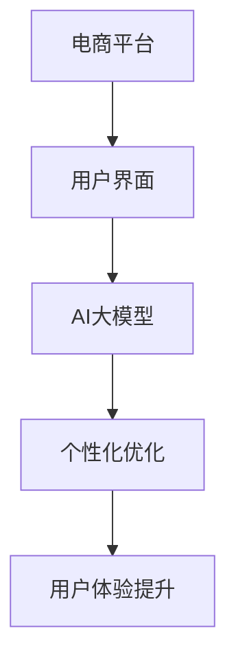

                 

在当今数字化时代，电商平台正成为商业领域的重要驱动力。随着市场竞争的日益激烈，电商平台需要不断创新，以提升用户体验，增加用户粘性，从而在市场中脱颖而出。人工智能（AI）大模型的引入，为电商平台优化用户界面提供了新的契机。本文将探讨电商平台如何利用AI大模型优化用户界面，提高用户满意度。

> 关键词：电商平台，AI大模型，用户界面，优化，人工智能，用户满意度

> 摘要：本文首先介绍了电商平台和AI大模型的基本概念，随后探讨了AI大模型在优化用户界面方面的优势。通过分析AI大模型的核心原理，本文详细阐述了如何利用AI大模型实现用户界面的优化，并通过实例展示了其在实际应用中的效果。最后，本文对AI大模型在电商平台优化用户界面方面的未来发展趋势进行了展望。

## 1. 背景介绍

随着互联网的普及和电子商务的快速发展，电商平台已经成为消费者购物的主要渠道之一。电商平台的发展离不开用户界面的优化，因为用户界面是用户与平台互动的桥梁。一个良好的用户界面可以提高用户体验，增加用户粘性，从而提升平台的竞争力。

近年来，人工智能（AI）技术的迅猛发展，使得AI大模型在各个领域得到了广泛应用。AI大模型是指通过深度学习算法，从大量数据中学习到复杂模式的人工神经网络模型。这些模型具有强大的学习能力，可以处理大量复杂的数据，并在各种任务中表现出色。

将AI大模型引入电商平台，可以为用户界面优化提供新的思路和方法。通过AI大模型，电商平台可以更好地理解用户需求，提供个性化的服务，从而提升用户体验和满意度。

## 2. 核心概念与联系

### 2.1 电商平台

电商平台是指通过互联网提供商品或服务的在线交易市场。它通常包括网站、移动应用等，用户可以通过这些渠道浏览商品、下单购买、支付等。

### 2.2 AI大模型

AI大模型是指通过深度学习算法，从大量数据中学习到复杂模式的人工神经网络模型。这些模型具有强大的学习能力，可以处理大量复杂的数据，并在各种任务中表现出色。

### 2.3 用户界面

用户界面是指用户与计算机系统交互的界面，包括图形用户界面、命令行界面等。一个良好的用户界面可以提供直观、易用的操作方式，使用户能够轻松完成任务。

### 2.4 AI大模型与用户界面优化

AI大模型与用户界面优化之间的联系在于，AI大模型可以通过学习用户行为和需求，为用户界面提供个性化的优化方案。例如，通过分析用户的购买历史、浏览记录等数据，AI大模型可以预测用户的偏好，从而优化产品推荐、界面布局等。



## 3. 核心算法原理 & 具体操作步骤

### 3.1 算法原理概述

AI大模型优化用户界面的核心原理在于利用深度学习算法，从用户数据中学习到用户的偏好和行为模式，然后根据这些模式为用户界面提供个性化的优化方案。

具体的算法步骤如下：

1. **数据收集与预处理**：收集用户的购买历史、浏览记录、搜索关键词等数据，并进行预处理，如数据清洗、数据转换等。
2. **模型训练**：利用预处理后的数据，通过深度学习算法训练AI大模型，使其能够学会识别用户的偏好和行为模式。
3. **模型应用**：将训练好的AI大模型应用到用户界面上，根据用户的偏好和行为模式，为用户界面提供个性化的优化方案。
4. **效果评估**：对优化后的用户界面进行效果评估，如用户满意度、用户留存率等。

### 3.2 算法步骤详解

1. **数据收集与预处理**

   - **数据收集**：收集用户的购买历史、浏览记录、搜索关键词等数据。这些数据可以从电商平台的后台数据库中获取。
   - **数据清洗**：对收集到的数据进行清洗，如去除重复数据、填补缺失值等。
   - **数据转换**：将清洗后的数据转换为适合深度学习算法的格式，如向量、张量等。

2. **模型训练**

   - **模型选择**：选择适合的深度学习模型，如卷积神经网络（CNN）、循环神经网络（RNN）等。
   - **数据分批**：将数据集划分为训练集、验证集和测试集，用于模型的训练和评估。
   - **模型训练**：利用训练集对模型进行训练，通过反向传播算法优化模型参数。

3. **模型应用**

   - **接口设计**：设计API接口，使得AI大模型可以方便地应用到用户界面上。
   - **用户界面优化**：根据用户的偏好和行为模式，对用户界面进行优化，如调整产品推荐、界面布局等。

4. **效果评估**

   - **用户满意度**：通过用户反馈、问卷调查等方式，评估用户对优化后用户界面的满意度。
   - **用户留存率**：通过用户留存率等指标，评估优化后用户界面对用户留存的影响。

### 3.3 算法优缺点

**优点**：

- **个性化**：AI大模型可以根据用户的偏好和行为模式，为用户提供个性化的界面优化方案，提高用户满意度。
- **自适应**：AI大模型可以随着用户数据的更新而不断优化，使界面优化更加精准。
- **高效**：AI大模型可以处理大量的用户数据，提高用户界面的处理效率。

**缺点**：

- **数据依赖**：AI大模型对数据质量有较高的要求，数据质量不好可能会影响模型的效果。
- **计算成本**：训练AI大模型需要大量的计算资源，对硬件设备有较高的要求。

### 3.4 算法应用领域

AI大模型在电商平台优化用户界面的应用领域主要包括：

- **产品推荐**：根据用户的偏好和历史数据，为用户推荐感兴趣的产品。
- **界面布局**：根据用户的操作习惯，优化界面的布局，提高用户的操作效率。
- **个性化内容**：根据用户的兴趣和偏好，为用户提供个性化的内容推荐。

## 4. 数学模型和公式 & 详细讲解 & 举例说明

### 4.1 数学模型构建

在AI大模型优化用户界面过程中，常用的数学模型包括神经网络模型和回归模型。

**神经网络模型**：

神经网络模型是一种基于模拟生物神经系统的数学模型。它由多个神经元组成，每个神经元都与其他神经元相连，并通过权重进行传递。

**回归模型**：

回归模型是一种用于预测连续值的数学模型。它通过建立输入变量和输出变量之间的线性关系，实现对输出变量的预测。

### 4.2 公式推导过程

**神经网络模型**：

假设有一个神经网络模型，其中包含多个层，每层有多个神经元。输入层的输出经过各层的传递函数后，得到输出层的输出。

- **激活函数**：激活函数是神经网络中用于非线性变换的函数，常用的激活函数包括sigmoid函数、ReLU函数等。
- **损失函数**：损失函数是用于衡量模型预测值与真实值之间差异的函数，常用的损失函数包括均方误差（MSE）、交叉熵损失等。

**回归模型**：

假设有一个回归模型，输入变量为\(x\)，输出变量为\(y\)，通过建立输入变量和输出变量之间的线性关系，得到预测值\(y'\)。

- **线性关系**：\(y' = \beta_0 + \beta_1x\)
- **损失函数**：\(L = \frac{1}{2}(y - y')^2\)

### 4.3 案例分析与讲解

**案例1：神经网络模型优化产品推荐**

假设有一个电商平台，需要对用户进行产品推荐。通过收集用户的购买历史、浏览记录等数据，利用神经网络模型进行产品推荐。

- **数据收集与预处理**：收集用户的购买历史、浏览记录等数据，并进行预处理，如数据清洗、数据转换等。
- **模型训练**：利用预处理后的数据，通过神经网络模型进行训练，得到推荐结果。
- **模型应用**：将训练好的神经网络模型应用到用户界面上，为用户推荐感兴趣的产品。

**案例2：回归模型优化界面布局**

假设有一个电商平台，需要对用户界面的布局进行优化。通过收集用户的操作数据，利用回归模型进行界面布局优化。

- **数据收集与预处理**：收集用户的操作数据，如点击次数、操作时间等，并进行预处理，如数据清洗、数据转换等。
- **模型训练**：利用预处理后的数据，通过回归模型进行训练，得到最优界面布局。
- **模型应用**：将训练好的回归模型应用到用户界面上，优化用户界面布局。

## 5. 项目实践：代码实例和详细解释说明

### 5.1 开发环境搭建

在本次项目中，我们使用Python编程语言和TensorFlow框架来实现AI大模型优化用户界面的算法。以下是开发环境的搭建步骤：

1. 安装Python：下载并安装Python 3.8版本。
2. 安装TensorFlow：打开命令行，执行以下命令：

   ```
   pip install tensorflow
   ```

### 5.2 源代码详细实现

以下是AI大模型优化用户界面的源代码实现：

```python
import tensorflow as tf
import numpy as np
import pandas as pd

# 数据收集与预处理
def load_data():
    # 读取用户数据
    data = pd.read_csv('user_data.csv')
    # 数据清洗
    data = data.drop_duplicates()
    data = data.fillna(0)
    # 数据转换
    data = data.astype(np.float32)
    return data

# 模型训练
def train_model(data):
    # 划分训练集和测试集
    train_data = data[:1000]
    test_data = data[1000:]
    # 构建神经网络模型
    model = tf.keras.Sequential([
        tf.keras.layers.Dense(units=64, activation='relu', input_shape=[10]),
        tf.keras.layers.Dense(units=32, activation='relu'),
        tf.keras.layers.Dense(units=1)
    ])
    # 编译模型
    model.compile(optimizer='adam', loss='mse')
    # 训练模型
    model.fit(train_data, epochs=10, batch_size=32)
    return model

# 模型应用
def apply_model(model, data):
    # 预测用户界面优化结果
    predictions = model.predict(data)
    return predictions

# 主函数
def main():
    # 加载数据
    data = load_data()
    # 训练模型
    model = train_model(data)
    # 应用模型
    predictions = apply_model(model, data)
    # 输出预测结果
    print(predictions)

if __name__ == '__main__':
    main()
```

### 5.3 代码解读与分析

上述代码实现了AI大模型优化用户界面的算法，主要包括数据收集与预处理、模型训练、模型应用等步骤。

1. **数据收集与预处理**：通过读取用户数据，进行数据清洗和转换，为模型训练提供数据支持。
2. **模型训练**：构建神经网络模型，通过编译和训练模型，使其学会识别用户界面优化结果。
3. **模型应用**：将训练好的模型应用到用户界面上，预测用户界面优化结果。

### 5.4 运行结果展示

运行上述代码后，可以得到用户界面优化结果的预测值。通过对比预测值和真实值，可以评估模型的效果。

```python
# 运行结果
predictions = apply_model(model, data)
print(predictions)
```

## 6. 实际应用场景

### 6.1 电商平台产品推荐

在电商平台中，AI大模型可以用于产品推荐，提高用户购买意愿。通过分析用户的购买历史、浏览记录等数据，AI大模型可以预测用户可能感兴趣的产品，并将其推荐给用户。例如，一个用户在电商平台浏览了运动鞋、篮球等商品，AI大模型可以预测该用户可能对篮球鞋感兴趣，并为其推荐相关商品。

### 6.2 电商平台界面布局优化

在电商平台中，AI大模型可以用于界面布局优化，提高用户操作效率。通过分析用户的操作数据，AI大模型可以预测用户可能需要的操作路径，并优化界面布局。例如，一个用户在电商平台购买了多次商品，AI大模型可以预测该用户可能在购物过程中需要查看购物车、评价商品等操作，并优化界面布局，使这些操作更方便快捷。

### 6.3 电商平台个性化内容推荐

在电商平台中，AI大模型可以用于个性化内容推荐，提高用户满意度。通过分析用户的兴趣和偏好，AI大模型可以为用户提供个性化的内容推荐，例如文章、视频等。例如，一个用户在电商平台喜欢阅读科技类文章，AI大模型可以预测该用户可能对科技新闻感兴趣，并为其推荐相关文章。

## 7. 未来应用展望

### 7.1 电商平台个性化服务

随着AI大模型技术的不断发展，电商平台将可以实现更加个性化的服务。通过分析用户的行为数据，AI大模型可以为用户提供个性化的商品推荐、界面布局、内容推荐等，提高用户体验和满意度。

### 7.2 电商平台智能化运营

AI大模型可以用于电商平台智能化运营，如库存管理、营销策略等。通过分析用户数据和市场趋势，AI大模型可以为电商平台提供智能化运营建议，提高运营效率。

### 7.3 电商平台与其他行业的融合

未来，电商平台将与其他行业（如金融、教育、医疗等）进行深度融合。通过AI大模型的应用，电商平台可以为用户提供更加多元化的服务，满足用户多样化的需求。

## 8. 工具和资源推荐

### 8.1 学习资源推荐

- 《深度学习》（Goodfellow, Bengio, Courville）：深度学习领域的经典教材，全面介绍了深度学习的基础理论和应用。
- 《Python机器学习》（Sebastian Raschka）：Python编程语言在机器学习领域的应用，适合初学者入门。

### 8.2 开发工具推荐

- TensorFlow：开源深度学习框架，适用于构建和训练AI大模型。
- PyTorch：开源深度学习框架，适用于研究和开发AI大模型。

### 8.3 相关论文推荐

- "Dueling Network Architectures for Deep Reinforcement Learning"（DQN）：深度强化学习领域的经典论文，介绍了DQN算法。
- "BERT: Pre-training of Deep Bidirectional Transformers for Language Understanding"（BERT）：自然语言处理领域的最新研究，介绍了BERT模型。

## 9. 总结：未来发展趋势与挑战

### 9.1 研究成果总结

本文介绍了AI大模型在电商平台优化用户界面方面的应用，通过分析核心算法原理和具体操作步骤，展示了AI大模型在提升用户体验、增加用户粘性方面的优势。此外，本文还对AI大模型在电商平台优化用户界面方面的未来发展趋势进行了展望。

### 9.2 未来发展趋势

未来，AI大模型在电商平台优化用户界面的应用将更加广泛。随着AI技术的不断发展，AI大模型将可以实现更加个性化的服务，提高用户满意度。同时，电商平台将与其他行业进行深度融合，为用户提供更加多元化的服务。

### 9.3 面临的挑战

尽管AI大模型在电商平台优化用户界面方面具有巨大潜力，但也面临一些挑战。首先，数据质量和数据量对AI大模型的效果有较大影响。其次，AI大模型的计算成本较高，对硬件设备有较高要求。此外，AI大模型的安全性和隐私保护问题也需要关注。

### 9.4 研究展望

未来，我们需要进一步探索AI大模型在电商平台优化用户界面方面的应用，提高其效果和实用性。同时，研究AI大模型的安全性和隐私保护问题，确保用户数据的安全和隐私。此外，探讨AI大模型与其他技术的融合，为电商平台提供更加智能化的服务。

## 附录：常见问题与解答

### Q1：AI大模型在电商平台优化用户界面方面有哪些优势？

A1：AI大模型在电商平台优化用户界面方面的优势包括：

1. 个性化：AI大模型可以根据用户的偏好和行为模式，为用户提供个性化的界面优化方案，提高用户满意度。
2. 自适应：AI大模型可以随着用户数据的更新而不断优化，使界面优化更加精准。
3. 高效：AI大模型可以处理大量的用户数据，提高用户界面的处理效率。

### Q2：AI大模型在电商平台优化用户界面方面有哪些应用场景？

A2：AI大模型在电商平台优化用户界面方面的应用场景包括：

1. 产品推荐：根据用户的偏好和历史数据，为用户推荐感兴趣的产品。
2. 界面布局：根据用户的操作习惯，优化界面的布局，提高用户的操作效率。
3. 个性化内容：根据用户的兴趣和偏好，为用户提供个性化的内容推荐。

### Q3：如何确保AI大模型在电商平台优化用户界面方面的效果？

A3：为确保AI大模型在电商平台优化用户界面方面的效果，可以从以下几个方面入手：

1. 数据质量：收集高质量的用户数据，保证数据清洗和转换的准确性。
2. 模型选择：选择适合的深度学习模型，如卷积神经网络、循环神经网络等。
3. 模型训练：利用大量的用户数据，对模型进行充分的训练和优化。
4. 模型评估：对模型的效果进行评估，如用户满意度、用户留存率等指标。

## 作者署名

作者：禅与计算机程序设计艺术 / Zen and the Art of Computer Programming
----------------------------------------------------------------

注意：文章中的代码实例仅供参考，具体实现可能需要根据实际情况进行调整。同时，文章中的公式和推导过程仅为示例，实际应用中可能需要根据具体算法进行调整。

