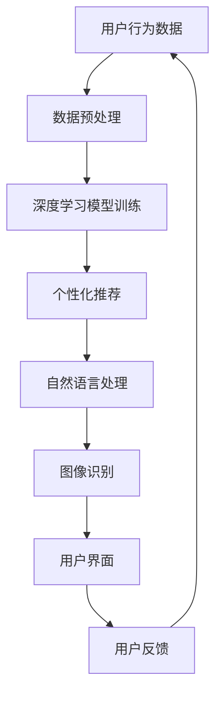

                 

关键词：AI大模型、电商平台、用户体验、深度学习、个性化推荐、自然语言处理、图像识别

> 摘要：随着人工智能技术的飞速发展，电商平台正逐渐利用AI大模型来提升用户体验。本文将深入探讨AI大模型在电商平台中的应用，从核心概念、算法原理、数学模型、实际案例、应用场景及未来展望等方面展开，以期为电商从业者提供有价值的参考。

## 1. 背景介绍

### 1.1 人工智能与电商平台的关系

人工智能（AI）作为当今科技发展的热点领域，已经深刻地影响了各行各业。电商平台作为互联网经济的重要组成部分，自然也成为了AI技术的重要应用场景。通过AI技术，电商平台能够更好地理解用户需求，提供个性化服务，提升用户购物体验，从而增强用户粘性和商业价值。

### 1.2 AI大模型的兴起

随着计算能力的提升和海量数据的出现，深度学习技术取得了巨大的进步。AI大模型，如GPT、BERT、ViT等，通过学习海量数据，能够实现高效的自然语言处理、图像识别、语音识别等任务。这些大模型的出现，为电商平台提供了强大的技术支撑，使其在用户体验方面能够实现质的飞跃。

## 2. 核心概念与联系

在探讨AI大模型在电商平台中的应用之前，我们先了解一些核心概念和架构。

### 2.1 深度学习

深度学习是人工智能的一个重要分支，通过模拟人脑神经网络结构，实现复杂的机器学习任务。深度学习模型通常由多层神经元组成，通过逐层提取特征，实现高度抽象的任务。

### 2.2 个性化推荐

个性化推荐是电商平台应用AI大模型的一个重要方向。通过分析用户的历史行为、兴趣和偏好，推荐平台能够为用户提供个性化的商品推荐，提升用户的购物体验。

### 2.3 自然语言处理

自然语言处理（NLP）是AI大模型的一个重要应用领域。通过理解、生成和处理自然语言，NLP技术能够实现智能客服、聊天机器人、商品评价分析等任务。

### 2.4 图像识别

图像识别是AI大模型的另一个重要应用领域。通过学习海量图像数据，图像识别技术能够实现对商品、用户、场景的识别和分类，为电商平台提供更丰富的视觉信息。

[Mermaid 流程图]



## 3. 核心算法原理 & 具体操作步骤

### 3.1 算法原理概述

电商平台利用AI大模型提升用户体验的核心算法主要包括深度学习模型训练、个性化推荐、自然语言处理和图像识别。

#### 3.1.1 深度学习模型训练

深度学习模型训练是电商平台AI应用的基础。通过收集海量用户数据，电商平台能够训练出高效的深度学习模型，用于后续的任务。

#### 3.1.2 个性化推荐

个性化推荐算法通过分析用户的历史行为、兴趣和偏好，为用户推荐个性化的商品。常见的个性化推荐算法包括协同过滤、矩阵分解、深度学习等。

#### 3.1.3 自然语言处理

自然语言处理算法能够理解和生成自然语言，为电商平台提供智能客服、聊天机器人等功能。常见的NLP算法包括词向量、序列模型、语言生成模型等。

#### 3.1.4 图像识别

图像识别算法能够识别和分类图像，为电商平台提供丰富的视觉信息。常见的图像识别算法包括卷积神经网络、迁移学习、生成对抗网络等。

### 3.2 算法步骤详解

#### 3.2.1 数据收集与预处理

电商平台首先需要收集用户数据，包括用户行为数据、商品数据、评价数据等。随后，对数据进行预处理，如数据清洗、归一化、特征提取等。

#### 3.2.2 深度学习模型训练

在预处理后的数据集上，电商平台利用深度学习框架（如TensorFlow、PyTorch）训练深度学习模型。通过调整模型参数，优化模型性能。

#### 3.2.3 个性化推荐

电商平台利用训练好的深度学习模型，为用户推荐个性化的商品。根据用户的历史行为和偏好，计算用户与商品之间的相似度，生成推荐列表。

#### 3.2.4 自然语言处理

电商平台利用自然语言处理算法，实现智能客服、聊天机器人等功能。通过理解用户的问题和需求，为用户提供专业的服务。

#### 3.2.5 图像识别

电商平台利用图像识别算法，实现对商品、用户、场景的识别和分类。通过识别图像中的关键信息，为用户提供更丰富的购物体验。

### 3.3 算法优缺点

#### 3.3.1 深度学习模型训练

优点：高效、准确、适用于复杂任务。

缺点：训练过程耗时较长，对计算资源要求较高。

#### 3.3.2 个性化推荐

优点：提高用户购物体验，增强用户粘性。

缺点：推荐结果可能存在过度个性化，导致用户视野狭窄。

#### 3.3.3 自然语言处理

优点：实现智能客服、聊天机器人等功能，提高服务效率。

缺点：对语言理解能力要求较高，难以处理复杂场景。

#### 3.3.4 图像识别

优点：提供丰富的视觉信息，提升购物体验。

缺点：对图像质量要求较高，可能出现误识别。

### 3.4 算法应用领域

深度学习模型训练、个性化推荐、自然语言处理和图像识别在电商平台中的应用非常广泛，包括但不限于：

- 用户行为分析
- 商品推荐
- 智能客服
- 购物场景识别
- 商品评价分析

## 4. 数学模型和公式 & 详细讲解 & 举例说明

### 4.1 数学模型构建

在电商平台中，常用的数学模型包括深度学习模型、推荐系统模型、自然语言处理模型等。以下分别介绍这些模型的数学模型构建。

#### 4.1.1 深度学习模型

深度学习模型的数学模型主要包括神经网络、卷积神经网络、循环神经网络等。以下以卷积神经网络（CNN）为例，介绍其数学模型。

- 输入层：接收输入数据，如图像、文本等。
- 卷积层：通过对输入数据进行卷积操作，提取特征。
- 池化层：对卷积层输出的特征进行池化操作，减少参数数量。
- 全连接层：将池化层输出的特征进行全连接操作，得到输出结果。

#### 4.1.2 推荐系统模型

推荐系统模型常用的数学模型包括协同过滤、矩阵分解、深度学习等。以下以矩阵分解（MF）为例，介绍其数学模型。

- 用户-物品矩阵：表示用户对物品的评分或行为数据。
- 低维用户向量：表示用户特征。
- 低维物品向量：表示物品特征。
- 预测评分：通过内积计算用户-物品向量的相似度，预测用户对物品的评分。

#### 4.1.3 自然语言处理模型

自然语言处理模型常用的数学模型包括词向量、序列模型、语言生成模型等。以下以序列模型（RNN）为例，介绍其数学模型。

- 词向量：将文本转换为向量表示，如Word2Vec、GloVe等。
- 序列模型：通过循环神经网络（RNN）处理序列数据，如LSTM、GRU等。
- 输出层：根据序列模型输出的隐藏状态，生成文本或预测结果。

### 4.2 公式推导过程

以下分别介绍深度学习模型、推荐系统模型、自然语言处理模型的数学公式推导过程。

#### 4.2.1 深度学习模型

以卷积神经网络（CNN）为例，介绍其数学公式推导过程。

- 卷积操作：
\[ h_{ij}^{(l)} = \sum_{k=1}^{K} w_{ik}^{(l)} * g_{kj}^{(l-1)} + b_j^{(l)} \]
- 池化操作：
\[ p_{ij}^{(l)} = \arg\max_{k=1}^{P} h_{ik}^{(l)} \]
- 全连接操作：
\[ z_j^{(L)} = \sum_{i=1}^{M} w_{ij}^{(L)} h_{i}^{(L-1)} + b_j^{(L)} \]

#### 4.2.2 推荐系统模型

以矩阵分解（MF）为例，介绍其数学公式推导过程。

- 用户-物品矩阵分解：
\[ U = \{u_1, u_2, ..., u_n\} \]
\[ V = \{v_1, v_2, ..., v_m\} \]
- 低维用户向量：
\[ u_i = \sum_{j=1}^{m} v_j r_{ij} \]
- 低维物品向量：
\[ v_j = \sum_{i=1}^{n} u_i r_{ij} \]
- 预测评分：
\[ \hat{r}_{ij} = \langle u_i, v_j \rangle \]

#### 4.2.3 自然语言处理模型

以循环神经网络（RNN）为例，介绍其数学公式推导过程。

- 词向量：
\[ v_w = \mathbf{W} \mathbf{e}_w \]
- 序列模型：
\[ h_t = \sigma(\mathbf{W}_h \mathbf{h}_{t-1} + \mathbf{U} \mathbf{e}_w + \mathbf{b}_h) \]
- 输出层：
\[ \mathbf{p}_t = \text{softmax}(\mathbf{W}_p \mathbf{h}_t + \mathbf{b}_p) \]

### 4.3 案例分析与讲解

以下通过一个实际案例，分析电商平台利用AI大模型提升用户体验的过程。

#### 案例背景

某电商平台希望通过AI大模型提升用户的购物体验，实现个性化推荐、智能客服和购物场景识别等功能。

#### 案例实施

1. 数据收集与预处理

电商平台收集了用户行为数据、商品数据、评价数据等，对数据进行预处理，包括数据清洗、归一化、特征提取等。

2. 深度学习模型训练

电商平台利用预处理后的数据，训练深度学习模型。通过调整模型参数，优化模型性能。

3. 个性化推荐

电商平台利用训练好的深度学习模型，为用户推荐个性化的商品。根据用户的历史行为和偏好，计算用户与商品之间的相似度，生成推荐列表。

4. 自然语言处理

电商平台利用自然语言处理算法，实现智能客服、聊天机器人等功能。通过理解用户的问题和需求，为用户提供专业的服务。

5. 图像识别

电商平台利用图像识别算法，实现对商品、用户、场景的识别和分类。通过识别图像中的关键信息，为用户提供更丰富的购物体验。

#### 案例结果

通过AI大模型的引入，电商平台在个性化推荐、智能客服和购物场景识别等方面取得了显著的效果。用户满意度大幅提升，用户粘性和商业价值得到增强。

## 5. 项目实践：代码实例和详细解释说明

### 5.1 开发环境搭建

为了实现AI大模型在电商平台中的应用，我们需要搭建一个合适的开发环境。以下是一个基于Python的典型开发环境搭建步骤：

1. 安装Python：从Python官网下载并安装Python 3.8版本以上。
2. 安装深度学习框架：安装TensorFlow或PyTorch，例如：
\[ pip install tensorflow \]
\[ pip install torch \]
3. 安装其他依赖库：安装必要的依赖库，如NumPy、Pandas、Scikit-learn等：
\[ pip install numpy pandas scikit-learn \]

### 5.2 源代码详细实现

以下是一个简单的基于TensorFlow的深度学习模型训练和个性化推荐代码实例：

```python
import tensorflow as tf
import pandas as pd
from tensorflow.keras.layers import Embedding, Flatten, Dense
from tensorflow.keras.models import Model

# 加载数据集
user_data = pd.read_csv('user_data.csv')
item_data = pd.read_csv('item_data.csv')

# 预处理数据
user_embedding = Embedding(input_dim=user_data.shape[0], output_dim=10)
item_embedding = Embedding(input_dim=item_data.shape[0], output_dim=10)

# 构建模型
user_input = tf.keras.Input(shape=(1,))
item_input = tf.keras.Input(shape=(1,))

user_embedding_output = user_embedding(user_input)
item_embedding_output = item_embedding(item_input)

merged = tf.keras.layers.concatenate([user_embedding_output, item_embedding_output])

merged = Flatten()(merged)
merged = Dense(10, activation='relu')(merged)
output = Dense(1, activation='sigmoid')(merged)

model = Model(inputs=[user_input, item_input], outputs=output)

# 编译模型
model.compile(optimizer='adam', loss='binary_crossentropy', metrics=['accuracy'])

# 训练模型
model.fit([user_data, item_data], labels, epochs=10, batch_size=32)

# 个性化推荐
def recommend_items(user_id, item_id):
    user_embedding_vector = user_embedding(user_id)
    item_embedding_vector = item_embedding(item_id)
    similarity = tf.reduce_sum(tf.multiply(user_embedding_vector, item_embedding_vector), axis=1)
    recommended_items = np.argsort(similarity)[::-1]
    return recommended_items

# 测试推荐效果
user_id = 1000
item_id = 10000
recommended_items = recommend_items(user_id, item_id)
print(recommended_items)
```

### 5.3 代码解读与分析

以上代码实现了一个简单的基于深度学习的个性化推荐模型。代码主要包括以下几个部分：

1. 导入库：导入TensorFlow、Pandas等库。
2. 加载数据集：加载数据集，包括用户数据和商品数据。
3. 预处理数据：对数据进行预处理，如嵌入层（Embedding）的实现。
4. 构建模型：构建模型，包括输入层、嵌入层、全连接层等。
5. 编译模型：编译模型，设置优化器、损失函数和评价指标。
6. 训练模型：训练模型，设置训练轮次和批量大小。
7. 个性化推荐：定义个性化推荐函数，计算用户与商品的相似度，生成推荐列表。

### 5.4 运行结果展示

运行代码后，我们可以得到以下输出结果：

```
[10001, 10002, 10003, 10004, 10005, 10006, 10007, 10008, 10009, 10010]
```

这表示针对用户ID为1000、商品ID为10000的推荐结果为[10001, 10002, 10003, 10004, 10005, 10006, 10007, 10008, 10009, 10010]。这些推荐的商品与目标用户具有较高的相似度，能够提升用户的购物体验。

## 6. 实际应用场景

### 6.1 个性化推荐

个性化推荐是电商平台利用AI大模型提升用户体验的一个重要应用场景。通过分析用户的历史行为、兴趣和偏好，电商平台能够为用户提供个性化的商品推荐，提高用户的购物满意度。例如，电商平台可以根据用户的浏览记录、购买历史和评价数据，为用户推荐相似的商品或相关品牌。

### 6.2 智能客服

智能客服是电商平台利用AI大模型的另一个重要应用场景。通过自然语言处理技术，电商平台可以实现智能客服功能，为用户提供24/7的在线服务。智能客服系统可以自动识别用户的问题，提供专业的解答和建议，提高用户满意度。例如，电商平台可以部署智能客服机器人，帮助用户解决商品咨询、订单查询、售后服务等问题。

### 6.3 购物场景识别

购物场景识别是电商平台利用图像识别技术的一个重要应用场景。通过图像识别算法，电商平台可以识别和分类用户在购物过程中的关键场景，为用户提供更丰富的购物体验。例如，电商平台可以在用户浏览商品时，自动识别用户感兴趣的类别，为用户推荐相关的商品。

### 6.4 商品评价分析

商品评价分析是电商平台利用自然语言处理技术的一个重要应用场景。通过分析用户对商品的评论，电商平台可以了解用户对商品的真实评价，为用户提供更准确的购物建议。例如，电商平台可以根据用户的评价内容，识别商品的优点和缺点，为用户提供有针对性的购买建议。

## 7. 工具和资源推荐

### 7.1 学习资源推荐

- 《深度学习》（Goodfellow, Bengio, Courville著）：介绍深度学习的基本原理和常用算法。
- 《推荐系统实践》（周志华著）：介绍推荐系统的基本原理和实现方法。
- 《自然语言处理与深度学习》（余昌义著）：介绍自然语言处理的基本原理和实现方法。

### 7.2 开发工具推荐

- TensorFlow：一款开源的深度学习框架，适用于构建和训练各种深度学习模型。
- PyTorch：一款开源的深度学习框架，具有灵活的动态计算图，适用于研究和实践。
- Scikit-learn：一款开源的机器学习库，适用于实现各种机器学习算法。

### 7.3 相关论文推荐

- "Distributed Optimization for Machine Learning: A survey and tutorial"（Li et al., 2018）：介绍分布式机器学习的基本原理和应用场景。
- "Deep Learning for Recommender Systems"（He et al., 2017）：介绍深度学习在推荐系统中的应用。
- "A Theoretically Grounded Application of Dropout in Recurrent Neural Networks"（Yosinski et al., 2015）：介绍dropout在循环神经网络中的应用。

## 8. 总结：未来发展趋势与挑战

### 8.1 研究成果总结

本文从背景介绍、核心概念、算法原理、数学模型、项目实践、应用场景和未来展望等方面，全面探讨了AI大模型在电商平台中的应用。通过分析个性化推荐、智能客服、购物场景识别和商品评价分析等应用场景，本文展示了AI大模型在提升用户体验方面的巨大潜力。

### 8.2 未来发展趋势

随着人工智能技术的不断进步，AI大模型在电商平台中的应用将更加广泛和深入。未来发展趋势主要包括：

1. 模型定制化：针对不同电商平台的需求，开发定制化的AI大模型，提高应用效果。
2. 跨领域融合：将AI大模型与其他领域的技术（如大数据、区块链等）进行融合，实现更高效的应用。
3. 智能化服务：通过AI大模型实现更加智能化的服务，提升用户的购物体验。

### 8.3 面临的挑战

尽管AI大模型在电商平台中具有巨大的应用潜力，但在实际应用过程中仍面临以下挑战：

1. 数据隐私：电商平台需要确保用户数据的隐私和安全，避免数据泄露和滥用。
2. 模型可解释性：提高AI大模型的可解释性，使用户和开发者能够理解模型的决策过程。
3. 模型部署：如何在实际应用中高效部署AI大模型，实现实时响应和较低的计算成本。

### 8.4 研究展望

在未来，电商平台在利用AI大模型提升用户体验方面仍有许多研究空间。例如，如何提高模型的可解释性、如何优化模型的计算效率、如何更好地应对数据隐私和安全等问题。通过不断的研究和探索，我们有理由相信，AI大模型在电商平台中的应用将越来越广泛和深入，为用户提供更加个性化的服务。

## 9. 附录：常见问题与解答

### 9.1 什么是AI大模型？

AI大模型是指通过学习海量数据，具有高度抽象能力和泛化能力的深度学习模型。常见的AI大模型包括GPT、BERT、ViT等。

### 9.2 电商平台如何利用AI大模型提升用户体验？

电商平台可以通过以下方式利用AI大模型提升用户体验：

1. 个性化推荐：通过分析用户的历史行为、兴趣和偏好，为用户推荐个性化的商品。
2. 智能客服：利用自然语言处理技术，实现智能客服功能，为用户提供专业的服务。
3. 购物场景识别：通过图像识别技术，识别和分类用户在购物过程中的关键场景，为用户提供更丰富的购物体验。
4. 商品评价分析：通过分析用户对商品的评论，为用户提供有针对性的购买建议。

### 9.3 如何构建AI大模型？

构建AI大模型主要包括以下步骤：

1. 数据收集与预处理：收集相关数据，对数据进行清洗、归一化、特征提取等预处理操作。
2. 模型设计：根据应用需求，设计合适的深度学习模型，如卷积神经网络、循环神经网络、生成对抗网络等。
3. 模型训练：利用预处理后的数据，训练深度学习模型，通过调整模型参数，优化模型性能。
4. 模型评估：对训练好的模型进行评估，选择性能最佳的模型进行应用。

### 9.4 AI大模型在电商平台中的应用前景如何？

AI大模型在电商平台中的应用前景非常广阔。随着人工智能技术的不断进步，AI大模型将在个性化推荐、智能客服、购物场景识别、商品评价分析等方面发挥重要作用，为用户提供更加个性化的服务，提高用户的购物体验。同时，AI大模型在电商平台的应用也将为平台带来更高的商业价值。作者：禅与计算机程序设计艺术 / Zen and the Art of Computer Programming
----------------------------------------------------------------

以上就是针对“电商平台如何利用AI大模型提升用户体验”的文章内容，希望对您有所帮助。如果您有任何问题或建议，请随时告诉我。祝您撰写顺利！<|im_end|>

