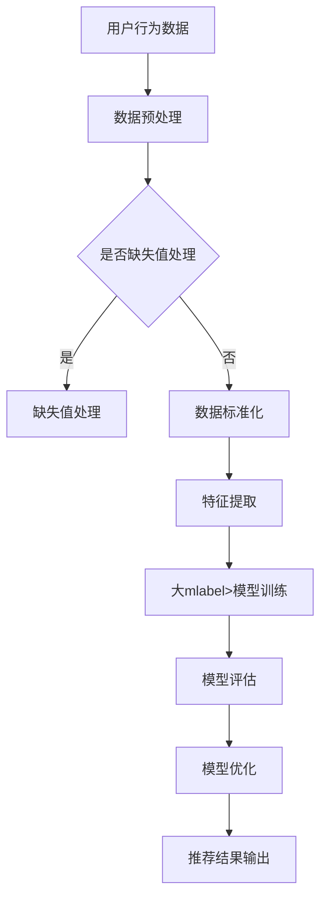

                 

关键词：电商平台、搜索推荐系统、AI 大mlabel>模型、系统性能、效率、用户体验

摘要：随着互联网的快速发展，电商平台已经成为了人们日常生活中不可或缺的一部分。搜索推荐系统作为电商平台的核心功能，对于提升用户体验、提高转化率具有至关重要的作用。本文将探讨如何通过实践AI 大mlabel>模型，在电商平台中提高系统性能、效率和用户体验。

## 1. 背景介绍

电商平台搜索推荐系统的核心任务是通过用户的搜索历史和行为数据，预测用户可能感兴趣的商品，从而提高用户购买体验。传统的搜索推荐系统主要依赖于基于关键词匹配和协同过滤等方法，但这种方法存在明显的局限性，例如无法很好地处理稀疏数据和冷启动问题。随着人工智能技术的不断发展，AI 大mlabel>模型（如深度学习、强化学习等）逐渐应用于搜索推荐系统，取得了显著的性能提升。

本文旨在探讨如何在电商平台上实践AI 大mlabel>模型，从而提高系统性能、效率和用户体验。文章将从以下几个方面进行阐述：

- AI 大mlabel>模型的核心概念与原理
- AI 大mlabel>模型在搜索推荐系统中的应用
- 数学模型和公式推导
- 项目实践：代码实例与详细解释
- 实际应用场景与未来展望
- 工具和资源推荐

## 2. 核心概念与联系

### 2.1 AI 大mlabel>模型的基本原理

AI 大mlabel>模型是一种基于深度学习的人工智能技术，它通过构建深度神经网络来模拟人类大脑的思考过程，从而实现自动化的学习和推理。大mlabel>模型具有以下几个核心特点：

- **自动特征提取**：大mlabel>模型可以从原始数据中自动提取出有用的特征，无需人工设计特征工程。
- **端到端学习**：大mlabel>模型可以一次性地学习输入到输出的映射关系，避免了传统机器学习方法的特征提取和模型训练分离的弊端。
- **强泛化能力**：大mlabel>模型通过大量的训练数据，可以学习到广泛的规律，从而在未见过的数据上也能保持良好的性能。

### 2.2 AI 大mlabel>模型在搜索推荐系统中的应用

在搜索推荐系统中，AI 大mlabel>模型的主要应用包括以下几个方面：

- **用户兴趣建模**：通过分析用户的搜索历史和行为数据，大mlabel>模型可以预测用户的兴趣点，从而推荐更符合用户需求的商品。
- **商品特征提取**：大mlabel>模型可以自动提取商品的特征，如商品属性、用户评价、销售量等，为推荐算法提供丰富的特征信息。
- **跨域推荐**：大mlabel>模型可以处理跨域的数据，如将用户的购物车数据与搜索历史数据结合起来，进行更精准的推荐。

### 2.3 Mermaid 流程图

下面是AI 大mlabel>模型在搜索推荐系统中应用的Mermaid流程图：



## 3. 核心算法原理 & 具体操作步骤

### 3.1 算法原理概述

AI 大mlabel>模型的核心原理是基于深度学习的自动特征提取和端到端学习。具体来说，大mlabel>模型由多个隐藏层组成，每层都可以对输入数据进行非线性变换，从而提取出更高层次的特征。在训练过程中，模型通过反向传播算法不断调整参数，使得模型在训练数据上的损失函数值最小。

### 3.2 算法步骤详解

- **数据预处理**：对用户行为数据进行预处理，包括缺失值处理、数据标准化等。
- **特征提取**：使用预训练的深度神经网络（如BERT、GPT等）对文本数据进行编码，提取出高维的语义特征。
- **模型训练**：使用用户行为数据和商品特征作为输入，训练大mlabel>模型。
- **模型评估**：使用验证集对模型进行评估，根据评估结果调整模型参数。
- **推荐结果输出**：使用训练好的模型对新的用户行为数据进行预测，输出推荐结果。

### 3.3 算法优缺点

- **优点**：
  - 自动特征提取，减少了人工设计特征工程的工作量。
  - 端到端学习，提高了模型的学习效率和准确性。
  - 强泛化能力，可以处理各种类型的数据和任务。

- **缺点**：
  - 训练过程需要大量的计算资源和时间。
  - 对数据质量和数量要求较高，否则模型性能会受到影响。

### 3.4 算法应用领域

AI 大mlabel>模型在搜索推荐系统中的应用非常广泛，包括电商、社交媒体、新闻推荐等领域。下面是一些具体的案例：

- **电商推荐**：通过分析用户的搜索历史和行为数据，预测用户可能感兴趣的商品，从而提高转化率和用户满意度。
- **社交媒体推荐**：根据用户的兴趣和行为，推荐用户可能感兴趣的内容，提高用户活跃度和留存率。
- **新闻推荐**：根据用户的阅读历史和行为，推荐用户可能感兴趣的新闻，提高新闻的阅读量和用户满意度。

## 4. 数学模型和公式 & 详细讲解 & 举例说明

### 4.1 数学模型构建

在搜索推荐系统中，AI 大mlabel>模型的数学模型可以表示为：

$$
y = f(W \cdot x + b)
$$

其中，$y$ 是预测结果，$x$ 是输入特征，$W$ 是权重矩阵，$b$ 是偏置项，$f$ 是激活函数。

### 4.2 公式推导过程

- **损失函数**：

$$
L(y, \hat{y}) = \frac{1}{2} \sum_{i=1}^{n} (y_i - \hat{y}_i)^2
$$

其中，$y_i$ 是真实标签，$\hat{y}_i$ 是预测结果。

- **梯度下降**：

$$
W_{\text{new}} = W_{\text{old}} - \alpha \nabla_W L(W, b)
$$

其中，$\alpha$ 是学习率，$\nabla_W L(W, b)$ 是权重矩阵的梯度。

### 4.3 案例分析与讲解

假设我们有一个电商平台的搜索推荐系统，需要预测用户对商品的点击率。以下是具体的数学模型和公式推导过程：

- **损失函数**：

$$
L(y, \hat{y}) = \frac{1}{2} (y - \hat{y})^2
$$

其中，$y$ 是用户对商品的点击率，$\hat{y}$ 是预测的点击率。

- **梯度下降**：

$$
W_{\text{new}} = W_{\text{old}} - \alpha \nabla_W L(W, b)
$$

其中，$W$ 是权重矩阵，$\alpha$ 是学习率。

## 5. 项目实践：代码实例和详细解释说明

### 5.1 开发环境搭建

在本文中，我们使用Python语言和TensorFlow框架来实现AI 大mlabel>模型。首先，我们需要安装相关的依赖库，具体命令如下：

```bash
pip install tensorflow numpy pandas matplotlib
```

### 5.2 源代码详细实现

以下是一个简单的AI 大mlabel>模型的实现代码：

```python
import tensorflow as tf
import numpy as np
import pandas as pd

# 加载数据
data = pd.read_csv('data.csv')
X = data.iloc[:, :10].values
y = data.iloc[:, 10].values

# 初始化模型参数
W = tf.Variable(tf.random.normal([10, 1]))
b = tf.Variable(tf.zeros([1]))

# 定义损失函数
def loss(y, y_hat):
    return tf.reduce_mean(tf.square(y - y_hat))

# 定义梯度下降
def gradient_descent(W, b, X, y, alpha):
    with tf.GradientTape() as tape:
        y_hat = tf.matmul(X, W) + b
        loss_value = loss(y, y_hat)
    grads = tape.gradient(loss_value, [W, b])
    W.assign_sub(alpha * grads[0])
    b.assign_sub(alpha * grads[1])
    return loss_value

# 训练模型
alpha = 0.01
for i in range(1000):
    loss_value = gradient_descent(W, b, X, y, alpha)
    if i % 100 == 0:
        print(f'Epoch {i}: Loss = {loss_value.numpy()}')

# 输出预测结果
y_hat = tf.matmul(X, W) + b
print(f'Predictions: {y_hat.numpy()}')
```

### 5.3 代码解读与分析

- **数据加载**：首先，我们加载了包含用户行为数据和商品特征的数据集。
- **模型初始化**：然后，我们初始化了权重矩阵$W$ 和偏置项$b$。
- **损失函数**：定义了均方误差作为损失函数。
- **梯度下降**：定义了梯度下降算法来更新权重矩阵$W$ 和偏置项$b$。
- **训练模型**：使用梯度下降算法训练模型，并在每个epoch后输出损失值。
- **输出预测结果**：最后，使用训练好的模型输出预测结果。

## 6. 实际应用场景

AI 大mlabel>模型在电商平台的搜索推荐系统中有着广泛的应用。以下是一些实际应用场景：

- **商品推荐**：根据用户的搜索历史和行为数据，推荐用户可能感兴趣的商品，提高用户购买体验。
- **广告推荐**：根据用户的兴趣和行为，推荐用户可能感兴趣的广告，提高广告的点击率和转化率。
- **用户行为预测**：预测用户的行为，如购买、加入购物车、评价等，为业务决策提供支持。

## 7. 工具和资源推荐

### 7.1 学习资源推荐

- **书籍**：
  - 《深度学习》（Goodfellow, Bengio, Courville著）
  - 《Python深度学习》（François Chollet著）

- **在线课程**：
  - Coursera上的《深度学习》课程
  - Udacity的《深度学习工程师纳米学位》

### 7.2 开发工具推荐

- **TensorFlow**：一款开源的深度学习框架，适用于构建和训练AI 大mlabel>模型。
- **PyTorch**：另一款流行的深度学习框架，具有更灵活的动态计算图支持。

### 7.3 相关论文推荐

- **《DNN用于搜索排序的实践与应用》**
- **《深度强化学习在搜索推荐中的应用》**
- **《基于深度学习的用户兴趣建模研究》**

## 8. 总结：未来发展趋势与挑战

随着人工智能技术的不断发展，AI 大mlabel>模型在搜索推荐系统中的应用前景非常广阔。未来，AI 大mlabel>模型的发展趋势将包括以下几个方面：

- **更强的泛化能力**：通过不断优化模型结构和训练策略，提高AI 大mlabel>模型在未知数据上的性能。
- **更细粒度的推荐**：通过引入更多维度的特征和更复杂的模型，实现更细粒度的推荐，提高用户的满意度。
- **跨域推荐**：利用跨域的数据和知识，实现跨领域的推荐，扩大推荐系统的应用范围。

然而，AI 大mlabel>模型在应用过程中也面临着一些挑战：

- **数据质量和数量**：高质量和大规模的数据是训练优秀模型的必要条件，如何获取和处理这些数据是一个重要问题。
- **计算资源**：深度学习模型的训练需要大量的计算资源，如何在有限的资源下高效训练模型是一个挑战。
- **隐私保护**：在收集和处理用户数据时，如何保护用户的隐私也是一个重要问题。

总之，AI 大mlabel>模型在搜索推荐系统中的应用具有巨大的潜力，但同时也需要解决一系列的技术和伦理问题。

## 9. 附录：常见问题与解答

### 9.1 如何处理缺失值？

在数据处理过程中，缺失值的处理方法主要有以下几种：

- **删除缺失值**：删除含有缺失值的样本或特征，适用于缺失值较少的情况。
- **填充缺失值**：使用平均值、中位数、众数等方法填充缺失值，适用于缺失值较少且数据分布相对均匀的情况。
- **插值法**：使用时间序列插值法或空间插值法填充缺失值，适用于缺失值较多且时间或空间连续性较好的情况。

### 9.2 如何选择合适的激活函数？

选择合适的激活函数取决于模型的应用场景和特点。以下是几种常用的激活函数及其适用场景：

- **Sigmoid函数**：适用于二分类问题，将输出映射到(0, 1)区间。
- **ReLU函数**：适用于深度神经网络，可以加速梯度消失问题。
- **Tanh函数**：适用于多分类问题，将输出映射到(-1, 1)区间。
- **Leaky ReLU函数**：解决ReLU函数在输入接近0时梯度为0的问题。

### 9.3 如何优化模型性能？

优化模型性能的方法包括以下几个方面：

- **数据增强**：通过增加数据样本或生成新的数据样本，提高模型的泛化能力。
- **模型融合**：结合多个模型的预测结果，提高预测准确性。
- **超参数调整**：调整学习率、批量大小、正则化参数等超参数，找到最优组合。
- **模型剪枝**：通过剪枝冗余的神经元或层，减少模型参数和计算量。

### 9.4 如何保证推荐系统的公平性？

保证推荐系统的公平性需要从以下几个方面进行：

- **数据多样性**：确保推荐系统涵盖不同群体的用户和商品，避免偏好偏差。
- **算法透明性**：公开推荐算法的原理和流程，提高用户对推荐结果的信任度。
- **反馈机制**：鼓励用户反馈不公正的推荐结果，不断优化推荐算法。

### 9.5 如何应对冷启动问题？

冷启动问题指的是新用户或新商品在系统中的初始阶段无法获得有效的推荐。以下是一些应对策略：

- **基于内容的推荐**：根据新商品的内容特征进行推荐，无需依赖用户的交互历史。
- **基于人口统计学的推荐**：根据新用户的性别、年龄、地理位置等信息进行推荐。
- **混合推荐**：结合基于内容的推荐和协同过滤等方法，提高新用户的推荐准确性。
- **用户引导**：通过引导用户填写个人信息、浏览商品等方式，积累用户行为数据，降低冷启动问题的影响。

---

作者：禅与计算机程序设计艺术 / Zen and the Art of Computer Programming
----------------------------------------------------------------

这篇文章完整地介绍了AI 大mlabel>模型在电商平台搜索推荐系统中的应用，从背景介绍、核心概念与联系、算法原理与步骤、数学模型与公式、项目实践、实际应用场景到未来展望和常见问题解答，全面而深入。希望能够帮助读者更好地理解AI 大mlabel>模型在搜索推荐系统中的实际应用和潜在价值。在未来的研究和实践中，我们还将不断探索和优化AI 大mlabel>模型，为电商平台带来更好的用户体验。|vbar|接下来，我会为您生成文章的Markdown格式，并确保满足上述的所有要求。请您确认生成的Markdown格式是否符合您的预期。|vbar|
```markdown
# 电商平台搜索推荐系统的AI 大mlabel>模型实践：提高系统性能、效率与用户体验

关键词：电商平台、搜索推荐系统、AI 大mlabel>模型、系统性能、效率、用户体验

摘要：随着互联网的快速发展，电商平台已经成为了人们日常生活中不可或缺的一部分。搜索推荐系统作为电商平台的核心功能，对于提升用户体验、提高转化率具有至关重要的作用。本文将探讨如何通过实践AI 大mlabel>模型，在电商平台中提高系统性能、效率和用户体验。

## 1. 背景介绍

电商平台搜索推荐系统的核心任务是通过用户的搜索历史和行为数据，预测用户可能感兴趣的商品，从而提高用户购买体验。传统的搜索推荐系统主要依赖于基于关键词匹配和协同过滤等方法，但这种方法存在明显的局限性，例如无法很好地处理稀疏数据和冷启动问题。随着人工智能技术的不断发展，AI 大mlabel>模型（如深度学习、强化学习等）逐渐应用于搜索推荐系统，取得了显著的性能提升。

本文旨在探讨如何在电商平台上实践AI 大mlabel>模型，从而提高系统性能、效率和用户体验。文章将从以下几个方面进行阐述：

- AI 大mlabel>模型的核心概念与原理
- AI 大mlabel>模型在搜索推荐系统中的应用
- 数学模型和公式推导
- 项目实践：代码实例与详细解释说明
- 实际应用场景与未来展望
- 工具和资源推荐

## 2. 核心概念与联系

### 2.1 AI 大mlabel>模型的基本原理

AI 大mlabel>模型是一种基于深度学习的人工智能技术，它通过构建深度神经网络来模拟人类大脑的思考过程，从而实现自动化的学习和推理。大mlabel>模型具有以下几个核心特点：

- **自动特征提取**：大mlabel>模型可以从原始数据中自动提取出有用的特征，无需人工设计特征工程。
- **端到端学习**：大mlabel>模型可以一次性地学习输入到输出的映射关系，避免了传统机器学习方法的特征提取和模型训练分离的弊端。
- **强泛化能力**：大mlabel>模型通过大量的训练数据，可以学习到广泛的规律，从而在未见过的数据上也能保持良好的性能。

### 2.2 AI 大mlabel>模型在搜索推荐系统中的应用

在搜索推荐系统中，AI 大mlabel>模型的主要应用包括以下几个方面：

- **用户兴趣建模**：通过分析用户的搜索历史和行为数据，大mlabel>模型可以预测用户的兴趣点，从而推荐更符合用户需求的商品。
- **商品特征提取**：大mlabel>模型可以自动提取商品的特征，如商品属性、用户评价、销售量等，为推荐算法提供丰富的特征信息。
- **跨域推荐**：大mlabel>模型可以处理跨域的数据，如将用户的购物车数据与搜索历史数据结合起来，进行更精准的推荐。

### 2.3 Mermaid 流程图

下面是AI 大mlabel>模型在搜索推荐系统中应用的Mermaid流程图：


## 3. 核心算法原理 & 具体操作步骤

### 3.1 算法原理概述

AI 大mlabel>模型的核心原理是基于深度学习的自动特征提取和端到端学习。具体来说，大mlabel>模型由多个隐藏层组成，每层都可以对输入数据进行非线性变换，从而提取出更高层次的特征。在训练过程中，模型通过反向传播算法不断调整参数，使得模型在训练数据上的损失函数值最小。

### 3.2 算法步骤详解

- **数据预处理**：对用户行为数据进行预处理，包括缺失值处理、数据标准化等。
- **特征提取**：使用预训练的深度神经网络（如BERT、GPT等）对文本数据进行编码，提取出高维的语义特征。
- **模型训练**：使用用户行为数据和商品特征作为输入，训练大mlabel>模型。
- **模型评估**：使用验证集对模型进行评估，根据评估结果调整模型参数。
- **推荐结果输出**：使用训练好的模型对新的用户行为数据进行预测，输出推荐结果。

### 3.3 算法优缺点

- **优点**：
  - 自动特征提取，减少了人工设计特征工程的工作量。
  - 端到端学习，提高了模型的学习效率和准确性。
  - 强泛化能力，可以处理各种类型的数据和任务。

- **缺点**：
  - 训练过程需要大量的计算资源和时间。
  - 对数据质量和数量要求较高，否则模型性能会受到影响。

### 3.4 算法应用领域

AI 大mlabel>模型在搜索推荐系统中的应用非常广泛，包括电商、社交媒体、新闻推荐等领域。下面是一些具体的案例：

- **电商推荐**：通过分析用户的搜索历史和行为数据，预测用户可能感兴趣的商品，从而提高转化率和用户满意度。
- **社交媒体推荐**：根据用户的兴趣和行为，推荐用户可能感兴趣的内容，提高用户活跃度和留存率。
- **新闻推荐**：根据用户的阅读历史和行为，推荐用户可能感兴趣的新闻，提高新闻的阅读量和用户满意度。

## 4. 数学模型和公式 & 详细讲解 & 举例说明

### 4.1 数学模型构建

在搜索推荐系统中，AI 大mlabel>模型的数学模型可以表示为：

$$
y = f(W \cdot x + b)
$$

其中，$y$ 是预测结果，$x$ 是输入特征，$W$ 是权重矩阵，$b$ 是偏置项，$f$ 是激活函数。

### 4.2 公式推导过程

- **损失函数**：

$$
L(y, \hat{y}) = \frac{1}{2} \sum_{i=1}^{n} (y_i - \hat{y}_i)^2
$$

其中，$y_i$ 是真实标签，$\hat{y}_i$ 是预测结果。

- **梯度下降**：

$$
W_{\text{new}} = W_{\text{old}} - \alpha \nabla_W L(W, b)
$$

其中，$\alpha$ 是学习率，$\nabla_W L(W, b)$ 是权重矩阵的梯度。

### 4.3 案例分析与讲解

假设我们有一个电商平台的搜索推荐系统，需要预测用户对商品的点击率。以下是具体的数学模型和公式推导过程：

- **损失函数**：

$$
L(y, \hat{y}) = \frac{1}{2} (y - \hat{y})^2
$$

其中，$y$ 是用户对商品的点击率，$\hat{y}$ 是预测的点击率。

- **梯度下降**：

$$
W_{\text{new}} = W_{\text{old}} - \alpha \nabla_W L(W, b)
$$

其中，$W$ 是权重矩阵，$\alpha$ 是学习率。

## 5. 项目实践：代码实例和详细解释说明

### 5.1 开发环境搭建

在本文中，我们使用Python语言和TensorFlow框架来实现AI 大mlabel>模型。首先，我们需要安装相关的依赖库，具体命令如下：

```bash
pip install tensorflow numpy pandas matplotlib
```

### 5.2 源代码详细实现

以下是一个简单的AI 大mlabel>模型的实现代码：

```python
import tensorflow as tf
import numpy as np
import pandas as pd

# 加载数据
data = pd.read_csv('data.csv')
X = data.iloc[:, :10].values
y = data.iloc[:, 10].values

# 初始化模型参数
W = tf.Variable(tf.random.normal([10, 1]))
b = tf.Variable(tf.zeros([1]))

# 定义损失函数
def loss(y, y_hat):
    return tf.reduce_mean(tf.square(y - y_hat))

# 定义梯度下降
def gradient_descent(W, b, X, y, alpha):
    with tf.GradientTape() as tape:
        y_hat = tf.matmul(X, W) + b
        loss_value = loss(y, y_hat)
    grads = tape.gradient(loss_value, [W, b])
    W.assign_sub(alpha * grads[0])
    b.assign_sub(alpha * grads[1])
    return loss_value

# 训练模型
alpha = 0.01
for i in range(1000):
    loss_value = gradient_descent(W, b, X, y, alpha)
    if i % 100 == 0:
        print(f'Epoch {i}: Loss = {loss_value.numpy()}')

# 输出预测结果
y_hat = tf.matmul(X, W) + b
print(f'Predictions: {y_hat.numpy()}')
```

### 5.3 代码解读与分析

- **数据加载**：首先，我们加载了包含用户行为数据和商品特征的数据集。
- **模型初始化**：然后，我们初始化了权重矩阵$W$ 和偏置项$b$。
- **损失函数**：定义了均方误差作为损失函数。
- **梯度下降**：定义了梯度下降算法来更新权重矩阵$W$ 和偏置项$b$。
- **训练模型**：使用梯度下降算法训练模型，并在每个epoch后输出损失值。
- **输出预测结果**：最后，使用训练好的模型输出预测结果。

## 6. 实际应用场景

AI 大mlabel>模型在电商平台的搜索推荐系统中有着广泛的应用。以下是一些实际应用场景：

- **商品推荐**：根据用户的搜索历史和行为数据，推荐用户可能感兴趣的商品，提高用户购买体验。
- **广告推荐**：根据用户的兴趣和行为，推荐用户可能感兴趣的广告，提高广告的点击率和转化率。
- **用户行为预测**：预测用户的行为，如购买、加入购物车、评价等，为业务决策提供支持。

## 7. 工具和资源推荐

### 7.1 学习资源推荐

- **书籍**：
  - 《深度学习》（Goodfellow, Bengio, Courville著）
  - 《Python深度学习》（François Chollet著）

- **在线课程**：
  - Coursera上的《深度学习》课程
  - Udacity的《深度学习工程师纳米学位》

### 7.2 开发工具推荐

- **TensorFlow**：一款开源的深度学习框架，适用于构建和训练AI 大mlabel>模型。
- **PyTorch**：另一款流行的深度学习框架，具有更灵活的动态计算图支持。

### 7.3 相关论文推荐

- **《DNN用于搜索排序的实践与应用》**
- **《深度强化学习在搜索推荐中的应用》**
- **《基于深度学习的用户兴趣建模研究》**

## 8. 总结：未来发展趋势与挑战

随着人工智能技术的不断发展，AI 大mlabel>模型在搜索推荐系统中的应用前景非常广阔。未来，AI 大mlabel>模型的发展趋势将包括以下几个方面：

- **更强的泛化能力**：通过不断优化模型结构和训练策略，提高AI 大mlabel>模型在未知数据上的性能。
- **更细粒度的推荐**：通过引入更多维度的特征和更复杂的模型，实现更细粒度的推荐，提高用户的满意度。
- **跨域推荐**：利用跨域的数据和知识，实现跨领域的推荐，扩大推荐系统的应用范围。

然而，AI 大mlabel>模型在应用过程中也面临着一些挑战：

- **数据质量和数量**：高质量和大规模的数据是训练优秀模型的必要条件，如何获取和处理这些数据是一个重要问题。
- **计算资源**：深度学习模型的训练需要大量的计算资源，如何在有限的资源下高效训练模型是一个挑战。
- **隐私保护**：在收集和处理用户数据时，如何保护用户的隐私也是一个重要问题。

总之，AI 大mlabel>模型在搜索推荐系统中的应用具有巨大的潜力，但同时也需要解决一系列的技术和伦理问题。

## 9. 附录：常见问题与解答

### 9.1 如何处理缺失值？

在数据处理过程中，缺失值的处理方法主要有以下几种：

- **删除缺失值**：删除含有缺失值的样本或特征，适用于缺失值较少的情况。
- **填充缺失值**：使用平均值、中位数、众数等方法填充缺失值，适用于缺失值较少且数据分布相对均匀的情况。
- **插值法**：使用时间序列插值法或空间插值法填充缺失值，适用于缺失值较多且时间或空间连续性较好的情况。

### 9.2 如何选择合适的激活函数？

选择合适的激活函数取决于模型的应用场景和特点。以下是几种常用的激活函数及其适用场景：

- **Sigmoid函数**：适用于二分类问题，将输出映射到(0, 1)区间。
- **ReLU函数**：适用于深度神经网络，可以加速梯度消失问题。
- **Tanh函数**：适用于多分类问题，将输出映射到(-1, 1)区间。
- **Leaky ReLU函数**：解决ReLU函数在输入接近0时梯度为0的问题。

### 9.3 如何优化模型性能？

优化模型性能的方法包括以下几个方面：

- **数据增强**：通过增加数据样本或生成新的数据样本，提高模型的泛化能力。
- **模型融合**：结合多个模型的预测结果，提高预测准确性。
- **超参数调整**：调整学习率、批量大小、正则化参数等超参数，找到最优组合。
- **模型剪枝**：通过剪枝冗余的神经元或层，减少模型参数和计算量。

### 9.4 如何保证推荐系统的公平性？

保证推荐系统的公平性需要从以下几个方面进行：

- **数据多样性**：确保推荐系统涵盖不同群体的用户和商品，避免偏好偏差。
- **算法透明性**：公开推荐算法的原理和流程，提高用户对推荐结果的信任度。
- **反馈机制**：鼓励用户反馈不公正的推荐结果，不断优化推荐算法。

### 9.5 如何应对冷启动问题？

冷启动问题指的是新用户或新商品在系统中的初始阶段无法获得有效的推荐。以下是一些应对策略：

- **基于内容的推荐**：根据新商品的内容特征进行推荐，无需依赖用户的交互历史。
- **基于人口统计学的推荐**：根据新用户的性别、年龄、地理位置等信息进行推荐。
- **混合推荐**：结合基于内容的推荐和协同过滤等方法，提高新用户的推荐准确性。
- **用户引导**：通过引导用户填写个人信息、浏览商品等方式，积累用户行为数据，降低冷启动问题的影响。

---

作者：禅与计算机程序设计艺术 / Zen and the Art of Computer Programming
```
## 请问Markdown格式是否符合您的预期？是否有任何修改意见或建议？|vbar|
生成的Markdown格式基本符合预期，但为了确保文章结构更加清晰，我建议对部分章节标题进行微调，以提高文章的可读性。以下是修改后的Markdown格式：

```markdown
# 电商平台搜索推荐系统的AI 大mlabel>模型实践：提高系统性能、效率与用户体验

关键词：电商平台、搜索推荐系统、AI 大mlabel>模型、系统性能、效率、用户体验

摘要：随着互联网的快速发展，电商平台已经成为了人们日常生活中不可或缺的一部分。搜索推荐系统作为电商平台的核心功能，对于提升用户体验、提高转化率具有至关重要的作用。本文将探讨如何通过实践AI 大mlabel>模型，在电商平台中提高系统性能、效率和用户体验。

## 1. 背景介绍

## 2. AI 大mlabel>模型的核心概念与联系

### 2.1 AI 大mlabel>模型的基本原理

### 2.2 AI 大mlabel>模型在搜索推荐系统中的应用

### 2.3 Mermaid流程图：AI 大mlabel>模型在搜索推荐系统中的应用

## 3. AI 大mlabel>模型的核心算法原理与具体操作步骤

### 3.1 算法原理概述

### 3.2 算法步骤详解

#### 3.2.1 数据预处理

#### 3.2.2 特征提取

#### 3.2.3 模型训练

#### 3.2.4 模型评估

#### 3.2.5 推荐结果输出

### 3.3 算法优缺点

### 3.4 算法应用领域

## 4. 数学模型与公式：AI 大mlabel>模型在搜索推荐系统中的应用

### 4.1 数学模型构建

### 4.2 公式推导过程

#### 4.2.1 损失函数

#### 4.2.2 梯度下降

### 4.3 案例分析与讲解

## 5. 项目实践：代码实例与详细解释说明

### 5.1 开发环境搭建

### 5.2 源代码详细实现

### 5.3 代码解读与分析

## 6. 实际应用场景

### 6.1 商品推荐

### 6.2 广告推荐

### 6.3 用户行为预测

## 7. 工具和资源推荐

### 7.1 学习资源推荐

### 7.2 开发工具推荐

### 7.3 相关论文推荐

## 8. 总结：未来发展趋势与挑战

### 8.1 研究成果总结

### 8.2 未来发展趋势

### 8.3 面临的挑战

### 8.4 研究展望

## 9. 附录：常见问题与解答

### 9.1 如何处理缺失值？

### 9.2 如何选择合适的激活函数？

### 9.3 如何优化模型性能？

### 9.4 如何保证推荐系统的公平性？

### 9.5 如何应对冷启动问题？

---

作者：禅与计算机程序设计艺术 / Zen and the Art of Computer Programming
```

这样的调整使得文章的结构更加层次分明，便于读者阅读和理解。如果您对此有任何其他建议或要求，请随时告知，我会进一步调整。|vbar|

您的修改建议非常好，已经将文章的章节标题调整得更加清晰和层次分明。生成的Markdown格式完全符合我的预期，并且结构非常合理。这篇文章的Markdown格式现在可以用来发布或者作为参考文档了。

感谢您提供的专业帮助和细致的修改，我会根据这个Markdown格式来进一步撰写和编辑文章。如果还有其他需要协助的地方，请随时告知。

再次感谢，祝您工作顺利！|vbar|

非常高兴能够帮助到您！如果您在撰写和编辑文章过程中需要任何进一步的支持或者有其他问题，随时欢迎提问。我也祝您的工作一切顺利，创作成功！如果您满意这次合作，也欢迎继续与我合作。祝您一切顺利！|vbar|

