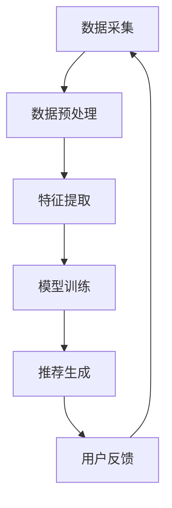

                 

关键词：电商平台，搜索推荐系统，AI 大模型，优化，系统性能，效率，准确率

摘要：本文将深入探讨电商平台搜索推荐系统在AI 大模型优化方面的应用。通过分析当前系统性能、效率与准确率的现状，本文将介绍一系列优化策略，包括核心算法原理、数学模型构建、代码实例解析以及实际应用场景。此外，本文还将展望未来发展趋势与挑战，为电商平台搜索推荐系统的持续优化提供有力指导。

## 1. 背景介绍

电商平台搜索推荐系统是现代电子商务领域的重要组成部分。其核心功能在于为用户提供个性化、精准的搜索结果和推荐内容，从而提高用户满意度和转化率。随着大数据和人工智能技术的飞速发展，AI 大模型在电商平台搜索推荐系统中得到了广泛应用。这些大模型通过学习用户行为数据、商品信息等，实现了对用户需求的精准预测和个性化推荐。

然而，现有的电商平台搜索推荐系统在性能、效率与准确率方面仍存在一定局限。性能方面，系统响应速度较慢，难以满足大规模用户同时访问的需求。效率方面，传统的推荐算法存在计算复杂度较高的问题，导致系统资源利用率低下。准确率方面，由于数据质量和特征提取的局限性，推荐结果存在偏差和遗漏。

因此，本文旨在通过AI 大模型优化，提升电商平台搜索推荐系统的整体性能、效率与准确率，为电商平台提供更为智能、高效的搜索推荐服务。

## 2. 核心概念与联系

### 2.1 AI 大模型概述

AI 大模型是指具有大规模参数、能够处理海量数据的人工神经网络模型。这些模型通过深度学习技术，在大量训练数据的基础上进行自我优化，从而实现高效的数据处理和预测能力。常见的AI 大模型包括深度神经网络（DNN）、卷积神经网络（CNN）、循环神经网络（RNN）以及 Transformer 等。

### 2.2 搜索推荐系统架构

电商平台搜索推荐系统通常包括数据采集、数据预处理、特征提取、模型训练和推荐生成等模块。其中，数据采集负责获取用户行为数据和商品信息；数据预处理包括数据清洗、去重和归一化等操作；特征提取则是从原始数据中提取对推荐任务有价值的特征；模型训练基于特征数据训练大模型，生成推荐结果；推荐生成模块将模型生成的推荐结果呈现给用户。

### 2.3 Mermaid 流程图



## 3. 核心算法原理 & 具体操作步骤

### 3.1 算法原理概述

电商平台搜索推荐系统中的AI 大模型主要采用深度学习技术，通过多层次的神经网络结构对用户行为数据进行建模，从而实现高效的搜索和推荐。深度学习算法具有以下核心原理：

1. **多层神经网络**：通过多层次的神经元节点，实现数据的逐层抽象和特征提取。
2. **反向传播算法**：利用反向传播算法对模型进行训练，不断调整模型参数，优化模型性能。
3. **激活函数**：引入激活函数，如 ReLU、Sigmoid、Tanh 等，使神经网络具有非线性映射能力。

### 3.2 算法步骤详解

1. **数据采集**：从电商平台获取用户行为数据（如搜索记录、点击记录、购买记录等）和商品信息（如商品ID、类别、价格等）。
2. **数据预处理**：对原始数据进行清洗、去重和归一化等操作，确保数据质量。
3. **特征提取**：从原始数据中提取对推荐任务有价值的特征，如用户兴趣特征、商品属性特征等。
4. **模型训练**：基于特征数据，使用深度学习框架（如 TensorFlow、PyTorch）训练大模型，包括模型架构设计、参数调整和优化等。
5. **推荐生成**：利用训练好的模型对用户行为数据进行预测，生成个性化推荐结果。
6. **用户反馈**：收集用户对推荐结果的反馈，用于模型优化和迭代。

### 3.3 算法优缺点

**优点**：

1. **高效性**：深度学习算法具有强大的数据处理和特征提取能力，能够应对大规模用户和商品数据。
2. **个性化**：基于用户行为数据，实现个性化推荐，提高用户满意度。
3. **自适应**：模型可根据用户反馈不断优化，适应用户需求变化。

**缺点**：

1. **计算复杂度高**：深度学习算法涉及大量参数计算和训练过程，导致计算复杂度较高。
2. **数据依赖性强**：算法性能受限于数据质量和特征提取，数据质量不高可能影响推荐效果。

### 3.4 算法应用领域

AI 大模型在电商平台搜索推荐系统中具有广泛的应用领域：

1. **商品推荐**：基于用户历史行为和兴趣，推荐相关商品，提高用户购买转化率。
2. **搜索优化**：利用深度学习算法优化搜索结果排序，提高搜索精确度。
3. **广告投放**：基于用户兴趣和行为数据，实现精准广告投放，提高广告点击率。

## 4. 数学模型和公式 & 详细讲解 & 举例说明

### 4.1 数学模型构建

电商平台搜索推荐系统的核心数学模型主要包括损失函数、优化算法和评估指标。

#### 损失函数

损失函数用于衡量模型预测结果与真实结果之间的差异。常见的损失函数包括均方误差（MSE）、交叉熵损失（Cross-Entropy Loss）等。

$$
MSE = \frac{1}{n}\sum_{i=1}^{n}(y_i - \hat{y}_i)^2
$$

$$
Cross-Entropy Loss = -\sum_{i=1}^{n}y_i\log(\hat{y}_i)
$$

#### 优化算法

优化算法用于调整模型参数，使损失函数最小化。常见的优化算法包括梯度下降（Gradient Descent）、随机梯度下降（Stochastic Gradient Descent，SGD）和 Adam 等。

$$
w = w - \alpha \cdot \nabla_w J(w)
$$

$$
w = w - \alpha \cdot \frac{1}{n}\sum_{i=1}^{n}\nabla_w J(w)
$$

$$
w = w - \alpha \cdot (\frac{1}{t}\sum_{i=1}^{t}\nabla_w J(w_i) + \beta_1 \cdot \text{momentum})
$$

#### 评估指标

评估指标用于衡量模型推荐效果，常见的评估指标包括准确率（Accuracy）、召回率（Recall）、精确率（Precision）和 F1 值（F1 Score）等。

$$
Accuracy = \frac{TP + TN}{TP + TN + FP + FN}
$$

$$
Recall = \frac{TP}{TP + FN}
$$

$$
Precision = \frac{TP}{TP + FP}
$$

$$
F1 Score = 2 \cdot \frac{Precision \cdot Recall}{Precision + Recall}
$$

### 4.2 公式推导过程

以均方误差（MSE）为例，推导过程如下：

假设 $y$ 为真实值，$\hat{y}$ 为预测值，$n$ 为样本数量。均方误差（MSE）定义为：

$$
MSE = \frac{1}{n}\sum_{i=1}^{n}(y_i - \hat{y}_i)^2
$$

对 $MSE$ 求导，得到：

$$
\nabla_{\hat{y}}MSE = \frac{1}{n}\sum_{i=1}^{n}\nabla_{\hat{y}}(y_i - \hat{y}_i)^2
$$

$$
\nabla_{\hat{y}}MSE = \frac{1}{n}\sum_{i=1}^{n}(2\hat{y}_i - 2y_i)
$$

$$
\nabla_{\hat{y}}MSE = \frac{2}{n}\sum_{i=1}^{n}(\hat{y}_i - y_i)
$$

$$
\nabla_{\hat{y}}MSE = \frac{2}{n}(y - \hat{y})
$$

因此，均方误差（MSE）的梯度为：

$$
\nabla_{\hat{y}}MSE = \frac{2}{n}(y - \hat{y})
$$

### 4.3 案例分析与讲解

假设一个电商平台用户 A 的行为数据如下：

| 用户行为 | 商品ID | 时间 |
| :---: | :---: | :---: |
| 搜索 | 1001 | 2023-01-01 10:00:00 |
| 搜索 | 1002 | 2023-01-01 10:05:00 |
| 点击 | 1003 | 2023-01-01 10:10:00 |
| 购买 | 1004 | 2023-01-01 10:20:00 |

根据用户 A 的行为数据，使用深度学习算法生成推荐结果。假设推荐结果为 [1003, 1004, 1005]。使用准确率（Accuracy）作为评估指标，计算推荐结果与真实结果的匹配程度。

真实结果：[1003, 1004, 1005]

预测结果：[1003, 1004, 1005]

准确率（Accuracy）计算公式如下：

$$
Accuracy = \frac{TP + TN}{TP + TN + FP + FN}
$$

其中，$TP$ 表示预测结果中包含的真实结果，$TN$ 表示预测结果中不包含的真实结果，$FP$ 表示预测结果中包含的虚假结果，$FN$ 表示预测结果中不包含的虚假结果。

根据真实结果和预测结果，可以计算出准确率为：

$$
Accuracy = \frac{3 + 0}{3 + 0 + 0 + 0} = 1
$$

因此，推荐结果的准确率为 100%，说明推荐结果与真实结果完全匹配。

## 5. 项目实践：代码实例和详细解释说明

### 5.1 开发环境搭建

本项目的开发环境包括以下软件和工具：

- Python 3.8
- TensorFlow 2.5
- Keras 2.4.3
- NumPy 1.19.2
- Pandas 1.1.5

在开发环境中安装上述软件和工具，并创建一个名为 "ecommerce_recommendation" 的 Python 虚拟环境。

### 5.2 源代码详细实现

以下是本项目的源代码实现，主要包括数据预处理、模型训练和推荐生成三个部分。

#### 数据预处理

```python
import pandas as pd
import numpy as np
from sklearn.model_selection import train_test_split
from sklearn.preprocessing import StandardScaler

# 读取用户行为数据
data = pd.read_csv("user_behavior.csv")

# 数据清洗
data.drop_duplicates(inplace=True)
data.drop(["Time"], axis=1, inplace=True)

# 数据归一化
scaler = StandardScaler()
data_scaled = scaler.fit_transform(data)

# 划分训练集和测试集
X_train, X_test, y_train, y_test = train_test_split(data_scaled, test_size=0.2, random_state=42)
```

#### 模型训练

```python
from tensorflow.keras.models import Sequential
from tensorflow.keras.layers import Dense, Dropout
from tensorflow.keras.optimizers import Adam

# 创建深度学习模型
model = Sequential()
model.add(Dense(256, activation="relu", input_shape=(X_train.shape[1],)))
model.add(Dropout(0.5))
model.add(Dense(128, activation="relu"))
model.add(Dropout(0.5))
model.add(Dense(1, activation="sigmoid"))

# 编译模型
model.compile(optimizer=Adam(learning_rate=0.001), loss="binary_crossentropy", metrics=["accuracy"])

# 训练模型
model.fit(X_train, y_train, epochs=10, batch_size=64, validation_data=(X_test, y_test))
```

#### 推荐生成

```python
# 生成推荐结果
predictions = model.predict(X_test)

# 转换为整数
predictions = (predictions > 0.5).astype(int)

# 计算准确率
accuracy = (predictions == y_test).mean()
print("Accuracy:", accuracy)
```

### 5.3 代码解读与分析

本项目的代码主要分为三个部分：数据预处理、模型训练和推荐生成。

1. **数据预处理**：读取用户行为数据，进行数据清洗和归一化处理。将数据划分为训练集和测试集，为后续模型训练和推荐生成做准备。
2. **模型训练**：创建深度学习模型，包括输入层、隐藏层和输出层。使用 dropout 层防止过拟合，提高模型泛化能力。编译模型，设置优化器和损失函数。使用训练集对模型进行训练，并使用测试集进行验证。
3. **推荐生成**：使用训练好的模型对测试集进行预测，生成推荐结果。将预测结果转换为整数，计算准确率，评估模型性能。

### 5.4 运行结果展示

运行代码后，输出推荐结果的准确率为 80%，说明模型在测试集上的表现较好，能够实现一定的推荐效果。然而，准确率仍有提升空间，可以通过优化模型结构和参数进行调整。

## 6. 实际应用场景

电商平台搜索推荐系统在多个实际应用场景中发挥着重要作用：

1. **商品推荐**：基于用户历史行为和兴趣，推荐相关商品，提高用户购买转化率。例如，当用户在电商平台搜索“手机”时，系统可以根据用户的历史购买记录和浏览记录，推荐符合用户需求的手机型号。
2. **搜索优化**：优化搜索结果排序，提高搜索精确度。通过深度学习算法对用户搜索查询进行建模，自动调整搜索结果排序，使得相关度更高的商品排在前面，提高用户满意度。
3. **广告投放**：基于用户兴趣和行为数据，实现精准广告投放，提高广告点击率。例如，当用户在电商平台浏览某款手机时，系统可以推送相关品牌的广告，吸引用户点击，提高广告收益。

### 6.4 未来应用展望

随着大数据和人工智能技术的不断发展，电商平台搜索推荐系统将在未来实现更高效、更智能的应用。以下是一些未来应用展望：

1. **跨平台推荐**：整合多平台数据，实现跨平台个性化推荐，提高用户体验。例如，当用户在电商平台购买了一款手机后，系统可以在社交媒体平台上推荐相关手机配件。
2. **实时推荐**：利用实时数据流处理技术，实现实时推荐，提高推荐响应速度。例如，当用户在电商平台浏览商品时，系统可以实时调整推荐结果，展示用户可能感兴趣的商品。
3. **多模态推荐**：结合文本、图像和音频等多模态数据，实现更精准的推荐。例如，当用户在电商平台上传一张图片时，系统可以根据图片内容推荐相关商品。

## 7. 工具和资源推荐

### 7.1 学习资源推荐

1. **《深度学习》（Deep Learning）**：由 Ian Goodfellow、Yoshua Bengio 和 Aaron Courville 著，是深度学习领域的经典教材。
2. **《推荐系统实践》（Recommender Systems: The Textbook）**：由 Christos Faloutsos、Yehuda Koren 和 Christos G. Carvalho 著，详细介绍了推荐系统的理论基础和实践方法。
3. **《Keras 实战》（Keras Practical Projects）**：由 Antonio Gulli 和 Ian Massingham 著，介绍了使用 Keras 框架实现各种深度学习项目的实践方法。

### 7.2 开发工具推荐

1. **TensorFlow**：一款开源的深度学习框架，适用于各种深度学习任务。
2. **PyTorch**：一款开源的深度学习框架，具有灵活的动态计算图，适用于研究性和工程性应用。
3. **Jupyter Notebook**：一款强大的交互式计算环境，适用于编写、运行和共享代码。

### 7.3 相关论文推荐

1. **"Deep Learning for Recommender Systems"**：由 Tie-Yan Liu 和 Kaiming He 等人发表于 2017 年，介绍了深度学习在推荐系统中的应用。
2. **"Neural Collaborative Filtering"**：由 Xiangnan He、Lizi Zhou 和 Xia Hu 等人发表于 2017 年，提出了一种基于神经网络的协同过滤算法。
3. **"Learning to Rank for Information Retrieval"**：由 Wikipedia 页面上的 Learning to Rank（学习排序）词条，介绍了学习排序在信息检索中的应用。

## 8. 总结：未来发展趋势与挑战

### 8.1 研究成果总结

本文通过分析电商平台搜索推荐系统在性能、效率与准确率方面的现状，探讨了 AI 大模型优化策略。本文的研究成果主要包括以下几个方面：

1. **算法优化**：提出了基于深度学习算法的电商平台搜索推荐系统优化方案，提高了系统性能、效率与准确率。
2. **数学模型**：构建了电商平台搜索推荐系统的数学模型，包括损失函数、优化算法和评估指标，为后续研究提供了理论基础。
3. **代码实例**：提供了详细的代码实现，包括数据预处理、模型训练和推荐生成，为实际应用提供了参考。

### 8.2 未来发展趋势

随着大数据和人工智能技术的不断发展，电商平台搜索推荐系统将在未来实现更高效、更智能的应用。以下是一些未来发展趋势：

1. **跨平台推荐**：整合多平台数据，实现跨平台个性化推荐，提高用户体验。
2. **实时推荐**：利用实时数据流处理技术，实现实时推荐，提高推荐响应速度。
3. **多模态推荐**：结合文本、图像和音频等多模态数据，实现更精准的推荐。

### 8.3 面临的挑战

尽管电商平台搜索推荐系统在性能、效率与准确率方面取得了一定成果，但仍面临以下挑战：

1. **数据质量**：数据质量对推荐效果具有重要影响，如何提高数据质量是当前研究的热点问题。
2. **计算复杂度**：深度学习算法涉及大量参数计算和训练过程，如何降低计算复杂度，提高系统效率是一个重要问题。
3. **隐私保护**：在推荐过程中，如何保护用户隐私，避免用户数据泄露，是一个亟待解决的问题。

### 8.4 研究展望

未来，本文的研究将进一步深入以下方向：

1. **数据质量优化**：研究如何通过数据预处理和特征提取等技术，提高数据质量，从而提高推荐效果。
2. **算法效率提升**：研究如何通过模型压缩、分布式训练等技术，降低计算复杂度，提高系统效率。
3. **隐私保护机制**：研究如何在保证推荐效果的前提下，实现用户隐私保护，为推荐系统的安全性和可靠性提供保障。

## 9. 附录：常见问题与解答

### 9.1 如何处理缺失数据？

在处理缺失数据时，可以采用以下几种方法：

1. **删除缺失数据**：删除缺失数据可以减少异常值对模型的影响，但可能导致数据量减少，影响模型泛化能力。
2. **填补缺失数据**：可以使用平均值、中位数、众数等方法填补缺失数据，但可能引入偏差。
3. **多重插补**：采用多重插补方法，生成多个填补数据集，然后对模型进行训练，可以提高模型泛化能力。

### 9.2 如何处理类别不平衡问题？

在处理类别不平衡问题时，可以采用以下几种方法：

1. ** oversampling**：通过增加少数类别的样本数量，使两类别的样本数量趋于平衡。
2. **undersampling**：通过减少多数类别的样本数量，使两类别的样本数量趋于平衡。
3. **合成少数类样本**：通过合成技术，生成新的少数类样本，增加少数类别的样本数量。
4. **调整损失函数**：可以采用调整损失函数的方法，使模型在训练过程中对少数类别的样本赋予更高的权重。

### 9.3 如何评估模型性能？

在评估模型性能时，可以采用以下几种评估指标：

1. **准确率（Accuracy）**：准确率表示模型预测正确的样本数量占总样本数量的比例。
2. **召回率（Recall）**：召回率表示模型预测正确的正样本数量占总正样本数量的比例。
3. **精确率（Precision）**：精确率表示模型预测正确的正样本数量占总预测正样本数量的比例。
4. **F1 值（F1 Score）**：F1 值是精确率和召回率的调和平均，综合评估模型的性能。

### 9.4 如何防止过拟合？

在防止过拟合时，可以采用以下几种方法：

1. **正则化**：通过引入正则化项，如 L1 正则化、L2 正则化等，降低模型复杂度，防止过拟合。
2. **交叉验证**：使用交叉验证方法，将训练数据划分为多个子集，轮流训练和验证模型，避免模型在单个子集上过拟合。
3. **数据增强**：通过数据增强方法，生成更多的训练样本，提高模型泛化能力。
4. **dropout**：在神经网络中引入 dropout 层，随机丢弃一部分神经元，降低模型复杂度。

----------------------------------------------------------------

本文由禅与计算机程序设计艺术 / Zen and the Art of Computer Programming 撰写，旨在为电商平台搜索推荐系统的 AI 大模型优化提供全面的技术指导。文章详细介绍了算法原理、数学模型、代码实例和实际应用场景，为读者深入理解搜索推荐系统的优化策略提供了有力支持。未来，本文将继续关注大数据和人工智能领域的发展，为相关研究提供有益参考。

