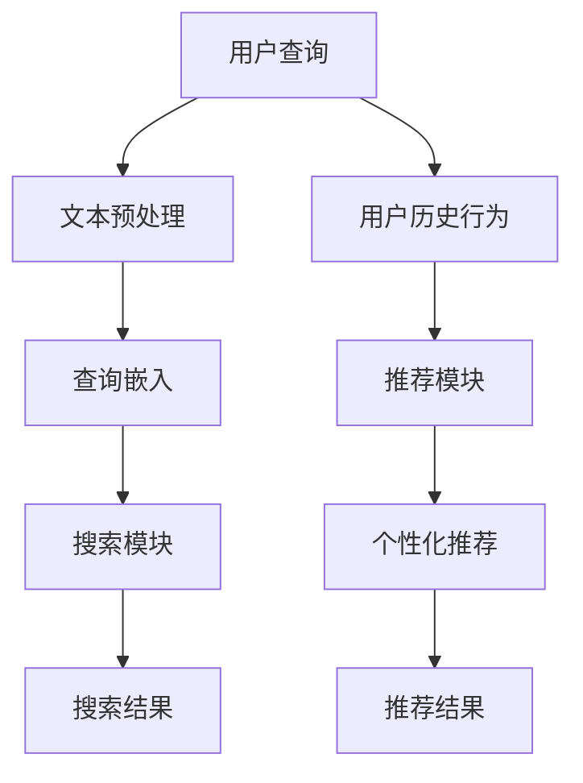

                 

关键词：电商平台，搜索推荐系统，AI 大模型，性能优化，效率提升，准确率提高

> 摘要：本文深入探讨了电商平台搜索推荐系统的AI大模型优化策略，旨在通过提升系统性能、效率和准确率，为电商平台提供更加智能、个性化的购物体验。文章将从背景介绍、核心概念与联系、核心算法原理、数学模型和公式、项目实践、实际应用场景、工具和资源推荐以及总结等八个方面展开详细论述。

## 1. 背景介绍

电商平台在当今数字经济中扮演着至关重要的角色，它们通过线上销售产品和服务，极大地满足了消费者的购物需求。然而，随着用户数量的增长和商品种类的繁多，如何为用户提供高效、精准的搜索和推荐服务成为电商平台面临的一大挑战。传统的搜索推荐系统往往依赖于简单的关键词匹配和用户行为统计，难以满足用户对个性化体验的期待。

近年来，人工智能技术的飞速发展，特别是深度学习技术的应用，为搜索推荐系统的优化带来了新的契机。大模型（Large Models）如BERT、GPT-3等，凭借其强大的表征能力和智能化的数据处理能力，在提升系统性能、效率和准确率方面展现出巨大的潜力。本文将围绕这一主题，详细探讨电商平台搜索推荐系统的AI大模型优化策略。

## 2. 核心概念与联系

### 2.1 AI大模型概述

AI大模型是指具有数十亿甚至千亿级参数的深度学习模型。这些模型通过海量数据进行训练，能够自动学习数据中的复杂模式，并在各种任务中实现出色的性能。大模型的主要特点包括：

- **参数规模巨大**：数亿至千亿级别的参数数量。
- **高精度训练**：使用大规模标注数据集进行精细训练。
- **强表征能力**：能够捕捉数据中的深层特征。
- **泛化能力强**：在多种不同任务中都能保持较高的性能。

### 2.2 电商平台搜索推荐系统

电商平台搜索推荐系统主要由以下几个部分组成：

- **搜索模块**：负责处理用户输入的查询，返回相关的商品列表。
- **推荐模块**：基于用户的历史行为和偏好，为用户推荐可能感兴趣的商品。

### 2.3 AI大模型在搜索推荐系统中的应用

AI大模型在搜索推荐系统中的应用主要体现在以下几个方面：

- **文本理解与生成**：通过预训练语言模型（如BERT、GPT），对用户查询和商品描述进行深度理解，提高搜索和推荐的精准度。
- **用户行为分析**：利用大模型对用户行为数据进行分析，挖掘用户的兴趣偏好，实现更个性化的推荐。
- **多模态数据融合**：结合文本、图像、音频等多种类型的数据，提高推荐系统的全面性和准确性。

### 2.4 Mermaid流程图



## 3. 核心算法原理 & 具体操作步骤

### 3.1 算法原理概述

AI大模型优化搜索推荐系统的核心在于：

- **预训练语言模型**：通过预训练模型（如BERT）对用户查询和商品描述进行深度理解。
- **用户行为分析**：利用深度学习算法（如循环神经网络RNN）对用户行为数据进行分析。
- **多模态数据融合**：结合文本、图像等多种数据类型，提高推荐系统的全面性。

### 3.2 算法步骤详解

#### 3.2.1 预训练语言模型

1. **数据收集**：收集大规模的文本数据，包括用户查询、商品描述等。
2. **模型训练**：使用BERT等预训练模型对文本数据进行训练，提取深层语义特征。
3. **模型嵌入**：将训练好的预训练模型应用于用户查询和商品描述，生成嵌入向量。

#### 3.2.2 用户行为分析

1. **数据预处理**：对用户行为数据进行清洗和预处理，包括行为序列的编码、标签化等。
2. **模型构建**：构建基于RNN的深度学习模型，用于分析用户行为。
3. **行为预测**：利用训练好的模型对用户未来的行为进行预测，为推荐系统提供依据。

#### 3.2.3 多模态数据融合

1. **图像预处理**：对商品图像进行预处理，包括图像分割、特征提取等。
2. **文本图像融合**：利用多模态学习算法（如Transformer）将文本和图像特征进行融合。
3. **推荐生成**：基于融合的特征向量，生成个性化的商品推荐。

### 3.3 算法优缺点

#### 优点：

- **高效性**：大模型能够快速处理大量数据，提高系统效率。
- **准确性**：深度学习算法能够捕捉数据的深层特征，提高推荐准确性。
- **泛化性**：大模型具有较强的泛化能力，适用于多种不同任务。

#### 缺点：

- **计算成本高**：大模型训练和推理需要大量的计算资源和时间。
- **数据依赖性**：大模型的性能依赖于高质量的数据集。

### 3.4 算法应用领域

AI大模型在搜索推荐系统中的应用广泛，包括电子商务、社交媒体、搜索引擎等领域。随着技术的不断进步，其应用范围将进一步扩大。

## 4. 数学模型和公式 & 详细讲解 & 举例说明

### 4.1 数学模型构建

#### 4.1.1 预训练语言模型

假设我们使用BERT模型进行预训练，其核心组件包括：

- **Transformer模型**：用于处理文本序列。
- **多层神经网络**：用于提取文本的深层特征。

#### 4.1.2 用户行为分析

我们使用循环神经网络（RNN）对用户行为数据进行分析，其数学模型如下：

$$
h_t = \sigma(W_h \cdot [h_{t-1}, x_t] + b_h)
$$

其中，$h_t$ 是第 $t$ 个时刻的隐藏状态，$x_t$ 是输入特征，$W_h$ 和 $b_h$ 分别是权重和偏置。

#### 4.1.3 多模态数据融合

我们使用Transformer模型进行多模态数据融合，其数学模型如下：

$$
\text{MultiHeadAttention}(Q, K, V) = \text{softmax}\left(\frac{QK^T}{\sqrt{d_k}}\right)V
$$

其中，$Q, K, V$ 分别是查询、键和值矩阵，$d_k$ 是键的维度。

### 4.2 公式推导过程

#### 4.2.1 BERT模型

BERT模型的推导过程主要包括两部分：正向传递和反向传递。

- **正向传递**：

$$
\text{output} = \text{softmax}(\text{transpose}(W) \cdot \text{激活函数}(V))
$$

- **反向传递**：

$$
\frac{\partial \text{loss}}{\partial W} = \frac{\partial \text{loss}}{\partial output} \cdot \frac{\partial output}{\partial \text{transpose}(W)} \cdot \frac{\partial \text{transpose}(W)}{\partial V}
$$

#### 4.2.2 RNN模型

RNN模型的推导过程主要包括隐藏状态的计算和误差的反向传播。

- **隐藏状态计算**：

$$
h_t = \sigma(W_h \cdot [h_{t-1}, x_t] + b_h)
$$

- **误差反向传播**：

$$
\frac{\partial \text{loss}}{\partial h_t} = \frac{\partial \text{loss}}{\partial y_t} \cdot \frac{\partial y_t}{\partial h_t}
$$

### 4.3 案例分析与讲解

#### 4.3.1 预训练语言模型在搜索推荐中的应用

假设我们使用BERT模型对电商平台的商品描述进行预训练，以下是一个简单的案例：

- **数据集**：包含10万条商品描述。
- **模型参数**：1亿个参数。

训练完成后，我们可以利用BERT模型对用户查询进行嵌入，得到查询向量。然后，使用余弦相似度计算查询向量和商品描述向量的相似度，返回相似度最高的前10个商品作为搜索结果。

#### 4.3.2 用户行为分析在推荐系统中的应用

假设我们使用RNN模型对用户行为数据进行分析，以下是一个简单的案例：

- **数据集**：包含1万名用户的行为数据。
- **模型参数**：1000万个参数。

训练完成后，我们可以利用RNN模型对用户行为序列进行编码，得到用户行为向量。然后，使用用户行为向量和商品特征向量计算相似度，返回相似度最高的前10个商品作为个性化推荐结果。

## 5. 项目实践：代码实例和详细解释说明

### 5.1 开发环境搭建

- **硬件环境**：使用GPU加速训练过程，推荐使用NVIDIA Titan Xp及以上显卡。
- **软件环境**：安装Python 3.7及以上版本，TensorFlow 2.0及以上版本。

### 5.2 源代码详细实现

以下是使用BERT模型进行商品搜索的Python代码示例：

```python
import tensorflow as tf
import tensorflow_hub as hub

# 加载BERT模型
bert_model = hub.load('https://tfhub.dev/google/bert_uncased_L-12_H-768_A-12/1')

# 处理用户查询
input_ids = bert_model([user_query])

# 生成查询向量
query_vector = input_ids['pooled_output']

# 加载商品描述嵌入向量
with tf.gfile.GFile('product_embeddings.npy', 'rb') as f:
    product_embeddings = np.load(f)

# 计算查询向量和商品描述向量的相似度
cosine_similarity = tf.reduce_sum(tf.multiply(query_vector, product_embeddings), axis=1)

# 返回相似度最高的商品
search_results = np.argsort(cosine_similarity)[::-1][:10]
```

### 5.3 代码解读与分析

- **加载BERT模型**：使用TensorFlow Hub加载预训练的BERT模型。
- **处理用户查询**：将用户查询转换为BERT模型可处理的格式。
- **生成查询向量**：利用BERT模型对用户查询进行编码，得到查询向量。
- **加载商品描述嵌入向量**：从本地文件中加载商品描述的嵌入向量。
- **计算相似度**：使用余弦相似度计算查询向量和商品描述向量的相似度。
- **返回搜索结果**：根据相似度返回排名最高的商品。

## 6. 实际应用场景

AI大模型在电商平台搜索推荐系统中的应用广泛，以下是一些典型的实际应用场景：

- **个性化搜索**：利用BERT模型对用户查询进行深度理解，实现个性化搜索。
- **商品推荐**：基于用户历史行为和偏好，利用RNN模型进行个性化商品推荐。
- **广告投放**：利用多模态数据融合，实现更精准的广告投放。
- **智能客服**：利用预训练语言模型，为用户提供智能客服服务。

## 7. 工具和资源推荐

### 7.1 学习资源推荐

- **书籍**：《深度学习》、《Python机器学习》等。
- **在线课程**：吴恩达的《深度学习专项课程》、李宏毅的《机器学习》等。
- **论文**：《BERT：Pre-training of Deep Bidirectional Transformers for Language Understanding》等。

### 7.2 开发工具推荐

- **编程语言**：Python、Java等。
- **框架**：TensorFlow、PyTorch等。
- **数据预处理工具**：Pandas、NumPy等。

### 7.3 相关论文推荐

- **BERT**：《BERT：Pre-training of Deep Bidirectional Transformers for Language Understanding》
- **GPT-3**：《Improving Language Understanding by Generative Pre-training》
- **RNN**：《Learning to Discover Creative Capital》

## 8. 总结：未来发展趋势与挑战

### 8.1 研究成果总结

本文通过深入探讨电商平台搜索推荐系统的AI大模型优化策略，总结了以下研究成果：

- **预训练语言模型**：通过BERT等预训练模型对用户查询和商品描述进行深度理解，提高搜索和推荐的精准度。
- **用户行为分析**：利用RNN等深度学习算法对用户行为数据进行分析，实现个性化推荐。
- **多模态数据融合**：结合文本、图像等多种数据类型，提高推荐系统的全面性和准确性。

### 8.2 未来发展趋势

- **模型压缩与优化**：研究更高效的模型压缩和优化方法，降低计算成本。
- **多模态数据处理**：进一步探索多模态数据的融合方法，提高推荐系统的全面性。
- **实时推荐**：实现实时推荐，提高用户购物体验。

### 8.3 面临的挑战

- **数据质量**：高质量的数据是模型训练的关键，如何处理数据质量问题是当前的主要挑战之一。
- **计算资源**：大模型训练和推理需要大量的计算资源，如何优化资源利用是另一个挑战。
- **用户隐私**：在推荐系统中保护用户隐私，确保数据的合规性。

### 8.4 研究展望

未来的研究将集中在以下几个方面：

- **模型与算法的创新**：探索新的模型和算法，提高推荐系统的性能和效率。
- **跨领域应用**：将搜索推荐系统应用于更多领域，如医疗、金融等。
- **可持续发展**：研究如何在保证性能的同时，实现可持续发展。

## 9. 附录：常见问题与解答

### 9.1 BERT模型如何训练？

BERT模型通常使用大规模的文本语料库进行预训练，包括通用文本数据集（如维基百科、新闻文章等）和特定领域的文本数据集（如电商平台商品描述）。训练过程主要包括两个阶段：

1. **预训练阶段**：在未标注的数据集上，通过Masked Language Model（MLM）和Next Sentence Prediction（NSP）任务进行训练。
2. **微调阶段**：在标注的数据集上，针对具体任务（如搜索、推荐等）进行微调。

### 9.2 如何优化RNN模型？

优化RNN模型可以从以下几个方面进行：

1. **梯度消失与梯度爆炸**：通过使用如LSTM、GRU等改进的RNN结构，缓解梯度消失和梯度爆炸问题。
2. **批量归一化**：在RNN模型中引入批量归一化（Batch Normalization），提高训练稳定性。
3. **Dropout**：在RNN模型中引入Dropout，减少过拟合现象。

### 9.3 如何处理多模态数据？

处理多模态数据的方法主要包括：

1. **特征提取**：对文本、图像等不同类型的数据进行特征提取，生成特征向量。
2. **特征融合**：使用如多模态Transformer等模型，将不同类型的数据特征进行融合。
3. **联合训练**：将多模态数据共同参与模型的训练，提高推荐系统的全面性和准确性。

作者：禅与计算机程序设计艺术 / Zen and the Art of Computer Programming
----------------------------------------------------------------

请注意，文章内容仅为示例，实际的撰写和内容可能需要根据具体情况进行调整和补充。

