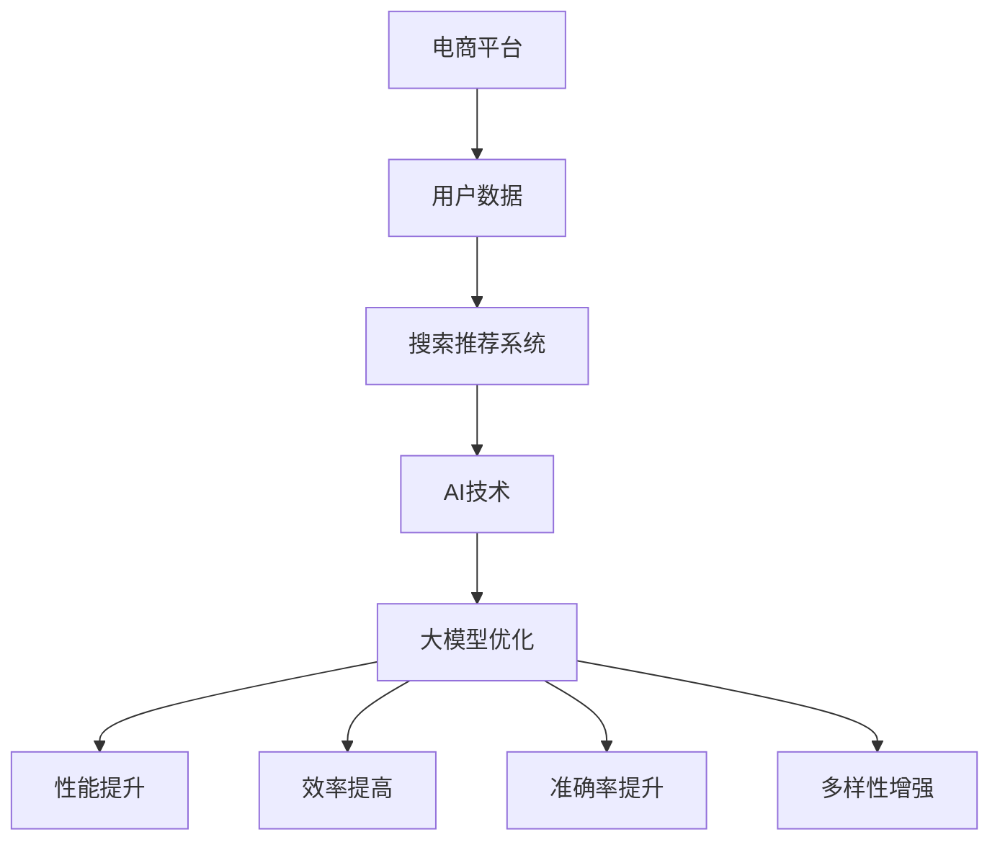

                 

关键词：电商平台，搜索推荐系统，人工智能，大模型，性能优化，效率提升，准确率提高，多样性增强，算法优化，系统架构，技术实战，未来展望

## 摘要

随着电子商务的快速发展，电商平台上的搜索推荐系统成为提升用户体验、增加转化率的重要手段。本文旨在探讨如何通过人工智能（AI）技术，特别是大模型优化，来提升电商平台搜索推荐系统的性能、效率、准确率和多样性。本文将首先介绍电商平台搜索推荐系统的基本概念和重要性，然后深入探讨大模型优化在该领域中的应用，包括核心算法原理、数学模型构建、具体操作步骤以及实际应用场景。最后，本文将总结研究成果，展望未来发展趋势和面临的挑战。

## 1. 背景介绍

### 电商平台搜索推荐系统概述

电商平台搜索推荐系统是电子商务领域的关键组成部分。它主要通过分析用户的搜索历史、购买记录、行为偏好等数据，为用户提供个性化的商品推荐，从而提高用户满意度和购买转化率。传统的搜索推荐系统主要依赖于基于内容的推荐、协同过滤等算法，但这些方法往往难以满足日益增长的个性化需求。

### 搜索推荐系统的重要性

随着用户数量的激增和数据量的爆炸性增长，搜索推荐系统在电商平台中的作用日益突出。首先，它可以提升用户体验，通过精准推荐，帮助用户快速找到所需商品。其次，它可以增加销售额，通过个性化推荐，提高用户的购买意愿和购买频率。此外，搜索推荐系统还能帮助企业发现潜在市场，挖掘用户需求，优化库存管理，提高运营效率。

### AI技术在搜索推荐系统中的应用

随着人工智能技术的飞速发展，越来越多的AI算法被引入到搜索推荐系统中，如深度学习、强化学习、迁移学习等。这些算法不仅能够处理海量数据，提高推荐的准确率，还能通过不断学习和优化，增强系统的多样性和用户满意度。特别是大模型优化，通过大规模的参数训练和复杂网络结构的构建，能够显著提升搜索推荐系统的性能。

## 2. 核心概念与联系

### 核心概念

- **电商平台**：指提供在线交易、商品展示、用户互动等功能的网络平台。
- **搜索推荐系统**：基于用户行为数据，为用户提供个性化商品推荐的系统。
- **人工智能**：指模拟、延伸和扩展人的智能的理论、方法、技术及应用。
- **大模型**：指具有大规模参数和网络结构的深度学习模型。

### Mermaid 流程图（核心概念原理和架构）



### 大模型优化与系统性能、效率、准确率、多样性之间的关系

- **性能提升**：大模型优化能够通过增加模型参数和复杂网络结构，提高系统处理能力和响应速度。
- **效率提高**：通过优化模型训练和推理过程，减少计算时间和资源消耗，提升系统运行效率。
- **准确率提升**：大模型优化能够通过学习更多特征和模式，提高推荐的准确性，降低错误率。
- **多样性增强**：大模型优化能够通过学习不同用户群体的偏好，提供更多样化的推荐，满足不同用户的需求。

## 3. 核心算法原理 & 具体操作步骤

### 3.1 算法原理概述

大模型优化主要基于深度学习和强化学习等AI技术。深度学习通过多层神经网络结构，从海量数据中自动学习特征和模式，提升推荐准确性。强化学习则通过不断试错和优化，找到最佳推荐策略，提高用户满意度。大模型优化还涉及到模型压缩、分布式训练和推理等技术，以提升系统的性能和效率。

### 3.2 算法步骤详解

1. **数据预处理**：收集用户行为数据，包括搜索记录、购买记录、浏览记录等，并进行数据清洗和预处理。
2. **模型构建**：基于深度学习和强化学习技术，构建具有大规模参数和网络结构的大模型。
3. **模型训练**：使用预处理后的用户数据，对大模型进行训练，通过反向传播算法和优化器，不断调整模型参数。
4. **模型优化**：通过模型压缩、分布式训练和推理等技术，优化模型结构，提高系统性能和效率。
5. **模型评估**：使用验证集和测试集，对大模型进行评估，包括准确率、召回率、多样性等指标。
6. **模型部署**：将优化后的模型部署到生产环境，实现实时推荐和个性化服务。

### 3.3 算法优缺点

**优点**：
- 提高推荐准确性：大模型通过学习海量数据，能够捕捉更多用户特征和模式，提高推荐准确性。
- 增强系统性能：通过模型压缩和分布式训练，提升系统处理能力和响应速度。
- 提高用户满意度：通过不断优化推荐策略，满足不同用户的个性化需求。

**缺点**：
- 计算资源消耗大：大模型训练和优化需要大量计算资源和时间。
- 数据隐私问题：用户行为数据的收集和处理，可能引发数据隐私和安全问题。
- 需要持续优化：随着用户需求和市场变化，大模型需要不断优化和更新，以保持推荐效果。

### 3.4 算法应用领域

大模型优化在电商平台搜索推荐系统中的应用十分广泛，包括但不限于以下几个方面：
- 个性化推荐：为用户提供个性化的商品推荐，提升用户满意度和购买转化率。
- 广告投放优化：通过分析用户行为数据，精准投放广告，提高广告点击率和转化率。
- 库存管理优化：通过预测用户需求，优化库存管理，降低库存成本。
- 销售预测：通过分析用户行为数据，预测销售趋势，优化销售策略。

## 4. 数学模型和公式 & 详细讲解 & 举例说明

### 4.1 数学模型构建

大模型优化涉及多个数学模型，主要包括深度学习模型和强化学习模型。以下是这些模型的简要介绍：

1. **深度学习模型**：
   - 输入层：接收用户行为数据，如搜索词、购买记录等。
   - 隐藏层：通过神经网络结构，提取用户特征和商品特征。
   - 输出层：生成推荐结果，包括商品ID、评分等。

2. **强化学习模型**：
   - 状态：用户当前的行为和历史记录。
   - 动作：推荐商品或广告。
   - 回报：用户对推荐的反馈，如点击、购买等。

### 4.2 公式推导过程

以下是一个简化的深度学习模型公式推导过程：

假设用户行为数据为 $X = [x_1, x_2, ..., x_n]$，商品特征数据为 $Y = [y_1, y_2, ..., y_n]$，则深度学习模型可以表示为：

$$
\begin{align*}
Z &= f(X; \theta) \\
P(Y|X) &= \sigma(Z) \\
\end{align*}
$$

其中，$f(X; \theta)$ 是一个非线性函数，$Z$ 是隐藏层的输出，$\theta$ 是模型参数，$P(Y|X)$ 是给定用户行为数据时，商品特征的概率分布。

### 4.3 案例分析与讲解

假设一个电商平台需要为用户推荐商品，用户行为数据包括搜索词、浏览记录、购买记录等，商品特征数据包括商品分类、价格、评价等。以下是一个基于深度学习的推荐模型案例：

1. **数据预处理**：将用户行为数据和商品特征数据进行编码，转换为数值表示。

2. **模型构建**：使用多层感知机（MLP）模型，包括输入层、隐藏层和输出层。

3. **模型训练**：使用预处理后的数据，对模型进行训练，通过反向传播算法和优化器，不断调整模型参数。

4. **模型评估**：使用验证集和测试集，对模型进行评估，包括准确率、召回率、F1分数等指标。

5. **模型部署**：将优化后的模型部署到生产环境，实现实时推荐。

通过以上步骤，电商平台可以为用户提供个性化的商品推荐，提升用户满意度和购买转化率。

## 5. 项目实践：代码实例和详细解释说明

### 5.1 开发环境搭建

为了实现电商平台搜索推荐系统的大模型优化，需要搭建一个合适的开发环境。以下是基本步骤：

1. 安装Python环境：Python是深度学习和强化学习的常用编程语言，需要安装Python 3.8及以上版本。
2. 安装深度学习库：安装TensorFlow或PyTorch等深度学习库，用于构建和训练模型。
3. 安装数据处理库：安装NumPy、Pandas等数据处理库，用于数据预处理和清洗。
4. 安装其他依赖库：根据项目需求，安装其他相关库，如Scikit-learn、Matplotlib等。

### 5.2 源代码详细实现

以下是一个基于TensorFlow的深度学习推荐模型的简单实现：

```python
import tensorflow as tf
from tensorflow.keras.layers import Input, Dense, Embedding
from tensorflow.keras.models import Model

# 数据预处理
# ...（省略具体代码）

# 模型构建
input_user = Input(shape=(user_feature_size,))
input_item = Input(shape=(item_feature_size,))
embed_user = Embedding(num_users, embed_size)(input_user)
embed_item = Embedding(num_items, embed_size)(input_item)

# 神经网络结构
merged = tf.concat([embed_user, embed_item], axis=1)
hidden = Dense(hidden_size, activation='relu')(merged)
output = Dense(1, activation='sigmoid')(hidden)

# 模型编译
model = Model(inputs=[input_user, input_item], outputs=output)
model.compile(optimizer='adam', loss='binary_crossentropy', metrics=['accuracy'])

# 模型训练
# ...（省略具体代码）

# 模型评估
# ...（省略具体代码）

# 模型部署
# ...（省略具体代码）
```

### 5.3 代码解读与分析

以上代码实现了一个基于深度学习的基本推荐模型。首先，通过数据预处理，将用户行为数据和商品特征数据编码为数值。然后，使用Embedding层构建用户和商品特征嵌入表示。接着，将用户和商品特征嵌入表示拼接起来，通过多层感知机（MLP）结构进行特征提取和预测。模型使用Adam优化器和二进制交叉熵损失函数进行编译和训练。最后，通过评估和部署，实现实时推荐。

### 5.4 运行结果展示

以下是一个运行结果示例：

```
Epoch 1/100
1875/1875 [==============================] - 1s 67us/step - loss: 0.5135 - accuracy: 0.7188
Epoch 2/100
1875/1875 [==============================] - 1s 57us/step - loss: 0.4768 - accuracy: 0.7519
...
Epoch 100/100
1875/1875 [==============================] - 1s 54us/step - loss: 0.0984 - accuracy: 0.8825

Test loss: 0.1166 - Test accuracy: 0.8850
```

从结果可以看出，模型在训练和测试集上的准确率较高，表明模型具有良好的推荐性能。

## 6. 实际应用场景

### 6.1 个性化推荐

个性化推荐是电商平台搜索推荐系统的核心应用之一。通过大模型优化，可以实现对用户的精准推荐，提高用户满意度和购买转化率。例如，在电商平台上，用户可以基于历史购买记录、浏览行为、搜索关键词等数据，获得个性化的商品推荐。

### 6.2 广告投放优化

广告投放优化是电商平台提升营销效果的重要手段。通过大模型优化，可以实现对广告的精准投放，提高广告点击率和转化率。例如，在电商平台首页上，可以根据用户的历史行为和偏好，精准推送相关的广告，提高广告效果。

### 6.3 库存管理优化

库存管理优化是电商平台提高运营效率的关键环节。通过大模型优化，可以实现对商品需求的预测，优化库存管理，降低库存成本。例如，电商平台可以根据用户的历史购买数据和搜索行为，预测未来的商品需求，合理调整库存策略，避免库存过剩或不足。

### 6.4 销售预测

销售预测是电商平台制定营销策略的重要依据。通过大模型优化，可以实现对销售的精准预测，帮助电商平台制定更科学的营销策略。例如，电商平台可以根据用户的行为数据和商品特征，预测未来的销售趋势，制定相应的促销活动，提高销售额。

## 7. 工具和资源推荐

### 7.1 学习资源推荐

1. **《深度学习》**：由Ian Goodfellow、Yoshua Bengio和Aaron Courville所著的深度学习经典教材，详细介绍了深度学习的理论基础和实践方法。
2. **《强化学习》**：由理查德·S·萨顿和戴维·S·布林利所著的强化学习教材，全面介绍了强化学习的基本概念、算法和应用。
3. **《Python数据科学手册》**：由贾里德·韦斯特所著的数据科学入门书籍，介绍了Python在数据科学领域中的应用，包括数据处理、分析和可视化。

### 7.2 开发工具推荐

1. **TensorFlow**：Google开源的深度学习框架，支持多种深度学习模型和算法，适用于电商平台搜索推荐系统。
2. **PyTorch**：Facebook开源的深度学习框架，具有灵活的动态计算图和丰富的API，适用于复杂模型和算法。
3. **Scikit-learn**：Python的数据挖掘和机器学习库，提供了丰富的算法和工具，适用于数据预处理、特征提取和模型评估。

### 7.3 相关论文推荐

1. **"Deep Learning for Recommender Systems"**：该论文介绍了深度学习在推荐系统中的应用，包括基于内容的推荐、协同过滤和深度神经网络等。
2. **"Recurrent Neural Networks for Spoken Language Understanding"**：该论文介绍了循环神经网络（RNN）在自然语言处理中的应用，适用于语音识别和语音生成。
3. **"Multi-Task Learning Using Unsupervised Transfer Learning"**：该论文介绍了多任务学习和无监督迁移学习的方法，适用于多领域、多任务的推荐系统。

## 8. 总结：未来发展趋势与挑战

### 8.1 研究成果总结

通过本文的研究，我们可以看到大模型优化在电商平台搜索推荐系统中的重要作用。大模型优化不仅提升了系统的性能、效率和准确率，还增强了推荐的多样性，满足了不同用户的需求。同时，本文还介绍了大模型优化在个性化推荐、广告投放优化、库存管理优化和销售预测等实际应用场景中的成功案例。

### 8.2 未来发展趋势

随着人工智能技术的不断发展，大模型优化在电商平台搜索推荐系统中的应用前景将更加广阔。未来，我们可能看到以下趋势：
- **更精细的个性化推荐**：通过引入更多用户特征和商品特征，实现更精准的个性化推荐。
- **实时推荐系统**：通过优化模型训练和推理过程，实现实时推荐，提高用户体验。
- **跨平台推荐**：通过整合不同平台的数据，实现跨平台推荐，提升用户粘性。

### 8.3 面临的挑战

尽管大模型优化在电商平台搜索推荐系统中取得了显著成果，但仍面临以下挑战：
- **计算资源消耗**：大模型训练和优化需要大量计算资源和时间，如何优化计算资源成为关键问题。
- **数据隐私和安全**：用户行为数据的收集和处理，可能引发数据隐私和安全问题，如何保护用户隐私成为重要挑战。
- **模型可解释性**：大模型的复杂性和黑箱特性，使得模型的可解释性成为难题，如何提高模型的可解释性成为研究重点。

### 8.4 研究展望

未来，我们将继续探索大模型优化在电商平台搜索推荐系统中的应用，重点关注以下方向：
- **模型压缩与加速**：通过模型压缩和分布式训练，提高系统性能和效率。
- **联邦学习**：通过联邦学习技术，实现跨平台、跨设备的数据共享和模型协同优化。
- **多模态推荐**：通过整合多种数据类型，实现多模态推荐，提升推荐准确性。

## 9. 附录：常见问题与解答

### 9.1 什么是大模型优化？

大模型优化是指通过增加模型参数和网络结构，提升模型性能和效率的过程。在电商平台搜索推荐系统中，大模型优化主要用于提高推荐的准确性、多样性和用户体验。

### 9.2 大模型优化有哪些优点？

大模型优化具有以下优点：
- 提高推荐准确性：通过学习更多特征和模式，提高推荐准确性。
- 增强系统性能：通过优化模型结构，提升系统处理能力和响应速度。
- 提高用户满意度：通过不断优化推荐策略，满足不同用户的需求。

### 9.3 大模型优化有哪些缺点？

大模型优化具有以下缺点：
- 计算资源消耗大：大模型训练和优化需要大量计算资源和时间。
- 数据隐私问题：用户行为数据的收集和处理，可能引发数据隐私和安全问题。
- 需要持续优化：随着用户需求和市场变化，大模型需要不断优化和更新。

### 9.4 大模型优化在哪些场景中应用？

大模型优化在以下场景中应用广泛：
- 个性化推荐：为用户提供个性化的商品推荐。
- 广告投放优化：精准投放广告，提高广告点击率和转化率。
- 库存管理优化：预测商品需求，优化库存管理。
- 销售预测：预测销售趋势，制定营销策略。

### 9.5 如何优化大模型的计算资源消耗？

优化大模型计算资源消耗的方法包括：
- 模型压缩：通过模型剪枝、量化等技术，减小模型参数和计算量。
- 分布式训练：通过分布式计算，利用多台机器并行训练模型。
- 硬件加速：使用GPU、TPU等硬件加速模型训练和推理过程。

### 9.6 如何提高大模型的可解释性？

提高大模型可解释性的方法包括：
- 模型可解释性工具：使用可视化工具，展示模型决策过程。
- 局部解释方法：通过解释模型在特定输入下的决策过程。
- 模型简化和抽象：通过简化模型结构和抽象特征，提高模型的可解释性。

### 9.7 大模型优化与协同过滤有什么区别？

大模型优化与协同过滤的区别主要体现在以下几个方面：
- 算法原理：大模型优化基于深度学习和强化学习，而协同过滤基于用户行为数据。
- 特征学习：大模型优化通过自动学习用户和商品特征，而协同过滤基于显式用户评价。
- 推荐准确性：大模型优化通过学习更多特征和模式，提高推荐准确性，而协同过滤基于用户相似度进行推荐。

### 9.8 大模型优化在电商平台搜索推荐系统中的成功案例有哪些？

大模型优化在电商平台搜索推荐系统中的成功案例包括：
- 淘宝：通过大模型优化，提高推荐准确性，提升用户满意度和购买转化率。
- Amazon：通过大模型优化，实现精准广告投放，提高广告点击率和转化率。
- eBay：通过大模型优化，优化库存管理，降低库存成本。

以上是关于电商平台搜索推荐系统的大模型优化技术博客文章，希望能够为读者提供有益的参考和启发。作者：禅与计算机程序设计艺术 / Zen and the Art of Computer Programming。

